# AI Model Providers

<cite>
**Referenced Files in This Document**
- [api/config.py](file://api/config.py)
- [api/openai_client.py](file://api/openai_client.py)
- [api/azureai_client.py](file://api/azureai_client.py)
- [api/bedrock_client.py](file://api/bedrock_client.py)
- [api/dashscope_client.py](file://api/dashscope_client.py)
- [api/github_copilot_client.py](file://api/github_copilot_client.py)
- [api/google_embedder_client.py](file://api/google_embedder_client.py)
- [api/openrouter_client.py](file://api/openrouter_client.py)
- [api/ollama_patch.py](file://api/ollama_patch.py)
- [api/tools/embedder.py](file://api/tools/embedder.py)
- [api/logging_config.py](file://api/logging_config.py)
- [api/config/generator.json](file://api/config/generator.json)
- [api/config/embedder.json](file://api/config/embedder.json)
- [api/config/generator.github_copilot.json](file://api/config/generator.github_copilot.json)
- [api/config/embedder.github_copilot.json](file://api/config/embedder.github_copilot.json)
- [PROVIDER_SETUP_GUIDE.md](file://PROVIDER_SETUP_GUIDE.md)
- [tests/unit/test_provider_token_limits.py](file://tests/unit/test_provider_token_limits.py)
</cite>

## Table of Contents
1. [Introduction](#introduction)
2. [Project Structure](#project-structure)
3. [Core Components](#core-components)
4. [Architecture Overview](#architecture-overview)
5. [Detailed Component Analysis](#detailed-component-analysis)
6. [Dependency Analysis](#dependency-analysis)
7. [Performance Considerations](#performance-considerations)
8. [Troubleshooting Guide](#troubleshooting-guide)
9. [Conclusion](#conclusion)
10. [Appendices](#appendices)

## Introduction
This document explains DeepWiki-Open’s multi-provider AI model integration system. It covers the provider-based architecture supporting Google Gemini, OpenAI, OpenRouter, Azure OpenAI, Amazon Bedrock, DashScope, and GitHub Copilot models. You will learn how providers are configured, how authentication is handled, and how to customize models, manage tokens and limits, and optimize performance. Practical guidance is included for switching providers, adding custom providers, and handling provider-specific features such as streaming and embeddings.

## Project Structure
DeepWiki-Open organizes provider integrations under the api/ directory with a shared configuration-driven architecture:
- Provider clients: per-provider ModelClient implementations
- Central configuration loader: resolves provider classes, models, and defaults
- Embedder selection utilities: choose embedder based on configuration or flags
- Logging configuration: consistent logging across providers
- Configuration JSON files: define providers, default models, and model parameters

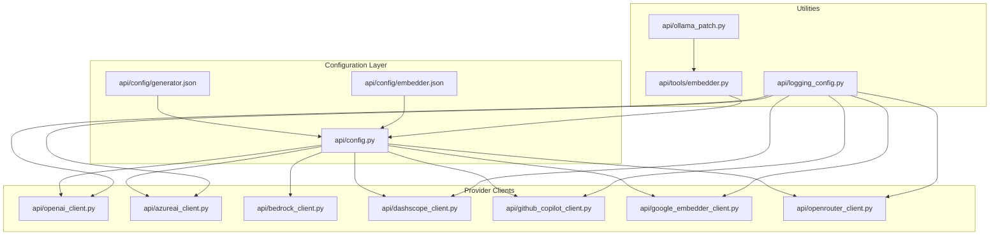

**Diagram sources**
- [api/config.py](file://api/config.py#L61-L168)
- [api/openai_client.py](file://api/openai_client.py#L120-L200)
- [api/azureai_client.py](file://api/azureai_client.py#L118-L232)
- [api/bedrock_client.py](file://api/bedrock_client.py#L20-L104)
- [api/dashscope_client.py](file://api/dashscope_client.py#L115-L156)
- [api/github_copilot_client.py](file://api/github_copilot_client.py#L30-L92)
- [api/google_embedder_client.py](file://api/google_embedder_client.py#L20-L77)
- [api/openrouter_client.py](file://api/openrouter_client.py#L19-L70)
- [api/tools/embedder.py](file://api/tools/embedder.py#L6-L59)
- [api/logging_config.py](file://api/logging_config.py#L12-L78)

**Section sources**
- [api/config.py](file://api/config.py#L61-L168)
- [api/config/generator.json](file://api/config/generator.json#L1-L101)
- [api/config/embedder.json](file://api/config/embedder.json#L1-L35)

## Core Components
- Provider configuration loader: loads generator and embedder configurations, resolves client classes, and constructs model client factories.
- Provider clients: thin wrappers around external APIs, handling authentication, input conversion, streaming, and response parsing.
- Embedder selection utility: chooses the appropriate embedder based on configuration or explicit flags.
- Logging configuration: centralized logging with rotation and environment controls.

Key responsibilities:
- Centralized provider resolution and model configuration
- Provider-specific authentication and base URL handling
- Streaming and non-streaming call handling
- Embedding normalization and usage tracking
- Logging and error propagation

**Section sources**
- [api/config.py](file://api/config.py#L104-L182)
- [api/tools/embedder.py](file://api/tools/embedder.py#L6-L59)
- [api/logging_config.py](file://api/logging_config.py#L12-L78)

## Architecture Overview
The system uses a configuration-driven provider architecture:
- Configuration files define providers, default models, and model parameters.
- The configuration loader maps provider IDs to client classes and builds model client factories.
- Embedder selection logic chooses the correct embedder configuration based on environment or flags.
- Provider clients encapsulate API specifics, authentication, and response parsing.

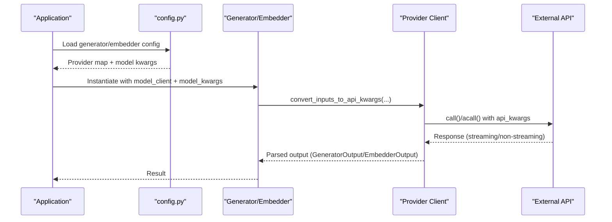

**Diagram sources**
- [api/config.py](file://api/config.py#L381-L464)
- [api/openai_client.py](file://api/openai_client.py#L281-L394)
- [api/dashscope_client.py](file://api/dashscope_client.py#L316-L390)
- [api/github_copilot_client.py](file://api/github_copilot_client.py#L114-L209)

## Detailed Component Analysis

### Provider Configuration Loader
- Loads generator and embedder JSON configs, replacing environment placeholders.
- Resolves client classes from a registry and sets model_client on each provider.
- Builds model client factories for providers like iFlow/OpenAI that require runtime base_url/env configuration.
- Exposes helpers to select embedder type and check embedder backend.

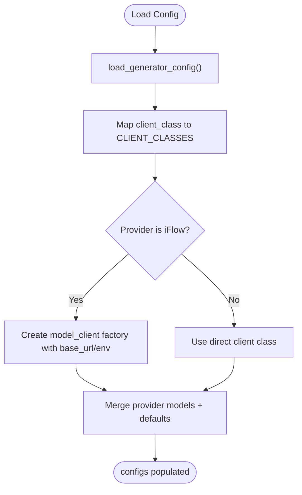

**Diagram sources**
- [api/config.py](file://api/config.py#L127-L182)
- [api/config.py](file://api/config.py#L381-L464)

**Section sources**
- [api/config.py](file://api/config.py#L104-L182)
- [api/config.py](file://api/config.py#L381-L464)

### OpenAI Provider
- Supports chat completions, embeddings, and image generation.
- Streaming and non-streaming modes; non-streaming calls are converted to streaming internally for unified parsing.
- Authentication via environment variable; optional base_url override for third-party/self-hosted endpoints.
- Usage tracking and token estimation helpers.

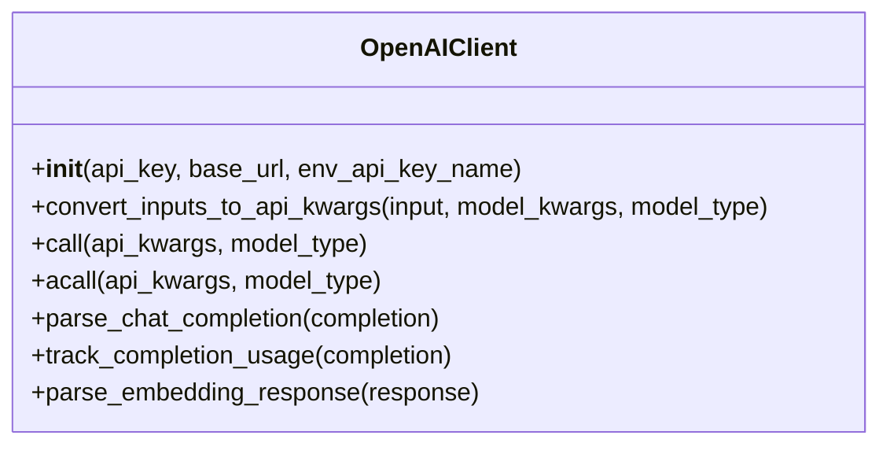

**Diagram sources**
- [api/openai_client.py](file://api/openai_client.py#L120-L200)
- [api/openai_client.py](file://api/openai_client.py#L281-L394)

**Section sources**
- [api/openai_client.py](file://api/openai_client.py#L120-L200)
- [api/openai_client.py](file://api/openai_client.py#L411-L493)
- [api/config/generator.json](file://api/config/generator.json#L66-L99)

### Azure OpenAI Provider
- Supports chat completions and embeddings via Azure OpenAI SDK.
- Authentication via API key or Azure AD token provider.
- Requires endpoint and API version; initializes sync/async clients accordingly.

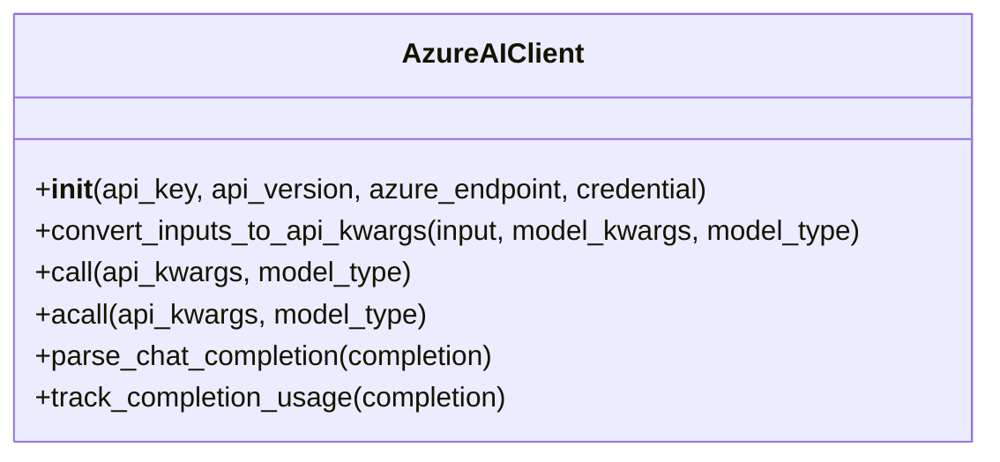

**Diagram sources**
- [api/azureai_client.py](file://api/azureai_client.py#L118-L232)
- [api/azureai_client.py](file://api/azureai_client.py#L348-L450)

**Section sources**
- [api/azureai_client.py](file://api/azureai_client.py#L195-L289)

### Amazon Bedrock Provider
- Supports text generation via Bedrock Runtime using provider-specific request formatting.
- Supports multiple providers (Anthropic, Amazon, Cohere, AI21) with tailored prompt formatting.
- Uses boto3 session with optional role assumption for credentials.

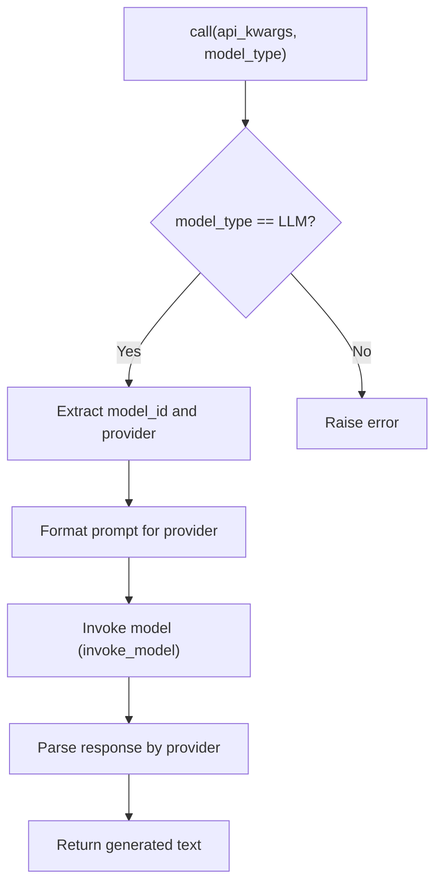

**Diagram sources**
- [api/bedrock_client.py](file://api/bedrock_client.py#L226-L290)
- [api/bedrock_client.py](file://api/bedrock_client.py#L115-L220)

**Section sources**
- [api/bedrock_client.py](file://api/bedrock_client.py#L20-L104)

### DashScope (Alibaba Cloud) Provider
- Compatible with OpenAI client interface; uses OpenAI SDK against DashScope base URL.
- Embedding batching constrained to 25; includes caching and robust error handling.
- Adds workspace ID to headers when available.

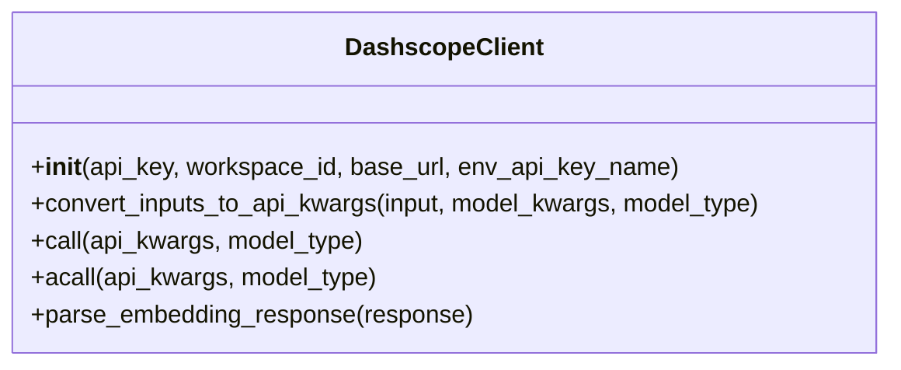

**Diagram sources**
- [api/dashscope_client.py](file://api/dashscope_client.py#L115-L156)
- [api/dashscope_client.py](file://api/dashscope_client.py#L316-L390)

**Section sources**
- [api/dashscope_client.py](file://api/dashscope_client.py#L131-L207)
- [api/dashscope_client.py](file://api/dashscope_client.py#L402-L493)

### GitHub Copilot Provider
- Uses LiteLLM with automatic OAuth2; no API key required.
- Supports chat and embeddings; adds required IDE headers for Copilot.
- Includes enhanced streaming response handling and JSON flattening utilities for malformed chunks.

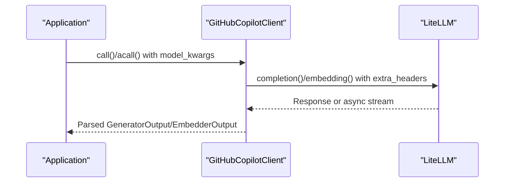

**Diagram sources**
- [api/github_copilot_client.py](file://api/github_copilot_client.py#L519-L575)
- [api/github_copilot_client.py](file://api/github_copilot_client.py#L665-L740)

**Section sources**
- [api/github_copilot_client.py](file://api/github_copilot_client.py#L30-L92)
- [api/github_copilot_client.py](file://api/github_copilot_client.py#L519-L663)

### Google Embeddings Provider
- Dedicated client for Google AI embeddings; supports single and batch embeddings.
- Converts inputs to Google’s embed_content format and parses responses into EmbedderOutput.

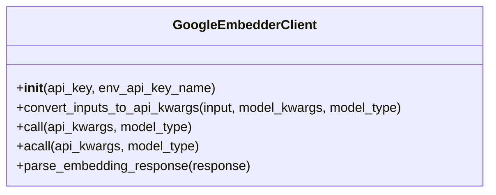

**Diagram sources**
- [api/google_embedder_client.py](file://api/google_embedder_client.py#L20-L77)
- [api/google_embedder_client.py](file://api/google_embedder_client.py#L141-L184)

**Section sources**
- [api/google_embedder_client.py](file://api/google_embedder_client.py#L20-L77)

### OpenRouter Provider
- Unified API to access hundreds of models through a single endpoint.
- Uses direct HTTP requests with aiohttp for async streaming; returns generators for streamed content.
- Adds XML sanitization for wiki_structure responses.

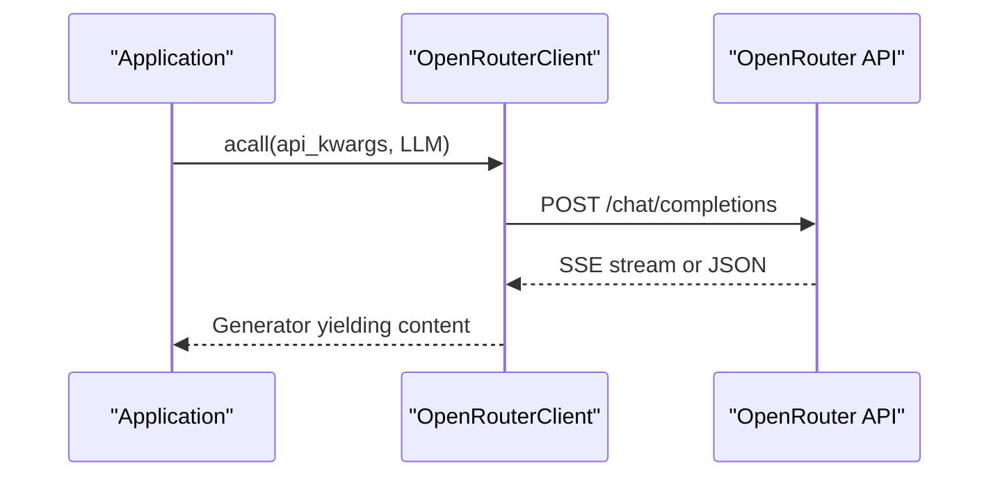

**Diagram sources**
- [api/openrouter_client.py](file://api/openrouter_client.py#L112-L180)
- [api/openrouter_client.py](file://api/openrouter_client.py#L395-L458)

**Section sources**
- [api/openrouter_client.py](file://api/openrouter_client.py#L19-L70)
- [api/openrouter_client.py](file://api/openrouter_client.py#L112-L180)

### Embedder Selection Utility
- Chooses embedder configuration based on explicit type, legacy flags, or auto-detected type from configuration.
- Creates an Embedder with the selected model client and model kwargs.

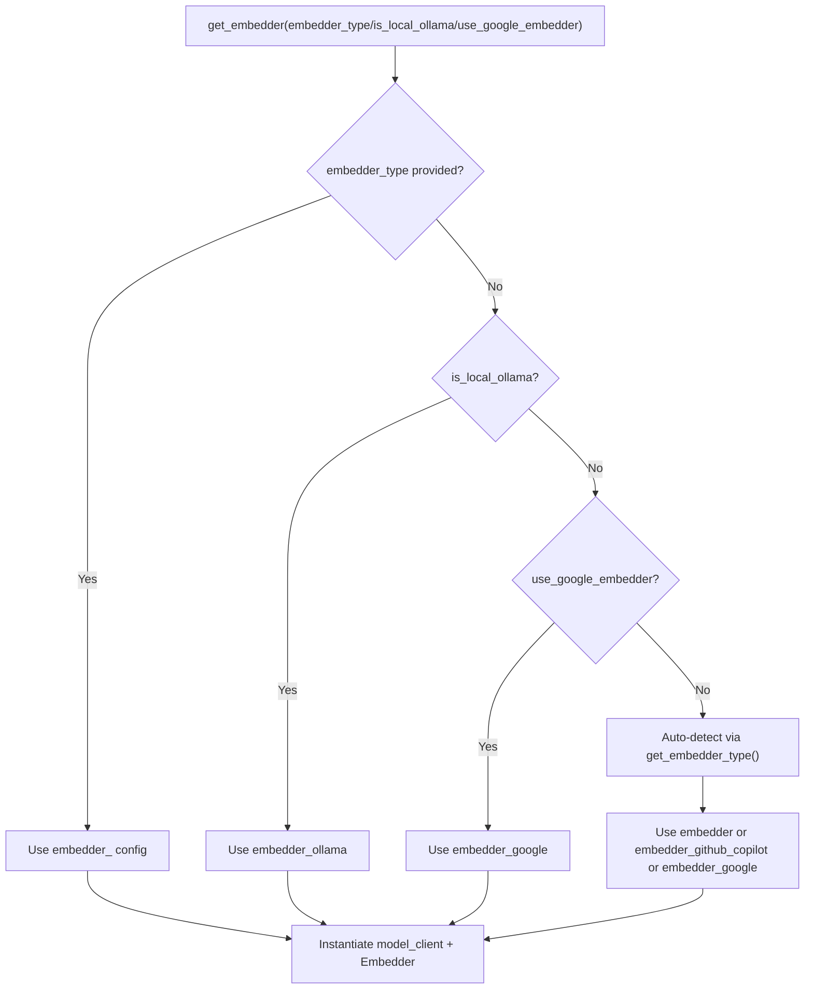

**Diagram sources**
- [api/tools/embedder.py](file://api/tools/embedder.py#L6-L59)

**Section sources**
- [api/tools/embedder.py](file://api/tools/embedder.py#L6-L59)

### Logging Configuration
- Centralized logging with rotating file handler and console handler.
- Environment-controlled log level, file path, max size, and backup count.
- Filters noisy “Detected file change” messages.

**Section sources**
- [api/logging_config.py](file://api/logging_config.py#L12-L78)

## Dependency Analysis
Provider clients depend on:
- External SDKs/packages (OpenAI, Azure, boto3, LiteLLM, google-generativeai)
- AdalFlow core abstractions (ModelClient, GeneratorOutput, EmbedderOutput)
- Configuration loader for environment variables and model parameters

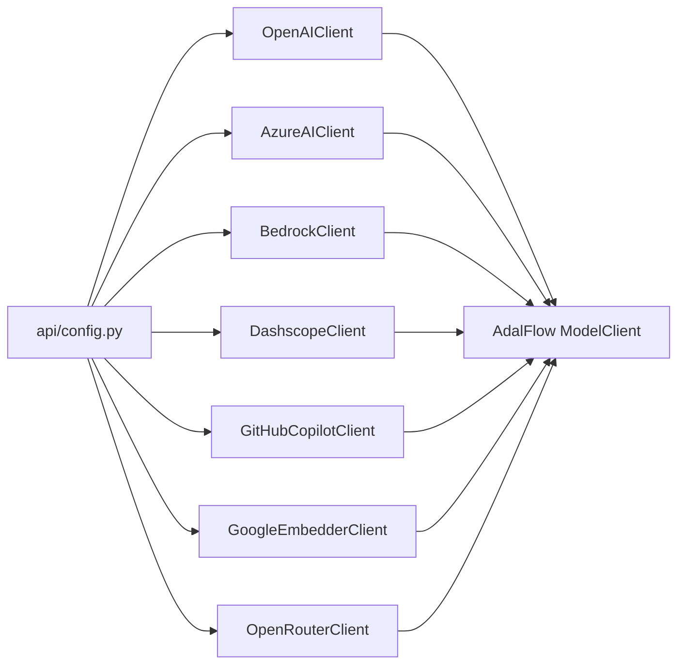

**Diagram sources**
- [api/config.py](file://api/config.py#L61-L71)
- [api/openai_client.py](file://api/openai_client.py#L43-L51)
- [api/azureai_client.py](file://api/azureai_client.py#L41-L63)
- [api/bedrock_client.py](file://api/bedrock_client.py#L11-L13)
- [api/dashscope_client.py](file://api/dashscope_client.py#L42-L53)
- [api/github_copilot_client.py](file://api/github_copilot_client.py#L20-L26)
- [api/google_embedder_client.py](file://api/google_embedder_client.py#L8-L15)
- [api/openrouter_client.py](file://api/openrouter_client.py#L10-L15)

**Section sources**
- [api/config.py](file://api/config.py#L61-L71)

## Performance Considerations
- Streaming vs non-streaming: OpenAI client converts non-streaming calls to streaming for consistent parsing.
- Embedding batching: DashScope caps batch size at 25; Ollama does not support batch embeddings in the client and requires per-document processing.
- Token limits: Provider-specific token limits are enforced at the data pipeline level to avoid truncation and preserve semantics.
- Retry/backoff: Backoff decorators applied to provider calls to handle transient failures.

Practical tips:
- Prefer streaming for responsive UIs.
- Use provider-specific batch sizes (e.g., DashScope 25) to avoid API errors.
- Monitor token counts per provider to prevent oversized inputs.

**Section sources**
- [api/openai_client.py](file://api/openai_client.py#L422-L493)
- [api/dashscope_client.py](file://api/dashscope_client.py#L724-L734)
- [api/ollama_patch.py](file://api/ollama_patch.py#L62-L105)
- [tests/unit/test_provider_token_limits.py](file://tests/unit/test_provider_token_limits.py#L18-L48)

## Troubleshooting Guide
Common issues and resolutions:
- Missing environment variables:
  - OpenAI: ensure the API key environment variable is set.
  - Azure OpenAI: ensure endpoint and API version are set; optionally provide a credential.
  - DashScope: ensure API key is set; workspace ID is optional.
  - GitHub Copilot: no API key required; relies on automatic OAuth2.
- Authentication errors:
  - Azure OpenAI: verify API key or AAD token provider setup.
  - DashScope: confirm API key validity and region availability.
  - GitHub Copilot: ensure VS Code Copilot is working; OAuth2 is automatic.
- Streaming anomalies:
  - DashScope: non-streaming calls are forced to disable thinking to avoid validation errors.
  - GitHub Copilot: malformed chunks are repaired using JSON flattening utilities.
- Logging:
  - Adjust log level and file path via environment variables; logs rotate automatically.

**Section sources**
- [api/openai_client.py](file://api/openai_client.py#L161-L216)
- [api/azureai_client.py](file://api/azureai_client.py#L233-L290)
- [api/dashscope_client.py](file://api/dashscope_client.py#L186-L207)
- [api/github_copilot_client.py](file://api/github_copilot_client.py#L93-L107)
- [api/logging_config.py](file://api/logging_config.py#L12-L78)

## Conclusion
DeepWiki-Open’s provider architecture cleanly separates configuration from implementation, enabling seamless switching among multiple AI providers. With standardized client interfaces, robust authentication handling, and provider-specific optimizations, the system supports diverse deployment scenarios—from zero-config GitHub Copilot to enterprise-grade Azure OpenAI and DashScope. Use the configuration files and utilities to tailor models, manage tokens, and optimize performance for your environment.

## Appendices

### Provider Setup and Switching
- Use the setup script to quickly switch providers and back up configurations.
- Manual configuration involves copying provider-specific generator and embedder JSON files into the default locations.

**Section sources**
- [PROVIDER_SETUP_GUIDE.md](file://PROVIDER_SETUP_GUIDE.md#L1-L156)
- [api/config/generator.github_copilot.json](file://api/config/generator.github_copilot.json#L1-L35)
- [api/config/embedder.github_copilot.json](file://api/config/embedder.github_copilot.json#L1-L26)

### Enterprise Deployment Notes
- Private endpoints: OpenAI client supports base_url overrides; Azure OpenAI requires endpoint and API version.
- Custom model configurations: provider JSON files define default models and per-model parameters; adjust as needed.
- Rate limiting and cost optimization: leverage provider-specific batch sizes and token limits; monitor usage via tracked CompletionUsage.

**Section sources**
- [api/openai_client.py](file://api/openai_client.py#L161-L182)
- [api/azureai_client.py](file://api/azureai_client.py#L233-L256)
- [api/dashscope_client.py](file://api/dashscope_client.py#L724-L734)
- [tests/unit/test_provider_token_limits.py](file://tests/unit/test_provider_token_limits.py#L160-L219)