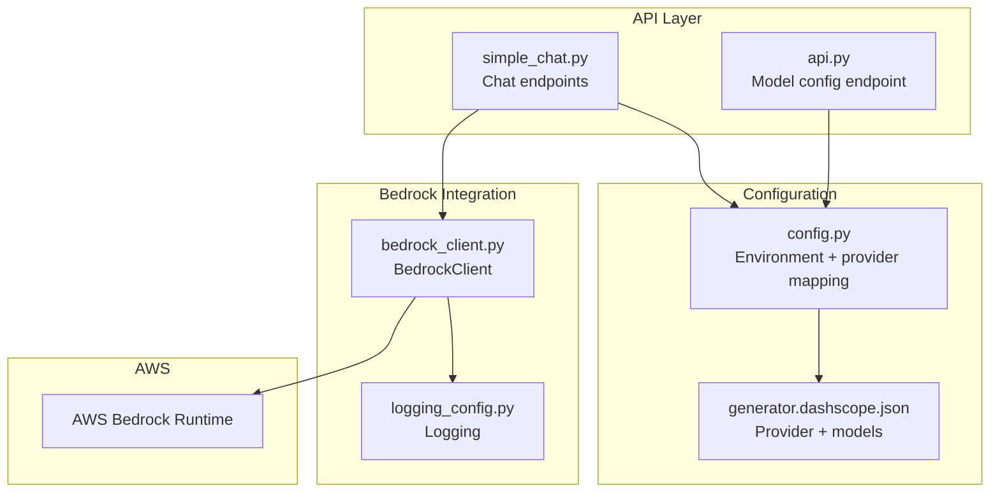
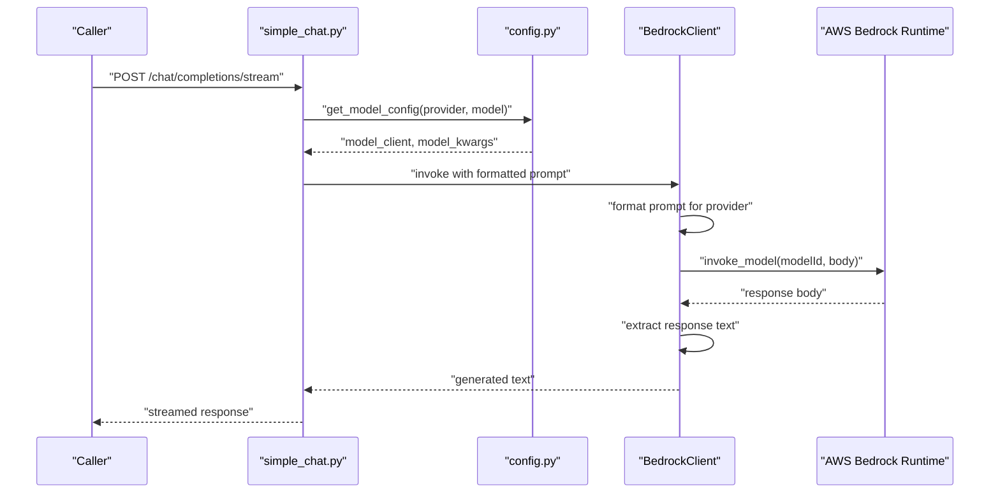
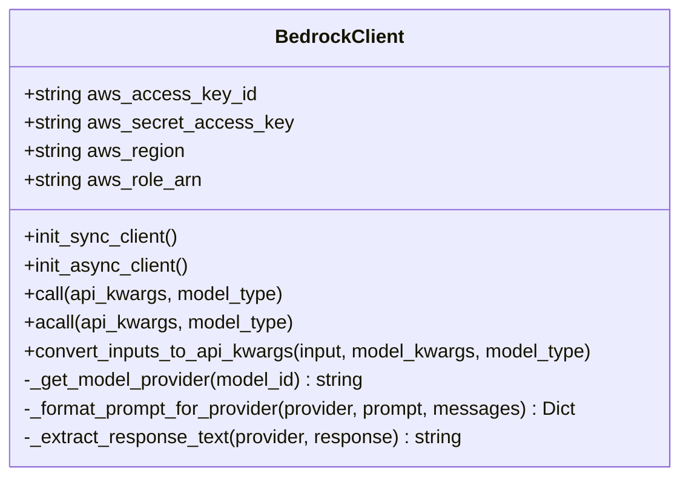
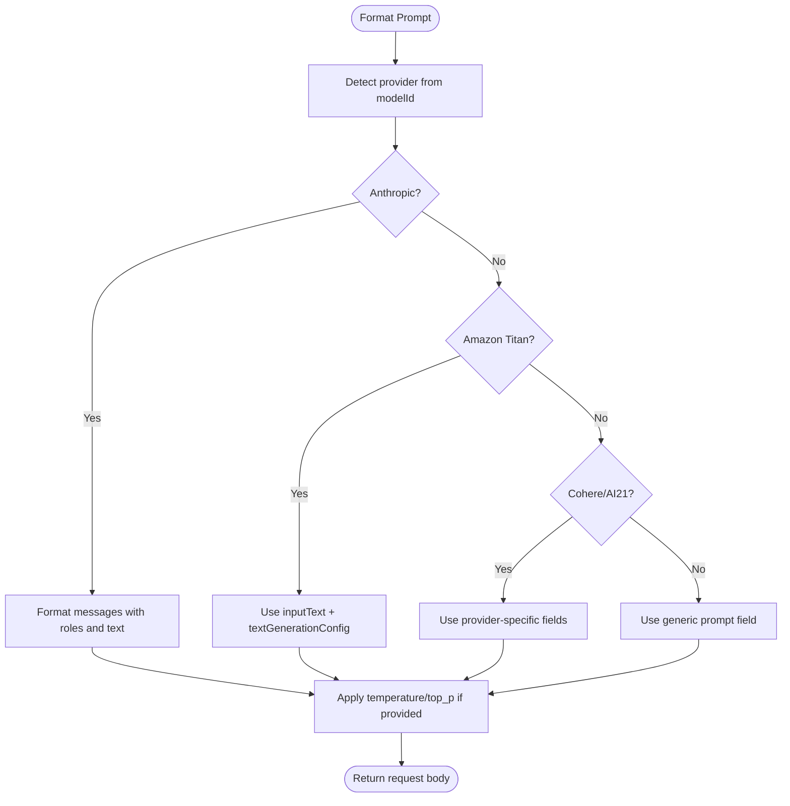
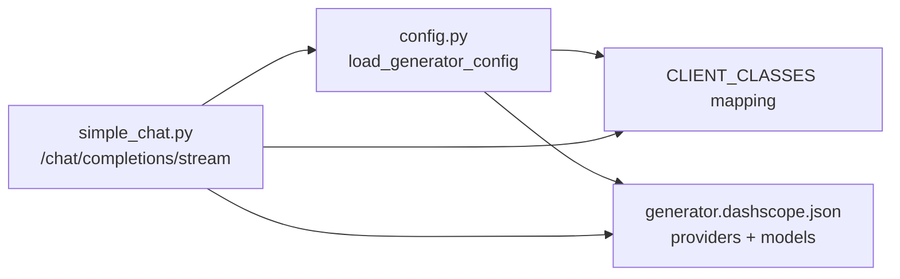
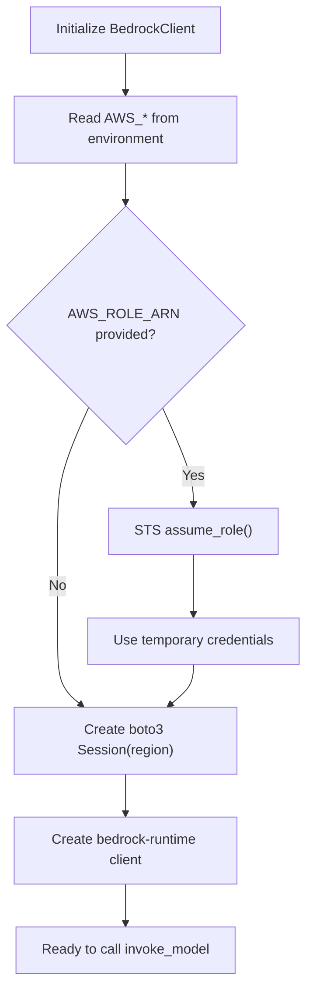
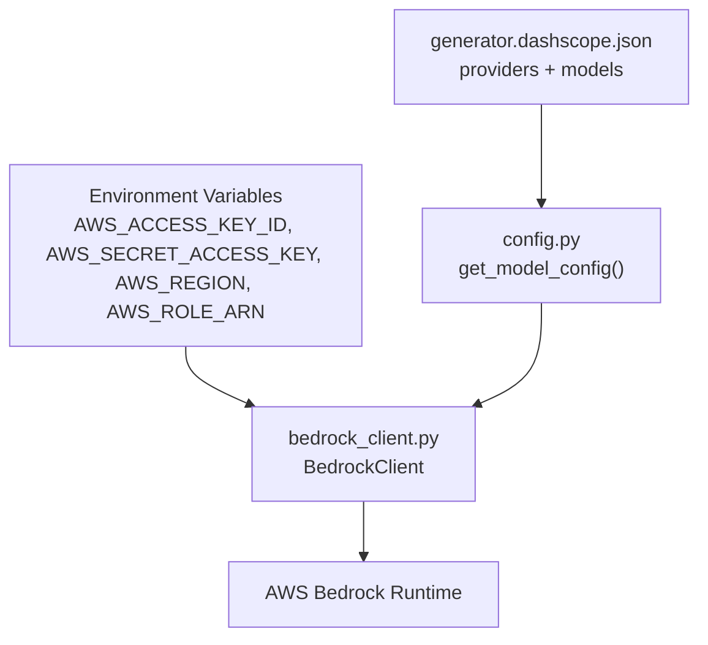

# Amazon Bedrock Integration

<cite>
**Referenced Files in This Document**
- [bedrock_client.py](file://api/bedrock_client.py)
- [config.py](file://api/config.py)
- [generator.dashscope.json](file://api/config/generator.dashscope.json)
- [main.py](file://api/main.py)
- [simple_chat.py](file://api/simple_chat.py)
- [logging_config.py](file://api/logging_config.py)
- [prompts.py](file://api/prompts.py)
</cite>

## Table of Contents
1. [Introduction](#introduction)
2. [Project Structure](#project-structure)
3. [Core Components](#core-components)
4. [Architecture Overview](#architecture-overview)
5. [Detailed Component Analysis](#detailed-component-analysis)
6. [Dependency Analysis](#dependency-analysis)
7. [Performance Considerations](#performance-considerations)
8. [Troubleshooting Guide](#troubleshooting-guide)
9. [Conclusion](#conclusion)
10. [Appendices](#appendices)

## Introduction
This document explains how the project integrates Amazon Bedrock to access foundation models such as Anthropic Claude, Amazon Titan, and Meta Llama models via the Bedrock runtime API. It covers authentication via IAM credentials or IAM roles, region configuration, model access permissions, prompt formatting requirements, inference parameters, and streaming response handling. It also provides practical guidance on model selection, parameter tuning, cost optimization, security considerations, troubleshooting, model availability monitoring, and performance optimization for large-scale deployments.

## Project Structure
The Bedrock integration centers around a dedicated client that wraps the AWS Bedrock runtime client, configuration loaders that expose provider/model metadata, and API endpoints that orchestrate model selection and invocation. Logging is centralized for observability.

**Diagram sources**
- [simple_chat.py](file://api/simple_chat.py#L1-L200)
- [api.py](file://api/api.py#L167-L200)
- [config.py](file://api/config.py#L1-L100)
- [generator.dashscope.json](file://api/config/generator.dashscope.json#L157-L187)
- [bedrock_client.py](file://api/bedrock_client.py#L1-L120)
- [logging_config.py](file://api/logging_config.py#L1-L86)

**Section sources**
- [bedrock_client.py](file://api/bedrock_client.py#L1-L120)
- [config.py](file://api/config.py#L1-L100)
- [generator.dashscope.json](file://api/config/generator.dashscope.json#L157-L187)
- [simple_chat.py](file://api/simple_chat.py#L1-L200)
- [api.py](file://api/api.py#L167-L200)
- [logging_config.py](file://api/logging_config.py#L1-L86)

## Core Components
- BedrockClient: Synchronous client that initializes a Bedrock runtime session using either static credentials or an assumed IAM role, formats provider-specific prompts, invokes the Bedrock runtime, extracts model outputs, and applies exponential backoff on transient errors.
- Configuration loader: Loads provider and model metadata from JSON configuration files and maps providers to their client classes, including Bedrock.
- API endpoints: Expose model configuration and integrate Bedrock for chat completions.

Key capabilities:
- Authentication: Static credentials or IAM role assumption with STS.
- Region configuration: Defaults to us-east-1 if not provided.
- Prompt formatting: Provider-aware formatting for Anthropic Claude, Amazon Titan, Cohere, and AI21.
- Parameter propagation: Supports temperature and top_p for supported providers.
- Error handling: Centralized logging and error messages.

**Section sources**
- [bedrock_client.py](file://api/bedrock_client.py#L38-L120)
- [config.py](file://api/config.py#L19-L47)
- [generator.dashscope.json](file://api/config/generator.dashscope.json#L157-L187)

## Architecture Overview
The system routes model selection through configuration, constructs provider-specific prompts, and calls the Bedrock runtime. Responses are parsed and returned to callers.

**Diagram sources**
- [simple_chat.py](file://api/simple_chat.py#L329-L345)
- [config.py](file://api/config.py#L380-L464)
- [bedrock_client.py](file://api/bedrock_client.py#L226-L291)

## Detailed Component Analysis

### BedrockClient Implementation
Responsibilities:
- Initialize Bedrock runtime client with region and credentials.
- Optionally assume an IAM role via STS to obtain temporary credentials.
- Format prompts per provider (Anthropic Claude, Amazon Titan, Cohere, AI21).
- Propagate inference parameters (temperature, top_p) to provider-specific request bodies.
- Invoke Bedrock runtime and extract generated text.
- Apply exponential backoff for transient errors.

**Diagram sources**
- [bedrock_client.py](file://api/bedrock_client.py#L20-L120)

**Section sources**
- [bedrock_client.py](file://api/bedrock_client.py#L38-L120)
- [bedrock_client.py](file://api/bedrock_client.py#L128-L220)
- [bedrock_client.py](file://api/bedrock_client.py#L226-L318)

### Prompt Formatting and Inference Parameters
- Provider detection: Uses the prefix before the first dot in the model ID to determine provider.
- Anthropic Claude: Accepts a messages array with roles and text content; includes anthropic_version and max_tokens.
- Amazon Titan: Uses inputText and textGenerationConfig with temperature and topP.
- Cohere and AI21: Use provider-specific fields for temperature and topP.
- Parameters: Temperature and top_p are propagated to provider-specific locations when provided.

**Diagram sources**
- [bedrock_client.py](file://api/bedrock_client.py#L115-L194)
- [bedrock_client.py](file://api/bedrock_client.py#L248-L267)

**Section sources**
- [bedrock_client.py](file://api/bedrock_client.py#L115-L194)
- [bedrock_client.py](file://api/bedrock_client.py#L248-L267)

### Model Selection and Configuration
- Provider mapping: The configuration loader maps provider IDs to client classes and loads model metadata from JSON files.
- Bedrock provider: Includes Anthropic Claude, Amazon Titan, Cohere, and AI21 models with default parameters.
- API integration: The chat endpoint resolves provider and model configuration and passes model kwargs to the Bedrock client.

**Diagram sources**
- [config.py](file://api/config.py#L60-L71)
- [config.py](file://api/config.py#L127-L168)
- [generator.dashscope.json](file://api/config/generator.dashscope.json#L157-L187)
- [simple_chat.py](file://api/simple_chat.py#L329-L345)

**Section sources**
- [config.py](file://api/config.py#L60-L71)
- [config.py](file://api/config.py#L127-L168)
- [generator.dashscope.json](file://api/config/generator.dashscope.json#L157-L187)
- [simple_chat.py](file://api/simple_chat.py#L329-L345)

### Authentication and Region Configuration
- Credentials: AWS_ACCESS_KEY_ID and AWS_SECRET_ACCESS_KEY are read from environment variables and passed to the boto3 session.
- IAM role assumption: If AWS_ROLE_ARN is provided, the client assumes the role via STS and uses the returned temporary credentials.
- Region: Falls back to us-east-1 if AWS_REGION is not set.
- Logging: Centralized logging is configured early in the application lifecycle.

**Diagram sources**
- [bedrock_client.py](file://api/bedrock_client.py#L56-L104)
- [config.py](file://api/config.py#L19-L47)
- [logging_config.py](file://api/logging_config.py#L12-L78)

**Section sources**
- [bedrock_client.py](file://api/bedrock_client.py#L56-L104)
- [config.py](file://api/config.py#L19-L47)
- [logging_config.py](file://api/logging_config.py#L12-L78)

### Streaming Response Handling
- Current implementation: The Bedrock client performs a single synchronous invoke_model call and returns the extracted text. There is no built-in streaming response mechanism in the Bedrock client.
- Practical guidance: To enable streaming, wrap Bedrock invocations with a streaming-compatible interface at the API layer or use a streaming-capable adapter.

**Section sources**
- [bedrock_client.py](file://api/bedrock_client.py#L226-L291)

## Dependency Analysis
The Bedrock integration depends on configuration resolution and environment variables, and it interacts with AWS services via boto3.

**Diagram sources**
- [config.py](file://api/config.py#L19-L47)
- [config.py](file://api/config.py#L380-L464)
- [generator.dashscope.json](file://api/config/generator.dashscope.json#L157-L187)
- [bedrock_client.py](file://api/bedrock_client.py#L56-L104)

**Section sources**
- [config.py](file://api/config.py#L19-L47)
- [config.py](file://api/config.py#L380-L464)
- [generator.dashscope.json](file://api/config/generator.dashscope.json#L157-L187)
- [bedrock_client.py](file://api/bedrock_client.py#L56-L104)

## Performance Considerations
- Backoff retries: Transient AWS errors are retried with exponential backoff to improve resilience under load.
- Parameter tuning: Adjust temperature and top_p per provider to balance creativity and determinism.
- Prompt efficiency: Keep prompts concise and structured to reduce token usage and latency.
- Concurrency: For high-throughput scenarios, consider batching and connection pooling at the API layer while ensuring AWS SDK limits are respected.
- Cost optimization: Choose smaller models for routine tasks, monitor token usage, and leverage model-specific quotas and pricing.

**Section sources**
- [bedrock_client.py](file://api/bedrock_client.py#L221-L225)

## Troubleshooting Guide
Common issues and resolutions:
- Initialization failures: Verify AWS credentials and region; check IAM role ARN and permissions.
- Missing or invalid model ID: Ensure the model ID matches a supported provider and model.
- Parameter mismatch: Confirm provider-specific parameter names (temperature, top_p) are applied to the correct fields.
- Network and proxy issues: The application includes a proxy timeout patch for related libraries; ensure outbound connectivity to AWS regions is permitted.
- Logging: Use centralized logging to capture errors and warnings during Bedrock calls.

Operational checks:
- Environment variables: Confirm AWS_ACCESS_KEY_ID, AWS_SECRET_ACCESS_KEY, AWS_REGION, and optionally AWS_ROLE_ARN are set.
- Model availability: Validate model IDs against the provider’s catalog and permissions.
- Permissions: Ensure the IAM principal has bedrock:InvokeModel permissions for the target region.

**Section sources**
- [bedrock_client.py](file://api/bedrock_client.py#L101-L104)
- [bedrock_client.py](file://api/bedrock_client.py#L230-L235)
- [main.py](file://api/main.py#L60-L77)
- [logging_config.py](file://api/logging_config.py#L12-L78)

## Conclusion
The Bedrock integration provides a robust, provider-aware client for invoking foundation models through AWS Bedrock. It supports multiple providers, propagates inference parameters, and centralizes error handling and logging. For production deployments, combine strong IAM permissions, region-aware configuration, and careful parameter tuning with observability and retry strategies to achieve reliability and cost efficiency.

## Appendices

### Security Considerations
- IAM roles: Prefer role-based authentication to avoid long-lived credentials exposure.
- VPC endpoints: Route Bedrock traffic through VPC endpoints to keep traffic within AWS networks.
- Encryption at rest: Ensure sensitive configuration and logs are encrypted at rest.
- Audit logging: Enable CloudTrail to audit Bedrock invocations and IAM actions.

[No sources needed since this section provides general guidance]

### Model Availability Monitoring
- Use AWS Health Dashboard and Bedrock model quotas to track availability.
- Implement health checks in the API layer to surface model readiness.
- Monitor latency and error rates per model to detect degradation.

[No sources needed since this section provides general guidance]

### Practical Examples
- Model selection: Choose Anthropic Claude for reasoning-heavy tasks, Amazon Titan for balanced generation, and Cohere/AI21 for specialized prompting styles.
- Parameter tuning: Lower temperature for code generation; increase top_p for creative tasks within provider constraints.
- Cost optimization: Use smaller models for filtering and chunking; reserve larger models for final synthesis.

[No sources needed since this section provides general guidance]