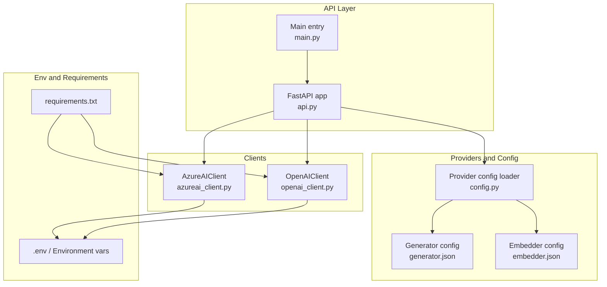
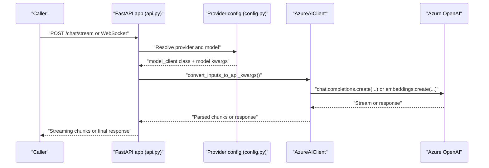
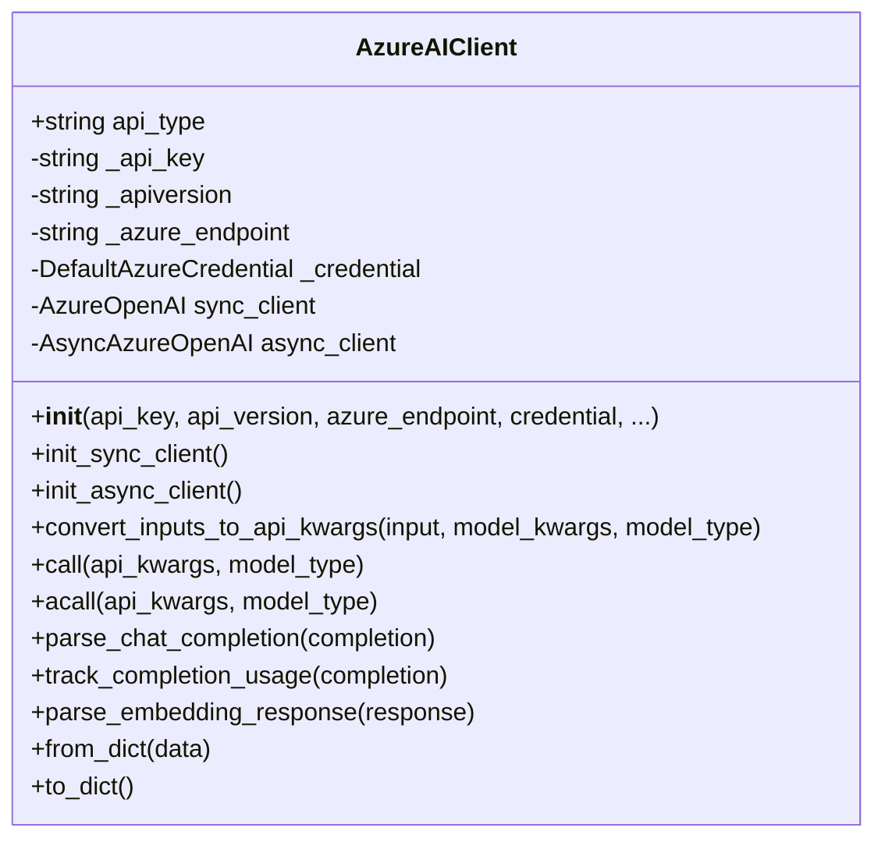
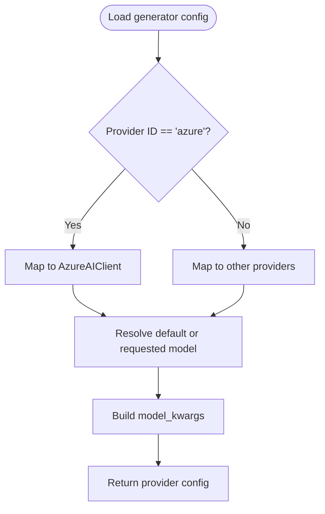
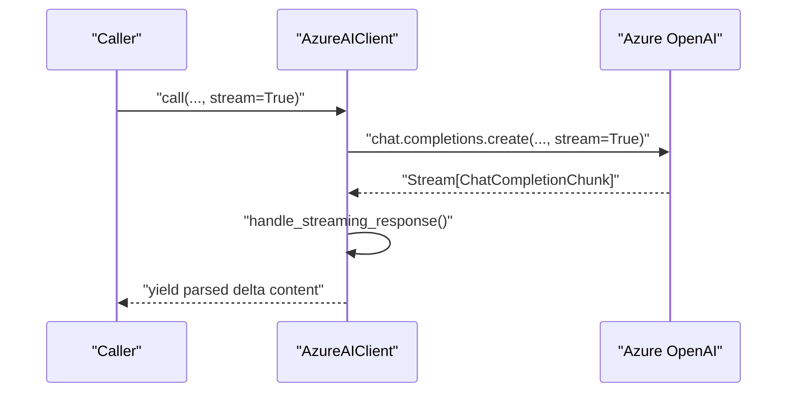
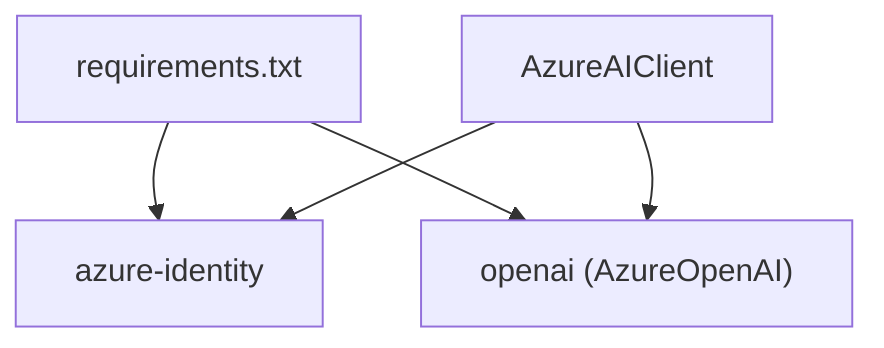

# Azure AI Integration

<cite>
**Referenced Files in This Document**
- [azureai_client.py](file://api/azureai_client.py)
- [config.py](file://api/config.py)
- [openai_client.py](file://api/openai_client.py)
- [main.py](file://api/main.py)
- [README.md](file://README.md)
- [requirements.txt](file://api/requirements.txt)
- [simple_chat.py](file://api/simple_chat.py)
- [websocket_wiki.py](file://api/websocket_wiki.py)
- [generator.json](file://api/config/generator.json)
- [embedder.json](file://api/config/embedder.json)
</cite>

## Table of Contents
1. [Introduction](#introduction)
2. [Project Structure](#project-structure)
3. [Core Components](#core-components)
4. [Architecture Overview](#architecture-overview)
5. [Detailed Component Analysis](#detailed-component-analysis)
6. [Dependency Analysis](#dependency-analysis)
7. [Performance Considerations](#performance-considerations)
8. [Troubleshooting Guide](#troubleshooting-guide)
9. [Conclusion](#conclusion)
10. [Appendices](#appendices)

## Introduction
This document explains how Azure AI services are integrated into the system, focusing on the Azure OpenAI client implementation. It covers authentication via Azure Active Directory, resource-specific endpoints, deployment configuration, API versioning, regional endpoint selection, streaming response handling, batch processing, and cost management through Azure billing. Practical examples demonstrate setting up Azure resources, configuring authentication, and migrating from standard OpenAI to Azure OpenAI. Enterprise security, compliance, and hybrid cloud deployment considerations are addressed alongside troubleshooting and performance optimization techniques.

## Project Structure
The Azure AI integration centers around a dedicated client that wraps the Azure OpenAI SDK and integrates with the broader configuration and provider selection system. Key areas:
- Azure client implementation and streaming handling
- Provider configuration and model selection
- Environment-driven configuration and fallback logic
- API entry points and streaming endpoints

**Diagram sources**
- [api.py](file://api/api.py#L1-L200)
- [main.py](file://api/main.py#L1-L104)
- [config.py](file://api/config.py#L1-L464)
- [generator.json](file://api/config/generator.json#L1-L101)
- [embedder.json](file://api/config/embedder.json#L1-L35)
- [azureai_client.py](file://api/azureai_client.py#L1-L488)
- [openai_client.py](file://api/openai_client.py#L1-L653)
- [requirements.txt](file://api/requirements.txt#L1-L22)

**Section sources**
- [api.py](file://api/api.py#L1-L200)
- [main.py](file://api/main.py#L1-L104)
- [config.py](file://api/config.py#L1-L464)
- [generator.json](file://api/config/generator.json#L1-L101)
- [embedder.json](file://api/config/embedder.json#L1-L35)
- [azureai_client.py](file://api/azureai_client.py#L1-L488)
- [openai_client.py](file://api/openai_client.py#L1-L653)
- [requirements.txt](file://api/requirements.txt#L1-L22)

## Core Components
- AzureAIClient: Implements synchronous and asynchronous Azure OpenAI clients, supports API key and Azure AD token authentication, handles streaming and non-streaming chat completions, and parses embeddings and usage metrics.
- Provider configuration: Centralized mapping of providers to client classes and model parameters, including Azure OpenAI.
- Environment and requirements: Azure-specific environment variables and SDK dependencies are declared and validated.

Key responsibilities:
- Authentication: API key or DefaultAzureCredential with token provider for Azure AD.
- Endpoint and version: azure_endpoint and api_version are required and validated.
- Streaming: Dedicated handler for incremental chunks and parser for delta content.
- Batch processing: Embeddings API supports batch input sequences.
- Cost management: Tracks token usage via CompletionUsage for non-streaming completions.

**Section sources**
- [azureai_client.py](file://api/azureai_client.py#L118-L488)
- [config.py](file://api/config.py#L60-L168)
- [requirements.txt](file://api/requirements.txt#L13-L18)

## Architecture Overview
The system routes model requests through a provider selection layer to the appropriate client. Azure OpenAI is treated as a first-class provider with its own client and configuration.

**Diagram sources**
- [api.py](file://api/api.py#L1-L200)
- [config.py](file://api/config.py#L127-L182)
- [azureai_client.py](file://api/azureai_client.py#L348-L451)

**Section sources**
- [api.py](file://api/api.py#L1-L200)
- [config.py](file://api/config.py#L127-L182)
- [azureai_client.py](file://api/azureai_client.py#L348-L451)

## Detailed Component Analysis

### AzureAIClient
Implements a ModelClient wrapper for Azure OpenAI with:
- Authentication modes:
  - API key: passed to AzureOpenAI constructor.
  - Azure AD token: uses DefaultAzureCredential and get_bearer_token_provider with the correct scope.
- Endpoint and version:
  - azure_endpoint and api_version are required and validated at initialization.
- Input conversion:
  - Converts text or structured messages to API-compatible kwargs.
  - Supports system/user message separation via delimiters.
- Streaming:
  - Detects stream=True and switches to handle_streaming_response.
  - Parses incremental delta content from ChatCompletionChunk.
- Non-streaming:
  - Calls chat.completions.create and parses the resulting ChatCompletion.
- Embeddings:
  - Delegates to parse_embedding_response for standardized output.
- Usage tracking:
  - Extracts CompletionUsage for non-streaming completions.

**Diagram sources**
- [azureai_client.py](file://api/azureai_client.py#L118-L488)

**Section sources**
- [azureai_client.py](file://api/azureai_client.py#L118-L488)

### Provider Configuration and Model Selection
The configuration system maps provider IDs to client classes and model parameters. Azure is supported as a provider with a default client class and model list.

Highlights:
- Provider mapping includes "azure" -> AzureAIClient.
- Model selection resolves default and specific models per provider.
- Environment variables for Azure are optional in the general setup but required by the client when used.

**Diagram sources**
- [config.py](file://api/config.py#L127-L182)
- [generator.json](file://api/config/generator.json#L1-L101)

**Section sources**
- [config.py](file://api/config.py#L60-L168)
- [generator.json](file://api/config/generator.json#L1-L101)

### Streaming Response Handling
Both synchronous and asynchronous Azure clients support streaming chat completions. The client detects stream=True and:
- Switches the chat completion parser to handle_streaming_response.
- Iterates over Stream[ChatCompletionChunk] and yields parsed delta content.

**Diagram sources**
- [azureai_client.py](file://api/azureai_client.py#L90-L96)
- [azureai_client.py](file://api/azureai_client.py#L417-L422)

**Section sources**
- [azureai_client.py](file://api/azureai_client.py#L90-L96)
- [azureai_client.py](file://api/azureai_client.py#L417-L422)

### Batch Processing Capabilities
Embeddings creation supports batch input sequences. The client converts a single string to a list and passes it to the embeddings API.

- Input normalization: Ensures input is a sequence for embeddings.
- API call: Delegates to AzureOpenAI embeddings.create with the prepared input.

**Section sources**
- [azureai_client.py](file://api/azureai_client.py#L360-L367)
- [azureai_client.py](file://api/azureai_client.py#L416)

### Cost Management Through Azure Billing
Token usage tracking:
- Non-streaming completions: CompletionUsage is extracted and returned as part of GeneratorOutput.
- Streaming completions: Usage tracking is not implemented for streams in this client.

Billing implications:
- Azure OpenAI charges based on tokens consumed (prompt and completion).
- Use CompletionUsage to monitor and estimate costs for non-streaming calls.

**Section sources**
- [azureai_client.py](file://api/azureai_client.py#L319-L334)

### Authentication via Azure Active Directory
The client supports token-based authentication using DefaultAzureCredential and a bearer token provider scoped to Azure Cognitive Services.

- Scope: "https://cognitiveservices.azure.com/.default"
- Credential resolution: Automatically uses configured Azure identities (managed identity, CLI, VS, etc.).

**Section sources**
- [azureai_client.py](file://api/azureai_client.py#L249-L255)
- [azureai_client.py](file://api/azureai_client.py#L278-L284)

### Resource-Specific Endpoints and API Versioning
- Endpoint: azure_endpoint must be provided and is validated at initialization.
- API version: api_version must be provided and is validated at initialization.
- Both are sourced from environment variables when not passed explicitly.

**Section sources**
- [azureai_client.py](file://api/azureai_client.py#L233-L260)
- [azureai_client.py](file://api/azureai_client.py#L262-L289)

### Regional Endpoint Selection
Regional endpoints are configured via the azure_endpoint environment variable. The client constructs the AzureOpenAI client with the specified endpoint.

**Section sources**
- [azureai_client.py](file://api/azureai_client.py#L244-L246)
- [azureai_client.py](file://api/azureai_client.py#L273-L275)

### Migration from Standard OpenAI to Azure OpenAI
Steps:
- Set environment variables for Azure: AZURE_OPENAI_API_KEY, AZURE_OPENAI_ENDPOINT, AZURE_OPENAI_VERSION.
- Select provider "azure" in the configuration.
- Ensure model names align with Azure OpenAI deployments.
- Validate streaming and non-streaming behavior remains consistent.

**Section sources**
- [README.md](file://README.md#L49-L52)
- [config.py](file://api/config.py#L153-L167)
- [azureai_client.py](file://api/azureai_client.py#L195-L232)

## Dependency Analysis
External dependencies relevant to Azure AI integration:
- azure-identity and azure-core for Azure AD authentication and core Azure SDK features.
- openai >= 1.76.2 for AzureOpenAI/AsyncAzureOpenAI clients and response types.

**Diagram sources**
- [requirements.txt](file://api/requirements.txt#L13-L18)
- [azureai_client.py](file://api/azureai_client.py#L38-L41)

**Section sources**
- [requirements.txt](file://api/requirements.txt#L13-L18)
- [azureai_client.py](file://api/azureai_client.py#L38-L41)

## Performance Considerations
- Streaming reduces latency for long responses by yielding incremental chunks.
- Non-streaming calls can be converted to streaming internally in the OpenAI client for compatibility.
- Token usage tracking helps estimate cost and optimize prompts.
- Backoff decorators protect against transient failures (timeouts, rate limits, server errors).

[No sources needed since this section provides general guidance]

## Troubleshooting Guide
Common Azure-specific issues and resolutions:
- Missing environment variables:
  - AZURE_OPENAI_API_KEY, AZURE_OPENAI_ENDPOINT, AZURE_OPENAI_VERSION must be set when using Azure.
- Authentication errors:
  - Ensure DefaultAzureCredential has access to the target Azure subscription and that the token provider scope is correct.
- Streaming errors:
  - Verify stream=True is set and that the client switches to handle_streaming_response.
- Provider fallback:
  - The application includes fallback logic for token limit exceeded scenarios across providers, including Azure.

Operational checks:
- Confirm provider selection resolves to AzureAIClient.
- Validate that model names match deployed Azure OpenAI models.
- Review logs for detailed error messages and stack traces.

**Section sources**
- [azureai_client.py](file://api/azureai_client.py#L233-L260)
- [azureai_client.py](file://api/azureai_client.py#L262-L289)
- [simple_chat.py](file://api/simple_chat.py#L638-L640)
- [websocket_wiki.py](file://api/websocket_wiki.py#L635-L640)

## Conclusion
The Azure AI integration leverages a robust client that supports both API key and Azure AD authentication, validates endpoint and version requirements, and provides seamless streaming and batch embedding capabilities. The configuration system treats Azure as a first-class provider, enabling straightforward migration from standard OpenAI while maintaining consistent usage tracking and error handling. Enterprise-grade security, compliance, and hybrid cloud scenarios are supported through managed identity and regional endpoint selection.

[No sources needed since this section summarizes without analyzing specific files]

## Appendices

### Practical Setup Examples
- Environment variables for Azure:
  - AZURE_OPENAI_API_KEY, AZURE_OPENAI_ENDPOINT, AZURE_OPENAI_VERSION
- Selecting Azure provider:
  - Ensure provider "azure" is configured and mapped to AzureAIClient.
- Streaming and non-streaming:
  - Set stream=True for incremental responses; otherwise, the client handles non-streaming by converting to streaming internally.

**Section sources**
- [README.md](file://README.md#L49-L52)
- [config.py](file://api/config.py#L153-L167)
- [azureai_client.py](file://api/azureai_client.py#L195-L232)