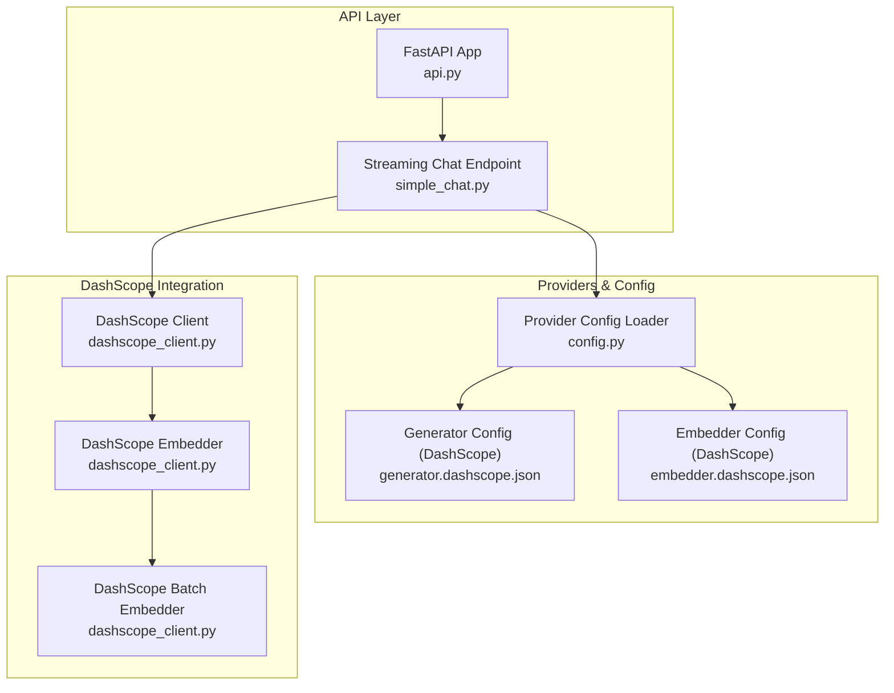
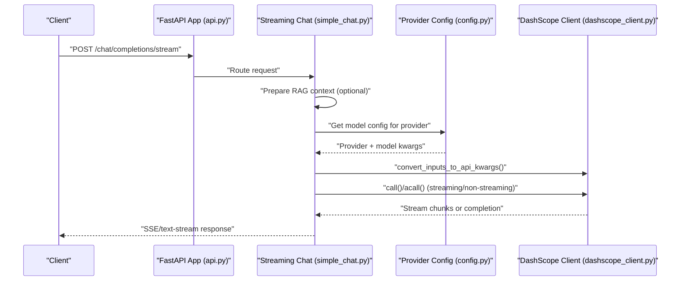
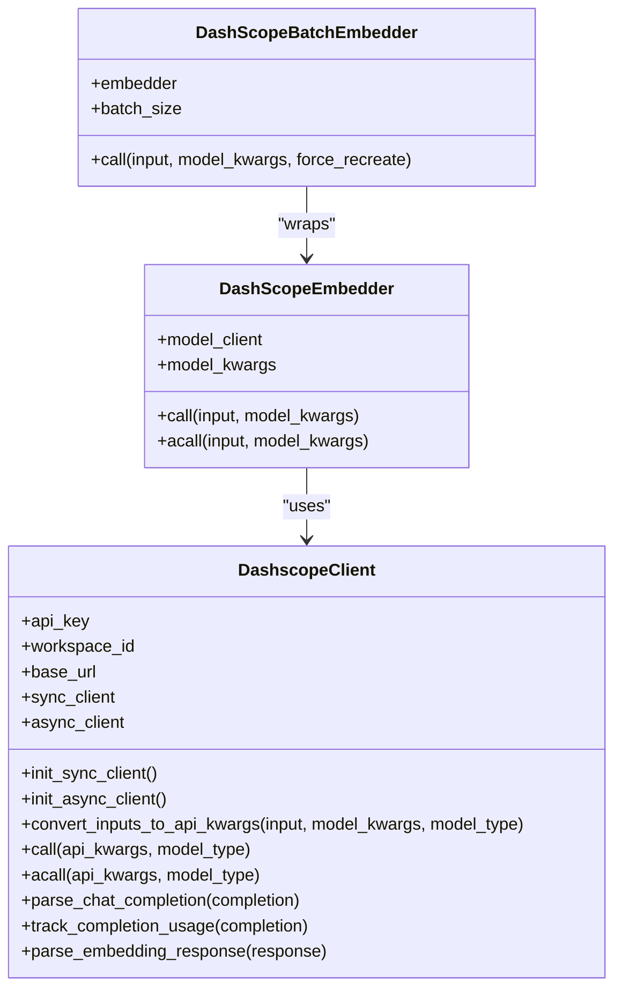
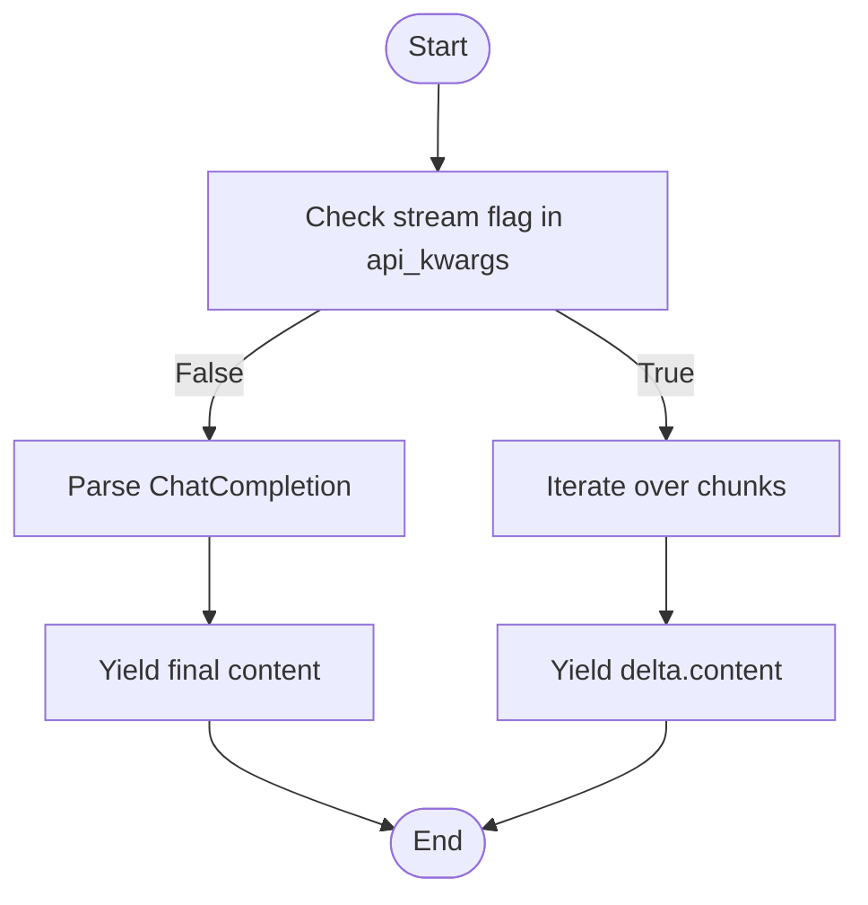
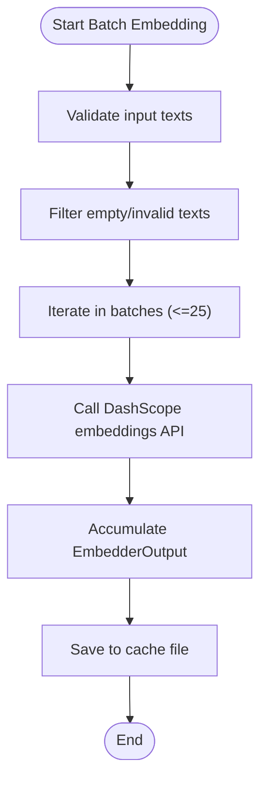
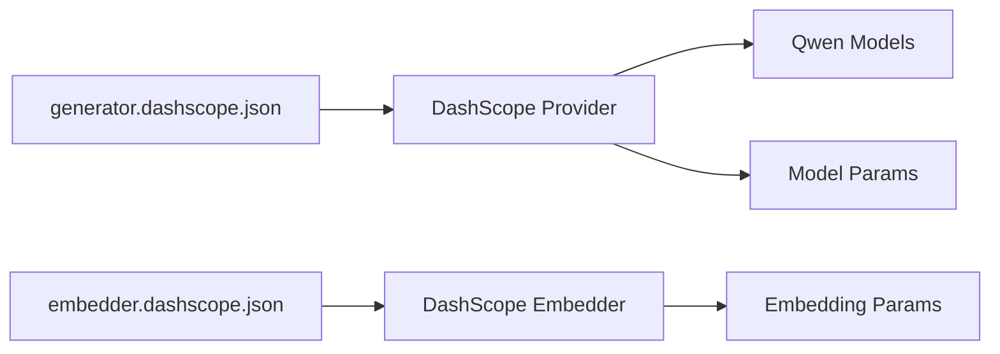
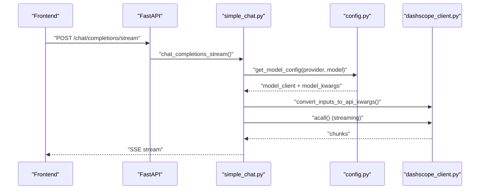
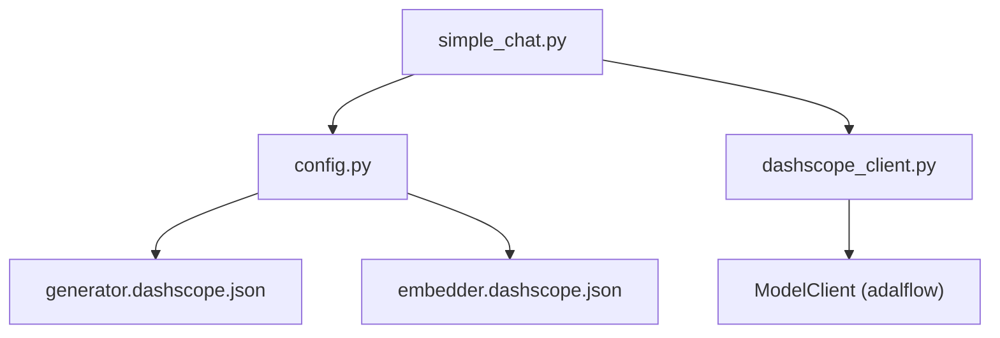

# DashScope Integration

<cite>
**Referenced Files in This Document**
- [dashscope_client.py](file://api/dashscope_client.py)
- [generator.dashscope.json](file://api/config/generator.dashscope.json)
- [embedder.dashscope.json](file://api/config/embedder.dashscope.json)
- [DASHSCOPE_SETUP_GUIDE.md](file://DASHSCOPE_SETUP_GUIDE.md)
- [PROVIDER_SETUP_GUIDE.md](file://PROVIDER_SETUP_GUIDE.md)
- [test_dashscope_api.py](file://tests/unit/test_dashscope_api.py)
- [simple_chat.py](file://api/simple_chat.py)
- [api.py](file://api/api.py)
- [config.py](file://api/config.py)
- [main.py](file://api/main.py)
</cite>

## Table of Contents
1. [Introduction](#introduction)
2. [Project Structure](#project-structure)
3. [Core Components](#core-components)
4. [Architecture Overview](#architecture-overview)
5. [Detailed Component Analysis](#detailed-component-analysis)
6. [Dependency Analysis](#dependency-analysis)
7. [Performance Considerations](#performance-considerations)
8. [Troubleshooting Guide](#troubleshooting-guide)
9. [Conclusion](#conclusion)
10. [Appendices](#appendices)

## Introduction
This document explains Tongyi Lab’s DashScope integration within the project, focusing on the DashScope client implementation for accessing Qwen models and other AI services from Alibaba Cloud. It covers authentication via API keys, model selection for different tasks, regional endpoint configuration, streaming response handling, batch processing capabilities, and cost management through DashScope pricing. Practical examples demonstrate configuring Qwen models, parameter optimization, and integration with Chinese language processing workflows. Enterprise deployment considerations, compliance requirements, and performance tuning for multilingual applications are addressed, along with troubleshooting DashScope-specific issues and best practices for production deployments.

## Project Structure
The DashScope integration spans several modules:
- Client implementation: DashScope client and embedder components
- Configuration: Provider and model settings for DashScope
- API surface: FastAPI endpoints and streaming chat orchestration
- Tests and setup guides: Validation scripts and operational guidance

**Diagram sources**
- [api.py](file://api/api.py#L1-L635)
- [simple_chat.py](file://api/simple_chat.py#L1-L900)
- [config.py](file://api/config.py#L1-L464)
- [generator.dashscope.json](file://api/config/generator.dashscope.json#L1-L239)
- [embedder.dashscope.json](file://api/config/embedder.dashscope.json#L1-L19)
- [dashscope_client.py](file://api/dashscope_client.py#L115-L917)

**Section sources**
- [api.py](file://api/api.py#L1-L635)
- [simple_chat.py](file://api/simple_chat.py#L1-L900)
- [config.py](file://api/config.py#L1-L464)
- [generator.dashscope.json](file://api/config/generator.dashscope.json#L1-L239)
- [embedder.dashscope.json](file://api/config/embedder.dashscope.json#L1-L19)
- [dashscope_client.py](file://api/dashscope_client.py#L115-L917)

## Core Components
- DashscopeClient: Implements OpenAI-compatible client for DashScope, supporting chat completions and embeddings. Handles authentication via API key, optional workspace ID, and configurable base URL. Provides synchronous and asynchronous invocation, streaming response parsing, and usage tracking.
- DashScopeEmbedder: A user-facing component orchestrating embeddings via the DashScope client with output processors.
- DashScopeBatchEmbedder: Batch embedding component tailored for DashScope with a maximum batch size of 25 and caching support.
- DashScopeToEmbeddings: Converts document sequences to embedding vectors using the batch embedder and assigns vectors back to documents.

Key behaviors:
- Authentication: Requires DASHSCOPE_API_KEY; optional DASHSCOPE_WORKSPACE_ID; base URL configurable via DASHSCOPE_BASE_URL.
- Model selection: Provider configuration defines default models and parameters for Qwen variants.
- Streaming: Chat completions support streaming; embedding responses are non-streaming.
- Batch processing: Embeddings are processed in batches up to 25; cache persists embeddings to reduce repeated calls.
- Usage tracking: Non-streaming completions expose token usage; streaming completions do not report usage.

**Section sources**
- [dashscope_client.py](file://api/dashscope_client.py#L115-L917)
- [generator.dashscope.json](file://api/config/generator.dashscope.json#L1-L239)
- [embedder.dashscope.json](file://api/config/embedder.dashscope.json#L1-L19)

## Architecture Overview
The DashScope integration is invoked through the streaming chat endpoint. The request pipeline prepares prompts, retrieves context via RAG when feasible, selects a provider and model, constructs API arguments, and streams responses back to the client.

**Diagram sources**
- [api.py](file://api/api.py#L394-L401)
- [simple_chat.py](file://api/simple_chat.py#L76-L887)
- [config.py](file://api/config.py#L381-L464)
- [dashscope_client.py](file://api/dashscope_client.py#L316-L599)

## Detailed Component Analysis

### DashScope Client
The DashScope client wraps an OpenAI-compatible client to call DashScope endpoints. It:
- Initializes with API key, optional workspace ID, and base URL
- Adds workspace ID to headers when available
- Converts inputs to API kwargs for both chat and embeddings
- Parses streaming and non-streaming responses
- Applies exponential backoff for transient errors
- Supports synchronous and asynchronous calls

**Diagram sources**
- [dashscope_client.py](file://api/dashscope_client.py#L115-L917)

**Section sources**
- [dashscope_client.py](file://api/dashscope_client.py#L115-L917)

### Streaming Response Handling
The streaming pipeline:
- Detects streaming mode in API kwargs
- Iterates over chunks and yields incremental text
- Handles non-streaming completions by extracting the first message content
- Applies robust parsing and fallbacks for malformed responses

**Diagram sources**
- [dashscope_client.py](file://api/dashscope_client.py#L97-L113)
- [dashscope_client.py](file://api/dashscope_client.py#L208-L281)

**Section sources**
- [dashscope_client.py](file://api/dashscope_client.py#L97-L113)
- [dashscope_client.py](file://api/dashscope_client.py#L208-L281)

### Batch Embedding and Caching
Batch processing:
- Enforces a maximum batch size of 25 for DashScope
- Filters empty or invalid texts and preserves original indexing
- Saves embeddings to a cache file for reuse
- Assigns embedding vectors back to documents

**Diagram sources**
- [dashscope_client.py](file://api/dashscope_client.py#L724-L820)
- [dashscope_client.py](file://api/dashscope_client.py#L822-L917)

**Section sources**
- [dashscope_client.py](file://api/dashscope_client.py#L724-L820)
- [dashscope_client.py](file://api/dashscope_client.py#L822-L917)

### Provider and Model Configuration
Provider configuration:
- Default provider is DashScope with Qwen models
- Model parameters include temperature, top_p, max_tokens, and streaming
- Embedder configuration sets model, dimensions, encoding format, and batch size

**Diagram sources**
- [generator.dashscope.json](file://api/config/generator.dashscope.json#L1-L239)
- [embedder.dashscope.json](file://api/config/embedder.dashscope.json#L1-L19)

**Section sources**
- [generator.dashscope.json](file://api/config/generator.dashscope.json#L1-L239)
- [embedder.dashscope.json](file://api/config/embedder.dashscope.json#L1-L19)

### API Integration and Usage
The streaming chat endpoint:
- Accepts provider and model parameters
- Builds prompts with optional RAG context and conversation history
- Selects the DashScope client and streams responses
- Handles token limit errors by retrying without context

**Diagram sources**
- [api.py](file://api/api.py#L394-L401)
- [simple_chat.py](file://api/simple_chat.py#L76-L887)
- [config.py](file://api/config.py#L381-L464)
- [dashscope_client.py](file://api/dashscope_client.py#L316-L599)

**Section sources**
- [api.py](file://api/api.py#L394-L401)
- [simple_chat.py](file://api/simple_chat.py#L76-L887)
- [config.py](file://api/config.py#L381-L464)
- [dashscope_client.py](file://api/dashscope_client.py#L316-L599)

## Dependency Analysis
- DashScope client depends on the OpenAI-compatible client library and the adalflow ModelClient abstraction.
- The streaming chat endpoint depends on provider configuration resolution and the DashScope client.
- Embedding components depend on the DashScope client and batch processing utilities.

**Diagram sources**
- [simple_chat.py](file://api/simple_chat.py#L1-L900)
- [config.py](file://api/config.py#L1-L464)
- [generator.dashscope.json](file://api/config/generator.dashscope.json#L1-L239)
- [embedder.dashscope.json](file://api/config/embedder.dashscope.json#L1-L19)
- [dashscope_client.py](file://api/dashscope_client.py#L1-L917)

**Section sources**
- [simple_chat.py](file://api/simple_chat.py#L1-L900)
- [config.py](file://api/config.py#L1-L464)
- [dashscope_client.py](file://api/dashscope_client.py#L1-L917)

## Performance Considerations
- Streaming improves perceived latency and user experience for chat completions.
- Batch embedding reduces API calls; DashScope limits batch size to 25. The batch embedder caches results to minimize redundant calls.
- Embedding dimension consistency is critical; the batch embedder validates and aligns dimensions across batches.
- Token limits: The streaming chat endpoint detects oversized inputs and retries without context to avoid exceeding provider limits.

[No sources needed since this section provides general guidance]

## Troubleshooting Guide
Common issues and resolutions:
- API key errors: Ensure DASHSCOPE_API_KEY is set; the client raises a clear error if missing.
- Model not found: Verify model names in configuration match DashScope availability.
- Batch size errors: DashScope batch size is capped at 25; the batch embedder enforces this and warns if larger values are used.
- Workspace access errors: Confirm DASHSCOPE_WORKSPACE_ID correctness or omit if unnecessary.
- Rate limiting and timeouts: Exponential backoff is applied to transient errors; adjust client timeouts and retry policies as needed.

Validation and testing:
- Use the test script to validate API key and connectivity for chat and embeddings.
- Confirm environment variables and base URL alignment with your region and workspace.

**Section sources**
- [DASHSCOPE_SETUP_GUIDE.md](file://DASHSCOPE_SETUP_GUIDE.md#L134-L167)
- [test_dashscope_api.py](file://tests/unit/test_dashscope_api.py#L1-L206)
- [dashscope_client.py](file://api/dashscope_client.py#L157-L184)
- [dashscope_client.py](file://api/dashscope_client.py#L391-L401)

## Conclusion
The DashScope integration provides a robust, streaming-capable client for Qwen models and embeddings, with strong configuration support for model parameters and batch processing. By leveraging caching, streaming, and careful parameter tuning, the system achieves efficient performance for multilingual and Chinese-language workflows. Adhering to the setup and troubleshooting guidance ensures reliable operation in development and production environments.

[No sources needed since this section summarizes without analyzing specific files]

## Appendices

### Authentication and Regional Configuration
- Authentication: Set DASHSCOPE_API_KEY; optional DASHSCOPE_WORKSPACE_ID; base URL configurable via DASHSCOPE_BASE_URL.
- Regional endpoints: The base URL defaults to the compatible-mode endpoint; override via environment variable if needed.

**Section sources**
- [DASHSCOPE_SETUP_GUIDE.md](file://DASHSCOPE_SETUP_GUIDE.md#L126-L133)
- [dashscope_client.py](file://api/dashscope_client.py#L148-L184)

### Model Selection and Parameter Optimization
- Default Qwen model: qwen-plus; alternatives include qwen-turbo, qwen-max, qwen-long, and deepseek-r1.
- Parameters: temperature, top_p, max_tokens, and streaming are configurable in provider settings.
- Embedding model: text-embedding-v2 with 1536 dimensions; batch size 25 enforced.

**Section sources**
- [generator.dashscope.json](file://api/config/generator.dashscope.json#L1-L34)
- [embedder.dashscope.json](file://api/config/embedder.dashscope.json#L1-L19)

### Cost Management and Best Practices
- Cost drivers: Text generation is priced per token; embeddings are priced per text processed.
- Cost-saving strategies: Batch processing, caching, and avoiding unnecessary context reduce costs.
- Production best practices: Monitor usage in the DashScope console, enforce rate limits, and apply exponential backoff for resilience.

**Section sources**
- [DASHSCOPE_SETUP_GUIDE.md](file://DASHSCOPE_SETUP_GUIDE.md#L208-L215)

### Enterprise Deployment and Compliance
- Environment isolation: Use separate environment files and CI/CD secrets for API keys and workspace IDs.
- Compliance: Ensure data residency and access controls align with organizational policies; restrict exposure of API keys.
- Monitoring: Enable logging and metrics for API calls, token usage, and error rates.

**Section sources**
- [PROVIDER_SETUP_GUIDE.md](file://PROVIDER_SETUP_GUIDE.md#L124-L140)
- [main.py](file://api/main.py#L1-L104)