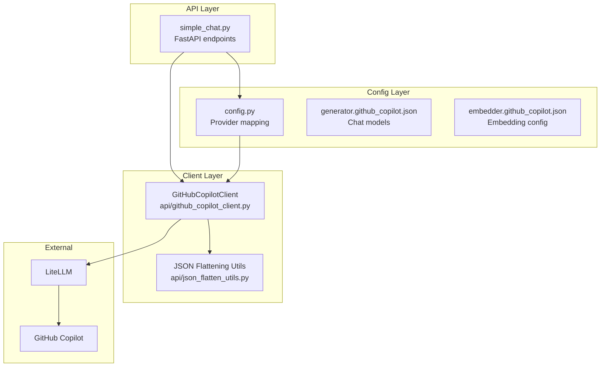
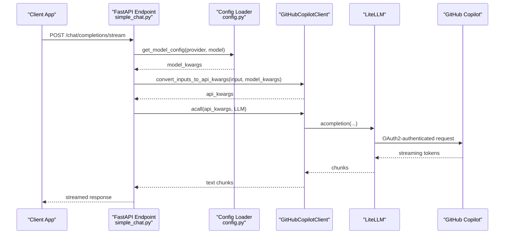
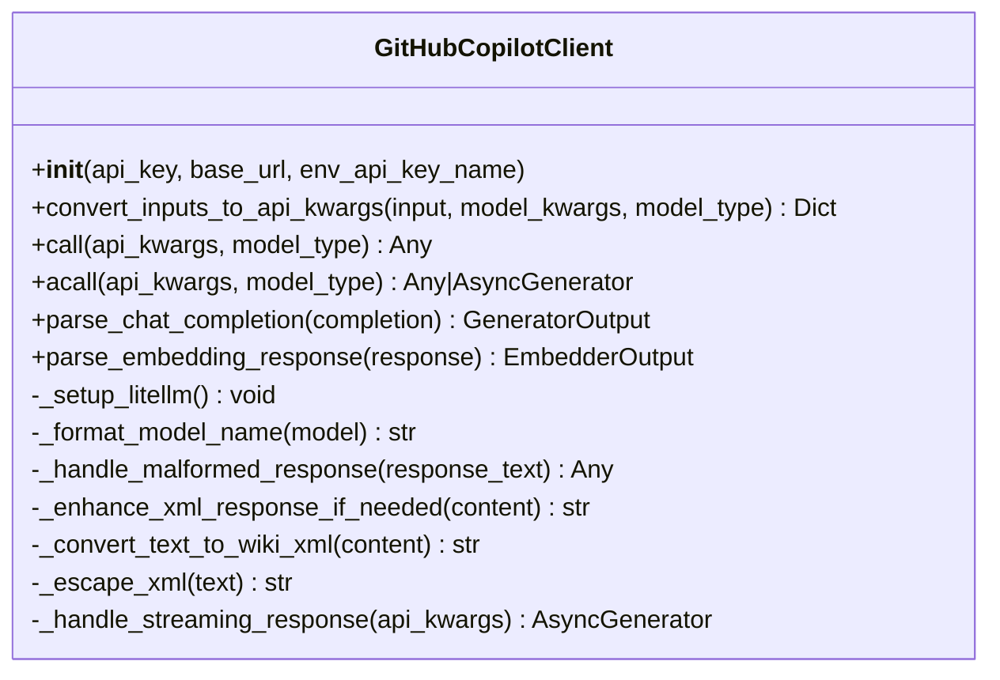
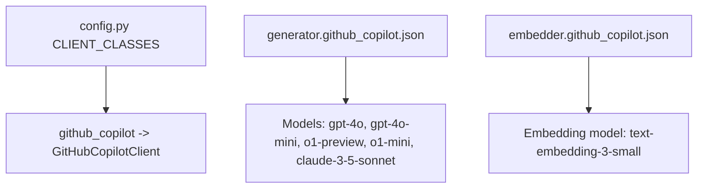
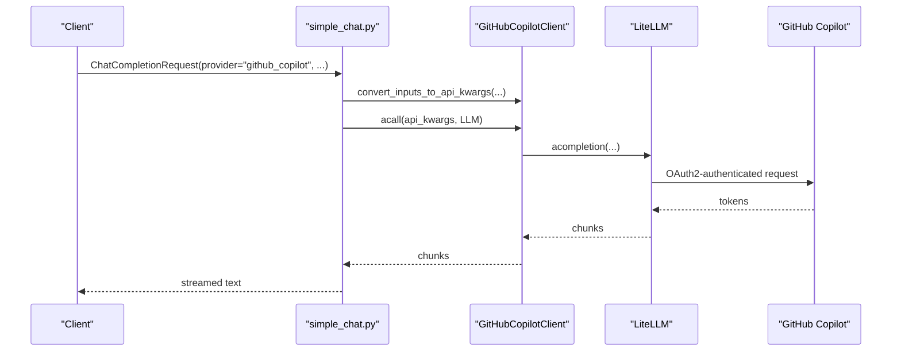
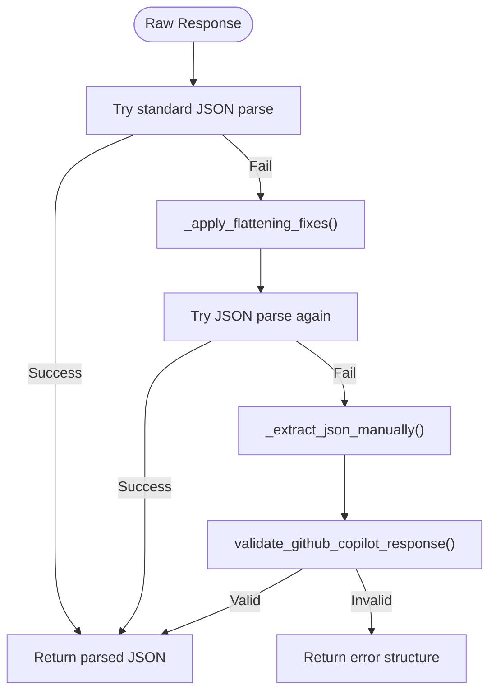
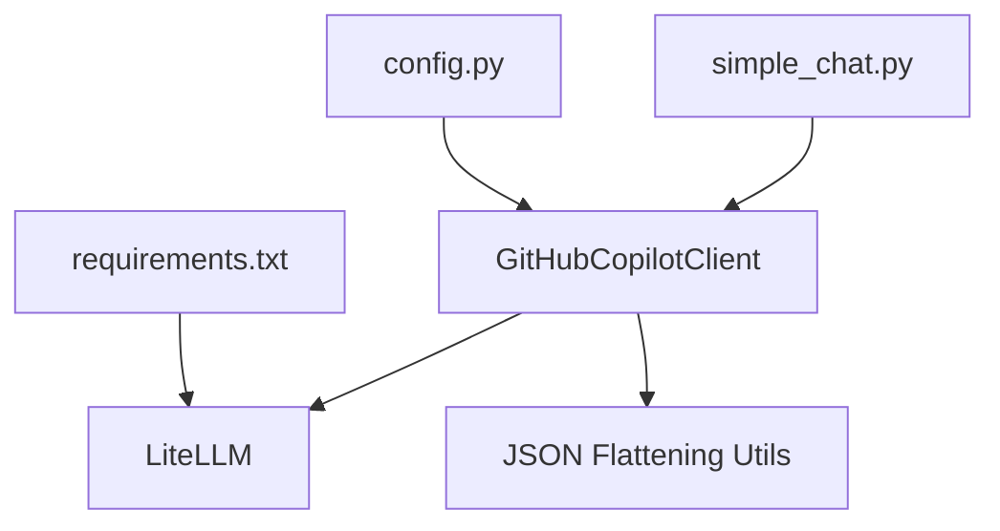

# GitHub Copilot Integration

<cite>
**Referenced Files in This Document**
- [api/github_copilot_client.py](file://api/github_copilot_client.py)
- [README_GITHUB_COPILOT.md](file://README_GITHUB_COPILOT.md)
- [GITHUB_COPILOT_INTEGRATION_SUMMARY.md](file://GITHUB_COPILOT_INTEGRATION_SUMMARY.md)
- [api/config/generator.github_copilot.json](file://api/config/generator.github_copilot.json)
- [api/config/embedder.github_copilot.json](file://api/config/embedder.github_copilot.json)
- [api/config.py](file://api/config.py)
- [api/simple_chat.py](file://api/simple_chat.py)
- [api/json_flatten_utils.py](file://api/json_flatten_utils.py)
- [api/requirements.txt](file://api/requirements.txt)
- [api/main.py](file://api/main.py)
- [tests/unit/test_github_copilot_chat.py](file://tests/unit/test_github_copilot_chat.py)
- [tests/integration/test_github_copilot_integration.py](file://tests/integration/test_github_copilot_integration.py)
</cite>

## Table of Contents
1. [Introduction](#introduction)
2. [Project Structure](#project-structure)
3. [Core Components](#core-components)
4. [Architecture Overview](#architecture-overview)
5. [Detailed Component Analysis](#detailed-component-analysis)
6. [Dependency Analysis](#dependency-analysis)
7. [Performance Considerations](#performance-considerations)
8. [Troubleshooting Guide](#troubleshooting-guide)
9. [Conclusion](#conclusion)
10. [Appendices](#appendices)

## Introduction
This document explains the GitHub Copilot integration for code completion and chat capabilities powered by GitHub’s AI models. It covers authentication via OAuth2 (automatic), configuration, streaming and non-streaming chat, embedding support, repository-aware workflows, and enterprise security considerations. Practical examples demonstrate how to configure access, handle code completions, and incorporate Copilot responses into documentation generation.

## Project Structure
The integration centers around a dedicated client that wraps GitHub Copilot through LiteLLM, with configuration files and API endpoints supporting both chat and embedding workflows.

**Diagram sources**
- [api/simple_chat.py](file://api/simple_chat.py#L498-L522)
- [api/config.py](file://api/config.py#L61-L71)
- [api/config/generator.github_copilot.json](file://api/config/generator.github_copilot.json#L1-L35)
- [api/config/embedder.github_copilot.json](file://api/config/embedder.github_copilot.json#L1-L26)
- [api/github_copilot_client.py](file://api/github_copilot_client.py#L30-L91)
- [api/json_flatten_utils.py](file://api/json_flatten_utils.py#L16-L64)

**Section sources**
- [api/simple_chat.py](file://api/simple_chat.py#L498-L522)
- [api/config.py](file://api/config.py#L61-L71)
- [api/config/generator.github_copilot.json](file://api/config/generator.github_copilot.json#L1-L35)
- [api/config/embedder.github_copilot.json](file://api/config/embedder.github_copilot.json#L1-L26)
- [api/github_copilot_client.py](file://api/github_copilot_client.py#L30-L91)
- [api/json_flatten_utils.py](file://api/json_flatten_utils.py#L16-L64)

## Core Components
- GitHubCopilotClient: A ModelClient wrapper that integrates GitHub Copilot via LiteLLM with automatic OAuth2 authentication. It supports chat completions and embeddings, streaming and non-streaming modes, and robust error handling with JSON flattening utilities.
- Configuration: Provider mapping and model configurations define supported models and defaults for chat and embeddings.
- API Integration: FastAPI endpoints accept provider and model parameters, construct prompts, and stream responses from GitHub Copilot.
- JSON Flattening Utilities: Robust helpers to repair malformed responses from GitHub Copilot and validate usable structures.

Key capabilities:
- Zero configuration required for OAuth2 authentication
- Streaming and non-streaming chat
- Embeddings support (text-embedding-3-small)
- XML enhancement for wiki structure responses
- Comprehensive error handling and fallbacks

**Section sources**
- [api/github_copilot_client.py](file://api/github_copilot_client.py#L30-L91)
- [api/config/generator.github_copilot.json](file://api/config/generator.github_copilot.json#L1-L35)
- [api/config/embedder.github_copilot.json](file://api/config/embedder.github_copilot.json#L1-L26)
- [api/simple_chat.py](file://api/simple_chat.py#L498-L522)
- [api/json_flatten_utils.py](file://api/json_flatten_utils.py#L16-L64)

## Architecture Overview
The system routes chat requests through FastAPI to the GitHubCopilotClient, which formats inputs and invokes LiteLLM. Responses are streamed back to the client. Embeddings leverage the same client for text-embedding-3-small.

**Diagram sources**
- [api/simple_chat.py](file://api/simple_chat.py#L498-L522)
- [api/config.py](file://api/config.py#L381-L463)
- [api/github_copilot_client.py](file://api/github_copilot_client.py#L114-L209)
- [api/github_copilot_client.py](file://api/github_copilot_client.py#L576-L663)

## Detailed Component Analysis

### GitHubCopilotClient
The client encapsulates GitHub Copilot integration with:
- Automatic OAuth2 authentication via LiteLLM
- Unified input conversion for chat and embeddings
- Streaming and non-streaming completion
- Robust parsing and error handling
- XML enhancement for wiki structure responses

**Diagram sources**
- [api/github_copilot_client.py](file://api/github_copilot_client.py#L30-L91)
- [api/github_copilot_client.py](file://api/github_copilot_client.py#L114-L209)
- [api/github_copilot_client.py](file://api/github_copilot_client.py#L576-L663)
- [api/github_copilot_client.py](file://api/github_copilot_client.py#L741-L800)

Key behaviors:
- Input conversion transforms string or list inputs into messages for chat and sets defaults (temperature, max_tokens).
- Embeddings accept string or list inputs and set encoding format.
- Streaming mode yields text chunks directly from GitHub Copilot responses.
- XML enhancement detects wiki structure prompts and converts plain text to XML format.

**Section sources**
- [api/github_copilot_client.py](file://api/github_copilot_client.py#L114-L209)
- [api/github_copilot_client.py](file://api/github_copilot_client.py#L236-L325)
- [api/github_copilot_client.py](file://api/github_copilot_client.py#L326-L518)
- [api/github_copilot_client.py](file://api/github_copilot_client.py#L576-L663)
- [api/github_copilot_client.py](file://api/github_copilot_client.py#L741-L800)

### Configuration and Provider Mapping
Provider mapping and model configurations define supported models and defaults for chat and embeddings.

**Diagram sources**
- [api/config.py](file://api/config.py#L61-L71)
- [api/config/generator.github_copilot.json](file://api/config/generator.github_copilot.json#L1-L35)
- [api/config/embedder.github_copilot.json](file://api/config/embedder.github_copilot.json#L1-L26)

**Section sources**
- [api/config.py](file://api/config.py#L61-L71)
- [api/config/generator.github_copilot.json](file://api/config/generator.github_copilot.json#L1-L35)
- [api/config/embedder.github_copilot.json](file://api/config/embedder.github_copilot.json#L1-L26)

### API Integration and Streaming
The FastAPI endpoint selects the GitHub Copilot provider, constructs the prompt, and streams responses directly from the client.

**Diagram sources**
- [api/simple_chat.py](file://api/simple_chat.py#L498-L522)
- [api/simple_chat.py](file://api/simple_chat.py#L641-L652)
- [api/github_copilot_client.py](file://api/github_copilot_client.py#L576-L663)

**Section sources**
- [api/simple_chat.py](file://api/simple_chat.py#L498-L522)
- [api/simple_chat.py](file://api/simple_chat.py#L641-L652)

### JSON Flattening and Malformed Response Handling
GitHub Copilot responses may arrive as malformed JSON or streaming artifacts. The flattening utilities repair and validate responses.

**Diagram sources**
- [api/json_flatten_utils.py](file://api/json_flatten_utils.py#L16-L64)
- [api/json_flatten_utils.py](file://api/json_flatten_utils.py#L65-L131)
- [api/json_flatten_utils.py](file://api/json_flatten_utils.py#L133-L222)
- [api/json_flatten_utils.py](file://api/json_flatten_utils.py#L224-L267)

**Section sources**
- [api/json_flatten_utils.py](file://api/json_flatten_utils.py#L16-L64)
- [api/json_flatten_utils.py](file://api/json_flatten_utils.py#L65-L131)
- [api/json_flatten_utils.py](file://api/json_flatten_utils.py#L133-L222)
- [api/json_flatten_utils.py](file://api/json_flatten_utils.py#L224-L267)

## Dependency Analysis
The integration relies on LiteLLM for GitHub Copilot access and on JSON flattening utilities for robust response handling.

**Diagram sources**
- [api/github_copilot_client.py](file://api/github_copilot_client.py#L8-L26)
- [api/simple_chat.py](file://api/simple_chat.py#L14-L27)
- [api/config.py](file://api/config.py#L1-L28)
- [api/requirements.txt](file://api/requirements.txt#L20-L20)

**Section sources**
- [api/github_copilot_client.py](file://api/github_copilot_client.py#L8-L26)
- [api/simple_chat.py](file://api/simple_chat.py#L14-L27)
- [api/config.py](file://api/config.py#L1-L28)
- [api/requirements.txt](file://api/requirements.txt#L20-L20)

## Performance Considerations
- Streaming responses reduce latency and improve user experience.
- Token usage tracking is supported and surfaced in parsed outputs.
- Response times are comparable to OpenAI GPT-4 models.
- For large repositories, consider chunking and retrieval-augmented prompts to manage context size.

[No sources needed since this section provides general guidance]

## Troubleshooting Guide
Common issues and resolutions:
- OAuth2 authentication failures: The client uses automatic OAuth2 via LiteLLM; persistent issues may require a personal access token via the GITHUB_TOKEN environment variable.
- Model availability: Some models may not be available in all regions; prefer gpt-4o or gpt-4o-mini.
- Rate limiting: GitHub Copilot enforces usage limits; reduce request frequency or use smaller models.
- Token limit errors: The API retries without context when token limits are exceeded.
- Proxy timeouts: Corporate networks may require adjusted timeouts; the server applies a timeout patch for LiteLLM.

**Section sources**
- [README_GITHUB_COPILOT.md](file://README_GITHUB_COPILOT.md#L134-L155)
- [api/main.py](file://api/main.py#L9-L20)
- [api/simple_chat.py](file://api/simple_chat.py#L661-L730)

## Conclusion
The GitHub Copilot integration provides a zero-configuration, OAuth2-enabled pathway to high-quality code completion and embeddings. It integrates cleanly with repository analysis workflows, supports streaming and non-streaming modes, and includes robust error handling and JSON flattening utilities. Enterprise deployments benefit from automatic token management and secure communication.

[No sources needed since this section summarizes without analyzing specific files]

## Appendices

### Practical Configuration and Usage Examples
- Configure provider and model in API requests:
  - Set provider to github_copilot and choose a supported model.
- Frontend usage:
  - Select “GitHub Copilot” from the provider dropdown and start chatting.
- cURL test:
  - Send a POST request to the streaming endpoint with provider and model set.

**Section sources**
- [README_GITHUB_COPILOT.md](file://README_GITHUB_COPILOT.md#L64-L94)
- [README_GITHUB_COPILOT.md](file://README_GITHUB_COPILOT.md#L156-L176)

### Security and Compliance Notes
- OAuth2 authentication is handled automatically and securely by LiteLLM.
- Optional GITHUB_TOKEN can be used for environments requiring explicit tokens.
- Token management and rotation are recommended when using personal access tokens.
- Monitor usage via GitHub’s billing dashboard.

**Section sources**
- [README_GITHUB_COPILOT.md](file://README_GITHUB_COPILOT.md#L177-L191)

### Enterprise Considerations
- Authentication: Prefer automatic OAuth2; optional tokens for controlled environments.
- Rate limits: Expect service-side quotas; implement client-side throttling if needed.
- Large repositories: Use retrieval-augmented prompts and streaming to manage context and latency.
- Logging and monitoring: Review application logs for detailed error messages and usage insights.

**Section sources**
- [README_GITHUB_COPILOT.md](file://README_GITHUB_COPILOT.md#L192-L211)
- [api/simple_chat.py](file://api/simple_chat.py#L661-L730)

### Validation and Testing
- Unit tests verify model configurations, streaming handling, synchronous/asynchronous calls, error handling, and zero-configuration behavior.
- Integration tests confirm configuration loading, embedder selection, workflow execution, API integration, and error handling.

**Section sources**
- [tests/unit/test_github_copilot_chat.py](file://tests/unit/test_github_copilot_chat.py#L15-L61)
- [tests/unit/test_github_copilot_chat.py](file://tests/unit/test_github_copilot_chat.py#L106-L155)
- [tests/unit/test_github_copilot_chat.py](file://tests/unit/test_github_copilot_chat.py#L208-L254)
- [tests/integration/test_github_copilot_integration.py](file://tests/integration/test_github_copilot_integration.py#L15-L59)
- [tests/integration/test_github_copilot_integration.py](file://tests/integration/test_github_copilot_integration.py#L222-L297)