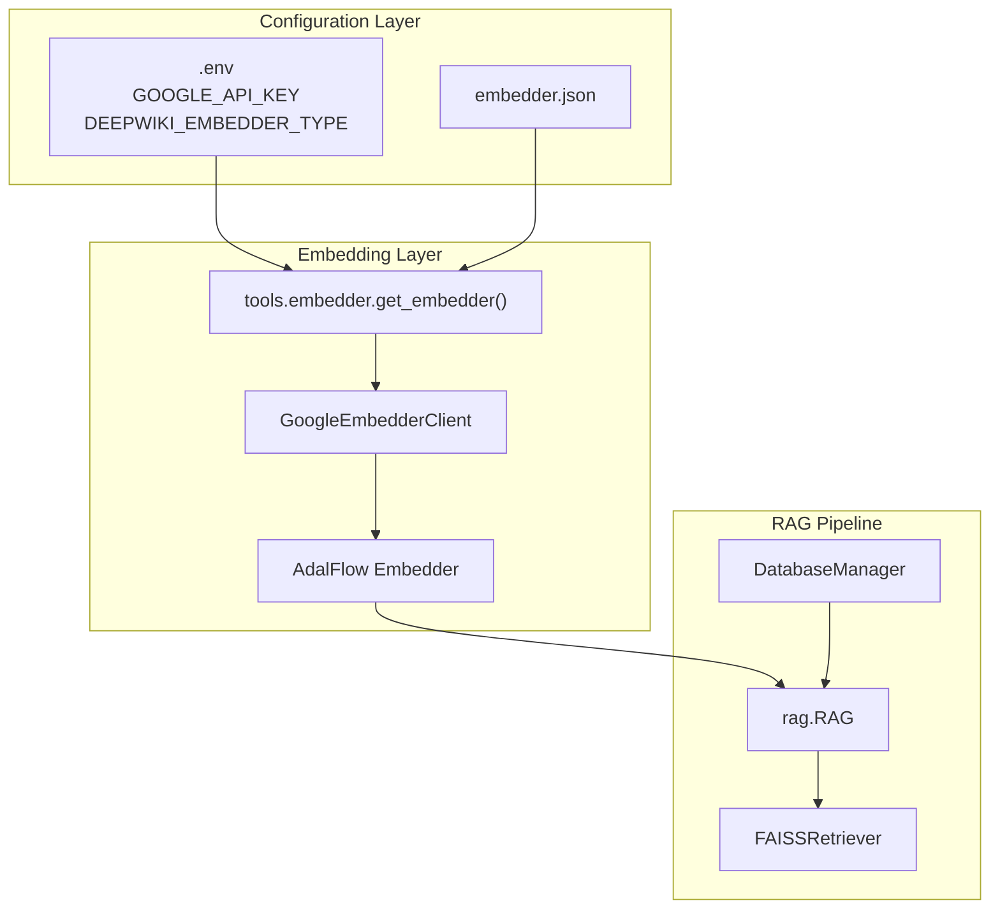
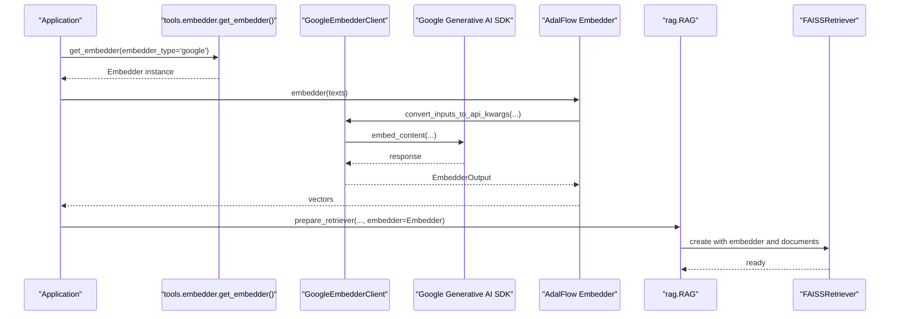
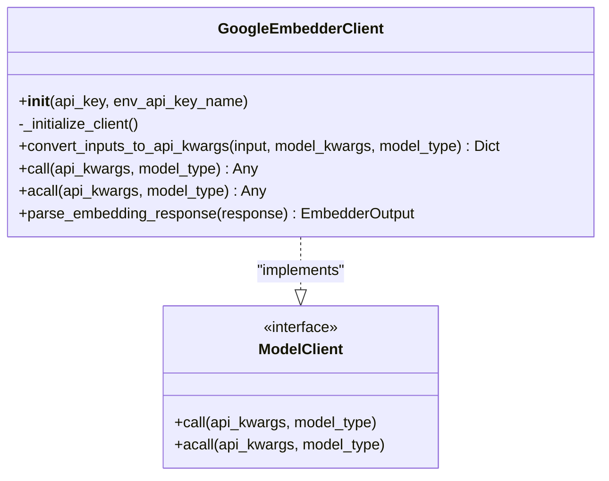
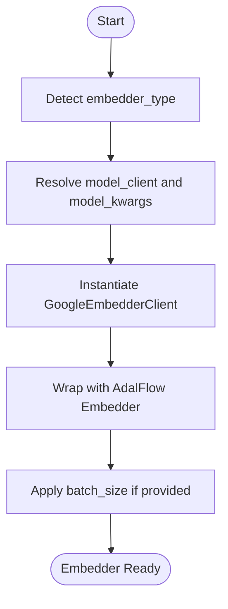
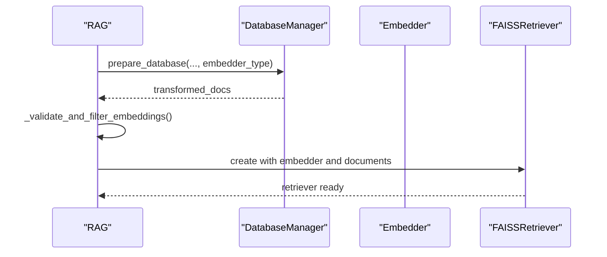
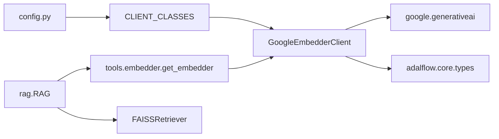

# Google Embedder Integration

<cite>
**Referenced Files in This Document**
- [google_embedder_client.py](file://api/google_embedder_client.py)
- [embedder.py](file://api/tools/embedder.py)
- [config.py](file://api/config.py)
- [embedder.json](file://api/config/embedder.json)
- [rag.py](file://api/rag.py)
- [test_google_embedder.py](file://tests/unit/test_google_embedder.py)
- [README.md](file://README.md)
</cite>

## Table of Contents
1. [Introduction](#introduction)
2. [Project Structure](#project-structure)
3. [Core Components](#core-components)
4. [Architecture Overview](#architecture-overview)
5. [Detailed Component Analysis](#detailed-component-analysis)
6. [Dependency Analysis](#dependency-analysis)
7. [Performance Considerations](#performance-considerations)
8. [Troubleshooting Guide](#troubleshooting-guide)
9. [Conclusion](#conclusion)
10. [Appendices](#appendices)

## Introduction
This document explains the Google Generative AI embedder integration for generating text embeddings using Google’s embedding models. It covers authentication via Google Cloud credentials, model selection, batch processing, response parsing, dimension handling, and normalization options. It also provides practical guidance for configuring embedding models, handling large text batches, integrating with FAISS vector databases, managing quotas and costs, and troubleshooting common issues.

## Project Structure
The Google embedder is implemented as a ModelClient adapter that integrates with the AdalFlow framework. Configuration is centralized in JSON files and resolved at runtime via environment variables. The RAG pipeline consumes embeddings to power retrieval.

**Diagram sources**
- [embedder.py](file://api/tools/embedder.py#L6-L59)
- [config.py](file://api/config.py#L170-L182)
- [google_embedder_client.py](file://api/google_embedder_client.py#L20-L231)
- [rag.py](file://api/rag.py#L153-L244)

**Section sources**
- [README.md](file://README.md#L358-L440)
- [embedder.json](file://api/config/embedder.json#L1-L35)
- [config.py](file://api/config.py#L170-L182)

## Core Components
- GoogleEmbedderClient: Implements the ModelClient interface to call Google’s embed_content API, supports single and batch embeddings, parses responses into EmbedderOutput, and handles retries.
- Embedder factory: Selects the embedder based on configuration and environment, enabling Google, OpenAI, Ollama, and GitHub Copilot providers.
- Configuration loader: Loads embedder.json and resolves model_client classes and parameters.
- RAG pipeline: Integrates embeddings into FAISS-based retrieval for Q&A.

Key capabilities:
- Authentication: Uses GOOGLE_API_KEY environment variable or an explicit API key argument.
- Model selection: Defaults to a modern Google embedding model and supports task_type customization.
- Batch processing: Accepts sequences of texts and maps them to Google’s batch API.
- Response parsing: Converts Google’s embedding response into a normalized EmbedderOutput format.
- Integration: Works with FAISSRetriever for vector search and RAG.

**Section sources**
- [google_embedder_client.py](file://api/google_embedder_client.py#L20-L231)
- [embedder.py](file://api/tools/embedder.py#L6-L59)
- [config.py](file://api/config.py#L170-L182)
- [rag.py](file://api/rag.py#L384-L391)

## Architecture Overview
The Google embedder sits between the application’s configuration and the AdalFlow Embedder. The RAG component orchestrates embedding creation, validation, and FAISS retrieval.

**Diagram sources**
- [embedder.py](file://api/tools/embedder.py#L6-L59)
- [google_embedder_client.py](file://api/google_embedder_client.py#L141-L231)
- [rag.py](file://api/rag.py#L384-L391)

## Detailed Component Analysis

### GoogleEmbedderClient
Responsibilities:
- Initialize client with GOOGLE_API_KEY or an explicit key.
- Convert inputs to Google’s API kwargs (single content or contents for batch).
- Call embed_content and return raw responses.
- Parse responses into EmbedderOutput with normalized embedding data.
- Provide retry behavior via exponential backoff.

Implementation highlights:
- Authentication: Validates presence of API key and configures the Google SDK.
- Input conversion: Ensures input is a sequence; selects content vs contents for single vs batch.
- Task type and model defaults: Sets sensible defaults for task_type and model if not provided.
- Response parsing: Robust handling for dict-like and custom batch response objects.
- Async fallback: acall currently delegates to sync call due to SDK limitations.

**Diagram sources**
- [google_embedder_client.py](file://api/google_embedder_client.py#L20-L231)

**Section sources**
- [google_embedder_client.py](file://api/google_embedder_client.py#L53-L77)
- [google_embedder_client.py](file://api/google_embedder_client.py#L141-L184)
- [google_embedder_client.py](file://api/google_embedder_client.py#L186-L231)
- [google_embedder_client.py](file://api/google_embedder_client.py#L78-L139)

### Embedder Factory and Configuration
- get_embedder selects embedder configuration based on embedder_type or auto-detection from DEEPWIKI_EMBEDDER_TYPE.
- Resolves model_client class and model_kwargs from embedder.json.
- Supports batch_size configuration applied to the returned Embedder instance.

**Diagram sources**
- [embedder.py](file://api/tools/embedder.py#L6-L59)
- [config.py](file://api/config.py#L170-L182)

**Section sources**
- [embedder.py](file://api/tools/embedder.py#L6-L59)
- [config.py](file://api/config.py#L170-L182)
- [embedder.json](file://api/config/embedder.json#L1-L35)

### RAG Integration and FAISS Retrieval
- RAG initializes the selected embedder and prepares a FAISSRetriever using the embedder and transformed documents.
- Embedding validation ensures consistent vector sizes before creating the retriever.
- Query embedding is adapted for provider-specific constraints.

**Diagram sources**
- [rag.py](file://api/rag.py#L345-L415)

**Section sources**
- [rag.py](file://api/rag.py#L345-L415)

## Dependency Analysis
- GoogleEmbedderClient depends on the Google Generative AI SDK and AdalFlow types.
- Configuration resolution ties embedder.json entries to client classes via CLIENT_CLASSES mapping.
- RAG pipeline depends on FAISSRetriever and the embedder produced by get_embedder.

**Diagram sources**
- [google_embedder_client.py](file://api/google_embedder_client.py#L8-L15)
- [config.py](file://api/config.py#L60-L71)
- [embedder.py](file://api/tools/embedder.py#L6-L59)
- [rag.py](file://api/rag.py#L40-L43)

**Section sources**
- [google_embedder_client.py](file://api/google_embedder_client.py#L8-L15)
- [config.py](file://api/config.py#L60-L71)
- [embedder.py](file://api/tools/embedder.py#L6-L59)
- [rag.py](file://api/rag.py#L40-L43)

## Performance Considerations
- Batch processing: Supply sequences of texts to leverage Google’s native batch support via contents. The embedder factory supports a configurable batch_size for higher-level batching.
- Dimension handling: Google’s embedding models return dense vectors; ensure downstream systems expect the correct dimensionality.
- Normalization: The Google SDK does not apply vector normalization by default; normalize vectors if your similarity metric requires it.
- Quota and cost optimization:
  - Use DEEPWIKI_EMBEDDER_TYPE=google to align embeddings with Google’s text generation models and potentially benefit from integrated quotas.
  - Monitor API usage and consider rate-limiting strategies when processing large repositories.
  - Prefer smaller batch sizes if encountering timeouts or memory pressure.
- Alternative providers: The system supports OpenAI, Ollama, and GitHub Copilot embeddings. Switching providers may require regenerating embeddings due to different vector spaces.

[No sources needed since this section provides general guidance]

## Troubleshooting Guide
Common issues and resolutions:
- Missing API key:
  - Ensure GOOGLE_API_KEY is set in the environment or passed to the client constructor.
- Unexpected response structure:
  - The parser handles dict-like and custom batch responses; verify the response shape and check logs for warnings.
- Batch size and dimension mismatches:
  - Validate embedding sizes across documents before creating the FAISS retriever. The RAG component includes validation and filtering logic.
- Rate limits and timeouts:
  - Reduce batch size or add delays between requests. Consider using a more restrictive batch_size in the embedder configuration.
- Provider mismatch:
  - If switching embedders, reprocess documents to align with the new vector space.

**Section sources**
- [google_embedder_client.py](file://api/google_embedder_client.py#L78-L139)
- [rag.py](file://api/rag.py#L251-L343)
- [test_google_embedder.py](file://tests/unit/test_google_embedder.py#L23-L74)

## Conclusion
The Google Generative AI embedder integration provides a robust, configurable pathway to generate high-quality embeddings using Google’s latest models. With strong support for batch processing, flexible configuration, and seamless integration into the RAG pipeline with FAISS, it enables scalable retrieval-augmented applications. Proper configuration of credentials, model parameters, and batch sizing ensures reliable performance and cost efficiency.

[No sources needed since this section summarizes without analyzing specific files]

## Appendices

### Practical Configuration Examples
- Enable Google embeddings:
  - Set DEEPWIKI_EMBEDDER_TYPE=google and provide GOOGLE_API_KEY.
- Adjust batch size:
  - Configure batch_size in embedder.json under the relevant embedder entry.
- Customize model and task:
  - Pass model and task_type via model_kwargs when constructing the embedder.

**Section sources**
- [README.md](file://README.md#L370-L407)
- [embedder.json](file://api/config/embedder.json#L1-L35)
- [embedder.py](file://api/tools/embedder.py#L44-L58)

### Integration with FAISS
- Use FAISSRetriever with the embedder and validated documents.
- Ensure consistent embedding dimensions before creating the retriever.

**Section sources**
- [rag.py](file://api/rag.py#L384-L391)
- [rag.py](file://api/rag.py#L251-L343)

### Authentication and Environment
- GOOGLE_API_KEY is required for Google embeddings.
- DEEPWIKI_EMBEDDER_TYPE controls which embedder is selected.

**Section sources**
- [README.md](file://README.md#L481-L501)
- [config.py](file://api/config.py#L20-L34)