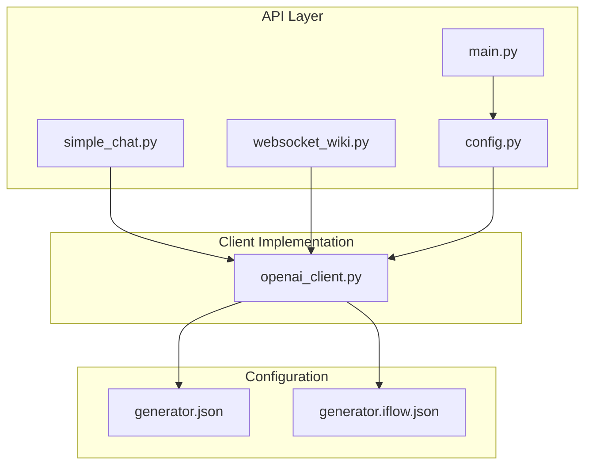
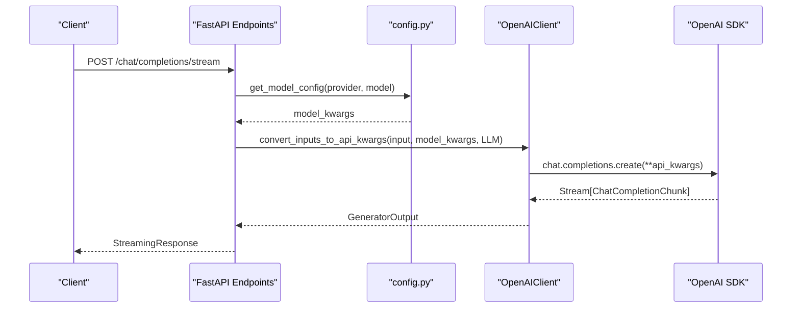
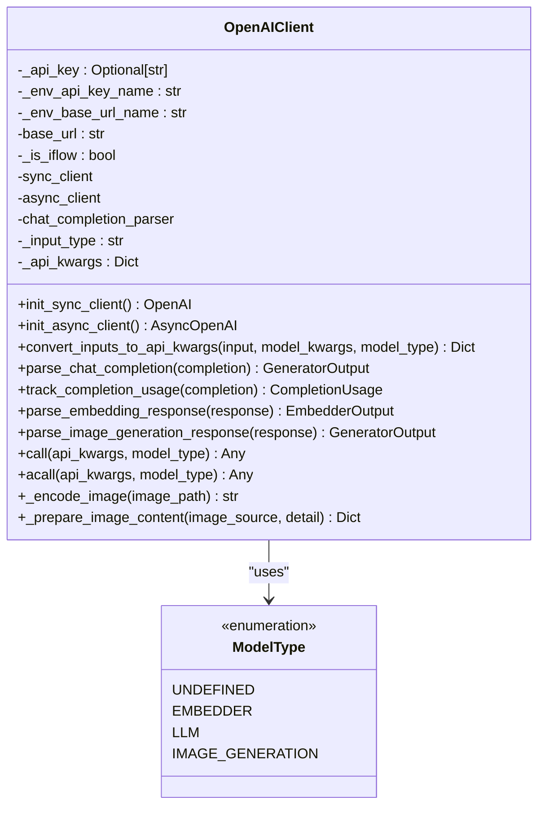
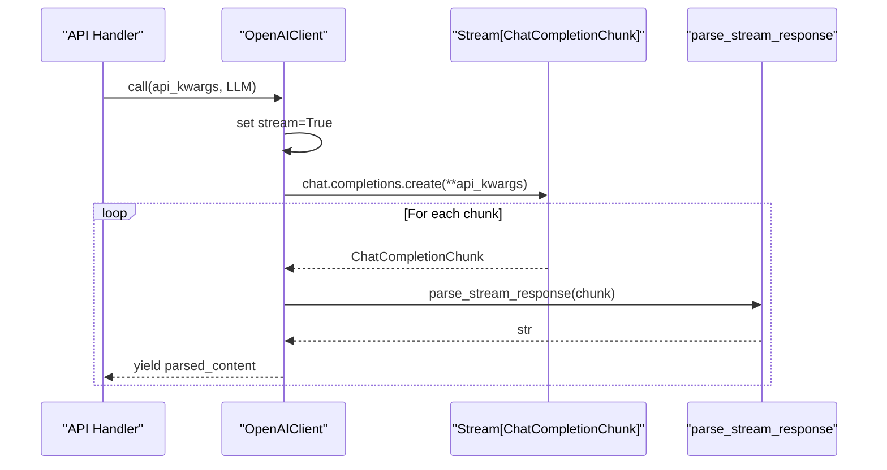
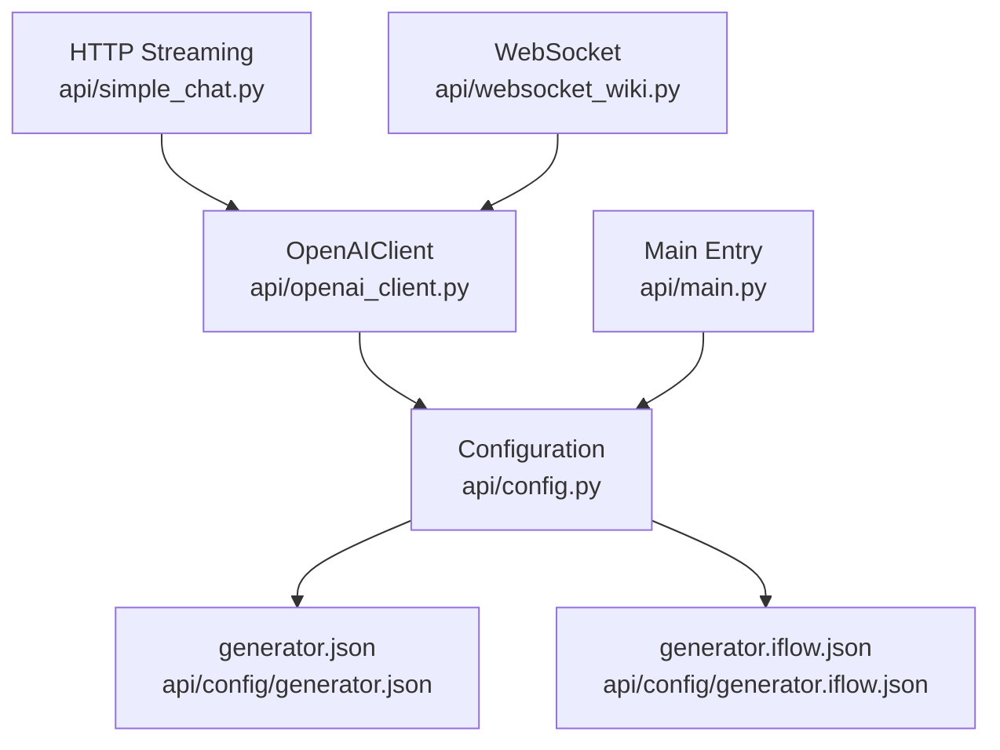

# OpenAI Integration

<cite>
**Referenced Files in This Document**
- [openai_client.py](file://api/openai_client.py)
- [config.py](file://api/config.py)
- [simple_chat.py](file://api/simple_chat.py)
- [websocket_wiki.py](file://api/websocket_wiki.py)
- [main.py](file://api/main.py)
- [generator.json](file://api/config/generator.json)
- [generator.iflow.json](file://api/config/generator.iflow.json)
- [README.md](file://README.md)
- [IFLOW_INTEGRATION.md](file://IFLOW_INTEGRATION.md)
- [PROVIDER_SETUP_GUIDE.md](file://PROVIDER_SETUP_GUIDE.md)
</cite>

## Table of Contents
1. [Introduction](#introduction)
2. [Project Structure](#project-structure)
3. [Core Components](#core-components)
4. [Architecture Overview](#architecture-overview)
5. [Detailed Component Analysis](#detailed-component-analysis)
6. [Dependency Analysis](#dependency-analysis)
7. [Performance Considerations](#performance-considerations)
8. [Troubleshooting Guide](#troubleshooting-guide)
9. [Conclusion](#conclusion)

## Introduction
This document provides comprehensive documentation for OpenAI integration in DeepWiki-Open, focusing on the OpenAIClient implementation for chat completion, embeddings, and image generation. It covers authentication methods, API key configuration, base URL customization for both OpenAI and iFlow providers, streaming response handling, multimodal input support for images, custom parsing functions, practical examples of model selection and parameter configuration, error handling strategies, rate limiting with exponential backoff, token usage tracking, provider-specific optimizations, and custom model deployment scenarios.

## Project Structure
The OpenAI integration spans several modules:
- OpenAIClient implementation for API interactions
- Configuration management for providers and environment variables
- API endpoints for streaming chat and WebSocket chat
- Provider setup and testing utilities

**Diagram sources**
- [simple_chat.py](file://api/simple_chat.py#L1-L900)
- [websocket_wiki.py](file://api/websocket_wiki.py#L1-L978)
- [config.py](file://api/config.py#L1-L464)
- [openai_client.py](file://api/openai_client.py#L1-L653)
- [generator.json](file://api/config/generator.json#L1-L101)
- [generator.iflow.json](file://api/config/generator.iflow.json#L1-L45)

**Section sources**
- [openai_client.py](file://api/openai_client.py#L1-L653)
- [config.py](file://api/config.py#L1-L464)
- [simple_chat.py](file://api/simple_chat.py#L1-L900)
- [websocket_wiki.py](file://api/websocket_wiki.py#L1-L978)
- [generator.json](file://api/config/generator.json#L1-L101)
- [generator.iflow.json](file://api/config/generator.iflow.json#L1-L45)

## Core Components
This section outlines the primary components involved in OpenAI integration.

- OpenAIClient: A wrapper around the OpenAI SDK that supports chat completion, embeddings, and image generation with streaming and multimodal capabilities.
- Configuration Management: Centralized configuration loading and provider mapping for OpenAI and iFlow.
- API Endpoints: HTTP streaming and WebSocket handlers that utilize OpenAIClient for real-time responses.
- Environment Setup: Management of API keys and base URLs for different providers.

Key responsibilities:
- Chat completion with streaming support and custom parsing
- Embedding creation and parsing
- Image generation and editing
- Multimodal inputs (text + images)
- Rate limiting with exponential backoff
- Token usage tracking

**Section sources**
- [openai_client.py](file://api/openai_client.py#L120-L542)
- [config.py](file://api/config.py#L61-L168)
- [simple_chat.py](file://api/simple_chat.py#L76-L522)
- [websocket_wiki.py](file://api/websocket_wiki.py#L53-L779)

## Architecture Overview
The OpenAI integration follows a layered architecture:
- Presentation Layer: HTTP streaming and WebSocket endpoints
- Business Logic Layer: Provider configuration and model selection
- Integration Layer: OpenAIClient wrapping OpenAI SDK
- Data Layer: Configuration files and environment variables

**Diagram sources**
- [simple_chat.py](file://api/simple_chat.py#L76-L660)
- [config.py](file://api/config.py#L381-L463)
- [openai_client.py](file://api/openai_client.py#L281-L492)

**Section sources**
- [simple_chat.py](file://api/simple_chat.py#L76-L660)
- [config.py](file://api/config.py#L381-L463)
- [openai_client.py](file://api/openai_client.py#L281-L492)

## Detailed Component Analysis

### OpenAIClient Implementation
The OpenAIClient class encapsulates OpenAI SDK interactions with additional features for streaming, multimodal inputs, and provider-specific optimizations.

Key capabilities:
- Chat completion with streaming and non-streaming modes
- Embedding creation and parsing
- Image generation, editing, and variations
- Multimodal input support (text + images)
- Custom parsing functions for chat completion
- Token usage tracking
- Rate limiting with exponential backoff

**Diagram sources**
- [openai_client.py](file://api/openai_client.py#L120-L542)

**Section sources**
- [openai_client.py](file://api/openai_client.py#L120-L542)

### Streaming Response Handling
The implementation supports both HTTP streaming and WebSocket streaming with robust error handling and fallback mechanisms.

**Diagram sources**
- [openai_client.py](file://api/openai_client.py#L92-L98)
- [openai_client.py](file://api/openai_client.py#L422-L477)

**Section sources**
- [openai_client.py](file://api/openai_client.py#L92-L98)
- [openai_client.py](file://api/openai_client.py#L422-L477)

### Multimodal Input Support
The client supports multimodal inputs by accepting images through model_kwargs and converting them into OpenAI-compatible content structures.

Supported image sources:
- Local file paths (automatically encoded)
- Remote URLs
- Pre-encoded content dictionaries

**Section sources**
- [openai_client.py](file://api/openai_client.py#L583-L610)
- [openai_client.py](file://api/openai_client.py#L316-L365)

### Authentication and Configuration
The system supports multiple authentication methods and provider configurations:

Environment variables:
- OPENAI_API_KEY: Primary OpenAI API key
- IFLOW_API_KEY: iFlow provider API key
- OPENROUTER_API_KEY: OpenRouter API key
- GOOGLE_API_KEY: Google AI API key

Base URL customization:
- OPENAI_BASE_URL: Custom OpenAI-compatible endpoint
- Provider-specific base URLs in configuration files

**Section sources**
- [config.py](file://api/config.py#L19-L47)
- [config.py](file://api/config.py#L134-L146)
- [README.md](file://README.md#L294-L296)

### Provider-Specific Optimizations
The configuration system enables provider-specific optimizations and custom model deployments.

iFlow provider configuration:
- Uses OpenAIClient with iFlow-specific base URL
- Supports multiple Qwen models
- Includes comprehensive logging and parameter filtering

**Section sources**
- [generator.iflow.json](file://api/config/generator.iflow.json#L1-L45)
- [IFLOW_INTEGRATION.md](file://IFLOW_INTEGRATION.md#L28-L56)

### Practical Examples

#### Model Selection and Parameter Configuration
The system provides flexible model selection through configuration files and runtime parameters.

Example configurations:
- Default provider selection
- Model-specific parameters (temperature, top_p, max_tokens)
- Custom model deployment scenarios

**Section sources**
- [generator.json](file://api/config/generator.json#L1-L101)
- [simple_chat.py](file://api/simple_chat.py#L330-L384)

#### Error Handling Strategies
The implementation includes comprehensive error handling with exponential backoff and fallback mechanisms.

Error categories handled:
- API timeout errors
- Rate limit errors
- Internal server errors
- Bad request errors
- Token limit exceeded

**Section sources**
- [openai_client.py](file://api/openai_client.py#L411-L421)
- [openai_client.py](file://api/openai_client.py#L494-L504)
- [simple_chat.py](file://api/simple_chat.py#L661-L663)

## Dependency Analysis
The OpenAI integration has clear dependencies and relationships between components.

**Diagram sources**
- [openai_client.py](file://api/openai_client.py#L1-L653)
- [config.py](file://api/config.py#L1-L464)
- [generator.json](file://api/config/generator.json#L1-L101)
- [generator.iflow.json](file://api/config/generator.iflow.json#L1-L45)
- [simple_chat.py](file://api/simple_chat.py#L1-L900)
- [websocket_wiki.py](file://api/websocket_wiki.py#L1-L978)
- [main.py](file://api/main.py#L1-L104)

**Section sources**
- [openai_client.py](file://api/openai_client.py#L1-L653)
- [config.py](file://api/config.py#L1-L464)
- [simple_chat.py](file://api/simple_chat.py#L1-L900)
- [websocket_wiki.py](file://api/websocket_wiki.py#L1-L978)
- [main.py](file://api/main.py#L1-L104)

## Performance Considerations
Several performance optimizations are implemented:

- Exponential backoff for rate limiting and transient errors
- Streaming responses for reduced latency
- Token usage tracking for cost optimization
- Provider-specific parameter filtering for iFlow compatibility
- Asynchronous client support for concurrent operations

Best practices:
- Use streaming for real-time responses
- Monitor token usage for cost control
- Configure appropriate model parameters per use case
- Implement proper error handling and retries

**Section sources**
- [openai_client.py](file://api/openai_client.py#L411-L421)
- [openai_client.py](file://api/openai_client.py#L494-L504)
- [simple_chat.py](file://api/simple_chat.py#L370-L384)

## Troubleshooting Guide
Common issues and solutions:

API Key Issues:
- Missing environment variables: Ensure OPENAI_API_KEY or IFLOW_API_KEY is set
- Invalid API keys: Verify key format and permissions
- Provider-specific keys: Check IFLOW_API_KEY for iFlow integration

Configuration Issues:
- Provider not found: Verify generator.json configuration
- Model not available: Check model name and provider support
- Base URL errors: Confirm custom base URL accessibility

Rate Limiting:
- Implement exponential backoff (built-in)
- Monitor token usage
- Use appropriate model parameters to reduce costs

**Section sources**
- [IFLOW_INTEGRATION.md](file://IFLOW_INTEGRATION.md#L125-L146)
- [README.md](file://README.md#L696-L718)

## Conclusion
The OpenAI integration in DeepWiki-Open provides a robust, flexible, and enterprise-ready solution for AI-powered repository analysis and documentation generation. The OpenAIClient implementation offers comprehensive support for chat completion, embeddings, and image generation with advanced features like streaming, multimodal inputs, and provider-specific optimizations. The configuration system enables seamless integration with multiple providers while maintaining simplicity and extensibility for custom model deployments.