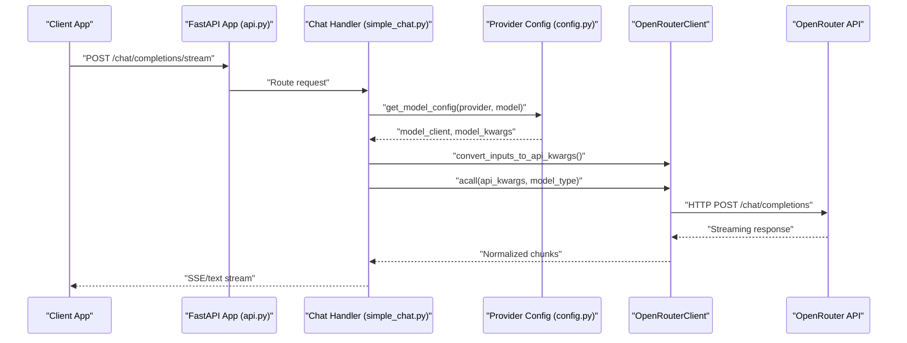
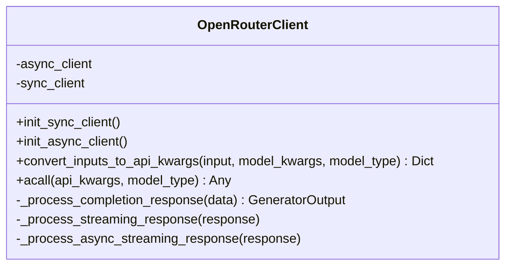
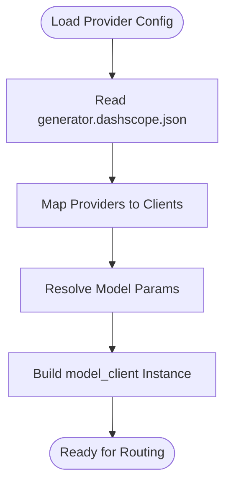
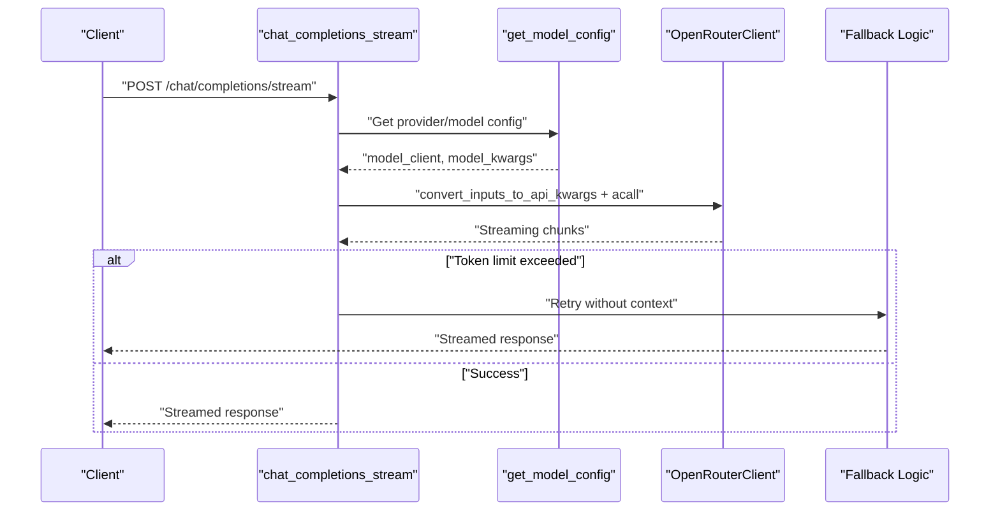
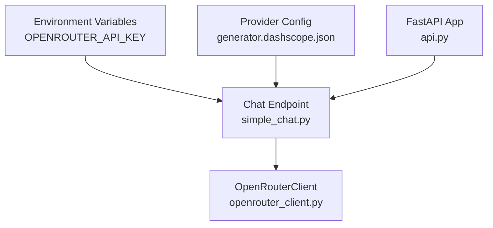

# OpenRouter Integration

<cite>
**Referenced Files in This Document**
- [openrouter_client.py](file://api/openrouter_client.py)
- [simple_chat.py](file://api/simple_chat.py)
- [config.py](file://api/config.py)
- [generator.dashscope.json](file://api/config/generator.dashscope.json)
- [main.py](file://api/main.py)
- [api.py](file://api/api.py)
- [cli.py](file://api/cli.py)
</cite>

## Table of Contents
1. [Introduction](#introduction)
2. [Project Structure](#project-structure)
3. [Core Components](#core-components)
4. [Architecture Overview](#architecture-overview)
5. [Detailed Component Analysis](#detailed-component-analysis)
6. [Dependency Analysis](#dependency-analysis)
7. [Performance Considerations](#performance-considerations)
8. [Troubleshooting Guide](#troubleshooting-guide)
9. [Conclusion](#conclusion)

## Introduction
This document explains the OpenRouter integration for accessing multiple AI models through a unified API platform. It covers authentication via API keys, model selection from diverse providers, routing configuration, and practical examples for model comparison, parameter standardization, and cost optimization. It also addresses multi-provider orchestration, fallback strategies, dynamic model selection, troubleshooting OpenRouter-specific issues, rate limiting management, and best practices for building flexible AI applications.

## Project Structure
The OpenRouter integration spans several modules:
- Client wrapper for OpenRouter API calls
- Provider configuration and model selection
- Streaming chat endpoint that routes to OpenRouter
- CLI tooling for repository processing with configurable providers
- Environment configuration and API key management

```mermaid
graph TB
subgraph "API Layer"
SC["simple_chat.py<br/>Streaming Chat Endpoint"]
API["api.py<br/>FastAPI App"]
MAIN["main.py<br/>Uvicorn Entrypoint"]
end
subgraph "Provider Config"
CFG["config.py<br/>Provider Config Loader"]
GEN["generator.dashscope.json<br/>Provider/Model Definitions"]
end
subgraph "Clients"
ORC["openrouter_client.py<br/>OpenRouterClient"]
end
subgraph "CLI"
CLI["cli.py<br/>Repository Processing Tool"]
end
SC --> ORC
SC --> CFG
API --> SC
MAIN --> API
CFG --> GEN
CLI --> CFG
CLI --> ORC
```

**Diagram sources**
- [simple_chat.py](file://api/simple_chat.py#L76-L887)
- [openrouter_client.py](file://api/openrouter_client.py#L19-L526)
- [config.py](file://api/config.py#L10-L464)
- [generator.dashscope.json](file://api/config/generator.dashscope.json#L89-L129)
- [main.py](file://api/main.py#L87-L104)
- [api.py](file://api/api.py#L1-L635)
- [cli.py](file://api/cli.py#L92-L384)

**Section sources**
- [openrouter_client.py](file://api/openrouter_client.py#L19-L526)
- [simple_chat.py](file://api/simple_chat.py#L76-L887)
- [config.py](file://api/config.py#L10-L464)
- [generator.dashscope.json](file://api/config/generator.dashscope.json#L89-L129)
- [main.py](file://api/main.py#L87-L104)
- [api.py](file://api/api.py#L1-L635)
- [cli.py](file://api/cli.py#L92-L384)

## Core Components
- OpenRouterClient: A ModelClient wrapper that converts inputs to OpenRouter’s API format, handles synchronous and asynchronous calls, and normalizes streaming responses. It sets required headers, ensures non-streaming mode for async calls, and validates response formats.
- Provider configuration: Centralized configuration loader resolves provider-specific clients and model parameters, including OpenRouter’s provider definition and model families.
- Streaming chat endpoint: Routes requests to OpenRouter, standardizes parameters, and applies fallback strategies when token limits or provider errors occur.
- CLI integration: Supports selecting OpenRouter as a model provider and model for repository processing.

Key capabilities:
- Authentication via OPENROUTER_API_KEY environment variable
- Unified model selection across providers (including OpenRouter)
- Parameter standardization across providers
- Fallback handling for token limit exceeded scenarios
- Dynamic model selection based on configuration

**Section sources**
- [openrouter_client.py](file://api/openrouter_client.py#L39-L111)
- [config.py](file://api/config.py#L381-L464)
- [simple_chat.py](file://api/simple_chat.py#L413-L435)
- [cli.py](file://api/cli.py#L105-L113)

## Architecture Overview
The OpenRouter integration follows a layered architecture:
- API layer exposes endpoints for streaming chat and model configuration
- Provider configuration layer loads provider definitions and model parameters
- Client layer encapsulates OpenRouter API interactions
- CLI layer orchestrates repository processing with configurable providers



**Diagram sources**
- [simple_chat.py](file://api/simple_chat.py#L76-L887)
- [openrouter_client.py](file://api/openrouter_client.py#L112-L358)
- [config.py](file://api/config.py#L381-L464)
- [api.py](file://api/api.py#L394-L401)

## Detailed Component Analysis

### OpenRouterClient
The OpenRouterClient extends a generic ModelClient and implements:
- Initialization of sync and async clients with base URL and API key
- Input conversion to OpenRouter’s messages format
- Asynchronous HTTP calls with proper headers and error handling
- Response normalization for both non-streaming and streaming modes
- XML extraction and validation for structured outputs



**Diagram sources**
- [openrouter_client.py](file://api/openrouter_client.py#L19-L526)

**Section sources**
- [openrouter_client.py](file://api/openrouter_client.py#L39-L111)
- [openrouter_client.py](file://api/openrouter_client.py#L112-L358)
- [openrouter_client.py](file://api/openrouter_client.py#L359-L526)

### Provider Configuration and Routing
Provider configuration is loaded from JSON files and mapped to client classes. OpenRouter is supported as a provider with a default model and model family definitions. The configuration loader resolves model parameters and constructs model_client instances.



**Diagram sources**
- [generator.dashscope.json](file://api/config/generator.dashscope.json#L89-L129)
- [config.py](file://api/config.py#L127-L168)
- [config.py](file://api/config.py#L381-L464)

**Section sources**
- [generator.dashscope.json](file://api/config/generator.dashscope.json#L89-L129)
- [config.py](file://api/config.py#L127-L168)
- [config.py](file://api/config.py#L381-L464)

### Streaming Chat Endpoint with OpenRouter
The streaming chat endpoint:
- Validates request messages and prepares conversation history
- Builds prompts with optional RAG context and file content
- Resolves provider/model configuration and constructs OpenRouter API kwargs
- Streams responses and applies fallback logic for token limit exceeded scenarios



**Diagram sources**
- [simple_chat.py](file://api/simple_chat.py#L76-L887)
- [simple_chat.py](file://api/simple_chat.py#L582-L592)
- [simple_chat.py](file://api/simple_chat.py#L755-L773)

**Section sources**
- [simple_chat.py](file://api/simple_chat.py#L76-L887)
- [simple_chat.py](file://api/simple_chat.py#L582-L592)
- [simple_chat.py](file://api/simple_chat.py#L755-L773)

### CLI Integration
The CLI supports selecting OpenRouter as a model provider and model for repository processing. It resolves provider configuration and invokes the generator client accordingly.

**Section sources**
- [cli.py](file://api/cli.py#L105-L113)
- [cli.py](file://api/cli.py#L244-L263)

## Dependency Analysis
OpenRouter integration depends on:
- Environment variables for API keys
- Provider configuration files for model families
- FastAPI endpoints for streaming and configuration
- Client classes for model interactions



**Diagram sources**
- [main.py](file://api/main.py#L60-L77)
- [generator.dashscope.json](file://api/config/generator.dashscope.json#L89-L129)
- [api.py](file://api/api.py#L394-L401)
- [simple_chat.py](file://api/simple_chat.py#L76-L887)
- [openrouter_client.py](file://api/openrouter_client.py#L19-L526)

**Section sources**
- [main.py](file://api/main.py#L60-L77)
- [generator.dashscope.json](file://api/config/generator.dashscope.json#L89-L129)
- [api.py](file://api/api.py#L394-L401)
- [simple_chat.py](file://api/simple_chat.py#L76-L887)
- [openrouter_client.py](file://api/openrouter_client.py#L19-L526)

## Performance Considerations
- Streaming vs. non-streaming: OpenRouterClient forces non-streaming for async calls; streaming is handled internally for normalized chunk delivery.
- Token limits: The chat handler detects token limit errors and retries without context to maintain responsiveness.
- Parameter standardization: Model parameters are standardized across providers to reduce overhead and improve portability.
- Caching and fallback: Use server-side caching for wiki structures and pages to minimize repeated API calls.

[No sources needed since this section provides general guidance]

## Troubleshooting Guide
Common OpenRouter-specific issues and resolutions:
- Missing API key: The client logs a warning and returns a generator that yields an error message. Ensure OPENROUTER_API_KEY is set in the environment.
- Non-200 responses: The client logs the HTTP status and returns a generator with the error text. Verify endpoint accessibility and API key validity.
- Unexpected response format: The client validates response structure and yields an error message if choices or content are missing.
- XML content handling: The client attempts to extract and validate wiki_structure XML, with fallbacks for malformed content.
- Rate limiting and timeouts: Configure timeouts and consider exponential backoff in upstream integrations. Monitor provider quotas and adjust model selection accordingly.

Operational checks:
- Confirm OPENROUTER_API_KEY is present in the environment
- Validate model identifiers and parameters against provider configuration
- Review logs for detailed error messages and HTTP status codes

**Section sources**
- [openrouter_client.py](file://api/openrouter_client.py#L117-L125)
- [openrouter_client.py](file://api/openrouter_client.py#L155-L162)
- [openrouter_client.py](file://api/openrouter_client.py#L316-L320)
- [openrouter_client.py](file://api/openrouter_client.py#L209-L301)
- [main.py](file://api/main.py#L60-L77)

## Conclusion
The OpenRouter integration provides a unified, standardized pathway to access multiple AI models across providers. By centralizing configuration, normalizing parameters, and implementing robust error handling and fallbacks, the system enables flexible, resilient AI applications. Developers can easily compare models, optimize for cost and performance, and adapt to provider availability and pricing changes through dynamic model selection and routing.