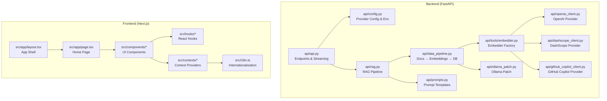
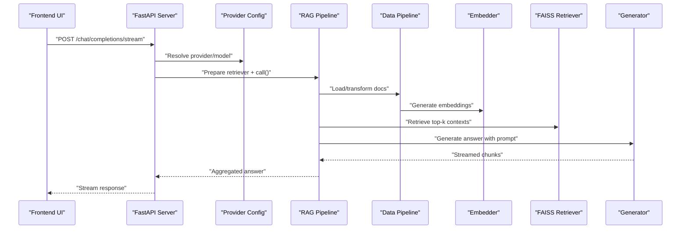
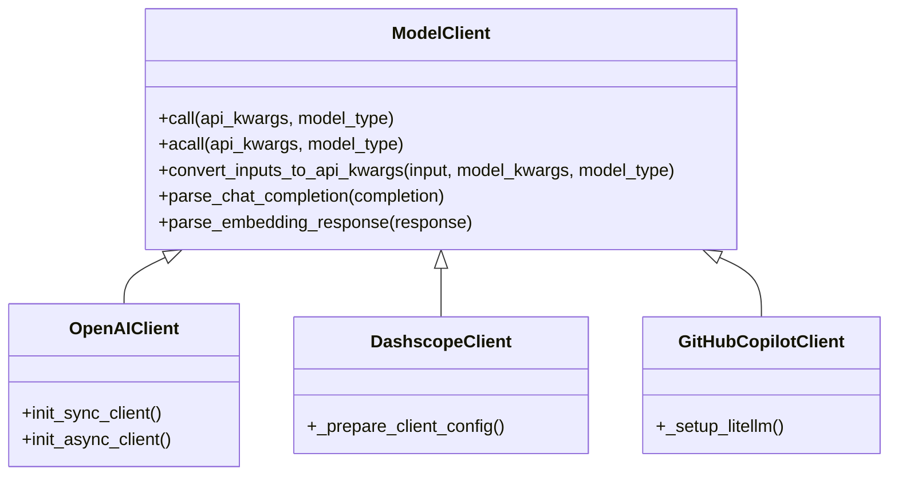
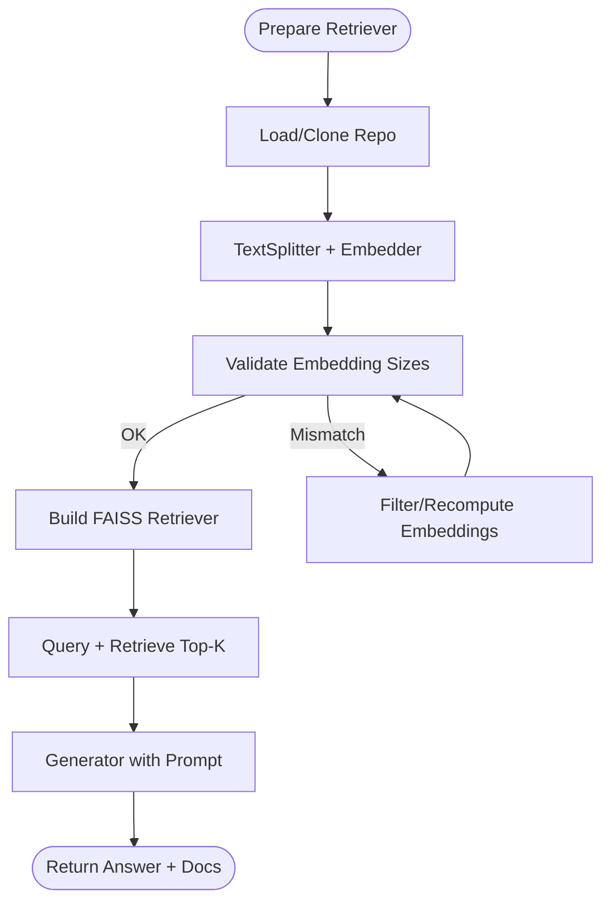
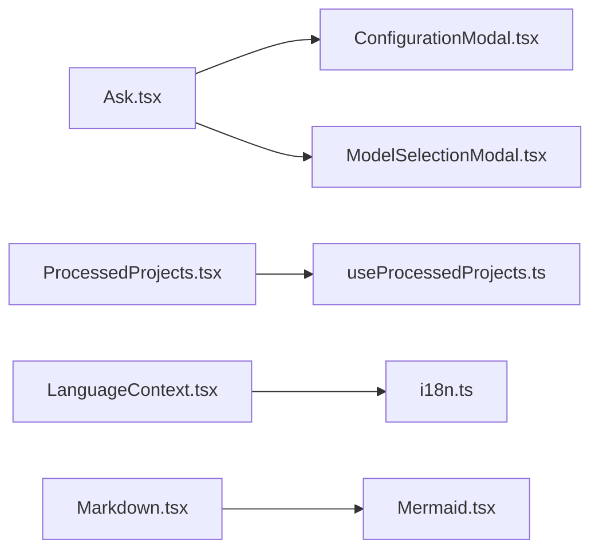
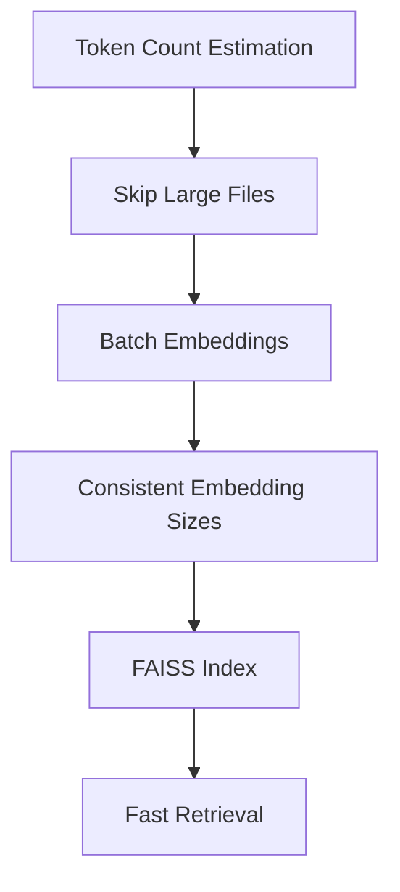
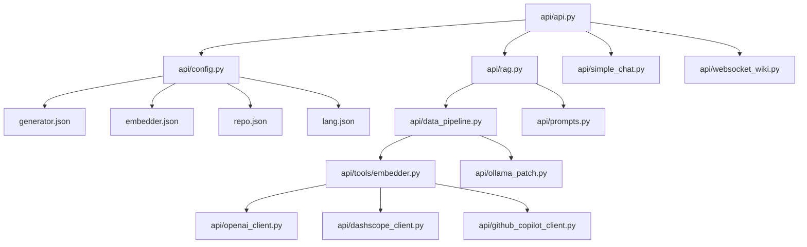

# Advanced Topics

<cite>
**Referenced Files in This Document**
- [api.py](file://api/api.py)
- [config.py](file://api/config.py)
- [rag.py](file://api/rag.py)
- [prompts.py](file://api/prompts.py)
- [data_pipeline.py](file://api/data_pipeline.py)
- [openai_client.py](file://api/openai_client.py)
- [dashscope_client.py](file://api/dashscope_client.py)
- [github_copilot_client.py](file://api/github_copilot_client.py)
- [ollama_patch.py](file://api/ollama_patch.py)
- [embedder.py](file://api/tools/embedder.py)
- [simple_chat.py](file://api/simple_chat.py)
- [websocket_wiki.py](file://api/websocket_wiki.py)
- [cli.py](file://api/cli.py)
- [main.py](file://api/main.py)
- [layout.tsx](file://src/app/layout.tsx)
- [page.tsx](file://src/app/page.tsx)
- [Ask.tsx](file://src/components/Ask.tsx)
- [ConfigurationModal.tsx](file://src/components/ConfigurationModal.tsx)
- [ModelSelectionModal.tsx](file://src/components/ModelSelectionModal.tsx)
- [BranchSelector.tsx](file://src/components/BranchSelector.tsx)
- [UserSelector.tsx](file://src/components/UserSelector.tsx)
- [ProcessedProjects.tsx](file://src/components/ProcessedProjects.tsx)
- [Markdown.tsx](file://src/components/Markdown.tsx)
- [Mermaid.tsx](file://src/components/Mermaid.tsx)
- [theme-toggle.tsx](file://src/components/theme-toggle.tsx)
- [useProcessedProjects.ts](file://src/hooks/useProcessedProjects.ts)
- [LanguageContext.tsx](file://src/contexts/LanguageContext.tsx)
- [i18n.ts](file://src/i18n.ts)
- [repo_wiki_gen.py](file://api/repo_wiki_gen.py)
- [json_flatten_utils.py](file://api/json_flatten_utils.py)
- [Dockerfile](file://Dockerfile)
- [docker-compose.yml](file://docker-compose.yml)
- [run.sh](file://run.sh)
- [setup_provider.sh](file://setup_provider.sh)
- [PROVIDER_SETUP_GUIDE.md](file://PROVIDER_SETUP_GUIDE.md)
- [DASHSCOPE_SETUP_GUIDE.md](file://DASHSCOPE_SETUP_GUIDE.md)
- [README.md](file://README.md)
</cite>

## Table of Contents
1. [Introduction](#introduction)
2. [Project Structure](#project-structure)
3. [Core Components](#core-components)
4. [Architecture Overview](#architecture-overview)
5. [Detailed Component Analysis](#detailed-component-analysis)
6. [Dependency Analysis](#dependency-analysis)
7. [Performance Considerations](#performance-considerations)
8. [Troubleshooting Guide](#troubleshooting-guide)
9. [Conclusion](#conclusion)
10. [Appendices](#appendices)

## Introduction
This document provides advanced guidance for DeepWiki-Open, focusing on custom provider development, performance tuning, security considerations for enterprise deployments, and UI customization. It explains extension points for adding new AI providers, modifying the Retrieval-Augmented Generation (RAG) system, and extending the React-based frontend. It also covers advanced configuration options, prompt engineering, model optimization strategies, debugging, profiling, and enterprise-specific modifications.

## Project Structure
DeepWiki-Open is a FastAPI backend with a Next.js frontend. The backend exposes streaming chat, RAG, caching, and export endpoints, while the frontend provides interactive UI components for chat, configuration, and project listing.

**Diagram sources**
- [api/api.py](file://api/api.py#L1-L635)
- [api/config.py](file://api/config.py#L1-L464)
- [api/rag.py](file://api/rag.py#L1-L446)
- [api/data_pipeline.py](file://api/data_pipeline.py#L1-L917)
- [api/prompts.py](file://api/prompts.py#L1-L192)
- [api/tools/embedder.py](file://api/tools/embedder.py#L1-L59)
- [api/openai_client.py](file://api/openai_client.py#L1-L653)
- [api/dashscope_client.py](file://api/dashscope_client.py#L1-L917)
- [api/github_copilot_client.py](file://api/github_copilot_client.py#L1-L898)
- [api/ollama_patch.py](file://api/ollama_patch.py#L1-L105)
- [src/app/layout.tsx](file://src/app/layout.tsx)
- [src/app/page.tsx](file://src/app/page.tsx)
- [src/components/Ask.tsx](file://src/components/Ask.tsx)
- [src/components/ConfigurationModal.tsx](file://src/components/ConfigurationModal.tsx)
- [src/components/ModelSelectionModal.tsx](file://src/components/ModelSelectionModal.tsx)
- [src/components/BranchSelector.tsx](file://src/components/BranchSelector.tsx)
- [src/components/UserSelector.tsx](file://src/components/UserSelector.tsx)
- [src/components/ProcessedProjects.tsx](file://src/components/ProcessedProjects.tsx)
- [src/components/Markdown.tsx](file://src/components/Markdown.tsx)
- [src/components/Mermaid.tsx](file://src/components/Mermaid.tsx)
- [src/components/theme-toggle.tsx](file://src/components/theme-toggle.tsx)
- [src/hooks/useProcessedProjects.ts](file://src/hooks/useProcessedProjects.ts)
- [src/contexts/LanguageContext.tsx](file://src/contexts/LanguageContext.tsx)
- [src/i18n.ts](file://src/i18n.ts)

**Section sources**
- [api/api.py](file://api/api.py#L1-L635)
- [api/config.py](file://api/config.py#L1-L464)
- [src/app/layout.tsx](file://src/app/layout.tsx)
- [src/app/page.tsx](file://src/app/page.tsx)

## Core Components
- Backend API server with streaming chat, RAG, wiki cache, export, and health endpoints.
- Provider abstraction via configuration-driven model clients (OpenAI, DashScope, GitHub Copilot, Ollama, Bedrock, Azure, Google).
- RAG pipeline integrating document ingestion, splitting, embedding, FAISS retrieval, and generator.
- Frontend components for chat, configuration, project listing, and internationalization.

Key advanced extension points:
- New providers: add client class and update provider mapping and configuration.
- Custom prompts: modify templates in prompts module.
- RAG tuning: adjust text splitter, embedder, retriever, and generator parameters.
- UI customization: extend components and integrate with hooks/contexts.

**Section sources**
- [api/api.py](file://api/api.py#L1-L635)
- [api/config.py](file://api/config.py#L1-L464)
- [api/rag.py](file://api/rag.py#L1-L446)
- [api/prompts.py](file://api/prompts.py#L1-L192)
- [api/data_pipeline.py](file://api/data_pipeline.py#L1-L917)
- [api/tools/embedder.py](file://api/tools/embedder.py#L1-L59)

## Architecture Overview
The system integrates a FastAPI backend with a Next.js frontend. The backend orchestrates provider selection, document processing, embedding, retrieval, and generation. The frontend renders chat UI, configuration modals, and project listings.

**Diagram sources**
- [api/api.py](file://api/api.py#L394-L401)
- [api/config.py](file://api/config.py#L381-L463)
- [api/rag.py](file://api/rag.py#L153-L243)
- [api/data_pipeline.py](file://api/data_pipeline.py#L408-L476)
- [api/tools/embedder.py](file://api/tools/embedder.py#L6-L58)

**Section sources**
- [api/api.py](file://api/api.py#L1-L635)
- [api/rag.py](file://api/rag.py#L153-L243)
- [api/data_pipeline.py](file://api/data_pipeline.py#L408-L476)

## Detailed Component Analysis

### Custom Provider Development
To add a new AI provider:
1. Create a new client class under api/ that implements the ModelClient interface (see patterns in OpenAI/DashScope/GitHub Copilot clients).
2. Extend provider mapping and configuration resolution:
   - Add client class to CLIENT_CLASSES mapping.
   - Define provider configuration in generator.json with model_client and model parameters.
   - Optionally expose supportsCustomModel in provider config.
3. Update provider selection logic if needed in get_model_config().

**Diagram sources**
- [api/openai_client.py](file://api/openai_client.py#L120-L542)
- [api/dashscope_client.py](file://api/dashscope_client.py#L115-L206)
- [api/github_copilot_client.py](file://api/github_copilot_client.py#L30-L91)

Practical steps:
- Implement call/acall with backoff and error handling.
- Provide convert_inputs_to_api_kwargs to normalize inputs.
- Add provider to generator.json and map in config loader.
- Test with get_model_config() and RAG pipeline.

**Section sources**
- [api/config.py](file://api/config.py#L60-L71)
- [api/config.py](file://api/config.py#L127-L168)
- [api/config.py](file://api/config.py#L381-L463)
- [api/openai_client.py](file://api/openai_client.py#L120-L542)
- [api/dashscope_client.py](file://api/dashscope_client.py#L115-L206)
- [api/github_copilot_client.py](file://api/github_copilot_client.py#L30-L91)

### RAG System Customization
Key tunable components:
- Text splitting: adjust text_splitter in embedder.json.
- Embedding model: configure embedder_* sections and batch_size.
- Retriever: tune retriever parameters in embedder.json.
- Generator: select provider/model and prompt template.

**Diagram sources**
- [api/rag.py](file://api/rag.py#L345-L415)
- [api/data_pipeline.py](file://api/data_pipeline.py#L408-L476)
- [api/rag.py](file://api/rag.py#L251-L343)

Optimization tips:
- Ensure consistent embedding dimensions; the pipeline validates and filters mismatches.
- Tune batch_size for embedders that support batching.
- Adjust FAISS retriever parameters for recall/latency trade-offs.

**Section sources**
- [api/rag.py](file://api/rag.py#L251-L343)
- [api/data_pipeline.py](file://api/data_pipeline.py#L408-L476)

### Prompt Engineering and Templates
Prompts define system behavior and formatting expectations. Modify templates to change output style, language enforcement, and structure.

- RAG_SYSTEM_PROMPT and RAG_TEMPLATE control context formatting and output constraints.
- Simple chat prompts support iterative research and concise answers.

Best practices:
- Keep system prompts explicit about language and formatting.
- Use output format instructions to constrain generator output.
- Validate prompt changes with small test sets.

**Section sources**
- [api/prompts.py](file://api/prompts.py#L1-L192)

### UI Extension Points
Frontend components can be extended to support custom workflows:
- Ask.tsx: chat input and streaming handling.
- ConfigurationModal.tsx and ModelSelectionModal.tsx: provider/model selection.
- ProcessedProjects.tsx: list server-side caches.
- Hooks and contexts: manage language and processed projects state.

**Diagram sources**
- [src/components/Ask.tsx](file://src/components/Ask.tsx)
- [src/components/ConfigurationModal.tsx](file://src/components/ConfigurationModal.tsx)
- [src/components/ModelSelectionModal.tsx](file://src/components/ModelSelectionModal.tsx)
- [src/components/ProcessedProjects.tsx](file://src/components/ProcessedProjects.tsx)
- [src/hooks/useProcessedProjects.ts](file://src/hooks/useProcessedProjects.ts)
- [src/contexts/LanguageContext.tsx](file://src/contexts/LanguageContext.tsx)
- [src/i18n.ts](file://src/i18n.ts)
- [src/components/Markdown.tsx](file://src/components/Markdown.tsx)
- [src/components/Mermaid.tsx](file://src/components/Mermaid.tsx)

**Section sources**
- [src/components/Ask.tsx](file://src/components/Ask.tsx)
- [src/components/ConfigurationModal.tsx](file://src/components/ConfigurationModal.tsx)
- [src/components/ModelSelectionModal.tsx](file://src/components/ModelSelectionModal.tsx)
- [src/components/ProcessedProjects.tsx](file://src/components/ProcessedProjects.tsx)
- [src/hooks/useProcessedProjects.ts](file://src/hooks/useProcessedProjects.ts)
- [src/contexts/LanguageContext.tsx](file://src/contexts/LanguageContext.tsx)
- [src/i18n.ts](file://src/i18n.ts)
- [src/components/Markdown.tsx](file://src/components/Markdown.tsx)
- [src/components/Mermaid.tsx](file://src/components/Mermaid.tsx)

### Advanced Configuration Options
- Provider configuration: generator.json defines providers, default models, and model parameters.
- Embedder configuration: embedder.json and embedder_*/retriever/text_splitter sections.
- Environment variables: DEEPWIKI_* controls authentication, embedder type, and config directory.
- Language configuration: lang.json defines supported languages and defaults.

Recommendations:
- Centralize secrets via environment variables.
- Use DEEPWIKI_CONFIG_DIR to override configuration locations.
- Enable DEEPWIKI_AUTH_MODE and set DEEPWIKI_AUTH_CODE for enterprise access control.

**Section sources**
- [api/config.py](file://api/config.py#L19-L47)
- [api/config.py](file://api/config.py#L103-L181)
- [api/config.py](file://api/config.py#L280-L307)

### Security Considerations for Enterprise Deployments
- Authentication: /auth/validate endpoint and WIKI_AUTH_MODE/WIKI_AUTH_CODE.
- CORS: configured broadly; restrict origins in production.
- Secrets: store API keys in environment variables; avoid hardcoding.
- File system cache: wiki cache stored under ~/.adalflow/wikicache; ensure filesystem permissions.
- Network: configure base URLs for providers; use private networks for on-premises providers.

**Section sources**
- [api/api.py](file://api/api.py#L153-L165)
- [api/api.py](file://api/api.py#L26-L33)
- [api/api.py](file://api/api.py#L520-L538)
- [api/config.py](file://api/config.py#L19-L47)

### Performance Tuning and Optimization
- Embedding batching: set batch_size in embedder configuration for providers that support it.
- Token limits: provider-specific limits enforced during ingestion.
- Ollama-specific: single-string embedding and individual document processing.
- Streaming: backend streams responses; frontend renders incremental updates.
- Caching: server-side wiki cache reduces repeated processing.

**Diagram sources**
- [api/data_pipeline.py](file://api/data_pipeline.py#L37-L59)
- [api/data_pipeline.py](file://api/data_pipeline.py#L61-L101)
- [api/data_pipeline.py](file://api/data_pipeline.py#L408-L476)
- [api/rag.py](file://api/rag.py#L251-L343)

**Section sources**
- [api/data_pipeline.py](file://api/data_pipeline.py#L25-L60)
- [api/data_pipeline.py](file://api/data_pipeline.py#L61-L101)
- [api/rag.py](file://api/rag.py#L251-L343)

### Debugging Complex Issues
- Logging: centralized via logging_config; inspect INFO/ERROR logs for failures.
- Embedding validation: logs embedding sizes and filters invalid documents.
- Provider-specific diagnostics: client classes log API calls and errors.
- Streaming: verify stream handling in simple_chat and websocket_wiki.

Common checks:
- Verify provider credentials and model availability.
- Confirm embedding model consistency and sizes.
- Inspect cache paths and permissions.
- Validate repository access tokens for private repos.

**Section sources**
- [api/rag.py](file://api/rag.py#L395-L414)
- [api/openai_client.py](file://api/openai_client.py#L411-L421)
- [api/dashscope_client.py](file://api/dashscope_client.py#L391-L401)
- [api/github_copilot_client.py](file://api/github_copilot_client.py#L519-L542)

### Enterprise-Specific Modifications
- Authentication gating: enforce auth via /auth/validate and environment flags.
- Multi-language support: configure lang.json and use language-aware prompts.
- Private registries: configure provider base URLs and credentials.
- On-premises models: use Ollama patch and ensure model availability.

**Section sources**
- [api/api.py](file://api/api.py#L153-L165)
- [api/config.py](file://api/config.py#L280-L307)
- [api/ollama_patch.py](file://api/ollama_patch.py#L21-L60)

### Contributing Guidelines and Backward Compatibility
- Keep provider interfaces consistent (ModelClient).
- Maintain backward-compatible parameter names where possible.
- Update configuration loaders when adding new provider fields.
- Preserve default behaviors and logging.

**Section sources**
- [api/config.py](file://api/config.py#L381-L463)
- [api/openai_client.py](file://api/openai_client.py#L543-L559)
- [api/dashscope_client.py](file://api/dashscope_client.py#L601-L613)

## Dependency Analysis
Provider and pipeline dependencies:

**Diagram sources**
- [api/config.py](file://api/config.py#L103-L181)
- [api/api.py](file://api/api.py#L1-L635)
- [api/rag.py](file://api/rag.py#L1-L446)
- [api/data_pipeline.py](file://api/data_pipeline.py#L1-L917)
- [api/tools/embedder.py](file://api/tools/embedder.py#L1-L59)
- [api/openai_client.py](file://api/openai_client.py#L1-L653)
- [api/dashscope_client.py](file://api/dashscope_client.py#L1-L917)
- [api/github_copilot_client.py](file://api/github_copilot_client.py#L1-L898)
- [api/ollama_patch.py](file://api/ollama_patch.py#L1-L105)

**Section sources**
- [api/config.py](file://api/config.py#L103-L181)
- [api/api.py](file://api/api.py#L1-L635)

## Performance Considerations
- Embedding throughput: increase batch_size for compatible providers; use OllamaDocumentProcessor for single-document processing.
- Retrieval latency: tune FAISS parameters and index type.
- Streaming efficiency: minimize payload sizes and avoid unnecessary logging in hot paths.
- Caching: leverage server-side wiki cache to avoid recomputation.

[No sources needed since this section provides general guidance]

## Troubleshooting Guide
- Authentication failures: verify DEEPWIKI_AUTH_MODE and DEEPWIKI_AUTH_CODE.
- Provider errors: check client logs and backoff behavior.
- Embedding mismatches: review validation logs and ensure consistent model dimensions.
- Ollama issues: confirm model availability and use OllamaDocumentProcessor.

**Section sources**
- [api/api.py](file://api/api.py#L520-L538)
- [api/openai_client.py](file://api/openai_client.py#L411-L421)
- [api/rag.py](file://api/rag.py#L395-L414)
- [api/ollama_patch.py](file://api/ollama_patch.py#L21-L60)

## Conclusion
DeepWiki-Open offers robust extension points for custom providers, RAG tuning, and UI customization. By leveraging configuration-driven provider selection, validated embedding pipelines, and modular components, teams can adapt the system for enterprise-grade performance and security while maintaining backward compatibility.

[No sources needed since this section summarizes without analyzing specific files]

## Appendices

### Practical Examples and Workflows
- Custom provider integration: add client class and generator.json entry; test with get_model_config().
- Custom RAG workflow: adjust text_splitter and retriever parameters; validate with embedding size logs.
- Enterprise deployment: enable auth, restrict CORS, and secure secrets via environment variables.
- UI customization: extend Ask.tsx and ConfigurationModal.tsx to support new provider options.

**Section sources**
- [api/config.py](file://api/config.py#L127-L168)
- [api/rag.py](file://api/rag.py#L345-L415)
- [api/api.py](file://api/api.py#L26-L33)

### Advanced Configuration Reference
- generator.json: providers, default models, model parameters.
- embedder.json and embedder_*/retriever/text_splitter: embedding and indexing parameters.
- lang.json: supported languages and defaults.
- Environment variables: DEEPWIKI_* for auth, embedder type, and config directory.

**Section sources**
- [api/config.py](file://api/config.py#L103-L181)
- [api/config.py](file://api/config.py#L280-L307)

### Deployment and DevOps Notes
- Dockerfile and docker-compose.yml for containerized deployment.
- run.sh and setup_provider.sh for local orchestration.
- PROVIDER_SETUP_GUIDE.md and DASHSCOPE_SETUP_GUIDE.md for provider-specific setup.

**Section sources**
- [Dockerfile](file://Dockerfile)
- [docker-compose.yml](file://docker-compose.yml)
- [run.sh](file://run.sh)
- [setup_provider.sh](file://setup_provider.sh)
- [PROVIDER_SETUP_GUIDE.md](file://PROVIDER_SETUP_GUIDE.md)
- [DASHSCOPE_SETUP_GUIDE.md](file://DASHSCOPE_SETUP_GUIDE.md)