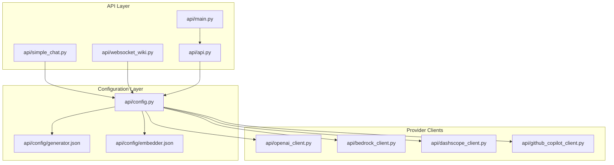
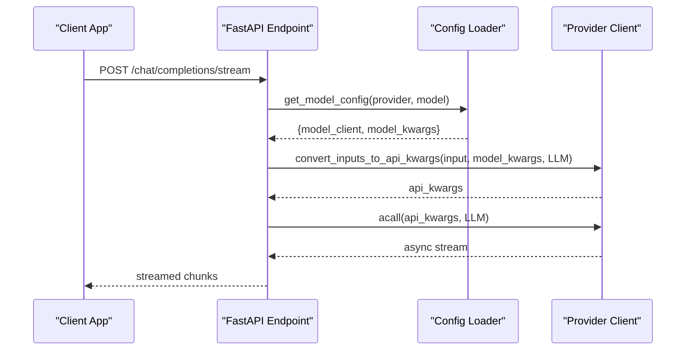
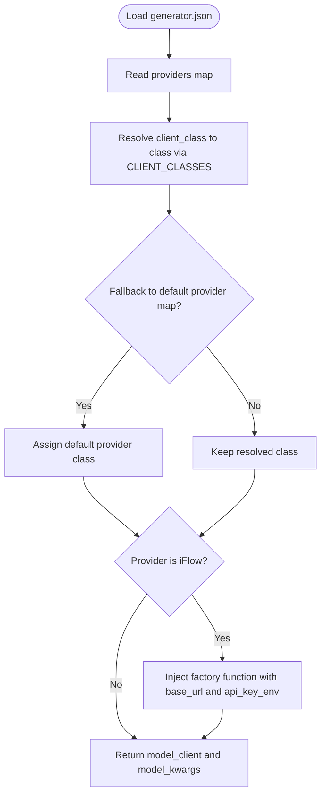
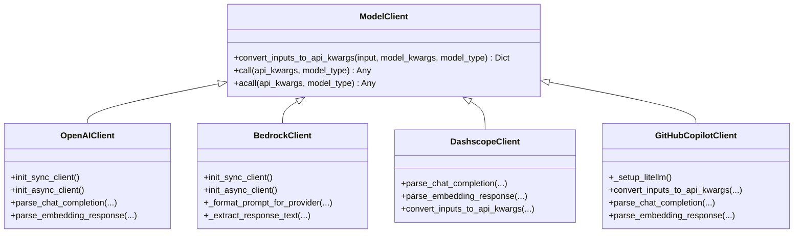
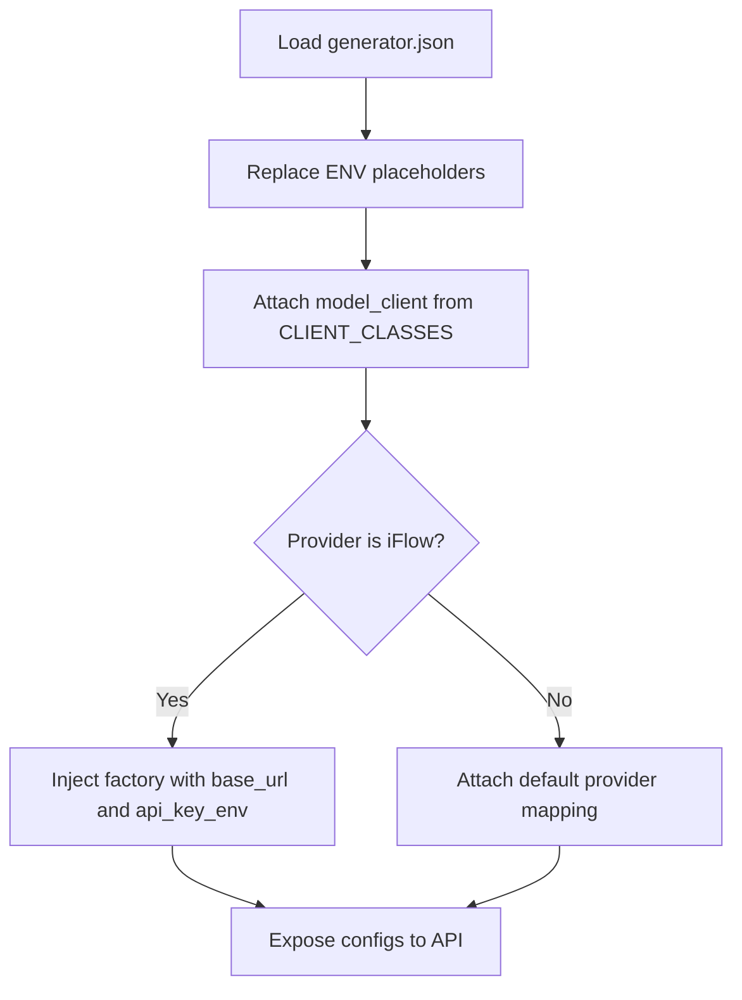
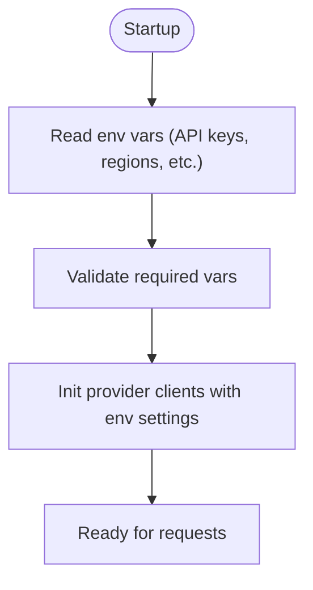
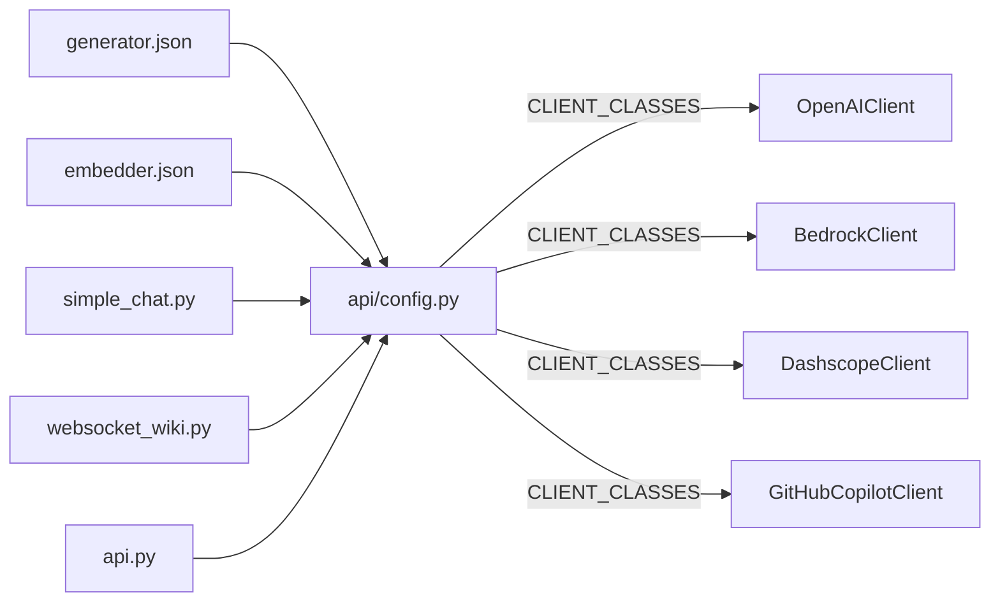

# Custom Provider Development

<cite>
**Referenced Files in This Document**
- [api/config.py](file://api/config.py)
- [api/config/generator.json](file://api/config/generator.json)
- [api/config/embedder.json](file://api/config/embedder.json)
- [api/openai_client.py](file://api/openai_client.py)
- [api/bedrock_client.py](file://api/bedrock_client.py)
- [api/dashscope_client.py](file://api/dashscope_client.py)
- [api/github_copilot_client.py](file://api/github_copilot_client.py)
- [api/simple_chat.py](file://api/simple_chat.py)
- [api/websocket_wiki.py](file://api/websocket_wiki.py)
- [api/main.py](file://api/main.py)
- [api/api.py](file://api/api.py)
</cite>

## Table of Contents
1. [Introduction](#introduction)
2. [Project Structure](#project-structure)
3. [Core Components](#core-components)
4. [Architecture Overview](#architecture-overview)
5. [Detailed Component Analysis](#detailed-component-analysis)
6. [Dependency Analysis](#dependency-analysis)
7. [Performance Considerations](#performance-considerations)
8. [Troubleshooting Guide](#troubleshooting-guide)
9. [Conclusion](#conclusion)
10. [Appendices](#appendices)

## Introduction
This document explains how to develop custom AI model providers in DeepWiki-Open. It focuses on the provider factory pattern, the client class registration system, and the configuration-driven architecture. You will learn how to extend existing base classes, implement required interfaces, integrate with the configuration system, and register new providers. It also covers provider-specific parameter handling, environment variable integration, authentication methods, rate limiting, error handling, and testing strategies.

## Project Structure
DeepWiki-Open organizes provider integrations under the api/ package. Providers are implemented as client classes that inherit from a shared ModelClient base and are registered in a central CLIENT_CLASSES mapping. Configuration files define providers, models, and runtime parameters. The API layer resolves provider configuration and instantiates clients accordingly.

**Diagram sources**
- [api/config.py](file://api/config.py#L60-L71)
- [api/config/generator.json](file://api/config/generator.json#L1-L101)
- [api/config/embedder.json](file://api/config/embedder.json#L1-L35)
- [api/openai_client.py](file://api/openai_client.py#L120-L130)
- [api/bedrock_client.py](file://api/bedrock_client.py#L20-L36)
- [api/dashscope_client.py](file://api/dashscope_client.py#L115-L129)
- [api/github_copilot_client.py](file://api/github_copilot_client.py#L30-L70)
- [api/simple_chat.py](file://api/simple_chat.py#L76-L80)
- [api/websocket_wiki.py](file://api/websocket_wiki.py#L53-L57)
- [api/main.py](file://api/main.py#L1-L104)
- [api/api.py](file://api/api.py#L1-L635)

**Section sources**
- [api/config.py](file://api/config.py#L60-L71)
- [api/config/generator.json](file://api/config/generator.json#L1-L101)
- [api/config/embedder.json](file://api/config/embedder.json#L1-L35)
- [api/simple_chat.py](file://api/simple_chat.py#L76-L80)
- [api/websocket_wiki.py](file://api/websocket_wiki.py#L53-L57)
- [api/main.py](file://api/main.py#L1-L104)
- [api/api.py](file://api/api.py#L1-L635)

## Core Components
- Provider factory pattern: The configuration loader resolves provider configuration and constructs model clients. For some providers (e.g., iFlow), a factory function is returned to configure provider-specific parameters at runtime.
- Client class registration: A centralized CLIENT_CLASSES mapping maps string identifiers to concrete client classes. This enables dynamic selection of providers based on configuration.
- Configuration-driven architecture: Provider and model parameters are defined in JSON configuration files. The loader injects environment variables, sets defaults, and maps client classes to providers.
- Environment variable integration: Providers read credentials and base URLs from environment variables. The configuration module validates and logs missing variables.
- Parameter handling: Each client normalizes inputs to API-specific kwargs via convert_inputs_to_api_kwargs and applies provider-specific transformations.

**Section sources**
- [api/config.py](file://api/config.py#L60-L71)
- [api/config.py](file://api/config.py#L127-L181)
- [api/config.py](file://api/config.py#L381-L463)
- [api/config.py](file://api/config.py#L19-L47)
- [api/openai_client.py](file://api/openai_client.py#L281-L393)
- [api/bedrock_client.py](file://api/bedrock_client.py#L298-L317)
- [api/dashscope_client.py](file://api/dashscope_client.py#L316-L389)
- [api/github_copilot_client.py](file://api/github_copilot_client.py#L114-L209)

## Architecture Overview
The system follows a layered architecture:
- Configuration layer loads and normalizes provider settings from JSON and environment variables.
- Provider clients encapsulate API-specific logic and expose a uniform interface.
- API endpoints resolve provider configuration, instantiate clients, and stream responses.

**Diagram sources**
- [api/simple_chat.py](file://api/simple_chat.py#L330-L331)
- [api/simple_chat.py](file://api/simple_chat.py#L339-L390)
- [api/config.py](file://api/config.py#L381-L463)
- [api/openai_client.py](file://api/openai_client.py#L401-L493)
- [api/bedrock_client.py](file://api/bedrock_client.py#L298-L317)
- [api/dashscope_client.py](file://api/dashscope_client.py#L402-L492)
- [api/github_copilot_client.py](file://api/github_copilot_client.py#L519-L663)

## Detailed Component Analysis

### Provider Factory Pattern and CLIENT_CLASSES Mapping
- CLIENT_CLASSES maps human-readable client class names to actual classes. This enables configuration-driven selection of providers.
- The configuration loader resolves provider.client_class to a class and attaches it as model_client. For iFlow, a factory function is injected to configure base_url and api_key_env at runtime.
- get_model_config returns a normalized configuration including model_client and model_kwargs, applying provider-specific adjustments.

**Diagram sources**
- [api/config.py](file://api/config.py#L60-L71)
- [api/config.py](file://api/config.py#L127-L181)
- [api/config.py](file://api/config.py#L381-L463)

**Section sources**
- [api/config.py](file://api/config.py#L60-L71)
- [api/config.py](file://api/config.py#L127-L181)
- [api/config.py](file://api/config.py#L381-L463)

### Extending Existing Base Classes
- All provider clients inherit from a shared ModelClient base and implement:
  - convert_inputs_to_api_kwargs: Normalize inputs to provider-specific kwargs.
  - call/acall: Synchronous and asynchronous API calls.
  - parse_* methods: Parse responses into standardized output types.
- Example patterns:
  - OpenAI-compatible providers (OpenAI, OpenRouter, Dashscope) use OpenAI SDK clients and normalize inputs/messages.
  - AWS Bedrock client uses boto3 and formats provider-specific prompts.
  - GitHub Copilot client integrates via LiteLLM with automatic OAuth2.

**Diagram sources**
- [api/openai_client.py](file://api/openai_client.py#L120-L130)
- [api/bedrock_client.py](file://api/bedrock_client.py#L20-L36)
- [api/dashscope_client.py](file://api/dashscope_client.py#L115-L129)
- [api/github_copilot_client.py](file://api/github_copilot_client.py#L30-L70)

**Section sources**
- [api/openai_client.py](file://api/openai_client.py#L120-L130)
- [api/bedrock_client.py](file://api/bedrock_client.py#L20-L36)
- [api/dashscope_client.py](file://api/dashscope_client.py#L115-L129)
- [api/github_copilot_client.py](file://api/github_copilot_client.py#L30-L70)

### Configuration-Driven Registration and Resolution
- generator.json defines providers, default models, and per-model parameters.
- embedder.json defines embedder clients and batch settings.
- The loader:
  - Loads JSON files from a configurable directory.
  - Replaces ${ENV_VAR} placeholders with environment values.
  - Resolves client classes via CLIENT_CLASSES.
  - Injects provider-specific overrides (e.g., iFlow base_url and api_key_env).
  - Exposes get_model_config to API endpoints.

**Diagram sources**
- [api/config.py](file://api/config.py#L104-L126)
- [api/config.py](file://api/config.py#L127-L181)
- [api/config.py](file://api/config.py#L381-L463)
- [api/config/generator.json](file://api/config/generator.json#L1-L101)

**Section sources**
- [api/config.py](file://api/config.py#L104-L126)
- [api/config.py](file://api/config.py#L127-L181)
- [api/config.py](file://api/config.py#L381-L463)
- [api/config/generator.json](file://api/config/generator.json#L1-L101)
- [api/config/embedder.json](file://api/config/embedder.json#L1-L35)

### Provider-Specific Parameter Handling and Environment Variables
- Environment variables are read and validated early in startup and used to configure clients:
  - API keys, base URLs, and region settings are read from environment variables.
  - Missing required variables are logged as warnings.
- Provider clients:
  - OpenAI-compatible clients accept base_url and env_api_key_name for customization.
  - Bedrock client reads AWS credentials and supports role assumption.
  - Dashscope client supports workspace ID and OpenAI-compatible embeddings.
  - GitHub Copilot uses automatic OAuth2 via LiteLLM.

**Diagram sources**
- [api/main.py](file://api/main.py#L60-L77)
- [api/config.py](file://api/config.py#L19-L47)
- [api/openai_client.py](file://api/openai_client.py#L161-L216)
- [api/bedrock_client.py](file://api/bedrock_client.py#L38-L104)
- [api/dashscope_client.py](file://api/dashscope_client.py#L131-L206)
- [api/github_copilot_client.py](file://api/github_copilot_client.py#L72-L92)

**Section sources**
- [api/main.py](file://api/main.py#L60-L77)
- [api/config.py](file://api/config.py#L19-L47)
- [api/openai_client.py](file://api/openai_client.py#L161-L216)
- [api/bedrock_client.py](file://api/bedrock_client.py#L38-L104)
- [api/dashscope_client.py](file://api/dashscope_client.py#L131-L206)
- [api/github_copilot_client.py](file://api/github_copilot_client.py#L72-L92)

### Authentication Methods
- OpenAI-compatible providers: API key via environment variable or constructor parameter.
- AWS Bedrock: Access key/secret or role assumption; region configurable.
- Dashscope: API key and optional workspace ID; OpenAI-compatible base URL.
- GitHub Copilot: Automatic OAuth2 via LiteLLM; optional GITHUB_TOKEN for IDE integration.

**Section sources**
- [api/openai_client.py](file://api/openai_client.py#L161-L216)
- [api/bedrock_client.py](file://api/bedrock_client.py#L38-L104)
- [api/dashscope_client.py](file://api/dashscope_client.py#L131-L206)
- [api/github_copilot_client.py](file://api/github_copilot_client.py#L72-L106)

### Rate Limiting and Error Handling
- Backoff retries are applied around API calls for transient errors (timeouts, rate limits, server errors).
- Provider clients catch provider-specific exceptions and return standardized outputs with error fields.
- API endpoints wrap provider calls and return user-friendly error messages with guidance.

**Section sources**
- [api/openai_client.py](file://api/openai_client.py#L411-L421)
- [api/openai_client.py](file://api/openai_client.py#L494-L503)
- [api/bedrock_client.py](file://api/bedrock_client.py#L221-L225)
- [api/dashscope_client.py](file://api/dashscope_client.py#L391-L401)
- [api/dashscope_client.py](file://api/dashscope_client.py#L494-L503)
- [api/simple_chat.py](file://api/simple_chat.py#L582-L652)
- [api/websocket_wiki.py](file://api/websocket_wiki.py#L581-L770)

### Step-by-Step: Adding a New Provider
Follow these steps to add a new provider (e.g., AWS Bedrock, custom cloud service, or local model server):

1. Create a new client class
- Extend the shared ModelClient base.
- Implement convert_inputs_to_api_kwargs to normalize inputs to provider-specific kwargs.
- Implement call/acall to perform API requests.
- Add provider-specific parsing helpers and error handling.

2. Register the client class
- Add an entry to CLIENT_CLASSES in the configuration module so it can be referenced by name in configuration files.

3. Define provider configuration
- Add a provider block to generator.json with:
  - client_class matching the registered class name.
  - default_model and per-model parameters.
  - provider-specific overrides (e.g., base_url, api_key_env for iFlow-like providers).

4. Integrate environment variables
- Read required credentials from environment variables in your client’s initialization.
- Ensure missing variables are logged and handled gracefully.

5. Wire into API endpoints
- API endpoints call get_model_config to resolve provider configuration and instantiate clients.
- Ensure convert_inputs_to_api_kwargs and call/acall are invoked with the correct model_type.

6. Test the provider
- Unit tests can validate convert_inputs_to_api_kwargs and call/acall behavior.
- Integration tests can exercise streaming responses and error scenarios.

**Section sources**
- [api/config.py](file://api/config.py#L60-L71)
- [api/config/generator.json](file://api/config/generator.json#L1-L101)
- [api/openai_client.py](file://api/openai_client.py#L281-L393)
- [api/bedrock_client.py](file://api/bedrock_client.py#L298-L317)
- [api/dashscope_client.py](file://api/dashscope_client.py#L316-L389)
- [api/github_copilot_client.py](file://api/github_copilot_client.py#L114-L209)
- [api/simple_chat.py](file://api/simple_chat.py#L330-L390)
- [api/websocket_wiki.py](file://api/websocket_wiki.py#L435-L536)

### Example: Adding AWS Bedrock
- BedrockClient demonstrates:
  - Reading AWS credentials from environment variables or constructor parameters.
  - Formatting provider-specific prompts and extracting response text.
  - Applying backoff for transient errors.

**Section sources**
- [api/bedrock_client.py](file://api/bedrock_client.py#L20-L36)
- [api/bedrock_client.py](file://api/bedrock_client.py#L66-L104)
- [api/bedrock_client.py](file://api/bedrock_client.py#L221-L225)
- [api/bedrock_client.py](file://api/bedrock_client.py#L298-L317)

### Example: iFlow Provider Factory
- iFlow uses a factory function to configure base_url and api_key_env at runtime.
- get_model_config injects the factory for iFlow, ensuring correct client instantiation.

**Section sources**
- [api/config.py](file://api/config.py#L431-L462)
- [api/simple_chat.py](file://api/simple_chat.py#L339-L390)

## Dependency Analysis
The configuration loader depends on:
- CLIENT_CLASSES mapping for dynamic client resolution.
- Environment variables for credentials and base URLs.
- JSON configuration files for provider definitions and model parameters.

API endpoints depend on:
- get_model_config to resolve provider configuration.
- Provider clients to convert inputs and perform calls.

**Diagram sources**
- [api/config.py](file://api/config.py#L60-L71)
- [api/config/generator.json](file://api/config/generator.json#L1-L101)
- [api/config/embedder.json](file://api/config/embedder.json#L1-L35)
- [api/simple_chat.py](file://api/simple_chat.py#L330-L331)
- [api/websocket_wiki.py](file://api/websocket_wiki.py#L435-L436)
- [api/api.py](file://api/api.py#L167-L208)

**Section sources**
- [api/config.py](file://api/config.py#L60-L71)
- [api/config/generator.json](file://api/config/generator.json#L1-L101)
- [api/config/embedder.json](file://api/config/embedder.json#L1-L35)
- [api/simple_chat.py](file://api/simple_chat.py#L330-L331)
- [api/websocket_wiki.py](file://api/websocket_wiki.py#L435-L436)
- [api/api.py](file://api/api.py#L167-L208)

## Performance Considerations
- Streaming responses reduce latency and memory usage.
- Backoff retries mitigate transient failures without blocking the main thread.
- Batch embedding support (e.g., DashScope) reduces API overhead for vectorization tasks.
- Token counting helps avoid oversized requests that exceed provider context windows.

[No sources needed since this section provides general guidance]

## Troubleshooting Guide
Common issues and resolutions:
- Missing environment variables:
  - Verify required variables are set and logged during startup.
  - API endpoints provide targeted error messages when keys are missing.
- Provider-specific errors:
  - Backoff is applied for timeouts and rate limits; check provider logs for details.
  - For GitHub Copilot, ensure OAuth2 access and optional GITHUB_TOKEN are configured.
- iFlow parameter filtering:
  - Only supported parameters are passed; unsupported keys are filtered out.
- Token limit exceeded:
  - API falls back to simplified prompts without context when inputs are too large.

**Section sources**
- [api/main.py](file://api/main.py#L60-L77)
- [api/simple_chat.py](file://api/simple_chat.py#L569-L734)
- [api/websocket_wiki.py](file://api/websocket_wiki.py#L785-L800)
- [api/github_copilot_client.py](file://api/github_copilot_client.py#L72-L106)

## Conclusion
DeepWiki-Open’s provider architecture enables extensible, configuration-driven integrations. By registering client classes, defining provider configurations, and leveraging environment variables, you can add custom providers with minimal boilerplate. The factory pattern and centralized configuration loader ensure consistent behavior across providers, while robust error handling and streaming support deliver reliable performance.

[No sources needed since this section summarizes without analyzing specific files]

## Appendices

### Testing Strategies for Custom Providers
- Unit tests:
  - Validate convert_inputs_to_api_kwargs produces expected kwargs.
  - Mock provider APIs to test call/acall behavior and error paths.
- Integration tests:
  - Exercise streaming responses and error scenarios.
  - Validate configuration loading and CLIENT_CLASSES resolution.
- Configuration validation:
  - Ensure generator.json and embedder.json are well-formed and contain required fields.
  - Confirm environment variables are read and applied correctly.

[No sources needed since this section provides general guidance]