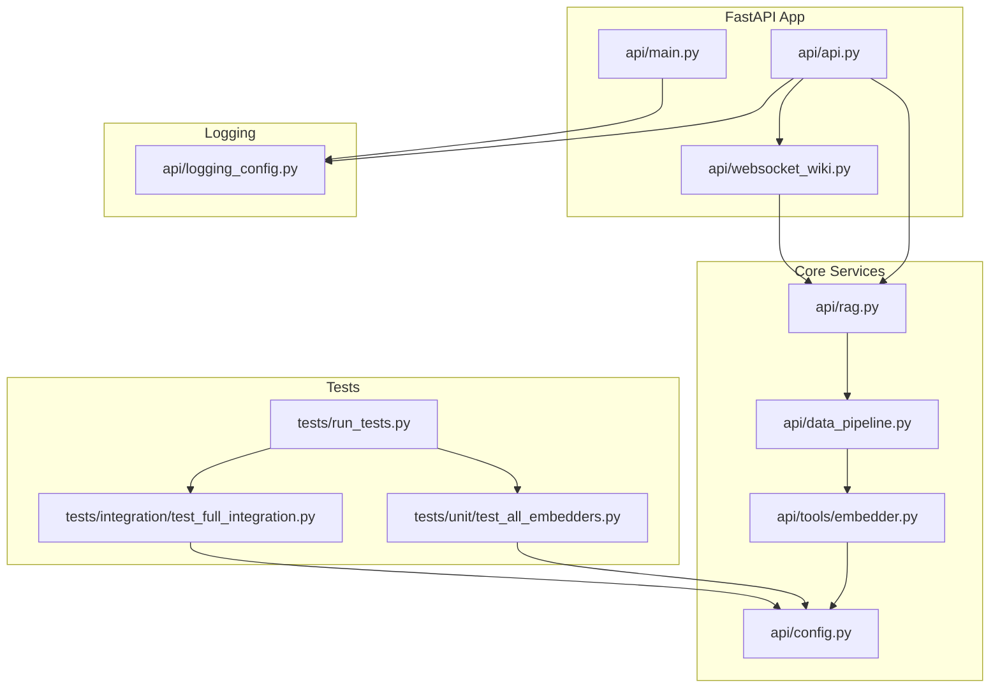
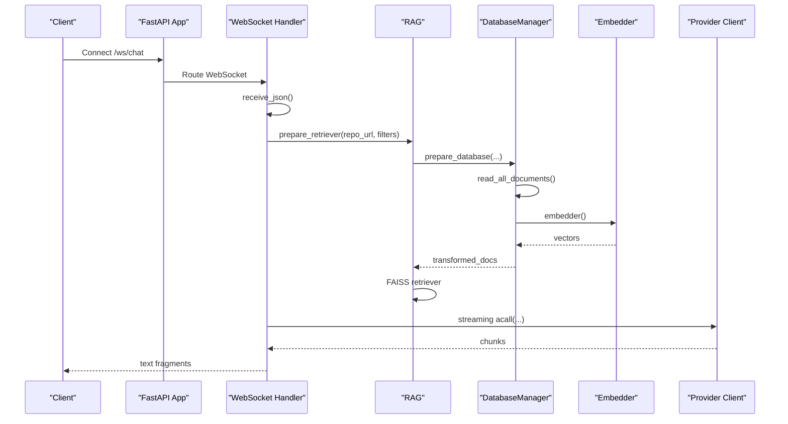
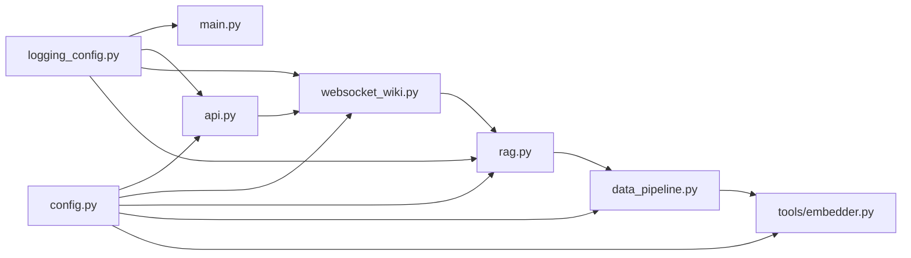

# Debugging and Profiling

<cite>
**Referenced Files in This Document**
- [api/logging_config.py](file://api/logging_config.py)
- [api/main.py](file://api/main.py)
- [api/api.py](file://api/api.py)
- [api/websocket_wiki.py](file://api/websocket_wiki.py)
- [api/rag.py](file://api/rag.py)
- [api/data_pipeline.py](file://api/data_pipeline.py)
- [api/config.py](file://api/config.py)
- [api/tools/embedder.py](file://api/tools/embedder.py)
- [tests/unit/test_all_embedders.py](file://tests/unit/test_all_embedders.py)
- [tests/integration/test_full_integration.py](file://tests/integration/test_full_integration.py)
- [tests/run_tests.py](file://tests/run_tests.py)
</cite>

## Table of Contents
1. [Introduction](#introduction)
2. [Project Structure](#project-structure)
3. [Core Components](#core-components)
4. [Architecture Overview](#architecture-overview)
5. [Detailed Component Analysis](#detailed-component-analysis)
6. [Dependency Analysis](#dependency-analysis)
7. [Performance Considerations](#performance-considerations)
8. [Troubleshooting Guide](#troubleshooting-guide)
9. [Conclusion](#conclusion)
10. [Appendices](#appendices)

## Introduction
This document provides comprehensive debugging and profiling guidance for DeepWiki-Open. It covers logging configuration and structured logging patterns, debugging strategies for RAG and embedding systems, WebSocket debugging for real-time chat, performance profiling and memory/CPU analysis, and troubleshooting for provider connectivity, cache corruption, and configuration errors. It also outlines testing workflows and diagnostics to resolve complex system issues.

## Project Structure
The backend is a FastAPI application with modular components:
- Logging and startup: centralized logging configuration and development reload behavior
- API surface: endpoints for model config, wiki cache, export, and chat streaming
- Real-time chat: WebSocket handler for interactive chat with RAG and provider integrations
- RAG and data pipeline: repository processing, embedding validation, and FAISS retrieval
- Configuration: provider and embedder selection via environment variables and JSON configs
- Tests: unit, integration, and API tests for validation and debugging

**Diagram sources**
- [api/api.py](file://api/api.py#L1-L635)
- [api/websocket_wiki.py](file://api/websocket_wiki.py#L1-L978)
- [api/rag.py](file://api/rag.py#L1-L446)
- [api/data_pipeline.py](file://api/data_pipeline.py#L1-L917)
- [api/config.py](file://api/config.py#L1-L464)
- [api/tools/embedder.py](file://api/tools/embedder.py#L1-L59)
- [api/logging_config.py](file://api/logging_config.py#L1-L86)
- [api/main.py](file://api/main.py#L1-L104)
- [tests/unit/test_all_embedders.py](file://tests/unit/test_all_embedders.py#L1-L464)
- [tests/integration/test_full_integration.py](file://tests/integration/test_full_integration.py#L1-L152)
- [tests/run_tests.py](file://tests/run_tests.py#L1-L184)

**Section sources**
- [api/api.py](file://api/api.py#L1-L635)
- [api/websocket_wiki.py](file://api/websocket_wiki.py#L1-L978)
- [api/rag.py](file://api/rag.py#L1-L446)
- [api/data_pipeline.py](file://api/data_pipeline.py#L1-L917)
- [api/config.py](file://api/config.py#L1-L464)
- [api/tools/embedder.py](file://api/tools/embedder.py#L1-L59)
- [api/logging_config.py](file://api/logging_config.py#L1-L86)
- [api/main.py](file://api/main.py#L1-L104)
- [tests/unit/test_all_embedders.py](file://tests/unit/test_all_embedders.py#L1-L464)
- [tests/integration/test_full_integration.py](file://tests/integration/test_full_integration.py#L1-L152)
- [tests/run_tests.py](file://tests/run_tests.py#L1-L184)

## Core Components
- Logging configuration: centralized setup with rotating file handler, console handler, environment-driven log level and file path, and suppression of noisy change detection logs.
- Startup and development reload: environment-aware reload behavior and watchfiles patching to reduce noise and improve DX.
- API endpoints: model config, wiki cache CRUD, export, local repo structure, health checks, and dynamic endpoint listing.
- WebSocket chat: real-time chat with RAG retrieval, provider selection, token counting, and streaming responses.
- RAG pipeline: memory, retriever preparation, embedding validation, and retrieval with FAISS.
- Data pipeline: repository cloning, document ingestion, token limits, splitting, and embedding.
- Configuration: provider and embedder selection, environment variable substitution, and defaults.

**Section sources**
- [api/logging_config.py](file://api/logging_config.py#L12-L86)
- [api/main.py](file://api/main.py#L22-L104)
- [api/api.py](file://api/api.py#L149-L574)
- [api/websocket_wiki.py](file://api/websocket_wiki.py#L53-L978)
- [api/rag.py](file://api/rag.py#L153-L446)
- [api/data_pipeline.py](file://api/data_pipeline.py#L25-L917)
- [api/config.py](file://api/config.py#L19-L464)

## Architecture Overview
The system integrates FastAPI, WebSocket streaming, RAG, and provider clients. Logging is configured centrally and applied across modules. Tests validate configuration, embedders, and integration scenarios.

**Diagram sources**
- [api/api.py](file://api/api.py#L394-L401)
- [api/websocket_wiki.py](file://api/websocket_wiki.py#L53-L978)
- [api/rag.py](file://api/rag.py#L345-L415)
- [api/data_pipeline.py](file://api/data_pipeline.py#L177-L406)
- [api/tools/embedder.py](file://api/tools/embedder.py#L6-L59)

## Detailed Component Analysis

### Logging Configuration and Structured Patterns
- Centralized logging setup with rotating file handler and console handler.
- Environment variables control log level, file path, max size, and backup count.
- Filter suppresses noisy “Detected file change” messages.
- Structured log records include timestamp, level, logger name, filename, line number, and message.

Recommended usage:
- Set LOG_LEVEL to adjust verbosity (e.g., DEBUG for development).
- Set LOG_FILE_PATH to a trusted path under logs/.
- Adjust LOG_MAX_SIZE and LOG_BACKUP_COUNT for disk usage policies.

**Section sources**
- [api/logging_config.py](file://api/logging_config.py#L12-L86)

### Startup and Development Reload
- Loads environment variables from .env.
- Applies proxy/timeout patches for corporate networks before importing LiteLLM.
- Sets watchfiles logger to DEBUG to reveal file paths during development.
- Patches watchfiles to exclude logs and focus on relevant subdirectories.
- Validates required environment variables and warns about missing optional ones.

**Section sources**
- [api/main.py](file://api/main.py#L6-L104)

### API Endpoints and Cache Management
- Health check, dynamic endpoint listing, and model configuration retrieval.
- Wiki cache read/write/delete with authorization guard and language validation.
- Export wiki to Markdown or JSON with metadata and pagination.
- Local repository structure extraction with README content.

Key logging points:
- Cache read/write attempts and sizes.
- Export operations and errors.
- Local repo processing and warnings.

**Section sources**
- [api/api.py](file://api/api.py#L149-L574)
- [api/api.py](file://api/api.py#L408-L539)
- [api/api.py](file://api/api.py#L227-L391)
- [api/api.py](file://api/api.py#L275-L320)

### WebSocket Chat and Real-Time Debugging
- Accepts WebSocket connections and parses chat requests.
- Validates messages and enforces last-message-from-user rule.
- Builds conversation memory and supports Deep Research iterations.
- Detects oversized inputs and logs token counts.
- Streams provider responses and handles provider-specific errors.
- Provides fallbacks when RAG retrieval fails or is disabled.

Debugging tips:
- Inspect token counts and warnings for oversized inputs.
- Monitor RAG retrieval logs and embedding validation outcomes.
- Observe provider-specific error messages and environment variable requirements.
- Verify file content retrieval when filePath is provided.

**Section sources**
- [api/websocket_wiki.py](file://api/websocket_wiki.py#L53-L978)

### RAG Pipeline and Embedding Validation
- Initializes memory, embedder, and generator based on provider configuration.
- Prepares retriever with validated embeddings and FAISS.
- Validates embeddings for consistent sizes and filters mismatches.
- Retrieves documents and returns them with metadata.

Common issues:
- Inconsistent embedding sizes causing retriever creation failure.
- No valid documents with embeddings found.
- Token limit exceeded during retrieval.

**Section sources**
- [api/rag.py](file://api/rag.py#L153-L446)

### Data Pipeline and Repository Processing
- Determines embedder type and token limits per provider.
- Counts tokens using provider-appropriate encodings.
- Downloads repositories with token injection for private access.
- Reads documents with inclusion/exclusion filters and token limit enforcement.
- Transforms documents and saves to local database.

Key thresholds:
- Embedding token limits vary by provider.
- Code files allow higher token counts (up to 10x) than documentation.

**Section sources**
- [api/data_pipeline.py](file://api/data_pipeline.py#L25-L917)

### Configuration and Provider Selection
- Loads generator and embedder configurations from JSON files.
- Resolves client classes and model parameters per provider.
- Supports environment variable substitution in configs.
- Detects embedder type and exposes helpers for type checks.

**Section sources**
- [api/config.py](file://api/config.py#L104-L464)

### Embedder Factory and Type Detection
- Selects embedder based on explicit type, legacy parameters, or auto-detection.
- Creates AdalFlow embedder with model client and kwargs.
- Supports Ollama, Google, GitHub Copilot, and OpenAI configurations.

**Section sources**
- [api/tools/embedder.py](file://api/tools/embedder.py#L6-L59)
- [api/config.py](file://api/config.py#L183-L274)

### Testing Workflows and Diagnostics
- Unified test runner supports unit, integration, API, and GitHub Copilot suites.
- Environment checks for API keys and dependencies.
- Comprehensive embedder tests validate configuration, selection, and pipeline creation.
- Integration tests verify Google embedder configuration and environment-driven selection.

**Section sources**
- [tests/run_tests.py](file://tests/run_tests.py#L1-L184)
- [tests/unit/test_all_embedders.py](file://tests/unit/test_all_embedders.py#L1-L464)
- [tests/integration/test_full_integration.py](file://tests/integration/test_full_integration.py#L1-L152)

## Dependency Analysis

**Diagram sources**
- [api/logging_config.py](file://api/logging_config.py#L1-L86)
- [api/main.py](file://api/main.py#L1-L104)
- [api/api.py](file://api/api.py#L1-L635)
- [api/websocket_wiki.py](file://api/websocket_wiki.py#L1-L978)
- [api/rag.py](file://api/rag.py#L1-L446)
- [api/data_pipeline.py](file://api/data_pipeline.py#L1-L917)
- [api/config.py](file://api/config.py#L1-L464)
- [api/tools/embedder.py](file://api/tools/embedder.py#L1-L59)

**Section sources**
- [api/logging_config.py](file://api/logging_config.py#L1-L86)
- [api/config.py](file://api/config.py#L1-L464)
- [api/data_pipeline.py](file://api/data_pipeline.py#L1-L917)
- [api/rag.py](file://api/rag.py#L1-L446)
- [api/websocket_wiki.py](file://api/websocket_wiki.py#L1-L978)
- [api/api.py](file://api/api.py#L1-L635)

## Performance Considerations
- Logging overhead: rotating logs are efficient; ensure LOG_MAX_SIZE and LOG_BACKUP_COUNT are tuned for disk constraints.
- RAG retrieval: embedding validation filters out inconsistent vectors; monitor logs for filtering counts.
- Token counting: tiktoken-based counting falls back to approximations on errors; ensure provider-specific encodings are used.
- Data pipeline: batch sizes differ by embedder; Ollama uses single-document processing while others batch.
- WebSocket streaming: ensure provider SDKs support streaming; handle partial chunks and errors gracefully.

[No sources needed since this section provides general guidance]

## Troubleshooting Guide

### Logging and Startup
- Verify LOG_LEVEL and LOG_FILE_PATH are set appropriately.
- Confirm watchfiles logger is at DEBUG to see file paths during development.
- Check for missing required environment variables and warnings logged at startup.

**Section sources**
- [api/logging_config.py](file://api/logging_config.py#L12-L86)
- [api/main.py](file://api/main.py#L60-L86)

### RAG and Embedding Issues
- Symptom: “No valid documents with embeddings found.”
  - Cause: embedding size mismatch or API errors during processing.
  - Action: inspect embedding validation logs; ensure consistent embedder configuration; re-run processing.
- Symptom: “All embeddings should be of the same size.”
  - Cause: mixed vector dimensions.
  - Action: check sample embedding sizes; reprocess with corrected embedder.

**Section sources**
- [api/rag.py](file://api/rag.py#L251-L414)

### Repository Processing Failures
- Symptom: Large files skipped due to token limits.
  - Cause: exceeding provider-specific token limits.
  - Action: adjust inclusion/exclusion filters; reduce content scope.
- Symptom: Repository clone errors.
  - Cause: missing Git, network issues, or invalid URLs.
  - Action: verify Git installation and credentials; sanitize logs to avoid exposing tokens.

**Section sources**
- [api/data_pipeline.py](file://api/data_pipeline.py#L103-L173)
- [api/data_pipeline.py](file://api/data_pipeline.py#L348-L353)
- [api/data_pipeline.py](file://api/data_pipeline.py#L383-L388)

### WebSocket and Real-Time Chat Problems
- Symptom: Connection closes unexpectedly.
  - Cause: provider API errors or token limit exceeded.
  - Action: inspect provider-specific error messages; reduce input size; enable token warnings.
- Symptom: No content from streaming provider.
  - Cause: empty response or streaming iteration issues.
  - Action: log chunk counts and content; verify provider configuration and environment variables.

**Section sources**
- [api/websocket_wiki.py](file://api/websocket_wiki.py#L570-L779)
- [api/websocket_wiki.py](file://api/websocket_wiki.py#L740-L754)

### Provider Connectivity and Configuration
- Symptom: Missing API keys or environment variables.
  - Cause: unconfigured providers.
  - Action: set required keys; verify provider-specific environment variables; confirm model config resolution.
- Symptom: iFlow provider misconfiguration.
  - Cause: wrong base URL or API key environment variable.
  - Action: validate base URL and API key env; use factory-created client.

**Section sources**
- [api/config.py](file://api/config.py#L19-L48)
- [api/config.py](file://api/config.py#L381-L463)

### Cache Corruption and Wiki Cache Operations
- Symptom: Cache read/write failures.
  - Cause: IO errors or serialization issues.
  - Action: check file permissions; verify payload size logging; inspect exceptions with exc_info.
- Symptom: Cache deletion not working.
  - Cause: authorization code mismatch or missing cache file.
  - Action: validate authorization code; confirm cache path existence.

**Section sources**
- [api/api.py](file://api/api.py#L421-L457)
- [api/api.py](file://api/api.py#L520-L538)

### Frontend-Backend Integration and API Testing
- Use health check and dynamic endpoint listing to verify service availability.
- Validate model configuration endpoint for provider/model availability.
- Run tests to validate configuration loading and embedder selection.

**Section sources**
- [api/api.py](file://api/api.py#L540-L574)
- [api/api.py](file://api/api.py#L167-L225)
- [tests/integration/test_full_integration.py](file://tests/integration/test_full_integration.py#L13-L42)
- [tests/unit/test_all_embedders.py](file://tests/unit/test_all_embedders.py#L84-L138)

## Conclusion
DeepWiki-Open’s debugging and profiling rely on centralized logging, structured endpoint logs, and robust validation in RAG and data pipelines. Use environment variables to tune logging and provider behavior, leverage WebSocket logs for streaming diagnostics, and employ the test suite to validate configurations and integrations. For performance, monitor embedding validation, token limits, and streaming behavior.

[No sources needed since this section summarizes without analyzing specific files]

## Appendices

### Diagnostic Scripts and Monitoring
- Test runner: run unit, integration, API, and GitHub Copilot tests; check environment prerequisites.
- Embedder tests: validate configuration loading, type detection, and pipeline creation.
- Integration tests: verify Google embedder configuration and environment-driven selection.

**Section sources**
- [tests/run_tests.py](file://tests/run_tests.py#L1-L184)
- [tests/unit/test_all_embedders.py](file://tests/unit/test_all_embedders.py#L1-L464)
- [tests/integration/test_full_integration.py](file://tests/integration/test_full_integration.py#L1-L152)

### Performance Profiling and Memory/CPU Analysis
- Use Python profiling tools to identify hotspots in RAG retrieval and data pipeline stages.
- Monitor memory usage during embedding and FAISS indexing.
- Analyze CPU usage during token counting and provider API calls.

[No sources needed since this section provides general guidance]