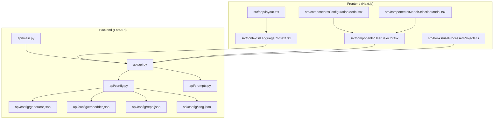
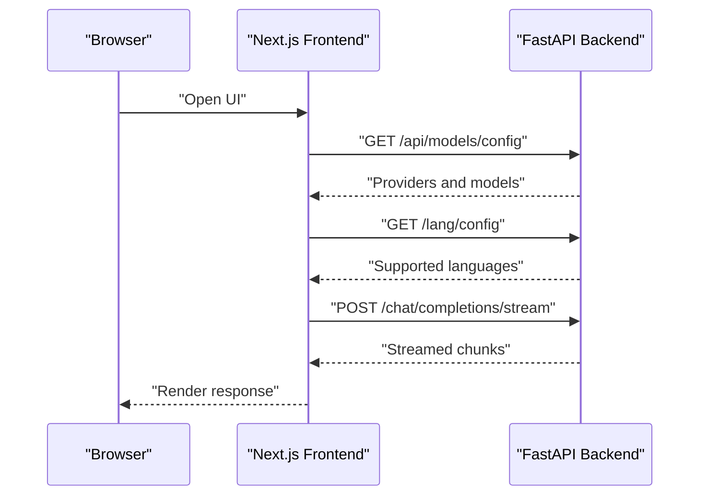
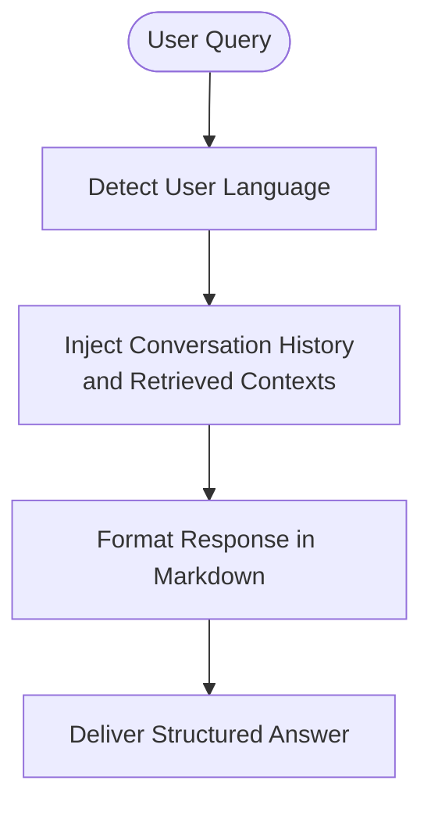
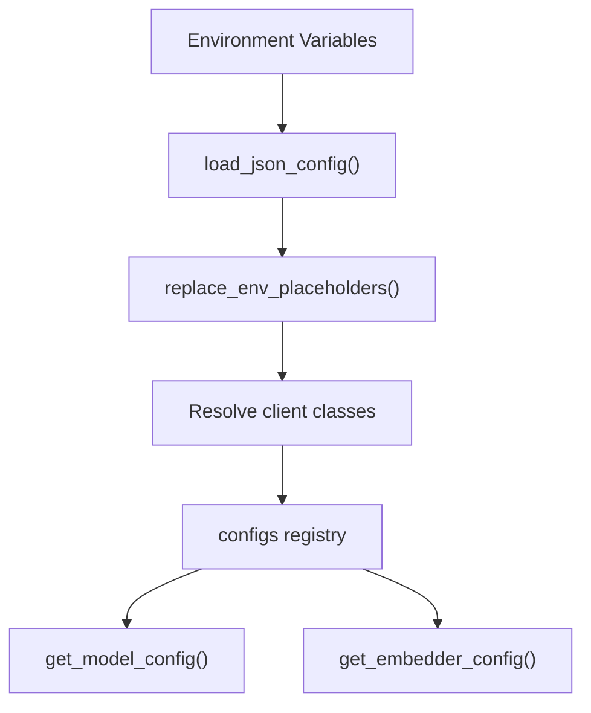
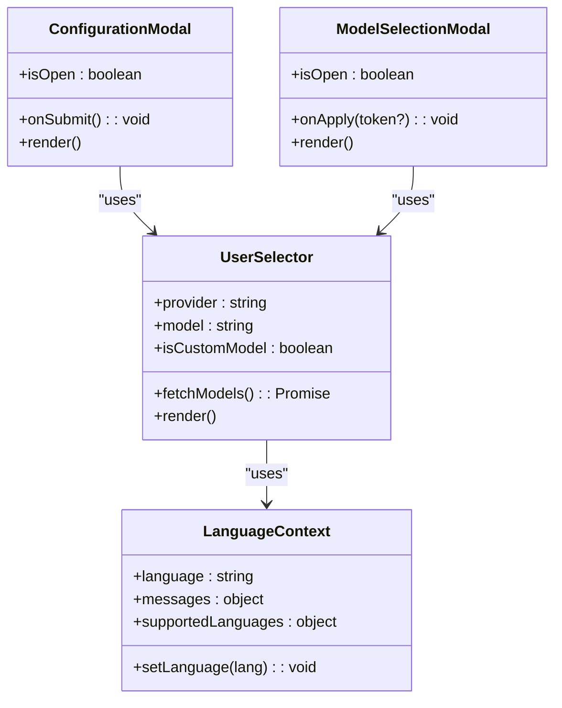
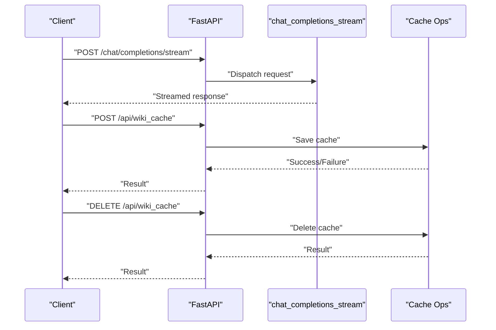
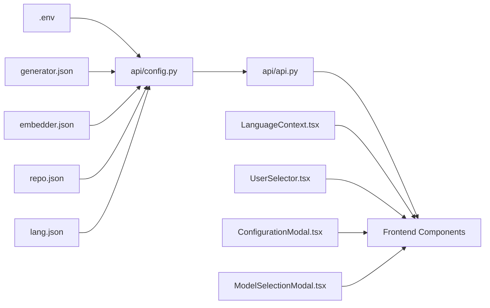

# Extension Points and Customization

<cite>
**Referenced Files in This Document**
- [README.md](file://README.md)
- [api/README.md](file://api/README.md)
- [api/main.py](file://api/main.py)
- [api/api.py](file://api/api.py)
- [api/config.py](file://api/config.py)
- [api/prompts.py](file://api/prompts.py)
- [api/config/generator.json](file://api/config/generator.json)
- [api/config/embedder.json](file://api/config/embedder.json)
- [api/config/repo.json](file://api/config/repo.json)
- [api/config/lang.json](file://api/config/lang.json)
- [src/app/layout.tsx](file://src/app/layout.tsx)
- [src/components/ConfigurationModal.tsx](file://src/components/ConfigurationModal.tsx)
- [src/components/ModelSelectionModal.tsx](file://src/components/ModelSelectionModal.tsx)
- [src/components/UserSelector.tsx](file://src/components/UserSelector.tsx)
- [src/contexts/LanguageContext.tsx](file://src/contexts/LanguageContext.tsx)
- [src/hooks/useProcessedProjects.ts](file://src/hooks/useProcessedProjects.ts)
</cite>

## Table of Contents
1. [Introduction](#introduction)
2. [Project Structure](#project-structure)
3. [Core Components](#core-components)
4. [Architecture Overview](#architecture-overview)
5. [Detailed Component Analysis](#detailed-component-analysis)
6. [Dependency Analysis](#dependency-analysis)
7. [Performance Considerations](#performance-considerations)
8. [Troubleshooting Guide](#troubleshooting-guide)
9. [Conclusion](#conclusion)
10. [Appendices](#appendices)

## Introduction
This document explains the extension points and customization mechanisms in DeepWiki-Open. It covers:
- Prompt engineering and context injection for AI responses
- Template and configuration-driven customization
- UI customization via modal and widget replacements
- Hook-like integration points for intercepting requests and extending functionality
- Backward compatibility, upgrade strategies, and contribution guidelines

## Project Structure
DeepWiki-Open consists of:
- A FastAPI backend exposing streaming chat, caching, and configuration endpoints
- A Next.js frontend with React components, internationalization, and theme support
- JSON-based configuration for providers, embedders, repository filters, and language

**Diagram sources**
- [api/main.py](file://api/main.py#L87-L104)
- [api/api.py](file://api/api.py#L20-L34)
- [api/config.py](file://api/config.py#L103-L126)
- [api/prompts.py](file://api/prompts.py#L1-L192)
- [api/config/generator.json](file://api/config/generator.json#L1-L101)
- [api/config/embedder.json](file://api/config/embedder.json#L1-L35)
- [api/config/repo.json](file://api/config/repo.json#L1-L129)
- [api/config/lang.json](file://api/config/lang.json#L1-L16)
- [src/app/layout.tsx](file://src/app/layout.tsx#L1-L32)
- [src/contexts/LanguageContext.tsx](file://src/contexts/LanguageContext.tsx#L1-L203)
- [src/components/ConfigurationModal.tsx](file://src/components/ConfigurationModal.tsx#L1-L364)
- [src/components/ModelSelectionModal.tsx](file://src/components/ModelSelectionModal.tsx#L1-L260)
- [src/components/UserSelector.tsx](file://src/components/UserSelector.tsx#L1-L540)
- [src/hooks/useProcessedProjects.ts](file://src/hooks/useProcessedProjects.ts#L1-L47)

**Section sources**
- [README.md](file://README.md#L247-L267)
- [api/README.md](file://api/README.md#L1-L200)

## Core Components
- Configuration-driven model and embedder selection with JSON files and environment variable substitution
- Prompt templates for RAG and research modes
- Frontend modals and selectors for UI customization
- Language and theme context providers
- Streaming chat and caching endpoints

Key customization surfaces:
- Environment variables for API keys, embedder type, ports, and auth
- JSON configuration files for providers, embedders, repository filters, and language
- Frontend modals and selectors for model/provider selection, wiki type, and file filters
- Prompt templates for RAG and research workflows

**Section sources**
- [api/config.py](file://api/config.py#L19-L58)
- [api/config.py](file://api/config.py#L103-L126)
- [api/config/generator.json](file://api/config/generator.json#L1-L101)
- [api/config/embedder.json](file://api/config/embedder.json#L1-L35)
- [api/config/repo.json](file://api/config/repo.json#L1-L129)
- [api/config/lang.json](file://api/config/lang.json#L1-L16)
- [api/prompts.py](file://api/prompts.py#L1-L192)
- [src/components/ConfigurationModal.tsx](file://src/components/ConfigurationModal.tsx#L1-L364)
- [src/components/ModelSelectionModal.tsx](file://src/components/ModelSelectionModal.tsx#L1-L260)
- [src/components/UserSelector.tsx](file://src/components/UserSelector.tsx#L1-L540)
- [src/contexts/LanguageContext.tsx](file://src/contexts/LanguageContext.tsx#L1-L203)

## Architecture Overview
The system integrates a configurable backend with a dynamic frontend:
- Backend loads configuration from JSON and environment variables, exposes endpoints for models, chat, caching, and health checks
- Frontend fetches configuration and language settings, renders modals and selectors, and streams chat responses

**Diagram sources**
- [api/api.py](file://api/api.py#L167-L226)
- [api/api.py](file://api/api.py#L394-L401)
- [src/components/UserSelector.tsx](file://src/components/UserSelector.tsx#L82-L123)
- [src/contexts/LanguageContext.tsx](file://src/contexts/LanguageContext.tsx#L69-L99)

## Detailed Component Analysis

### Prompt Engineering and Context Injection
- RAG system prompt and templating define language enforcement, markdown formatting, and context injection
- Research prompts guide multi-turn investigation with explicit roles, guidelines, and styles
- Templates support conversation history, retrieved contexts, and user input

**Diagram sources**
- [api/prompts.py](file://api/prompts.py#L3-L28)
- [api/prompts.py](file://api/prompts.py#L30-L57)
- [api/prompts.py](file://api/prompts.py#L60-L88)
- [api/prompts.py](file://api/prompts.py#L90-L120)
- [api/prompts.py](file://api/prompts.py#L122-L151)
- [api/prompts.py](file://api/prompts.py#L153-L191)

**Section sources**
- [api/prompts.py](file://api/prompts.py#L1-L192)

### Configuration-Driven Customization
- Environment variables control API keys, embedder type, ports, base URLs, and auth
- JSON configuration files define providers, embedders, repository filters, and language
- Configuration loader substitutes placeholders with environment variables and resolves client classes

**Diagram sources**
- [api/config.py](file://api/config.py#L19-L58)
- [api/config.py](file://api/config.py#L73-L102)
- [api/config.py](file://api/config.py#L103-L126)
- [api/config.py](file://api/config.py#L127-L182)
- [api/config.py](file://api/config.py#L381-L464)

**Section sources**
- [api/config.py](file://api/config.py#L1-L464)
- [api/config/generator.json](file://api/config/generator.json#L1-L101)
- [api/config/embedder.json](file://api/config/embedder.json#L1-L35)
- [api/config/repo.json](file://api/config/repo.json#L1-L129)
- [api/config/lang.json](file://api/config/lang.json#L1-L16)

### UI Customization via Modals and Widgets
- ConfigurationModal and ModelSelectionModal encapsulate configuration UX
- UserSelector fetches providers/models from backend and supports custom model toggles
- LanguageContext provides language detection, persistence, and dynamic message loading

**Diagram sources**
- [src/components/ConfigurationModal.tsx](file://src/components/ConfigurationModal.tsx#L68-L105)
- [src/components/ModelSelectionModal.tsx](file://src/components/ModelSelectionModal.tsx#L48-L78)
- [src/components/UserSelector.tsx](file://src/components/UserSelector.tsx#L46-L66)
- [src/contexts/LanguageContext.tsx](file://src/contexts/LanguageContext.tsx#L7-L15)

**Section sources**
- [src/components/ConfigurationModal.tsx](file://src/components/ConfigurationModal.tsx#L1-L364)
- [src/components/ModelSelectionModal.tsx](file://src/components/ModelSelectionModal.tsx#L1-L260)
- [src/components/UserSelector.tsx](file://src/components/UserSelector.tsx#L1-L540)
- [src/contexts/LanguageContext.tsx](file://src/contexts/LanguageContext.tsx#L1-L203)

### Hook Systems and Interception Points
- FastAPI middleware enables CORS and cross-origin access
- Streaming endpoints expose hooks for request processing and response delivery
- Cache endpoints allow interception of wiki generation lifecycle for read/write/delete operations

**Diagram sources**
- [api/api.py](file://api/api.py#L26-L33)
- [api/api.py](file://api/api.py#L394-L401)
- [api/api.py](file://api/api.py#L486-L503)
- [api/api.py](file://api/api.py#L504-L539)

**Section sources**
- [api/api.py](file://api/api.py#L1-L635)

### Examples of Custom Workflows and Integrations
- Provider-based model selection: define providers and models in JSON and optionally override via environment variables
- Embedder switching: choose among OpenAI, Google, Ollama, or GitHub Copilot embedders
- Repository filtering: tune file and directory filters for processing scope
- Language and theme: dynamic language loading and theme provider

Practical examples:
- Add a new provider by editing the generator configuration and mapping a client class
- Switch embedder type via environment variable and regenerate embeddings
- Customize prompts by editing prompt templates and rebuilding the backend
- Extend UI by replacing modals/widgets with custom components while preserving props contracts

**Section sources**
- [api/config/generator.json](file://api/config/generator.json#L1-L101)
- [api/config/embedder.json](file://api/config/embedder.json#L1-L35)
- [api/config/repo.json](file://api/config/repo.json#L1-L129)
- [api/config/lang.json](file://api/config/lang.json#L1-L16)
- [api/config.py](file://api/config.py#L54-L58)
- [api/config.py](file://api/config.py#L127-L182)
- [api/prompts.py](file://api/prompts.py#L1-L192)
- [src/components/ConfigurationModal.tsx](file://src/components/ConfigurationModal.tsx#L1-L364)
- [src/components/ModelSelectionModal.tsx](file://src/components/ModelSelectionModal.tsx#L1-L260)
- [src/components/UserSelector.tsx](file://src/components/UserSelector.tsx#L1-L540)
- [src/contexts/LanguageContext.tsx](file://src/contexts/LanguageContext.tsx#L1-L203)

## Dependency Analysis
- Backend depends on configuration loader and JSON files for runtime behavior
- Frontend depends on backend endpoints for model and language configuration
- UI components depend on context providers for language and theme

**Diagram sources**
- [api/config.py](file://api/config.py#L103-L126)
- [api/config/generator.json](file://api/config/generator.json#L1-L101)
- [api/config/embedder.json](file://api/config/embedder.json#L1-L35)
- [api/config/repo.json](file://api/config/repo.json#L1-L129)
- [api/config/lang.json](file://api/config/lang.json#L1-L16)
- [api/api.py](file://api/api.py#L167-L226)
- [src/contexts/LanguageContext.tsx](file://src/contexts/LanguageContext.tsx#L69-L99)
- [src/components/UserSelector.tsx](file://src/components/UserSelector.tsx#L82-L123)
- [src/components/ConfigurationModal.tsx](file://src/components/ConfigurationModal.tsx#L1-L364)
- [src/components/ModelSelectionModal.tsx](file://src/components/ModelSelectionModal.tsx#L1-L260)

**Section sources**
- [api/config.py](file://api/config.py#L1-L464)
- [api/api.py](file://api/api.py#L1-L635)

## Performance Considerations
- Streaming responses reduce latency and improve interactivity
- Caching wiki structures reduces repeated generation overhead
- Repository filters minimize processing scope for large repositories
- Embedder type affects vector space consistency and retrieval quality

[No sources needed since this section provides general guidance]

## Troubleshooting Guide
- Missing environment variables: ensure required keys are set; optional keys enable specific providers
- CORS issues: verify middleware allows expected origins
- Cache operations: validate authorization when enabled and confirm language support
- Language loading: fallback to defaults if API fails

**Section sources**
- [api/main.py](file://api/main.py#L60-L77)
- [api/api.py](file://api/api.py#L26-L33)
- [api/api.py](file://api/api.py#L520-L539)
- [src/contexts/LanguageContext.tsx](file://src/contexts/LanguageContext.tsx#L69-L99)

## Conclusion
DeepWiki-Open provides robust extension points:
- Prompt engineering and templates for tailored AI responses
- JSON and environment-variable driven configuration for providers, embedders, and repository behavior
- Frontend modals and widgets for UI customization and user control
- Hook-like endpoints for streaming, caching, and lifecycle interception
Follow the upgrade and compatibility guidelines below to preserve customizations.

[No sources needed since this section summarizes without analyzing specific files]

## Appendices

### Backward Compatibility and Upgrade Strategies
- Keep custom JSON configurations in a dedicated directory via the configuration directory environment variable
- Preserve custom prompts by versioning prompt files and updating templates carefully
- Maintain UI customizations by adhering to prop contracts of modals and selectors
- Test upgrades by validating model configuration endpoints and language settings

**Section sources**
- [api/README.md](file://api/README.md#L81-L107)
- [README.md](file://README.md#L300-L323)
- [api/config.py](file://api/config.py#L57-L58)
- [api/config.py](file://api/config.py#L103-L126)

### Contributing Extensions Back to the Community
- Provide clear documentation for new providers and embedders
- Include JSON configuration examples and environment variable requirements
- Offer UI customization examples with component replacement patterns
- Validate integrations against existing tests and update tests as needed

**Section sources**
- [README.md](file://README.md#L719-L729)
- [api/README.md](file://api/README.md#L1-L200)