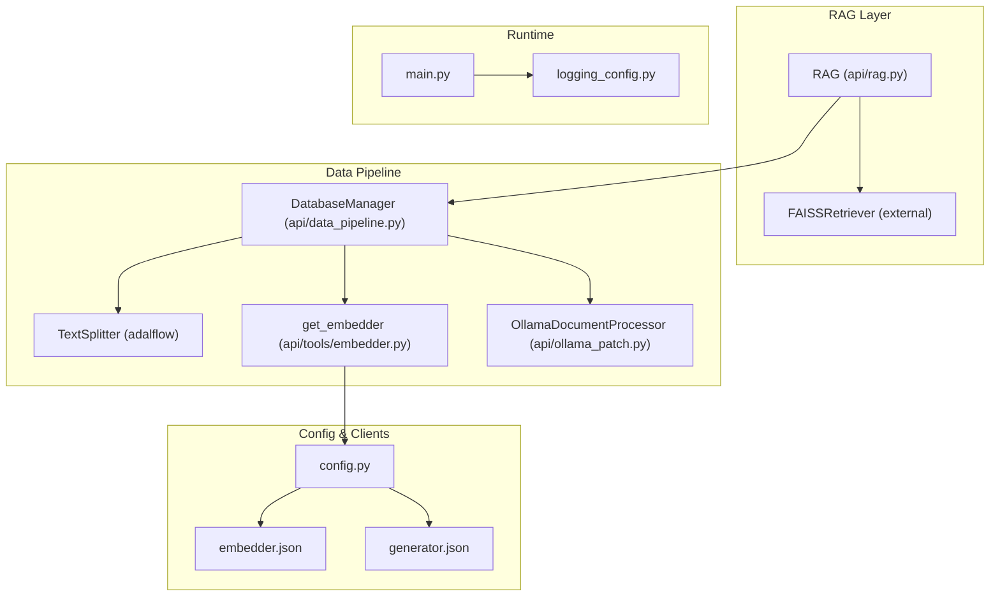
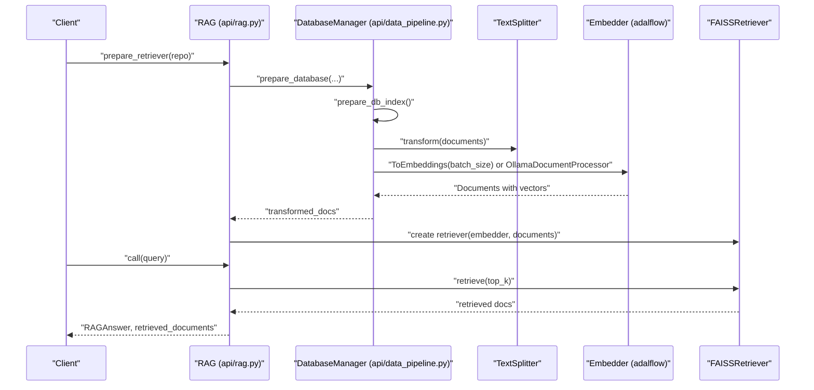
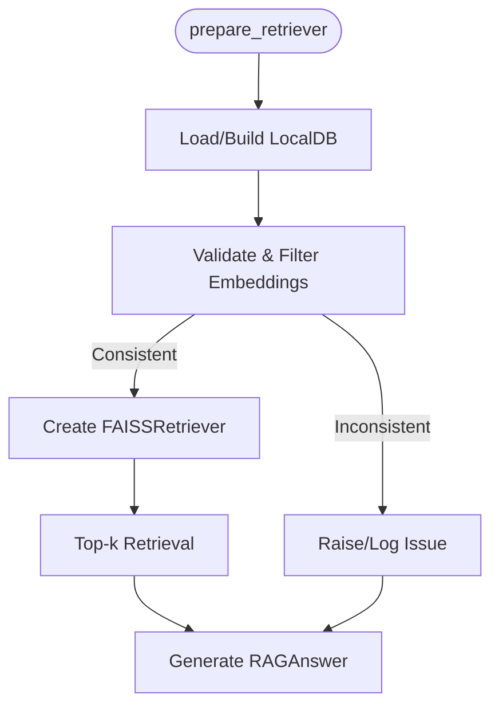
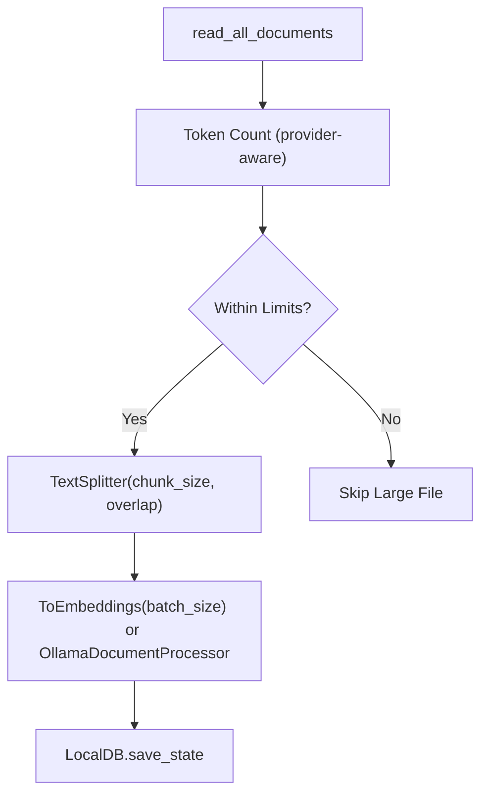
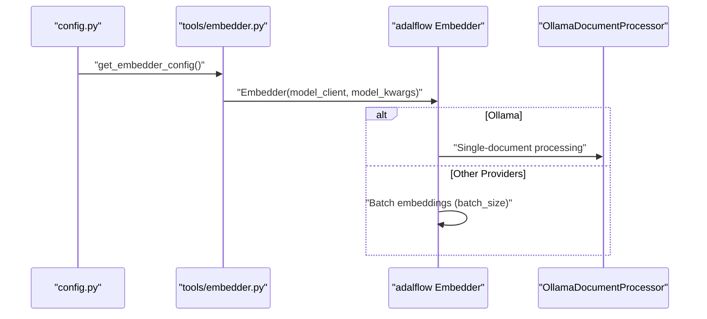
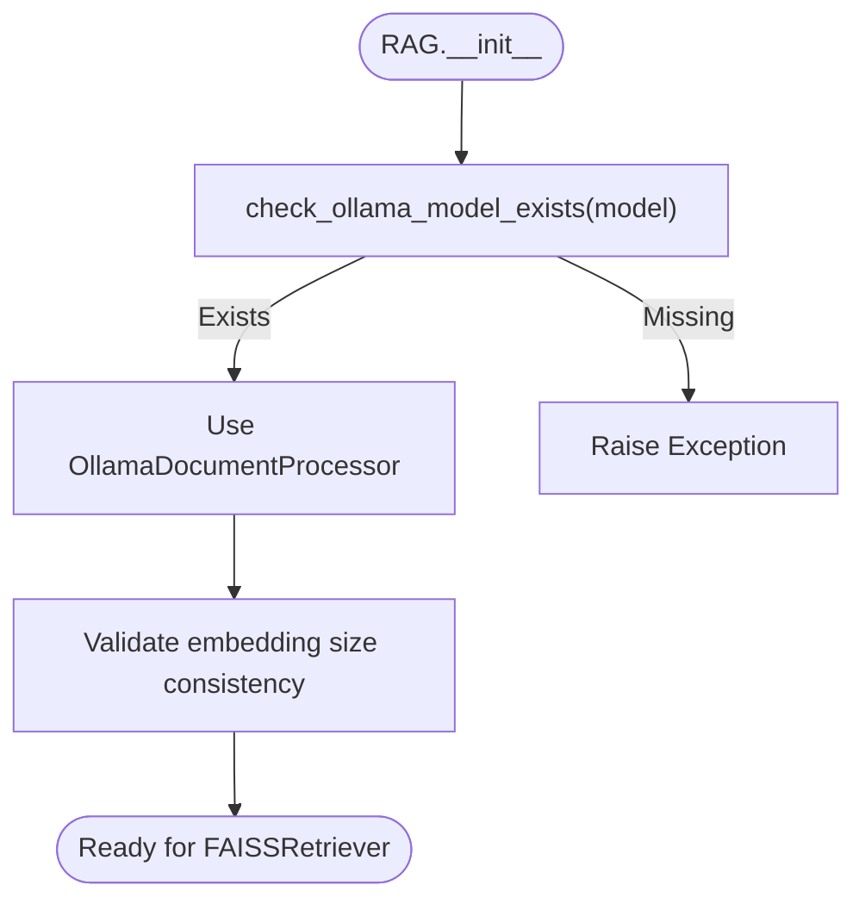
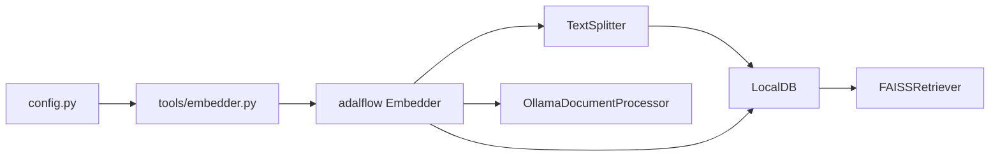

# Performance Optimization

<cite>
**Referenced Files in This Document**
- [api/rag.py](file://api/rag.py)
- [api/data_pipeline.py](file://api/data_pipeline.py)
- [api/ollama_patch.py](file://api/ollama_patch.py)
- [api/config.py](file://api/config.py)
- [api/config/embedder.json](file://api/config/embedder.json)
- [api/config/generator.json](file://api/config/generator.json)
- [api/tools/embedder.py](file://api/tools/embedder.py)
- [api/main.py](file://api/main.py)
- [api/logging_config.py](file://api/logging_config.py)
</cite>

## Table of Contents
1. [Introduction](#introduction)
2. [Project Structure](#project-structure)
3. [Core Components](#core-components)
4. [Architecture Overview](#architecture-overview)
5. [Detailed Component Analysis](#detailed-component-analysis)
6. [Dependency Analysis](#dependency-analysis)
7. [Performance Considerations](#performance-considerations)
8. [Troubleshooting Guide](#troubleshooting-guide)
9. [Conclusion](#conclusion)
10. [Appendices](#appendices)

## Introduction
This document provides a comprehensive guide to performance optimization in DeepWiki-Open, focusing on:
- Retrieval-Augmented Generation (RAG) system tuning: FAISS index configuration, embedding batch processing, and retrieval efficiency.
- Data pipeline optimizations for large repositories: parallelism, memory management, and caching strategies.
- Model client optimization: connection pooling, request batching, and response caching.
- Ollama integration patches and local model optimization strategies.
- Benchmarking methodologies, performance monitoring, and bottleneck identification.
- Scaling considerations for enterprise deployments, resource allocation, and cloud cost optimization.

## Project Structure
DeepWiki-Open organizes performance-critical logic across several modules:
- RAG orchestration and FAISS retrieval
- Data ingestion, chunking, and embedding pipelines
- Ollama-specific patches for single-document embedding processing
- Configuration-driven model and embedder selection
- Logging and environment setup for production-grade performance

**Diagram sources**
- [api/rag.py](file://api/rag.py#L153-L244)
- [api/data_pipeline.py](file://api/data_pipeline.py#L408-L450)
- [api/tools/embedder.py](file://api/tools/embedder.py#L6-L59)
- [api/config.py](file://api/config.py#L170-L182)
- [api/config/embedder.json](file://api/config/embedder.json#L1-L35)
- [api/config/generator.json](file://api/config/generator.json#L1-L101)
- [api/ollama_patch.py](file://api/ollama_patch.py#L62-L105)
- [api/main.py](file://api/main.py#L1-L104)
- [api/logging_config.py](file://api/logging_config.py#L12-L86)

**Section sources**
- [api/rag.py](file://api/rag.py#L1-L446)
- [api/data_pipeline.py](file://api/data_pipeline.py#L1-L917)
- [api/ollama_patch.py](file://api/ollama_patch.py#L1-L105)
- [api/config.py](file://api/config.py#L1-L464)
- [api/config/embedder.json](file://api/config/embedder.json#L1-L35)
- [api/config/generator.json](file://api/config/generator.json#L1-L101)
- [api/tools/embedder.py](file://api/tools/embedder.py#L1-L59)
- [api/main.py](file://api/main.py#L1-L104)
- [api/logging_config.py](file://api/logging_config.py#L1-L86)

## Core Components
- RAG orchestrator with FAISS retrieval, conversation memory, and provider/model configuration.
- Data pipeline with text splitting, provider-aware embedding, and local database caching.
- Ollama-specific document processor for single-document embedding to address lack of native batch support.
- Configuration-driven embedder and generator selection with environment-based overrides.
- Production-ready logging and runtime initialization.

Key performance-relevant elements:
- Embedding batch sizing via configuration and runtime selection.
- Token limits and chunking parameters to control memory footprint.
- FAISS top-k retrieval tuning.
- Ollama model existence checks and consistent embedding size enforcement.

**Section sources**
- [api/rag.py](file://api/rag.py#L153-L244)
- [api/data_pipeline.py](file://api/data_pipeline.py#L408-L450)
- [api/ollama_patch.py](file://api/ollama_patch.py#L62-L105)
- [api/config.py](file://api/config.py#L170-L182)
- [api/config/embedder.json](file://api/config/embedder.json#L1-L35)
- [api/config/generator.json](file://api/config/generator.json#L1-L101)
- [api/tools/embedder.py](file://api/tools/embedder.py#L6-L59)

## Architecture Overview
The system integrates configuration-driven model selection, a data transformation pipeline, and FAISS-based retrieval. Ollama is supported through a dedicated processor that serializes embedding generation to maintain consistent vector sizes.

**Diagram sources**
- [api/rag.py](file://api/rag.py#L345-L415)
- [api/data_pipeline.py](file://api/data_pipeline.py#L851-L902)
- [api/tools/embedder.py](file://api/tools/embedder.py#L6-L59)
- [api/ollama_patch.py](file://api/ollama_patch.py#L62-L105)

## Detailed Component Analysis

### RAG System Optimization
- FAISS index tuning
  - Adjust top-k to balance recall and latency.
  - Ensure consistent embedding dimensionality before index construction.
- Embedding batch processing
  - Provider-specific batch sizes are configurable and applied in the pipeline.
- Retrieval efficiency improvements
  - Use validated embeddings and precomputed indices.
  - Limit retrieval candidates via top-k and chunk overlap tuning.

**Diagram sources**
- [api/rag.py](file://api/rag.py#L345-L415)
- [api/data_pipeline.py](file://api/data_pipeline.py#L851-L902)

**Section sources**
- [api/rag.py](file://api/rag.py#L345-L415)
- [api/data_pipeline.py](file://api/data_pipeline.py#L851-L902)

### Data Pipeline Optimizations
- Parallel processing
  - Adalflow’s sequential transformer applies provider-aware batching; Ollama uses a single-document processor to preserve vector consistency.
- Memory management
  - Token counting per provider and configurable chunk sizes reduce memory pressure.
  - Exclusion/inclusion filters minimize unnecessary processing.
- Caching strategies
  - LocalDB caches transformed documents; reuse existing databases to avoid recomputation.

**Diagram sources**
- [api/data_pipeline.py](file://api/data_pipeline.py#L177-L406)
- [api/data_pipeline.py](file://api/data_pipeline.py#L408-L450)
- [api/tools/embedder.py](file://api/tools/embedder.py#L6-L59)
- [api/ollama_patch.py](file://api/ollama_patch.py#L62-L105)

**Section sources**
- [api/data_pipeline.py](file://api/data_pipeline.py#L177-L406)
- [api/data_pipeline.py](file://api/data_pipeline.py#L408-L450)
- [api/tools/embedder.py](file://api/tools/embedder.py#L6-L59)
- [api/ollama_patch.py](file://api/ollama_patch.py#L62-L105)

### Model Client Optimization
- Connection pooling and request batching
  - Embedder configuration includes batch_size for providers that support batching.
  - Ollama uses a custom processor to serialize embeddings while maintaining throughput.
- Response caching
  - LocalDB persists transformed data; leverage cache reuse to avoid repeated embeddings.
- Timeout and reliability
  - Runtime patch sets longer timeouts for corporate proxies to prevent transient failures.

**Diagram sources**
- [api/config.py](file://api/config.py#L170-L182)
- [api/tools/embedder.py](file://api/tools/embedder.py#L6-L59)
- [api/ollama_patch.py](file://api/ollama_patch.py#L62-L105)
- [api/main.py](file://api/main.py#L11-L20)

**Section sources**
- [api/config.py](file://api/config.py#L170-L182)
- [api/tools/embedder.py](file://api/tools/embedder.py#L6-L59)
- [api/ollama_patch.py](file://api/ollama_patch.py#L62-L105)
- [api/main.py](file://api/main.py#L11-L20)

### Ollama Integration Patches and Local Model Optimization
- Model existence check ensures the requested model is pulled locally before use.
- Single-document processing validates consistent embedding sizes and logs progress.

**Diagram sources**
- [api/rag.py](file://api/rag.py#L178-L206)
- [api/ollama_patch.py](file://api/ollama_patch.py#L21-L60)
- [api/ollama_patch.py](file://api/ollama_patch.py#L71-L105)

**Section sources**
- [api/rag.py](file://api/rag.py#L178-L206)
- [api/ollama_patch.py](file://api/ollama_patch.py#L21-L60)
- [api/ollama_patch.py](file://api/ollama_patch.py#L71-L105)

## Dependency Analysis
The system’s performance depends on:
- Configuration precedence: embedder and generator configs drive batching, chunking, and model parameters.
- Embedder selection: runtime chooses provider-specific batching vs. Ollama serialization.
- FAISS retriever: relies on validated, consistent embeddings.

**Diagram sources**
- [api/config.py](file://api/config.py#L170-L182)
- [api/tools/embedder.py](file://api/tools/embedder.py#L6-L59)
- [api/data_pipeline.py](file://api/data_pipeline.py#L408-L450)
- [api/ollama_patch.py](file://api/ollama_patch.py#L62-L105)
- [api/rag.py](file://api/rag.py#L382-L415)

**Section sources**
- [api/config.py](file://api/config.py#L170-L182)
- [api/tools/embedder.py](file://api/tools/embedder.py#L6-L59)
- [api/data_pipeline.py](file://api/data_pipeline.py#L408-L450)
- [api/ollama_patch.py](file://api/ollama_patch.py#L62-L105)
- [api/rag.py](file://api/rag.py#L382-L415)

## Performance Considerations
- FAISS tuning
  - top-k: Increase for higher recall, decrease for lower latency.
  - Distance metric and index type: Configure via FAISSRetriever parameters exposed in configuration.
- Embedding batching
  - Adjust batch_size per provider in embedder configuration for throughput vs. memory trade-offs.
  - For Ollama, rely on single-document processing to ensure consistent vector sizes.
- Chunking and token limits
  - Tune chunk_size and chunk_overlap to balance semantic coherence and retrieval accuracy.
  - Respect provider-specific token limits to avoid truncation overhead.
- Caching and reuse
  - Reuse LocalDB state to skip embedding computation on subsequent runs.
  - Persist databases to disk for multi-process or multi-instance reuse.
- Logging and observability
  - Use rotating file handlers and environment-controlled log levels for production visibility.
- Network and timeouts
  - Corporate proxies require increased timeouts; apply runtime patch early.

Practical configuration pointers:
- FAISS top-k: [embedder.json](file://api/config/embedder.json#L27-L29)
- Text splitter: [embedder.json](file://api/config/embedder.json#L30-L34)
- Embedder batch sizes: [embedder.json](file://api/config/embedder.json#L4), [embedder.json](file://api/config/embedder.json#L12), [embedder.json](file://api/config/embedder.json#L20)
- Generator models and parameters: [generator.json](file://api/config/generator.json#L1-L101)
- Logging configuration: [logging_config.py](file://api/logging_config.py#L12-L86)
- Runtime timeout patch: [main.py](file://api/main.py#L11-L20)

[No sources needed since this section provides general guidance]

## Troubleshooting Guide
- Embedding dimension mismatch during FAISS creation
  - The system validates and filters inconsistent embeddings; inspect logs for reported sizes and filter counts.
  - Ensure consistent model parameters and avoid mixing different embedding models.
- Ollama model not found
  - Verify model availability before runtime; pull the model if missing.
- Slow retrieval or timeouts
  - Reduce top-k, adjust chunk sizes, and confirm network timeouts are adequate.
- Excessive memory usage
  - Lower batch_size, increase chunk_overlap conservatively, and enable reuse of LocalDB state.

**Section sources**
- [api/rag.py](file://api/rag.py#L251-L343)
- [api/rag.py](file://api/rag.py#L392-L414)
- [api/ollama_patch.py](file://api/ollama_patch.py#L21-L60)
- [api/main.py](file://api/main.py#L11-L20)

## Conclusion
DeepWiki-Open’s performance hinges on:
- Correct configuration of batching, chunking, and retrieval parameters
- Robust embedding validation and consistent vector sizes
- Efficient reuse of cached transformations
- Provider-specific client optimizations and reliable timeouts

Adopting the recommendations above will improve throughput, reduce latency, and scale effectively for enterprise workloads.

[No sources needed since this section summarizes without analyzing specific files]

## Appendices

### Benchmarking Methodologies
- Latency per stage: measure RAG.prepare_retriever, FAISS retrieval, and generator call independently.
- Throughput: track requests per second under varied top-k and batch_size.
- Memory footprint: monitor peak RSS during embedding and retrieval phases.
- Cost optimization: compare provider pricing per token and dimensionality; choose smaller embedding models where acceptable.

[No sources needed since this section provides general guidance]

### Performance Monitoring Approaches
- Enable structured logging with rotating files and environment-controlled levels.
- Track embedding counts, FAISS hit rates, and error rates.
- Instrument key functions with timing wrappers to identify hotspots.

**Section sources**
- [api/logging_config.py](file://api/logging_config.py#L12-L86)

### Scaling Considerations and Resource Allocation
- Horizontal scaling: deploy behind load balancers; ensure shared storage for LocalDB reuse.
- Vertical scaling: allocate CPU/RAM proportional to batch_size and chunk_size.
- Cloud cost optimization: select providers and models aligned with budget; leverage reserved instances or sustained use discounts.

[No sources needed since this section provides general guidance]