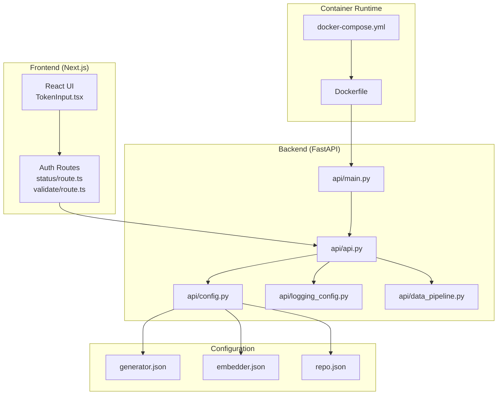
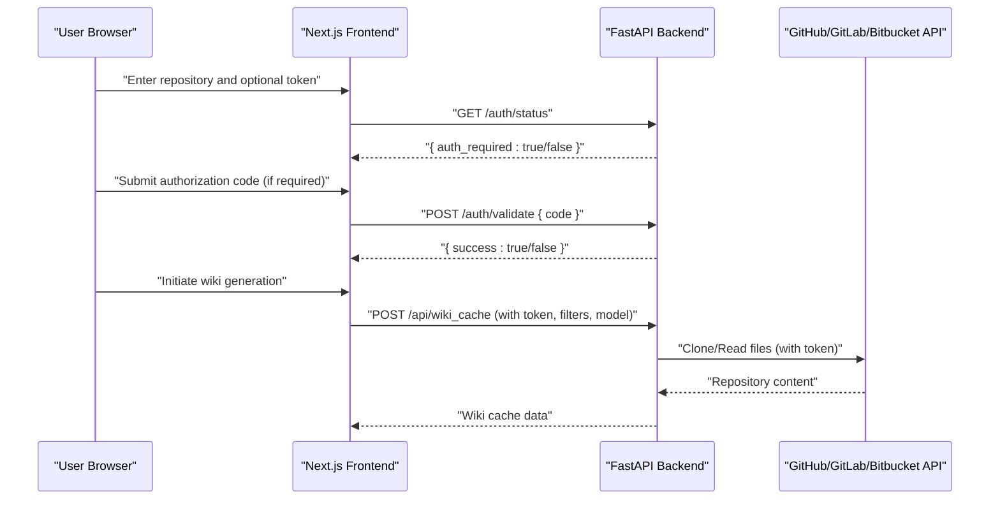
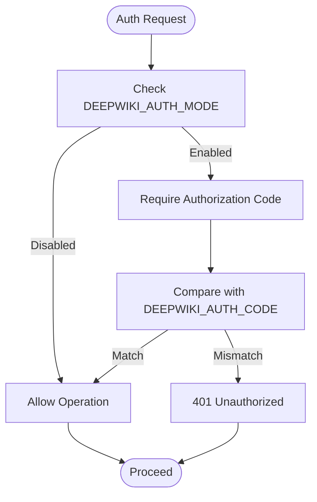
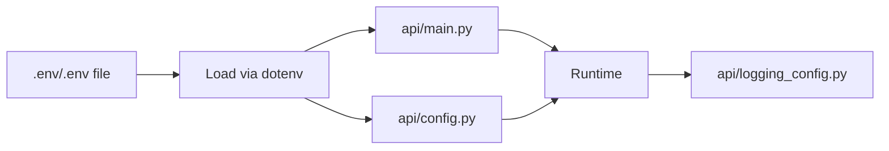
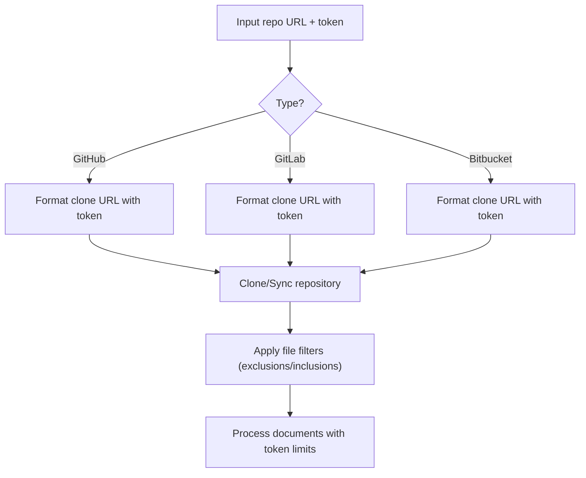
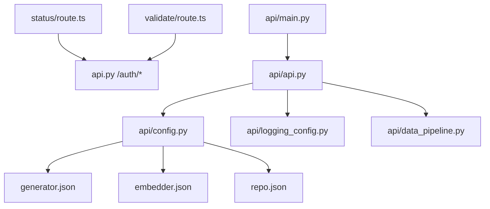

# Security Considerations

<cite>
**Referenced Files in This Document**
- [README.md](file://README.md)
- [Dockerfile](file://Dockerfile)
- [docker-compose.yml](file://docker-compose.yml)
- [api/main.py](file://api/main.py)
- [api/api.py](file://api/api.py)
- [api/config.py](file://api/config.py)
- [api/logging_config.py](file://api/logging_config.py)
- [api/data_pipeline.py](file://api/data_pipeline.py)
- [api/config/generator.json](file://api/config/generator.json)
- [api/config/embedder.json](file://api/config/embedder.json)
- [api/config/repo.json](file://api/config/repo.json)
- [src/app/api/auth/status/route.ts](file://src/app/api/auth/status/route.ts)
- [src/app/api/auth/validate/route.ts](file://src/app/api/auth/validate/route.ts)
- [src/components/TokenInput.tsx](file://src/components/TokenInput.tsx)
</cite>

## Table of Contents
1. [Introduction](#introduction)
2. [Project Structure](#project-structure)
3. [Core Components](#core-components)
4. [Architecture Overview](#architecture-overview)
5. [Detailed Component Analysis](#detailed-component-analysis)
6. [Dependency Analysis](#dependency-analysis)
7. [Performance Considerations](#performance-considerations)
8. [Troubleshooting Guide](#troubleshooting-guide)
9. [Conclusion](#conclusion)
10. [Appendices](#appendices)

## Introduction
This document provides comprehensive security guidance for DeepWiki-Open enterprise deployments. It focuses on authentication and authorization mechanisms, secure configuration practices, environment variable handling, secret management, repository access security, network security, API endpoint protection, rate limiting, data privacy, content sanitization, audit logging, containerized deployment hardening, and incident response procedures. The goal is to help operators deploy and operate DeepWiki-Open securely in production environments while protecting sensitive data and maintaining compliance.

## Project Structure
DeepWiki-Open consists of:
- A Next.js frontend (React) that communicates with the backend API via HTTP routes.
- A FastAPI backend that exposes endpoints for authentication, model configuration, wiki cache management, and repository processing.
- Configuration-driven model and embedding providers, with JSON configuration files and environment variables.
- Docker and docker-compose artifacts for containerized deployment.

**Diagram sources**
- [Dockerfile](file://Dockerfile#L1-L171)
- [docker-compose.yml](file://docker-compose.yml#L1-L46)
- [api/main.py](file://api/main.py#L1-L104)
- [api/api.py](file://api/api.py#L1-L635)
- [api/config.py](file://api/config.py#L1-L464)
- [api/logging_config.py](file://api/logging_config.py#L1-L86)
- [api/data_pipeline.py](file://api/data_pipeline.py#L1-L917)
- [api/config/generator.json](file://api/config/generator.json#L1-L101)
- [api/config/embedder.json](file://api/config/embedder.json#L1-L35)
- [api/config/repo.json](file://api/config/repo.json#L1-L129)
- [src/app/api/auth/status/route.ts](file://src/app/api/auth/status/route.ts#L1-L32)
- [src/app/api/auth/validate/route.ts](file://src/app/api/auth/validate/route.ts#L1-L35)
- [src/components/TokenInput.tsx](file://src/components/TokenInput.tsx#L1-L108)

**Section sources**
- [Dockerfile](file://Dockerfile#L1-L171)
- [docker-compose.yml](file://docker-compose.yml#L1-L46)
- [api/main.py](file://api/main.py#L1-L104)
- [api/api.py](file://api/api.py#L1-L635)
- [api/config.py](file://api/config.py#L1-L464)
- [api/logging_config.py](file://api/logging_config.py#L1-L86)
- [api/data_pipeline.py](file://api/data_pipeline.py#L1-L917)
- [api/config/generator.json](file://api/config/generator.json#L1-L101)
- [api/config/embedder.json](file://api/config/embedder.json#L1-L35)
- [api/config/repo.json](file://api/config/repo.json#L1-L129)
- [src/app/api/auth/status/route.ts](file://src/app/api/auth/status/route.ts#L1-L32)
- [src/app/api/auth/validate/route.ts](file://src/app/api/auth/validate/route.ts#L1-L35)
- [src/components/TokenInput.tsx](file://src/components/TokenInput.tsx#L1-L108)

## Core Components
- Authentication and Authorization:
  - Frontend auth routes forward to backend endpoints for status and validation.
  - Backend exposes /auth/status and /auth/validate endpoints.
  - Authorization mode controlled by environment variables DEEPWIKI_AUTH_MODE and DEEPWIKI_AUTH_CODE.
- Repository Access:
  - Supports GitHub, GitLab, Bitbucket with token-based authentication.
  - Token handling and URL formatting for cloning and API access.
  - File filtering to exclude sensitive directories and files.
- Configuration and Secrets:
  - Environment variables for API keys and configuration.
  - JSON configuration files for providers, embedders, and repository filters.
- Logging and Auditing:
  - Centralized logging with configurable log level, file path, rotation, and security checks.
- Containerization:
  - Multi-stage Docker build with proxy support and optional custom CA certificates.
  - docker-compose health checks and volume mounts for persistent data.

**Section sources**
- [src/app/api/auth/status/route.ts](file://src/app/api/auth/status/route.ts#L1-L32)
- [src/app/api/auth/validate/route.ts](file://src/app/api/auth/validate/route.ts#L1-L35)
- [api/api.py](file://api/api.py#L153-L166)
- [api/config.py](file://api/config.py#L49-L52)
- [api/data_pipeline.py](file://api/data_pipeline.py#L103-L173)
- [api/data_pipeline.py](file://api/data_pipeline.py#L210-L327)
- [api/logging_config.py](file://api/logging_config.py#L12-L86)
- [Dockerfile](file://Dockerfile#L115-L125)
- [docker-compose.yml](file://docker-compose.yml#L40-L45)

## Architecture Overview
The security architecture centers on:
- Token-first repository access with minimal token exposure.
- Authorization gating via backend endpoints.
- Configuration-driven provider selection and embedding strategies.
- Secure logging and audit trails.
- Container hardening and secrets management.

**Diagram sources**
- [src/app/api/auth/status/route.ts](file://src/app/api/auth/status/route.ts#L1-L32)
- [src/app/api/auth/validate/route.ts](file://src/app/api/auth/validate/route.ts#L1-L35)
- [api/api.py](file://api/api.py#L153-L166)
- [api/api.py](file://api/api.py#L487-L503)
- [api/data_pipeline.py](file://api/data_pipeline.py#L103-L173)

## Detailed Component Analysis

### Authentication and Authorization Mechanisms
- Frontend auth routes:
  - The frontend auth routes forward to the backend using SERVER_BASE_URL, enabling centralized auth enforcement.
- Backend auth endpoints:
  - /auth/status returns whether authorization is required based on configuration.
  - /auth/validate compares the submitted code against the configured authorization code.
- Authorization mode:
  - Controlled by DEEPWIKI_AUTH_MODE and DEEPWIKI_AUTH_CODE environment variables.
  - Authorization applies to cache deletion; it does not fully prevent backend generation if endpoints are called directly.

**Diagram sources**
- [api/api.py](file://api/api.py#L153-L166)
- [api/api.py](file://api/api.py#L504-L539)
- [api/config.py](file://api/config.py#L49-L52)

**Section sources**
- [src/app/api/auth/status/route.ts](file://src/app/api/auth/status/route.ts#L1-L32)
- [src/app/api/auth/validate/route.ts](file://src/app/api/auth/validate/route.ts#L1-L35)
- [api/api.py](file://api/api.py#L153-L166)
- [api/api.py](file://api/api.py#L504-L539)
- [api/config.py](file://api/config.py#L49-L52)

### Wiki Authentication Modes and Access Codes
- Authorization mode:
  - Enable by setting DEEPWIKI_AUTH_MODE to true or 1.
  - Provide DEEPWIKI_AUTH_CODE as the secret code.
- Frontend UX:
  - The TokenInput component stores tokens locally and never sends them to the backend, reducing token exposure surface.
- Backend enforcement:
  - Authorization is enforced for cache deletion; other endpoints remain accessible unless additional protections are added.

**Section sources**
- [README.md](file://README.md#L503-L514)
- [src/components/TokenInput.tsx](file://src/components/TokenInput.tsx#L88-L103)
- [api/api.py](file://api/api.py#L504-L539)

### API Key Management and Secret Handling
- Environment variables:
  - API keys are read from environment variables and propagated to the runtime.
  - Required keys include provider-specific keys; optional keys include GitHub Copilot, OpenRouter, iFlow, and AWS credentials.
- Configuration-driven secrets:
  - Provider configurations can reference environment variables via placeholders in JSON files; missing placeholders are logged as warnings.
- Logging security:
  - Logging enforces path containment to prevent path traversal and restricts log file locations.

**Diagram sources**
- [api/main.py](file://api/main.py#L6-L7)
- [api/config.py](file://api/config.py#L19-L47)
- [api/logging_config.py](file://api/logging_config.py#L38-L42)

**Section sources**
- [api/main.py](file://api/main.py#L60-L77)
- [api/config.py](file://api/config.py#L73-L101)
- [api/logging_config.py](file://api/logging_config.py#L38-L42)

### Repository Access Security
- Token validation and URL formatting:
  - Supports GitHub, GitLab, and Bitbucket with token injection into clone URLs and API headers.
  - Sanitizes error messages to avoid leaking tokens.
- Branch protection and file filtering:
  - Default exclusion lists for directories and files (e.g., virtual environments, logs, lock files, environment files).
  - Configurable via repo.json; supports inclusion/exclusion modes for granular control.
- File filtering logic:
  - Uses inclusion or exclusion mode depending on provided parameters.
  - Applies token limits per embedder type to mitigate large-file processing risks.

**Diagram sources**
- [api/data_pipeline.py](file://api/data_pipeline.py#L103-L173)
- [api/data_pipeline.py](file://api/data_pipeline.py#L210-L327)
- [api/config/repo.json](file://api/config/repo.json#L1-L129)

**Section sources**
- [api/data_pipeline.py](file://api/data_pipeline.py#L103-L173)
- [api/data_pipeline.py](file://api/data_pipeline.py#L210-L327)
- [api/config/repo.json](file://api/config/repo.json#L1-L129)

### Network Security Considerations
- CORS policy:
  - The backend allows all origins, methods, and headers by default. In production, restrict origins to trusted domains.
- Proxy support:
  - Dockerfile inherits HTTP(S)_PROXY environment variables across stages.
- Certificate handling:
  - Optional custom CA certificates can be installed during build; ensure only trusted certificates are included.
- Health checks:
  - docker-compose defines a health check against the backend’s /health endpoint.

**Section sources**
- [api/api.py](file://api/api.py#L26-L33)
- [Dockerfile](file://Dockerfile#L6-L22)
- [Dockerfile](file://Dockerfile#L115-L125)
- [docker-compose.yml](file://docker-compose.yml#L40-L45)

### API Endpoint Protection and Rate Limiting
- Current state:
  - No built-in rate limiting in the backend.
  - Authorization mode provides a lightweight gate for cache deletion.
- Recommendations:
  - Introduce rate limiting per IP or per token.
  - Enforce quotas per provider API key.
  - Consider request shaping and circuit breakers for upstream providers.

[No sources needed since this section provides general guidance]

### Data Privacy and Content Sanitization
- Token handling:
  - Tokens are stored in the frontend and not sent to the backend; repository access uses token-injected URLs/API headers.
- Sensitive file filtering:
  - Default exclusions include environment files (.env, *.env), lock files, and logs.
- Audit logging:
  - Centralized logging with rotation and path containment; ensure logs do not capture sensitive data.

**Section sources**
- [src/components/TokenInput.tsx](file://src/components/TokenInput.tsx#L88-L103)
- [api/data_pipeline.py](file://api/data_pipeline.py#L310-L348)
- [api/logging_config.py](file://api/logging_config.py#L38-L42)

### Audit Logging Requirements
- Logging configuration:
  - Log level, file path, max size, and backup count are configurable.
  - Path containment prevents writing outside the designated log directory.
- Production hardening:
  - Route logs to centralized logging systems.
  - Avoid logging sensitive fields; sanitize messages before logging.

**Section sources**
- [api/logging_config.py](file://api/logging_config.py#L12-L86)

### Secure Configuration Practices
- Environment variables:
  - Store API keys and secrets in environment variables; avoid committing them to source control.
  - Use separate keys per provider and rotate regularly.
- Configuration files:
  - Use JSON configuration files for providers and embedders; leverage environment variable substitution safely.
- Frontend secrets:
  - Keep tokens in browser storage; never transmit to backend for repository access.

**Section sources**
- [README.md](file://README.md#L481-L501)
- [api/config.py](file://api/config.py#L73-L101)
- [src/components/TokenInput.tsx](file://src/components/TokenInput.tsx#L88-L103)

### Containerized Deployments, Network Isolation, and Credential Rotation
- Container hardening:
  - Use non-root user where possible; minimize packages and dependencies.
  - Restrict network access to upstream APIs only.
- Network isolation:
  - Run containers with isolated networks; avoid exposing unnecessary ports.
- Credential rotation:
  - Rotate API keys periodically; update environment variables and redeploy.
  - Use secrets management systems (e.g., HashiCorp Vault, Kubernetes Secrets) to inject secrets at runtime.

**Section sources**
- [Dockerfile](file://Dockerfile#L1-L171)
- [docker-compose.yml](file://docker-compose.yml#L1-L46)

### Vulnerability Assessment and Security Scanning Integration
- Static analysis:
  - Integrate SAST tools for Python and TypeScript/Next.js.
- Dependency scanning:
  - Scan Python dependencies and JS packages for known vulnerabilities.
- Image scanning:
  - Scan container images for base OS and library vulnerabilities.
- CI/CD pipeline:
  - Gate deployments on passing security scans.

[No sources needed since this section provides general guidance]

### Incident Response Protocols
- Detection:
  - Monitor logs for failed auth attempts, rate limit errors, and unusual repository access patterns.
- Containment:
  - Rotate compromised API keys; revoke tokens; temporarily disable affected providers.
- Eradication:
  - Remove exposed secrets from logs and configuration; update environment variables.
- Recovery:
  - Resume operations after remediation; validate access and functionality.
- Post-incident:
  - Conduct a root cause analysis; update policies and training.

[No sources needed since this section provides general guidance]

## Dependency Analysis
Key security-related dependencies and relationships:
- Frontend auth routes depend on SERVER_BASE_URL to reach the backend.
- Backend depends on environment variables for provider keys and authorization settings.
- Logging depends on environment variables for path and rotation configuration.
- Repository processing depends on configuration files and token handling.

**Diagram sources**
- [src/app/api/auth/status/route.ts](file://src/app/api/auth/status/route.ts#L1-L32)
- [src/app/api/auth/validate/route.ts](file://src/app/api/auth/validate/route.ts#L1-L35)
- [api/api.py](file://api/api.py#L1-L635)
- [api/config.py](file://api/config.py#L1-L464)
- [api/logging_config.py](file://api/logging_config.py#L1-L86)
- [api/data_pipeline.py](file://api/data_pipeline.py#L1-L917)
- [api/config/generator.json](file://api/config/generator.json#L1-L101)
- [api/config/embedder.json](file://api/config/embedder.json#L1-L35)
- [api/config/repo.json](file://api/config/repo.json#L1-L129)

**Section sources**
- [src/app/api/auth/status/route.ts](file://src/app/api/auth/status/route.ts#L1-L32)
- [src/app/api/auth/validate/route.ts](file://src/app/api/auth/validate/route.ts#L1-L35)
- [api/api.py](file://api/api.py#L1-L635)
- [api/config.py](file://api/config.py#L1-L464)
- [api/logging_config.py](file://api/logging_config.py#L1-L86)
- [api/data_pipeline.py](file://api/data_pipeline.py#L1-L917)
- [api/config/generator.json](file://api/config/generator.json#L1-L101)
- [api/config/embedder.json](file://api/config/embedder.json#L1-L35)
- [api/config/repo.json](file://api/config/repo.json#L1-L129)

## Performance Considerations
- Token limits and batching:
  - Embedding token limits vary by provider; adjust chunk sizes and batch sizes accordingly.
- File filtering:
  - Use inclusion/exclusion modes to reduce processing overhead for large repositories.
- Logging:
  - Tune log level and rotation to balance observability and disk usage.

[No sources needed since this section provides general guidance]

## Troubleshooting Guide
- Missing environment variables:
  - The backend warns about missing required keys and optional keys; ensure all necessary keys are set.
- Logging path errors:
  - If LOG_FILE_PATH is outside the logs directory, the application raises an error; correct the path.
- Repository access failures:
  - Validate token scopes and formats; confirm repository type and URL correctness.

**Section sources**
- [api/main.py](file://api/main.py#L60-L77)
- [api/logging_config.py](file://api/logging_config.py#L38-L42)
- [README.md](file://README.md#L112-L131)

## Conclusion
DeepWiki-Open provides a foundation for secure enterprise deployments through token-first repository access, configuration-driven provider selection, and centralized logging. Operators should enforce CORS restrictions, introduce rate limiting, rotate credentials regularly, and integrate security scanning into CI/CD. Authorization mode adds a lightweight gate for cache deletion, while frontend token handling minimizes token exposure. By following the practices outlined here, enterprises can deploy DeepWiki-Open securely and maintain strong auditability and compliance posture.

## Appendices
- Environment variables reference:
  - API keys and optional keys are documented in the project README.
  - Authorization mode variables are documented in the README and enforced in configuration.
- Configuration files:
  - generator.json, embedder.json, and repo.json define provider behavior and security-sensitive filters.

**Section sources**
- [README.md](file://README.md#L481-L501)
- [README.md](file://README.md#L503-L514)
- [api/config/generator.json](file://api/config/generator.json#L1-L101)
- [api/config/embedder.json](file://api/config/embedder.json#L1-L35)
- [api/config/repo.json](file://api/config/repo.json#L1-L129)