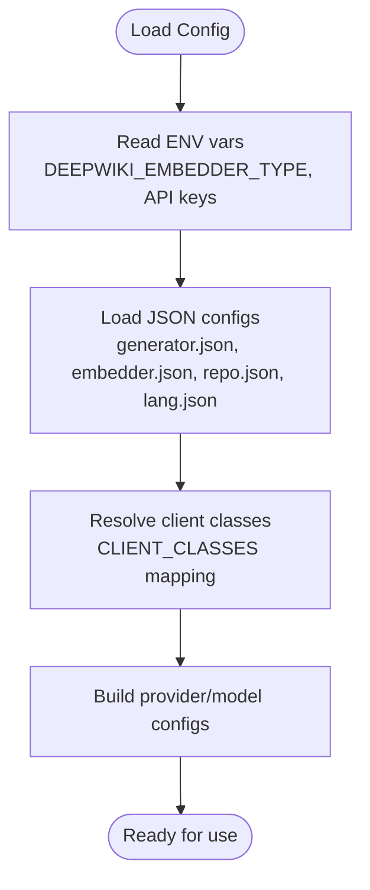

# Architecture and Design

<cite>
**Referenced Files in This Document**
- [README.md](file://README.md)
- [api/main.py](file://api/main.py)
- [api/api.py](file://api/api.py)
- [api/config.py](file://api/config.py)
- [api/rag.py](file://api/rag.py)
- [api/simple_chat.py](file://api/simple_chat.py)
- [api/websocket_wiki.py](file://api/websocket_wiki.py)
- [api/repo_wiki_gen.py](file://api/repo_wiki_gen.py)
- [src/app/page.tsx](file://src/app/page.tsx)
- [src/components/Ask.tsx](file://src/components/Ask.tsx)
- [src/components/WikiTreeView.tsx](file://src/components/WikiTreeView.tsx)
- [src/utils/websocketClient.ts](file://src/utils/websocketClient.ts)
- [package.json](file://package.json)
- [pyproject.toml](file://pyproject.toml)
- [docker-compose.yml](file://docker-compose.yml)
- [Dockerfile](file://Dockerfile)
</cite>

## Table of Contents
1. [Introduction](#introduction)
2. [Project Structure](#project-structure)
3. [Core Components](#core-components)
4. [Architecture Overview](#architecture-overview)
5. [Detailed Component Analysis](#detailed-component-analysis)
6. [Dependency Analysis](#dependency-analysis)
7. [Performance Considerations](#performance-considerations)
8. [Troubleshooting Guide](#troubleshooting-guide)
9. [Conclusion](#conclusion)
10. [Appendices](#appendices)

## Introduction
DeepWiki-Open is a system that automatically generates interactive wikis for GitHub, GitLab, and BitBucket repositories. It combines a Next.js frontend with a FastAPI backend to provide:
- Repository analysis and wiki generation
- Retrieval-Augmented Generation (RAG) powered Q&A
- Real-time streaming responses via HTTP and WebSocket
- Provider-agnostic model selection across multiple AI services
- Flexible embedding options and caching

The system emphasizes modularity, extensibility, and ease of deployment through Docker and environment-driven configuration.

## Project Structure
The repository follows a clear separation of concerns:
- Frontend (Next.js): React components, routing, internationalization, and UI for repository input, model selection, chat, and wiki presentation
- Backend (FastAPI): API endpoints for model configuration, chat streaming, wiki cache, and repository processing
- Shared logic: RAG pipeline, data pipeline utilities, and configuration management
- Infrastructure: Docker images and compose files for containerized deployment

**Diagram sources**
- [src/app/page.tsx](file://src/app/page.tsx#L1-L637)
- [src/components/Ask.tsx](file://src/components/Ask.tsx#L1-L929)
- [src/components/WikiTreeView.tsx](file://src/components/WikiTreeView.tsx#L1-L184)
- [src/utils/websocketClient.ts](file://src/utils/websocketClient.ts#L1-L86)
- [api/main.py](file://api/main.py#L1-L104)
- [api/api.py](file://api/api.py#L1-L635)
- [api/config.py](file://api/config.py#L1-L464)
- [api/rag.py](file://api/rag.py#L1-L446)
- [api/simple_chat.py](file://api/simple_chat.py#L1-L900)
- [api/websocket_wiki.py](file://api/websocket_wiki.py#L1-L978)
- [api/repo_wiki_gen.py](file://api/repo_wiki_gen.py#L1-L550)
- [Dockerfile](file://Dockerfile)
- [docker-compose.yml](file://docker-compose.yml)

**Section sources**
- [README.md](file://README.md#L247-L267)
- [package.json](file://package.json#L1-L40)
- [pyproject.toml](file://pyproject.toml#L1-L49)

## Core Components
- Frontend
  - Application shell and routing: [src/app/page.tsx](file://src/app/page.tsx#L1-L637)
  - Chat UI and streaming: [src/components/Ask.tsx](file://src/components/Ask.tsx#L1-L929)
  - Wiki tree navigation: [src/components/WikiTreeView.tsx](file://src/components/WikiTreeView.tsx#L1-L184)
  - WebSocket client utilities: [src/utils/websocketClient.ts](file://src/utils/websocketClient.ts#L1-L86)

- Backend
  - API entry and server bootstrap: [api/main.py](file://api/main.py#L1-L104)
  - REST endpoints and cache: [api/api.py](file://api/api.py#L1-L635)
  - Provider and embedding configuration: [api/config.py](file://api/config.py#L1-L464)
  - RAG pipeline and retriever: [api/rag.py](file://api/rag.py#L1-L446)
  - Chat streaming (HTTP): [api/simple_chat.py](file://api/simple_chat.py#L1-L900)
  - Chat streaming (WebSocket): [api/websocket_wiki.py](file://api/websocket_wiki.py#L1-L978)
  - Wiki generation orchestration: [api/repo_wiki_gen.py](file://api/repo_wiki_gen.py#L1-L550)

- Infrastructure
  - Container image: [Dockerfile](file://Dockerfile)
  - Compose orchestration: [docker-compose.yml](file://docker-compose.yml)

**Section sources**
- [README.md](file://README.md#L19-L733)
- [src/app/page.tsx](file://src/app/page.tsx#L1-L637)
- [src/components/Ask.tsx](file://src/components/Ask.tsx#L1-L929)
- [api/api.py](file://api/api.py#L1-L635)
- [api/config.py](file://api/config.py#L1-L464)
- [api/rag.py](file://api/rag.py#L1-L446)
- [api/simple_chat.py](file://api/simple_chat.py#L1-L900)
- [api/websocket_wiki.py](file://api/websocket_wiki.py#L1-L978)
- [api/repo_wiki_gen.py](file://api/repo_wiki_gen.py#L1-L550)
- [Dockerfile](file://Dockerfile)
- [docker-compose.yml](file://docker-compose.yml)

## Architecture Overview
DeepWiki-Open employs a layered architecture:
- Presentation Layer (Next.js)
  - UI components for repository input, model selection, chat, and wiki tree
  - WebSocket-based real-time streaming for chat
- API Layer (FastAPI)
  - REST endpoints for model configuration, chat streaming, and wiki cache
  - WebSocket endpoint for persistent chat sessions
- Domain Services
  - RAG engine for retrieval-augmented conversations
  - Wiki generation orchestrator for repository analysis and documentation
- Integrations
  - Multiple AI providers (Google, OpenAI, OpenRouter, Azure, Ollama, DashScope, GitHub Copilot)
  - Embedding providers (OpenAI, Google, Ollama, GitHub Copilot)
  - Vector store via FAISS retriever
- Persistence
  - Local filesystem cache for generated wikis and embeddings

**Diagram sources**
- [src/app/page.tsx](file://src/app/page.tsx#L1-L637)
- [src/components/Ask.tsx](file://src/components/Ask.tsx#L1-L929)
- [src/components/WikiTreeView.tsx](file://src/components/WikiTreeView.tsx#L1-L184)
- [src/utils/websocketClient.ts](file://src/utils/websocketClient.ts#L1-L86)
- [api/main.py](file://api/main.py#L1-L104)
- [api/api.py](file://api/api.py#L1-L635)
- [api/config.py](file://api/config.py#L1-L464)
- [api/rag.py](file://api/rag.py#L1-L446)
- [api/simple_chat.py](file://api/simple_chat.py#L1-L900)
- [api/websocket_wiki.py](file://api/websocket_wiki.py#L1-L978)
- [api/repo_wiki_gen.py](file://api/repo_wiki_gen.py#L1-L550)

## Detailed Component Analysis

### Frontend: Repository Input and Model Selection
- The home page collects repository input, platform selection, and configuration (provider, model, language, filters).
- It caches user preferences in localStorage for reuse.
- It validates repository URLs and branches, and navigates to the dynamic wiki route.

**Diagram sources**
- [src/app/page.tsx](file://src/app/page.tsx#L180-L401)

**Section sources**
- [src/app/page.tsx](file://src/app/page.tsx#L1-L637)

### Frontend: Chat and Streaming
- The Ask component manages conversation history, model selection, and Deep Research iterations.
- It attempts WebSocket streaming first; falls back to HTTP streaming if WebSocket fails.
- It parses research stages and supports navigation across multi-turn iterations.

**Diagram sources**
- [src/components/Ask.tsx](file://src/components/Ask.tsx#L532-L627)
- [src/utils/websocketClient.ts](file://src/utils/websocketClient.ts#L43-L75)
- [api/api.py](file://api/api.py#L393-L401)
- [api/websocket_wiki.py](file://api/websocket_wiki.py#L53-L780)

**Section sources**
- [src/components/Ask.tsx](file://src/components/Ask.tsx#L1-L929)
- [src/utils/websocketClient.ts](file://src/utils/websocketClient.ts#L1-L86)
- [api/api.py](file://api/api.py#L393-L401)
- [api/websocket_wiki.py](file://api/websocket_wiki.py#L1-L978)

### Backend: Provider-Based Model Selection System
- Configuration is driven by JSON files and environment variables.
- Providers and models are loaded dynamically; each provider maps to a client class.
- Embedder selection is controlled by DEEPWIKI_EMBEDDER_TYPE.

**Diagram sources**
- [api/config.py](file://api/config.py#L104-L182)
- [api/config.py](file://api/config.py#L381-L464)

**Section sources**
- [api/config.py](file://api/config.py#L1-L464)
- [README.md](file://README.md#L269-L357)

### Backend: RAG Pipeline and Retrieval
- The RAG component prepares a retriever from repository documents, validates embeddings, and performs retrieval.
- It integrates with FAISS retriever and supports multiple embedders.
- Memory stores conversation history for context-aware responses.

**Diagram sources**
- [api/rag.py](file://api/rag.py#L345-L446)

**Section sources**
- [api/rag.py](file://api/rag.py#L1-L446)

### Backend: Wiki Generation Orchestration
- The WikiGenerator orchestrates repository analysis, structure creation, and page content generation.
- It constructs prompts for both structure and content, and parses XML-based structure outputs.
- It supports comprehensive and concise modes and handles file filters.

**Diagram sources**
- [api/repo_wiki_gen.py](file://api/repo_wiki_gen.py#L295-L417)
- [api/repo_wiki_gen.py](file://api/repo_wiki_gen.py#L419-L536)

**Section sources**
- [api/repo_wiki_gen.py](file://api/repo_wiki_gen.py#L1-L550)

### Backend: API Endpoints and Caching
- REST endpoints expose model configuration, chat streaming, wiki cache operations, and processed projects listing.
- Wiki cache is stored on the local filesystem under ~/.adalflow/wikicache.

**Diagram sources**
- [api/api.py](file://api/api.py#L461-L503)
- [api/api.py](file://api/api.py#L405-L458)

**Section sources**
- [api/api.py](file://api/api.py#L1-L635)

### Backend: Streaming Chat Implementation
- HTTP streaming endpoint streams responses from chosen providers.
- WebSocket endpoint provides persistent chat sessions with robust error handling and fallback to HTTP.

**Diagram sources**
- [api/api.py](file://api/api.py#L393-L401)
- [api/simple_chat.py](file://api/simple_chat.py#L76-L130)
- [api/rag.py](file://api/rag.py#L345-L446)

**Section sources**
- [api/simple_chat.py](file://api/simple_chat.py#L1-L900)
- [api/websocket_wiki.py](file://api/websocket_wiki.py#L1-L978)

## Dependency Analysis
- Technology stack
  - Frontend: Next.js 15.3.1, React 19, TypeScript, TailwindCSS, Mermaid
  - Backend: FastAPI, Uvicorn, Python 3.12+, AdalFlow, FAISS, NumPy, OpenAI, Ollama, Azure SDKs, LiteLLM
- Third-party integrations
  - AI providers: Google Generative AI, OpenAI, OpenRouter, Azure OpenAI, DashScope, GitHub Copilot
  - Embedding providers: OpenAI, Google AI, Ollama, GitHub Copilot
- External dependencies and constraints
  - Requires environment variables for API keys and optional configuration
  - Supports Docker-based deployment with volume mounting for persistent data

**Diagram sources**
- [package.json](file://package.json#L11-L25)
- [pyproject.toml](file://pyproject.toml#L8-L31)
- [api/config.py](file://api/config.py#L10-L17)

**Section sources**
- [package.json](file://package.json#L1-L40)
- [pyproject.toml](file://pyproject.toml#L1-L49)
- [api/config.py](file://api/config.py#L1-L464)

## Performance Considerations
- Streaming responses
  - HTTP and WebSocket streaming reduce latency and improve user experience.
- Embedding validation
  - Ensures consistent embedding sizes before creating retrievers to avoid runtime errors.
- Token limits
  - Input token counting and context trimming help avoid provider token limits.
- Caching
  - Server-side wiki cache reduces repeated generation costs.
- Scalability
  - Stateless FastAPI service scales horizontally; shared filesystem or cloud storage can back the cache.
- Observability
  - Health checks and logging support monitoring and diagnostics.

[No sources needed since this section provides general guidance]

## Troubleshooting Guide
- API key issues
  - Missing or invalid keys cause provider errors; verify environment variables and scopes.
- Rate limiting
  - Use GitHub personal access tokens to increase rate limits.
- CORS and connectivity
  - Ensure frontend and backend ports align; verify CORS configuration.
- Embedding mismatches
  - Inconsistent embedding sizes require regeneration of repository embeddings.
- WebSocket failures
  - Automatic fallback to HTTP streaming is handled by the frontend.

**Section sources**
- [README.md](file://README.md#L64-L143)
- [README.md](file://README.md#L696-L733)
- [api/rag.py](file://api/rag.py#L246-L415)
- [api/simple_chat.py](file://api/simple_chat.py#L661-L794)
- [api/websocket_wiki.py](file://api/websocket_wiki.py#L781-L929)

## Conclusion
DeepWiki-Open delivers a modular, extensible system for automated repository documentation and Q&A. Its layered architecture cleanly separates frontend UI from backend services, while the provider-agnostic configuration enables flexible AI model and embedding choices. The RAG pipeline, streaming capabilities, and caching strategy collectively support responsive, scalable deployments suitable for diverse environments.

[No sources needed since this section summarizes without analyzing specific files]

## Appendices

### System Context: Repository Processing Pipeline
This diagram shows how repositories flow through the system from input to wiki presentation.

**Diagram sources**
- [src/app/page.tsx](file://src/app/page.tsx#L180-L401)
- [api/repo_wiki_gen.py](file://api/repo_wiki_gen.py#L295-L417)
- [api/repo_wiki_gen.py](file://api/repo_wiki_gen.py#L419-L536)
- [api/api.py](file://api/api.py#L405-L503)

### Cross-Cutting Concerns
- Security
  - Authorization mode restricts wiki generation with a secret code.
  - GitHub token input avoids exposing credentials server-side.
- Monitoring
  - Health endpoint and logging configuration support observability.
- Performance
  - Streaming, caching, and embedding validation improve responsiveness.

**Section sources**
- [README.md](file://README.md#L503-L514)
- [README.md](file://README.md#L441-L476)
- [api/api.py](file://api/api.py#L540-L547)