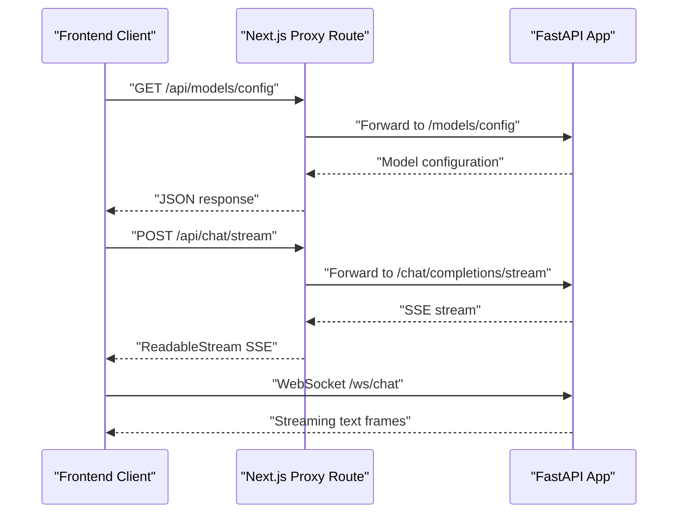
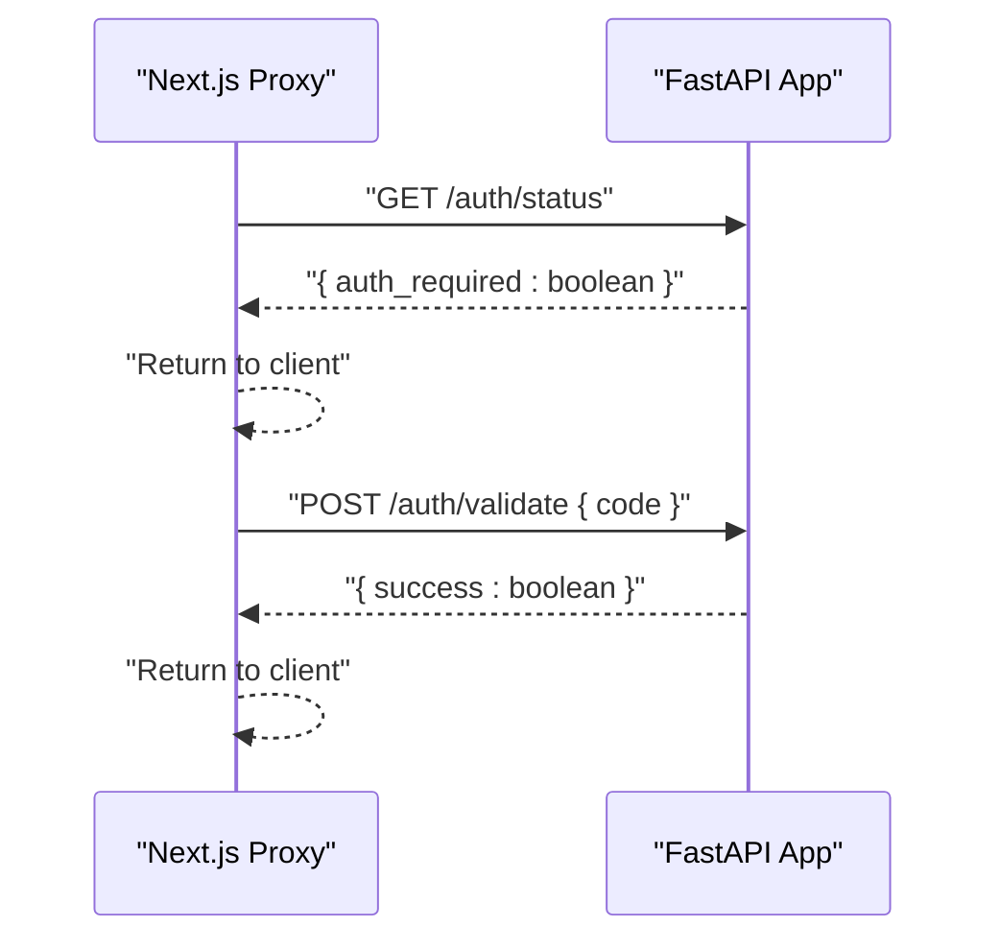
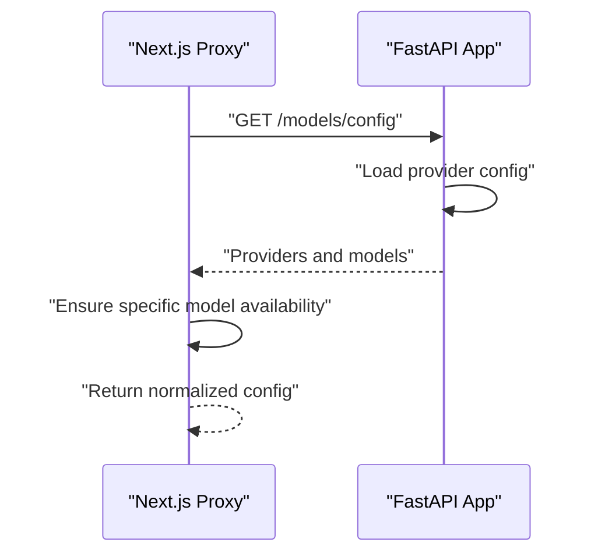
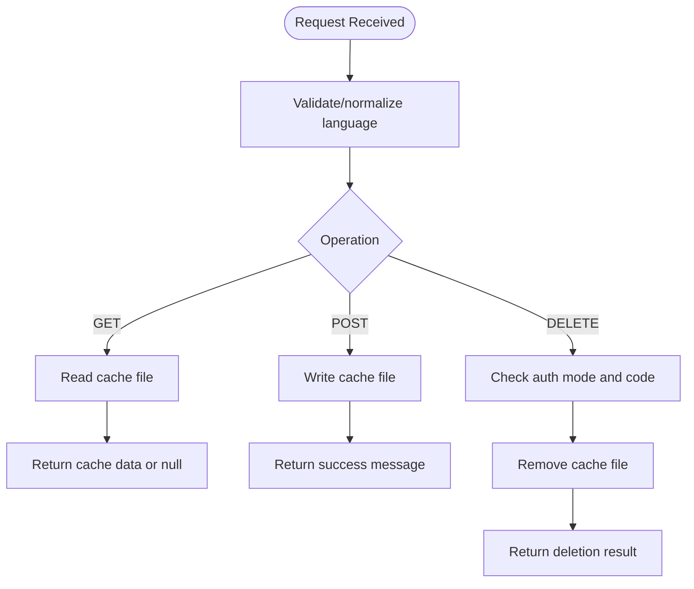
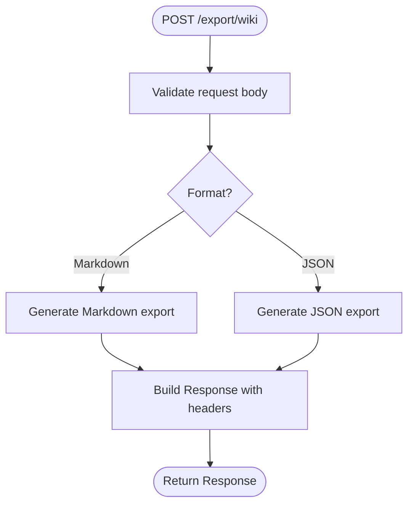
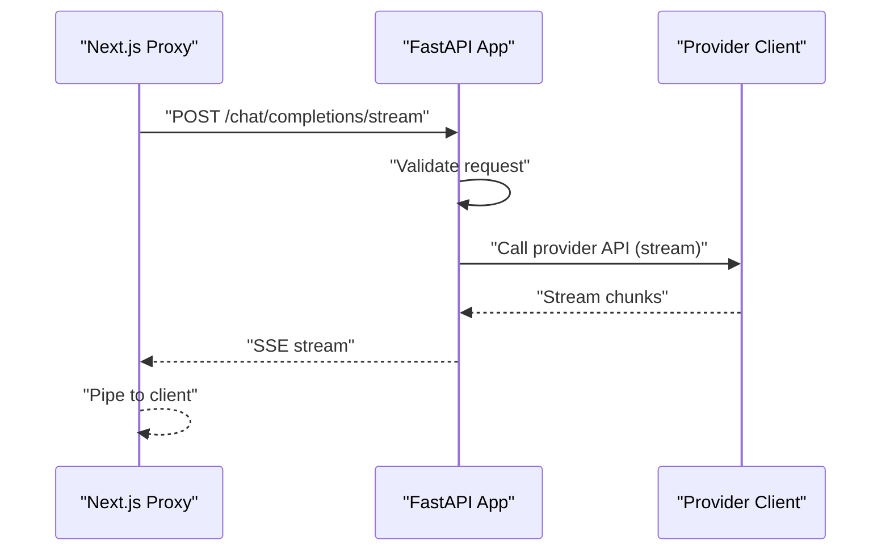
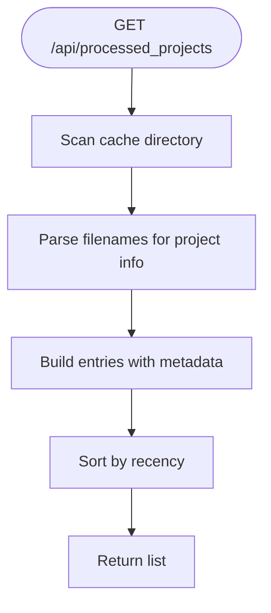
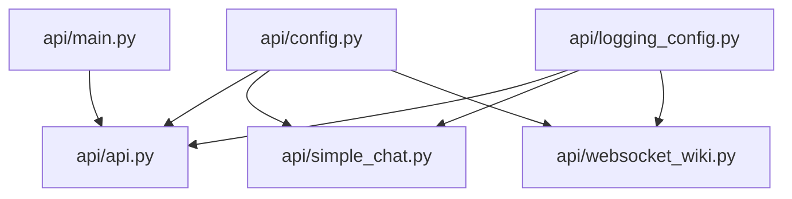

# API Endpoint Routing

<cite>
**Referenced Files in This Document**
- [api/api.py](file://api/api.py)
- [api/simple_chat.py](file://api/simple_chat.py)
- [api/websocket_wiki.py](file://api/websocket_wiki.py)
- [api/config.py](file://api/config.py)
- [api/logging_config.py](file://api/logging_config.py)
- [api/main.py](file://api/main.py)
- [src/app/api/chat/stream/route.ts](file://src/app/api/chat/stream/route.ts)
- [src/app/api/models/config/route.ts](file://src/app/api/models/config/route.ts)
- [src/app/api/auth/status/route.ts](file://src/app/api/auth/status/route.ts)
- [src/app/api/auth/validate/route.ts](file://src/app/api/auth/validate/route.ts)
- [src/app/api/wiki/projects/route.ts](file://src/app/api/wiki/projects/route.ts)
- [api/config/generator.json](file://api/config/generator.json)
- [api/config/lang.json](file://api/config/lang.json)
- [api/config/repo.json](file://api/config/repo.json)
</cite>

## Table of Contents
1. [Introduction](#introduction)
2. [Project Structure](#project-structure)
3. [Core Components](#core-components)
4. [Architecture Overview](#architecture-overview)
5. [Detailed Component Analysis](#detailed-component-analysis)
6. [Dependency Analysis](#dependency-analysis)
7. [Performance Considerations](#performance-considerations)
8. [Troubleshooting Guide](#troubleshooting-guide)
9. [Conclusion](#conclusion)
10. [Appendices](#appendices)

## Introduction
This document explains the API endpoint routing system, focusing on endpoint organization, request handling patterns, and streaming chat capabilities. It covers:
- Authentication endpoints (/auth/*)
- Model configuration (/models/*)
- Wiki cache operations (/api/wiki_cache/*)
- Export functionality (/export/*)
- Streaming chat (/chat/completions/stream, /ws/chat)
It also documents endpoint registration patterns, Pydantic-based parameter validation, response formatting, WebSocket lifecycle management, rate limiting considerations, request/response size limits, and extension guidelines for adding new endpoints and maintaining API versioning consistency.

## Project Structure
The API is implemented in a FastAPI application with a thin Next.js proxy layer for frontend integration. The backend FastAPI app registers endpoints and handles streaming responses. The frontend Next.js routes act as lightweight proxies to the backend.

```mermaid
graph TB
subgraph "Frontend (Next.js)"
FE_ChatStream["/api/chat/stream (HTTP fallback)"]
FE_Models["/api/models/config"]
FE_AuthStatus["/api/auth/status"]
FE_AuthValidate["/api/auth/validate"]
FE_WikiProjects["/api/wiki/projects"]
end
subgraph "Backend (FastAPI)"
BE_Root["Root endpoint (/)"]
BE_Health["Health (/health)"]
BE_AuthStatus["Auth status (/auth/status)"]
BE_AuthValidate["Auth validate (/auth/validate)"]
BE_Models["Model config (/models/config)"]
BE_Export["Export (/export/wiki)"]
BE_WikiCacheGet["Wiki cache GET (/api/wiki_cache)"]
BE_WikiCachePost["Wiki cache POST (/api/wiki_cache)"]
BE_WikiCacheDelete["Wiki cache DELETE (/api/wiki_cache)"]
BE_ProcessedProjects["Processed projects (/api/processed_projects)"]
BE_Stream["Chat stream (POST /chat/completions/stream)"]
BE_WS["WebSocket chat (/ws/chat)"]
end
FE_ChatStream --> BE_Stream
FE_Models --> BE_Models
FE_AuthStatus --> BE_AuthStatus
FE_AuthValidate --> BE_AuthValidate
FE_WikiProjects --> BE_ProcessedProjects
FE_WikiProjects --> BE_WikiCacheGet
FE_WikiProjects --> BE_WikiCacheDelete
BE_Root --> BE_Health
```

**Diagram sources**
- [api/api.py](file://api/api.py#L149-L574)
- [src/app/api/chat/stream/route.ts](file://src/app/api/chat/stream/route.ts#L9-L87)
- [src/app/api/models/config/route.ts](file://src/app/api/models/config/route.ts#L6-L43)
- [src/app/api/auth/status/route.ts](file://src/app/api/auth/status/route.ts#L5-L23)
- [src/app/api/auth/validate/route.ts](file://src/app/api/auth/validate/route.ts#L5-L26)
- [src/app/api/wiki/projects/route.ts](file://src/app/api/wiki/projects/route.ts#L38-L72)

**Section sources**
- [api/api.py](file://api/api.py#L149-L574)
- [src/app/api/chat/stream/route.ts](file://src/app/api/chat/stream/route.ts#L9-L87)
- [src/app/api/models/config/route.ts](file://src/app/api/models/config/route.ts#L6-L43)
- [src/app/api/auth/status/route.ts](file://src/app/api/auth/status/route.ts#L5-L23)
- [src/app/api/auth/validate/route.ts](file://src/app/api/auth/validate/route.ts#L5-L26)
- [src/app/api/wiki/projects/route.ts](file://src/app/api/wiki/projects/route.ts#L38-L72)

## Core Components
- FastAPI application initialization and middleware (CORS)
- Pydantic models for request/response validation
- Endpoint registration via decorators and dynamic route additions
- Streaming chat via HTTP fallback and WebSocket
- Wiki cache CRUD operations with file-system persistence
- Export endpoints for wiki content
- Frontend proxy routes that forward to backend endpoints

Key implementation references:
- Application setup and CORS: [api/api.py](file://api/api.py#L21-L33)
- Pydantic models: [api/api.py](file://api/api.py#L40-L119)
- Endpoint registration: [api/api.py](file://api/api.py#L149-L574)
- Streaming chat handler: [api/simple_chat.py](file://api/simple_chat.py#L76-L660)
- WebSocket chat handler: [api/websocket_wiki.py](file://api/websocket_wiki.py#L53-L779)
- Wiki cache helpers and endpoints: [api/api.py](file://api/api.py#L403-L539)
- Export endpoint: [api/api.py](file://api/api.py#L227-L274)
- Frontend proxies: [src/app/api/chat/stream/route.ts](file://src/app/api/chat/stream/route.ts#L9-L87), [src/app/api/models/config/route.ts](file://src/app/api/models/config/route.ts#L6-L43), [src/app/api/auth/status/route.ts](file://src/app/api/auth/status/route.ts#L5-L23), [src/app/api/auth/validate/route.ts](file://src/app/api/auth/validate/route.ts#L5-L26), [src/app/api/wiki/projects/route.ts](file://src/app/api/wiki/projects/route.ts#L38-L72)

**Section sources**
- [api/api.py](file://api/api.py#L21-L33)
- [api/api.py](file://api/api.py#L40-L119)
- [api/api.py](file://api/api.py#L149-L574)
- [api/simple_chat.py](file://api/simple_chat.py#L76-L660)
- [api/websocket_wiki.py](file://api/websocket_wiki.py#L53-L779)
- [src/app/api/chat/stream/route.ts](file://src/app/api/chat/stream/route.ts#L9-L87)
- [src/app/api/models/config/route.ts](file://src/app/api/models/config/route.ts#L6-L43)
- [src/app/api/auth/status/route.ts](file://src/app/api/auth/status/route.ts#L5-L23)
- [src/app/api/auth/validate/route.ts](file://src/app/api/auth/validate/route.ts#L5-L26)
- [src/app/api/wiki/projects/route.ts](file://src/app/api/wiki/projects/route.ts#L38-L72)

## Architecture Overview
The system uses a layered architecture:
- Frontend Next.js routes act as proxies to backend endpoints
- Backend FastAPI app exposes REST endpoints and WebSocket routes
- Configuration-driven model selection and provider resolution
- Logging and environment-based configuration

**Diagram sources**
- [src/app/api/models/config/route.ts](file://src/app/api/models/config/route.ts#L6-L43)
- [src/app/api/chat/stream/route.ts](file://src/app/api/chat/stream/route.ts#L9-L87)
- [api/api.py](file://api/api.py#L397-L401)
- [api/websocket_wiki.py](file://api/websocket_wiki.py#L53-L779)

## Detailed Component Analysis

### Authentication Endpoints
- /auth/status: Returns whether wiki authentication is required
- /auth/validate: Validates an authorization code against configured settings

Implementation highlights:
- Pydantic model for request body: [api/api.py](file://api/api.py#L144-L147)
- Endpoint registration and logic: [api/api.py](file://api/api.py#L153-L166)
- Frontend proxy routes: [src/app/api/auth/status/route.ts](file://src/app/api/auth/status/route.ts#L5-L23), [src/app/api/auth/validate/route.ts](file://src/app/api/auth/validate/route.ts#L5-L26)

**Diagram sources**
- [api/api.py](file://api/api.py#L153-L166)
- [src/app/api/auth/status/route.ts](file://src/app/api/auth/status/route.ts#L5-L23)
- [src/app/api/auth/validate/route.ts](file://src/app/api/auth/validate/route.ts#L5-L26)

**Section sources**
- [api/api.py](file://api/api.py#L153-L166)
- [src/app/api/auth/status/route.ts](file://src/app/api/auth/status/route.ts#L5-L23)
- [src/app/api/auth/validate/route.ts](file://src/app/api/auth/validate/route.ts#L5-L26)

### Model Configuration Endpoints
- /models/config: Returns provider and model configuration, with frontend adjustments for a specific provider

Implementation highlights:
- Pydantic models for providers and models: [api/api.py](file://api/api.py#L121-L143)
- Endpoint logic and configuration loading: [api/api.py](file://api/api.py#L167-L226)
- Frontend proxy with provider-specific normalization: [src/app/api/models/config/route.ts](file://src/app/api/models/config/route.ts#L6-L43)
- Configuration sources: [api/config/generator.json](file://api/config/generator.json#L1-L101), [api/config.py](file://api/config.py#L381-L464)

**Diagram sources**
- [api/api.py](file://api/api.py#L167-L226)
- [src/app/api/models/config/route.ts](file://src/app/api/models/config/route.ts#L6-L43)
- [api/config/generator.json](file://api/config/generator.json#L1-L101)
- [api/config.py](file://api/config.py#L381-L464)

**Section sources**
- [api/api.py](file://api/api.py#L167-L226)
- [src/app/api/models/config/route.ts](file://src/app/api/models/config/route.ts#L6-L43)
- [api/config/generator.json](file://api/config/generator.json#L1-L101)
- [api/config.py](file://api/config.py#L381-L464)

### Wiki Cache Operations
Endpoints:
- GET /api/wiki_cache: Retrieve cached wiki data
- POST /api/wiki_cache: Store wiki cache
- DELETE /api/wiki_cache: Delete wiki cache with optional authorization

Implementation highlights:
- Pydantic models for cache data and requests: [api/api.py](file://api/api.py#L90-L119)
- File-system cache helpers and endpoints: [api/api.py](file://api/api.py#L403-L539)
- Language validation and defaults: [api/api.py](file://api/api.py#L461-L496), [api/config/lang.json](file://api/config/lang.json#L1-L16)
- Authentication enforcement for deletion: [api/api.py](file://api/api.py#L520-L524)

**Diagram sources**
- [api/api.py](file://api/api.py#L461-L539)
- [api/config/lang.json](file://api/config/lang.json#L1-L16)

**Section sources**
- [api/api.py](file://api/api.py#L90-L119)
- [api/api.py](file://api/api.py#L403-L539)
- [api/config/lang.json](file://api/config/lang.json#L1-L16)

### Export Functionality
- POST /export/wiki: Exports wiki content as Markdown or JSON

Implementation highlights:
- Pydantic model for export request: [api/api.py](file://api/api.py#L112-L119)
- Export logic and response formatting: [api/api.py](file://api/api.py#L227-L274)
- Generation helpers: [api/api.py](file://api/api.py#L322-L391)

**Diagram sources**
- [api/api.py](file://api/api.py#L227-L274)
- [api/api.py](file://api/api.py#L322-L391)

**Section sources**
- [api/api.py](file://api/api.py#L112-L119)
- [api/api.py](file://api/api.py#L227-L274)
- [api/api.py](file://api/api.py#L322-L391)

### Streaming Chat Endpoints
- HTTP fallback: /api/chat/stream → POST /chat/completions/stream
- WebSocket: /ws/chat

Implementation highlights:
- HTTP fallback proxy: [src/app/api/chat/stream/route.ts](file://src/app/api/chat/stream/route.ts#L9-L87)
- Backend streaming handler: [api/simple_chat.py](file://api/simple_chat.py#L76-L660)
- WebSocket handler: [api/websocket_wiki.py](file://api/websocket_wiki.py#L53-L779)
- Registration: [api/api.py](file://api/api.py#L397-L401)

**Diagram sources**
- [src/app/api/chat/stream/route.ts](file://src/app/api/chat/stream/route.ts#L9-L87)
- [api/api.py](file://api/api.py#L397-L401)
- [api/simple_chat.py](file://api/simple_chat.py#L76-L660)

**Section sources**
- [src/app/api/chat/stream/route.ts](file://src/app/api/chat/stream/route.ts#L9-L87)
- [api/api.py](file://api/api.py#L397-L401)
- [api/simple_chat.py](file://api/simple_chat.py#L76-L660)
- [api/websocket_wiki.py](file://api/websocket_wiki.py#L53-L779)

### Processed Projects Endpoint
- GET /api/processed_projects: Lists processed projects from cache directory

Implementation highlights:
- Endpoint logic and file parsing: [api/api.py](file://api/api.py#L576-L634)
- Frontend proxy: [src/app/api/wiki/projects/route.ts](file://src/app/api/wiki/projects/route.ts#L38-L72)

**Diagram sources**
- [api/api.py](file://api/api.py#L576-L634)
- [src/app/api/wiki/projects/route.ts](file://src/app/api/wiki/projects/route.ts#L38-L72)

**Section sources**
- [api/api.py](file://api/api.py#L576-L634)
- [src/app/api/wiki/projects/route.ts](file://src/app/api/wiki/projects/route.ts#L38-L72)

## Dependency Analysis
- Configuration-driven provider selection: [api/config.py](file://api/config.py#L381-L464)
- Logging configuration: [api/logging_config.py](file://api/logging_config.py#L12-L86)
- Environment and startup: [api/main.py](file://api/main.py#L60-L103)

**Diagram sources**
- [api/config.py](file://api/config.py#L381-L464)
- [api/logging_config.py](file://api/logging_config.py#L12-L86)
- [api/main.py](file://api/main.py#L60-L103)
- [api/api.py](file://api/api.py#L1-L25)
- [api/simple_chat.py](file://api/simple_chat.py#L1-L34)
- [api/websocket_wiki.py](file://api/websocket_wiki.py#L1-L26)

**Section sources**
- [api/config.py](file://api/config.py#L381-L464)
- [api/logging_config.py](file://api/logging_config.py#L12-L86)
- [api/main.py](file://api/main.py#L60-L103)
- [api/api.py](file://api/api.py#L1-L25)
- [api/simple_chat.py](file://api/simple_chat.py#L1-L34)
- [api/websocket_wiki.py](file://api/websocket_wiki.py#L1-L26)

## Performance Considerations
- Streaming responses: Both HTTP fallback and WebSocket endpoints stream provider responses to reduce latency and memory usage.
- Token limits and size checks: The streaming handler validates input token counts and falls back to reduced-context prompts when exceeding thresholds.
- Request/response size limits: The export endpoint constructs content in-memory; large exports may increase memory pressure. Consider pagination or chunked responses for very large datasets.
- Logging overhead: Logging is configured with rotating file handlers; adjust log level and file size to balance observability and performance.
- Provider-specific constraints: Some providers impose request size or rate limits; respect provider quotas and consider exponential backoff on errors.

[No sources needed since this section provides general guidance]

## Troubleshooting Guide
Common issues and resolutions:
- Missing environment variables: Startup warns about missing required keys; configure them before running.
- Authentication failures: Ensure authorization code matches backend configuration for protected operations.
- Provider errors: Streaming handlers return provider-specific error messages; verify API keys and provider availability.
- File system errors: Wiki cache operations log IO errors; check permissions and disk space.
- Logging configuration: Ensure log file path is within the trusted logs directory.

**Section sources**
- [api/main.py](file://api/main.py#L60-L103)
- [api/api.py](file://api/api.py#L520-L524)
- [api/websocket_wiki.py](file://api/websocket_wiki.py#L591-L596)
- [api/logging_config.py](file://api/logging_config.py#L38-L42)

## Conclusion
The API routing system combines FastAPI endpoints with Next.js proxies to deliver a cohesive interface for authentication, model configuration, wiki caching, export, and streaming chat. Pydantic models enforce request validation, while streaming handlers optimize responsiveness. Configuration-driven provider support and robust error handling enable extensibility and reliability.

[No sources needed since this section summarizes without analyzing specific files]

## Appendices

### Endpoint Registration Patterns
- Decorator-based endpoints: [api/api.py](file://api/api.py#L149-L574)
- Dynamic route addition for streaming and WebSocket: [api/api.py](file://api/api.py#L397-L401)

**Section sources**
- [api/api.py](file://api/api.py#L149-L574)
- [api/api.py](file://api/api.py#L397-L401)

### Parameter Validation Using Pydantic
- Authentication request model: [api/api.py](file://api/api.py#L144-L147)
- Wiki cache models: [api/api.py](file://api/api.py#L90-L119)
- Export request model: [api/api.py](file://api/api.py#L112-L119)
- Chat request models: [api/simple_chat.py](file://api/simple_chat.py#L52-L75), [api/websocket_wiki.py](file://api/websocket_wiki.py#L33-L51)

**Section sources**
- [api/api.py](file://api/api.py#L90-L119)
- [api/api.py](file://api/api.py#L144-L147)
- [api/simple_chat.py](file://api/simple_chat.py#L52-L75)
- [api/websocket_wiki.py](file://api/websocket_wiki.py#L33-L51)

### Response Formatting Strategies
- JSON responses with explicit status codes: [api/api.py](file://api/api.py#L279-L282), [api/api.py](file://api/api.py#L315-L320)
- Streaming responses via SSE: [src/app/api/chat/stream/route.ts](file://src/app/api/chat/stream/route.ts#L49-L87)
- JSON responses with headers: [api/api.py](file://api/api.py#L259-L266)

**Section sources**
- [api/api.py](file://api/api.py#L259-L266)
- [api/api.py](file://api/api.py#L279-L282)
- [api/api.py](file://api/api.py#L315-L320)
- [src/app/api/chat/stream/route.ts](file://src/app/api/chat/stream/route.ts#L49-L87)

### Streaming Chat Implementation Details
- HTTP fallback streaming: [src/app/api/chat/stream/route.ts](file://src/app/api/chat/stream/route.ts#L9-L87)
- WebSocket lifecycle: [api/websocket_wiki.py](file://api/websocket_wiki.py#L53-L779)
- Token limit handling and fallback prompts: [api/simple_chat.py](file://api/simple_chat.py#L661-L791)

**Section sources**
- [src/app/api/chat/stream/route.ts](file://src/app/api/chat/stream/route.ts#L9-L87)
- [api/websocket_wiki.py](file://api/websocket_wiki.py#L53-L779)
- [api/simple_chat.py](file://api/simple_chat.py#L661-L791)

### Rate Limiting and Size Limits
- Token-based input size checks: [api/simple_chat.py](file://api/simple_chat.py#L80-L90)
- Repository size limits: [api/config/repo.json](file://api/config/repo.json#L125-L128)
- Provider-specific constraints: Respect provider quotas and implement retries/backoff.

**Section sources**
- [api/simple_chat.py](file://api/simple_chat.py#L80-L90)
- [api/config/repo.json](file://api/config/repo.json#L125-L128)

### Extending the Routing System
- Add a new endpoint:
  - Define Pydantic models in [api/api.py](file://api/api.py#L40-L119)
  - Register the endpoint using decorators or dynamic route additions in [api/api.py](file://api/api.py#L149-L574)
  - For streaming, follow patterns in [api/simple_chat.py](file://api/simple_chat.py#L76-L660) or [api/websocket_wiki.py](file://api/websocket_wiki.py#L53-L779)
- Frontend proxy:
  - Add a Next.js route under src/app/api/<category>/<endpoint>/route.ts mirroring backend behavior in [src/app/api/chat/stream/route.ts](file://src/app/api/chat/stream/route.ts#L9-L87), [src/app/api/models/config/route.ts](file://src/app/api/models/config/route.ts#L6-L43), [src/app/api/auth/status/route.ts](file://src/app/api/auth/status/route.ts#L5-L23), [src/app/api/auth/validate/route.ts](file://src/app/api/auth/validate/route.ts#L5-L26), [src/app/api/wiki/projects/route.ts](file://src/app/api/wiki/projects/route.ts#L38-L72)
- Maintain API versioning:
  - Keep backward-compatible endpoints
  - Introduce new endpoints under new paths or versioned prefixes
  - Update frontend proxies consistently

**Section sources**
- [api/api.py](file://api/api.py#L40-L119)
- [api/api.py](file://api/api.py#L149-L574)
- [api/simple_chat.py](file://api/simple_chat.py#L76-L660)
- [api/websocket_wiki.py](file://api/websocket_wiki.py#L53-L779)
- [src/app/api/chat/stream/route.ts](file://src/app/api/chat/stream/route.ts#L9-L87)
- [src/app/api/models/config/route.ts](file://src/app/api/models/config/route.ts#L6-L43)
- [src/app/api/auth/status/route.ts](file://src/app/api/auth/status/route.ts#L5-L23)
- [src/app/api/auth/validate/route.ts](file://src/app/api/auth/validate/route.ts#L5-L26)
- [src/app/api/wiki/projects/route.ts](file://src/app/api/wiki/projects/route.ts#L38-L72)