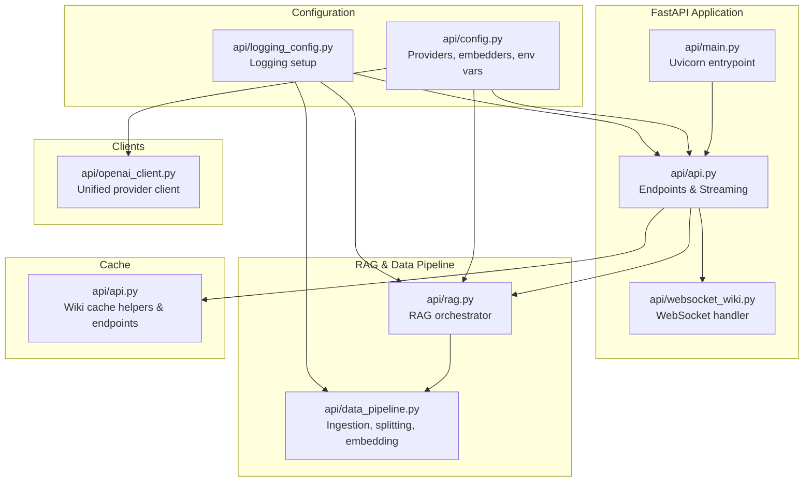
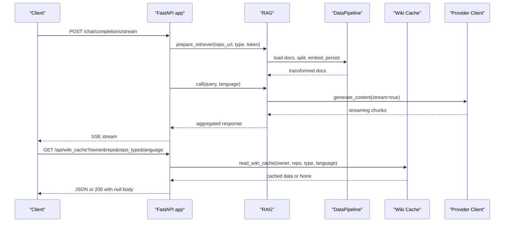
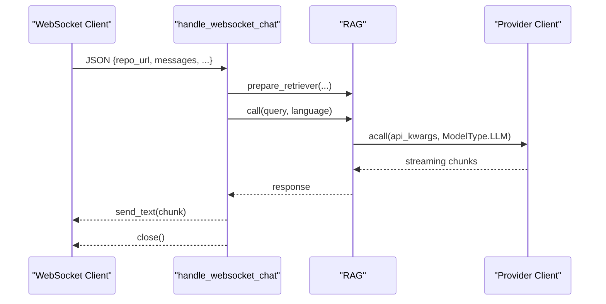
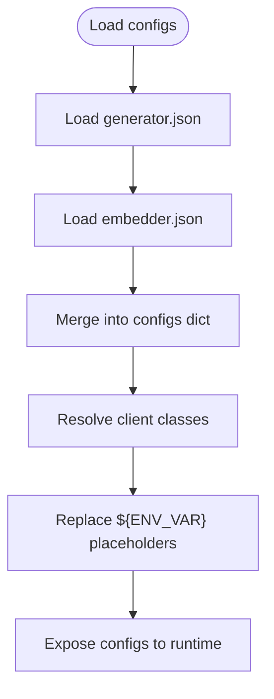
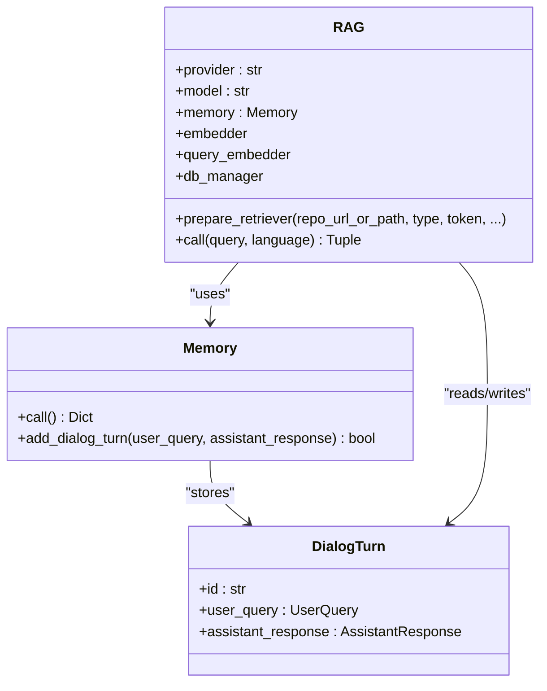
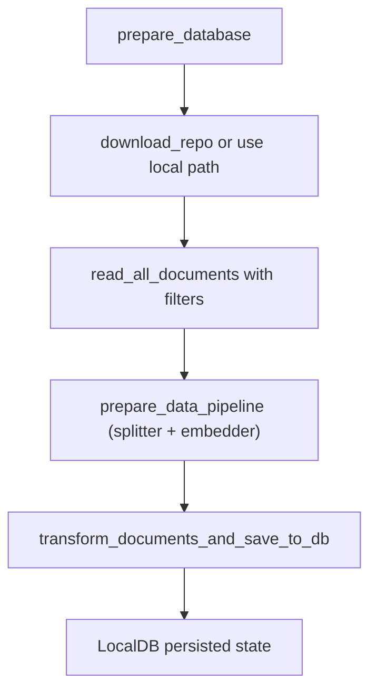
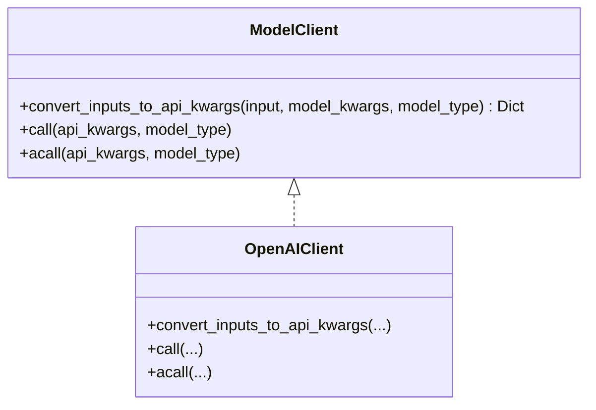
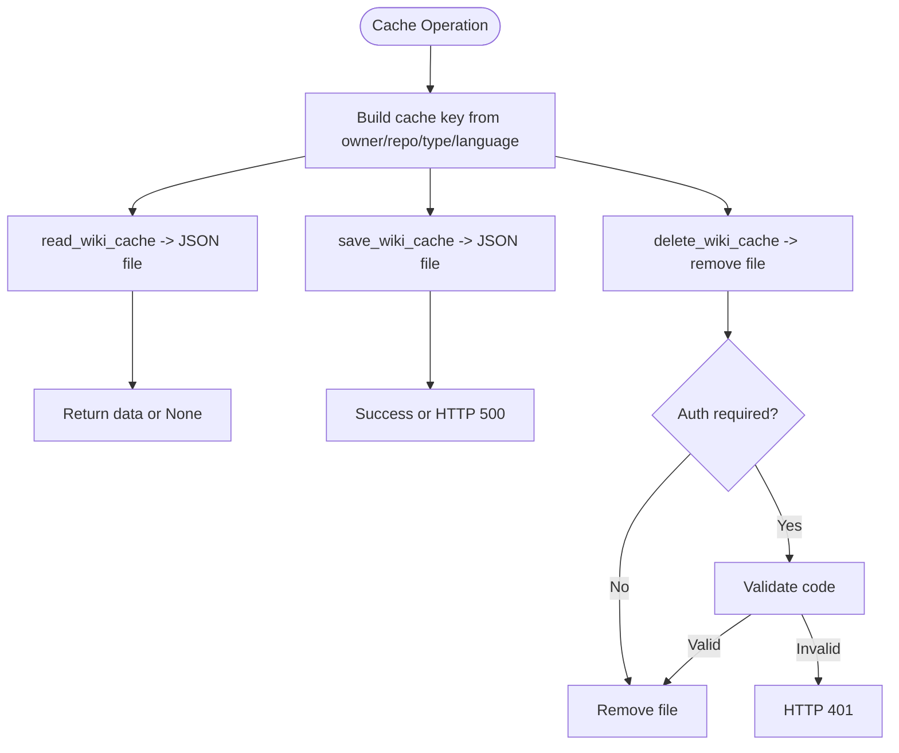
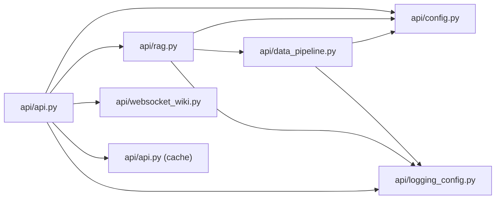

# Backend Architecture

<cite>
**Referenced Files in This Document**
- [api/main.py](file://api/main.py)
- [api/api.py](file://api/api.py)
- [api/config.py](file://api/config.py)
- [api/rag.py](file://api/rag.py)
- [api/simple_chat.py](file://api/simple_chat.py)
- [api/data_pipeline.py](file://api/data_pipeline.py)
- [api/websocket_wiki.py](file://api/websocket_wiki.py)
- [api/openai_client.py](file://api/openai_client.py)
- [api/logging_config.py](file://api/logging_config.py)
</cite>

## Table of Contents
1. [Introduction](#introduction)
2. [Project Structure](#project-structure)
3. [Core Components](#core-components)
4. [Architecture Overview](#architecture-overview)
5. [Detailed Component Analysis](#detailed-component-analysis)
6. [Dependency Analysis](#dependency-analysis)
7. [Performance Considerations](#performance-considerations)
8. [Troubleshooting Guide](#troubleshooting-guide)
9. [Security and Authentication](#security-and-authentication)
10. [Monitoring and Observability](#monitoring-and-observability)
11. [Conclusion](#conclusion)

## Introduction
This document describes the backend architecture of the FastAPI application that powers the chat and RAG (Retrieval-Augmented Generation) system. It focuses on the modular organization separating API endpoints, the RAG pipeline, configuration management, and cache operations. It also explains request/response flows, middleware integration, error handling patterns, the provider factory pattern for AI model integration, the caching architecture with persistent storage, streaming capabilities for real-time chat responses, security considerations, authentication mechanisms, and monitoring approaches.

## Project Structure
The backend is organized around a FastAPI application with clear separation of concerns:
- API surface: FastAPI app definition, endpoints, and streaming/WebSocket handlers
- Configuration: Centralized provider and embedder configuration with environment-driven overrides
- RAG pipeline: Retrieval, embedding, and generation orchestration
- Data pipeline: Repository ingestion, document processing, splitting, and embedding
- Clients: Provider-specific model clients implementing a unified interface
- Cache: Persistent file-based cache for wiki structures and generated pages
- Logging: Structured logging configuration

**Diagram sources**
- [api/main.py](file://api/main.py#L87-L104)
- [api/api.py](file://api/api.py#L20-L635)
- [api/config.py](file://api/config.py#L1-L464)
- [api/rag.py](file://api/rag.py#L1-L446)
- [api/data_pipeline.py](file://api/data_pipeline.py#L1-L917)
- [api/websocket_wiki.py](file://api/websocket_wiki.py#L1-L978)
- [api/openai_client.py](file://api/openai_client.py#L1-L653)
- [api/logging_config.py](file://api/logging_config.py)

**Section sources**
- [api/main.py](file://api/main.py#L1-L104)
- [api/api.py](file://api/api.py#L1-L635)

## Core Components
- FastAPI application and endpoints
  - Streaming chat completion endpoint
  - WebSocket chat handler
  - Wiki cache read/write/delete endpoints
  - Export wiki endpoint
  - Health and root endpoints
- Configuration management
  - Provider and embedder configuration loader
  - Environment variable placeholders replacement
  - Default and override configuration merging
- RAG system
  - Conversation memory
  - Retrieval via FAISS
  - Generation via provider clients
- Data pipeline
  - Repository cloning and document ingestion
  - Text splitting and embeddings
  - Local database persistence
- Provider factory pattern
  - Unified client interface for multiple providers
  - Parameter filtering and streaming support
- Cache subsystem
  - Persistent file-based cache for wiki structures and pages
  - Language-aware cache keys and validation

**Section sources**
- [api/api.py](file://api/api.py#L149-L635)
- [api/config.py](file://api/config.py#L103-L464)
- [api/rag.py](file://api/rag.py#L153-L446)
- [api/data_pipeline.py](file://api/data_pipeline.py#L103-L917)
- [api/openai_client.py](file://api/openai_client.py#L120-L653)

## Architecture Overview
The backend follows a layered architecture:
- Presentation layer: FastAPI routes and WebSocket handlers
- Service layer: RAG orchestration and data pipeline
- Integration layer: Provider clients and external APIs
- Persistence layer: Local file cache and FAISS-backed database

**Diagram sources**
- [api/api.py](file://api/api.py#L394-L401)
- [api/simple_chat.py](file://api/simple_chat.py#L76-L887)
- [api/rag.py](file://api/rag.py#L345-L446)
- [api/data_pipeline.py](file://api/data_pipeline.py#L737-L800)
- [api/api.py](file://api/api.py#L413-L457)

## Detailed Component Analysis

### FastAPI Application and Endpoints
- Streaming chat completion
  - Validates input, prepares RAG with optional file filters, constructs prompts with conversation history and optional file content, selects provider client, streams response chunks, and handles token limit fallbacks.
- WebSocket chat
  - Accepts JSON over WebSocket, mirrors streaming logic, and sends text chunks to the client until completion or error.
- Wiki cache
  - Reads/writes/deletes cached wiki structures and pages; validates language and optional authorization for deletion.
- Export wiki
  - Generates Markdown or JSON exports of selected wiki pages.
- Health and root
  - Health check and dynamic endpoint listing.

**Diagram sources**
- [api/websocket_wiki.py](file://api/websocket_wiki.py#L53-L800)

**Section sources**
- [api/api.py](file://api/api.py#L149-L635)
- [api/websocket_wiki.py](file://api/websocket_wiki.py#L53-L978)
- [api/simple_chat.py](file://api/simple_chat.py#L76-L887)

### Configuration Management
- Provider and embedder configuration
  - Loads JSON configs for generators and embedders, resolves client classes, merges defaults, and exposes a unified configuration object.
- Environment-driven configuration
  - Supports ${ENV_VAR} placeholders in JSON configs and environment variable overrides.
- Language configuration
  - Provides supported languages and default language selection.
- Authentication settings
  - Wiki auth mode and code enforcement for cache deletion.

**Diagram sources**
- [api/config.py](file://api/config.py#L103-L182)

**Section sources**
- [api/config.py](file://api/config.py#L1-L464)

### RAG System
- Conversation memory
  - Stores dialog turns with UUIDs and safely appends new turns.
- Retrieval
  - Prepares FAISS retriever from transformed documents; validates and filters embeddings to ensure consistent sizes.
- Generation
  - Builds prompts with system role, conversation history, optional file content, and optional RAG context; invokes provider client with streaming enabled.

**Diagram sources**
- [api/rag.py](file://api/rag.py#L28-L142)
- [api/rag.py](file://api/rag.py#L153-L243)

**Section sources**
- [api/rag.py](file://api/rag.py#L1-L446)

### Data Pipeline
- Repository ingestion
  - Clones repositories (GitHub, GitLab, Bitbucket) with optional tokens; supports inclusion/exclusion filters.
- Document processing
  - Reads code and documentation files, counts tokens per provider-specific limits, splits text, and embeds documents.
- Local database
  - Saves transformed documents to a local database for retrieval.

**Diagram sources**
- [api/data_pipeline.py](file://api/data_pipeline.py#L103-L176)
- [api/data_pipeline.py](file://api/data_pipeline.py#L177-L406)
- [api/data_pipeline.py](file://api/data_pipeline.py#L408-L476)

**Section sources**
- [api/data_pipeline.py](file://api/data_pipeline.py#L1-L917)

### Provider Factory Pattern and Clients
- Unified client interface
  - Provider clients implement a common interface for embeddings and chat completions, with streaming support.
- Parameter normalization
  - Converts standardized inputs to provider-specific API kwargs; filters parameters for providers with strict subsets (e.g., iFlow).
- Streaming and fallbacks
  - Handles streaming responses and token-limit fallbacks by regenerating without context.

**Diagram sources**
- [api/openai_client.py](file://api/openai_client.py#L120-L653)

**Section sources**
- [api/openai_client.py](file://api/openai_client.py#L1-L653)
- [api/simple_chat.py](file://api/simple_chat.py#L332-L887)

### Cache Architecture
- Persistent storage
  - Wiki cache is stored as JSON files under a default root path; cache keys include repository type, owner, repo, and language.
- Operations
  - Read cache by owner/repo/type/language; write cache with validated language; delete cache with optional authorization.

**Diagram sources**
- [api/api.py](file://api/api.py#L405-L539)

**Section sources**
- [api/api.py](file://api/api.py#L403-L539)

## Dependency Analysis
Key dependencies and relationships:
- FastAPI app depends on configuration, RAG, and data pipeline modules.
- RAG depends on configuration for provider selection and embedder type, and on the data pipeline for document preparation.
- Provider clients depend on configuration for model parameters and environment variables.
- Cache operations depend on configuration for language validation and optional auth.

**Diagram sources**
- [api/api.py](file://api/api.py#L1-L635)
- [api/config.py](file://api/config.py#L1-L464)
- [api/rag.py](file://api/rag.py#L1-L446)
- [api/data_pipeline.py](file://api/data_pipeline.py#L1-L917)
- [api/websocket_wiki.py](file://api/websocket_wiki.py#L1-L978)
- [api/logging_config.py](file://api/logging_config.py)

**Section sources**
- [api/api.py](file://api/api.py#L1-L635)
- [api/config.py](file://api/config.py#L1-L464)

## Performance Considerations
- Streaming responses
  - Both HTTP streaming and WebSocket handlers stream provider responses to reduce latency and memory footprint.
- Token limits and fallbacks
  - Token counting per provider-specific limits; on token limit errors, the system retries without RAG context.
- Embedding consistency
  - Validates and filters embeddings to ensure consistent sizes before creating the FAISS retriever.
- Asynchronous operations
  - Uses asyncio for file system operations (listing cache directory) and provider async calls where applicable.
- Caching
  - Persists processed documents and wiki structures to avoid recomputation.

[No sources needed since this section provides general guidance]

## Troubleshooting Guide
- Missing environment variables
  - Required: GOOGLE_API_KEY, OPENAI_API_KEY; optional: GITHUB_TOKEN, OPENROUTER_API_KEY, IFLOW_API_KEY, AWS_ACCESS_KEY_ID, AWS_SECRET_ACCESS_KEY.
- Provider configuration issues
  - Ensure provider and model are configured; iFlow requires base URL and API key environment variable; Ollama model existence is validated.
- RAG retrieval failures
  - Inconsistent embedding sizes or no valid embeddings trigger explicit HTTP 500 errors with guidance.
- Token limit errors
  - On “maximum context length” or “token limit” errors, the system retries without RAG context; if still failing, instruct users to shorten queries.
- Cache operations
  - Deletion requires authorization when enabled; missing cache file results in HTTP 404.

**Section sources**
- [api/main.py](file://api/main.py#L60-L86)
- [api/simple_chat.py](file://api/simple_chat.py#L116-L129)
- [api/rag.py](file://api/rag.py#L392-L414)
- [api/api.py](file://api/api.py#L520-L538)

## Security and Authentication
- Wiki cache deletion
  - Optional authorization enforced via a configurable code; unauthorized attempts return HTTP 401.
- Provider credentials
  - Providers rely on environment variables or automatic OAuth2 (GitHub Copilot); ensure correct keys are set.
- CORS
  - Enabled broadly for development; adjust origins in production deployments.

**Section sources**
- [api/api.py](file://api/api.py#L520-L538)
- [api/config.py](file://api/config.py#L19-L47)
- [api/api.py](file://api/api.py#L26-L33)

## Monitoring and Observability
- Logging
  - Structured logging setup via a dedicated module; extensive logging for RAG, data pipeline, and client interactions.
- Health endpoint
  - Provides service health and timestamp for monitoring systems.

**Section sources**
- [api/logging_config.py](file://api/logging_config.py)
- [api/api.py](file://api/api.py#L540-L547)

## Conclusion
The backend employs a modular FastAPI architecture with clear separation between presentation, service, integration, and persistence layers. The provider factory pattern enables flexible model integration, while the RAG pipeline and data pipeline ensure robust retrieval and generation. Persistent caching and streaming responses deliver performance and user experience benefits. Security and monitoring are addressed through environment-driven configuration, optional authorization, and comprehensive logging.