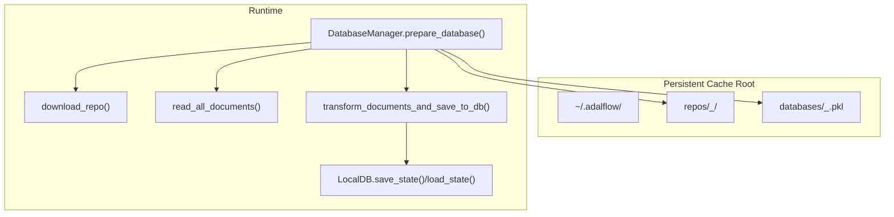
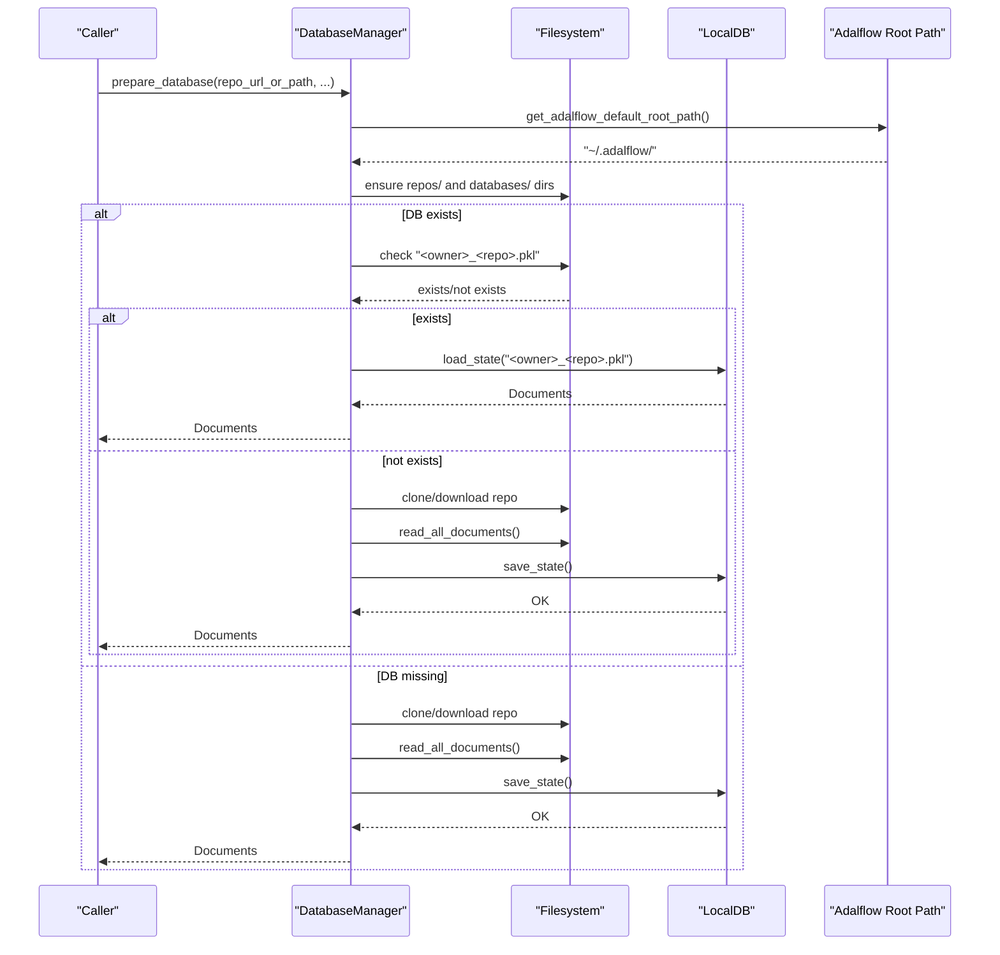
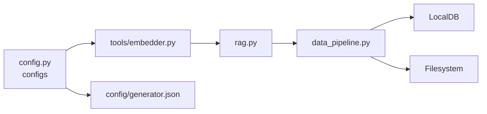

# Caching Architecture

<cite>
**Referenced Files in This Document**
- [data_pipeline.py](file://api/data_pipeline.py)
- [rag.py](file://api/rag.py)
- [embedder.py](file://api/tools/embedder.py)
- [config.py](file://api/config.py)
- [embedder.json](file://api/config/embedder.json)
- [generator.json](file://api/config/generator.json)
</cite>

## Table of Contents
1. [Introduction](#introduction)
2. [Project Structure](#project-structure)
3. [Core Components](#core-components)
4. [Architecture Overview](#architecture-overview)
5. [Detailed Component Analysis](#detailed-component-analysis)
6. [Dependency Analysis](#dependency-analysis)
7. [Performance Considerations](#performance-considerations)
8. [Troubleshooting Guide](#troubleshooting-guide)
9. [Conclusion](#conclusion)
10. [Appendices](#appendices)

## Introduction
This document describes the caching architecture for persistent storage of repository content and FAISS/LocalDB indices used by the Retrieval-Augmented Generation (RAG) system. It focuses on the cache directory structure, file naming conventions, lifecycle management, read/write operations, asynchronous I/O patterns, error handling, invalidation strategies, authorization-protected cache deletion, discovery mechanisms, serialization/deserialization, cache size monitoring, performance optimization, consistency patterns, concurrent access handling, cache warming, and practical examples for custom backends and monitoring.

## Project Structure
The caching and persistence logic centers around:
- Persistent cache directories under a default root path provided by the Adalflow library
- Repository content cached locally for offline reuse
- LocalDB state persisted as a pickle file for transformed documents and embeddings
- Configuration-driven selection of embedder and retriever behavior

**Diagram sources**
- [data_pipeline.py](file://api/data_pipeline.py#L800-L917)

**Section sources**
- [data_pipeline.py](file://api/data_pipeline.py#L800-L917)

## Core Components
- DatabaseManager: orchestrates repository preparation, database loading/saving, and retriever setup
- LocalDB: stores transformed documents and embeddings; supports save_state/load_state
- Adalflow default root path: determines the base cache directory
- Embedder selection: influences batch size and processing strategy impacting cache throughput
- RAG: consumes prepared retriever and memory for generation

Key responsibilities:
- Cache directory structure and naming conventions
- Cache lifecycle: create, load, transform, persist
- Error handling for cache load failures and partial states
- Invalidation via repository URL/path change and explicit reset
- Discovery of existing databases and selective regeneration

**Section sources**
- [data_pipeline.py](file://api/data_pipeline.py#L737-L917)
- [rag.py](file://api/rag.py#L153-L244)
- [embedder.py](file://api/tools/embedder.py#L6-L59)
- [config.py](file://api/config.py#L360-L379)

## Architecture Overview
The caching architecture integrates repository cloning, document ingestion, embedding, and FAISS indexing behind a LocalDB abstraction. The cache is organized under a user-writable directory with deterministic naming derived from repository URLs.

**Diagram sources**
- [data_pipeline.py](file://api/data_pipeline.py#L800-L917)

## Detailed Component Analysis

### Cache Directory Structure and Naming Conventions
- Root: default location provided by the Adalflow library
- Repositories: stored under repos/<owner>_<repo>/ with normalized names extracted from URLs
- Databases: stored under databases/<owner>_<repo>.pkl

Naming rules:
- Owner and repository name derived from URL path segments
- For local paths, the basename becomes the repository name
- Database file extension is .pkl

Operational behavior:
- Ensures parent directories exist before writing
- Skips download if repository already exists and is non-empty

**Section sources**
- [data_pipeline.py](file://api/data_pipeline.py#L800-L850)

### Cache Lifecycle Management
Phases:
- Initialization: resolve root path and prepare directories
- Repository preparation: clone/download repository if needed
- Document ingestion: read_all_documents with inclusion/exclusion filters
- Transformation and persistence: transform_documents_and_save_to_db
- Loading: LocalDB.load_state if available
- Error recovery: on load failure, rebuild from scratch

Invalidations:
- Explicit reset_database clears state
- Changing the repository URL or path triggers a new cache key
- On load errors, rebuild proceeds automatically

**Section sources**
- [data_pipeline.py](file://api/data_pipeline.py#L737-L917)

### Cache Read/Write Operations and Asynchronous I/O Patterns
Reads:
- Local filesystem reads for repository content
- LocalDB load_state for serialized documents and embeddings

Writes:
- LocalDB save_state to persist transformed data
- Filesystem writes for repository content

Asynchronous I/O:
- Repository cloning uses subprocess-based blocking operations
- No explicit async I/O is implemented in the cache layer
- Embedding batch sizes are configured to optimize throughput

Recommendations:
- Offload long-running operations to background tasks
- Use streaming or chunked reads for very large files
- Consider async filesystem libraries for future enhancements

**Section sources**
- [data_pipeline.py](file://api/data_pipeline.py#L103-L176)
- [data_pipeline.py](file://api/data_pipeline.py#L452-L476)

### Error Handling for Cache Operations
- Repository download errors sanitized to avoid exposing tokens
- Load-state failures trigger fallback to rebuild
- Token counting and size checks prevent oversized documents
- Logging provides visibility into skip decisions and errors

Best practices:
- Always log sanitized error messages
- Implement retry policies for transient network issues
- Validate cache integrity before use

**Section sources**
- [data_pipeline.py](file://api/data_pipeline.py#L165-L172)
- [data_pipeline.py](file://api/data_pipeline.py#L882-L884)

### Cache Invalidation Strategies and Authorization-Protected Deletion
Invalidations:
- URL/path change: creates a new cache key
- Explicit reset_database: clears internal state
- On load failure: rebuild triggered automatically

Authorization-protected deletion:
- Repository operations respect access tokens for private repositories
- Cache files are owned by the user and located under the default root path
- No explicit admin API is provided; deletion can be performed by the user or via programmatic reset

**Section sources**
- [data_pipeline.py](file://api/data_pipeline.py#L800-L850)
- [data_pipeline.py](file://api/data_pipeline.py#L103-L176)

### Cache Discovery Mechanisms
Discovery:
- Deterministic naming from repository URL/path
- Existence checks for both repository and database files
- Automatic fallback to rebuild when load fails

Consistency:
- After successful transform/save, the database is ready for immediate use
- Validation ensures embedding sizes are consistent before building the retriever

**Section sources**
- [data_pipeline.py](file://api/data_pipeline.py#L873-L902)
- [rag.py](file://api/rag.py#L374-L414)

### Serialization/Deserialization and Cache Size Monitoring
Serialization:
- LocalDB.save_state persists transformed documents and embeddings
- LocalDB.load_state restores state for subsequent retrievals

Size monitoring:
- Token counts tracked per document
- Embedding size validation filters inconsistent vectors
- Logging indicates counts and warnings for oversized content

Optimization:
- Batch size configuration impacts throughput and memory usage
- Chunk size and overlap tuned via text splitter configuration

**Section sources**
- [data_pipeline.py](file://api/data_pipeline.py#L452-L476)
- [data_pipeline.py](file://api/data_pipeline.py#L251-L343)
- [data_pipeline.py](file://api/data_pipeline.py#L408-L450)
- [embedder.json](file://api/config/embedder.json#L27-L34)

### Cache Consistency Patterns and Concurrent Access Handling
Consistency:
- Single writer path: transform_documents_and_save_to_db followed by save_state
- Reader path: LocalDB.load_state for consistent state restoration
- Validation ensures embedding uniformity prior to retriever construction

Concurrent access:
- No explicit locking mechanism is present
- Recommended approach: serialize cache updates; use separate processes for rebuilds
- For multi-instance deployments, coordinate cache updates externally

**Section sources**
- [data_pipeline.py](file://api/data_pipeline.py#L452-L476)
- [rag.py](file://api/rag.py#L374-L414)

### Cache Warming Strategies
Warming:
- Pre-populate databases by invoking prepare_database with desired repositories
- Warm retrievers by preparing them after database creation
- Use batched transformations to accelerate embedding generation

Monitoring:
- Track document counts and embedding sizes
- Observe token limits and filtering outcomes

**Section sources**
- [data_pipeline.py](file://api/data_pipeline.py#L851-L902)
- [rag.py](file://api/rag.py#L345-L391)

### Practical Examples

#### Implementing Custom Cache Backends
- Replace LocalDB with another persistence layer by adapting transform_documents_and_save_to_db and LocalDB.load_state calls
- Maintain deterministic naming and directory structure for compatibility
- Ensure serialization supports the chosen backend’s schema

#### Monitoring Cache Performance
- Measure repository download duration and document ingestion time
- Track embedding throughput and batch sizes
- Monitor cache hit rates by observing whether load_state succeeds

#### Troubleshooting Cache-Related Issues
- If load_state fails, rebuild by removing the database file or resetting the manager
- Verify repository URL normalization and access tokens for private repositories
- Check token limits and adjust chunk sizes to avoid oversized documents

**Section sources**
- [data_pipeline.py](file://api/data_pipeline.py#L873-L902)
- [data_pipeline.py](file://api/data_pipeline.py#L103-L176)

## Dependency Analysis
Relationships among components:
- DatabaseManager depends on LocalDB and Adalflow root path
- RAG depends on DatabaseManager for retriever preparation
- Embedder selection influences batch size and processing strategy
- Configuration files define model clients, batch sizes, and text splitting parameters

**Diagram sources**
- [config.py](file://api/config.py#L360-L379)
- [embedder.py](file://api/tools/embedder.py#L6-L59)
- [rag.py](file://api/rag.py#L153-L244)
- [data_pipeline.py](file://api/data_pipeline.py#L737-L917)

**Section sources**
- [config.py](file://api/config.py#L360-L379)
- [embedder.py](file://api/tools/embedder.py#L6-L59)
- [rag.py](file://api/rag.py#L153-L244)
- [data_pipeline.py](file://api/data_pipeline.py#L737-L917)

## Performance Considerations
- Batch size tuning: adjust embedder batch sizes to balance throughput and memory usage
- Chunk size and overlap: reduce fragmentation and improve retrieval quality
- Token limits: enforce provider-specific limits to avoid oversized embeddings
- Asynchronous I/O: consider async filesystem operations for large-scale ingestion
- Cache warming: pre-compute and persist databases to minimize latency on first use

[No sources needed since this section provides general guidance]

## Troubleshooting Guide
Common issues and resolutions:
- Repository download failures: sanitize logs, verify credentials, retry with reduced depth
- Load-state corruption: remove the database file and rebuild
- Embedding size mismatches: validate and filter documents before retriever creation
- Oversized documents: increase chunk size or reduce overlap; apply token limits

**Section sources**
- [data_pipeline.py](file://api/data_pipeline.py#L165-L172)
- [data_pipeline.py](file://api/data_pipeline.py#L882-L884)
- [rag.py](file://api/rag.py#L392-L414)

## Conclusion
The caching architecture provides a robust, deterministic, and configurable system for persisting repository content and FAISS-ready embeddings. By leveraging LocalDB for serialization, adhering to clear directory and naming conventions, and incorporating validation and error handling, the system supports efficient RAG workflows with predictable performance and maintainability.

[No sources needed since this section summarizes without analyzing specific files]

## Appendices

### Appendix A: Configuration Impact on Caching
- Embedder batch size affects throughput during transformation
- Text splitter parameters influence chunk granularity and retrieval quality
- Provider configurations determine model clients and runtime behavior

**Section sources**
- [embedder.json](file://api/config/embedder.json#L1-L35)
- [generator.json](file://api/config/generator.json#L1-L101)
- [config.py](file://api/config.py#L360-L379)