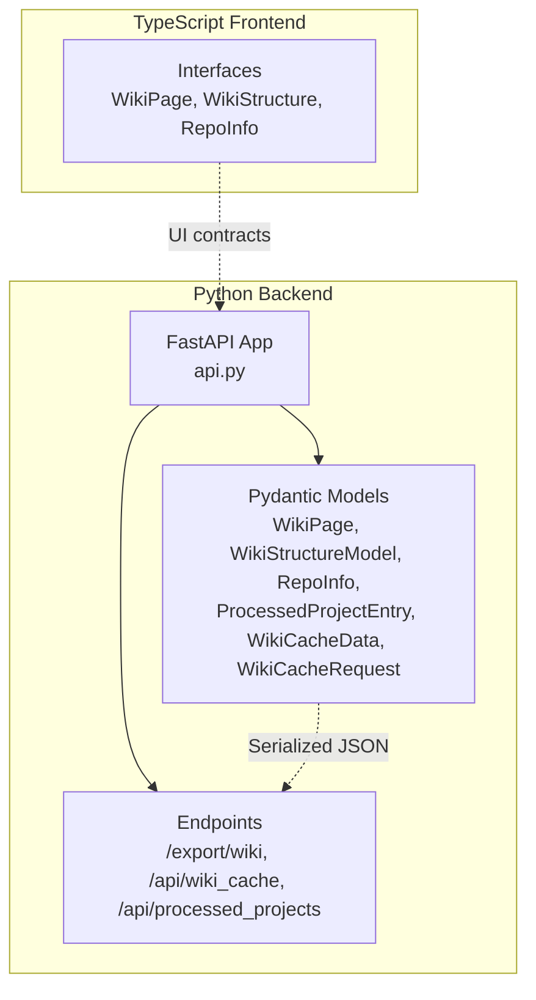
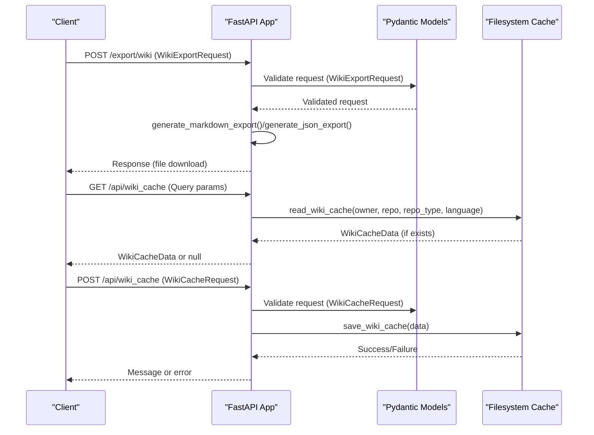
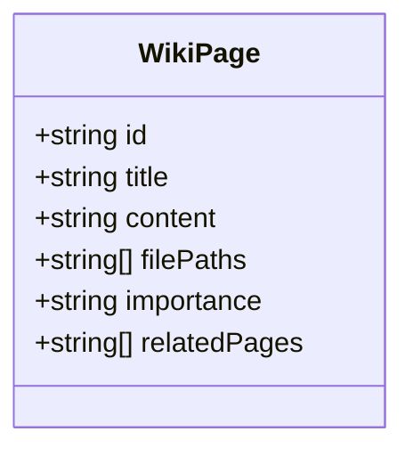
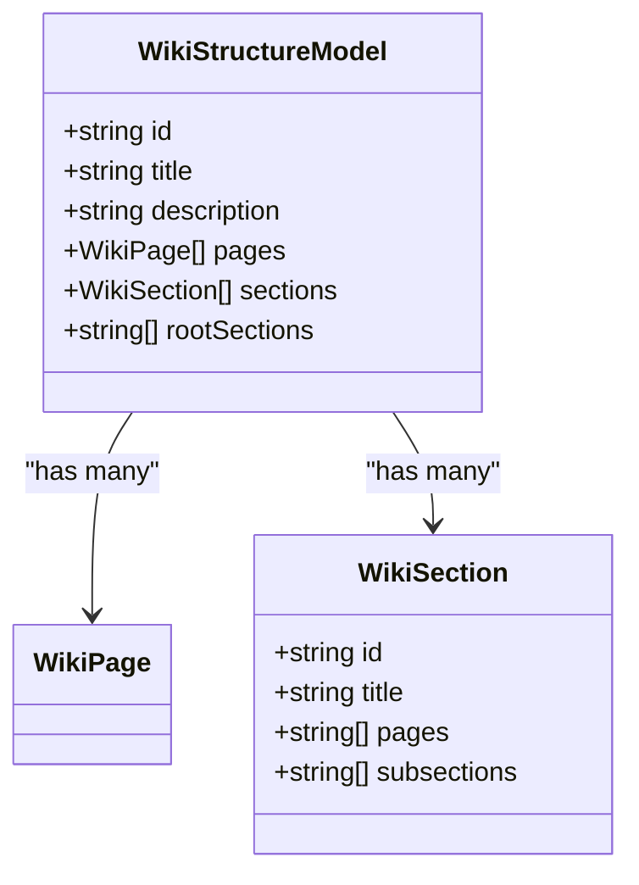
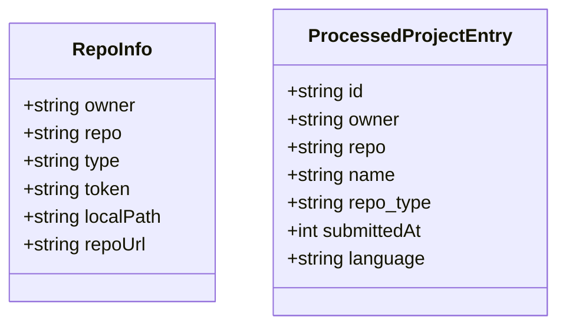
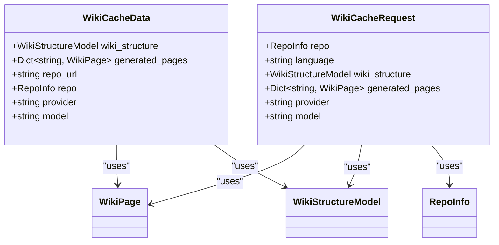
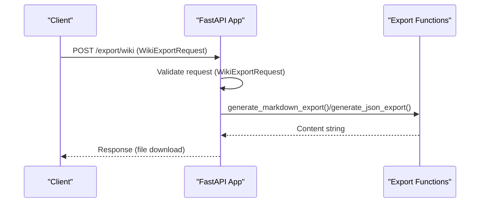
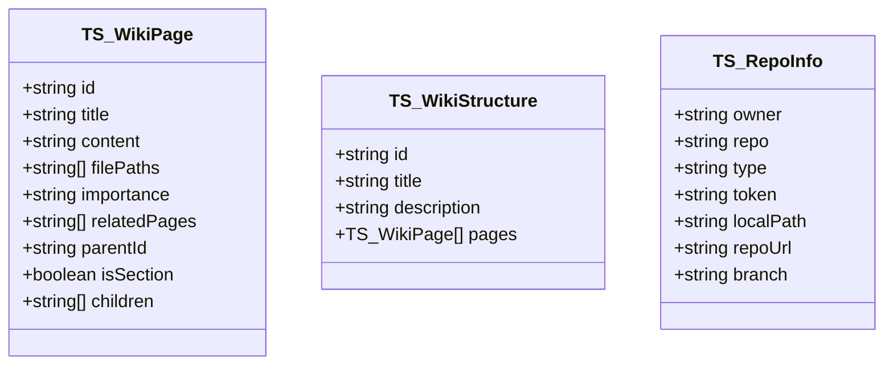
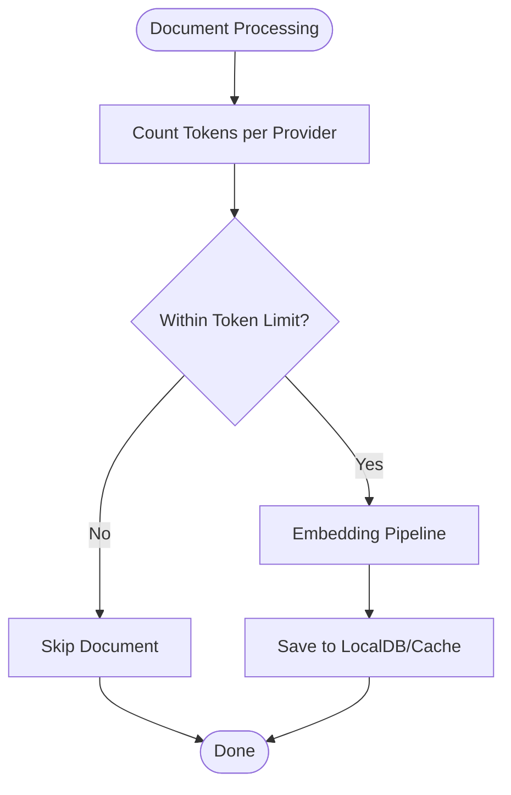
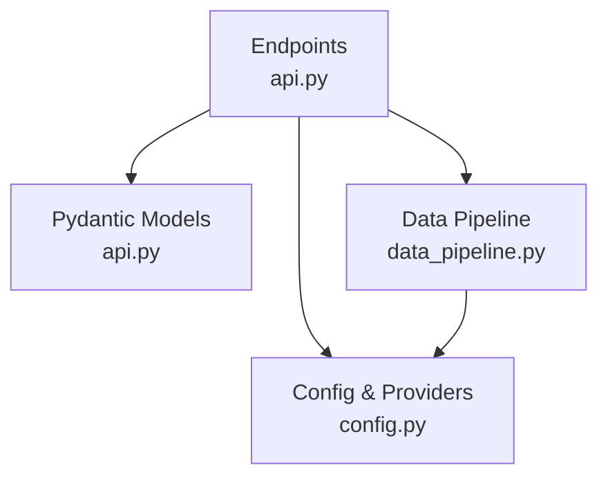

# Data Models and Schemas

<cite>
**Referenced Files in This Document**
- [api.py](file://api/api.py)
- [simple_chat.py](file://api/simple_chat.py)
- [websocket_wiki.py](file://api/websocket_wiki.py)
- [data_pipeline.py](file://api/data_pipeline.py)
- [config.py](file://api/config.py)
- [wikipage.tsx](file://src/types/wiki/wikipage.tsx)
- [wikistructure.tsx](file://src/types/wiki/wikistructure.tsx)
- [repoinfo.tsx](file://src/types/repoinfo.tsx)
- [repo_wiki_gen.py](file://api/repo_wiki_gen.py)
</cite>

## Table of Contents
1. [Introduction](#introduction)
2. [Project Structure](#project-structure)
3. [Core Components](#core-components)
4. [Architecture Overview](#architecture-overview)
5. [Detailed Component Analysis](#detailed-component-analysis)
6. [Dependency Analysis](#dependency-analysis)
7. [Performance Considerations](#performance-considerations)
8. [Troubleshooting Guide](#troubleshooting-guide)
9. [Conclusion](#conclusion)

## Introduction
This document describes the data models and schemas system in the project, focusing on Pydantic model definitions and validation patterns used across the backend API. It covers the core models WikiPage, WikiStructureModel, RepoInfo, ProcessedProjectEntry, and related supporting models. It explains inheritance patterns, field validation rules, optional field handling, serialization strategies, and schema evolution approaches. Practical examples show how models are used in endpoints, request/response validation, and data transformation patterns. Performance considerations for large data structures, memory optimization techniques, and robust error handling are also addressed.

## Project Structure
The data modeling system spans both the Python backend and TypeScript frontend:
- Python backend: Pydantic models define request/response schemas and cache structures for FastAPI endpoints.
- TypeScript frontend: Type interfaces define UI-level data contracts for wiki pages, structures, and repository info.

**Diagram sources**
- [api.py](file://api/api.py#L39-L111)
- [wikipage.tsx](file://src/types/wiki/wikipage.tsx#L1-L13)
- [wikistructure.tsx](file://src/types/wiki/wikistructure.tsx#L1-L11)
- [repoinfo.tsx](file://src/types/repoinfo.tsx#L1-L11)

**Section sources**
- [api.py](file://api/api.py#L1-L635)
- [wikipage.tsx](file://src/types/wiki/wikipage.tsx#L1-L13)
- [wikistructure.tsx](file://src/types/wiki/wikistructure.tsx#L1-L11)
- [repoinfo.tsx](file://src/types/repoinfo.tsx#L1-L11)

## Core Components
This section documents the primary Pydantic models and their roles in the system.

- WikiPage
  - Purpose: Represents a single wiki page with metadata, content, and relationships.
  - Fields: id, title, content, filePaths (List[str]), importance (string), relatedPages (List[str]).
  - Validation: Uses typed fields; optional fields are not present in this model definition.
  - Serialization: model_dump() and model_dump_json() are used for export and caching.

- WikiStructureModel
  - Purpose: Encapsulates the overall wiki structure including pages, optional sections, and root sections.
  - Fields: id, title, description, pages (List[WikiPage]), sections (Optional[List[WikiSection]]), rootSections (Optional[List[str]]).
  - Validation: Enforces list and optional semantics via typing; sections and rootSections are nullable.

- RepoInfo
  - Purpose: Holds repository identification and access parameters.
  - Fields: owner, repo, type, token (Optional[str]=None), localPath (Optional[str]=None), repoUrl (Optional[str]=None).
  - Validation: Optional fields default to None; used for authentication and repository targeting.

- ProcessedProjectEntry
  - Purpose: Describes processed project entries discovered in the cache directory.
  - Fields: id (filename), owner, repo, name (owner/repo), repo_type (renamed from type), submittedAt (int timestamp), language.
  - Validation: Strongly typed fields; used by the /api/processed_projects endpoint.

- Supporting Models
  - WikiSection: Represents a section within the wiki structure with pages and optional subsections.
  - WikiCacheData: Serialized cache payload combining wiki structure, generated pages, and optional metadata.
  - WikiCacheRequest: Request body for saving wiki cache.
  - WikiExportRequest: Request body for exporting wiki content in markdown or JSON.

These models are used across endpoints for validation, serialization, and cache management.

**Section sources**
- [api.py](file://api/api.py#L39-L111)
- [api.py](file://api/api.py#L227-L391)
- [api.py](file://api/api.py#L413-L502)
- [api.py](file://api/api.py#L576-L634)

## Architecture Overview
The data models integrate with FastAPI endpoints to validate incoming requests, serialize responses, and manage server-side caches. The flow below illustrates how models are used in key endpoints.

**Diagram sources**
- [api.py](file://api/api.py#L227-L391)
- [api.py](file://api/api.py#L413-L502)
- [api.py](file://api/api.py#L461-L502)

## Detailed Component Analysis

### WikiPage Model
- Definition and usage
  - Defined as a Pydantic BaseModel with typed fields.
  - Used in WikiStructureModel.pages and export endpoints.
- Validation rules
  - Enforced by Pydantic type hints; lists and strings validated automatically.
- Serialization
  - model_dump() used for JSON export; model_dump_json() used for cache payload serialization.

**Diagram sources**
- [api.py](file://api/api.py#L39-L50)

**Section sources**
- [api.py](file://api/api.py#L39-L50)
- [api.py](file://api/api.py#L322-L391)

### WikiStructureModel and WikiSection
- WikiStructureModel
  - Contains pages (List[WikiPage]) and optional sections/rootSections.
  - Used as the core structure for wiki exports and cache storage.
- WikiSection
  - Represents hierarchical sections with pages and optional subsections.

**Diagram sources**
- [api.py](file://api/api.py#L69-L88)

**Section sources**
- [api.py](file://api/api.py#L69-L88)

### RepoInfo and ProcessedProjectEntry
- RepoInfo
  - Optional fields token, localPath, repoUrl enable flexible repository targeting.
- ProcessedProjectEntry
  - Derived from cache filenames; used to list processed projects.

**Diagram sources**
- [api.py](file://api/api.py#L60-L67)
- [api.py](file://api/api.py#L51-L59)

**Section sources**
- [api.py](file://api/api.py#L60-L67)
- [api.py](file://api/api.py#L51-L59)
- [api.py](file://api/api.py#L576-L634)

### WikiCacheData and WikiCacheRequest
- WikiCacheData
  - Aggregates wiki_structure, generated_pages, and optional metadata (repo_url, repo, provider, model).
  - Compatible with older cache formats via optional fields.
- WikiCacheRequest
  - Request body for storing wiki cache; includes RepoInfo, language, WikiStructureModel, generated_pages, provider, model.

**Diagram sources**
- [api.py](file://api/api.py#L89-L111)

**Section sources**
- [api.py](file://api/api.py#L89-L111)

### WikiExportRequest
- Validates export requests with repo_url, pages (List[WikiPage]), and format (Literal["markdown","json"]).
- Used by the /export/wiki endpoint to generate downloadable content.

**Diagram sources**
- [api.py](file://api/api.py#L112-L119)
- [api.py](file://api/api.py#L227-L391)

**Section sources**
- [api.py](file://api/api.py#L112-L119)
- [api.py](file://api/api.py#L227-L391)

### Frontend Types (TypeScript)
While not Pydantic models, the frontend TypeScript interfaces mirror core data structures for UI rendering and type safety.

- WikiPage (TypeScript)
  - Adds optional fields parentId, isSection, children for hierarchical UI rendering.
- WikiStructure (TypeScript)
  - Composed of id, title, description, and pages (WikiPage[]).
- RepoInfo (TypeScript)
  - Mirrors RepoInfo with optional branch parameter.

**Diagram sources**
- [wikipage.tsx](file://src/types/wiki/wikipage.tsx#L1-L13)
- [wikistructure.tsx](file://src/types/wiki/wikistructure.tsx#L1-L11)
- [repoinfo.tsx](file://src/types/repoinfo.tsx#L1-L11)

**Section sources**
- [wikipage.tsx](file://src/types/wiki/wikipage.tsx#L1-L13)
- [wikistructure.tsx](file://src/types/wiki/wikistructure.tsx#L1-L11)
- [repoinfo.tsx](file://src/types/repoinfo.tsx#L1-L11)

### Data Pipeline and Token Limits
- Token counting and provider-specific limits are handled in data_pipeline.py.
- These utilities inform validation and filtering of large documents before embedding and caching.

**Diagram sources**
- [data_pipeline.py](file://api/data_pipeline.py#L61-L102)
- [data_pipeline.py](file://api/data_pipeline.py#L408-L476)

**Section sources**
- [data_pipeline.py](file://api/data_pipeline.py#L61-L102)
- [data_pipeline.py](file://api/data_pipeline.py#L408-L476)

## Dependency Analysis
The models are consumed by FastAPI endpoints and utilities. The following diagram shows key dependencies.

**Diagram sources**
- [api.py](file://api/api.py#L1-L635)
- [data_pipeline.py](file://api/data_pipeline.py#L1-L917)
- [config.py](file://api/config.py#L1-L464)

**Section sources**
- [api.py](file://api/api.py#L1-L635)
- [data_pipeline.py](file://api/data_pipeline.py#L1-L917)
- [config.py](file://api/config.py#L1-L464)

## Performance Considerations
- Large data structures
  - model_dump_json() and model_dump() are used for serialization; for very large caches, consider streaming or chunked writes to reduce peak memory usage.
- Memory optimization
  - Prefer lazy loading of generated_pages and selective serialization of fields when possible.
  - Use pagination or filtering in endpoints that return large lists (e.g., /api/processed_projects).
- Validation overhead
  - Pydantic validation is efficient; keep models minimal and avoid redundant validations in application logic.
- Token limits
  - Use count_tokens() and provider-specific limits to skip oversized documents early in the pipeline.

[No sources needed since this section provides general guidance]

## Troubleshooting Guide
- Validation errors
  - FastAPI raises HTTP 422 Unprocessable Entity for invalid request bodies; ensure fields match model definitions (types, presence, and optionality).
- Cache read/write failures
  - Errors during read_wiki_cache/save_wiki_cache are logged and surfaced as HTTP 500; verify cache directory permissions and disk availability.
- Language validation
  - Endpoints validate language against supported languages; mismatch defaults to a configured default.
- Token limit errors
  - If embedding or model calls exceed token limits, adjust filters or reduce input size.

**Section sources**
- [api.py](file://api/api.py#L413-L502)
- [api.py](file://api/api.py#L461-L502)
- [api.py](file://api/api.py#L471-L495)

## Schema Evolution and Backward Compatibility
- Optional fields
  - Many fields are optional (e.g., RepoInfo token/localPath/repoUrl; WikiStructureModel sections/rootSections; WikiCacheData optional metadata). This enables additive schema evolution without breaking existing clients.
- Aliasing and renames
  - repo_type is used instead of type in ProcessedProjectEntry to avoid conflicts; maintain compatibility by mapping fields appropriately in serializers.
- Cache compatibility
  - WikiCacheData includes optional fields to remain compatible with older cache formats; new fields can be added safely.
- Migration strategies
  - Introduce new optional fields and default values; deprecate old fields gradually; provide conversion helpers to map legacy cache entries to new structures.
  - For export formats, maintain backward-compatible JSON shapes while adding new keys as needed.

**Section sources**
- [api.py](file://api/api.py#L60-L67)
- [api.py](file://api/api.py#L89-L99)
- [api.py](file://api/api.py#L51-L59)

## Practical Usage Examples
- Endpoints and request/response validation
  - /export/wiki validates WikiExportRequest and returns a downloadable file.
  - /api/wiki_cache GET/POST validate WikiCacheRequest and return WikiCacheData.
  - /api/processed_projects returns List[ProcessedProjectEntry].
- Data transformation patterns
  - model_dump() converts models to dictionaries for JSON export.
  - model_dump_json() serializes models for cache payloads.
- Extending models and validation rules
  - Add new optional fields to existing models to preserve backward compatibility.
  - For stricter validation, introduce custom validators or field constraints in Pydantic models.
- Maintaining data integrity
  - Use typed fields and Optional defaults to prevent runtime errors.
  - Centralize validation in Pydantic models to ensure consistent enforcement across endpoints.

**Section sources**
- [api.py](file://api/api.py#L227-L391)
- [api.py](file://api/api.py#L413-L502)
- [api.py](file://api/api.py#L576-L634)

## Conclusion
The project’s data modeling system leverages Pydantic to enforce strong validation, enable clear serialization, and support schema evolution. Core models like WikiPage, WikiStructureModel, RepoInfo, and ProcessedProjectEntry form the backbone of API endpoints and cache management. Optional fields and backward-compatible designs facilitate smooth migrations. By combining Pydantic validation with careful serialization and token-aware processing, the system remains robust and scalable for large datasets.