# FastAPI Application Structure

<cite>
**Referenced Files in This Document**
- [api/main.py](file://api/main.py)
- [api/api.py](file://api/api.py)
- [api/logging_config.py](file://api/logging_config.py)
- [api/config.py](file://api/config.py)
- [api/simple_chat.py](file://api/simple_chat.py)
- [api/websocket_wiki.py](file://api/websocket_wiki.py)
- [api/data_pipeline.py](file://api/data_pipeline.py)
- [api/rag.py](file://api/rag.py)
- [api/repo_wiki_gen.py](file://api/repo_wiki_gen.py)
- [api/cli.py](file://api/cli.py)
</cite>

## Table of Contents
1. [Introduction](#introduction)
2. [Project Structure](#project-structure)
3. [Core Components](#core-components)
4. [Architecture Overview](#architecture-overview)
5. [Detailed Component Analysis](#detailed-component-analysis)
6. [Dependency Analysis](#dependency-analysis)
7. [Performance Considerations](#performance-considerations)
8. [Troubleshooting Guide](#troubleshooting-guide)
9. [Conclusion](#conclusion)

## Introduction
This document explains the FastAPI application structure for the Streaming API service. It covers application initialization, middleware configuration (especially CORS), logging setup, global error handling, application lifecycle, routing organization, request/response flow, authentication and authorization, and performance optimization strategies. It also provides guidance on extending the application with new endpoints while maintaining backward compatibility.

## Project Structure
The API is organized around a central FastAPI application instance with modular routing and shared configuration. Key elements:
- Central application initialization and routing live in the main API module.
- Logging and environment configuration are centralized.
- Providers and model configuration are loaded from JSON-based configuration files.
- RAG and data pipeline utilities support chat and wiki generation.
- WebSocket and HTTP streaming endpoints provide real-time capabilities.
- CLI tools complement the API for offline operations.

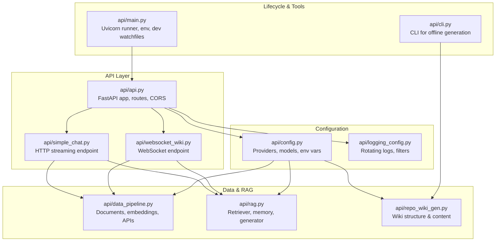

**Diagram sources**
- [api/api.py](file://api/api.py#L20-L635)
- [api/simple_chat.py](file://api/simple_chat.py#L76-L800)
- [api/websocket_wiki.py](file://api/websocket_wiki.py#L53-L978)
- [api/config.py](file://api/config.py#L1-L464)
- [api/logging_config.py](file://api/logging_config.py#L1-L86)
- [api/data_pipeline.py](file://api/data_pipeline.py#L1-L917)
- [api/rag.py](file://api/rag.py#L1-L446)
- [api/repo_wiki_gen.py](file://api/repo_wiki_gen.py#L1-L550)
- [api/main.py](file://api/main.py#L1-L104)
- [api/cli.py](file://api/cli.py#L1-L384)

**Section sources**
- [api/api.py](file://api/api.py#L20-L635)
- [api/main.py](file://api/main.py#L1-L104)

## Core Components
- FastAPI application instance with CORS enabled and logging initialized.
- Centralized configuration loader for providers, models, and environment variables.
- Data pipeline utilities for document ingestion, token counting, and repository API access.
- RAG component with memory and retriever for contextual chat.
- Wiki generation orchestration for structure and content creation.
- HTTP streaming and WebSocket endpoints for chat completions.
- CLI for offline repository processing and wiki generation.

Key implementation highlights:
- Application instantiation and CORS configuration in the main API module.
- Logging configuration with rotating file handler and filters.
- Provider/model configuration loading and environment variable substitution.
- RAG memory and retriever setup with FAISS-backed retrieval.
- Wiki structure and content generation via templated prompts and XML parsing.

**Section sources**
- [api/api.py](file://api/api.py#L20-L635)
- [api/logging_config.py](file://api/logging_config.py#L12-L86)
- [api/config.py](file://api/config.py#L1-L464)
- [api/data_pipeline.py](file://api/data_pipeline.py#L1-L917)
- [api/rag.py](file://api/rag.py#L1-L446)
- [api/repo_wiki_gen.py](file://api/repo_wiki_gen.py#L1-L550)

## Architecture Overview
The application follows a layered architecture:
- Presentation layer: FastAPI routes for HTTP and WebSocket.
- Service layer: Chat streaming and wiki generation logic.
- Data layer: Document ingestion, embeddings, and FAISS retrieval.
- Configuration layer: Provider/model configuration and environment variables.
- Infrastructure: Uvicorn server, logging, and development hot-reload.

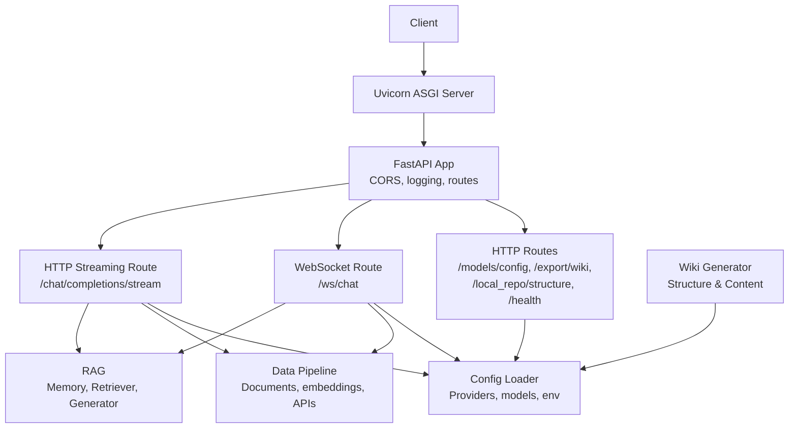

**Diagram sources**
- [api/api.py](file://api/api.py#L20-L635)
- [api/simple_chat.py](file://api/simple_chat.py#L76-L800)
- [api/websocket_wiki.py](file://api/websocket_wiki.py#L53-L978)
- [api/config.py](file://api/config.py#L1-L464)
- [api/data_pipeline.py](file://api/data_pipeline.py#L1-L917)
- [api/rag.py](file://api/rag.py#L1-L446)
- [api/repo_wiki_gen.py](file://api/repo_wiki_gen.py#L1-L550)

## Detailed Component Analysis

### Application Initialization and Lifecycle
- Environment loading and proxy/timeout patches are applied early to ensure downstream libraries initialize correctly.
- Logging is configured before application startup.
- Development mode enables hot-reloading and a patched file watcher excluding logs and bytecode.
- Uvicorn runs the application with configurable port and reload behavior.

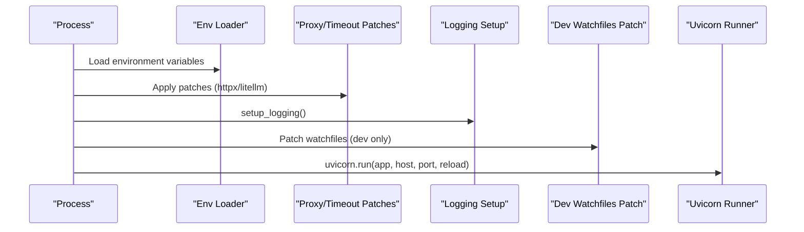

**Diagram sources**
- [api/main.py](file://api/main.py#L1-L104)
- [api/logging_config.py](file://api/logging_config.py#L12-L86)

**Section sources**
- [api/main.py](file://api/main.py#L1-L104)

### Middleware Configuration (CORS)
- CORS middleware is configured to allow all origins, methods, and headers.
- This simplifies cross-origin access for browser-based clients and tooling.

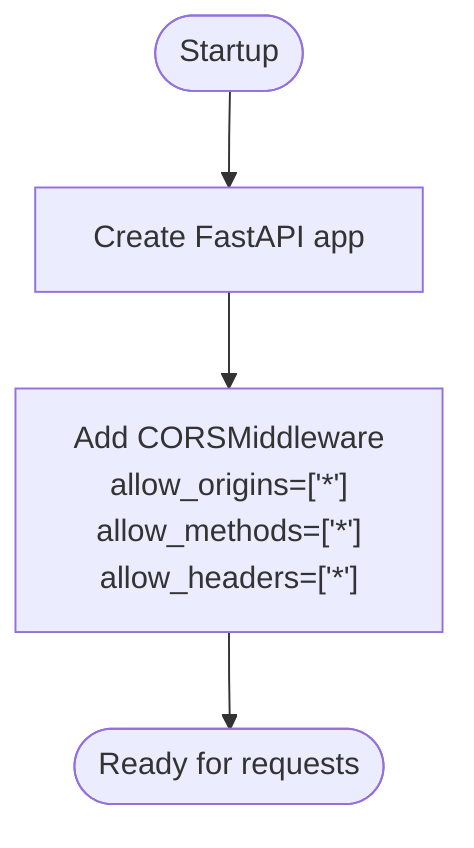

**Diagram sources**
- [api/api.py](file://api/api.py#L21-L34)

**Section sources**
- [api/api.py](file://api/api.py#L21-L34)

### Logging Configuration
- Rotating file handler with configurable max size and backup count.
- Console handler for standard output.
- Filter to suppress noisy file-change logs.
- Environment-driven log level and file path validation to prevent path traversal.

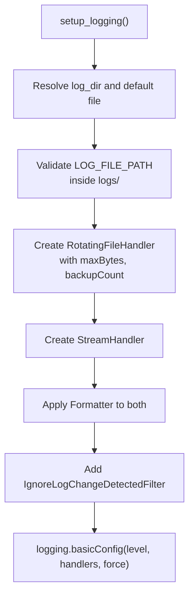

**Diagram sources**
- [api/logging_config.py](file://api/logging_config.py#L12-L86)

**Section sources**
- [api/logging_config.py](file://api/logging_config.py#L12-L86)

### Global Error Handling and Health Checks
- Health endpoint returns service status and timestamp.
- Root endpoint lists available routes grouped by first path segment.
- Many endpoints return structured JSON responses or raise HTTPException with explicit status codes.

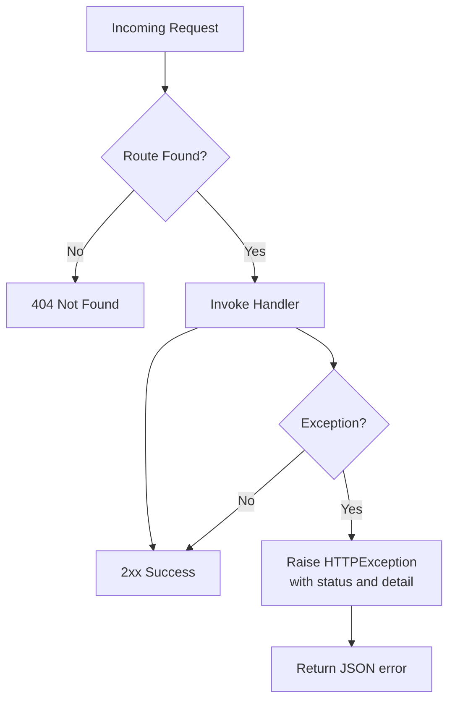

**Diagram sources**
- [api/api.py](file://api/api.py#L540-L575)

**Section sources**
- [api/api.py](file://api/api.py#L540-L575)

### Routing Organization
Endpoints are grouped by functional area:
- Authentication and authorization:
  - GET /auth/status
  - POST /auth/validate
- Model configuration:
  - GET /models/config
- Wiki cache management:
  - GET /api/wiki_cache
  - POST /api/wiki_cache
  - DELETE /api/wiki_cache
- Export:
  - POST /export/wiki
- Local repository:
  - GET /local_repo/structure
- Chat streaming:
  - POST /chat/completions/stream
- WebSocket chat:
  - WS /ws/chat
- Health and root:
  - GET /health
  - GET /

Routing is implemented via decorator-based registration and dynamic route addition for streaming and WebSocket.

**Section sources**
- [api/api.py](file://api/api.py#L149-L635)

### Request/Response Flow: Chat Streaming and WebSocket
- Both HTTP streaming and WebSocket endpoints:
  - Validate request shape and parameters.
  - Prepare RAG retriever with optional custom filters.
  - Build conversation history and system prompt.
  - Retrieve context via FAISS retriever when appropriate.
  - Select provider/model and stream responses.
  - Handle token limit fallbacks and error propagation.

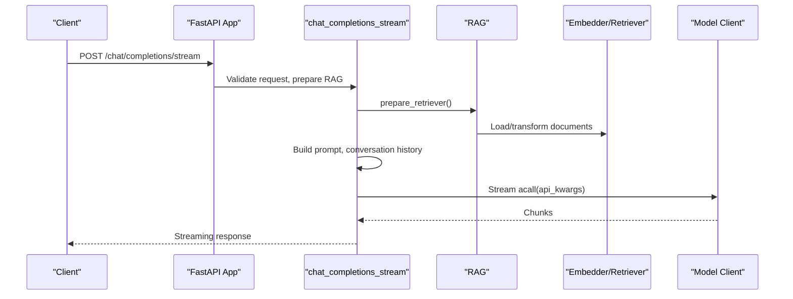

**Diagram sources**
- [api/api.py](file://api/api.py#L394-L401)
- [api/simple_chat.py](file://api/simple_chat.py#L76-L800)
- [api/rag.py](file://api/rag.py#L345-L446)
- [api/data_pipeline.py](file://api/data_pipeline.py#L1-L917)

**Section sources**
- [api/simple_chat.py](file://api/simple_chat.py#L76-L800)
- [api/websocket_wiki.py](file://api/websocket_wiki.py#L53-L978)
- [api/rag.py](file://api/rag.py#L1-L446)

### Authentication and Authorization
- Authentication status endpoint indicates whether wiki access requires an authorization code.
- Validation endpoint compares submitted code with configured code.
- Wiki cache deletion optionally requires authorization code when enabled.

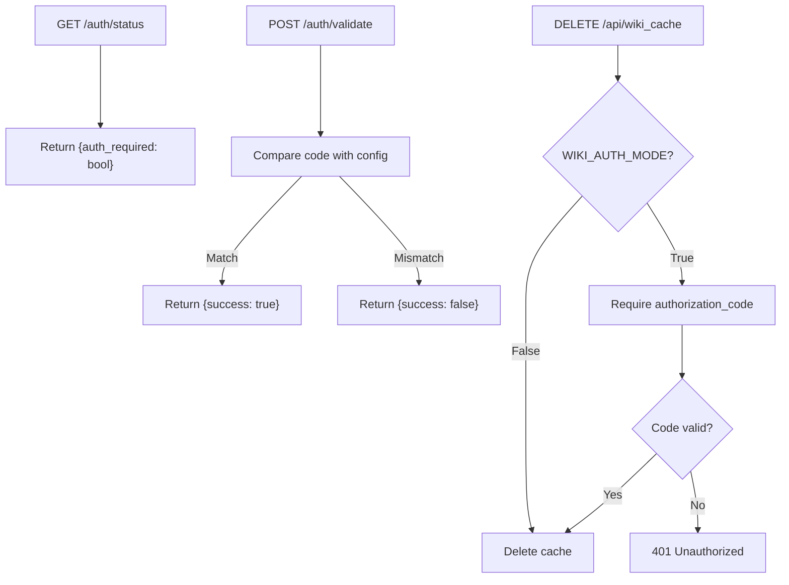

**Diagram sources**
- [api/api.py](file://api/api.py#L153-L166)
- [api/api.py](file://api/api.py#L504-L539)
- [api/config.py](file://api/config.py#L49-L53)

**Section sources**
- [api/api.py](file://api/api.py#L153-L166)
- [api/api.py](file://api/api.py#L504-L539)
- [api/config.py](file://api/config.py#L49-L53)

### Wiki Cache Management
- Read, write, and delete operations for cached wiki data.
- Language validation ensures consistent cache keys.
- Authorization enforced for deletion when enabled.

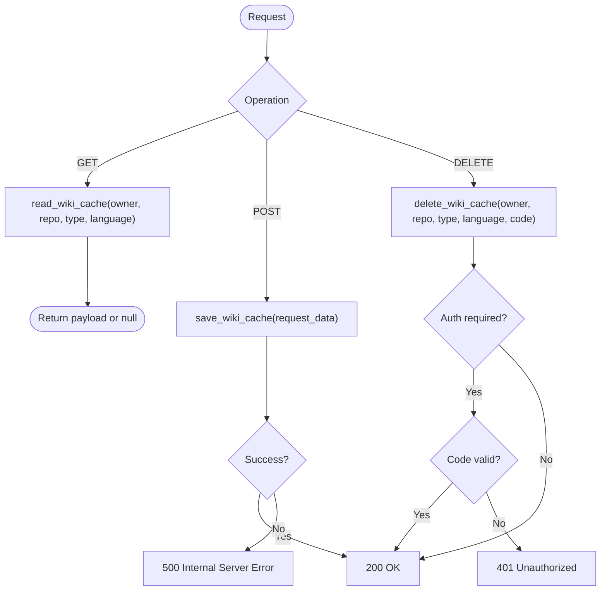

**Diagram sources**
- [api/api.py](file://api/api.py#L413-L458)
- [api/api.py](file://api/api.py#L486-L503)
- [api/api.py](file://api/api.py#L504-L539)

**Section sources**
- [api/api.py](file://api/api.py#L413-L458)
- [api/api.py](file://api/api.py#L486-L503)
- [api/api.py](file://api/api.py#L504-L539)

### Model Configuration and Provider Selection
- Provider and model configuration loaded from JSON files.
- Environment variable substitution for placeholders.
- Dynamic model client selection and parameter shaping per provider.

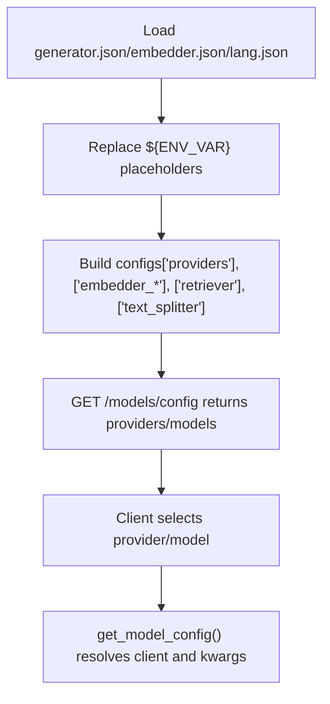

**Diagram sources**
- [api/config.py](file://api/config.py#L104-L168)
- [api/config.py](file://api/config.py#L381-L464)
- [api/api.py](file://api/api.py#L167-L226)

**Section sources**
- [api/config.py](file://api/config.py#L104-L168)
- [api/config.py](file://api/config.py#L381-L464)
- [api/api.py](file://api/api.py#L167-L226)

### Data Pipeline and RAG
- Document ingestion with inclusion/exclusion filters and token limits.
- Embedding pipeline with provider-specific batching and Ollama single-document processing.
- FAISS retriever with validated embedding sizes.
- Memory component maintains conversation history.

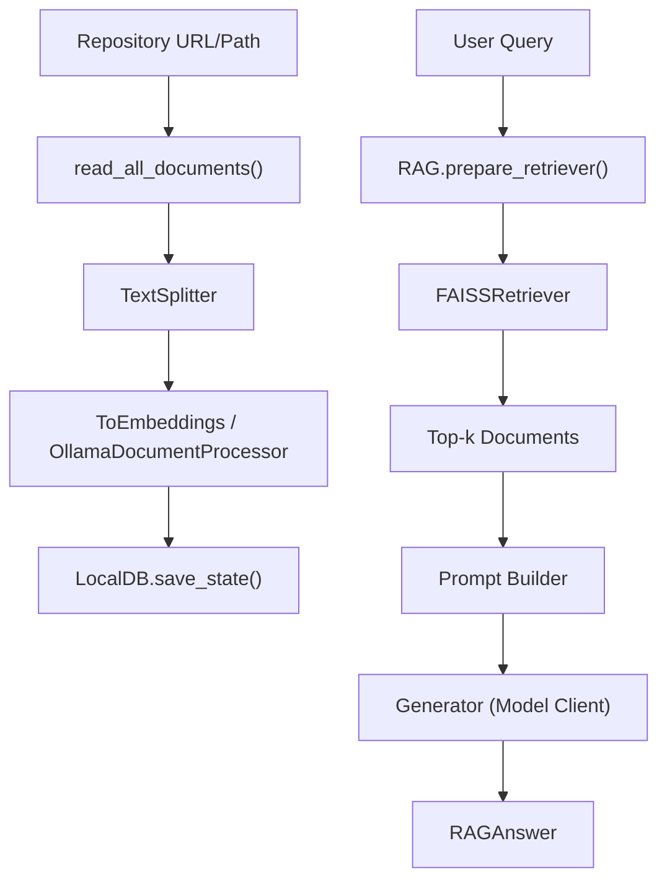

**Diagram sources**
- [api/data_pipeline.py](file://api/data_pipeline.py#L177-L407)
- [api/data_pipeline.py](file://api/data_pipeline.py#L408-L477)
- [api/rag.py](file://api/rag.py#L345-L446)

**Section sources**
- [api/data_pipeline.py](file://api/data_pipeline.py#L177-L407)
- [api/data_pipeline.py](file://api/data_pipeline.py#L408-L477)
- [api/rag.py](file://api/rag.py#L1-L446)

### Wiki Generation Orchestration
- Generates wiki structure XML via templated prompts.
- Parses XML into structured pages with relevance and relations.
- Produces page content using provider/model selection.

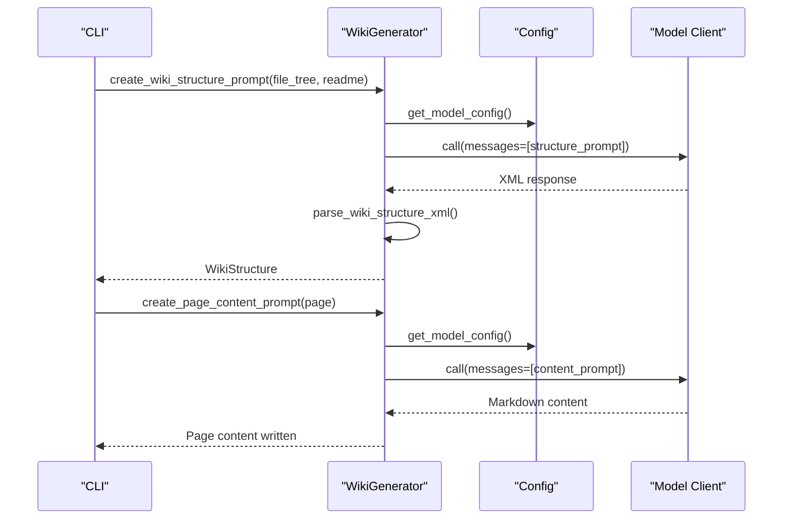

**Diagram sources**
- [api/repo_wiki_gen.py](file://api/repo_wiki_gen.py#L295-L417)
- [api/repo_wiki_gen.py](file://api/repo_wiki_gen.py#L419-L550)
- [api/config.py](file://api/config.py#L381-L464)

**Section sources**
- [api/repo_wiki_gen.py](file://api/repo_wiki_gen.py#L295-L417)
- [api/repo_wiki_gen.py](file://api/repo_wiki_gen.py#L419-L550)
- [api/config.py](file://api/config.py#L381-L464)

### CLI Tooling
- Offline repository processing and wiki generation.
- Supports multiple repository types and model providers.
- Writes generated markdown files and index.

**Section sources**
- [api/cli.py](file://api/cli.py#L1-L384)

## Dependency Analysis
High-level dependencies:
- api/api.py depends on logging_config, config, and endpoint modules.
- simple_chat.py and websocket_wiki.py depend on config, data_pipeline, rag, and provider clients.
- data_pipeline.py depends on config and external APIs for repository content.
- rag.py depends on data_pipeline and config.
- repo_wiki_gen.py depends on config and provider clients indirectly via config.

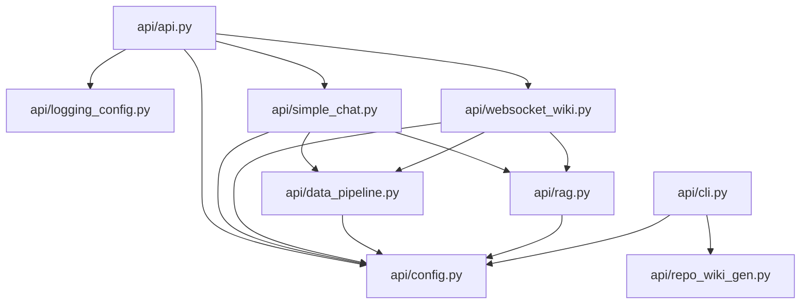

**Diagram sources**
- [api/api.py](file://api/api.py#L1-L635)
- [api/simple_chat.py](file://api/simple_chat.py#L1-L900)
- [api/websocket_wiki.py](file://api/websocket_wiki.py#L1-L978)
- [api/logging_config.py](file://api/logging_config.py#L1-L86)
- [api/config.py](file://api/config.py#L1-L464)
- [api/data_pipeline.py](file://api/data_pipeline.py#L1-L917)
- [api/rag.py](file://api/rag.py#L1-L446)
- [api/repo_wiki_gen.py](file://api/repo_wiki_gen.py#L1-L550)
- [api/cli.py](file://api/cli.py#L1-L384)

**Section sources**
- [api/api.py](file://api/api.py#L1-L635)
- [api/simple_chat.py](file://api/simple_chat.py#L1-L900)
- [api/websocket_wiki.py](file://api/websocket_wiki.py#L1-L978)
- [api/data_pipeline.py](file://api/data_pipeline.py#L1-L917)
- [api/rag.py](file://api/rag.py#L1-L446)
- [api/repo_wiki_gen.py](file://api/repo_wiki_gen.py#L1-L550)
- [api/config.py](file://api/config.py#L1-L464)
- [api/logging_config.py](file://api/logging_config.py#L1-L86)
- [api/cli.py](file://api/cli.py#L1-L384)

## Performance Considerations
- Token counting and provider-specific limits reduce oversized requests.
- FAISS retriever with validated embedding sizes improves retrieval quality and speed.
- Batched embeddings for non-Ollama providers reduce API overhead.
- Streaming responses minimize latency and memory footprint.
- Development hot-reload excludes logs and bytecode to reduce unnecessary restarts.

[No sources needed since this section provides general guidance]

## Troubleshooting Guide
Common issues and resolutions:
- Missing environment variables:
  - Required: GOOGLE_API_KEY, OPENAI_API_KEY
  - Optional: GITHUB_TOKEN, OPENROUTER_API_KEY, IFLOW_API_KEY, AWS_ACCESS_KEY_ID/SECRET_ACCESS_KEY
  - The application logs warnings and continues with reduced functionality.
- Embedding size mismatches:
  - The RAG component validates and filters documents to consistent embedding sizes.
  - Errors indicate inconsistent embeddings; regenerate embeddings or adjust preprocessing.
- Token limit exceeded:
  - The system retries without context when input exceeds limits.
- CORS issues:
  - All origins/methods/headers are allowed by default; verify client-side usage.
- Wiki cache deletion authorization:
  - Requires valid authorization code when wiki auth mode is enabled.

**Section sources**
- [api/main.py](file://api/main.py#L60-L86)
- [api/rag.py](file://api/rag.py#L251-L344)
- [api/simple_chat.py](file://api/simple_chat.py#L661-L735)
- [api/api.py](file://api/api.py#L520-L539)

## Conclusion
The FastAPI application is structured for modularity, scalability, and maintainability. Centralized configuration and logging, robust RAG and data pipeline utilities, and clear endpoint organization enable efficient development and deployment. Security is addressed through configurable authorization and broad CORS defaults suitable for development. Extending the application involves adding new routes, integrating provider clients, and leveraging the existing configuration and logging infrastructure while preserving backward compatibility.