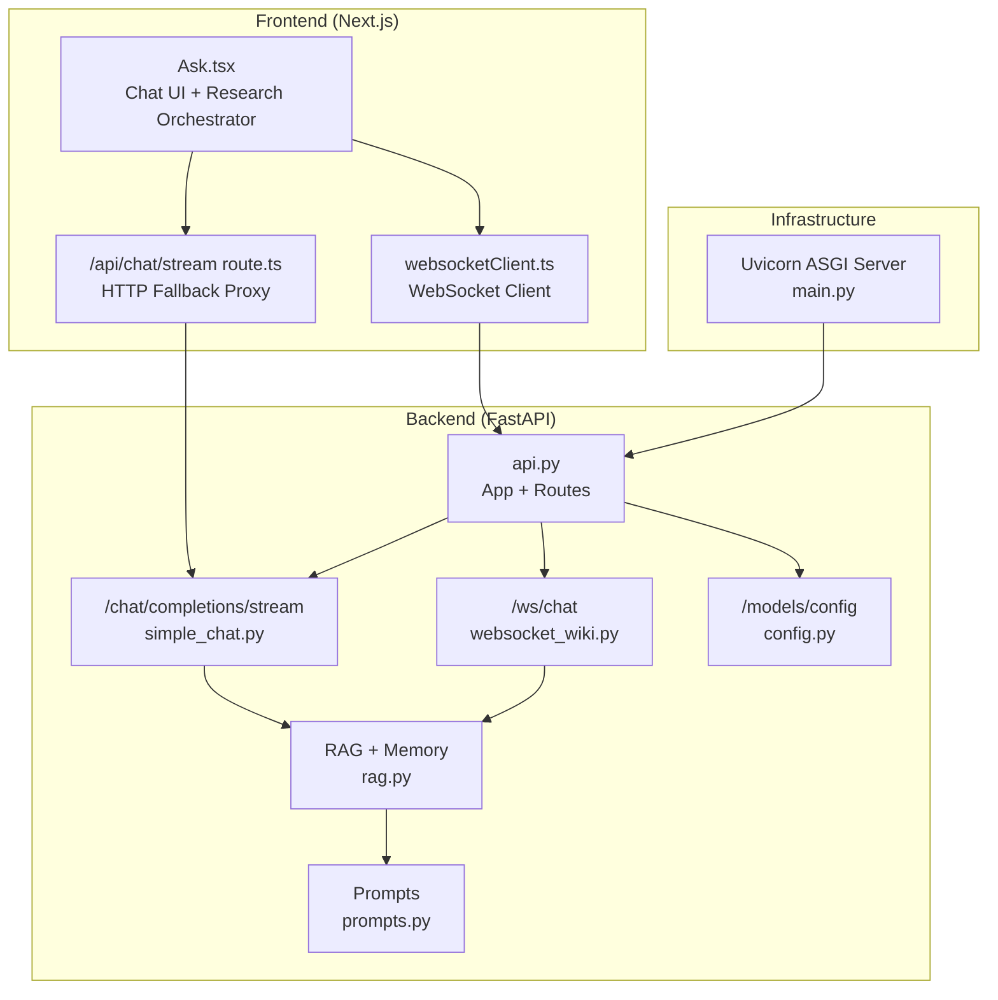
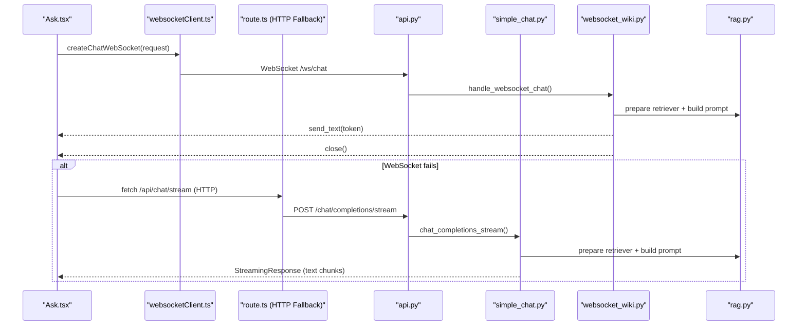
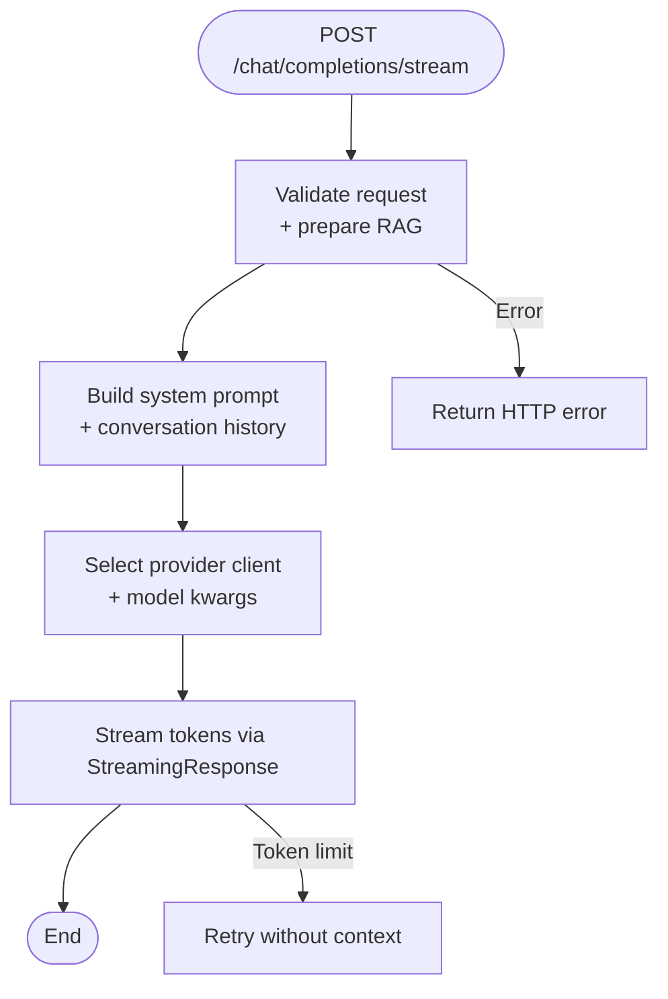
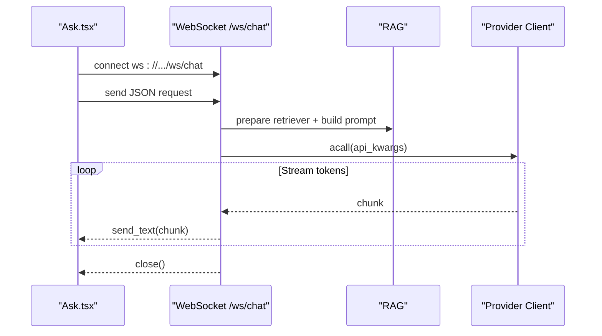
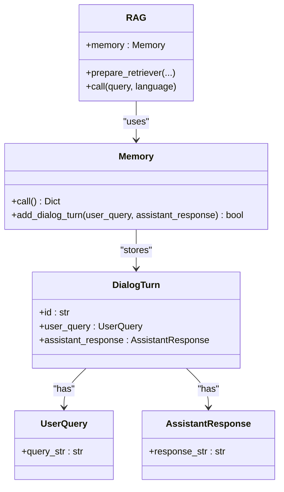
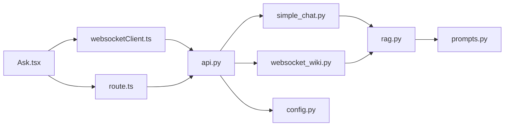

# Streaming Chat System

<cite>
**Referenced Files in This Document**
- [api/main.py](file://api/main.py)
- [api/api.py](file://api/api.py)
- [api/simple_chat.py](file://api/simple_chat.py)
- [api/websocket_wiki.py](file://api/websocket_wiki.py)
- [src/app/api/chat/stream/route.ts](file://src/app/api/chat/stream/route.ts)
- [src/utils/websocketClient.ts](file://src/utils/websocketClient.ts)
- [src/components/Ask.tsx](file://src/components/Ask.tsx)
- [api/rag.py](file://api/rag.py)
- [api/config.py](file://api/config.py)
- [api/prompts.py](file://api/prompts.py)
- [api/README.md](file://api/README.md)
- [README.md](file://README.md)
</cite>

## Table of Contents
1. [Introduction](#introduction)
2. [Project Structure](#project-structure)
3. [Core Components](#core-components)
4. [Architecture Overview](#architecture-overview)
5. [Detailed Component Analysis](#detailed-component-analysis)
6. [Dependency Analysis](#dependency-analysis)
7. [Performance Considerations](#performance-considerations)
8. [Troubleshooting Guide](#troubleshooting-guide)
9. [Conclusion](#conclusion)
10. [Appendices](#appendices)

## Introduction
This document explains the streaming chat system that powers real-time, repository-aware conversations using FastAPI’s streaming capabilities and WebSocket connections. It covers the chat completion flow, token streaming patterns, connection lifecycle management, message serialization formats, event-driven architecture, and real-time response generation. It also provides guidance on session management, conversation history handling, multi-user coordination patterns, performance tuning, memory management for long-running sessions, error recovery strategies, and practical extension examples.

## Project Structure
The streaming chat system spans backend FastAPI endpoints and a Next.js frontend:
- Backend FastAPI app exposes:
  - HTTP streaming endpoint for chat completions
  - WebSocket endpoint for real-time chat
  - Model configuration endpoint
- Frontend Next.js app provides:
  - WebSocket client for real-time streaming
  - Fallback HTTP streaming proxy
  - UI for chat interactions and research orchestration

**Diagram sources**
- [api/api.py](file://api/api.py#L393-L401)
- [api/simple_chat.py](file://api/simple_chat.py#L76-L660)
- [api/websocket_wiki.py](file://api/websocket_wiki.py#L53-L780)
- [src/app/api/chat/stream/route.ts](file://src/app/api/chat/stream/route.ts#L9-L88)
- [src/utils/websocketClient.ts](file://src/utils/websocketClient.ts#L43-L75)
- [api/main.py](file://api/main.py#L87-L104)

**Section sources**
- [api/README.md](file://api/README.md#L138-L163)
- [README.md](file://README.md#L654-L678)

## Core Components
- FastAPI Application and Routing
  - Registers HTTP streaming and WebSocket endpoints
  - Exposes model configuration endpoint
- Streaming Chat Implementation
  - HTTP streaming via FastAPI StreamingResponse
  - WebSocket streaming via FastAPI WebSocketRoute
- Conversation Management
  - RAG memory for conversation history
  - Prompt construction with system prompts and context
- Frontend Chat Client
  - WebSocket client for real-time streaming
  - Fallback HTTP streaming proxy
  - Research orchestration for multi-turn Deep Research

**Section sources**
- [api/api.py](file://api/api.py#L393-L401)
- [api/simple_chat.py](file://api/simple_chat.py#L76-L660)
- [api/websocket_wiki.py](file://api/websocket_wiki.py#L53-L780)
- [src/utils/websocketClient.ts](file://src/utils/websocketClient.ts#L43-L75)
- [src/app/api/chat/stream/route.ts](file://src/app/api/chat/stream/route.ts#L9-L88)
- [api/rag.py](file://api/rag.py#L51-L142)

## Architecture Overview
The system supports two primary interaction modes:
- HTTP Streaming: Server-sent events-style streaming from the backend
- WebSocket: Bidirectional real-time streaming with explicit connection lifecycle

**Diagram sources**
- [src/components/Ask.tsx](file://src/components/Ask.tsx#L578-L620)
- [src/utils/websocketClient.ts](file://src/utils/websocketClient.ts#L43-L75)
- [src/app/api/chat/stream/route.ts](file://src/app/api/chat/stream/route.ts#L9-L88)
- [api/api.py](file://api/api.py#L393-L401)
- [api/simple_chat.py](file://api/simple_chat.py#L76-L660)
- [api/websocket_wiki.py](file://api/websocket_wiki.py#L53-L780)
- [api/rag.py](file://api/rag.py#L153-L446)

## Detailed Component Analysis

### HTTP Streaming Chat Completion Flow
- Endpoint: POST /chat/completions/stream
- Request body: ChatCompletionRequest (repo_url, messages, filePath, token, type, provider, model, language, filters)
- Processing:
  - Validate and prepare RAG retriever
  - Build system prompt and conversation history
  - Select provider-specific model client and parameters
  - Stream response tokens via FastAPI StreamingResponse
- Error handling:
  - Token limit fallback: retry without context
  - Provider-specific error messages forwarded to client

**Diagram sources**
- [api/simple_chat.py](file://api/simple_chat.py#L76-L660)

**Section sources**
- [api/simple_chat.py](file://api/simple_chat.py#L76-L660)
- [api/README.md](file://api/README.md#L138-L163)

### WebSocket Chat Completion Flow
- Endpoint: WebSocket /ws/chat
- Lifecycle:
  - Accept connection
  - Receive JSON request
  - Validate and prepare RAG
  - Build prompt and select provider
  - Stream tokens via websocket.send_text()
  - Explicitly close connection on completion
- Error handling:
  - Send error messages via websocket.send_text()
  - Close connection on exceptions

**Diagram sources**
- [api/websocket_wiki.py](file://api/websocket_wiki.py#L53-L780)
- [src/utils/websocketClient.ts](file://src/utils/websocketClient.ts#L43-L75)

**Section sources**
- [api/websocket_wiki.py](file://api/websocket_wiki.py#L53-L780)
- [src/utils/websocketClient.ts](file://src/utils/websocketClient.ts#L43-L75)

### Conversation History and Session Management
- Memory component stores dialog turns with UUID keys
- Conversation history embedded into prompts for context-aware responses
- Deep Research toggles multi-turn orchestration with automatic continuation

**Diagram sources**
- [api/rag.py](file://api/rag.py#L51-L142)

**Section sources**
- [api/rag.py](file://api/rag.py#L51-L142)
- [src/components/Ask.tsx](file://src/components/Ask.tsx#L540-L627)

### Message Serialization Formats
- HTTP Streaming:
  - Response: text chunks streamed as they arrive
  - Headers: Content-Type indicates streaming (e.g., text/event-stream)
- WebSocket:
  - Request: JSON ChatCompletionRequest
  - Response: text fragments sent via websocket.send_text()
- Frontend:
  - WebSocket client converts HTTP URL to ws:// and sends JSON
  - Fallback HTTP proxy forwards backend stream to frontend

**Section sources**
- [api/simple_chat.py](file://api/simple_chat.py#L76-L660)
- [api/websocket_wiki.py](file://api/websocket_wiki.py#L53-L780)
- [src/utils/websocketClient.ts](file://src/utils/websocketClient.ts#L9-L15)
- [src/app/api/chat/stream/route.ts](file://src/app/api/chat/stream/route.ts#L18-L87)

### Provider and Model Configuration
- Provider-based configuration loaded from JSON files and environment variables
- Model selection endpoint returns providers and models
- Provider-specific parameter filtering and client instantiation

**Section sources**
- [api/config.py](file://api/config.py#L381-L464)
- [src/app/api/models/config/route.ts](file://src/app/api/models/config/route.ts#L6-L43)

### Frontend Integration and UI Patterns
- Ask.tsx orchestrates:
  - Model selection modal
  - Deep Research multi-turn flow
  - WebSocket streaming with fallback to HTTP
  - Research stage navigation and clearing conversation

**Section sources**
- [src/components/Ask.tsx](file://src/components/Ask.tsx#L532-L627)
- [src/app/api/chat/stream/route.ts](file://src/app/api/chat/stream/route.ts#L9-L88)

## Dependency Analysis
- Backend dependencies:
  - FastAPI routing and WebSocket support
  - Provider clients (OpenAI, OpenRouter, Azure, Bedrock, Dashscope, GitHub Copilot, Ollama, Google)
  - RAG pipeline with FAISS retriever and memory
- Frontend dependencies:
  - WebSocket client abstraction
  - HTTP fallback proxy for environments without WebSocket support

**Diagram sources**
- [api/api.py](file://api/api.py#L393-L401)
- [api/simple_chat.py](file://api/simple_chat.py#L76-L660)
- [api/websocket_wiki.py](file://api/websocket_wiki.py#L53-L780)
- [api/rag.py](file://api/rag.py#L153-L446)
- [api/prompts.py](file://api/prompts.py#L1-L192)
- [api/config.py](file://api/config.py#L381-L464)
- [src/app/api/chat/stream/route.ts](file://src/app/api/chat/stream/route.ts#L9-L88)
- [src/utils/websocketClient.ts](file://src/utils/websocketClient.ts#L43-L75)

**Section sources**
- [api/api.py](file://api/api.py#L393-L401)
- [api/README.md](file://api/README.md#L118-L137)

## Performance Considerations
- Concurrency and Scalability
  - WebSocket connections are long-lived; monitor concurrent connections and resource usage
  - Use connection pooling and provider SDKs efficiently
- Streaming Throughput
  - Minimize prompt preprocessing overhead before streaming starts
  - Prefer lightweight JSON payloads for WebSocket messages
- Memory Management
  - Limit conversation history size to control prompt length
  - Periodically prune memory entries for long-running sessions
- Network Resilience
  - Implement exponential backoff for retries on transient provider errors
  - Use heartbeat or ping/pong for WebSocket liveness checks
- Provider-Specific Tuning
  - Adjust provider parameters (temperature, top_p) for latency vs. quality trade-offs
  - Batch embedding operations where supported by the provider

[No sources needed since this section provides general guidance]

## Troubleshooting Guide
- WebSocket Failures
  - Fallback to HTTP streaming automatically
  - Inspect network connectivity and CORS settings
- Provider Errors
  - Validate API keys and environment variables
  - Review provider-specific error messages sent via WebSocket or HTTP
- Token Limit Exceeded
  - System attempts a fallback without context
  - Reduce input size or adjust filters
- Connection Lifecycle
  - Ensure WebSocket is explicitly closed after streaming completes
  - Handle premature disconnects gracefully

**Section sources**
- [src/components/Ask.tsx](file://src/components/Ask.tsx#L368-L403)
- [api/simple_chat.py](file://api/simple_chat.py#L661-L794)
- [api/websocket_wiki.py](file://api/websocket_wiki.py#L781-L800)

## Conclusion
The streaming chat system combines FastAPI’s HTTP streaming and WebSocket capabilities with a robust RAG pipeline and provider-agnostic model clients. It delivers real-time, context-aware responses with resilient fallbacks, multi-turn orchestration for Deep Research, and extensible configuration for diverse providers. Proper connection lifecycle management, memory control, and error handling ensure reliable operation under varied loads.

[No sources needed since this section summarizes without analyzing specific files]

## Appendices

### Practical Extension Examples
- Adding a New Provider
  - Define provider configuration in JSON and environment variables
  - Implement a new client class and register it in the client mapping
  - Update get_model_config to support the new provider
- Custom Message Types
  - Extend ChatCompletionRequest with new fields
  - Update frontend to serialize and send the new fields
  - Handle deserialization and routing in backend endpoints
- Optimizing Streaming Performance
  - Tune provider parameters for lower latency
  - Precompute and cache frequently used prompts
  - Use compression for large payloads where supported

**Section sources**
- [api/config.py](file://api/config.py#L381-L464)
- [api/api.py](file://api/api.py#L393-L401)
- [src/components/Ask.tsx](file://src/components/Ask.tsx#L532-L627)