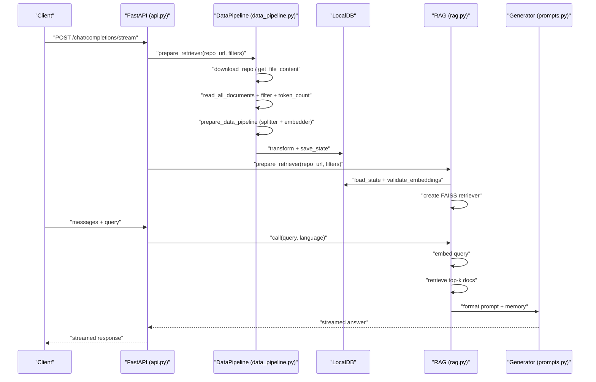
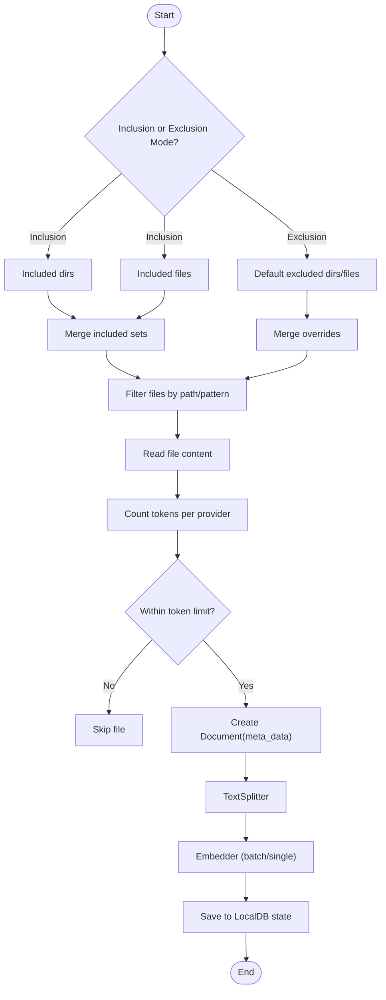
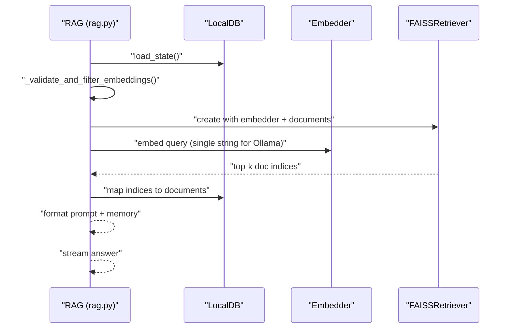
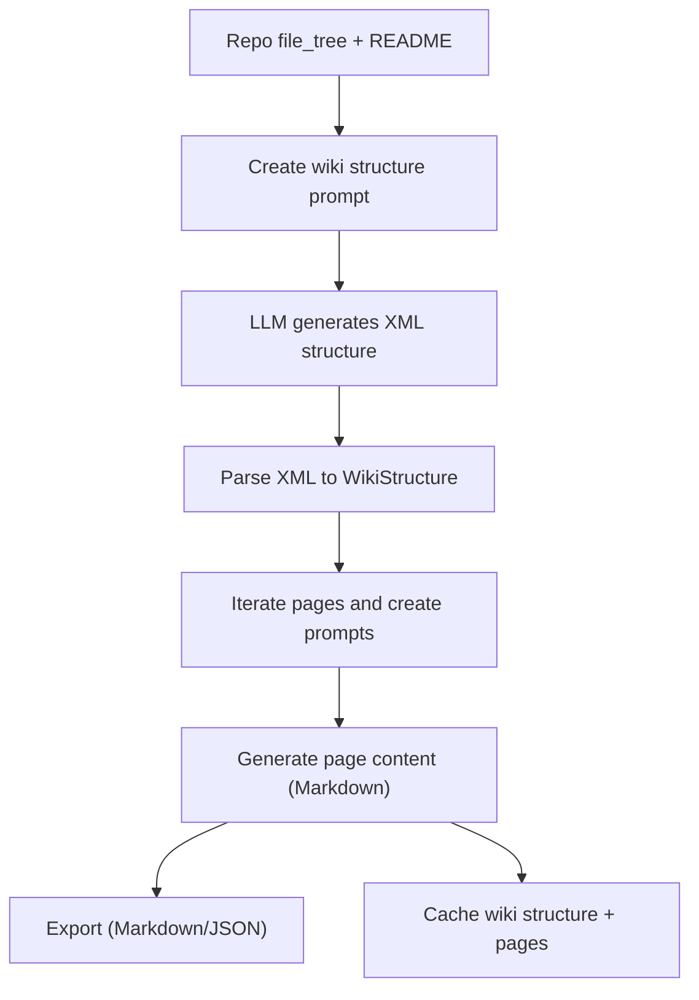
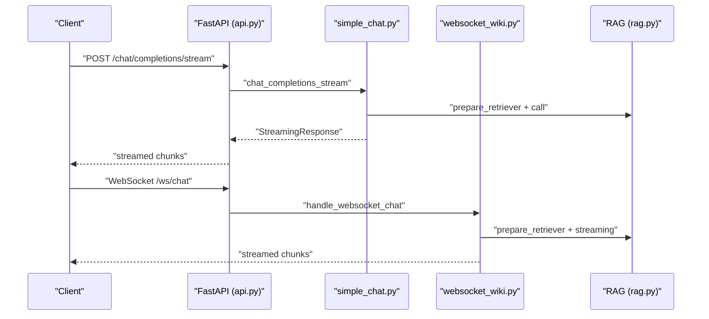
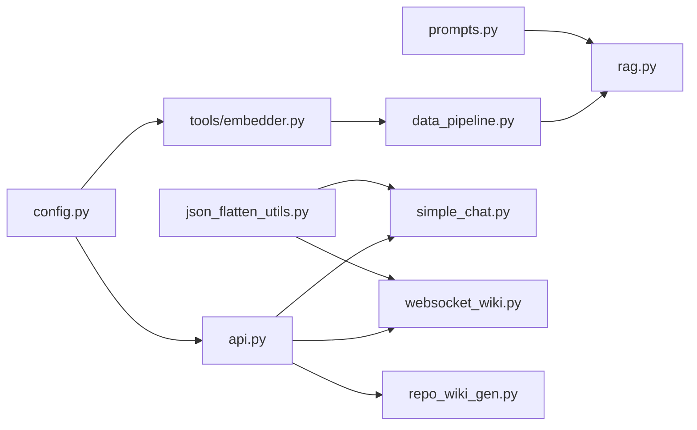

# Data Flow and Processing

<cite>
**Referenced Files in This Document**
- [api/data_pipeline.py](file://api/data_pipeline.py)
- [api/rag.py](file://api/rag.py)
- [api/repo_wiki_gen.py](file://api/repo_wiki_gen.py)
- [api/api.py](file://api/api.py)
- [api/config.py](file://api/config.py)
- [api/tools/embedder.py](file://api/tools/embedder.py)
- [api/prompts.py](file://api/prompts.py)
- [api/simple_chat.py](file://api/simple_chat.py)
- [api/websocket_wiki.py](file://api/websocket_wiki.py)
- [api/json_flatten_utils.py](file://api/json_flatten_utils.py)
</cite>

## Table of Contents
1. [Introduction](#introduction)
2. [Project Structure](#project-structure)
3. [Core Components](#core-components)
4. [Architecture Overview](#architecture-overview)
5. [Detailed Component Analysis](#detailed-component-analysis)
6. [Dependency Analysis](#dependency-analysis)
7. [Performance Considerations](#performance-considerations)
8. [Troubleshooting Guide](#troubleshooting-guide)
9. [Conclusion](#conclusion)
10. [Appendices](#appendices)

## Introduction
This document describes the complete data flow for DeepWiki-Open’s processing pipeline, from repository input through analysis to documentation generation and presentation. It covers:
- Repository ingestion and preprocessing (filtering, content extraction, tokenization)
- RAG data flow with vector database integration, embedding generation, and context retrieval
- Cache management for persistence, invalidation, and retrieval
- Error handling and validation points
- Performance optimization techniques
- Data structures and integration points with external systems

## Project Structure
High-level modules involved in the data flow:
- Configuration and clients: provider selection, model and embedder configuration
- Data pipeline: repository cloning/fetching, file filtering, token counting, splitting, embedding, persistence
- RAG engine: retriever setup, query embedding, FAISS retrieval, answer generation
- Wiki generation: structure inference, page content generation, export and cache
- API surface: streaming and WebSocket chat, cache endpoints, model config, exports

```mermaid
graph TB
subgraph "Ingestion"
DP["data_pipeline.py"]
CFG["config.py"]
EMB["tools/embedder.py"]
end
subgraph "RAG"
RAGC["rag.py"]
PROM["prompts.py"]
end
subgraph "Wiki Gen"
WIKI["repo_wiki_gen.py"]
end
subgraph "API"
API["api.py"]
CHAT["simple_chat.py"]
WS["websocket_wiki.py"]
end
DP --> EMB
DP --> CFG
RAGC --> DP
RAGC --> PROM
WIKI --> CFG
API --> CHAT
API --> WS
API --> WIKI
```

**Diagram sources**
- [api/data_pipeline.py](file://api/data_pipeline.py#L1-L917)
- [api/rag.py](file://api/rag.py#L1-L446)
- [api/repo_wiki_gen.py](file://api/repo_wiki_gen.py#L1-L550)
- [api/api.py](file://api/api.py#L1-L635)
- [api/config.py](file://api/config.py#L1-L464)
- [api/tools/embedder.py](file://api/tools/embedder.py#L1-L59)
- [api/prompts.py](file://api/prompts.py#L1-L192)
- [api/simple_chat.py](file://api/simple_chat.py#L1-L900)
- [api/websocket_wiki.py](file://api/websocket_wiki.py#L1-L978)

**Section sources**
- [api/data_pipeline.py](file://api/data_pipeline.py#L1-L917)
- [api/rag.py](file://api/rag.py#L1-L446)
- [api/repo_wiki_gen.py](file://api/repo_wiki_gen.py#L1-L550)
- [api/api.py](file://api/api.py#L1-L635)
- [api/config.py](file://api/config.py#L1-L464)
- [api/tools/embedder.py](file://api/tools/embedder.py#L1-L59)
- [api/prompts.py](file://api/prompts.py#L1-L192)
- [api/simple_chat.py](file://api/simple_chat.py#L1-L900)
- [api/websocket_wiki.py](file://api/websocket_wiki.py#L1-L978)

## Core Components
- Repository ingestion and preprocessing
  - Clones or fetches repository content locally or via APIs
  - Filters files by inclusion/exclusion rules and token limits
  - Splits text and generates embeddings
  - Persists transformed documents to a local database
- RAG engine
  - Builds a retriever from persisted embeddings
  - Embeds queries and retrieves relevant documents
  - Generates answers using a templated prompt and conversation memory
- Wiki generation
  - Infers wiki structure from repository file tree and README
  - Generates page content with Mermaid diagrams and citations
  - Persists and exports wiki content
- API and cache
  - Provides streaming and WebSocket chat endpoints
  - Manages server-side cache for wiki structures and pages
  - Exposes model configuration and export endpoints

**Section sources**
- [api/data_pipeline.py](file://api/data_pipeline.py#L103-L176)
- [api/data_pipeline.py](file://api/data_pipeline.py#L177-L406)
- [api/data_pipeline.py](file://api/data_pipeline.py#L408-L476)
- [api/rag.py](file://api/rag.py#L153-L446)
- [api/repo_wiki_gen.py](file://api/repo_wiki_gen.py#L63-L550)
- [api/api.py](file://api/api.py#L403-L539)

## Architecture Overview
End-to-end data flow from repository input to final presentation:



**Diagram sources**
- [api/api.py](file://api/api.py#L76-L130)
- [api/data_pipeline.py](file://api/data_pipeline.py#L408-L476)
- [api/rag.py](file://api/rag.py#L345-L415)
- [api/prompts.py](file://api/prompts.py#L30-L57)

## Detailed Component Analysis

### Repository Processing Pipeline
- Repository input
  - Supports GitHub, GitLab, Bitbucket via cloning or API fetching
  - Supports private repositories via access tokens
- File filtering and inclusion/exclusion
  - Two modes: inclusion (only specified dirs/files) vs exclusion (default plus overrides)
  - Default exclusions include virtual environments, caches, logs, and docs
- Content extraction and preprocessing
  - Reads code and documentation files separately
  - Computes token counts per provider-specific limits
  - Marks implementation vs test files
- Transformation pipeline
  - Text splitting, then embeddings via provider-specific embedder
  - Batch processing for remote providers; single-string for Ollama
- Persistence
  - Saves transformed documents to a local database state file



**Diagram sources**
- [api/data_pipeline.py](file://api/data_pipeline.py#L177-L406)
- [api/data_pipeline.py](file://api/data_pipeline.py#L408-L476)

**Section sources**
- [api/data_pipeline.py](file://api/data_pipeline.py#L103-L176)
- [api/data_pipeline.py](file://api/data_pipeline.py#L177-L406)
- [api/data_pipeline.py](file://api/data_pipeline.py#L408-L476)
- [api/config.py](file://api/config.py#L309-L348)

### RAG Data Flow and Vector Retrieval
- Retriever initialization
  - Loads persisted documents and validates embedding sizes
  - Creates FAISS retriever with provider-specific embedder
- Query processing
  - Embeds query (single string for Ollama)
  - Retrieves top-k documents and maps indices to persisted documents
- Prompt construction and generation
  - Uses a templated prompt with conversation memory and retrieved context
  - Streams answer via provider-specific client



**Diagram sources**
- [api/rag.py](file://api/rag.py#L246-L415)
- [api/rag.py](file://api/rag.py#L416-L446)
- [api/prompts.py](file://api/prompts.py#L30-L57)

**Section sources**
- [api/rag.py](file://api/rag.py#L153-L446)
- [api/prompts.py](file://api/prompts.py#L3-L57)

### Wiki Generation and Presentation
- Wiki structure inference
  - Parses repository file tree and README
  - Generates XML-based structure with pages and sections
- Page content generation
  - Creates prompts with Mermaid diagrams and citations
  - Produces Markdown content with file references and diagrams
- Export and cache
  - Exports wiki as Markdown or JSON
  - Persists wiki cache to server filesystem with language-aware keys



**Diagram sources**
- [api/repo_wiki_gen.py](file://api/repo_wiki_gen.py#L295-L417)
- [api/repo_wiki_gen.py](file://api/repo_wiki_gen.py#L419-L535)
- [api/api.py](file://api/api.py#L227-L391)
- [api/api.py](file://api/api.py#L403-L539)

**Section sources**
- [api/repo_wiki_gen.py](file://api/repo_wiki_gen.py#L63-L550)
- [api/api.py](file://api/api.py#L227-L391)
- [api/api.py](file://api/api.py#L403-L539)

### API Endpoints and Streaming
- Streaming chat
  - Validates messages, prepares retriever, optionally retrieves context
  - Streams responses via provider-specific clients
- WebSocket chat
  - Similar flow to streaming, but over WebSocket with per-chunk delivery
- Cache endpoints
  - Retrieve, store, and delete wiki cache with authorization checks



**Diagram sources**
- [api/api.py](file://api/api.py#L394-L401)
- [api/simple_chat.py](file://api/simple_chat.py#L76-L130)
- [api/websocket_wiki.py](file://api/websocket_wiki.py#L53-L120)

**Section sources**
- [api/api.py](file://api/api.py#L394-L401)
- [api/simple_chat.py](file://api/simple_chat.py#L76-L130)
- [api/websocket_wiki.py](file://api/websocket_wiki.py#L53-L120)

## Dependency Analysis
Key dependencies and relationships:
- Configuration drives provider selection and embedder/model parameters
- Embedder selection affects batching and single-string query handling
- RAG depends on LocalDB state and FAISS retriever
- API endpoints orchestrate retrieval and generation
- JSON flattening utilities help normalize GitHub Copilot responses



**Diagram sources**
- [api/config.py](file://api/config.py#L1-L464)
- [api/tools/embedder.py](file://api/tools/embedder.py#L1-L59)
- [api/data_pipeline.py](file://api/data_pipeline.py#L1-L917)
- [api/rag.py](file://api/rag.py#L1-L446)
- [api/prompts.py](file://api/prompts.py#L1-L192)
- [api/api.py](file://api/api.py#L1-L635)
- [api/simple_chat.py](file://api/simple_chat.py#L1-L900)
- [api/websocket_wiki.py](file://api/websocket_wiki.py#L1-L978)
- [api/json_flatten_utils.py](file://api/json_flatten_utils.py#L1-L328)

**Section sources**
- [api/config.py](file://api/config.py#L1-L464)
- [api/tools/embedder.py](file://api/tools/embedder.py#L1-L59)
- [api/data_pipeline.py](file://api/data_pipeline.py#L1-L917)
- [api/rag.py](file://api/rag.py#L1-L446)
- [api/prompts.py](file://api/prompts.py#L1-L192)
- [api/api.py](file://api/api.py#L1-L635)
- [api/simple_chat.py](file://api/simple_chat.py#L1-L900)
- [api/websocket_wiki.py](file://api/websocket_wiki.py#L1-L978)
- [api/json_flatten_utils.py](file://api/json_flatten_utils.py#L1-L328)

## Performance Considerations
- Token limits and batching
  - Provider-specific token limits prevent oversized embeddings
  - Batch embedding for remote providers; single-string for Ollama
- Retrieval efficiency
  - FAISS retriever with validated uniform embedding sizes
  - Early exit when input exceeds token thresholds
- Streaming and responsiveness
  - Streaming responses reduce latency
  - WebSocket enables persistent connections for long conversations
- Storage and caching
  - LocalDB state persists embeddings to avoid recomputation
  - Server-side wiki cache reduces repeated generation work

[No sources needed since this section provides general guidance]

## Troubleshooting Guide
Common issues and resolutions:
- Embedding size mismatches
  - Validation filters inconsistent vectors; rebuild with consistent embedder
- Token limit errors
  - Reduce input size or disable retrieval augmentation
- Authentication failures
  - Verify provider API keys and tokens
- Cache invalidation
  - Delete cache via API endpoint with optional authorization
- Malformed GitHub Copilot responses
  - Use JSON flattening utilities to repair streaming chunks and responses

**Section sources**
- [api/rag.py](file://api/rag.py#L251-L343)
- [api/rag.py](file://api/rag.py#L382-L414)
- [api/simple_chat.py](file://api/simple_chat.py#L665-L734)
- [api/websocket_wiki.py](file://api/websocket_wiki.py#L785-L800)
- [api/api.py](file://api/api.py#L504-L539)
- [api/json_flatten_utils.py](file://api/json_flatten_utils.py#L16-L63)
- [api/json_flatten_utils.py](file://api/json_flatten_utils.py#L269-L295)

## Conclusion
DeepWiki-Open’s pipeline integrates robust repository ingestion, provider-aware embedding, FAISS-based retrieval, and flexible generation with streaming and caching. The modular design allows pluggable providers and efficient reuse of computed embeddings and cached wiki structures.

[No sources needed since this section summarizes without analyzing specific files]

## Appendices

### Data Structures Across Stages
- Repository ingestion
  - Documents with metadata (path, type, token count, implementation flag)
- RAG
  - Retrieved documents mapped by index; conversation memory stores dialog turns
- Wiki generation
  - WikiStructure with pages and optional sections; WikiPage with content and relations
- API cache
  - WikiCacheData encapsulates structure, pages, and provider/model info

**Section sources**
- [api/data_pipeline.py](file://api/data_pipeline.py#L355-L401)
- [api/rag.py](file://api/rag.py#L51-L142)
- [api/repo_wiki_gen.py](file://api/repo_wiki_gen.py#L42-L96)
- [api/api.py](file://api/api.py#L90-L111)

### Integration Points with External Systems
- Providers
  - OpenAI, OpenRouter, Google, Azure, Bedrock, DashScope, GitHub Copilot, Ollama
- Vector database
  - FAISS retriever with custom embedder
- File APIs
  - GitHub, GitLab, Bitbucket raw content retrieval

**Section sources**
- [api/config.py](file://api/config.py#L10-L17)
- [api/config.py](file://api/config.py#L381-L463)
- [api/rag.py](file://api/rag.py#L41-L42)
- [api/data_pipeline.py](file://api/data_pipeline.py#L478-L735)