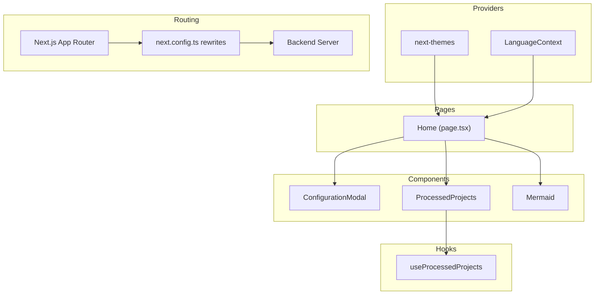
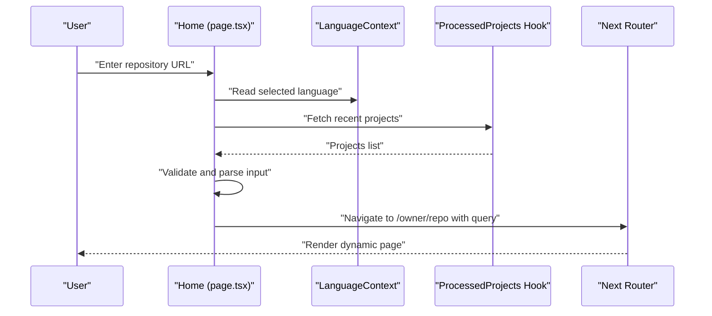
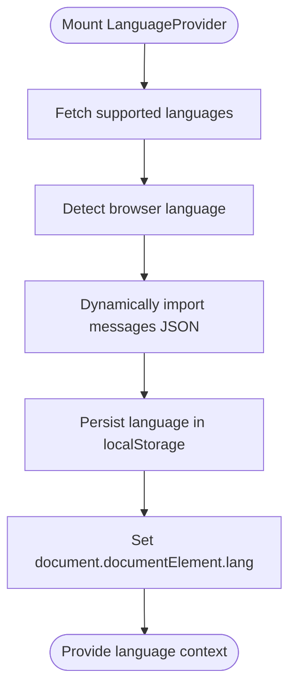
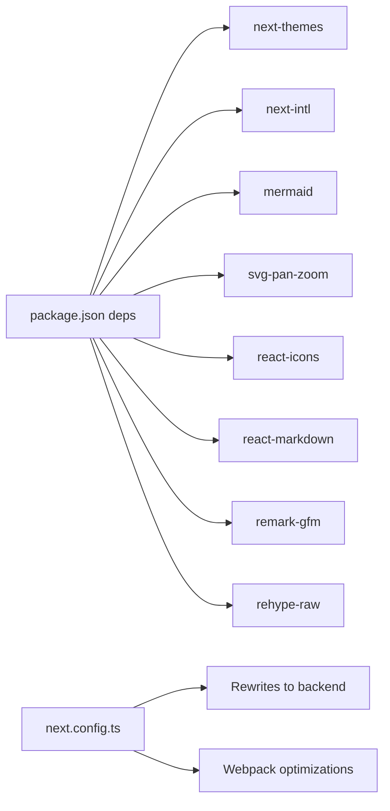

# Frontend Architecture

<cite>
**Referenced Files in This Document**
- [layout.tsx](file://src/app/layout.tsx)
- [page.tsx](file://src/app/page.tsx)
- [LanguageContext.tsx](file://src/contexts/LanguageContext.tsx)
- [i18n.ts](file://src/i18n.ts)
- [next.config.ts](file://next.config.ts)
- [Mermaid.tsx](file://src/components/Mermaid.tsx)
- [ConfigurationModal.tsx](file://src/components/ConfigurationModal.tsx)
- [ProcessedProjects.tsx](file://src/components/ProcessedProjects.tsx)
- [useProcessedProjects.ts](file://src/hooks/useProcessedProjects.ts)
- [urlDecoder.tsx](file://src/utils/urlDecoder.tsx)
- [globals.css](file://src/app/globals.css)
- [tailwind.config.js](file://tailwind.config.js)
- [theme-toggle.tsx](file://src/components/theme-toggle.tsx)
- [en.json](file://src/messages/en.json)
- [package.json](file://package.json)
</cite>

## Table of Contents
1. [Introduction](#introduction)
2. [Project Structure](#project-structure)
3. [Core Components](#core-components)
4. [Architecture Overview](#architecture-overview)
5. [Detailed Component Analysis](#detailed-component-analysis)
6. [Dependency Analysis](#dependency-analysis)
7. [Performance Considerations](#performance-considerations)
8. [Troubleshooting Guide](#troubleshooting-guide)
9. [Conclusion](#conclusion)
10. [Appendices](#appendices)

## Introduction
This document explains the frontend architecture of the Next.js application, focusing on the component-based design, state management patterns, internationalization, theming, responsive design, and integration with external libraries such as Mermaid for diagram rendering. It also covers data flow from API endpoints to UI rendering, component composition, and performance optimization techniques.

## Project Structure
The frontend is organized using Next.js App Router conventions:
- Application shell and global providers live under src/app
- Shared React components are in src/components
- Context providers and hooks are in src/contexts and src/hooks
- Utilities and styling are in src/utils and src/app/globals.css
- Internationalization assets are in src/messages and src/i18n.ts
- Build and routing configuration are in next.config.ts and package.json

```mermaid
graph TB
subgraph "App Shell"
L["layout.tsx"]
P["page.tsx"]
end
subgraph "Providers"
LC["LanguageContext.tsx"]
TH["theme-toggle.tsx"]
end
subgraph "Components"
CM["ConfigurationModal.tsx"]
PP["ProcessedProjects.tsx"]
MR["Mermaid.tsx"]
end
subgraph "Hooks"
UP["useProcessedProjects.ts"]
end
subgraph "Utilities"
UD["urlDecoder.tsx"]
end
subgraph "Styling"
GC["globals.css"]
TW["tailwind.config.js"]
end
subgraph "I18N"
I18N["i18n.ts"]
MSG["messages/*.json"]
end
subgraph "Config"
NC["next.config.ts"]
PKG["package.json"]
end
L --> LC
L --> TH
P --> CM
P --> PP
P --> MR
PP --> UP
CM --> UD
GC --> TW
I18N --> MSG
NC --> PKG
```

**Diagram sources**
- [layout.tsx](file://src/app/layout.tsx#L1-L32)
- [page.tsx](file://src/app/page.tsx#L1-L637)
- [LanguageContext.tsx](file://src/contexts/LanguageContext.tsx#L1-L203)
- [theme-toggle.tsx](file://src/components/theme-toggle.tsx#L1-L50)
- [ConfigurationModal.tsx](file://src/components/ConfigurationModal.tsx#L1-L364)
- [ProcessedProjects.tsx](file://src/components/ProcessedProjects.tsx#L1-L271)
- [Mermaid.tsx](file://src/components/Mermaid.tsx#L1-L491)
- [useProcessedProjects.ts](file://src/hooks/useProcessedProjects.ts#L1-L47)
- [urlDecoder.tsx](file://src/utils/urlDecoder.tsx#L1-L19)
- [globals.css](file://src/app/globals.css#L1-L149)
- [tailwind.config.js](file://tailwind.config.js#L1-L8)
- [i18n.ts](file://src/i18n.ts#L1-L15)
- [en.json](file://src/messages/en.json#L1-L144)
- [next.config.ts](file://next.config.ts#L1-L71)
- [package.json](file://package.json#L1-L40)

**Section sources**
- [layout.tsx](file://src/app/layout.tsx#L1-L32)
- [page.tsx](file://src/app/page.tsx#L1-L637)
- [next.config.ts](file://next.config.ts#L1-L71)
- [package.json](file://package.json#L1-L40)

## Core Components
- Root layout and providers: The root layout wraps the entire app with theme and language providers, ensuring global state is available to all pages.
- Home page: Orchestrates form state, modal configuration, authentication checks, and navigation to generated wiki pages.
- Configuration modal: Centralized configuration UI for model selection, platform, tokens, filters, and branch selection.
- Processed projects: Displays cached wiki projects with search, filtering, and view modes.
- Mermaid: Renders diagrams with optional zoom and fullscreen modal, integrating svg-pan-zoom for interactivity.
- Hooks: useProcessedProjects encapsulates fetching and caching project lists.
- Utilities: urlDecoder extracts domains and paths from repository inputs.
- Styling: Tailwind-based Japanese aesthetic theming with CSS variables and dark mode support.

**Section sources**
- [layout.tsx](file://src/app/layout.tsx#L1-L32)
- [page.tsx](file://src/app/page.tsx#L1-L637)
- [ConfigurationModal.tsx](file://src/components/ConfigurationModal.tsx#L1-L364)
- [ProcessedProjects.tsx](file://src/components/ProcessedProjects.tsx#L1-L271)
- [Mermaid.tsx](file://src/components/Mermaid.tsx#L1-L491)
- [useProcessedProjects.ts](file://src/hooks/useProcessedProjects.ts#L1-L47)
- [urlDecoder.tsx](file://src/utils/urlDecoder.tsx#L1-L19)
- [globals.css](file://src/app/globals.css#L1-L149)
- [tailwind.config.js](file://tailwind.config.js#L1-L8)

## Architecture Overview
The frontend follows a layered pattern:
- Providers layer: Theme and language providers supply global state to the UI tree.
- Page layer: The home page coordinates user input, validation, and navigation.
- Component layer: Reusable components encapsulate UI concerns and delegate to hooks for data.
- Data layer: API routes are proxied via Next.js rewrites to the backend server.



**Diagram sources**
- [layout.tsx](file://src/app/layout.tsx#L1-L32)
- [page.tsx](file://src/app/page.tsx#L1-L637)
- [ConfigurationModal.tsx](file://src/components/ConfigurationModal.tsx#L1-L364)
- [ProcessedProjects.tsx](file://src/components/ProcessedProjects.tsx#L1-L271)
- [Mermaid.tsx](file://src/components/Mermaid.tsx#L1-L491)
- [useProcessedProjects.ts](file://src/hooks/useProcessedProjects.ts#L1-L47)
- [next.config.ts](file://next.config.ts#L36-L67)

## Detailed Component Analysis

### Root Layout and Providers
- The root layout sets up the theme provider and language provider, enabling dark/light mode and internationalization across the app.
- The layout suppresses hydration warnings for smoother SSR behavior.

**Section sources**
- [layout.tsx](file://src/app/layout.tsx#L1-L32)

### Home Page (page.tsx)
- State management:
  - Local state for repository input, model/provider selection, language, branch, tokens, and configuration modal visibility.
  - Uses useProcessedProjects hook to fetch recent projects for quick access.
  - Integrates useLanguage for translations.
- Authentication:
  - On mount, fetches auth status and validates an authorization code if required.
- Navigation:
  - Parses repository input into owner/repo/type and navigates to dynamic route with query parameters.
- Rendering:
  - Conditional display of processed projects or welcome content.
  - Renders Mermaid diagrams with embedded demo charts.



**Diagram sources**
- [page.tsx](file://src/app/page.tsx#L1-L637)
- [LanguageContext.tsx](file://src/contexts/LanguageContext.tsx#L1-L203)
- [useProcessedProjects.ts](file://src/hooks/useProcessedProjects.ts#L1-L47)

**Section sources**
- [page.tsx](file://src/app/page.tsx#L1-L637)
- [useProcessedProjects.ts](file://src/hooks/useProcessedProjects.ts#L1-L47)
- [LanguageContext.tsx](file://src/contexts/LanguageContext.tsx#L1-L203)

### Language Context and Internationalization
- LanguageContext manages:
  - Supported languages discovery via a backend endpoint.
  - Browser language detection and persistence in localStorage.
  - Dynamic import of message bundles and updating the HTML lang attribute.
  - Loading states and fallback to English on errors.
- Next Intl integration:
  - Server-side config selects a safe locale and loads messages.



**Diagram sources**
- [LanguageContext.tsx](file://src/contexts/LanguageContext.tsx#L69-L150)
- [i18n.ts](file://src/i18n.ts#L6-L14)

**Section sources**
- [LanguageContext.tsx](file://src/contexts/LanguageContext.tsx#L1-L203)
- [i18n.ts](file://src/i18n.ts#L1-L15)
- [en.json](file://src/messages/en.json#L1-L144)

### Configuration Modal
- Props-driven composition:
  - Receives all configuration state and callbacks from the parent page.
  - Delegates platform-specific selections to child components (UserSelector, TokenInput, BranchSelector).
- Behavior:
  - Supports toggling token section, selecting wiki type, model/provider, and applying file filters.
  - Handles authorization code input and loading states.

**Section sources**
- [ConfigurationModal.tsx](file://src/components/ConfigurationModal.tsx#L1-L364)

### Processed Projects Component
- Responsibilities:
  - Fetches projects from the backend API.
  - Provides search and view-mode toggles (card/list).
  - Supports deletion of cached projects.
- Composition:
  - Uses a custom hook for data fetching and memoized filtering for performance.

**Section sources**
- [ProcessedProjects.tsx](file://src/components/ProcessedProjects.tsx#L1-L271)
- [useProcessedProjects.ts](file://src/hooks/useProcessedProjects.ts#L1-L47)

### Mermaid Diagram Renderer
- Features:
  - Initializes Mermaid with Japanese aesthetic theme and custom CSS.
  - Renders charts from raw Mermaid syntax with error handling.
  - Optional zoom and fullscreen modal with svg-pan-zoom.
  - Applies dark mode attributes dynamically.
- UX:
  - Hover indicators for interactive diagrams.
  - Loading and error states with localized messages.

**Section sources**
- [Mermaid.tsx](file://src/components/Mermaid.tsx#L1-L491)

### Theming and Responsive Design
- Theming:
  - CSS variables define a Japanese aesthetic palette for light and dark modes.
  - next-themes integrates with the theme toggle component.
- Responsive design:
  - Tailwind utilities and grid layouts adapt to mobile and desktop.
  - Typography and spacing use relative units and semantic classes.

**Section sources**
- [globals.css](file://src/app/globals.css#L1-L149)
- [tailwind.config.js](file://tailwind.config.js#L1-L8)
- [theme-toggle.tsx](file://src/components/theme-toggle.tsx#L1-L50)

### URL Parsing Utility
- Extracts domain and path from repository inputs to normalize URLs and derive owner/repo.

**Section sources**
- [urlDecoder.tsx](file://src/utils/urlDecoder.tsx#L1-L19)

## Dependency Analysis
- External libraries:
  - next-themes, next-intl, mermaid, react-icons, svg-pan-zoom, react-markdown, remark-gfm, rehype-raw.
- Build-time optimizations:
  - Webpack splitChunks and optimizePackageImports reduce bundle size.
  - Next.js standalone output and rewrites proxy API traffic to the backend.



**Diagram sources**
- [package.json](file://package.json#L11-L25)
- [next.config.ts](file://next.config.ts#L9-L35)
- [next.config.ts](file://next.config.ts#L36-L67)

**Section sources**
- [package.json](file://package.json#L1-L40)
- [next.config.ts](file://next.config.ts#L1-L71)

## Performance Considerations
- Bundle optimization:
  - Webpack splitChunks and vendor cache groups improve caching and load times.
  - optimizePackageImports reduces bundle size for large libraries.
- Rendering:
  - Memoized filtering in ProcessedProjects avoids unnecessary re-renders.
  - Lazy initialization of svg-pan-zoom ensures zoom is only loaded when needed.
- Network:
  - Proxied API routes minimize CORS and improve reliability.
- Hydration:
  - Root layout suppresses hydration warnings for smoother initial render.

[No sources needed since this section provides general guidance]

## Troubleshooting Guide
- Language loading issues:
  - If messages fail to load, the provider falls back to English and logs errors.
- Authentication failures:
  - The home page sets a default requirement when fetches fail to avoid blocking the UI.
- Diagram rendering errors:
  - Mermaid displays a localized error message with the raw chart content for debugging.
- API connectivity:
  - Verify rewrites in next.config.ts point to the correct backend base URL.

**Section sources**
- [LanguageContext.tsx](file://src/contexts/LanguageContext.tsx#L137-L146)
- [page.tsx](file://src/app/page.tsx#L158-L178)
- [Mermaid.tsx](file://src/components/Mermaid.tsx#L384-L400)
- [next.config.ts](file://next.config.ts#L3-L7)

## Conclusion
The frontend architecture emphasizes a clean separation of concerns: providers manage global state, pages orchestrate user interactions, components encapsulate UI logic, and hooks abstract data fetching. Internationalization and theming are integrated at the root level, while Mermaid enables rich, interactive visualizations. The build and routing configuration ensures efficient delivery and reliable API access.

[No sources needed since this section summarizes without analyzing specific files]

## Appendices

### API Routes and Rewrites
- The Next.js configuration rewrites API routes to the backend server, simplifying development and deployment.

**Section sources**
- [next.config.ts](file://next.config.ts#L36-L67)

### Accessibility and Cross-Browser Compatibility
- Semantic HTML and ARIA labels are used in theme toggle and modal components.
- CSS variables and Tailwind utilities ensure consistent rendering across browsers.
- The theme toggle uses appropriate roles and labels for assistive technologies.

**Section sources**
- [theme-toggle.tsx](file://src/components/theme-toggle.tsx#L1-L50)
- [globals.css](file://src/app/globals.css#L1-L149)