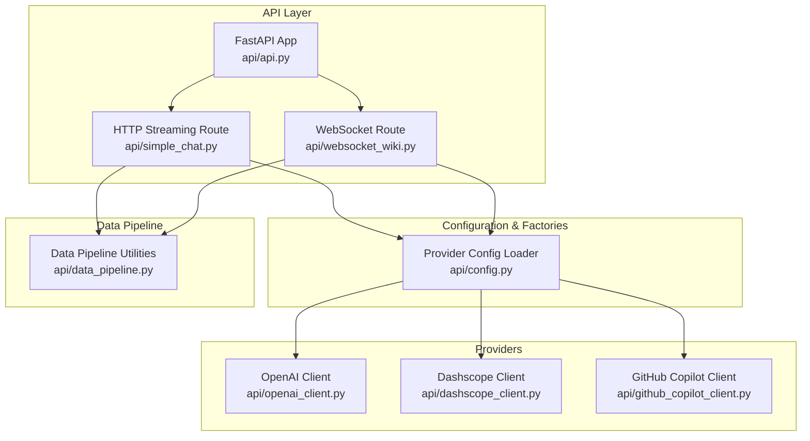
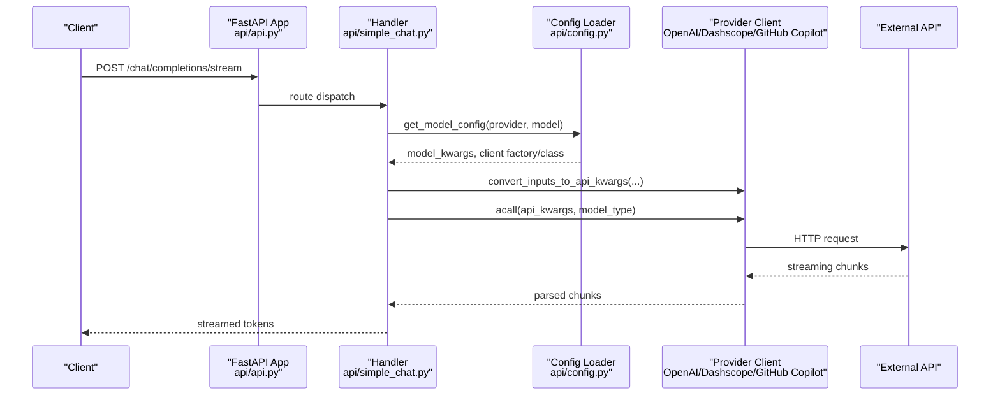
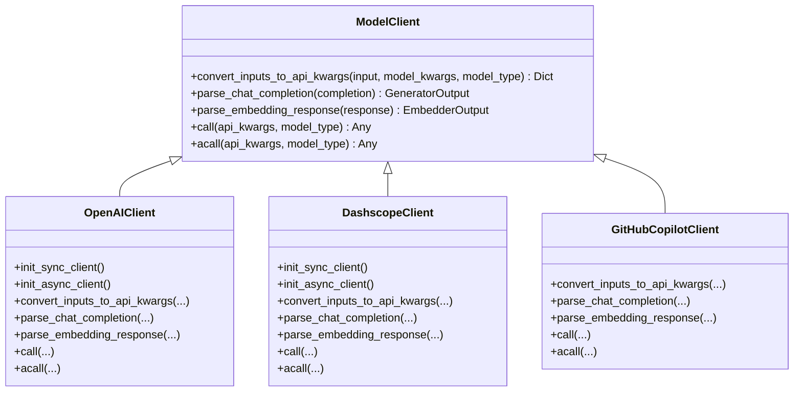
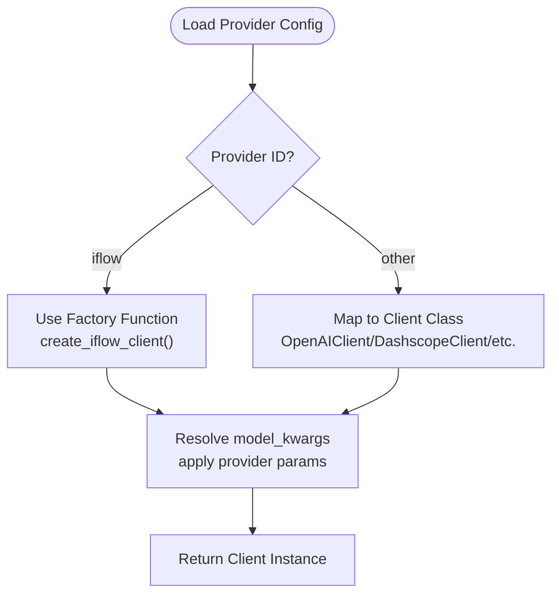
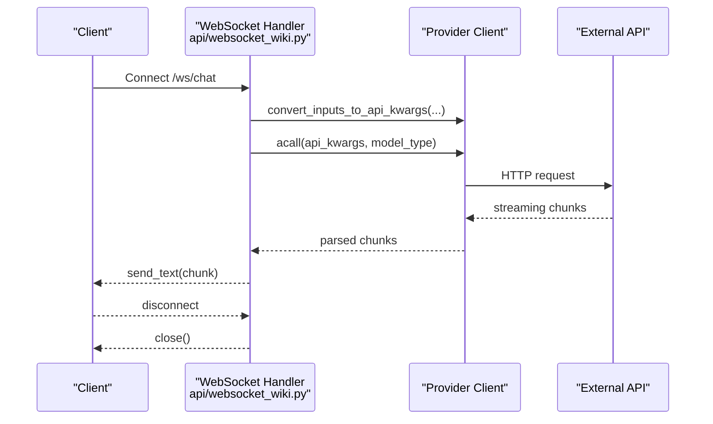
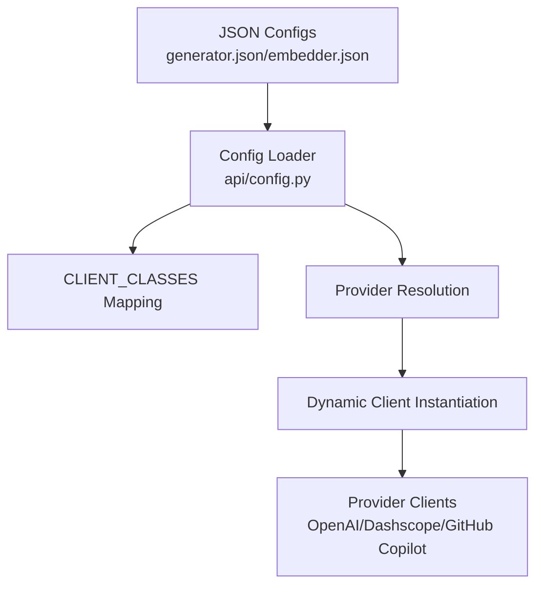
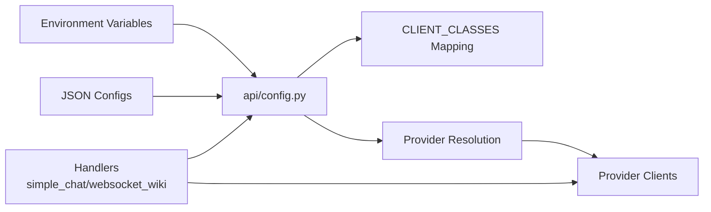

# Integration Patterns

<cite>
**Referenced Files in This Document**
- [api/api.py](file://api/api.py)
- [api/config.py](file://api/config.py)
- [api/openai_client.py](file://api/openai_client.py)
- [api/dashscope_client.py](file://api/dashscope_client.py)
- [api/github_copilot_client.py](file://api/github_copilot_client.py)
- [api/websocket_wiki.py](file://api/websocket_wiki.py)
- [api/simple_chat.py](file://api/simple_chat.py)
- [api/data_pipeline.py](file://api/data_pipeline.py)
</cite>

## Table of Contents
1. [Introduction](#introduction)
2. [Project Structure](#project-structure)
3. [Core Components](#core-components)
4. [Architecture Overview](#architecture-overview)
5. [Detailed Component Analysis](#detailed-component-analysis)
6. [Dependency Analysis](#dependency-analysis)
7. [Performance Considerations](#performance-considerations)
8. [Troubleshooting Guide](#troubleshooting-guide)
9. [Conclusion](#conclusion)

## Introduction
This document explains the integration patterns implemented across the system, focusing on how components communicate and collaborate. It covers:
- Provider pattern for AI model integration
- Factory pattern for dynamic client creation
- Observer-like event streaming via WebSocket and HTTP streaming
- Plugin-style architecture for extending functionality
- Configuration-driven component selection and environment-based customization
- API integration patterns with external services
- Asynchronous processing patterns
- Examples of component interdependencies, event-driven architectures, and decoupling strategies
- Error propagation, fallback mechanisms, and graceful degradation
- Extension points, customization hooks, and integration testing approaches

## Project Structure
The integration surface centers around a FastAPI application that exposes streaming chat endpoints and a WebSocket endpoint. Configuration drives provider selection and client instantiation. Data pipeline utilities support repository ingestion, token counting, and embedding workflows. Provider-specific clients encapsulate external service integrations.

**Diagram sources**
- [api/api.py](file://api/api.py#L1-L635)
- [api/simple_chat.py](file://api/simple_chat.py#L1-L900)
- [api/websocket_wiki.py](file://api/websocket_wiki.py#L1-L978)
- [api/config.py](file://api/config.py#L1-L464)
- [api/openai_client.py](file://api/openai_client.py#L1-L653)
- [api/dashscope_client.py](file://api/dashscope_client.py#L1-L917)
- [api/github_copilot_client.py](file://api/github_copilot_client.py#L1-L898)
- [api/data_pipeline.py](file://api/data_pipeline.py#L1-L917)

**Section sources**
- [api/api.py](file://api/api.py#L1-L635)
- [api/config.py](file://api/config.py#L1-L464)

## Core Components
- Provider pattern: Model clients (OpenAI, Dashscope, GitHub Copilot) implement a common interface to wrap external APIs. They convert inputs to provider-specific API kwargs and parse responses consistently.
- Factory pattern: Provider configuration maps provider IDs to client classes or factory functions, enabling dynamic client creation based on runtime configuration.
- Streaming and WebSocket: HTTP streaming and WebSocket endpoints deliver incremental responses from providers, supporting real-time collaboration and long-running tasks.
- Configuration-driven selection: Environment variables and JSON configs select providers, models, and parameters, enabling environment-based customization.
- Data pipeline: Repository ingestion, token counting, and embedding orchestration integrate with provider clients and memory/history management.

**Section sources**
- [api/config.py](file://api/config.py#L60-L168)
- [api/openai_client.py](file://api/openai_client.py#L120-L560)
- [api/dashscope_client.py](file://api/dashscope_client.py#L115-L637)
- [api/github_copilot_client.py](file://api/github_copilot_client.py#L30-L800)
- [api/simple_chat.py](file://api/simple_chat.py#L76-L800)
- [api/websocket_wiki.py](file://api/websocket_wiki.py#L53-L800)
- [api/data_pipeline.py](file://api/data_pipeline.py#L25-L102)

## Architecture Overview
The system integrates three primary flows:
- HTTP streaming chat: Converts user prompts to provider-specific kwargs, streams incremental tokens, and handles fallbacks on token limit errors.
- WebSocket chat: Similar to HTTP streaming but over WebSocket, enabling persistent connections and richer event handling.
- Configuration-driven provider selection: Loads provider configurations, resolves client classes or factories, and applies environment overrides.

**Diagram sources**
- [api/api.py](file://api/api.py#L394-L401)
- [api/simple_chat.py](file://api/simple_chat.py#L76-L800)
- [api/config.py](file://api/config.py#L381-L463)
- [api/openai_client.py](file://api/openai_client.py#L401-L542)
- [api/dashscope_client.py](file://api/dashscope_client.py#L391-L504)
- [api/github_copilot_client.py](file://api/github_copilot_client.py#L519-L663)

## Detailed Component Analysis

### Provider Pattern Implementation
Provider clients encapsulate external API specifics behind a uniform interface:
- Input conversion: convert_inputs_to_api_kwargs transforms generic inputs/messages to provider-specific formats.
- Streaming handling: handle_streaming_response and async generators yield incremental tokens.
- Response parsing: parse_chat_completion and parse_embedding_response normalize outputs.
- Error resilience: backoff decorators and try/catch guard against transient failures.

**Diagram sources**
- [api/openai_client.py](file://api/openai_client.py#L120-L560)
- [api/dashscope_client.py](file://api/dashscope_client.py#L115-L637)
- [api/github_copilot_client.py](file://api/github_copilot_client.py#L30-L800)

**Section sources**
- [api/openai_client.py](file://api/openai_client.py#L120-L560)
- [api/dashscope_client.py](file://api/dashscope_client.py#L115-L637)
- [api/github_copilot_client.py](file://api/github_copilot_client.py#L30-L800)

### Factory Pattern for Dynamic Client Creation
Provider configuration maps provider IDs to client classes or factory functions. For specialized providers (e.g., iFlow), a factory function is returned to configure base URLs and API keys at runtime.

**Diagram sources**
- [api/config.py](file://api/config.py#L127-L168)
- [api/config.py](file://api/config.py#L381-L463)

**Section sources**
- [api/config.py](file://api/config.py#L60-L168)
- [api/config.py](file://api/config.py#L381-L463)

### Observer Pattern for Real-Time Streaming
Real-time streaming is implemented via two complementary channels:
- HTTP streaming: StreamingResponse yields tokens incrementally from provider clients.
- WebSocket: Persistent connection streams tokens and supports enhanced parsing and error handling.

**Diagram sources**
- [api/websocket_wiki.py](file://api/websocket_wiki.py#L53-L800)
- [api/github_copilot_client.py](file://api/github_copilot_client.py#L665-L740)

**Section sources**
- [api/websocket_wiki.py](file://api/websocket_wiki.py#L53-L800)
- [api/simple_chat.py](file://api/simple_chat.py#L76-L800)

### Plugin-Style Architecture and Configuration-Driven Selection
- Plugin-style: New providers can be added by registering a client class in the CLIENT_CLASSES mapping and adding a provider entry in JSON configs.
- Configuration-driven: Environment variables override placeholders in JSON configs; provider/model selection is dynamic and environment-aware.
- Environment-based customization: Keys and base URLs are resolved from environment variables, enabling per-environment deployment without code changes.

**Diagram sources**
- [api/config.py](file://api/config.py#L10-L71)
- [api/config.py](file://api/config.py#L103-L168)

**Section sources**
- [api/config.py](file://api/config.py#L10-L71)
- [api/config.py](file://api/config.py#L103-L168)

### API Integration Patterns with External Services
- OpenAI-compatible providers: OpenAI, OpenRouter, Azure, Dashscope, GitHub Copilot, and iFlow are integrated via OpenAI SDK-compatible clients or LiteLLM wrappers.
- Authentication: Environment variables supply API keys; GitHub Copilot uses automatic OAuth2 via LiteLLM.
- Backoff and retries: Decorators protect against rate limits and transient errors.
- Parameter normalization: Provider-specific kwargs are normalized to a common interface.

**Section sources**
- [api/openai_client.py](file://api/openai_client.py#L411-L541)
- [api/dashscope_client.py](file://api/dashscope_client.py#L391-L504)
- [api/github_copilot_client.py](file://api/github_copilot_client.py#L519-L663)
- [api/config.py](file://api/config.py#L19-L47)

### Asynchronous Processing Patterns
- Async provider calls: acall methods return async generators for streaming responses.
- Async data pipeline: Document processing and embedding can leverage async flows for throughput.
- Streaming handlers: Both HTTP and WebSocket handlers iterate over async generators to yield tokens.

**Section sources**
- [api/openai_client.py](file://api/openai_client.py#L505-L541)
- [api/dashscope_client.py](file://api/dashscope_client.py#L505-L599)
- [api/github_copilot_client.py](file://api/github_copilot_client.py#L576-L663)
- [api/simple_chat.py](file://api/simple_chat.py#L534-L660)
- [api/websocket_wiki.py](file://api/websocket_wiki.py#L569-L780)

### Component Interdependencies and Event-Driven Decoupling
- Loose coupling: Handlers depend on provider interfaces, not concrete implementations.
- Event-driven flows: WebSocket handler reacts to incoming messages and emits tokens as events; HTTP handler streams tokens as they arrive.
- Memory and conversation history: Handlers populate memory stores to maintain context across turns.

**Section sources**
- [api/websocket_wiki.py](file://api/websocket_wiki.py#L134-L149)
- [api/simple_chat.py](file://api/simple_chat.py#L139-L150)

### Error Propagation, Fallback Mechanisms, and Graceful Degradation
- Token limit fallback: On exceeding context limits, handlers rebuild prompts without RAG context and retry.
- Provider-specific error handling: Dedicated try/catch blocks emit user-friendly error messages via streaming/WebSocket.
- Backoff and retries: Decorators retry on transient errors with exponential backoff.
- Environment checks: Handlers warn when required environment variables are missing, allowing graceful degradation.

**Section sources**
- [api/simple_chat.py](file://api/simple_chat.py#L661-L735)
- [api/websocket_wiki.py](file://api/websocket_wiki.py#L781-L800)
- [api/openai_client.py](file://api/openai_client.py#L411-L421)
- [api/dashscope_client.py](file://api/dashscope_client.py#L391-L400)

### Extension Points, Customization Hooks, and Testing Approaches
- Extension points:
  - Add new providers by implementing a ModelClient subclass and registering it in CLIENT_CLASSES.
  - Extend configuration JSONs to introduce new providers and models.
- Customization hooks:
  - Environment variables for API keys, base URLs, and behavior toggles.
  - Placeholder replacement in JSON configs using environment variables.
- Integration testing:
  - Unit tests validate embedder clients and provider clients.
  - Integration tests cover end-to-end flows for HTTP streaming and WebSocket.
  - Tests exercise fallbacks and error conditions.

**Section sources**
- [api/config.py](file://api/config.py#L73-L102)
- [tests/unit/test_all_embedders.py](file://tests/unit/test_all_embedders.py)
- [tests/integration/test_full_integration.py](file://tests/integration/test_full_integration.py)
- [tests/integration/test_github_copilot_integration.py](file://tests/integration/test_github_copilot_integration.py)

## Dependency Analysis
Provider selection and client instantiation form the core dependency chain. Configuration loader depends on environment variables and JSON configs; handlers depend on the configuration to resolve clients.

**Diagram sources**
- [api/config.py](file://api/config.py#L19-L47)
- [api/config.py](file://api/config.py#L103-L168)
- [api/simple_chat.py](file://api/simple_chat.py#L76-L800)
- [api/websocket_wiki.py](file://api/websocket_wiki.py#L53-L800)

**Section sources**
- [api/config.py](file://api/config.py#L19-L47)
- [api/config.py](file://api/config.py#L103-L168)
- [api/simple_chat.py](file://api/simple_chat.py#L76-L800)
- [api/websocket_wiki.py](file://api/websocket_wiki.py#L53-L800)

## Performance Considerations
- Streaming minimizes latency by emitting tokens as they arrive.
- Token counting and provider-specific limits prevent oversized requests.
- Batch embedding and document processors optimize embedding throughput.
- Backoff reduces retry storms and improves reliability under load.

[No sources needed since this section provides general guidance]

## Troubleshooting Guide
Common issues and remedies:
- Missing API keys: Handlers warn and guide users to set environment variables.
- Token limit errors: Fallback prompts without RAG context are attempted automatically.
- Provider misconfiguration: Verify provider IDs and model names in JSON configs; confirm environment variables.
- WebSocket connectivity: Ensure client reconnects on close and handles partial messages.

**Section sources**
- [api/simple_chat.py](file://api/simple_chat.py#L591-L610)
- [api/websocket_wiki.py](file://api/websocket_wiki.py#L591-L600)
- [api/websocket_wiki.py](file://api/websocket_wiki.py#L781-L800)

## Conclusion
The system’s integration patterns emphasize:
- Clear provider abstractions and dynamic client factories
- Robust streaming and WebSocket channels for real-time collaboration
- Configuration-driven selection and environment-based customization
- Strong error handling, fallbacks, and graceful degradation
These patterns enable extensibility, maintainability, and reliable operation across diverse AI providers and deployment environments.