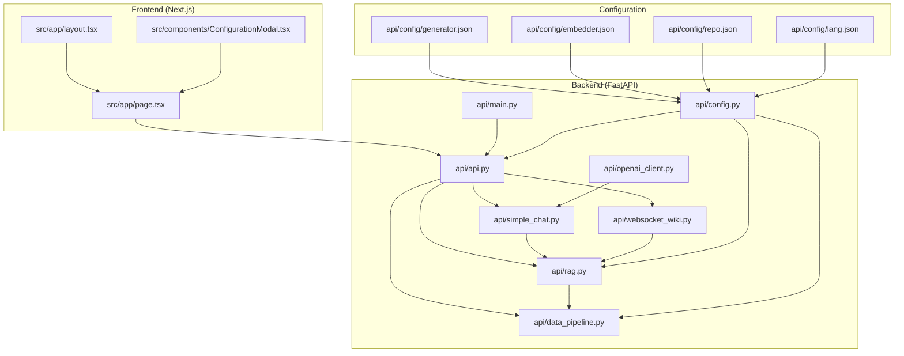
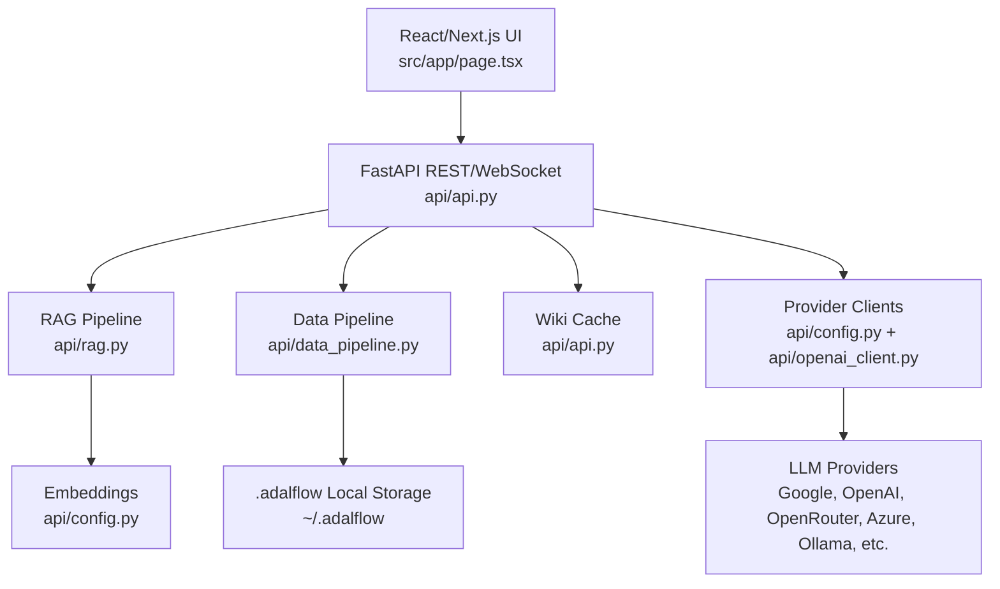
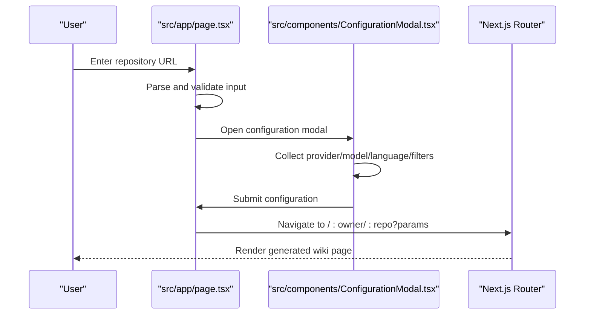
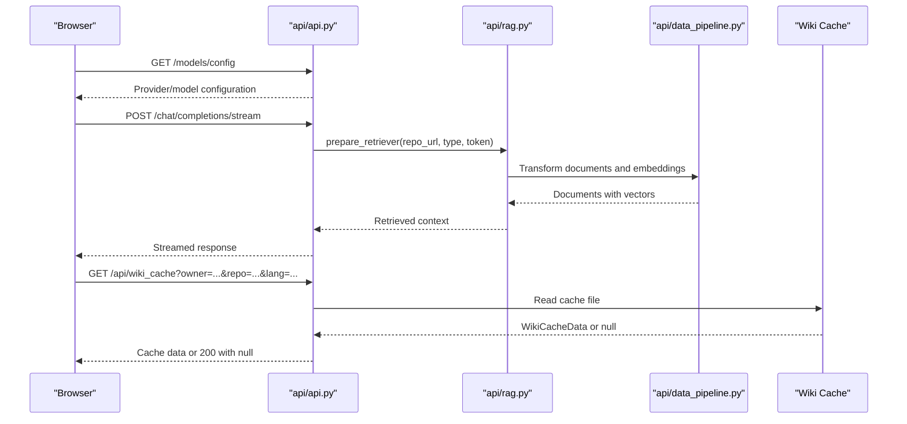
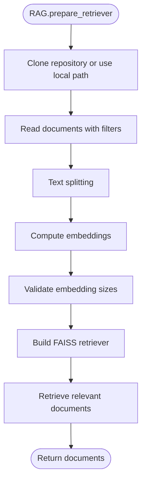
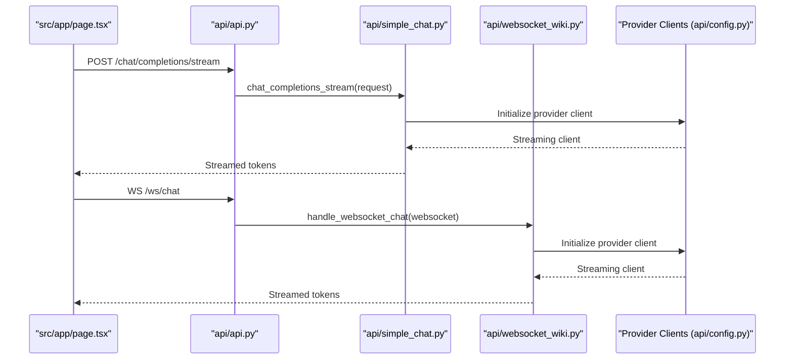
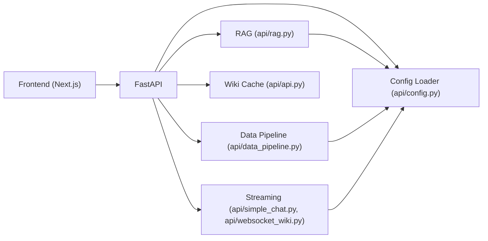

# System Overview

<cite>
**Referenced Files in This Document**
- [README.md](file://README.md)
- [api/main.py](file://api/main.py)
- [api/api.py](file://api/api.py)
- [api/config.py](file://api/config.py)
- [api/rag.py](file://api/rag.py)
- [api/data_pipeline.py](file://api/data_pipeline.py)
- [api/simple_chat.py](file://api/simple_chat.py)
- [api/websocket_wiki.py](file://api/websocket_wiki.py)
- [api/openai_client.py](file://api/openai_client.py)
- [src/app/page.tsx](file://src/app/page.tsx)
- [src/app/layout.tsx](file://src/app/layout.tsx)
- [src/components/ConfigurationModal.tsx](file://src/components/ConfigurationModal.tsx)
- [package.json](file://package.json)
</cite>

## Table of Contents
1. [Introduction](#introduction)
2. [Project Structure](#project-structure)
3. [Core Components](#core-components)
4. [Architecture Overview](#architecture-overview)
5. [Detailed Component Analysis](#detailed-component-analysis)
6. [Dependency Analysis](#dependency-analysis)
7. [Performance Considerations](#performance-considerations)
8. [Troubleshooting Guide](#troubleshooting-guide)
9. [Conclusion](#conclusion)

## Introduction
DeepWiki-Open is a system that automatically generates interactive wikis for GitHub, GitLab, and BitBucket repositories. It combines a React/Next.js frontend with a FastAPI backend to provide a seamless experience for repository analysis, AI-powered documentation generation, and intelligent Q&A through Retrieval Augmented Generation (RAG). The system emphasizes flexibility through a provider-based model selection architecture and streaming capabilities for responsive user interactions.

## Project Structure
The repository follows a clear layered architecture:
- Frontend: Next.js application under src/ providing the user interface, routing, and interactive components.
- Backend: FastAPI server under api/ implementing the REST and WebSocket endpoints, data processing, and integrations with AI/ML providers.
- Shared configuration: JSON-based configuration files under api/config/ define model providers, embeddings, and repository processing rules.
- Assets and dependencies: package.json defines the frontend stack including Next.js, Mermaid, and internationalization libraries.

**Diagram sources**
- [api/main.py](file://api/main.py#L87-L104)
- [api/api.py](file://api/api.py#L20-L50)
- [api/rag.py](file://api/rag.py#L153-L244)
- [api/data_pipeline.py](file://api/data_pipeline.py#L408-L451)
- [api/simple_chat.py](file://api/simple_chat.py#L76-L130)
- [api/websocket_wiki.py](file://api/websocket_wiki.py#L53-L121)
- [api/config.py](file://api/config.py#L10-L71)
- [api/openai_client.py](file://api/openai_client.py#L120-L200)
- [src/app/page.tsx](file://src/app/page.tsx#L45-L120)
- [src/app/layout.tsx](file://src/app/layout.tsx#L13-L31)
- [src/components/ConfigurationModal.tsx](file://src/components/ConfigurationModal.tsx#L68-L105)

**Section sources**
- [README.md](file://README.md#L247-L267)
- [package.json](file://package.json#L1-L40)

## Core Components
- Frontend React/Next.js Application
  - Entry point and routing: src/app/page.tsx orchestrates repository input, configuration modal, and navigation to generated wiki pages.
  - Layout and theming: src/app/layout.tsx sets up theme provider and language context.
  - Configuration UI: src/components/ConfigurationModal.tsx manages provider/model selection, language, file filters, and access tokens.
- Backend FastAPI Services
  - API server bootstrap: api/main.py initializes environment variables, logging, and starts the Uvicorn server.
  - REST endpoints: api/api.py exposes endpoints for model configuration, wiki cache management, export, and processed projects listing.
  - RAG and embeddings: api/rag.py implements retrieval-augmented generation with FAISS retriever and configurable embedders.
  - Data pipeline: api/data_pipeline.py handles repository cloning, document ingestion, text splitting, and embedding transformations.
  - Streaming chat: api/simple_chat.py provides HTTP streaming chat completions; api/websocket_wiki.py adds WebSocket support for real-time interactions.
  - Provider integrations: api/config.py loads provider configurations and maps them to client classes; api/openai_client.py demonstrates provider abstraction for OpenAI-compatible APIs.
- Configuration System
  - Provider-based model selection: JSON configs under api/config define providers, models, and parameters.
  - Embedding selection: Supports OpenAI, Google AI, Ollama, DashScope, and GitHub Copilot embeddings.
  - Repository processing: Filters for directories/files and token limits per provider.

**Section sources**
- [src/app/page.tsx](file://src/app/page.tsx#L45-L120)
- [src/app/layout.tsx](file://src/app/layout.tsx#L13-L31)
- [src/components/ConfigurationModal.tsx](file://src/components/ConfigurationModal.tsx#L68-L105)
- [api/main.py](file://api/main.py#L87-L104)
- [api/api.py](file://api/api.py#L20-L50)
- [api/rag.py](file://api/rag.py#L153-L244)
- [api/data_pipeline.py](file://api/data_pipeline.py#L103-L176)
- [api/simple_chat.py](file://api/simple_chat.py#L76-L130)
- [api/websocket_wiki.py](file://api/websocket_wiki.py#L53-L121)
- [api/config.py](file://api/config.py#L10-L71)
- [api/openai_client.py](file://api/openai_client.py#L120-L200)

## Architecture Overview
The system follows a layered architecture:
- Presentation Layer: Next.js app renders the UI, collects user preferences, and navigates to generated wiki routes.
- API Gateway: FastAPI serves REST endpoints and WebSocket connections for streaming interactions.
- Processing Engine: RAG pipeline prepares repository embeddings, retrieves relevant context, and orchestrates provider-specific model calls.
- Provider Abstraction: Provider configurations and client mappings enable flexible selection among multiple AI/ML services.
- Storage and Caching: Local filesystem cache stores generated wiki content keyed by repository and language.

**Diagram sources**
- [src/app/page.tsx](file://src/app/page.tsx#L255-L401)
- [api/api.py](file://api/api.py#L400-L540)
- [api/rag.py](file://api/rag.py#L153-L244)
- [api/data_pipeline.py](file://api/data_pipeline.py#L452-L477)
- [api/config.py](file://api/config.py#L10-L71)
- [api/openai_client.py](file://api/openai_client.py#L120-L200)

## Detailed Component Analysis

### Frontend: React/Next.js Components
- Page Composition
  - Parses repository input, validates formats, and opens a configuration modal.
  - Collects provider/model/language, file filters, and optional access tokens.
  - Navigates to dynamic routes with query parameters for generation.
- Layout and Theming
  - Root layout wraps children with theme provider and language context.
- Configuration Modal
  - Integrates provider/model selector, language picker, file filters, and token inputs.
  - Supports branch selection and authorization code input when required.

**Diagram sources**
- [src/app/page.tsx](file://src/app/page.tsx#L255-L401)
- [src/components/ConfigurationModal.tsx](file://src/components/ConfigurationModal.tsx#L68-L105)

**Section sources**
- [src/app/page.tsx](file://src/app/page.tsx#L45-L120)
- [src/app/layout.tsx](file://src/app/layout.tsx#L13-L31)
- [src/components/ConfigurationModal.tsx](file://src/components/ConfigurationModal.tsx#L68-L105)

### Backend: FastAPI API Server
- Bootstrapping
  - Loads environment variables, applies proxy and watchfiles patches, configures logging, and starts Uvicorn server.
- Endpoints
  - Model configuration retrieval for provider/model selection.
  - Wiki cache read/write/delete with authorization checks.
  - Export wiki content to Markdown or JSON.
  - Processed projects listing from cache directory.
  - Streaming chat and WebSocket chat handlers.
- Health and Root
  - Health check and dynamic endpoint listing for diagnostics.

**Diagram sources**
- [api/api.py](file://api/api.py#L167-L226)
- [api/api.py](file://api/api.py#L461-L503)
- [api/api.py](file://api/api.py#L540-L575)
- [api/simple_chat.py](file://api/simple_chat.py#L76-L130)
- [api/rag.py](file://api/rag.py#L345-L415)
- [api/data_pipeline.py](file://api/data_pipeline.py#L452-L477)

**Section sources**
- [api/main.py](file://api/main.py#L87-L104)
- [api/api.py](file://api/api.py#L167-L226)
- [api/api.py](file://api/api.py#L461-L503)
- [api/api.py](file://api/api.py#L540-L575)

### RAG and Data Pipeline
- RAG Component
  - Initializes memory, embedder, and FAISS retriever.
  - Validates and filters embeddings to ensure consistent sizes.
  - Prepares retriever from repository content and performs retrieval.
- Data Pipeline
  - Clones repositories (with optional tokens), reads documents with inclusion/exclusion filters, splits text, and computes embeddings.
  - Provides token counting and provider-specific limits for embeddings.
  - Supports GitHub, GitLab, and BitBucket file content retrieval.

**Diagram sources**
- [api/rag.py](file://api/rag.py#L345-L415)
- [api/data_pipeline.py](file://api/data_pipeline.py#L103-L176)
- [api/data_pipeline.py](file://api/data_pipeline.py#L177-L406)

**Section sources**
- [api/rag.py](file://api/rag.py#L153-L244)
- [api/rag.py](file://api/rag.py#L246-L415)
- [api/data_pipeline.py](file://api/data_pipeline.py#L103-L176)
- [api/data_pipeline.py](file://api/data_pipeline.py#L177-L406)

### Provider-Based Model Selection and Streaming
- Provider Configuration
  - Centralized provider mapping and model parameters loaded from JSON configs.
  - Supports Google, OpenAI, OpenRouter, Azure, Ollama, Bedrock, DashScope, GitHub Copilot, and iFlow.
- Streaming Implementation
  - HTTP streaming via FastAPI endpoint for chat completions.
  - WebSocket endpoint for persistent, real-time conversations.
  - Provider-specific client initialization and parameter filtering for streaming.

**Diagram sources**
- [api/api.py](file://api/api.py#L394-L401)
- [api/simple_chat.py](file://api/simple_chat.py#L76-L130)
- [api/websocket_wiki.py](file://api/websocket_wiki.py#L53-L121)
- [api/config.py](file://api/config.py#L10-L71)
- [api/openai_client.py](file://api/openai_client.py#L120-L200)

**Section sources**
- [api/config.py](file://api/config.py#L10-L71)
- [api/simple_chat.py](file://api/simple_chat.py#L76-L130)
- [api/websocket_wiki.py](file://api/websocket_wiki.py#L53-L121)
- [api/openai_client.py](file://api/openai_client.py#L120-L200)

### Technology Stack Overview
- Frontend
  - Next.js 15.3.1, React 19, TypeScript, TailwindCSS, Next Themes, Next-Intl for i18n, Mermaid for diagrams.
- Backend
  - FastAPI, Uvicorn, Python 3.x, adalflow for RAG components, FAISS for retrieval, OpenAI, Google Generative AI, Azure OpenAI, OpenRouter, Ollama, AWS Bedrock, DashScope, GitHub Copilot clients.
- Configuration
  - JSON-based provider and embedder configurations with environment variable substitution.

**Section sources**
- [package.json](file://package.json#L11-L38)
- [README.md](file://README.md#L281-L323)
- [api/config.py](file://api/config.py#L73-L126)

## Dependency Analysis
The system exhibits low coupling between frontend and backend through well-defined REST and WebSocket contracts. Backend components depend on shared configuration and provider abstractions, enabling modular extension.

**Diagram sources**
- [src/app/page.tsx](file://src/app/page.tsx#L255-L401)
- [api/api.py](file://api/api.py#L400-L540)
- [api/rag.py](file://api/rag.py#L153-L244)
- [api/data_pipeline.py](file://api/data_pipeline.py#L408-L451)
- [api/config.py](file://api/config.py#L10-L71)
- [api/simple_chat.py](file://api/simple_chat.py#L76-L130)
- [api/websocket_wiki.py](file://api/websocket_wiki.py#L53-L121)

**Section sources**
- [api/api.py](file://api/api.py#L20-L50)
- [api/config.py](file://api/config.py#L10-L71)

## Performance Considerations
- Token Limits and Embedding Validation
  - Provider-specific token limits and validation of embedding sizes prevent downstream errors and ensure consistent retriever behavior.
- Streaming and Concurrency
  - Streaming endpoints reduce latency and improve responsiveness for long-running model calls.
- Caching
  - Server-side wiki cache reduces repeated processing for the same repository and language combinations.
- File Filtering
  - Inclusion/exclusion filters minimize processing overhead for large repositories.

[No sources needed since this section provides general guidance]

## Troubleshooting Guide
- Authentication and Rate Limits
  - Use a GitHub/GitLab personal access token in the UI to avoid rate limiting.
  - Verify token scopes and format; ensure the token is not expired.
- Provider Configuration
  - Ensure required environment variables are set for chosen providers.
  - For OpenRouter, Azure OpenAI, and iFlow, confirm endpoint and credentials.
- RAG and Embeddings
  - If encountering embedding size mismatches, regenerate embeddings after switching embedders.
  - For large repositories, adjust file filters to reduce processing volume.
- Streaming Errors
  - If streaming fails, the system retries without context or falls back to non-streaming modes depending on provider.

**Section sources**
- [README.md](file://README.md#L64-L144)
- [README.md](file://README.md#L496-L502)
- [api/simple_chat.py](file://api/simple_chat.py#L661-L735)
- [api/websocket_wiki.py](file://api/websocket_wiki.py#L781-L800)

## Conclusion
DeepWiki-Open delivers a robust, extensible platform for automated repository documentation and intelligent Q&A. Its layered architecture separates frontend and backend concerns, while the provider-based configuration and streaming capabilities enable flexible deployments across diverse environments. The RAG system, combined with caching and efficient data processing, ensures scalable and responsive wiki generation for public and private repositories.