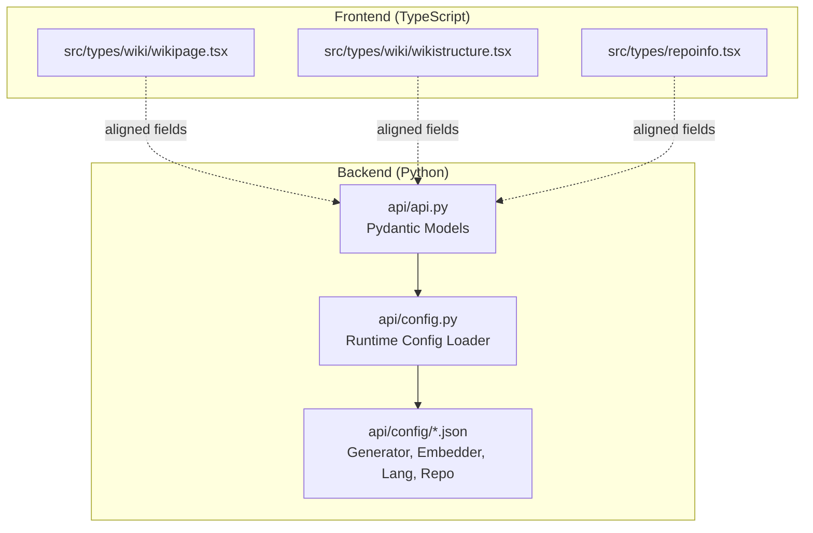
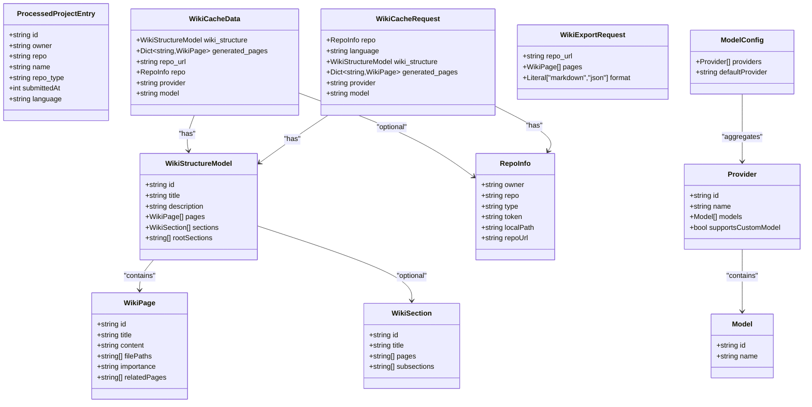
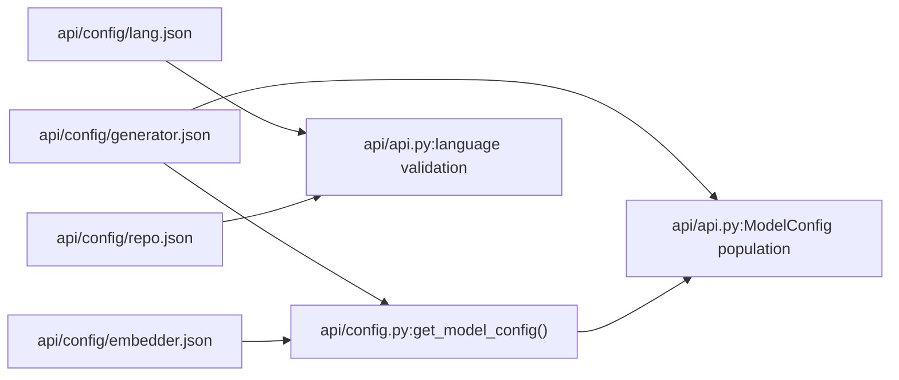
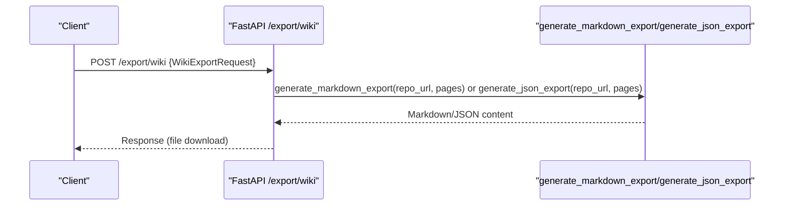
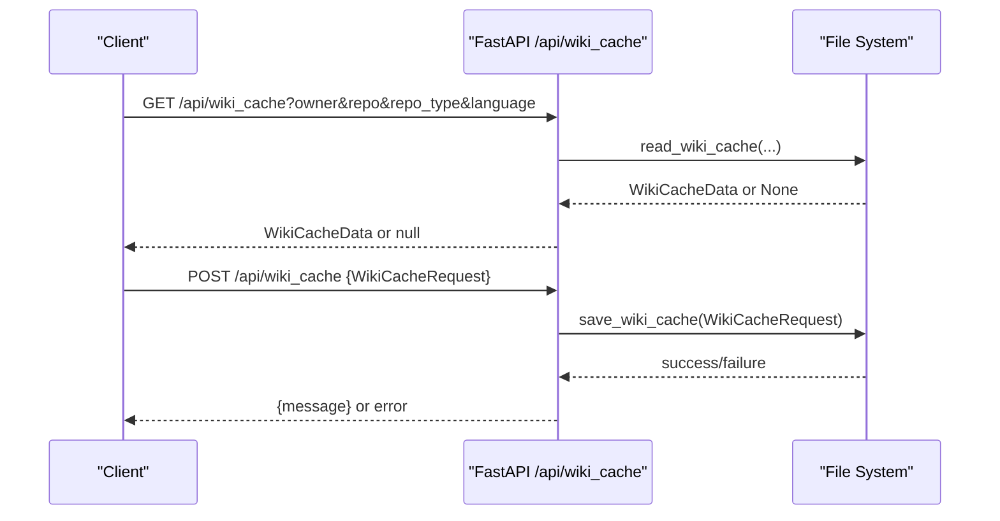

# API Data Models

<cite>
**Referenced Files in This Document**
- [api/api.py](file://api/api.py)
- [api/config.py](file://api/config.py)
- [api/config/generator.json](file://api/config/generator.json)
- [api/config/embedder.json](file://api/config/embedder.json)
- [api/config/lang.json](file://api/config/lang.json)
- [api/config/repo.json](file://api/config/repo.json)
- [src/types/wiki/wikipage.tsx](file://src/types/wiki/wikipage.tsx)
- [src/types/wiki/wikistructure.tsx](file://src/types/wiki/wikistructure.tsx)
- [src/types/repoinfo.tsx](file://src/types/repoinfo.tsx)
</cite>

## Table of Contents
1. [Introduction](#introduction)
2. [Project Structure](#project-structure)
3. [Core Components](#core-components)
4. [Architecture Overview](#architecture-overview)
5. [Detailed Component Analysis](#detailed-component-analysis)
6. [Dependency Analysis](#dependency-analysis)
7. [Performance Considerations](#performance-considerations)
8. [Troubleshooting Guide](#troubleshooting-guide)
9. [Conclusion](#conclusion)
10. [Appendices](#appendices)

## Introduction
This document provides comprehensive data model documentation for DeepWiki-Open’s API request/response schemas. It focuses on the Pydantic models defined in the backend and their relationships, including WikiPage, WikiStructureModel, RepoInfo, ProcessedProjectEntry, WikiCacheData, WikiCacheRequest, WikiExportRequest, Model, Provider, and ModelConfig. It also documents serialization/deserialization behavior, validation rules, and practical guidelines for extending models while maintaining backward compatibility. Frontend TypeScript interfaces are included for cross-language alignment.

## Project Structure
The API data models are primarily defined in the backend Python module and complemented by configuration files and frontend TypeScript interfaces.

**Diagram sources**
- [api/api.py](file://api/api.py#L39-L146)
- [api/config.py](file://api/config.py#L1-L464)
- [api/config/generator.json](file://api/config/generator.json#L1-L101)
- [api/config/embedder.json](file://api/config/embedder.json#L1-L35)
- [api/config/lang.json](file://api/config/lang.json#L1-L16)
- [api/config/repo.json](file://api/config/repo.json#L1-L129)
- [src/types/wiki/wikipage.tsx](file://src/types/wiki/wikipage.tsx#L1-L13)
- [src/types/wiki/wikistructure.tsx](file://src/types/wiki/wikistructure.tsx#L1-L11)
- [src/types/repoinfo.tsx](file://src/types/repoinfo.tsx#L1-L11)

**Section sources**
- [api/api.py](file://api/api.py#L39-L146)
- [api/config.py](file://api/config.py#L1-L464)
- [api/config/generator.json](file://api/config/generator.json#L1-L101)
- [api/config/embedder.json](file://api/config/embedder.json#L1-L35)
- [api/config/lang.json](file://api/config/lang.json#L1-L16)
- [api/config/repo.json](file://api/config/repo.json#L1-L129)
- [src/types/wiki/wikipage.tsx](file://src/types/wiki/wikipage.tsx#L1-L13)
- [src/types/wiki/wikistructure.tsx](file://src/types/wiki/wikistructure.tsx#L1-L11)
- [src/types/repoinfo.tsx](file://src/types/repoinfo.tsx#L1-L11)

## Core Components
This section summarizes the primary Pydantic models and their roles in the API.

- WikiPage: Represents a single wiki page with identifiers, content, file paths, importance, and related pages.
- WikiStructureModel: Encapsulates the overall wiki structure with pages, optional sections, and root sections.
- RepoInfo: Describes repository metadata and optional credentials/paths.
- ProcessedProjectEntry: Derived from cache filenames to expose processed project listings.
- WikiCacheData: Serializable cache payload combining structure, generated pages, and provider/model info.
- WikiCacheRequest: Request body for storing wiki cache.
- WikiExportRequest: Request body for exporting wiki content in markdown or JSON.
- Model: Lightweight model descriptor used within Provider.
- Provider: Provider descriptor with a list of Model items and capability flags.
- ModelConfig: Top-level configuration aggregating providers and default provider.

Validation and serialization:
- Pydantic enforces field types and presence (required fields marked with ellipsis).
- model_dump()/model_dump_json() are used for serialization in cache operations.
- Optional fields support None values; defaults are defined per field.

**Section sources**
- [api/api.py](file://api/api.py#L40-L146)

## Architecture Overview
The data models underpin API endpoints for model configuration retrieval, wiki export, and cache read/write operations. Configuration files drive runtime behavior and provider/model availability.

**Diagram sources**
- [api/api.py](file://api/api.py#L40-L146)

## Detailed Component Analysis

### WikiPage
- Purpose: Represents a single wiki page with identifiers, content, file paths, importance, and related pages.
- Fields:
  - id: string
  - title: string
  - content: string
  - filePaths: List[str]
  - importance: string constrained to a literal set in usage contexts
  - relatedPages: List[str]
- Validation and behavior:
  - Required fields are enforced by Pydantic.
  - Used extensively in export flows and cache payloads.
- Serialization:
  - model_dump() used for JSON export generation.

Example JSON payload (exported form):
{
  "id": "getting-started",
  "title": "Getting Started",
  "content": "# Welcome to DeepWiki-Open\n\n...",
  "filePaths": ["README.md", "docs/intro.md"],
  "importance": "high",
  "relatedPages": ["installation", "faq"]
}

Frontend alignment:
- The frontend interface extends WikiPage with optional hierarchy fields (parentId, isSection, children) to support tree rendering.

**Section sources**
- [api/api.py](file://api/api.py#L40-L50)
- [src/types/wiki/wikipage.tsx](file://src/types/wiki/wikipage.tsx#L1-L13)

### WikiStructureModel
- Purpose: Encapsulates the overall wiki structure with pages, optional sections, and root sections.
- Fields:
  - id: string
  - title: string
  - description: string
  - pages: List[WikiPage]
  - sections: Optional[List[WikiSection]]
  - rootSections: Optional[List[str]]
- Validation and behavior:
  - Optional sections and rootSections enable flexible hierarchical structures.
- Serialization:
  - model_dump() used for cache payloads and export.

Example JSON payload:
{
  "id": "deepwiki-open-wiki",
  "title": "DeepWiki-Open Wiki",
  "description": "Generated documentation for the repository.",
  "pages": [ /* array of WikiPage */ ],
  "sections": [
    {
      "id": "docs",
      "title": "Documentation",
      "pages": ["readme", "contributing"],
      "subsections": ["tutorials"]
    }
  ],
  "rootSections": ["docs", "tutorials"]
}

**Section sources**
- [api/api.py](file://api/api.py#L79-L88)

### RepoInfo
- Purpose: Describes repository metadata and optional credentials/paths.
- Fields:
  - owner: string
  - repo: string
  - type: string
  - token: Optional[string]
  - localPath: Optional[string]
  - repoUrl: Optional[string]
- Validation and behavior:
  - Optional fields allow flexibility for local vs remote repositories.
- Serialization:
  - model_dump() used in cache requests and processed project extraction.

Example JSON payload:
{
  "owner": "AsyncFuncAI",
  "repo": "deepwiki-open",
  "type": "github",
  "token": "ghp_xxx",
  "localPath": "/opt/repos/deepwiki-open",
  "repoUrl": "https://github.com/AsyncFuncAI/deepwiki-open.git"
}

Frontend alignment:
- The frontend RepoInfo interface adds an optional branch field.

**Section sources**
- [api/api.py](file://api/api.py#L60-L66)
- [src/types/repoinfo.tsx](file://src/types/repoinfo.tsx#L1-L11)

### ProcessedProjectEntry
- Purpose: Derived from cache filenames to expose processed project listings.
- Fields:
  - id: string (filename)
  - owner: string
  - repo: string
  - name: string (owner/repo)
  - repo_type: string (renamed from type)
  - submittedAt: int (milliseconds epoch)
  - language: string
- Validation and behavior:
  - Constructed from cache filenames with a fixed naming convention.
  - Sorted by recency for display.

Example JSON payload:
{
  "id": "deepwiki_cache_github_AsyncFuncAI_deepwiki-open_en.json",
  "owner": "AsyncFuncAI",
  "repo": "deepwiki-open",
  "name": "AsyncFuncAI/deepwiki-open",
  "repo_type": "github",
  "submittedAt": 1700000000000,
  "language": "en"
}

**Section sources**
- [api/api.py](file://api/api.py#L51-L58)

### WikiCacheData
- Purpose: Serializable cache payload combining structure, generated pages, and provider/model info.
- Fields:
  - wiki_structure: WikiStructureModel
  - generated_pages: Dict[str, WikiPage]
  - repo_url: Optional[string] (backward compatibility)
  - repo: Optional[RepoInfo]
  - provider: Optional[string]
  - model: Optional[string]
- Validation and behavior:
  - Optional fields support legacy caches without explicit repo/provider/model.
- Serialization:
  - model_dump()/model_dump_json() used for persistence and transport.

Example JSON payload:
{
  "wiki_structure": { /* WikiStructureModel */ },
  "generated_pages": {
    "readme": { /* WikiPage */ },
    "installation": { /* WikiPage */ }
  },
  "repo_url": "https://github.com/AsyncFuncAI/deepwiki-open.git",
  "repo": { /* RepoInfo */ },
  "provider": "github_copilot",
  "model": "gpt-4o"
}

**Section sources**
- [api/api.py](file://api/api.py#L90-L99)

### WikiCacheRequest
- Purpose: Request body for storing wiki cache.
- Fields:
  - repo: RepoInfo
  - language: string
  - wiki_structure: WikiStructureModel
  - generated_pages: Dict[str, WikiPage]
  - provider: string
  - model: string
- Validation and behavior:
  - Required fields enforce complete cache payloads.
- Serialization:
  - model_dump() used for persistence.

Example JSON payload:
{
  "repo": { /* RepoInfo */ },
  "language": "en",
  "wiki_structure": { /* WikiStructureModel */ },
  "generated_pages": {
    "readme": { /* WikiPage */ }
  },
  "provider": "github_copilot",
  "model": "gpt-4o"
}

**Section sources**
- [api/api.py](file://api/api.py#L101-L110)

### WikiExportRequest
- Purpose: Request body for exporting wiki content in markdown or JSON.
- Fields:
  - repo_url: string
  - pages: List[WikiPage]
  - format: Literal["markdown", "json"]
- Validation and behavior:
  - format constrained to predefined literals.
- Serialization:
  - model_dump() used for export generation.

Example JSON payload:
{
  "repo_url": "https://github.com/AsyncFuncAI/deepwiki-open.git",
  "pages": [ { /* WikiPage */ } ],
  "format": "markdown"
}

**Section sources**
- [api/api.py](file://api/api.py#L112-L118)

### Model, Provider, ModelConfig
- Purpose: Describe available LLM providers and their models.
- Fields:
  - Model: id, name
  - Provider: id, name, models (List[Model]), supportsCustomModel (default False)
  - ModelConfig: providers (List[Provider]), defaultProvider (string)
- Validation and behavior:
  - Providers and models are populated from configuration files at runtime.
  - Supports custom model flag indicates provider capability.
- Serialization:
  - model_dump() used for serving configuration via GET /models/config.

Example JSON payload:
{
  "providers": [
    {
      "id": "github_copilot",
      "name": "GitHub Copilot",
      "models": [
        { "id": "gpt-4o", "name": "gpt-4o" },
        { "id": "gpt-4o-mini", "name": "gpt-4o-mini" }
      ],
      "supportsCustomModel": true
    }
  ],
  "defaultProvider": "github_copilot"
}

**Section sources**
- [api/api.py](file://api/api.py#L120-L146)
- [api/config.py](file://api/config.py#L178-L225)
- [api/config/generator.json](file://api/config/generator.json#L1-L101)

## Dependency Analysis
The API runtime depends on configuration files to populate provider and model information. The configuration loader resolves client classes and model parameters, which influence how ModelConfig is constructed.

**Diagram sources**
- [api/config/generator.json](file://api/config/generator.json#L1-L101)
- [api/config/embedder.json](file://api/config/embedder.json#L1-L35)
- [api/config/lang.json](file://api/config/lang.json#L1-L16)
- [api/config/repo.json](file://api/config/repo.json#L1-L129)
- [api/config.py](file://api/config.py#L381-L464)
- [api/api.py](file://api/api.py#L471-L495)

**Section sources**
- [api/config.py](file://api/config.py#L381-L464)
- [api/api.py](file://api/api.py#L471-L495)

## Performance Considerations
- Large payloads: WikiCacheData and WikiExportRequest can carry substantial content. Prefer streaming or chunked processing when applicable.
- Serialization overhead: model_dump_json() is used for logging payload sizes; avoid serializing extremely large payloads unnecessarily.
- Optional fields: Using Optional fields reduces memory footprint for legacy caches but requires null checks in consumers.
- Language validation: Normalize language codes against supported languages to prevent misconfiguration.

[No sources needed since this section provides general guidance]

## Troubleshooting Guide
Common issues and resolutions:
- Missing required fields in requests: Ensure all ellipsis-required fields are present in WikiCacheRequest, WikiExportRequest, and ModelConfig population.
- Unsupported language: The API validates language against supported languages; fall back to default if unsupported.
- Cache read/write failures: Inspect IO errors during save_wiki_cache and read_wiki_cache; verify permissions and disk space.
- Authorization: Deleting cache requires a valid authorization code when authentication mode is enabled.

**Section sources**
- [api/api.py](file://api/api.py#L471-L495)
- [api/api.py](file://api/api.py#L504-L538)
- [api/config.py](file://api/config.py#L280-L307)

## Conclusion
The API’s data models form a cohesive schema for representing wiki content, repository metadata, provider configurations, and cache operations. By leveraging Pydantic’s validation and serialization, the system ensures robust request/response handling. Configuration-driven provider/model discovery enables extensibility without hardcoding provider specifics. Following the extension and compatibility guidelines below will help maintain stability as the system evolves.

[No sources needed since this section summarizes without analyzing specific files]

## Appendices

### API Workflows and Data Flow

#### Export Workflow

**Diagram sources**
- [api/api.py](file://api/api.py#L227-L273)
- [api/api.py](file://api/api.py#L322-L391)

#### Cache Read/Write Workflow

**Diagram sources**
- [api/api.py](file://api/api.py#L461-L502)
- [api/api.py](file://api/api.py#L413-L457)

### Guidelines for Extending Models and Maintaining Backward Compatibility
- Keep new fields Optional with sensible defaults to avoid breaking existing clients.
- Use Literal unions for constrained enums to preserve strictness.
- When adding fields to cache payloads, retain optional legacy fields to support older caches.
- Align frontend TypeScript interfaces with backend models to minimize drift.
- Centralize configuration (generator.json, lang.json, repo.json) to drive behavior changes without code modifications.
- Validate inputs early in endpoints and normalize values (e.g., language codes) before processing.

[No sources needed since this section provides general guidance]