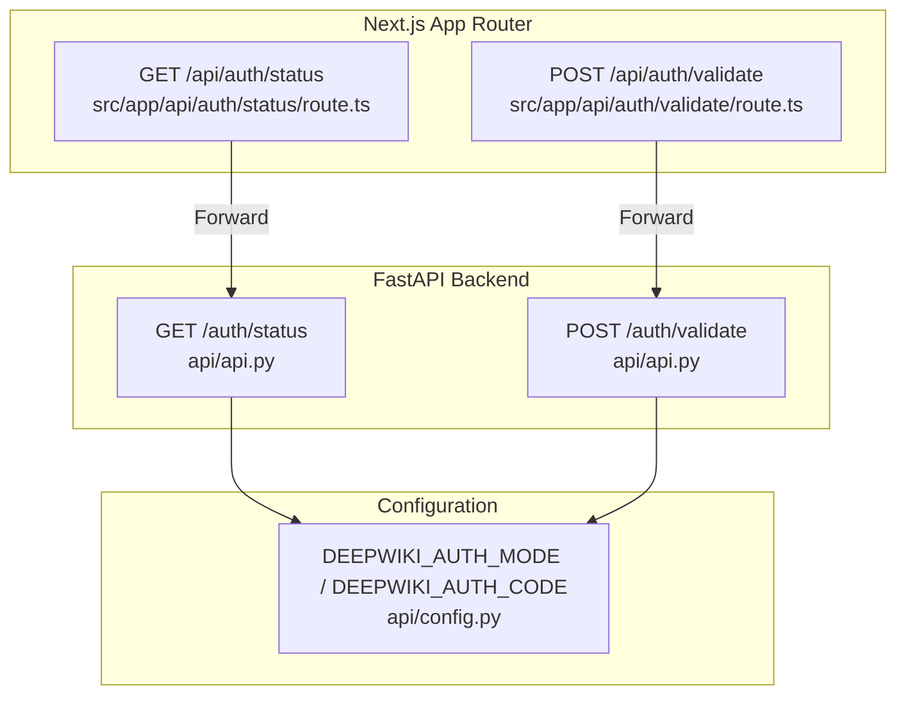
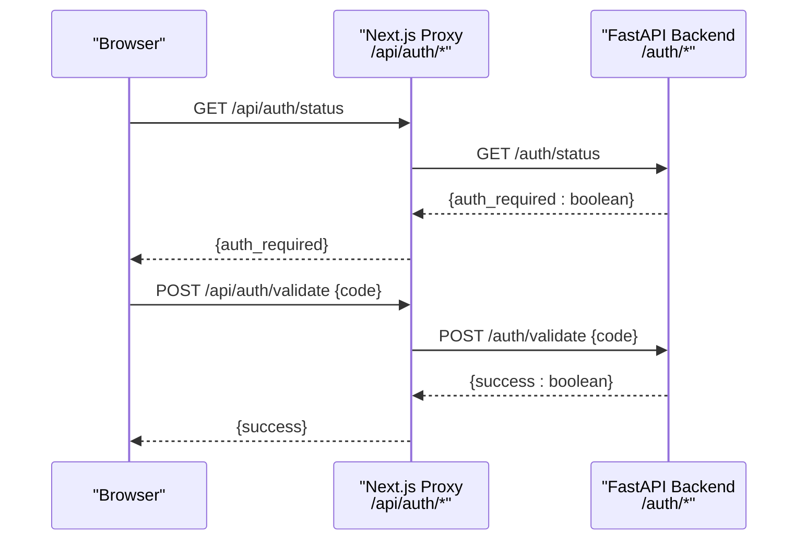
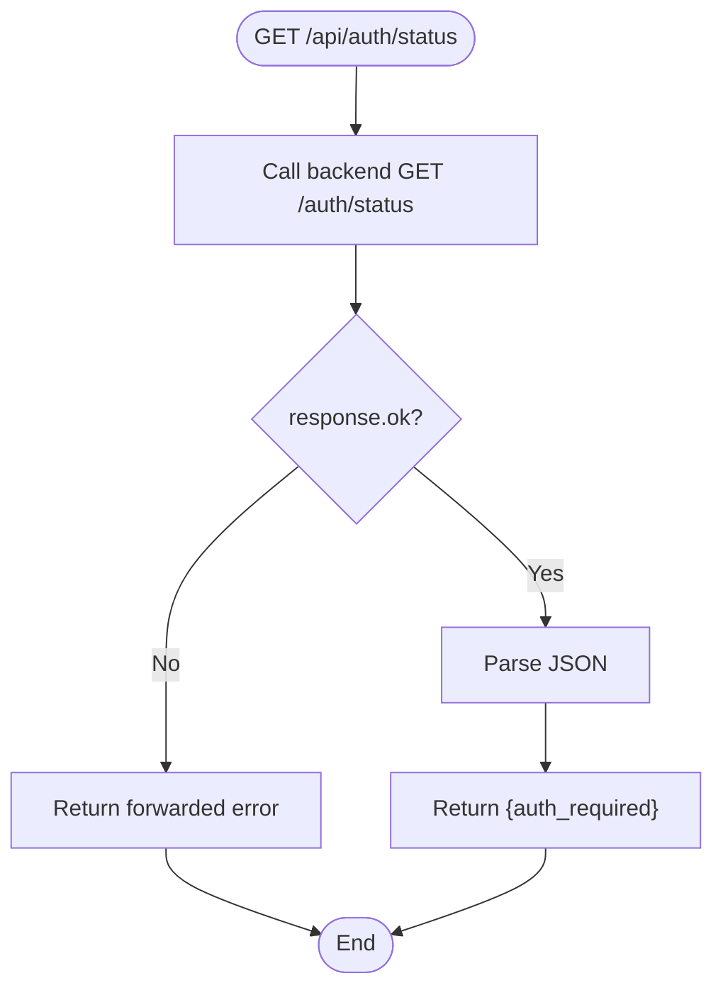
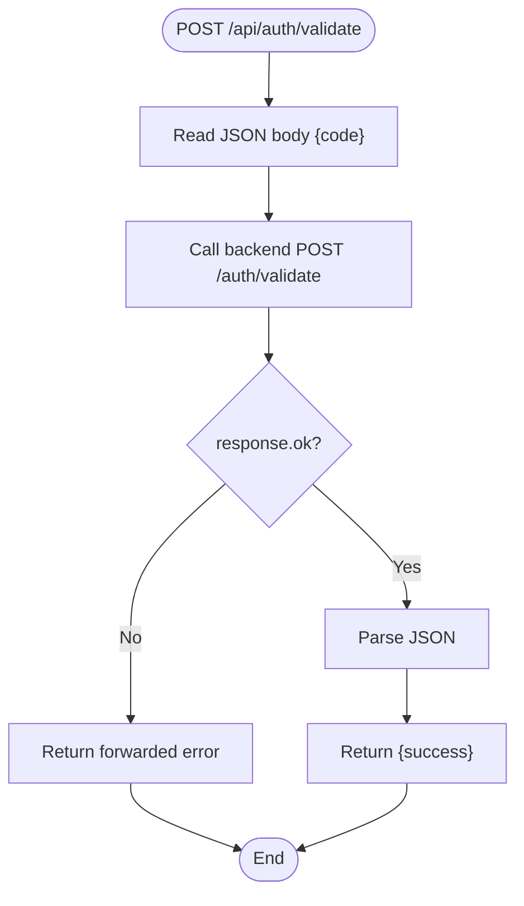
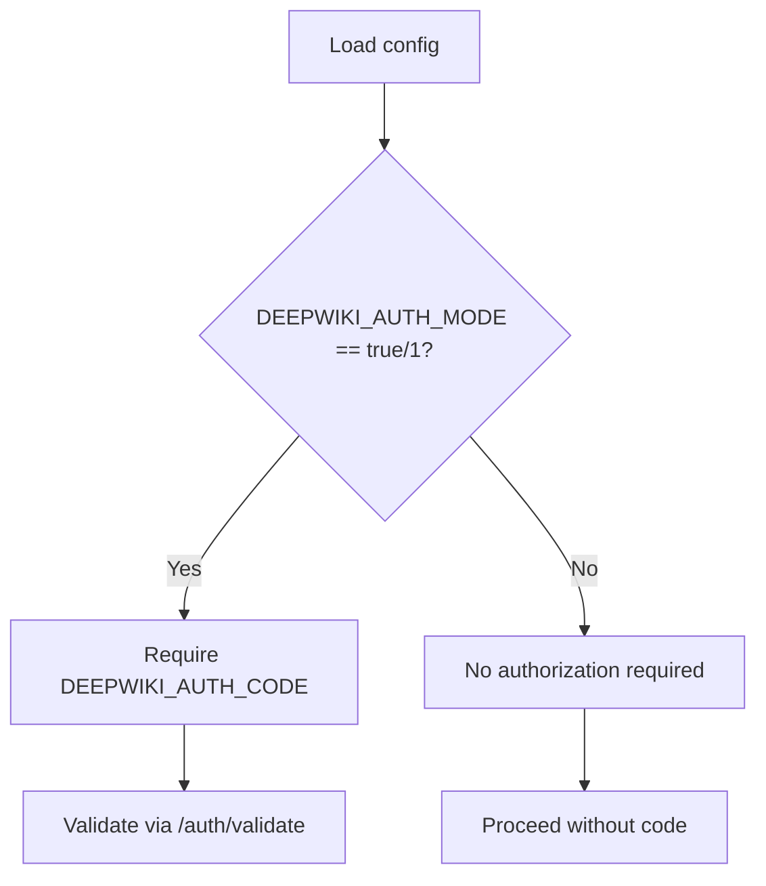
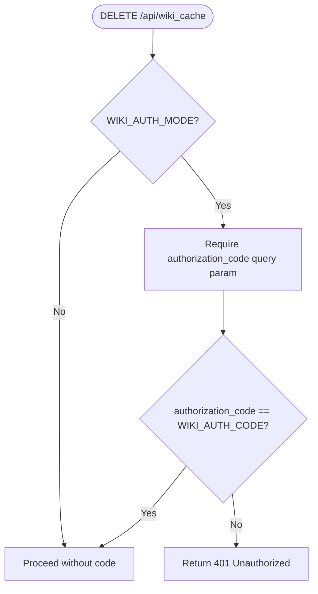
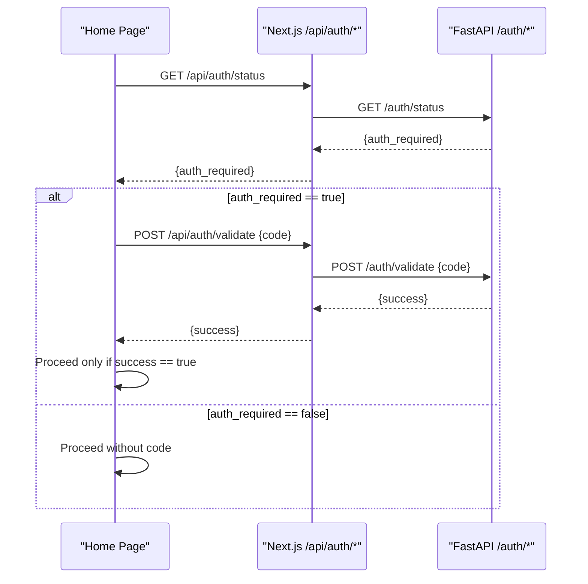
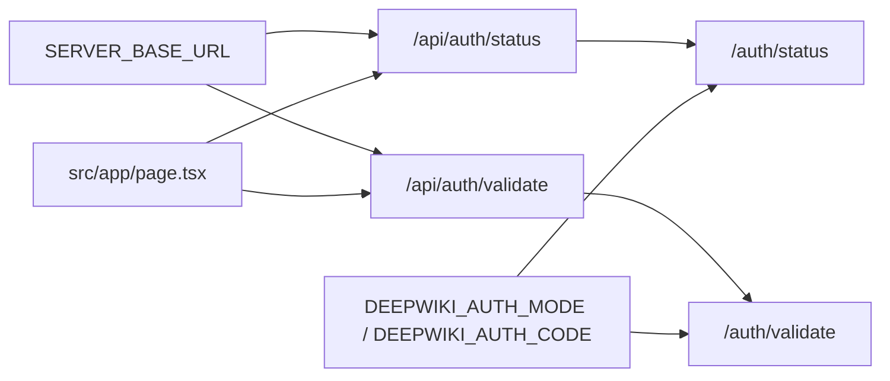

# Authentication Endpoints

<cite>
**Referenced Files in This Document**
- [src/app/api/auth/status/route.ts](file://src/app/api/auth/status/route.ts)
- [src/app/api/auth/validate/route.ts](file://src/app/api/auth/validate/route.ts)
- [api/api.py](file://api/api.py)
- [api/config.py](file://api/config.py)
- [src/app/page.tsx](file://src/app/page.tsx)
- [README.md](file://README.md)
</cite>

## Table of Contents
1. [Introduction](#introduction)
2. [Project Structure](#project-structure)
3. [Core Components](#core-components)
4. [Architecture Overview](#architecture-overview)
5. [Detailed Component Analysis](#detailed-component-analysis)
6. [Dependency Analysis](#dependency-analysis)
7. [Performance Considerations](#performance-considerations)
8. [Troubleshooting Guide](#troubleshooting-guide)
9. [Conclusion](#conclusion)

## Introduction
This document describes the authentication API for DeepWiki-Open’s authorization system. It focuses on two endpoints:
- GET /auth/status: checks whether authorization mode is enabled.
- POST /auth/validate: validates an authorization code provided by the client.

It explains how wiki authentication is configured, what authorization code requirements are, how protected operations are guarded, and how to implement secure client-side authentication workflows. It also covers error handling and production security best practices.

## Project Structure
The authentication endpoints are implemented in the Next.js app router under src/app/api/auth. They forward requests to the FastAPI backend, which exposes /auth/status and /auth/validate.

**Diagram sources**
- [src/app/api/auth/status/route.ts](file://src/app/api/auth/status/route.ts#L1-L32)
- [src/app/api/auth/validate/route.ts](file://src/app/api/auth/validate/route.ts#L1-L35)
- [api/api.py](file://api/api.py#L153-L165)
- [api/config.py](file://api/config.py#L49-L52)

**Section sources**
- [src/app/api/auth/status/route.ts](file://src/app/api/auth/status/route.ts#L1-L32)
- [src/app/api/auth/validate/route.ts](file://src/app/api/auth/validate/route.ts#L1-L35)
- [api/api.py](file://api/api.py#L153-L165)
- [api/config.py](file://api/config.py#L49-L52)

## Core Components
- Next.js proxy routes:
  - GET /api/auth/status forwards to the backend and returns the authorization mode flag.
  - POST /api/auth/validate forwards the client-provided code to the backend and returns success or failure.
- FastAPI endpoints:
  - GET /auth/status returns a boolean indicating whether authorization mode is enabled.
  - POST /auth/validate compares the provided code against the configured secret and returns success or failure.
- Configuration:
  - DEEPWIKI_AUTH_MODE toggles authorization mode.
  - DEEPWIKI_AUTH_CODE is the secret code required when authorization mode is enabled.

Protected operations:
- Cache deletion (/api/wiki_cache DELETE) checks authorization when DEEPWIKI_AUTH_MODE is enabled.
- Frontend initiation of wiki generation is gated by client-side validation using /api/auth/status and /api/auth/validate.

**Section sources**
- [src/app/api/auth/status/route.ts](file://src/app/api/auth/status/route.ts#L5-L31)
- [src/app/api/auth/validate/route.ts](file://src/app/api/auth/validate/route.ts#L5-L34)
- [api/api.py](file://api/api.py#L153-L165)
- [api/api.py](file://api/api.py#L520-L524)
- [api/config.py](file://api/config.py#L49-L52)
- [README.md](file://README.md#L503-L514)

## Architecture Overview
The client authenticates by first checking authorization mode and then validating the code. The backend enforces authorization mode and code validation centrally.

**Diagram sources**
- [src/app/api/auth/status/route.ts](file://src/app/api/auth/status/route.ts#L5-L31)
- [src/app/api/auth/validate/route.ts](file://src/app/api/auth/validate/route.ts#L5-L34)
- [api/api.py](file://api/api.py#L153-L165)

## Detailed Component Analysis

### Endpoint: GET /auth/status
- Purpose: Returns whether authorization mode is enabled.
- Behavior:
  - Next.js route forwards the request to the backend.
  - Backend returns a JSON object with a boolean flag indicating authorization mode.
- Typical responses:
  - 200 OK: {"auth_required": true|false}
  - Non-200: Propagates backend error with JSON body and status.

**Diagram sources**
- [src/app/api/auth/status/route.ts](file://src/app/api/auth/status/route.ts#L5-L31)
- [api/api.py](file://api/api.py#L153-L158)

**Section sources**
- [src/app/api/auth/status/route.ts](file://src/app/api/auth/status/route.ts#L5-L31)
- [api/api.py](file://api/api.py#L153-L158)

### Endpoint: POST /auth/validate
- Purpose: Validates the provided authorization code.
- Behavior:
  - Next.js route reads the JSON body and forwards it to the backend.
  - Backend compares the incoming code with the configured secret and returns success or failure.
- Typical responses:
  - 200 OK: {"success": true|false}
  - Non-200: Propagates backend error with JSON body and status.

**Diagram sources**
- [src/app/api/auth/validate/route.ts](file://src/app/api/auth/validate/route.ts#L5-L34)
- [api/api.py](file://api/api.py#L160-L165)

**Section sources**
- [src/app/api/auth/validate/route.ts](file://src/app/api/auth/validate/route.ts#L5-L34)
- [api/api.py](file://api/api.py#L160-L165)

### Configuration: Authorization Mode and Code
- DEEPWIKI_AUTH_MODE:
  - When true or 1, authorization mode is enabled.
  - When false or unset, authorization mode is disabled.
- DEEPWIKI_AUTH_CODE:
  - Secret code required when authorization mode is enabled.
- Backend enforcement:
  - /auth/status returns the current mode.
  - /auth/validate compares the provided code with the configured secret.
  - Cache deletion endpoint additionally checks authorization when enabled.

**Diagram sources**
- [api/config.py](file://api/config.py#L49-L52)
- [api/api.py](file://api/api.py#L153-L165)
- [api/api.py](file://api/api.py#L520-L524)

**Section sources**
- [api/config.py](file://api/config.py#L49-L52)
- [api/api.py](file://api/api.py#L153-L165)
- [api/api.py](file://api/api.py#L520-L524)
- [README.md](file://README.md#L503-L514)

### Protected Operations
- Cache deletion (/api/wiki_cache DELETE) enforces authorization when DEEPWIKI_AUTH_MODE is enabled. It checks for an authorization_code query parameter and compares it to DEEPWIKI_AUTH_CODE, returning 401 on mismatch.
- Frontend initiation of wiki generation is gated by client-side validation using /api/auth/status and /api/auth/validate before proceeding to generate a wiki.

**Diagram sources**
- [api/api.py](file://api/api.py#L520-L524)

**Section sources**
- [api/api.py](file://api/api.py#L520-L524)
- [src/app/page.tsx](file://src/app/page.tsx#L157-L178)
- [src/app/page.tsx](file://src/app/page.tsx#L271-L294)

### Client-Side Authentication Workflow
- On page load, fetch /api/auth/status to determine if authorization is required.
- If required, prompt the user for the authorization code and call /api/auth/validate to confirm.
- Only after successful validation, proceed to initiate wiki generation.

**Diagram sources**
- [src/app/page.tsx](file://src/app/page.tsx#L157-L178)
- [src/app/page.tsx](file://src/app/page.tsx#L271-L294)
- [src/app/api/auth/status/route.ts](file://src/app/api/auth/status/route.ts#L5-L31)
- [src/app/api/auth/validate/route.ts](file://src/app/api/auth/validate/route.ts#L5-L34)
- [api/api.py](file://api/api.py#L153-L165)

**Section sources**
- [src/app/page.tsx](file://src/app/page.tsx#L157-L178)
- [src/app/page.tsx](file://src/app/page.tsx#L271-L294)

## Dependency Analysis
- Next.js proxy routes depend on SERVER_BASE_URL environment variable to reach the backend.
- Backend endpoints depend on configuration loaded from environment variables for authorization mode and code.
- Frontend depends on Next.js proxy endpoints to check authorization and validate codes.

**Diagram sources**
- [src/app/api/auth/status/route.ts](file://src/app/api/auth/status/route.ts#L3)
- [src/app/api/auth/validate/route.ts](file://src/app/api/auth/validate/route.ts#L3)
- [api/api.py](file://api/api.py#L153-L165)
- [api/config.py](file://api/config.py#L49-L52)
- [src/app/page.tsx](file://src/app/page.tsx#L157-L178)

**Section sources**
- [src/app/api/auth/status/route.ts](file://src/app/api/auth/status/route.ts#L3)
- [src/app/api/auth/validate/route.ts](file://src/app/api/auth/validate/route.ts#L3)
- [api/api.py](file://api/api.py#L153-L165)
- [api/config.py](file://api/config.py#L49-L52)
- [src/app/page.tsx](file://src/app/page.tsx#L157-L178)

## Performance Considerations
- The proxy routes perform a single outbound HTTP call to the backend and return the response directly. Latency is dominated by network round-trip and backend processing.
- Keep authorization mode and code configuration static and avoid frequent changes to minimize client-side re-checks.
- Consider caching the authorization status on the client for a short period to reduce redundant calls during a single session.

## Troubleshooting Guide
- Symptom: Authorization mode appears required but no code is enforced.
  - Cause: DEEPWIKI_AUTH_MODE is not set to true or 1.
  - Resolution: Set DEEPWIKI_AUTH_MODE=true and DEEPWIKI_AUTH_CODE=<secret>.
- Symptom: Validation always fails.
  - Cause: Provided code does not match DEEPWIKI_AUTH_CODE.
  - Resolution: Ensure the client sends the exact code configured in DEEPWIKI_AUTH_CODE.
- Symptom: 500 Internal Server Error from /api/auth/*.
  - Cause: Backend unreachable or misconfigured SERVER_BASE_URL.
  - Resolution: Verify SERVER_BASE_URL points to the running FastAPI service and that the backend is healthy.
- Symptom: Cache deletion returns 401 Unauthorized.
  - Cause: Authorization mode enabled but missing or incorrect authorization_code query parameter.
  - Resolution: Provide the correct authorization_code query parameter matching DEEPWIKI_AUTH_CODE.

**Section sources**
- [api/config.py](file://api/config.py#L49-L52)
- [api/api.py](file://api/api.py#L520-L524)
- [src/app/api/auth/status/route.ts](file://src/app/api/auth/status/route.ts#L15-L20)
- [src/app/api/auth/validate/route.ts](file://src/app/api/auth/validate/route.ts#L18-L23)

## Conclusion
DeepWiki-Open’s authorization system uses a simple, centralized approach:
- Authorization mode is controlled by environment variables.
- Clients check authorization mode via GET /auth/status and validate a code via POST /auth/validate.
- Protected operations enforce authorization when enabled.
- The proxy routes provide a clean separation between the frontend and backend while preserving security.

For production deployments, ensure environment variables are set securely, restrict access to the backend service, and consider additional protections such as rate limiting and HTTPS termination at the edge.