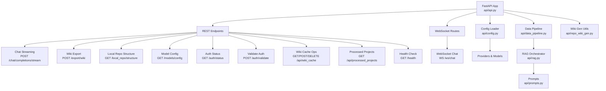
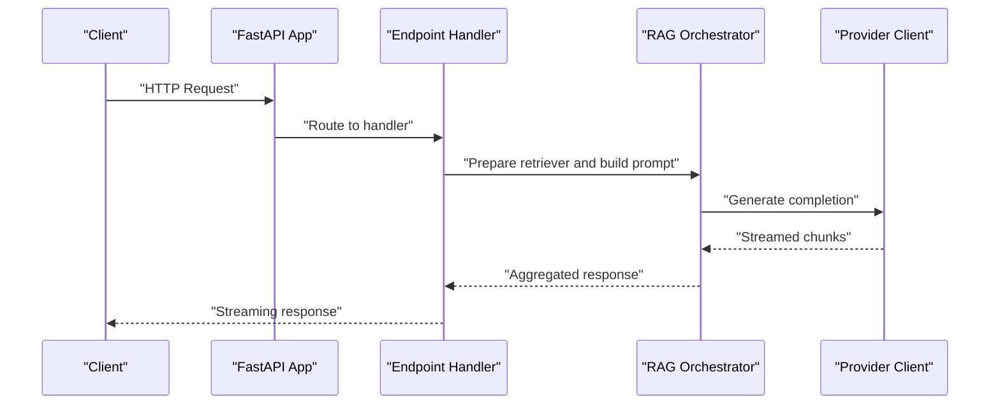
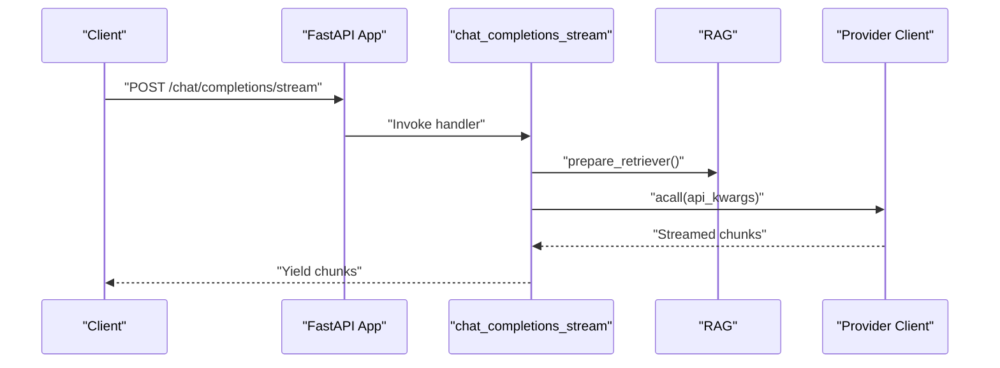
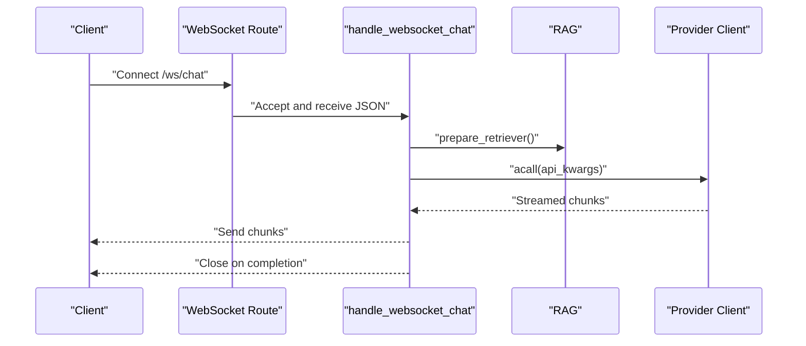
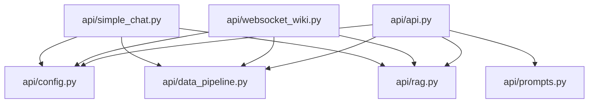

# Backend API Reference

<cite>
**Referenced Files in This Document**
- [api/main.py](file://api/main.py)
- [api/api.py](file://api/api.py)
- [api/websocket_wiki.py](file://api/websocket_wiki.py)
- [api/simple_chat.py](file://api/simple_chat.py)
- [api/config.py](file://api/config.py)
- [api/data_pipeline.py](file://api/data_pipeline.py)
- [api/rag.py](file://api/rag.py)
- [api/prompts.py](file://api/prompts.py)
- [api/repo_wiki_gen.py](file://api/repo_wiki_gen.py)
</cite>

## Table of Contents
1. [Introduction](#introduction)
2. [Project Structure](#project-structure)
3. [Core Components](#core-components)
4. [Architecture Overview](#architecture-overview)
5. [Detailed Component Analysis](#detailed-component-analysis)
6. [Dependency Analysis](#dependency-analysis)
7. [Performance Considerations](#performance-considerations)
8. [Troubleshooting Guide](#troubleshooting-guide)
9. [Conclusion](#conclusion)
10. [Appendices](#appendices)

## Introduction
This document provides comprehensive API documentation for DeepWiki-Open’s backend built with FastAPI. It covers:
- REST endpoints for chat streaming, wiki export, repository structure inspection, model configuration, authentication, cache management, and health checks
- WebSocket API for real-time chat completions
- Authentication modes, environment configuration, and provider integrations
- Request/response schemas, error handling, rate limiting considerations, and versioning
- Client implementation guidelines, performance optimization tips, and debugging approaches

## Project Structure
The backend is organized around a FastAPI application with modular components:
- REST endpoints: defined in the main API module
- WebSocket handlers: dedicated module for real-time chat
- Configuration and provider integrations: centralized configuration loader
- Data pipeline and RAG: repository processing, embedding, and retrieval
- Prompts and templates: reusable prompt definitions
- Wiki generation utilities: data structures and helpers for wiki orchestration

**Diagram sources**
- [api/api.py](file://api/api.py#L1-L635)
- [api/websocket_wiki.py](file://api/websocket_wiki.py#L1-L978)
- [api/config.py](file://api/config.py#L1-L464)
- [api/data_pipeline.py](file://api/data_pipeline.py#L1-L917)
- [api/rag.py](file://api/rag.py#L1-L446)
- [api/prompts.py](file://api/prompts.py#L1-L192)
- [api/repo_wiki_gen.py](file://api/repo_wiki_gen.py#L1-L550)

**Section sources**
- [api/api.py](file://api/api.py#L1-L635)
- [api/websocket_wiki.py](file://api/websocket_wiki.py#L1-L978)
- [api/config.py](file://api/config.py#L1-L464)
- [api/data_pipeline.py](file://api/data_pipeline.py#L1-L917)
- [api/rag.py](file://api/rag.py#L1-L446)
- [api/prompts.py](file://api/prompts.py#L1-L192)
- [api/repo_wiki_gen.py](file://api/repo_wiki_gen.py#L1-L550)

## Core Components
- FastAPI application with CORS enabled and logging configured
- REST endpoints for:
  - Chat streaming via HTTP
  - Wiki export to Markdown/JSON
  - Local repository structure inspection
  - Model configuration discovery
  - Authentication status and validation
  - Wiki cache read/write/delete
  - Processed projects listing
  - Health checks
- WebSocket endpoint for real-time chat completions
- Configuration loader for providers, models, languages, and filters
- Data pipeline for repository ingestion, token counting, and embedding
- RAG orchestrator for retrieval augmented generation
- Prompt templates for RAG and chat modes

**Section sources**
- [api/api.py](file://api/api.py#L1-L635)
- [api/config.py](file://api/config.py#L1-L464)
- [api/data_pipeline.py](file://api/data_pipeline.py#L1-L917)
- [api/rag.py](file://api/rag.py#L1-L446)
- [api/prompts.py](file://api/prompts.py#L1-L192)

## Architecture Overview
High-level runtime flow:
- Clients call REST endpoints for chat streaming or cache operations
- WebSocket clients connect to the chat endpoint for real-time streaming
- Requests are validated and routed to handlers
- Handlers prepare RAG retrievers, build prompts, and call provider clients
- Responses are streamed back to clients

**Diagram sources**
- [api/api.py](file://api/api.py#L1-L635)
- [api/simple_chat.py](file://api/simple_chat.py#L1-L900)
- [api/websocket_wiki.py](file://api/websocket_wiki.py#L1-L978)
- [api/rag.py](file://api/rag.py#L1-L446)

## Detailed Component Analysis

### REST Endpoints

#### Chat Streaming (HTTP)
- Method: POST
- Path: /chat/completions/stream
- Purpose: Stream chat completions for repository queries
- Request body schema: ChatCompletionRequest
  - repo_url: string (required)
  - messages: array of ChatMessage (required)
  - filePath: string (optional)
  - token: string (optional)
  - type: string enum "github"|"gitlab"|"bitbucket"|"local" (default "github")
  - provider: string (default "google")
  - model: string (optional)
  - language: string (default "en")
  - excluded_dirs: comma-separated string (optional)
  - excluded_files: comma-separated string (optional)
  - included_dirs: comma-separated string (optional)
  - included_files: comma-separated string (optional)
- Response: Server-Sent streaming of text chunks
- Behavior:
  - Validates last message role and non-empty messages
  - Builds conversation history and optional file content
  - Prepares RAG retriever with optional filters
  - Streams provider-specific responses
  - Applies fallback logic on token limit errors

**Diagram sources**
- [api/api.py](file://api/api.py#L76-L398)
- [api/simple_chat.py](file://api/simple_chat.py#L76-L800)
- [api/rag.py](file://api/rag.py#L345-L446)

**Section sources**
- [api/api.py](file://api/api.py#L76-L398)
- [api/simple_chat.py](file://api/simple_chat.py#L76-L800)
- [api/rag.py](file://api/rag.py#L345-L446)

#### Wiki Export
- Method: POST
- Path: /export/wiki
- Purpose: Export wiki pages as Markdown or JSON
- Request body schema: WikiExportRequest
  - repo_url: string (required)
  - pages: array of WikiPage (required)
  - format: literal "markdown"|"json" (required)
- Response: File download with appropriate Content-Type and Content-Disposition
- Behavior:
  - Generates Markdown or JSON content
  - Sets filename based on repo URL and timestamp
  - Returns HTTP 500 on error

**Section sources**
- [api/api.py](file://api/api.py#L227-L274)

#### Local Repository Structure
- Method: GET
- Path: /local_repo/structure
- Query parameters:
  - path: string (required)
- Response: JSON with file_tree and readme content
- Behavior:
  - Validates path existence
  - Walks directory excluding hidden and virtual env artifacts
  - Reads README content if present
  - Returns HTTP 400/404/500 on errors

**Section sources**
- [api/api.py](file://api/api.py#L275-L321)

#### Model Configuration
- Method: GET
- Path: /models/config
- Response schema: ModelConfig
  - providers: array of Provider
  - defaultProvider: string
- Behavior:
  - Loads provider configuration from config files
  - Returns default fallback on errors

**Section sources**
- [api/api.py](file://api/api.py#L167-L226)
- [api/config.py](file://api/config.py#L381-L464)

#### Authentication
- Status
  - Method: GET
  - Path: /auth/status
  - Response: JSON with auth_required flag
- Validate
  - Method: POST
  - Path: /auth/validate
  - Request body: AuthorizationConfig (code)
  - Response: JSON with success boolean

**Section sources**
- [api/api.py](file://api/api.py#L153-L166)
- [api/config.py](file://api/config.py#L49-L53)

#### Wiki Cache Management
- Get cache
  - Method: GET
  - Path: /api/wiki_cache
  - Query parameters:
    - owner: string (required)
    - repo: string (required)
    - repo_type: string (required)
    - language: string (required)
  - Response: WikiCacheData or null
- Store cache
  - Method: POST
  - Path: /api/wiki_cache
  - Request body: WikiCacheRequest
  - Response: JSON success message or HTTP 500
- Delete cache
  - Method: DELETE
  - Path: /api/wiki_cache
  - Query parameters:
    - owner: string (required)
    - repo: string (required)
    - repo_type: string (required)
    - language: string (required)
    - authorization_code: string (conditional)
  - Response: JSON success message or HTTP 401/404/500

**Section sources**
- [api/api.py](file://api/api.py#L461-L539)

#### Processed Projects
- Method: GET
- Path: /api/processed_projects
- Response: array of ProcessedProjectEntry
- Behavior:
  - Scans cache directory for project cache files
  - Parses filenames to extract project metadata
  - Sorts by most recent submission

**Section sources**
- [api/api.py](file://api/api.py#L577-L635)

#### Health Check
- Method: GET
- Path: /health
- Response: JSON with service status and timestamp

**Section sources**
- [api/api.py](file://api/api.py#L540-L547)

### WebSocket API

#### Real-Time Chat Completions
- Method: WS
- Path: /ws/chat
- Connection handling:
  - Accepts WebSocket connection
  - Receives JSON request with ChatCompletionRequest fields
- Message format:
  - Outgoing: text chunks streamed from provider
  - Errors: text error messages followed by closure
- Event types:
  - Streaming text chunks
  - Connection close after completion or error
- Behavior:
  - Validates request and prepares RAG retriever
  - Builds conversation history and optional file content
  - Streams provider-specific responses
  - Applies fallback logic on token limit errors

**Diagram sources**
- [api/api.py](file://api/api.py#L394-L402)
- [api/websocket_wiki.py](file://api/websocket_wiki.py#L53-L978)
- [api/rag.py](file://api/rag.py#L345-L446)

**Section sources**
- [api/api.py](file://api/api.py#L394-L402)
- [api/websocket_wiki.py](file://api/websocket_wiki.py#L53-L978)

### Data Models and Schemas

#### Request/Response Models
- ChatMessage: role, content
- ChatCompletionRequest: repository query with provider/model/language/filters
- WikiExportRequest: repo_url, pages[], format
- WikiPage: id, title, content, filePaths[], importance, relatedPages[]
- WikiSection: id, title, pages[], subsections?
- WikiStructureModel: id, title, description, pages[], sections?, rootSections?
- WikiCacheData: wiki_structure, generated_pages, repo_url?, repo?, provider?, model?
- WikiCacheRequest: repo, language, wiki_structure, generated_pages, provider, model
- ProcessedProjectEntry: id, owner, repo, name, repo_type, submittedAt, language
- Model/Provider/ModelConfig: provider configuration and defaults
- AuthorizationConfig: code

**Section sources**
- [api/api.py](file://api/api.py#L40-L119)
- [api/api.py](file://api/api.py#L51-L67)
- [api/api.py](file://api/api.py#L121-L146)

### Configuration and Providers
- Environment variables:
  - Required: GOOGLE_API_KEY, OPENAI_API_KEY
  - Optional: GITHUB_TOKEN, OPENROUTER_API_KEY, IFLOW_API_KEY, AWS_ACCESS_KEY_ID, AWS_SECRET_ACCESS_KEY
- Authentication mode:
  - DEEPWIKI_AUTH_MODE (boolean)
  - DEEPWIKI_AUTH_CODE (string)
- Provider configuration:
  - Provider-specific model clients and parameters
  - Default provider selection and model resolution
- Language configuration:
  - Supported languages and default language

**Section sources**
- [api/main.py](file://api/main.py#L61-L86)
- [api/config.py](file://api/config.py#L19-L53)
- [api/config.py](file://api/config.py#L381-L464)

### Data Pipeline and RAG
- Token counting and provider-specific limits
- Repository ingestion with inclusion/exclusion filters
- Embedding pipeline and FAISS retriever
- Conversation memory for chat history
- Prompt templates for RAG and chat modes

**Section sources**
- [api/data_pipeline.py](file://api/data_pipeline.py#L25-L102)
- [api/data_pipeline.py](file://api/data_pipeline.py#L177-L406)
- [api/rag.py](file://api/rag.py#L51-L244)
- [api/prompts.py](file://api/prompts.py#L1-L192)

## Dependency Analysis
Key internal dependencies:
- REST endpoints depend on configuration loader, data pipeline, and RAG
- WebSocket endpoint depends on the same components
- Provider clients are selected based on configuration
- RAG orchestrator depends on embedder and retriever components

**Diagram sources**
- [api/api.py](file://api/api.py#L1-L635)
- [api/websocket_wiki.py](file://api/websocket_wiki.py#L1-L978)
- [api/simple_chat.py](file://api/simple_chat.py#L1-L900)
- [api/config.py](file://api/config.py#L1-L464)
- [api/data_pipeline.py](file://api/data_pipeline.py#L1-L917)
- [api/rag.py](file://api/rag.py#L1-L446)
- [api/prompts.py](file://api/prompts.py#L1-L192)

**Section sources**
- [api/api.py](file://api/api.py#L1-L635)
- [api/websocket_wiki.py](file://api/websocket_wiki.py#L1-L978)
- [api/simple_chat.py](file://api/simple_chat.py#L1-L900)
- [api/config.py](file://api/config.py#L1-L464)
- [api/data_pipeline.py](file://api/data_pipeline.py#L1-L917)
- [api/rag.py](file://api/rag.py#L1-L446)
- [api/prompts.py](file://api/prompts.py#L1-L192)

## Performance Considerations
- Token limits:
  - Provider-specific token limits enforced during ingestion and streaming
  - Large inputs are flagged and may trigger fallback without context
- Streaming:
  - Prefer streaming endpoints for long-running responses
  - Use WebSocket for real-time interaction
- Caching:
  - Use wiki cache endpoints to avoid repeated processing
  - Processed projects endpoint helps track cached items
- Embedding consistency:
  - RAG validates and filters embeddings to ensure consistent sizes
- Rate limiting:
  - Not implemented in code; consider upstream provider limits and implement client-side throttling if needed

[No sources needed since this section provides general guidance]

## Troubleshooting Guide
Common issues and resolutions:
- Missing environment variables:
  - Required: GOOGLE_API_KEY, OPENAI_API_KEY
  - Optional: OPENROUTER_API_KEY, IFLOW_API_KEY, AWS credentials
- Authentication failures:
  - Verify DEEPWIKI_AUTH_MODE and DEEPWIKI_AUTH_CODE
  - Use /auth/validate to confirm code
- Provider errors:
  - Check provider-specific API keys and model availability
  - Review fallback behavior on token limit exceeded
- RAG errors:
  - Ensure repository content is valid and embeddings are consistent
  - Verify Ollama model availability when using Ollama embedder
- File content retrieval:
  - Confirm repository type and access token for private repositories

**Section sources**
- [api/main.py](file://api/main.py#L61-L86)
- [api/config.py](file://api/config.py#L49-L53)
- [api/simple_chat.py](file://api/simple_chat.py#L116-L130)
- [api/websocket_wiki.py](file://api/websocket_wiki.py#L101-L121)
- [api/rag.py](file://api/rag.py#L377-L414)

## Conclusion
This backend provides a robust foundation for repository-aware chat and wiki generation with flexible provider integrations, streaming responses, and cache management. REST and WebSocket endpoints enable both synchronous and real-time interactions, while configuration-driven model selection ensures extensibility across providers.

[No sources needed since this section summarizes without analyzing specific files]

## Appendices

### API Usage Patterns
- Chat streaming:
  - Use POST /chat/completions/stream for HTTP streaming
  - Use WS /ws/chat for WebSocket streaming
- Wiki export:
  - POST /export/wiki with pages and format
- Repository inspection:
  - GET /local_repo/structure with path
- Configuration:
  - GET /models/config for provider/model metadata
- Authentication:
  - GET /auth/status and POST /auth/validate
- Cache:
  - GET/POST/DELETE /api/wiki_cache
  - GET /api/processed_projects

**Section sources**
- [api/api.py](file://api/api.py#L149-L574)

### Parameter Validation and Response Formatting
- Validation:
  - Non-empty messages and correct roles
  - Presence of required query parameters
  - Supported language codes
- Response formatting:
  - Markdown for chat and wiki content
  - JSON for structured data and errors
  - Proper media types for downloads

**Section sources**
- [api/api.py](file://api/api.py#L131-L138)
- [api/api.py](file://api/api.py#L275-L321)
- [api/prompts.py](file://api/prompts.py#L13-L28)

### Security Considerations
- CORS: Enabled for all origins
- Authentication:
  - Optional wiki authentication via code validation
  - GitHub Copilot uses automatic OAuth2
- Secrets:
  - Provider API keys and tokens should be set via environment variables
- Rate limiting:
  - Not implemented; consider upstream provider quotas

**Section sources**
- [api/api.py](file://api/api.py#L26-L33)
- [api/config.py](file://api/config.py#L49-L53)
- [api/main.py](file://api/main.py#L61-L86)

### Client Implementation Guidelines
- REST clients:
  - Use multipart/form-data for file downloads from export endpoint
  - Handle streaming responses incrementally
- WebSocket clients:
  - Connect to /ws/chat and send JSON request
  - Accumulate text chunks until connection closes
- Error handling:
  - Inspect HTTP status codes and error messages
  - Retry on transient errors with exponential backoff
- Performance:
  - Batch requests where possible
  - Use cache endpoints to reduce latency

[No sources needed since this section provides general guidance]