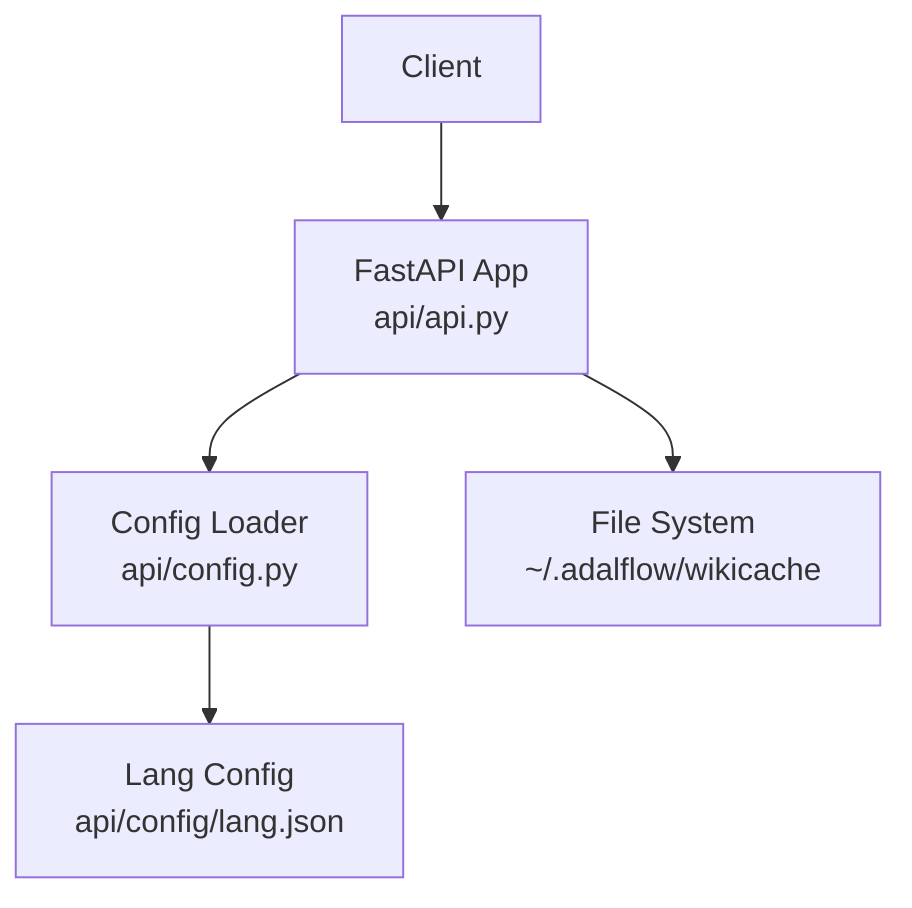
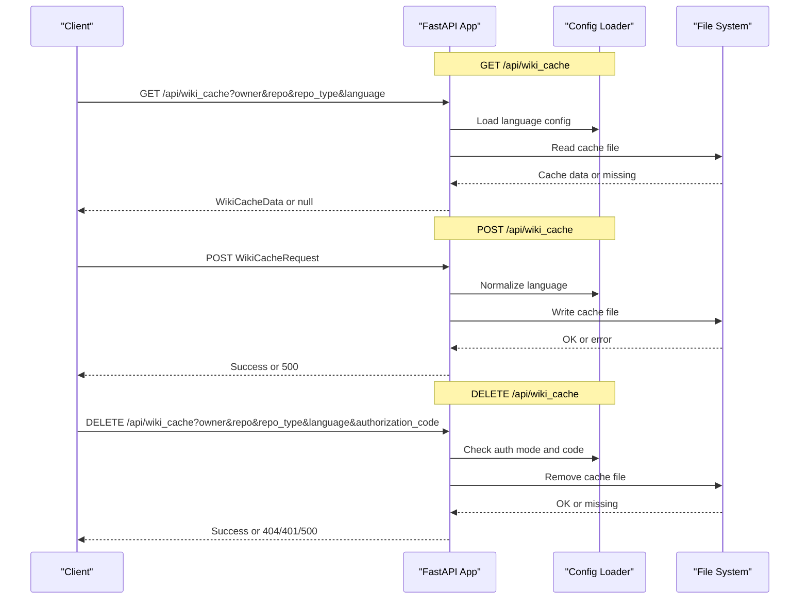
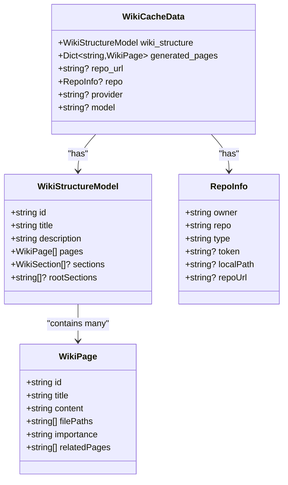
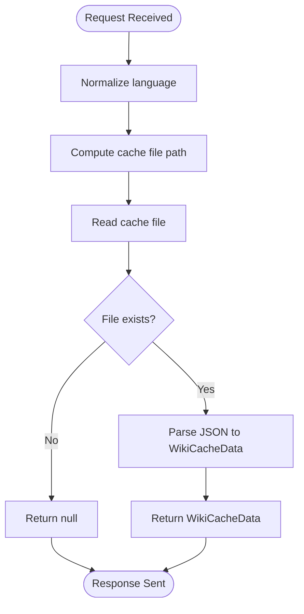
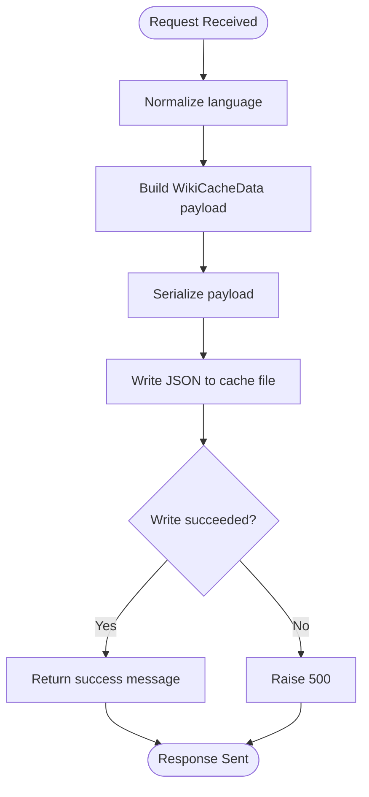
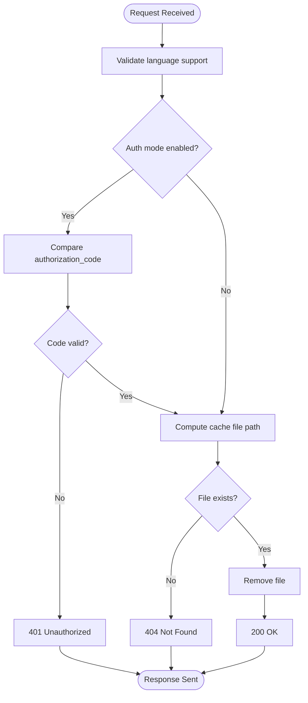
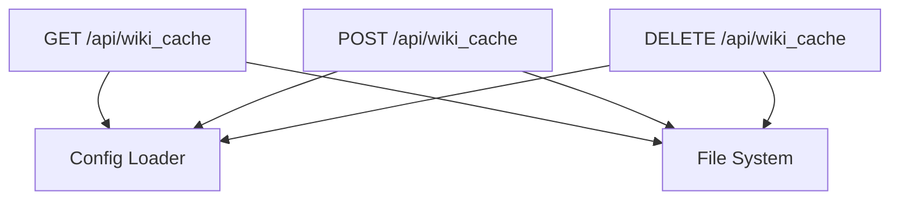

# Cache Management Endpoints

<cite>
**Referenced Files in This Document**
- [api.py](file://api/api.py)
- [config.py](file://api/config.py)
- [lang.json](file://api/config/lang.json)
- [main.py](file://api/main.py)
</cite>

## Table of Contents
1. [Introduction](#introduction)
2. [Project Structure](#project-structure)
3. [Core Components](#core-components)
4. [Architecture Overview](#architecture-overview)
5. [Detailed Component Analysis](#detailed-component-analysis)
6. [Dependency Analysis](#dependency-analysis)
7. [Performance Considerations](#performance-considerations)
8. [Troubleshooting Guide](#troubleshooting-guide)
9. [Conclusion](#conclusion)

## Introduction
This document describes the cache management endpoints for DeepWiki-Open, focusing on:
- Retrieving cached wiki data via GET /api/wiki_cache
- Storing wiki cache data via POST /api/wiki_cache
- Removing wiki cache via DELETE /api/wiki_cache

It covers query/request parameters, response schemas, authentication modes, cache file naming, error handling, and operational considerations such as cache invalidation and performance.

## Project Structure
The cache endpoints are implemented in the API module and rely on configuration for language support and authentication. The cache storage is file-based under a dedicated directory.

**Diagram sources**
- [api.py](file://api/api.py#L403-L539)
- [config.py](file://api/config.py#L280-L308)
- [lang.json](file://api/config/lang.json#L1-L16)

**Section sources**
- [api.py](file://api/api.py#L403-L539)
- [config.py](file://api/config.py#L280-L308)
- [lang.json](file://api/config/lang.json#L1-L16)

## Core Components
- WikiCacheData: Response model for cached wiki data returned by GET /api/wiki_cache
- WikiCacheRequest: Request model for POST /api/wiki_cache payload
- Helper functions:
  - get_wiki_cache_path(owner, repo, repo_type, language): computes cache file path
  - read_wiki_cache(owner, repo, repo_type, language): reads and parses cache file
  - save_wiki_cache(request): writes cache payload to disk
- Endpoints:
  - GET /api/wiki_cache: retrieves cached wiki data
  - POST /api/wiki_cache: stores wiki cache data
  - DELETE /api/wiki_cache: removes a specific cache file

Key behaviors:
- Language normalization: unsupported languages are coerced to the configured default.
- Authentication for deletion: optional authorization code enforced when enabled.
- Cache directory: ~/.adalflow/wikicache with per-project, per-language files.

**Section sources**
- [api.py](file://api/api.py#L90-L111)
- [api.py](file://api/api.py#L408-L458)
- [api.py](file://api/api.py#L461-L539)

## Architecture Overview
The cache endpoints integrate with the FastAPI application and use a shared configuration loader to determine supported languages and default values. The cache is persisted as JSON files named by repository metadata and language.

**Diagram sources**
- [api.py](file://api/api.py#L461-L539)
- [config.py](file://api/config.py#L49-L52)
- [config.py](file://api/config.py#L280-L308)

## Detailed Component Analysis

### GET /api/wiki_cache
Purpose:
- Retrieve cached wiki structure and generated pages for a repository and language.

Parameters:
- owner: string, required
- repo: string, required
- repo_type: string, required (e.g., github, gitlab)
- language: string, required; normalized to a supported language if invalid

Behavior:
- Validates language against supported list; falls back to default if unsupported.
- Reads cache file computed from owner, repo, repo_type, language.
- Returns null when cache is not found; the frontend expects this behavior.

Responses:
- 200 OK with WikiCacheData or null
- 404 Not Found when cache is absent (per implementation, returns null)

Example request:
- GET /api/wiki_cache?owner=AsyncFuncAI&repo=deepwiki-open&repo_type=github&language=en

Example response (WikiCacheData):
- wiki_structure: WikiStructureModel
- generated_pages: Dict[str, WikiPage]
- repo_url: optional string
- repo: optional RepoInfo
- provider: optional string
- model: optional string

Notes:
- The endpoint does not enforce authorization; it only reads from disk.

**Section sources**
- [api.py](file://api/api.py#L461-L484)
- [api.py](file://api/api.py#L471-L474)
- [api.py](file://api/api.py#L413-L424)

### POST /api/wiki_cache
Purpose:
- Store generated wiki data (structure and pages) into the server-side cache.

Request body (WikiCacheRequest):
- repo: RepoInfo (owner, repo, type, token?, localPath?, repoUrl?)
- language: string, required; normalized to default if unsupported
- wiki_structure: WikiStructureModel
- generated_pages: Dict[str, WikiPage]
- provider: string
- model: string

Validation:
- Language normalization against supported_languages; default substitution if needed.

Success response:
- 200 OK with message "Wiki cache saved successfully"

Error response:
- 500 Internal Server Error when write fails

Example request body:
- repo: { owner, repo, type, ... }
- language: "en"
- wiki_structure: { id, title, description, pages, sections?, rootSections? }
- generated_pages: { "page_id": { id, title, content, filePaths, importance, relatedPages } }
- provider: "google"
- model: "gemini-2.5-flash"

**Section sources**
- [api.py](file://api/api.py#L101-L111)
- [api.py](file://api/api.py#L486-L502)
- [api.py](file://api/api.py#L491-L495)
- [api.py](file://api/api.py#L426-L457)

### DELETE /api/wiki_cache
Purpose:
- Remove a specific wiki cache file by repository and language.

Parameters:
- owner: string, required
- repo: string, required
- repo_type: string, required
- language: string, required; must be supported
- authorization_code: optional string; required when auth mode is enabled

Authorization:
- When WIKI_AUTH_MODE is true, the endpoint validates authorization_code against WIKI_AUTH_CODE.

Behavior:
- Validates language support
- Optionally checks authorization code
- Removes cache file computed from owner, repo, repo_type, language
- Returns success message or raises HTTP exceptions

Responses:
- 200 OK with success message
- 400 Bad Request when language is unsupported
- 401 Unauthorized when code is missing or invalid and auth mode is enabled
- 404 Not Found when cache file does not exist
- 500 Internal Server Error on filesystem errors

Example request:
- DELETE /api/wiki_cache?owner=AsyncFuncAI&repo=deepwiki-open&repo_type=github&language=en&authorization_code=secret

Security considerations:
- Enforce authorization_code when WIKI_AUTH_MODE is true.
- Ensure cache directory permissions restrict unintended access.

**Section sources**
- [api.py](file://api/api.py#L504-L539)
- [config.py](file://api/config.py#L49-L52)

### Cache Data Structures and File Path Generation
Cache data models:
- WikiCacheData: wraps wiki_structure, generated_pages, and metadata (repo_url, repo, provider, model)
- WikiStructureModel: includes id, title, description, pages, sections?, rootSections?
- WikiPage: includes id, title, content, filePaths, importance, relatedPages
- RepoInfo: includes owner, repo, type, token?, localPath?, repoUrl?

File path generation:
- Path: ~/.adalflow/wikicache/deepwiki_cache_{repo_type}_{owner}_{repo}_{language}.json
- The helper computes the filename and joins with the cache directory.

Cache lifecycle:
- Creation: POST /api/wiki_cache writes the file
- Retrieval: GET /api/wiki_cache reads the file
- Removal: DELETE /api/wiki_cache deletes the file

**Section sources**
- [api.py](file://api/api.py#L90-L111)
- [api.py](file://api/api.py#L408-L411)
- [api.py](file://api/api.py#L413-L424)
- [api.py](file://api/api.py#L426-L457)

### Authentication Modes and Authorization
- Authentication mode is controlled by DEEPWIKI_AUTH_MODE environment variable.
- When enabled, DELETE /api/wiki_cache requires authorization_code equal to DEEPWIKI_AUTH_CODE.
- GET /api/wiki_cache does not require authorization.

Configuration:
- WIKI_AUTH_MODE and WIKI_AUTH_CODE are loaded from environment variables.

**Section sources**
- [config.py](file://api/config.py#L49-L52)
- [api.py](file://api/api.py#L520-L523)

### Language Support and Normalization
- Supported languages and default language are loaded from lang.json.
- GET and POST endpoints normalize language to a supported value; unsupported values fall back to default.

**Section sources**
- [config.py](file://api/config.py#L280-L308)
- [lang.json](file://api/config/lang.json#L1-L16)
- [api.py](file://api/api.py#L471-L474)
- [api.py](file://api/api.py#L492-L495)

## Architecture Overview

**Diagram sources**
- [api.py](file://api/api.py#L90-L111)
- [api.py](file://api/api.py#L79-L89)
- [api.py](file://api/api.py#L40-L50)
- [api.py](file://api/api.py#L60-L67)

## Detailed Component Analysis

### GET /api/wiki_cache Flow

**Diagram sources**
- [api.py](file://api/api.py#L461-L484)
- [api.py](file://api/api.py#L471-L474)
- [api.py](file://api/api.py#L413-L424)

**Section sources**
- [api.py](file://api/api.py#L461-L484)

### POST /api/wiki_cache Flow

**Diagram sources**
- [api.py](file://api/api.py#L486-L502)
- [api.py](file://api/api.py#L491-L495)
- [api.py](file://api/api.py#L426-L457)

**Section sources**
- [api.py](file://api/api.py#L486-L502)

### DELETE /api/wiki_cache Flow

**Diagram sources**
- [api.py](file://api/api.py#L504-L539)
- [config.py](file://api/config.py#L49-L52)

**Section sources**
- [api.py](file://api/api.py#L504-L539)

## Dependency Analysis
- GET /api/wiki_cache depends on:
  - Config loader for supported_languages and default
  - File system for reading cache JSON
- POST /api/wiki_cache depends on:
  - Config loader for language normalization
  - File system for writing cache JSON
- DELETE /api/wiki_cache depends on:
  - Config loader for auth mode and code
  - File system for removing cache JSON

**Diagram sources**
- [api.py](file://api/api.py#L461-L539)
- [config.py](file://api/config.py#L280-L308)

**Section sources**
- [api.py](file://api/api.py#L461-L539)
- [config.py](file://api/config.py#L280-L308)

## Performance Considerations
- File I/O overhead: Each operation performs a single file read/write; keep payloads reasonably sized.
- Language normalization: Minimal cost; uses a small in-memory map.
- Logging: Payload size is logged to help monitor cache sizes; avoid logging large content bodies.
- Concurrency: Endpoints are synchronous; consider asynchronous I/O if throughput becomes a concern.

[No sources needed since this section provides general guidance]

## Troubleshooting Guide
Common issues and resolutions:
- Unsupported language:
  - Symptom: Unexpected default language used.
  - Resolution: Ensure language is one of the supported codes.
- Cache not found:
  - Symptom: GET returns null; DELETE returns 404.
  - Resolution: Verify owner, repo, repo_type, language parameters; confirm cache file exists.
- Authorization failure:
  - Symptom: DELETE returns 401.
  - Resolution: Set DEEPWIKI_AUTH_MODE and DEEPWIKI_AUTH_CODE appropriately; provide matching authorization_code.
- Save failure:
  - Symptom: POST returns 500.
  - Resolution: Check disk permissions and available space; inspect logs for IO errors.

**Section sources**
- [api.py](file://api/api.py#L471-L474)
- [api.py](file://api/api.py#L492-L495)
- [api.py](file://api/api.py#L517-L518)
- [api.py](file://api/api.py#L522-L523)
- [api.py](file://api/api.py#L537-L538)
- [api.py](file://api/api.py#L452-L457)

## Conclusion
The cache management endpoints provide a straightforward, file-backed caching mechanism for wiki data. They support language normalization, optional authorization for deletion, and clear success/error responses. For production deployments, ensure appropriate environment configuration for authentication and language defaults, and monitor cache directory permissions and disk usage.