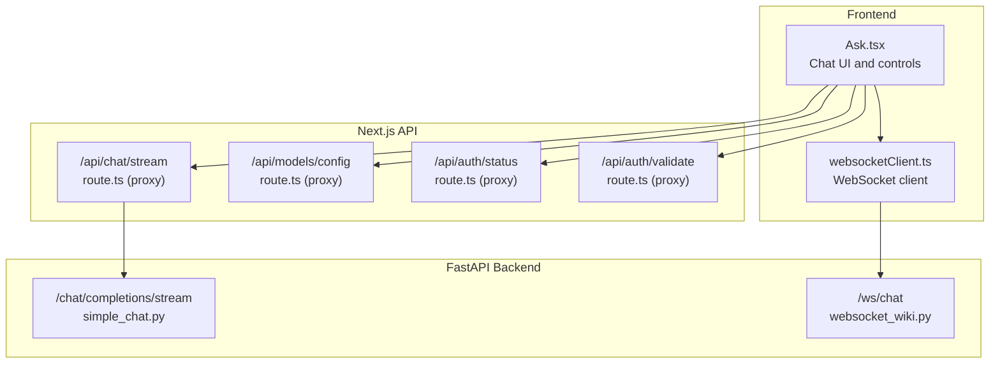
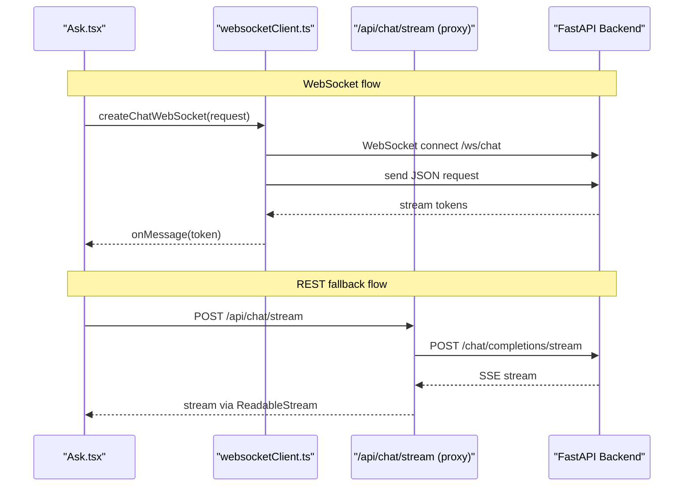
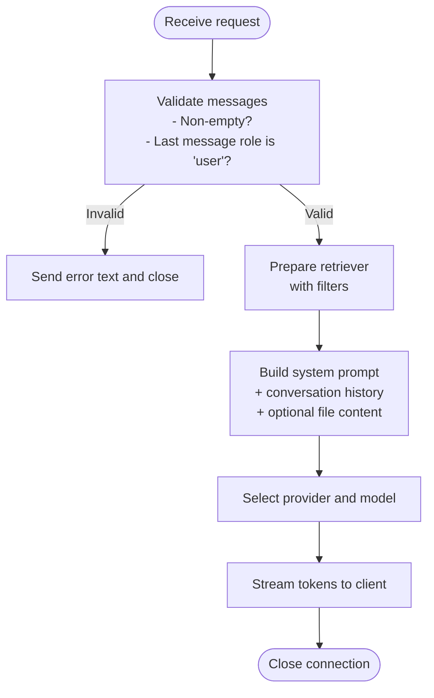
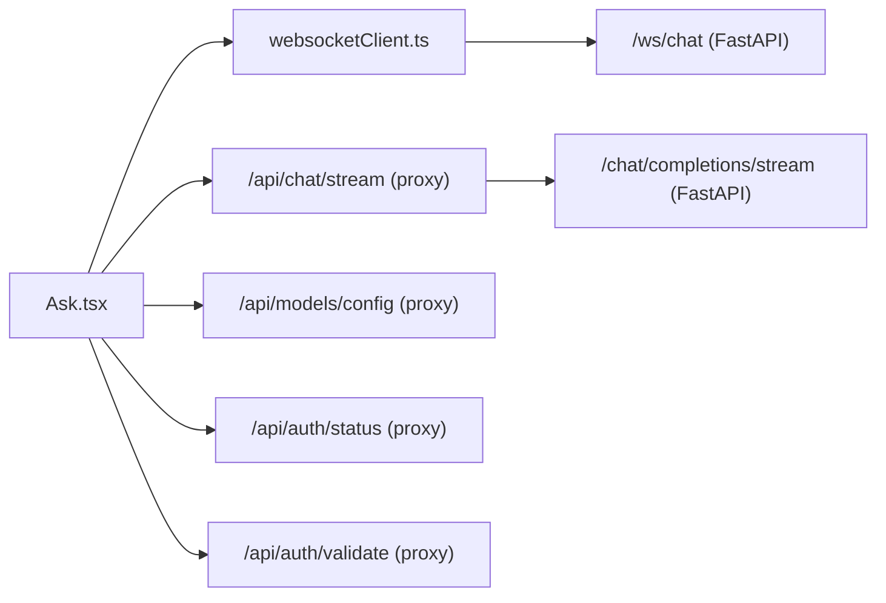

# Chat Endpoints

<cite>
**Referenced Files in This Document**
- [src/app/api/chat/stream/route.ts](file://src/app/api/chat/stream/route.ts)
- [api/simple_chat.py](file://api/simple_chat.py)
- [api/websocket_wiki.py](file://api/websocket_wiki.py)
- [src/utils/websocketClient.ts](file://src/utils/websocketClient.ts)
- [src/components/Ask.tsx](file://src/components/Ask.tsx)
- [src/app/api/models/config/route.ts](file://src/app/api/models/config/route.ts)
- [src/app/api/auth/status/route.ts](file://src/app/api/auth/status/route.ts)
- [src/app/api/auth/validate/route.ts](file://src/app/api/auth/validate/route.ts)
</cite>

## Table of Contents
1. [Introduction](#introduction)
2. [Project Structure](#project-structure)
3. [Core Components](#core-components)
4. [Architecture Overview](#architecture-overview)
5. [Detailed Component Analysis](#detailed-component-analysis)
6. [Dependency Analysis](#dependency-analysis)
7. [Performance Considerations](#performance-considerations)
8. [Troubleshooting Guide](#troubleshooting-guide)
9. [Conclusion](#conclusion)

## Introduction
This document describes the chat-related endpoints in DeepWiki-Open, focusing on:
- REST streaming endpoint for chat completions
- WebSocket endpoint for real-time chat interactions
It covers request/response schemas, parameter validation, streaming formats, error handling, and client implementation guidelines. Authentication and rate-limiting considerations are also discussed.

## Project Structure
The chat system spans a Next.js API route (proxy), a FastAPI backend (streaming and WebSocket), and a React client component with a dedicated WebSocket client utility.

**Diagram sources**
- [src/components/Ask.tsx](file://src/components/Ask.tsx#L1-L929)
- [src/utils/websocketClient.ts](file://src/utils/websocketClient.ts#L1-L86)
- [src/app/api/chat/stream/route.ts](file://src/app/api/chat/stream/route.ts#L1-L113)
- [src/app/api/models/config/route.ts](file://src/app/api/models/config/route.ts#L1-L64)
- [src/app/api/auth/status/route.ts](file://src/app/api/auth/status/route.ts#L1-L32)
- [src/app/api/auth/validate/route.ts](file://src/app/api/auth/validate/route.ts#L1-L35)
- [api/simple_chat.py](file://api/simple_chat.py#L1-L900)
- [api/websocket_wiki.py](file://api/websocket_wiki.py#L1-L978)

**Section sources**
- [src/app/api/chat/stream/route.ts](file://src/app/api/chat/stream/route.ts#L1-L113)
- [api/simple_chat.py](file://api/simple_chat.py#L1-L900)
- [api/websocket_wiki.py](file://api/websocket_wiki.py#L1-L978)
- [src/utils/websocketClient.ts](file://src/utils/websocketClient.ts#L1-L86)
- [src/components/Ask.tsx](file://src/components/Ask.tsx#L1-L929)
- [src/app/api/models/config/route.ts](file://src/app/api/models/config/route.ts#L1-L64)
- [src/app/api/auth/status/route.ts](file://src/app/api/auth/status/route.ts#L1-L32)
- [src/app/api/auth/validate/route.ts](file://src/app/api/auth/validate/route.ts#L1-L35)

## Core Components
- REST streaming proxy: Next.js route that forwards requests to the backend streaming endpoint and streams the response back to the client.
- WebSocket endpoint: FastAPI WebSocket handler that accepts a single JSON message with chat parameters, performs retrieval-augmented generation, and streams tokens to the client.
- Frontend client: React component that manages conversation state, creates a WebSocket connection, and handles streaming responses. It falls back to the REST proxy when WebSocket fails.

Key responsibilities:
- Parameter validation and request shaping
- Retrieval-augmented prompting and conversation memory
- Provider-specific streaming behavior
- Error propagation and graceful fallback

**Section sources**
- [src/app/api/chat/stream/route.ts](file://src/app/api/chat/stream/route.ts#L9-L100)
- [api/websocket_wiki.py](file://api/websocket_wiki.py#L53-L978)
- [src/utils/websocketClient.ts](file://src/utils/websocketClient.ts#L43-L75)
- [src/components/Ask.tsx](file://src/components/Ask.tsx#L532-L627)

## Architecture Overview
High-level flow for both REST and WebSocket chat:

**Diagram sources**
- [src/components/Ask.tsx](file://src/components/Ask.tsx#L578-L620)
- [src/utils/websocketClient.ts](file://src/utils/websocketClient.ts#L43-L75)
- [src/app/api/chat/stream/route.ts](file://src/app/api/chat/stream/route.ts#L9-L87)
- [api/simple_chat.py](file://api/simple_chat.py#L76-L887)

## Detailed Component Analysis

### REST Streaming Endpoint: POST /api/chat/stream
Purpose:
- Proxy client requests to the backend streaming endpoint and stream the response back to the browser.

Behavior:
- Reads the incoming JSON request body.
- Forwards the request to the backend streaming endpoint with Accept: text/event-stream.
- Validates backend response and copies headers.
- Streams the backend response body to the client using a ReadableStream.
- Handles backend errors by forwarding the error body and headers.

Request schema:
- Body: JSON matching the backend request schema.
- Headers: Content-Type: application/json; Accept: text/event-stream.

Response schema:
- Status 200 on successful start; SSE stream delivered as text/event-stream.
- On backend error, returns the backend’s status and body.

Validation and error handling:
- Ensures backend response has a body; otherwise returns 500.
- Catches exceptions and returns a JSON error payload with 500 status.

Fallback behavior:
- The frontend attempts WebSocket first; if it fails, it falls back to this REST endpoint.

**Section sources**
- [src/app/api/chat/stream/route.ts](file://src/app/api/chat/stream/route.ts#L9-L100)

### WebSocket Endpoint: /ws/chat
Purpose:
- Real-time chat via WebSocket. The client sends a single JSON message with the chat request; the server streams tokens until completion.

Request schema:
- Single JSON message with fields:
  - repo_url: string
  - messages: array of { role: 'user' | 'assistant' | 'system', content: string }
  - filePath?: string
  - token?: string
  - type?: string
  - provider?: string
  - model?: string
  - language?: string
  - excluded_dirs?: string
  - excluded_files?: string
  - included_dirs?: string
  - included_files?: string

Response format:
- Text frames streamed from the server. Each frame corresponds to a token or partial token from the LLM provider.
- The server closes the WebSocket after streaming completes.

Processing logic:
- Validates presence and ordering of messages; ensures the last message is from the user.
- Prepares a retriever for RAG using filters (included/excluded dirs/files).
- Builds conversation history and optional file content context.
- Constructs a system prompt tailored to the repository type and language.
- Selects provider-specific streaming behavior (Google, OpenAI, OpenRouter, Azure, Ollama, DashScope, GitHub Copilot).
- Applies token limit fallback by retrying without context if needed.
- Sends errors as text frames and closes the connection.

**Section sources**
- [api/websocket_wiki.py](file://api/websocket_wiki.py#L53-L978)

### Frontend Client: Ask.tsx and websocketClient.ts
Ask.tsx:
- Manages question input, response display, and conversation history.
- Uses the WebSocket client to connect to /ws/chat.
- On message, appends tokens to the response.
- On close, determines if research is complete (for multi-turn Deep Research).
- Falls back to the REST proxy if WebSocket fails.
- Supports model selection and dynamic provider/model configuration.

WebSocket client:
- Provides a typed interface for chat requests and callbacks.
- Converts the server base URL to a WebSocket URL.
- Returns the WebSocket instance for lifecycle control.

**Section sources**
- [src/components/Ask.tsx](file://src/components/Ask.tsx#L1-L929)
- [src/utils/websocketClient.ts](file://src/utils/websocketClient.ts#L1-L86)

### Request Validation and Processing Flow

**Diagram sources**
- [api/websocket_wiki.py](file://api/websocket_wiki.py#L122-L133)
- [api/websocket_wiki.py](file://api/websocket_wiki.py#L76-L121)
- [api/websocket_wiki.py](file://api/websocket_wiki.py#L252-L434)
- [api/websocket_wiki.py](file://api/websocket_wiki.py#L569-L780)

## Dependency Analysis
- Ask.tsx depends on websocketClient.ts for connection management and on Next.js API routes for model and auth proxies.
- Next.js API routes proxy to the FastAPI backend.
- FastAPI backend implements both streaming and WebSocket chat endpoints.

**Diagram sources**
- [src/components/Ask.tsx](file://src/components/Ask.tsx#L1-L929)
- [src/utils/websocketClient.ts](file://src/utils/websocketClient.ts#L1-L86)
- [src/app/api/chat/stream/route.ts](file://src/app/api/chat/stream/route.ts#L1-L113)
- [api/simple_chat.py](file://api/simple_chat.py#L1-L900)
- [api/websocket_wiki.py](file://api/websocket_wiki.py#L1-L978)
- [src/app/api/models/config/route.ts](file://src/app/api/models/config/route.ts#L1-L64)
- [src/app/api/auth/status/route.ts](file://src/app/api/auth/status/route.ts#L1-L32)
- [src/app/api/auth/validate/route.ts](file://src/app/api/auth/validate/route.ts#L1-L35)

**Section sources**
- [src/components/Ask.tsx](file://src/components/Ask.tsx#L1-L929)
- [src/app/api/chat/stream/route.ts](file://src/app/api/chat/stream/route.ts#L1-L113)
- [api/websocket_wiki.py](file://api/websocket_wiki.py#L1-L978)

## Performance Considerations
- Prefer WebSocket for real-time chat to reduce latency and overhead compared to polling.
- Use incremental rendering in the frontend to display tokens as they arrive.
- Keep messages minimal and avoid excessive conversation history to reduce token usage.
- Enable RAG only when beneficial; large contexts increase latency and cost.
- Monitor provider quotas and adjust model parameters (temperature, max_tokens) to balance quality and speed.
- For REST fallback, ensure the client handles backpressure and cancels long-running requests appropriately.

[No sources needed since this section provides general guidance]

## Troubleshooting Guide
Common issues and resolutions:
- WebSocket connection fails:
  - The frontend falls back to the REST proxy automatically. Verify network connectivity and backend availability.
- Provider API errors:
  - The backend returns error messages as text frames; surface these to the user and suggest checking credentials or quotas.
- Token limit exceeded:
  - The backend retries without context; if still failing, shorten the query or split into smaller requests.
- CORS or proxy errors:
  - Ensure the Next.js proxy routes are reachable and headers are correctly forwarded.

Operational checks:
- Confirm the backend endpoints are running and reachable from the Next.js server.
- Validate environment variables for providers and tokens.
- Inspect logs for detailed error messages from the backend.

**Section sources**
- [src/components/Ask.tsx](file://src/components/Ask.tsx#L368-L403)
- [src/app/api/chat/stream/route.ts](file://src/app/api/chat/stream/route.ts#L30-L42)
- [api/websocket_wiki.py](file://api/websocket_wiki.py#L969-L978)

## Conclusion
DeepWiki-Open provides a robust chat experience with both REST streaming and WebSocket real-time capabilities. The frontend integrates seamlessly with a Next.js proxy and a FastAPI backend, supporting multiple providers and retrieval-augmented generation. Proper validation, error handling, and fallback mechanisms ensure reliability across environments.