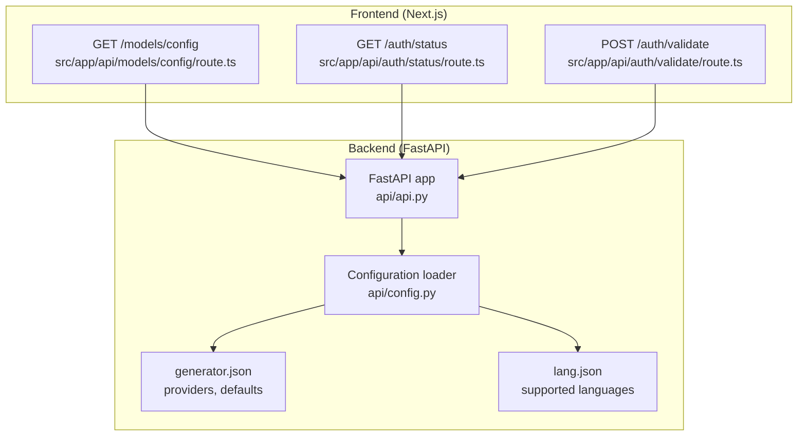
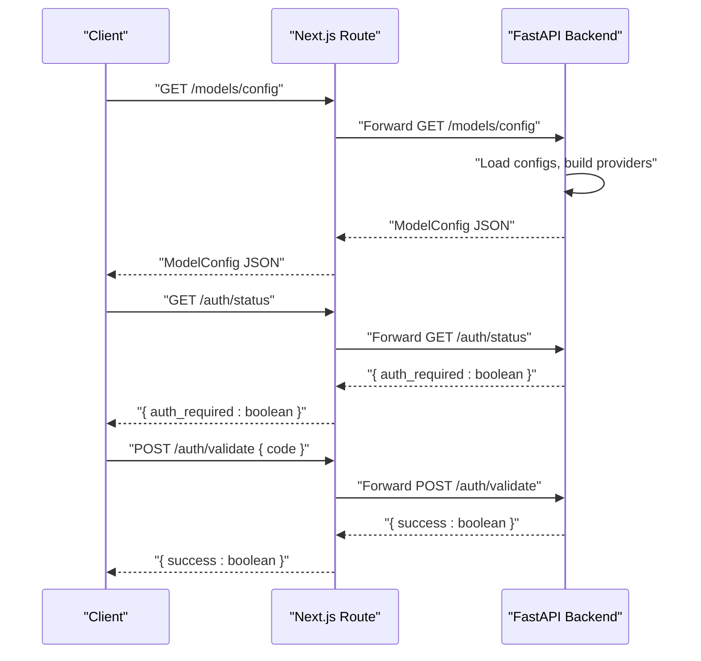
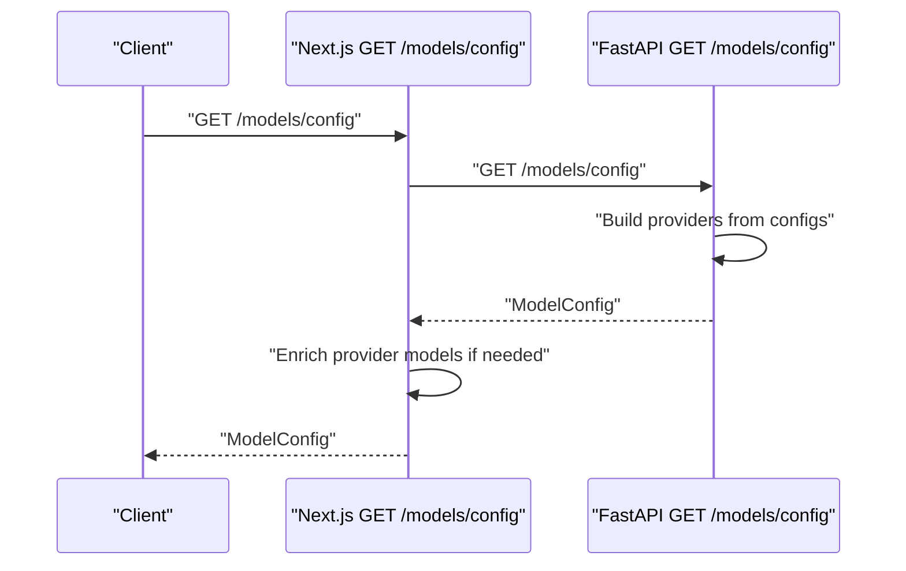
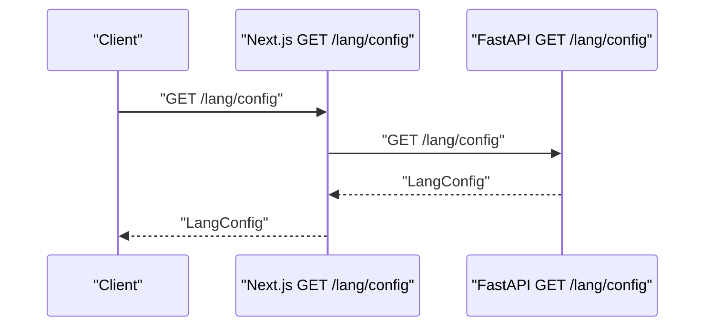
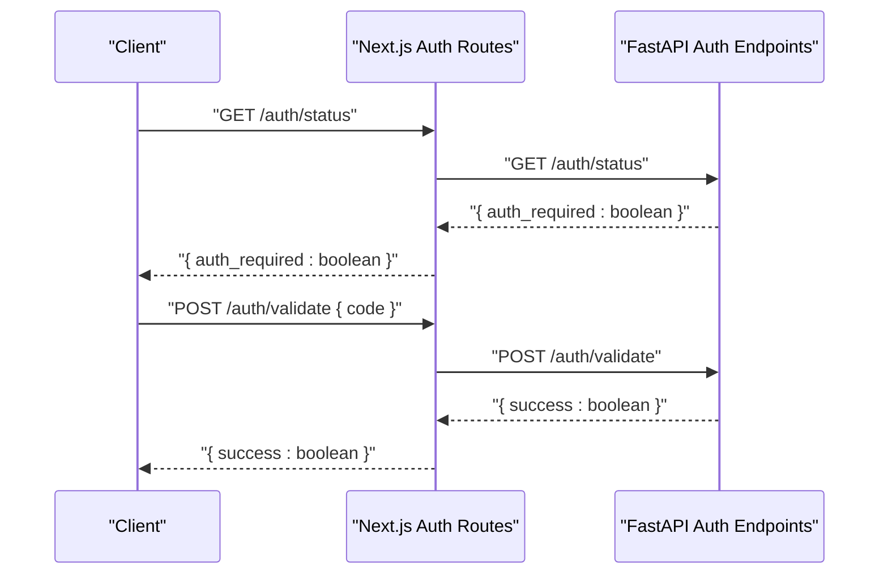
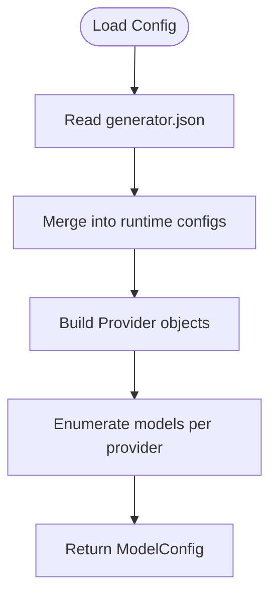
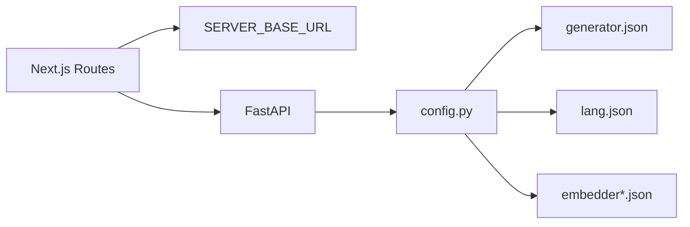

# Model Configuration Endpoints

<cite>
**Referenced Files in This Document**
- [src/app/api/models/config/route.ts](file://src/app/api/models/config/route.ts)
- [src/app/api/auth/status/route.ts](file://src/app/api/auth/status/route.ts)
- [src/app/api/auth/validate/route.ts](file://src/app/api/auth/validate/route.ts)
- [api/api.py](file://api/api.py)
- [api/config.py](file://api/config.py)
- [api/config/generator.json](file://api/config/generator.json)
- [api/config/lang.json](file://api/config/lang.json)
- [api/config/embedder.json](file://api/config/embedder.json)
- [api/config/embedder.github_copilot.json](file://api/config/embedder.github_copilot.json)
- [api/config/embedder.dashscope.json](file://api/config/embedder.dashscope.json)
- [api/config/embedder.both.json](file://api/config/embedder.both.json)
- [api/main.py](file://api/main.py)
</cite>

## Table of Contents
1. [Introduction](#introduction)
2. [Project Structure](#project-structure)
3. [Core Components](#core-components)
4. [Architecture Overview](#architecture-overview)
5. [Detailed Component Analysis](#detailed-component-analysis)
6. [Dependency Analysis](#dependency-analysis)
7. [Performance Considerations](#performance-considerations)
8. [Troubleshooting Guide](#troubleshooting-guide)
9. [Conclusion](#conclusion)

## Introduction
This document provides comprehensive documentation for DeepWiki-Open’s model configuration endpoints and related authentication endpoints. It covers:
- GET /models/config: retrieves available AI model providers, their model lists, and provider-specific flags such as custom model support.
- GET /lang/config: retrieves language configuration for supported languages and default language.
- Authentication endpoints: GET /auth/status and POST /auth/validate for wiki access control.
It also explains provider registration patterns, dynamic model loading via configuration files, default provider settings, and integration with the multi-provider architecture.

## Project Structure
The model configuration and language configuration are served by a FastAPI backend. Frontend Next.js routes proxy requests to the backend service.

**Diagram sources**
- [src/app/api/models/config/route.ts](file://src/app/api/models/config/route.ts#L1-L64)
- [src/app/api/auth/status/route.ts](file://src/app/api/auth/status/route.ts#L1-L32)
- [src/app/api/auth/validate/route.ts](file://src/app/api/auth/validate/route.ts#L1-L35)
- [api/api.py](file://api/api.py#L149-L226)
- [api/config.py](file://api/config.py#L1-L464)
- [api/config/generator.json](file://api/config/generator.json#L1-L101)
- [api/config/lang.json](file://api/config/lang.json#L1-L16)

**Section sources**
- [src/app/api/models/config/route.ts](file://src/app/api/models/config/route.ts#L1-L64)
- [src/app/api/auth/status/route.ts](file://src/app/api/auth/status/route.ts#L1-L32)
- [src/app/api/auth/validate/route.ts](file://src/app/api/auth/validate/route.ts#L1-L35)
- [api/api.py](file://api/api.py#L149-L226)
- [api/config.py](file://api/config.py#L1-L464)
- [api/config/generator.json](file://api/config/generator.json#L1-L101)
- [api/config/lang.json](file://api/config/lang.json#L1-L16)

## Core Components
- Backend FastAPI endpoints:
  - GET /models/config returns a ModelConfig object with providers, each containing id, name, models, and supportsCustomModel.
  - GET /lang/config returns the language configuration including supported_languages and default.
  - GET /auth/status returns whether wiki authentication is required.
  - POST /auth/validate checks an authorization code against the configured code.
- Frontend Next.js routes:
  - Proxy GET /models/config to the backend and optionally enrich provider models (e.g., ensuring a specific model is present for a provider).
  - Proxy GET /auth/status and POST /auth/validate to the backend.

Key configuration sources:
- Provider definitions and defaults are loaded from generator.json.
- Language configuration is loaded from lang.json.
- Embedder configurations are loaded from embedder*.json variants and merged into runtime configs.

**Section sources**
- [api/api.py](file://api/api.py#L149-L226)
- [src/app/api/models/config/route.ts](file://src/app/api/models/config/route.ts#L1-L64)
- [api/config.py](file://api/config.py#L127-L181)
- [api/config/generator.json](file://api/config/generator.json#L1-L101)
- [api/config/lang.json](file://api/config/lang.json#L1-L16)
- [api/config/embedder.json](file://api/config/embedder.json#L1-L35)

## Architecture Overview
The frontend Next.js routes act as lightweight proxies to the backend FastAPI service. The backend loads configuration files, constructs provider/model metadata, and serves standardized JSON responses.

**Diagram sources**
- [src/app/api/models/config/route.ts](file://src/app/api/models/config/route.ts#L6-L51)
- [src/app/api/auth/status/route.ts](file://src/app/api/auth/status/route.ts#L5-L31)
- [src/app/api/auth/validate/route.ts](file://src/app/api/auth/validate/route.ts#L5-L34)
- [api/api.py](file://api/api.py#L149-L166)

## Detailed Component Analysis

### GET /models/config
Purpose:
- Return available model providers, their models, and provider flags such as supportsCustomModel.

Response schema (ModelConfig):
- providers: array of Provider
  - id: string
  - name: string
  - models: array of Model
    - id: string
    - name: string
  - supportsCustomModel: boolean
- defaultProvider: string

Behavior:
- Loads provider metadata from runtime configs built by the backend.
- Providers are constructed from the loaded configuration, with each provider’s models enumerated by ID.
- The frontend route may enrich provider model lists (e.g., ensure a specific model exists for a provider).

Provider-specific configurations:
- Provider fields include client_class mapping, default_model, supportsCustomModel, and provider-specific overrides (e.g., base_url, api_key_env for certain providers).
- Dynamic model loading:
  - Models are read from the provider’s models map in the configuration.
  - Some providers may expose additional parameters per model (e.g., temperature, top_p, max_tokens).

Default provider:
- default_provider is taken from the configuration and returned as defaultProvider.

Frontend enrichment:
- The frontend route ensures a specific model is present for a provider if missing, prior to returning the response.

**Diagram sources**
- [src/app/api/models/config/route.ts](file://src/app/api/models/config/route.ts#L6-L51)
- [api/api.py](file://api/api.py#L167-L226)

**Section sources**
- [api/api.py](file://api/api.py#L167-L226)
- [api/config.py](file://api/config.py#L127-L181)
- [api/config/generator.json](file://api/config/generator.json#L1-L101)
- [src/app/api/models/config/route.ts](file://src/app/api/models/config/route.ts#L29-L41)

### GET /lang/config
Purpose:
- Return language configuration including supported_languages and default language.

Response schema:
- supported_languages: object mapping language code to display name
- default: string (language code)

Behavior:
- Loads language configuration from lang.json, with a fallback to a default set if the file is missing or malformed.

**Diagram sources**
- [api/api.py](file://api/api.py#L149-L151)
- [api/config.py](file://api/config.py#L280-L307)
- [api/config/lang.json](file://api/config/lang.json#L1-L16)

**Section sources**
- [api/api.py](file://api/api.py#L149-L151)
- [api/config.py](file://api/config.py#L280-L307)
- [api/config/lang.json](file://api/config/lang.json#L1-L16)

### Authentication Endpoints
- GET /auth/status
  - Returns whether wiki authentication is required based on environment configuration.
- POST /auth/validate
  - Validates an authorization code against the configured code.

Security considerations:
- Authorization code comparison is a simple equality check; ensure the code is transmitted securely and validated on the backend.
- Access control is enforced for cache deletion operations in the backend.

**Diagram sources**
- [src/app/api/auth/status/route.ts](file://src/app/api/auth/status/route.ts#L5-L31)
- [src/app/api/auth/validate/route.ts](file://src/app/api/auth/validate/route.ts#L5-L34)
- [api/api.py](file://api/api.py#L153-L166)

**Section sources**
- [api/api.py](file://api/api.py#L153-L166)
- [api/config.py](file://api/config.py#L49-L53)

### Provider Registration and Dynamic Model Loading
Provider registration:
- Providers are registered via configuration files (generator.json) and loaded into runtime configs.
- Each provider specifies client_class, default_model, supportsCustomModel, and model parameters.
- Some providers include provider-specific fields (e.g., base_url, api_key_env).

Dynamic model loading:
- The backend enumerates models from the provider’s models map.
- Model parameters (e.g., temperature, top_p, max_tokens) are read from the configuration per model.

Embedder configuration:
- Embedder configurations are loaded from embedder*.json files and merged into runtime configs.
- Different embedder variants are supported (e.g., GitHub Copilot, DashScope, combined).

**Diagram sources**
- [api/config.py](file://api/config.py#L127-L181)
- [api/config/generator.json](file://api/config/generator.json#L1-L101)
- [api/api.py](file://api/api.py#L167-L226)

**Section sources**
- [api/config.py](file://api/config.py#L127-L181)
- [api/config/generator.json](file://api/config/generator.json#L1-L101)
- [api/config/embedder.json](file://api/config/embedder.json#L1-L35)
- [api/config/embedder.github_copilot.json](file://api/config/embedder.github_copilot.json#L1-L26)
- [api/config/embedder.dashscope.json](file://api/config/embedder.dashscope.json#L1-L19)
- [api/config/embedder.both.json](file://api/config/embedder.both.json#L1-L35)

## Dependency Analysis
- Frontend Next.js routes depend on SERVER_BASE_URL environment variable to forward requests to the backend.
- Backend FastAPI depends on configuration loader to assemble provider and language metadata.
- Configuration loader reads JSON files and environment variables to construct runtime configs.

**Diagram sources**
- [src/app/api/models/config/route.ts](file://src/app/api/models/config/route.ts#L3-L4)
- [api/api.py](file://api/api.py#L149-L226)
- [api/config.py](file://api/config.py#L104-L126)
- [api/config/generator.json](file://api/config/generator.json#L1-L101)
- [api/config/lang.json](file://api/config/lang.json#L1-L16)
- [api/config/embedder.json](file://api/config/embedder.json#L1-L35)

**Section sources**
- [src/app/api/models/config/route.ts](file://src/app/api/models/config/route.ts#L3-L4)
- [api/config.py](file://api/config.py#L104-L126)
- [api/api.py](file://api/api.py#L149-L226)

## Performance Considerations
- Configuration loading is performed once during startup and reused across requests.
- Frontend enrichment of provider models is minimal and occurs only for specific providers.
- Embedder configuration variants allow selecting optimal embedding clients without impacting model configuration performance.

## Troubleshooting Guide
Common issues and resolutions:
- Missing or malformed configuration files:
  - If lang.json is missing or lacks required fields, the backend falls back to a default language configuration.
  - If generator.json is missing, the backend returns a default provider configuration.
- Environment variables:
  - Ensure required and optional environment variables are set according to provider needs.
- CORS and proxying:
  - Frontend routes set CORS headers for preflight requests; ensure the backend allows the expected methods and headers.

**Section sources**
- [api/config.py](file://api/config.py#L280-L307)
- [api/config.py](file://api/config.py#L354-L378)
- [api/main.py](file://api/main.py#L61-L77)
- [src/app/api/models/config/route.ts](file://src/app/api/models/config/route.ts#L53-L63)

## Conclusion
DeepWiki-Open exposes clean, standardized endpoints for model and language configuration, backed by flexible configuration files and a robust multi-provider architecture. The frontend Next.js routes provide a thin proxy layer, while the backend FastAPI service centralizes configuration loading and response construction. Authentication endpoints enable wiki access control with straightforward code validation.