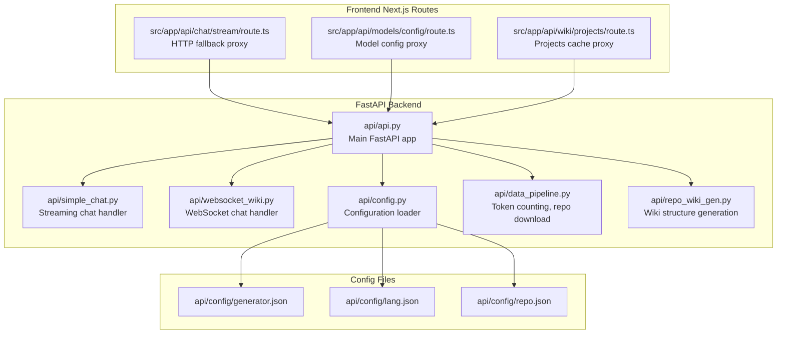
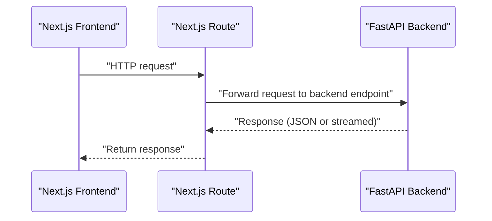
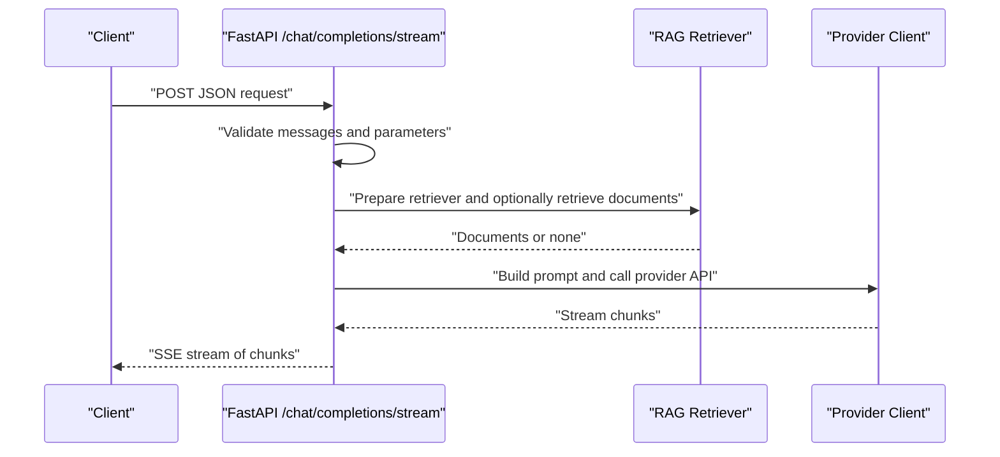
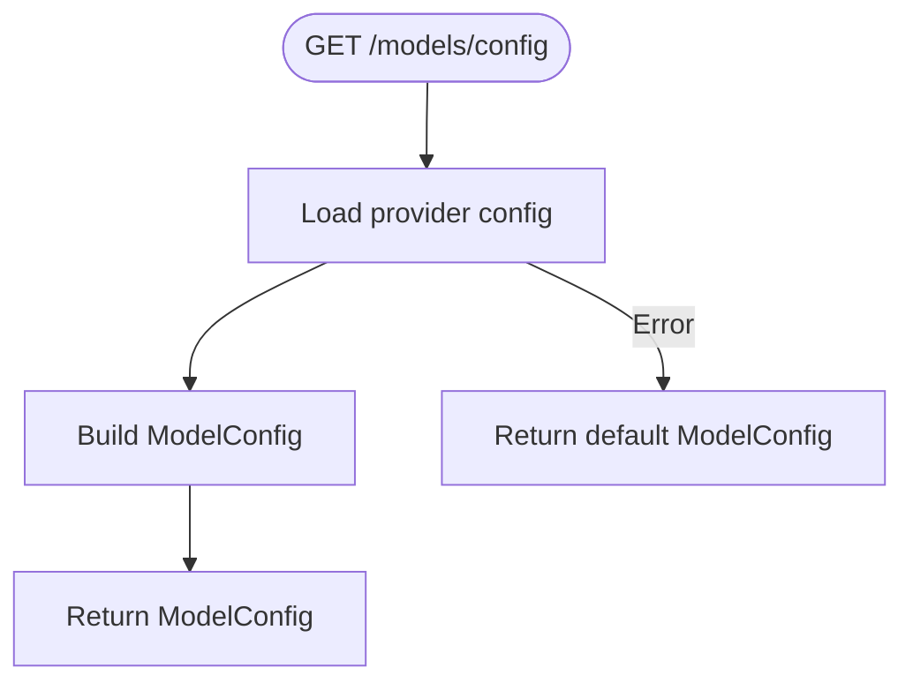
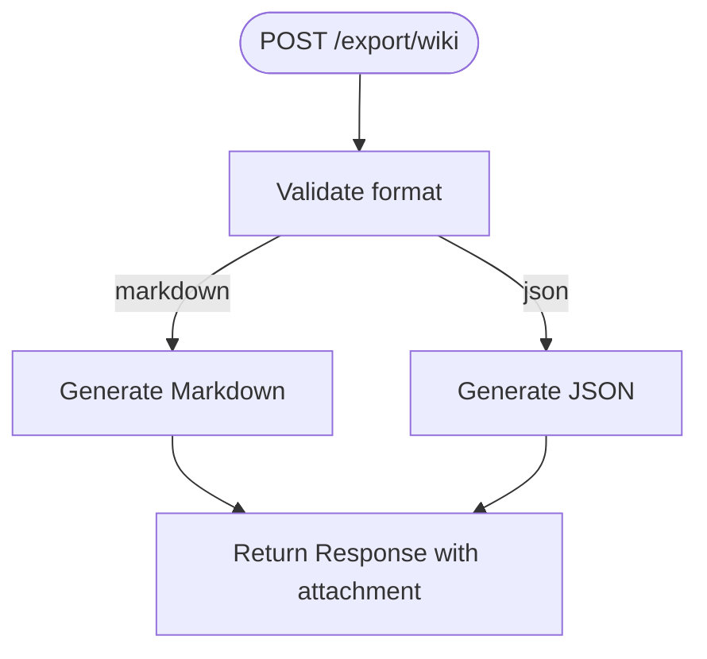
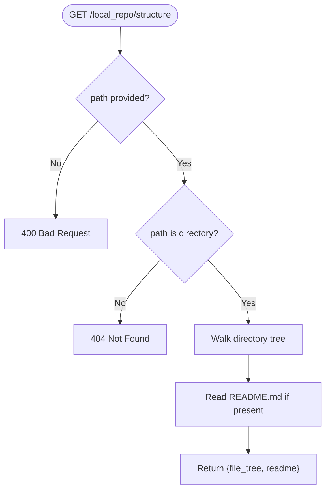
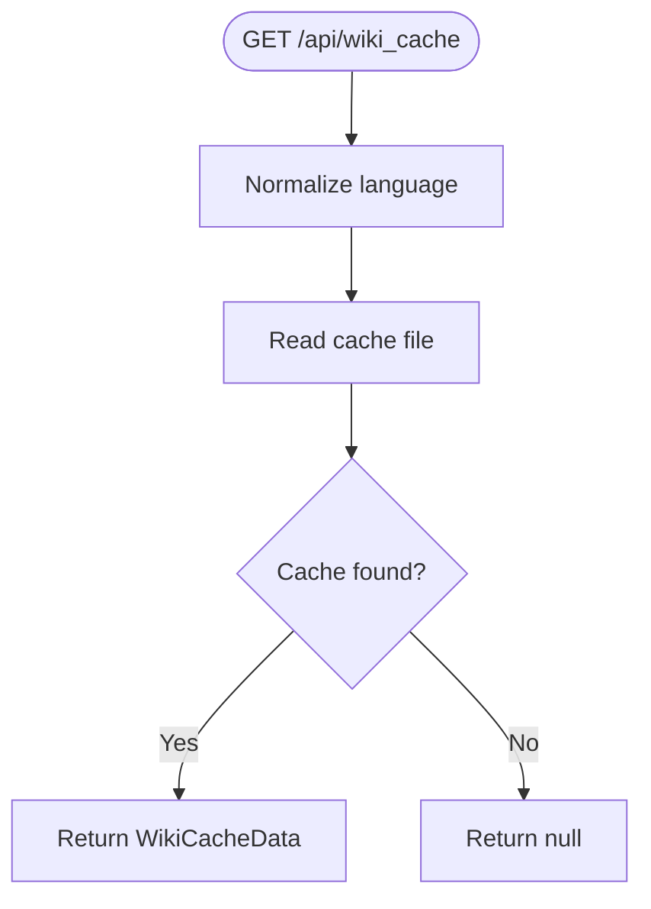
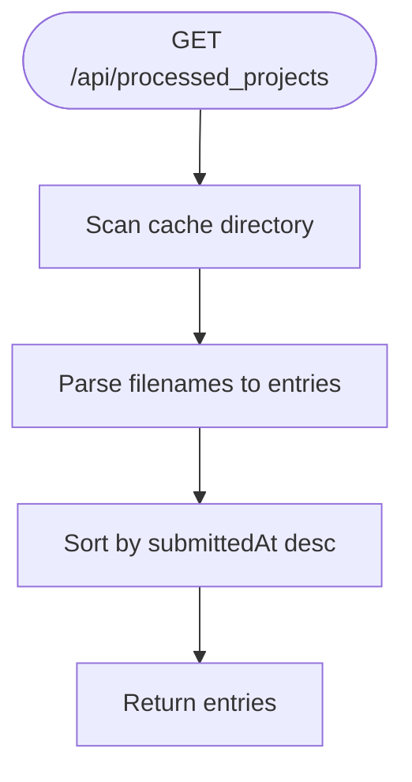
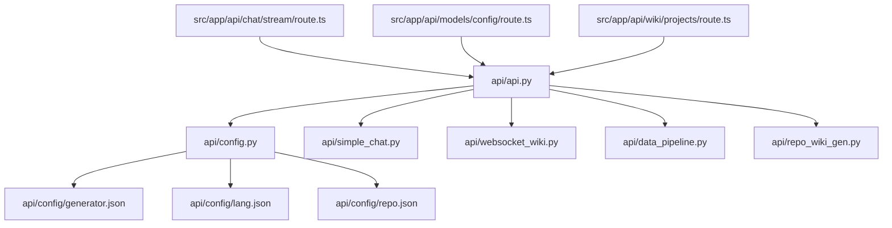

# REST Endpoints

<cite>
**Referenced Files in This Document**
- [api/api.py](file://api/api.py)
- [api/simple_chat.py](file://api/simple_chat.py)
- [api/websocket_wiki.py](file://api/websocket_wiki.py)
- [api/config.py](file://api/config.py)
- [api/config/generator.json](file://api/config/generator.json)
- [api/config/lang.json](file://api/config/lang.json)
- [api/config/repo.json](file://api/config/repo.json)
- [api/data_pipeline.py](file://api/data_pipeline.py)
- [api/repo_wiki_gen.py](file://api/repo_wiki_gen.py)
- [src/app/api/chat/stream/route.ts](file://src/app/api/chat/stream/route.ts)
- [src/app/api/models/config/route.ts](file://src/app/api/models/config/route.ts)
- [src/app/api/wiki/projects/route.ts](file://src/app/api/wiki/projects/route.ts)
- [api/main.py](file://api/main.py)
</cite>

## Table of Contents
1. [Introduction](#introduction)
2. [Project Structure](#project-structure)
3. [Core Components](#core-components)
4. [Architecture Overview](#architecture-overview)
5. [Detailed Component Analysis](#detailed-component-analysis)
6. [Dependency Analysis](#dependency-analysis)
7. [Performance Considerations](#performance-considerations)
8. [Troubleshooting Guide](#troubleshooting-guide)
9. [Conclusion](#conclusion)
10. [Appendices](#appendices)

## Introduction
This document provides comprehensive REST API documentation for DeepWiki-Open’s FastAPI endpoints. It covers the streaming chat completion endpoint, model configuration retrieval, wiki export, local repository structure inspection, health checks, wiki cache management, and processed projects listing. For each endpoint, you will find HTTP methods, URL patterns, request/response schemas, parameter validation, error handling, status codes, and authentication requirements. Practical usage examples and integration patterns are also included.

## Project Structure
The API surface is primarily implemented in the FastAPI application located in api/api.py. Supporting modules include configuration loaders, chat streaming logic, RAG utilities, and data pipeline helpers. The frontend Next.js API routes in src/app/api/ proxy requests to the FastAPI backend.

**Diagram sources**
- [api/api.py](file://api/api.py#L1-L635)
- [api/simple_chat.py](file://api/simple_chat.py#L1-L900)
- [api/websocket_wiki.py](file://api/websocket_wiki.py#L1-L978)
- [api/config.py](file://api/config.py#L1-L464)
- [api/config/generator.json](file://api/config/generator.json#L1-L101)
- [api/config/lang.json](file://api/config/lang.json#L1-L16)
- [api/config/repo.json](file://api/config/repo.json#L1-L129)
- [api/data_pipeline.py](file://api/data_pipeline.py#L1-L917)
- [api/repo_wiki_gen.py](file://api/repo_wiki_gen.py#L1-L550)
- [src/app/api/chat/stream/route.ts](file://src/app/api/chat/stream/route.ts#L1-L113)
- [src/app/api/models/config/route.ts](file://src/app/api/models/config/route.ts#L1-L64)
- [src/app/api/wiki/projects/route.ts](file://src/app/api/wiki/projects/route.ts#L1-L104)

**Section sources**
- [api/api.py](file://api/api.py#L1-L635)
- [src/app/api/chat/stream/route.ts](file://src/app/api/chat/stream/route.ts#L1-L113)
- [src/app/api/models/config/route.ts](file://src/app/api/models/config/route.ts#L1-L64)
- [src/app/api/wiki/projects/route.ts](file://src/app/api/wiki/projects/route.ts#L1-L104)

## Core Components
- FastAPI application with CORS enabled and multiple endpoints for chat, model config, wiki cache, export, local repo structure, health, and processed projects.
- Pydantic models define request/response schemas for chat, wiki cache, export, and processed projects.
- Configuration loader aggregates provider/model settings, language support, and repository filters from JSON files.
- Streaming chat handlers support multiple providers via unified interface and token-aware RAG retrieval.
- Data pipeline utilities provide token counting, repository download, and embedding-related helpers.

**Section sources**
- [api/api.py](file://api/api.py#L1-L635)
- [api/config.py](file://api/config.py#L1-L464)
- [api/simple_chat.py](file://api/simple_chat.py#L1-L900)
- [api/data_pipeline.py](file://api/data_pipeline.py#L1-L917)

## Architecture Overview
The backend FastAPI app exposes REST endpoints. Frontend Next.js routes act as proxies to the backend for selected endpoints. Authentication and authorization modes are configurable via environment variables and enforced in specific endpoints.

**Diagram sources**
- [src/app/api/chat/stream/route.ts](file://src/app/api/chat/stream/route.ts#L1-L113)
- [src/app/api/models/config/route.ts](file://src/app/api/models/config/route.ts#L1-L64)
- [src/app/api/wiki/projects/route.ts](file://src/app/api/wiki/projects/route.ts#L1-L104)
- [api/api.py](file://api/api.py#L1-L635)

## Detailed Component Analysis

### Endpoint: POST /chat/completions/stream
- Method: POST
- URL: /chat/completions/stream
- Purpose: Stream chat completions with optional RAG context and file-specific queries.
- Authentication: Not required by the endpoint itself; provider-specific credentials are handled internally.
- Request Schema (Pydantic):
  - repo_url: string (required)
  - messages: array of ChatMessage (required)
  - filePath: string (optional)
  - token: string (optional)
  - type: string (optional, default "github")
  - provider: string (optional, default "google")
  - model: string (optional)
  - language: string (optional, default "en")
  - excluded_dirs: string (optional)
  - excluded_files: string (optional)
  - included_dirs: string (optional)
  - included_files: string (optional)
- Response: Server-Sent Events (text/event-stream) chunks.
- Validation:
  - Messages must be non-empty; last message must be from role "user".
  - Token limit warnings for large inputs; fallback without context if token limit is exceeded.
  - RAG retrieval disabled for very large inputs.
- Error Handling:
  - 400: Missing messages or last message not from user.
  - 500: Retrieval errors, embedding size mismatches, provider API errors.
- Notes:
  - Supports multiple providers via unified configuration.
  - Deep Research mode recognized by "[DEEP RESEARCH]" tag in messages.
  - File content inclusion supported via filePath parameter.

**Diagram sources**
- [api/api.py](file://api/api.py#L398-L399)
- [api/simple_chat.py](file://api/simple_chat.py#L76-L800)

**Section sources**
- [api/api.py](file://api/api.py#L398-L399)
- [api/simple_chat.py](file://api/simple_chat.py#L76-L800)
- [api/data_pipeline.py](file://api/data_pipeline.py#L61-L102)

### Endpoint: GET /models/config
- Method: GET
- URL: /models/config
- Purpose: Retrieve available providers and models.
- Authentication: Not required.
- Response Schema (Pydantic):
  - providers: array of Provider
  - defaultProvider: string
  - Provider: id, name, models[], supportsCustomModel
  - Model: id, name
- Validation:
  - Returns default configuration if config loading fails.
- Error Handling:
  - Returns default provider configuration on failure.

**Diagram sources**
- [api/api.py](file://api/api.py#L167-L226)
- [api/config.py](file://api/config.py#L381-L464)
- [api/config/generator.json](file://api/config/generator.json#L1-L101)

**Section sources**
- [api/api.py](file://api/api.py#L167-L226)
- [api/config.py](file://api/config.py#L381-L464)
- [api/config/generator.json](file://api/config/generator.json#L1-L101)

### Endpoint: POST /export/wiki
- Method: POST
- URL: /export/wiki
- Purpose: Export wiki content as Markdown or JSON.
- Authentication: Not required.
- Request Schema (Pydantic):
  - repo_url: string (required)
  - pages: array of WikiPage (required)
  - format: "markdown" | "json" (required)
- Response:
  - Downloadable file attachment with appropriate Content-Type.
- Validation:
  - format must be one of "markdown" or "json".
- Error Handling:
  - 500: General export error.

**Diagram sources**
- [api/api.py](file://api/api.py#L227-L274)
- [api/api.py](file://api/api.py#L322-L391)

**Section sources**
- [api/api.py](file://api/api.py#L227-L274)
- [api/api.py](file://api/api.py#L322-L391)

### Endpoint: GET /local_repo/structure
- Method: GET
- URL: /local_repo/structure
- Purpose: Return file tree and README content for a local repository path.
- Authentication: Not required.
- Query Parameters:
  - path: string (required)
- Validation:
  - path must be provided and must be a directory.
- Error Handling:
  - 400: Missing path.
  - 404: Directory not found.
  - 500: Processing error.

**Diagram sources**
- [api/api.py](file://api/api.py#L275-L321)

**Section sources**
- [api/api.py](file://api/api.py#L275-L321)

### Endpoint: GET /health
- Method: GET
- URL: /health
- Purpose: Health check for monitoring and containerized deployments.
- Authentication: Not required.
- Response: JSON with status, timestamp, and service name.

**Section sources**
- [api/api.py](file://api/api.py#L540-L547)

### Endpoint: GET /api/wiki_cache
- Method: GET
- URL: /api/wiki_cache
- Purpose: Retrieve cached wiki data for a repository.
- Authentication: Optional, controlled by WIKI_AUTH_MODE; requires valid authorization code if enabled.
- Query Parameters:
  - owner: string (required)
  - repo: string (required)
  - repo_type: string (required)
  - language: string (required)
- Validation:
  - language normalized to supported languages; defaults if unsupported.
- Error Handling:
  - Returns null if cache not found (frontend expectation).
  - 401: Invalid authorization code when required.
  - 400: Unsupported language.

**Diagram sources**
- [api/api.py](file://api/api.py#L461-L484)

**Section sources**
- [api/api.py](file://api/api.py#L461-L484)
- [api/config.py](file://api/config.py#L49-L52)

### Endpoint: POST /api/wiki_cache
- Method: POST
- URL: /api/wiki_cache
- Purpose: Store generated wiki data to server-side cache.
- Authentication: Not required.
- Request Schema (Pydantic):
  - repo: RepoInfo
  - language: string
  - wiki_structure: WikiStructureModel
  - generated_pages: dict
  - provider: string
  - model: string
- Validation:
  - language normalized to supported languages; defaults if unsupported.
- Error Handling:
  - 500: Save failure.

**Section sources**
- [api/api.py](file://api/api.py#L486-L502)
- [api/api.py](file://api/api.py#L426-L457)

### Endpoint: DELETE /api/wiki_cache
- Method: DELETE
- URL: /api/wiki_cache
- Purpose: Delete a specific wiki cache file.
- Authentication: Optional, controlled by WIKI_AUTH_MODE; requires valid authorization code if enabled.
- Query Parameters:
  - owner: string (required)
  - repo: string (required)
  - repo_type: string (required)
  - language: string (required)
  - authorization_code: string (optional, required if WIKI_AUTH_MODE is enabled)
- Validation:
  - language must be supported.
- Error Handling:
  - 400: Unsupported language.
  - 401: Invalid authorization code.
  - 404: Cache not found.
  - 500: Deletion error.

**Section sources**
- [api/api.py](file://api/api.py#L504-L538)
- [api/config.py](file://api/config.py#L49-L52)

### Endpoint: GET /api/processed_projects
- Method: GET
- URL: /api/processed_projects
- Purpose: List processed projects found in the wiki cache directory.
- Authentication: Not required.
- Response Schema (Pydantic):
  - Array of ProcessedProjectEntry with fields: id, owner, repo, name, repo_type, submittedAt (ms), language.
- Validation:
  - Parses cache filenames to extract project metadata.
- Error Handling:
  - 500: Listing cache directory failed.

**Diagram sources**
- [api/api.py](file://api/api.py#L576-L634)

**Section sources**
- [api/api.py](file://api/api.py#L576-L634)

### Frontend Proxies

#### Next.js Proxy: GET /api/models/config
- Purpose: Fetch model configuration from backend.
- Behavior: Proxies to /models/config with JSON response.
- CORS: Configured in route.

**Section sources**
- [src/app/api/models/config/route.ts](file://src/app/api/models/config/route.ts#L1-L64)

#### Next.js Proxy: POST /api/chat/stream
- Purpose: HTTP fallback for chat streaming when WebSocket is unavailable.
- Behavior: Proxies to /chat/completions/stream with SSE headers.
- CORS: Configured in route.

**Section sources**
- [src/app/api/chat/stream/route.ts](file://src/app/api/chat/stream/route.ts#L1-L113)

#### Next.js Proxy: GET/DELETE /api/wiki/projects
- Purpose: List processed projects and delete project cache.
- Behavior: GET proxies to /api/processed_projects; DELETE proxies to /api/wiki_cache with DELETE method and query parameters.

**Section sources**
- [src/app/api/wiki/projects/route.ts](file://src/app/api/wiki/projects/route.ts#L1-L104)

## Dependency Analysis
- FastAPI app depends on configuration loader to assemble provider/model settings and language support.
- Chat endpoints depend on RAG utilities and data pipeline helpers for token counting and repository access.
- Wiki cache endpoints depend on filesystem I/O and Pydantic models for serialization.
- Frontend proxies depend on environment variables for backend base URL.

**Diagram sources**
- [api/api.py](file://api/api.py#L1-L635)
- [api/config.py](file://api/config.py#L1-L464)
- [api/simple_chat.py](file://api/simple_chat.py#L1-L900)
- [api/websocket_wiki.py](file://api/websocket_wiki.py#L1-L978)
- [api/data_pipeline.py](file://api/data_pipeline.py#L1-L917)
- [api/repo_wiki_gen.py](file://api/repo_wiki_gen.py#L1-L550)
- [api/config/generator.json](file://api/config/generator.json#L1-L101)
- [api/config/lang.json](file://api/config/lang.json#L1-L16)
- [api/config/repo.json](file://api/config/repo.json#L1-L129)
- [src/app/api/chat/stream/route.ts](file://src/app/api/chat/stream/route.ts#L1-L113)
- [src/app/api/models/config/route.ts](file://src/app/api/models/config/route.ts#L1-L64)
- [src/app/api/wiki/projects/route.ts](file://src/app/api/wiki/projects/route.ts#L1-L104)

**Section sources**
- [api/api.py](file://api/api.py#L1-L635)
- [api/config.py](file://api/config.py#L1-L464)

## Performance Considerations
- Streaming responses reduce latency and memory footprint for long-running completions.
- Token counting helps avoid excessive context sizes; fallback without context is attempted when limits are exceeded.
- RAG retrieval is disabled for very large inputs to prevent timeouts.
- Cache-based wiki retrieval reduces repeated computation for the same repository/language combinations.
- Environment-driven timeouts and proxy handling improve reliability behind corporate networks.

[No sources needed since this section provides general guidance]

## Troubleshooting Guide
- Authentication and Authorization:
  - WIKI_AUTH_MODE toggles authorization requirement for cache deletion; supply authorization_code when required.
- Provider Credentials:
  - Ensure environment variables for providers are set according to provider-specific requirements.
- Token Limit Exceeded:
  - Reduce input size or rely on fallback without context.
- Cache Issues:
  - Verify cache directory path and permissions; confirm language normalization to supported values.
- Frontend Proxies:
  - Confirm SERVER_BASE_URL and PYTHON_BACKEND_HOST environment variables are set correctly.

**Section sources**
- [api/config.py](file://api/config.py#L49-L52)
- [api/api.py](file://api/api.py#L504-L538)
- [api/simple_chat.py](file://api/simple_chat.py#L661-L735)
- [src/app/api/chat/stream/route.ts](file://src/app/api/chat/stream/route.ts#L5-L5)
- [src/app/api/wiki/projects/route.ts](file://src/app/api/wiki/projects/route.ts#L34-L36)

## Conclusion
DeepWiki-Open’s FastAPI backend provides a robust set of endpoints for streaming chat, model configuration retrieval, wiki export, local repository introspection, health checks, and cache management. The frontend Next.js routes offer convenient proxies for selected endpoints. Proper configuration of providers, language support, and authentication ensures secure and reliable operation across diverse deployment scenarios.

[No sources needed since this section summarizes without analyzing specific files]

## Appendices

### Request/Response Schemas Summary
- Chat Completion Request (POST /chat/completions/stream):
  - Fields: repo_url, messages, filePath, token, type, provider, model, language, excluded_dirs, excluded_files, included_dirs, included_files.
- Wiki Export Request (POST /export/wiki):
  - Fields: repo_url, pages, format.
- Wiki Cache Request (POST /api/wiki_cache):
  - Fields: repo, language, wiki_structure, generated_pages, provider, model.
- Processed Project Entry (GET /api/processed_projects):
  - Fields: id, owner, repo, name, repo_type, submittedAt, language.

**Section sources**
- [api/api.py](file://api/api.py#L40-L119)
- [api/api.py](file://api/api.py#L51-L67)
- [api/api.py](file://api/api.py#L577-L630)

### Practical Usage Examples
- Streaming Chat:
  - Send a POST request to /chat/completions/stream with a messages array ending with a user message.
  - Include provider and model parameters to select the desired LLM.
- Model Configuration:
  - GET /models/config to discover available providers and models.
- Wiki Export:
  - POST /export/wiki with repo_url, pages, and format ("markdown" or "json").
- Local Repo Inspection:
  - GET /local_repo/structure with path query parameter pointing to a local directory.
- Health Check:
  - GET /health for service readiness.
- Wiki Cache:
  - GET /api/wiki_cache to retrieve cached data.
  - POST /api/wiki_cache to store generated wiki data.
  - DELETE /api/wiki_cache to remove cached data (authorization may be required).
- Processed Projects:
  - GET /api/processed_projects to list processed projects.

[No sources needed since this section provides general guidance]