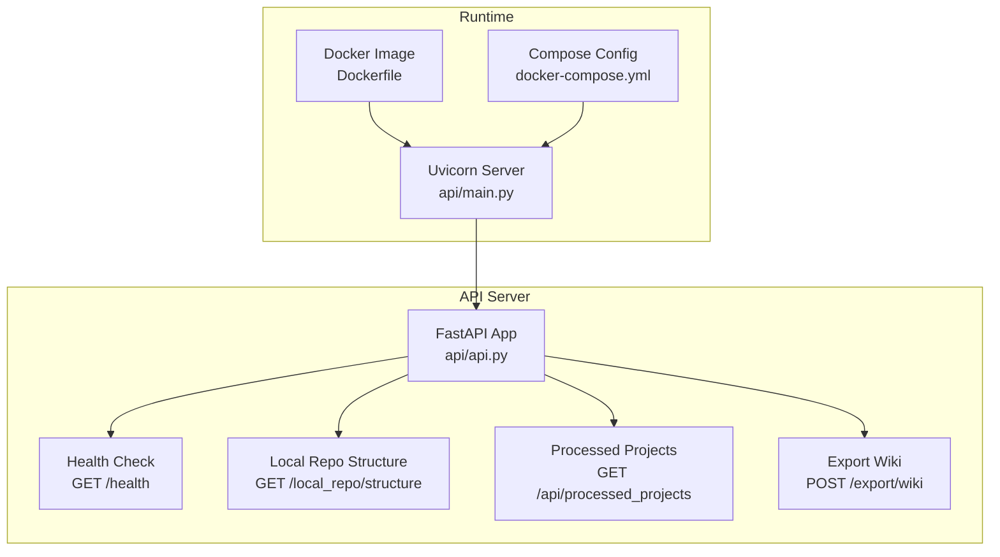
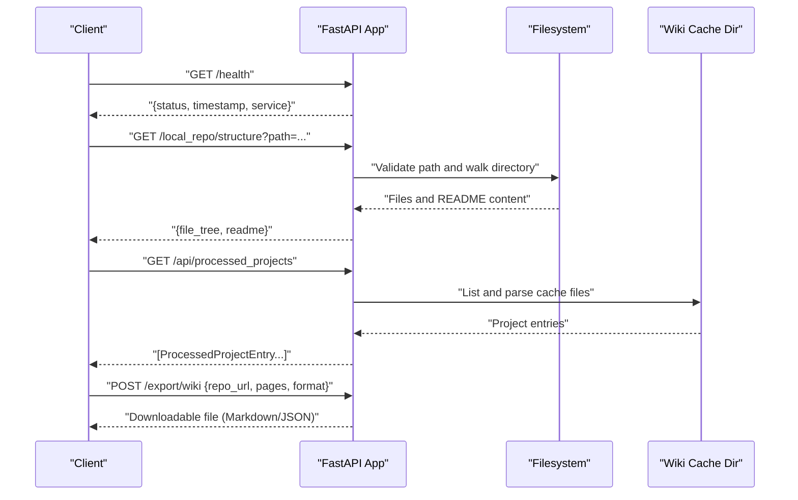
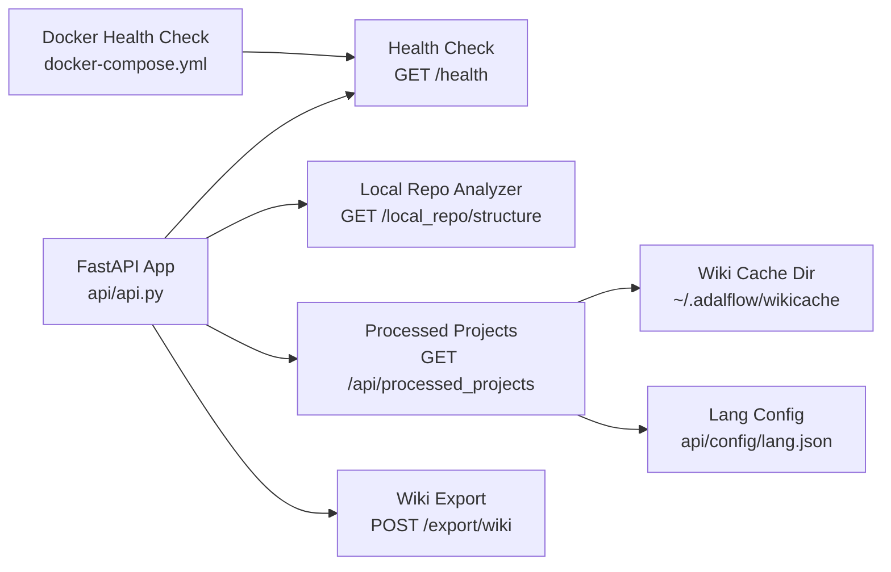

# Utility and Support Endpoints

<cite>
**Referenced Files in This Document**
- [api.py](file://api/api.py)
- [main.py](file://api/main.py)
- [Dockerfile](file://Dockerfile)
- [docker-compose.yml](file://docker-compose.yml)
- [config.py](file://api/config.py)
- [lang.json](file://api/config/lang.json)
</cite>

## Table of Contents
1. [Introduction](#introduction)
2. [Project Structure](#project-structure)
3. [Core Components](#core-components)
4. [Architecture Overview](#architecture-overview)
5. [Detailed Component Analysis](#detailed-component-analysis)
6. [Dependency Analysis](#dependency-analysis)
7. [Performance Considerations](#performance-considerations)
8. [Troubleshooting Guide](#troubleshooting-guide)
9. [Conclusion](#conclusion)

## Introduction
This document describes the utility and support endpoints exposed by the DeepWiki-Open API server. It focuses on:
- Health checks for service monitoring and Docker container verification
- Local repository analysis for path validation, file tree generation, and README content extraction
- Cache management for processed projects, including listing, parsing, and metadata extraction
- Wiki export functionality for generating downloadable Markdown or JSON exports

The goal is to provide clear request parameters, response formats, error conditions, and integration patterns for each endpoint.

## Project Structure
The API server is implemented using FastAPI and exposes multiple endpoints under a single application. The primary endpoint definitions and related utilities are located in the API module.

**Diagram sources**
- [api.py](file://api/api.py#L540-L547)
- [api.py](file://api/api.py#L275-L320)
- [api.py](file://api/api.py#L576-L634)
- [api.py](file://api/api.py#L227-L274)
- [main.py](file://api/main.py#L87-L103)
- [Dockerfile](file://Dockerfile#L138-L170)
- [docker-compose.yml](file://docker-compose.yml#L39-L45)

**Section sources**
- [api.py](file://api/api.py#L1-L120)
- [main.py](file://api/main.py#L87-L103)

## Core Components
- Health check endpoint: Lightweight service verification returning a standardized JSON payload.
- Local repository analyzer: Validates a path, enumerates files while filtering hidden items, and extracts README content.
- Processed projects endpoint: Scans the wiki cache directory and parses filenames to extract project metadata.
- Wiki export endpoint: Generates downloadable Markdown or JSON exports of wiki pages with appropriate headers.

Key implementation references:
- Health check: [api.py](file://api/api.py#L540-L547)
- Local repo structure: [api.py](file://api/api.py#L275-L320)
- Processed projects: [api.py](file://api/api.py#L576-L634)
- Wiki export: [api.py](file://api/api.py#L227-L274)

**Section sources**
- [api.py](file://api/api.py#L227-L320)
- [api.py](file://api/api.py#L540-L547)
- [api.py](file://api/api.py#L576-L634)

## Architecture Overview
The endpoints are served by a FastAPI application. The Docker image and compose configuration define health checks that probe the health endpoint to verify container readiness.

**Diagram sources**
- [api.py](file://api/api.py#L540-L547)
- [api.py](file://api/api.py#L275-L320)
- [api.py](file://api/api.py#L576-L634)
- [api.py](file://api/api.py#L227-L274)

## Detailed Component Analysis

### Health Check: GET /health
Purpose:
- Provide a simple, reliable indicator of service health for monitoring systems and Docker health checks.

Behavior:
- Returns a JSON object with service status, timestamp, and service identity.
- Designed to be lightweight and fast.

Response format:
- Fields:
  - status: String indicating health state
  - timestamp: ISO formatted timestamp
  - service: String identifying the service

Monitoring integration:
- Docker health check probes the endpoint at a configured interval and failure threshold.
- The compose configuration defines a health check that uses curl to call the endpoint.

Docker container health verification:
- The health check is executed inside the container using curl against the configured port.
- Health status is evaluated based on HTTP success and response validity.

Example request:
- GET http://host:port/health

Example response:
- {
  "status": "healthy",
  "timestamp": "2025-01-01T12:00:00Z",
  "service": "deepwiki-api"
}

Error conditions:
- Unavailable if the server is down or the endpoint is unreachable.
- The Docker health check will mark the container unhealthy if the endpoint fails consistently.

Integration patterns:
- Kubernetes liveness/readiness probes can target this endpoint.
- Docker Compose healthcheck integrates directly with the endpoint.

**Section sources**
- [api.py](file://api/api.py#L540-L547)
- [docker-compose.yml](file://docker-compose.yml#L39-L45)
- [Dockerfile](file://Dockerfile#L149-L156)

### Local Repository Analysis: GET /local_repo/structure
Purpose:
- Analyze a local repository directory and return a file tree and README content for quick inspection.

Parameters:
- path: Query parameter specifying the absolute or relative path to the local repository root.

Validation and behavior:
- If path is not provided, returns a 400 with an error message.
- If path does not exist or is not a directory, returns a 404 with an error message.
- Walks the directory tree, excluding hidden directories and common virtual environments.
- Skips hidden files and specific initialization files.
- Reads the first README.md encountered (case-insensitive) and captures its content.

Response format:
- Fields:
  - file_tree: String containing newline-separated relative file paths, sorted.
  - readme: String containing the README content if found; empty if not found.

Example request:
- GET http://host:port/local_repo/structure?path=/absolute/path/to/repo

Example response:
- {
  "file_tree": "README.md\npackage.json\nsrc/\nsrc/index.js\n...",
  "readme": "# My Project\n\n..."
}

Error conditions:
- 400: Missing path parameter.
- 404: Path not found or not a directory.
- 500: Internal error during processing (e.g., permission issues).

Integration patterns:
- Use for pre-flight checks before wiki generation.
- Combine with repository URL parsing to confirm local presence.

**Section sources**
- [api.py](file://api/api.py#L275-L320)

### Processed Projects: GET /api/processed_projects
Purpose:
- Enumerate previously processed projects stored in the wiki cache directory and return metadata for each.

Behavior:
- Scans the wiki cache directory for files matching the naming convention.
- Parses filenames to extract owner, repository name, repository type, and language.
- Converts file modification time to milliseconds for sorting.
- Sorts results by recency (most recent first).
- Returns an empty list if the cache directory does not exist.

Filename convention:
- deepwiki_cache_{repo_type}_{owner}_{repo}_{language}.json

Response format:
- Array of ProcessedProjectEntry objects with fields:
  - id: Original filename
  - owner: Repository owner
  - repo: Repository name (may contain underscores)
  - name: Composite owner/repo
  - repo_type: Repository type (e.g., github, gitlab)
  - submittedAt: Milliseconds since epoch (modification time)
  - language: Language code

Example request:
- GET http://host:port/api/processed_projects

Example response:
- [
  {
    "id": "deepwiki_cache_github_asyncfuncai_deepwiki-open_en.json",
    "owner": "asyncfuncai",
    "repo": "deepwiki-open",
    "name": "asyncfuncai/deepwiki-open",
    "repo_type": "github",
    "submittedAt": 1700000000000,
    "language": "en"
  },
  ...
]

Error conditions:
- 500: Failure to list or parse cache directory.

Integration patterns:
- Use to populate UI lists of previously processed projects.
- Pair with cache retrieval endpoints to preview or reuse prior wiki content.

**Section sources**
- [api.py](file://api/api.py#L576-L634)

### Wiki Export: POST /export/wiki
Purpose:
- Generate a downloadable export of wiki pages in either Markdown or JSON format.

Request body (JSON):
- repo_url: String representing the repository URL
- pages: Array of wiki page objects
- format: String literal, either "markdown" or "json"

Markdown export:
- Generates a human-readable Markdown document with a table of contents and page content.
- Uses page IDs as anchors and includes related pages where applicable.

JSON export:
- Produces a structured JSON object containing metadata and page data.

Response:
- Returns a Response object with:
  - Content-Type: text/markdown for Markdown, application/json for JSON
  - Content-Disposition: attachment with a filename derived from the repository name and timestamp
  - Body: Generated content

Example request:
- POST http://host:port/export/wiki
- Body:
  {
    "repo_url": "https://github.com/example/repo",
    "pages": [
      {
        "id": "introduction",
        "title": "Introduction",
        "content": "# Welcome",
        "filePaths": [],
        "importance": "high",
        "relatedPages": []
      }
    ],
    "format": "markdown"
  }

Example response:
- A downloadable .md file with the exported content.

Error conditions:
- 500: Internal error during export generation.

Integration patterns:
- Use to export wiki content for archival or downstream processing.
- Combine with cache retrieval to export previously generated wiki content.

**Section sources**
- [api.py](file://api/api.py#L227-L274)
- [api.py](file://api/api.py#L322-L391)

## Dependency Analysis
The endpoints depend on the FastAPI application and shared configuration utilities. The health check is used by Docker health checks. The processed projects endpoint relies on the wiki cache directory structure and language configuration.

**Diagram sources**
- [api.py](file://api/api.py#L540-L547)
- [api.py](file://api/api.py#L275-L320)
- [api.py](file://api/api.py#L576-L634)
- [api.py](file://api/api.py#L227-L274)
- [docker-compose.yml](file://docker-compose.yml#L39-L45)
- [lang.json](file://api/config/lang.json#L1-L16)

**Section sources**
- [api.py](file://api/api.py#L540-L547)
- [api.py](file://api/api.py#L576-L634)
- [docker-compose.yml](file://docker-compose.yml#L39-L45)
- [lang.json](file://api/config/lang.json#L1-L16)

## Performance Considerations
- Local repository analysis performs a directory walk and may be slow for very large repositories. Consider limiting recursion depth or providing progress feedback for UI integrations.
- Processed projects scanning reads file metadata for each cache file. On systems with many cache files, consider caching directory listings or adding pagination.
- Wiki export generates content in-memory before sending. For very large wikis, consider streaming or chunked responses to reduce memory usage.

## Troubleshooting Guide
Common issues and resolutions:
- Health check failures:
  - Ensure the API server is running and reachable on the configured port.
  - Verify Docker health check configuration targets the correct port.
- Local repository analysis errors:
  - Confirm the path exists and is readable.
  - Check for permission issues or symbolic links that may cause unexpected traversal.
- Processed projects endpoint errors:
  - Verify the wiki cache directory exists and is accessible.
  - Ensure cache files follow the expected naming convention.
- Wiki export errors:
  - Validate the request body format and required fields.
  - Confirm the chosen format is supported ("markdown" or "json").

**Section sources**
- [api.py](file://api/api.py#L275-L320)
- [api.py](file://api/api.py#L576-L634)
- [api.py](file://api/api.py#L227-L274)
- [docker-compose.yml](file://docker-compose.yml#L39-L45)

## Conclusion
The utility and support endpoints provide essential operational capabilities:
- Health checks enable automated monitoring and container lifecycle management.
- Local repository analysis helps validate and inspect repository structure.
- Processed projects listing facilitates cache introspection and reuse.
- Wiki export enables portable documentation delivery in multiple formats.

These endpoints integrate cleanly with Docker-based deployments and can be incorporated into broader monitoring and automation workflows.