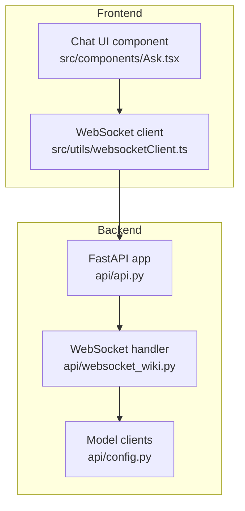
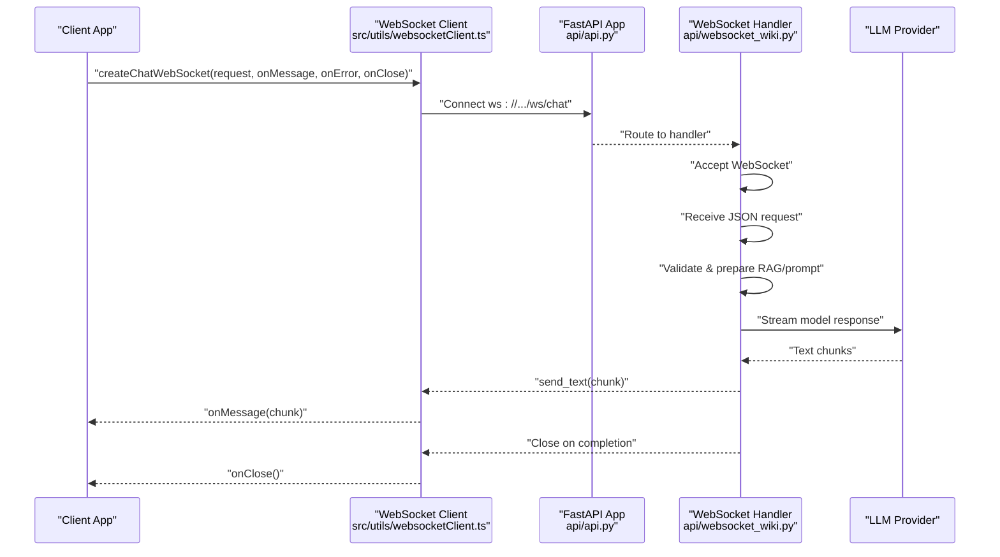
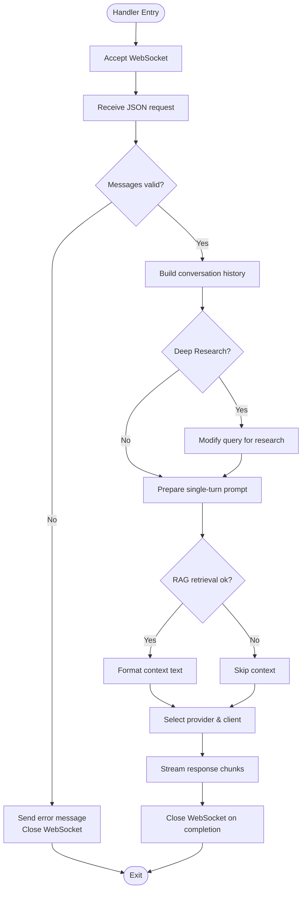
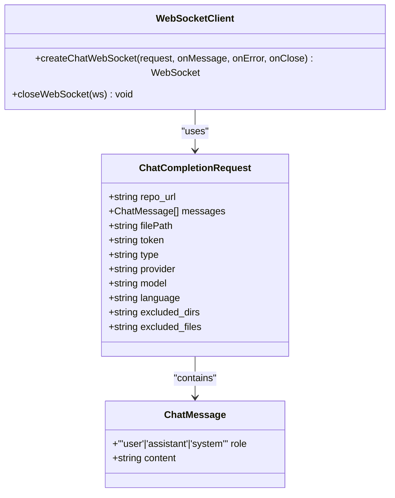
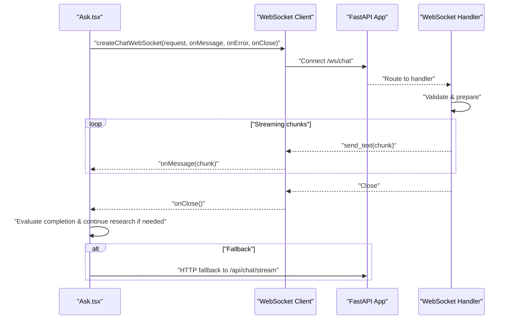
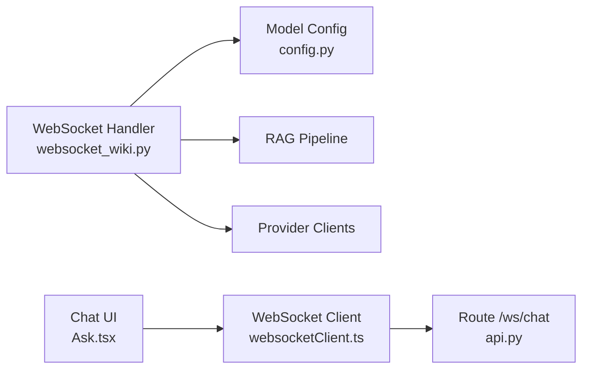

# WebSocket Endpoints

<cite>
**Referenced Files in This Document**
- [api.py](file://api/api.py)
- [websocket_wiki.py](file://api/websocket_wiki.py)
- [websocketClient.ts](file://src/utils/websocketClient.ts)
- [Ask.tsx](file://src/components/Ask.tsx)
- [config.py](file://api/config.py)
</cite>

## Table of Contents
1. [Introduction](#introduction)
2. [Project Structure](#project-structure)
3. [Core Components](#core-components)
4. [Architecture Overview](#architecture-overview)
5. [Detailed Component Analysis](#detailed-component-analysis)
6. [Dependency Analysis](#dependency-analysis)
7. [Performance Considerations](#performance-considerations)
8. [Troubleshooting Guide](#troubleshooting-guide)
9. [Conclusion](#conclusion)

## Introduction
This document describes the WebSocket real-time chat functionality for DeepWiki-Open, focusing on the /ws/chat endpoint. It explains connection establishment, message formats, event types, streaming response semantics, error handling, client-side implementation guidelines, connection lifecycle management, and performance optimization techniques. It also covers bidirectional communication patterns and state management during WebSocket sessions.

## Project Structure
The WebSocket chat feature spans backend and frontend components:
- Backend FastAPI application registers the WebSocket route and delegates handling to a dedicated module.
- The backend WebSocket handler validates requests, prepares retrieval-augmented prompts, selects providers, streams model responses, and manages connection lifecycle.
- Frontend provides a reusable WebSocket client and integrates it into the chat UI component.

**Diagram sources**
- [api.py](file://api/api.py#L399-L401)
- [websocket_wiki.py](file://api/websocket_wiki.py#L53-L780)
- [config.py](file://api/config.py#L381-L463)
- [websocketClient.ts](file://src/utils/websocketClient.ts#L1-L86)
- [Ask.tsx](file://src/components/Ask.tsx#L532-L627)

**Section sources**
- [api.py](file://api/api.py#L399-L401)
- [websocket_wiki.py](file://api/websocket_wiki.py#L53-L780)
- [websocketClient.ts](file://src/utils/websocketClient.ts#L1-L86)
- [Ask.tsx](file://src/components/Ask.tsx#L532-L627)

## Core Components
- WebSocket route registration: The backend registers the /ws/chat WebSocket endpoint and binds it to the handler.
- WebSocket handler: Accepts the initial JSON request, validates inputs, prepares retrieval-augmented prompts, selects a provider, streams model responses, and closes the connection.
- Frontend WebSocket client: Establishes the WebSocket connection, sends the initial JSON request, and forwards incoming text frames to the caller.
- Chat UI integration: Manages conversation state, triggers research iterations, and handles fallback to HTTP streaming when WebSocket fails.

**Section sources**
- [api.py](file://api/api.py#L399-L401)
- [websocket_wiki.py](file://api/websocket_wiki.py#L53-L780)
- [websocketClient.ts](file://src/utils/websocketClient.ts#L43-L75)
- [Ask.tsx](file://src/components/Ask.tsx#L532-L627)

## Architecture Overview
The WebSocket chat pipeline connects the client to the backend, which orchestrates retrieval, prompt construction, provider selection, and streaming responses.

**Diagram sources**
- [api.py](file://api/api.py#L399-L401)
- [websocket_wiki.py](file://api/websocket_wiki.py#L53-L780)
- [websocketClient.ts](file://src/utils/websocketClient.ts#L43-L75)

## Detailed Component Analysis

### WebSocket Route Registration
- The backend registers the WebSocket route at /ws/chat and binds it to the handler function.
- The handler is imported from the WebSocket module and attached to the app.

**Section sources**
- [api.py](file://api/api.py#L399-L401)

### WebSocket Handler: Request Validation and Prompt Preparation
- Accepts the WebSocket and receives the initial JSON payload.
- Validates presence and roles of messages, constructs conversation history, and detects Deep Research mode.
- Prepares retrieval-augmented context when feasible and falls back to simplified prompts when token limits are exceeded.
- Selects provider-specific model clients and initiates streaming responses.

**Diagram sources**
- [websocket_wiki.py](file://api/websocket_wiki.py#L53-L780)

**Section sources**
- [websocket_wiki.py](file://api/websocket_wiki.py#L53-L780)

### Frontend WebSocket Client
- Provides a typed interface for creating and managing a WebSocket connection.
- Sends the initial JSON request immediately upon opening.
- Forwards incoming text frames to the caller’s message handler.
- Supports graceful closure and safe close checks.

**Diagram sources**
- [websocketClient.ts](file://src/utils/websocketClient.ts#L17-L33)
- [websocketClient.ts](file://src/utils/websocketClient.ts#L43-L75)

**Section sources**
- [websocketClient.ts](file://src/utils/websocketClient.ts#L1-L86)

### Chat UI Integration and State Management
- The chat component composes requests, manages conversation history, and drives Deep Research iterations.
- On close, it evaluates whether research is complete and optionally continues automatically.
- Falls back to HTTP streaming if WebSocket fails.

**Diagram sources**
- [Ask.tsx](file://src/components/Ask.tsx#L532-L627)
- [Ask.tsx](file://src/components/Ask.tsx#L368-L396)
- [Ask.tsx](file://src/components/Ask.tsx#L406-L480)

**Section sources**
- [Ask.tsx](file://src/components/Ask.tsx#L532-L627)
- [Ask.tsx](file://src/components/Ask.tsx#L368-L396)
- [Ask.tsx](file://src/components/Ask.tsx#L406-L480)

## Dependency Analysis
- The backend handler depends on:
  - Configuration utilities for provider selection and model parameters.
  - Retrieval-Augmented Generation (RAG) pipeline for context retrieval.
  - Provider-specific clients for streaming responses.
- The frontend client depends on the backend route and environment-provided base URL.

**Diagram sources**
- [websocket_wiki.py](file://api/websocket_wiki.py#L53-L780)
- [config.py](file://api/config.py#L381-L463)
- [api.py](file://api/api.py#L399-L401)
- [websocketClient.ts](file://src/utils/websocketClient.ts#L1-L86)
- [Ask.tsx](file://src/components/Ask.tsx#L532-L627)

**Section sources**
- [websocket_wiki.py](file://api/websocket_wiki.py#L53-L780)
- [config.py](file://api/config.py#L381-L463)
- [api.py](file://api/api.py#L399-L401)
- [websocketClient.ts](file://src/utils/websocketClient.ts#L1-L86)
- [Ask.tsx](file://src/components/Ask.tsx#L532-L627)

## Performance Considerations
- Token limits: The handler estimates token counts and may skip retrieval or fall back to simplified prompts to avoid exceeding provider context limits.
- Streaming: Responses are streamed per provider; ensure clients render incrementally to minimize perceived latency.
- Connection lifecycle: The handler explicitly closes the WebSocket after streaming completes; avoid long-lived connections and reuse the client appropriately.
- Deep Research: Iterative research can increase token usage; monitor cumulative context and consider reducing iteration depth or simplifying prompts.

[No sources needed since this section provides general guidance]

## Troubleshooting Guide
Common issues and resolutions:
- WebSocket fails to connect:
  - Verify the server base URL and route. The client derives the WebSocket URL from the server base URL and appends /ws/chat.
  - Check CORS configuration and network connectivity.
- Provider API errors:
  - Missing or invalid API keys lead to provider-specific error messages sent via WebSocket.
  - Confirm environment variables and provider configuration.
- Token limit exceeded:
  - The handler attempts a fallback without retrieval context; if still failing, reduce query length or simplify context.
- Deep Research not completing:
  - Completion markers are detected heuristically; ensure the query indicates continuation when desired.
  - The UI forces completion after a maximum number of iterations.

**Section sources**
- [websocketClient.ts](file://src/utils/websocketClient.ts#L6-L15)
- [websocket_wiki.py](file://api/websocket_wiki.py#L781-L967)
- [Ask.tsx](file://src/components/Ask.tsx#L368-L396)
- [Ask.tsx](file://src/components/Ask.tsx#L406-L480)

## Conclusion
The /ws/chat endpoint enables efficient, real-time chat interactions with retrieval-augmented prompts and provider-agnostic streaming. The backend enforces validation, manages context, and streams responses, while the frontend provides a robust client and UI integration with fallback capabilities. Following the guidelines herein ensures reliable, performant, and user-friendly real-time chat experiences.