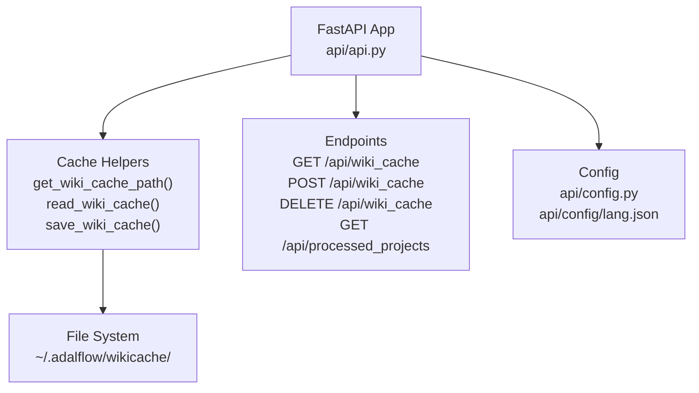
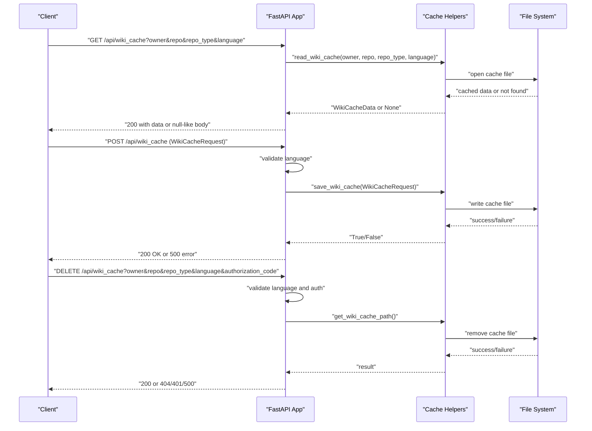
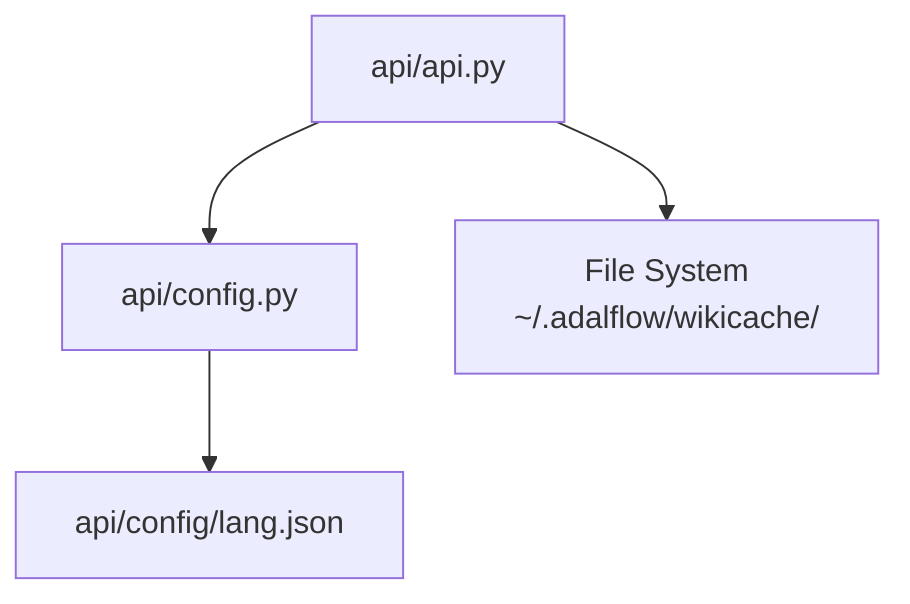

# Cache API Endpoints

<cite>
**Referenced Files in This Document**
- [api/api.py](file://api/api.py)
- [api/config.py](file://api/config.py)
- [api/config/lang.json](file://api/config/lang.json)
</cite>

## Table of Contents
1. [Introduction](#introduction)
2. [Project Structure](#project-structure)
3. [Core Components](#core-components)
4. [Architecture Overview](#architecture-overview)
5. [Detailed Component Analysis](#detailed-component-analysis)
6. [Dependency Analysis](#dependency-analysis)
7. [Performance Considerations](#performance-considerations)
8. [Troubleshooting Guide](#troubleshooting-guide)
9. [Conclusion](#conclusion)

## Introduction
This document provides detailed API documentation for DeepWiki-Open’s cache management endpoints. It covers:
- GET /api/wiki_cache: Retrieve cached wiki data for a repository
- POST /api/wiki_cache: Store wiki cache data
- DELETE /api/wiki_cache: Remove cached wiki data
- GET /api/processed_projects: List cached projects

It includes request/response schemas, validation rules, error handling, authentication and authorization requirements, rate limiting considerations, and practical integration patterns.

## Project Structure
The cache endpoints are implemented in the FastAPI application within the backend module. The cache directory is managed under the user’s home directory in a dedicated folder for persistent storage.

**Diagram sources**
- [api/api.py](file://api/api.py#L403-L635)
- [api/config.py](file://api/config.py#L1-L464)
- [api/config/lang.json](file://api/config/lang.json#L1-L16)

**Section sources**
- [api/api.py](file://api/api.py#L403-L635)

## Core Components
- Cache directory: Managed under the user’s home directory at a path derived from the application’s configuration and defaults to a subfolder for wiki cache storage.
- Data models:
  - WikiCacheRequest: Request body for storing cache data
  - WikiCacheData: Response model for cached data
  - ProcessedProjectEntry: Response model for listing processed projects
- Language configuration: Supported languages and default language are loaded from configuration files.

Key behaviors:
- GET /api/wiki_cache returns cached data if present; returns null-like response when not found (frontend expectation).
- POST /api/wiki_cache validates language against supported list and persists cache to disk.
- DELETE /api/wiki_cache requires authorization when enabled and deletes the cache file if present.
- GET /api/processed_projects scans the cache directory and parses filenames to construct project entries.

**Section sources**
- [api/api.py](file://api/api.py#L403-L635)
- [api/config.py](file://api/config.py#L280-L308)
- [api/config/lang.json](file://api/config/lang.json#L1-L16)

## Architecture Overview
The cache endpoints integrate with the FastAPI application and rely on:
- Configuration for language support and authorization mode
- File system operations for cache read/write/delete
- Asynchronous helpers for safe file system access

**Diagram sources**
- [api/api.py](file://api/api.py#L461-L539)
- [api/api.py](file://api/api.py#L408-L458)

## Detailed Component Analysis

### GET /api/wiki_cache
Purpose:
- Retrieve cached wiki data for a given repository and language.

Query parameters:
- owner (string, required): Repository owner
- repo (string, required): Repository name
- repo_type (string, required): Repository type (e.g., github, gitlab)
- language (string, required): Language code (validated against supported languages)

Behavior:
- Validates language against supported list; falls back to default if unsupported
- Attempts to read cache file based on constructed path
- Returns cached data if found; returns null-like response when not found

Response:
- 200 OK with cached data or null-like body when not found
- 500 Internal Server Error on unexpected failures

Security:
- No explicit authorization enforced

Rate limiting:
- Not enforced by the endpoint itself

Integration tips:
- Use language fallback behavior to ensure compatibility
- Expect null-like response when cache is absent

**Section sources**
- [api/api.py](file://api/api.py#L461-L484)
- [api/config.py](file://api/config.py#L280-L308)

### POST /api/wiki_cache
Purpose:
- Store generated wiki cache data to the server-side cache.

Request body (WikiCacheRequest):
- repo: RepoInfo (owner, repo, type, optional token/localPath/repoUrl)
- language: string (validated against supported languages)
- wiki_structure: WikiStructureModel (structure of wiki pages)
- generated_pages: Dict[string, WikiPage] (generated pages keyed by id)
- provider: string (provider used)
- model: string (model used)

Validation rules:
- language validated against supported languages; falls back to default if unsupported
- All required fields must be present in the request body

Success response:
- 200 OK with message indicating successful save

Error responses:
- 500 Internal Server Error on failure to write cache

Integration tips:
- Ensure language is one of the supported codes
- Serialize large payloads carefully; endpoint logs payload size for debugging

**Section sources**
- [api/api.py](file://api/api.py#L486-L502)
- [api/api.py](file://api/api.py#L90-L111)
- [api/config.py](file://api/config.py#L280-L308)

### DELETE /api/wiki_cache
Purpose:
- Delete a specific wiki cache file.

Query parameters:
- owner (string, required): Repository owner
- repo (string, required): Repository name
- repo_type (string, required): Repository type (e.g., github, gitlab)
- language (string, required): Language code (must be supported)
- authorization_code (string, optional): Required when authorization mode is enabled

Behavior:
- Validates language against supported list; rejects unsupported language
- Enforces authorization when enabled; compares provided code with configured secret
- Constructs cache file path and removes it if present
- Returns success message if deleted; raises 404 if not found; raises 401 if authorization fails; raises 500 on IO errors

Security considerations:
- Authorization mode must be enabled via environment configuration
- Authorization code is required when authorization mode is active

**Section sources**
- [api/api.py](file://api/api.py#L504-L539)
- [api/config.py](file://api/config.py#L49-L52)

### GET /api/processed_projects
Purpose:
- List all processed projects found in the cache directory.

Behavior:
- Scans the cache directory for files matching the naming pattern
- Parses filenames to extract owner, repo, repo_type, and language
- Builds ProcessedProjectEntry list with submission timestamps
- Sorts entries by most recent first

Response:
- 200 OK with list of ProcessedProjectEntry objects
- 500 Internal Server Error on scanning failures

Filtering:
- Filtering by owner/repo/language is not exposed by this endpoint; use the list and filter client-side

**Section sources**
- [api/api.py](file://api/api.py#L577-L635)

## Dependency Analysis
- Language configuration dependency:
  - Supported languages and default language are loaded from configuration files and used for validation and fallback
- Authorization dependency:
  - Authorization mode and code are read from environment variables and enforced during cache deletion
- File system dependency:
  - Cache directory path is derived from user home directory and cache naming convention
  - Endpoints perform synchronous file operations; helpers wrap them for safe async usage

**Diagram sources**
- [api/api.py](file://api/api.py#L403-L635)
- [api/config.py](file://api/config.py#L280-L308)
- [api/config/lang.json](file://api/config/lang.json#L1-L16)

**Section sources**
- [api/api.py](file://api/api.py#L403-L635)
- [api/config.py](file://api/config.py#L49-L52)
- [api/config.py](file://api/config.py#L280-L308)

## Performance Considerations
- Payload size logging: The POST endpoint logs the serialized payload size to aid in debugging large caches.
- Asynchronous file operations: Directory listing and stat operations are executed asynchronously to avoid blocking the event loop.
- Cache directory scanning: The processed projects endpoint scans the cache directory; ensure the directory is not excessively large to keep listing responsive.

[No sources needed since this section provides general guidance]

## Troubleshooting Guide
Common issues and resolutions:
- Unsupported language:
  - Symptom: 400 Bad Request on DELETE or language fallback behavior on GET/POST
  - Resolution: Use a supported language code or rely on default fallback
- Authorization required:
  - Symptom: 401 Unauthorized on DELETE
  - Resolution: Provide a valid authorization code when authorization mode is enabled
- Cache not found:
  - Symptom: 404 Not Found on DELETE or null-like response on GET
  - Resolution: Ensure the cache file exists for the given owner/repo/language
- IO errors:
  - Symptom: 500 Internal Server Error on POST/DELETE
  - Resolution: Check file system permissions and available disk space

Debugging techniques:
- Enable logging to inspect cache operations and errors
- Monitor payload sizes for large cache writes
- Verify cache directory path and file naming convention

**Section sources**
- [api/api.py](file://api/api.py#L461-L539)
- [api/config.py](file://api/config.py#L49-L52)

## Conclusion
The cache API endpoints provide a straightforward mechanism to retrieve, store, and remove cached wiki data, along with listing processed projects. They enforce language validation, support optional authorization for deletion, and rely on a predictable file naming scheme for cache persistence. Use the provided request/response schemas and validation rules to integrate reliably, and leverage the troubleshooting guidance for common operational issues.