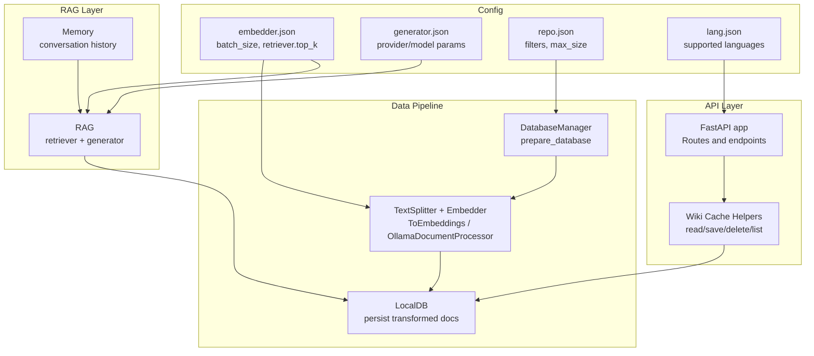
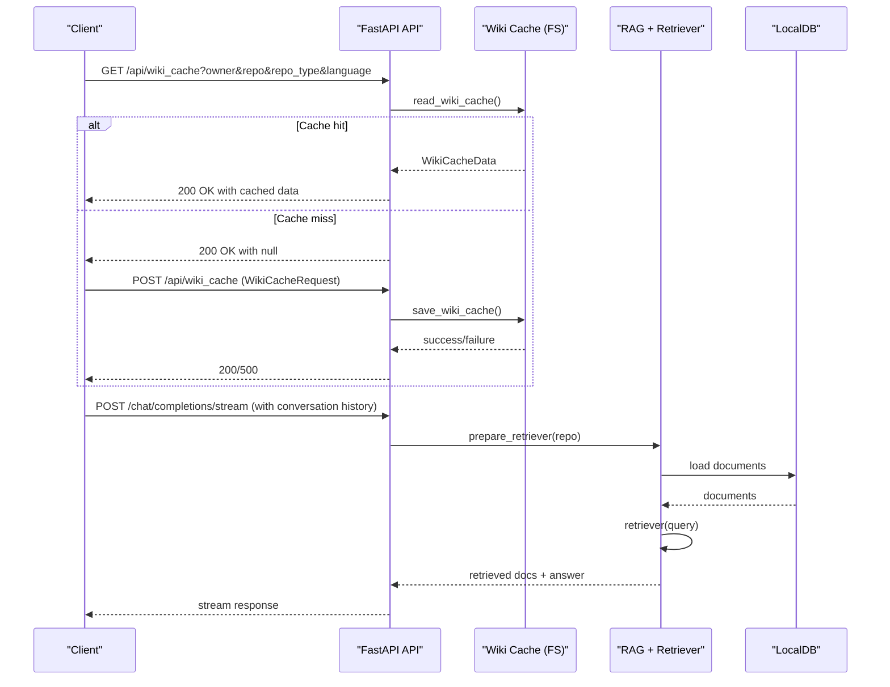
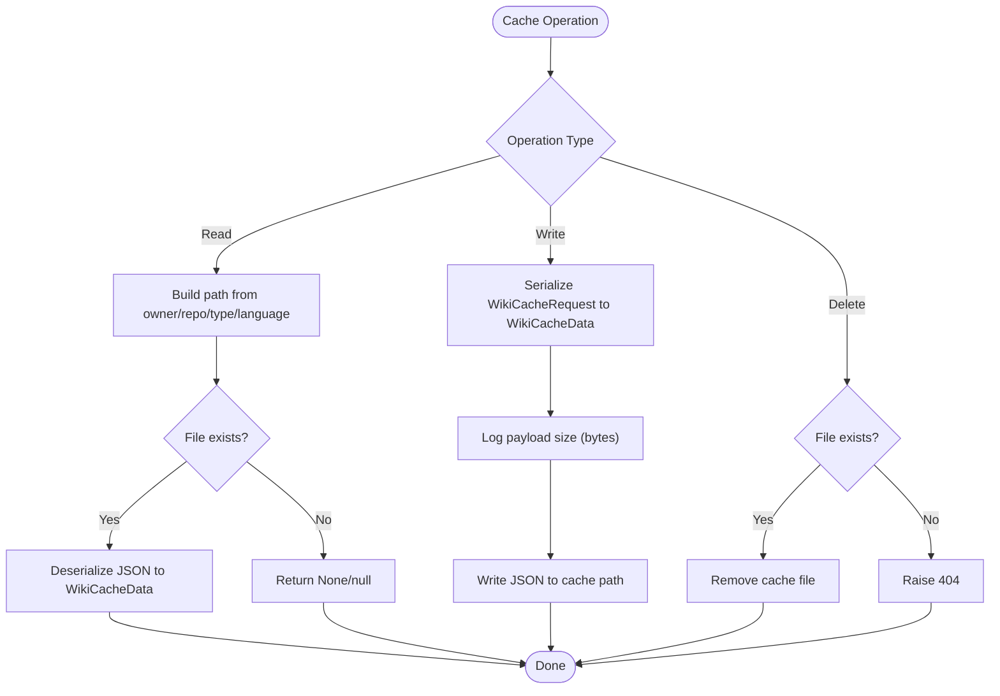
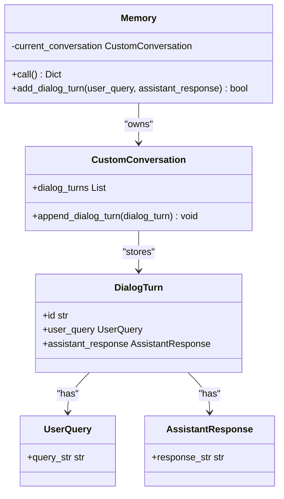
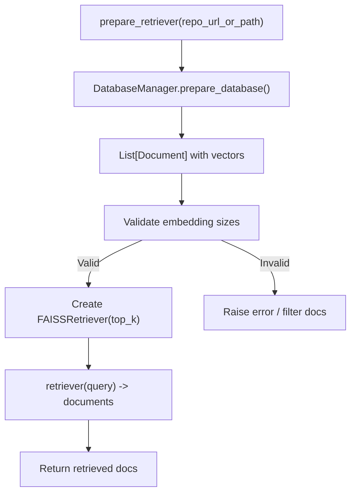
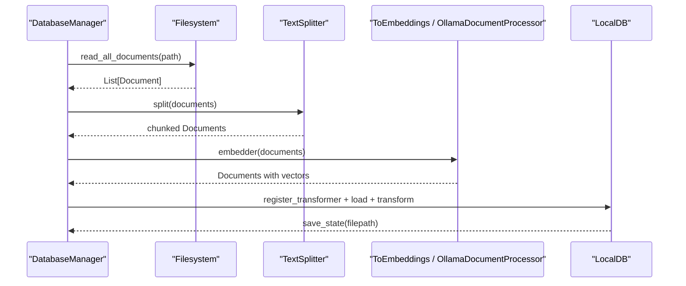
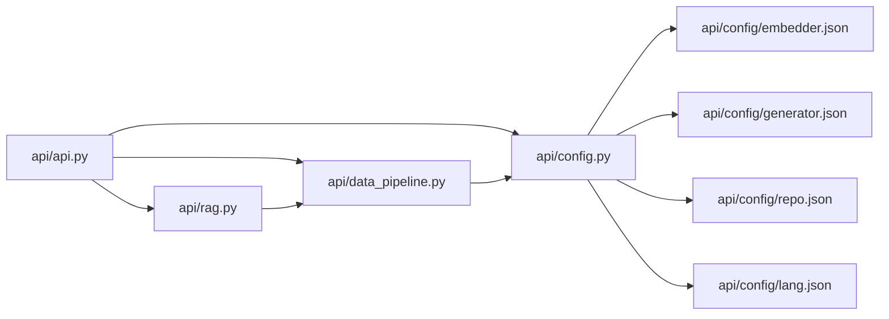

# Cache Performance Optimization

<cite>
**Referenced Files in This Document**
- [README.md](file://README.md)
- [api/api.py](file://api/api.py)
- [api/main.py](file://api/main.py)
- [api/rag.py](file://api/rag.py)
- [api/data_pipeline.py](file://api/data_pipeline.py)
- [api/config.py](file://api/config.py)
- [api/config/embedder.json](file://api/config/embedder.json)
- [api/config/generator.json](file://api/config/generator.json)
- [api/config/repo.json](file://api/config/repo.json)
- [api/config/lang.json](file://api/config/lang.json)
</cite>

## Table of Contents
1. [Introduction](#introduction)
2. [Project Structure](#project-structure)
3. [Core Components](#core-components)
4. [Architecture Overview](#architecture-overview)
5. [Detailed Component Analysis](#detailed-component-analysis)
6. [Dependency Analysis](#dependency-analysis)
7. [Performance Considerations](#performance-considerations)
8. [Troubleshooting Guide](#troubleshooting-guide)
9. [Conclusion](#conclusion)
10. [Appendices](#appendices)

## Introduction
This document provides a comprehensive guide to cache performance optimization in DeepWiki-Open. It focuses on:
- Cache hit rate optimization techniques
- Memory management strategies
- Disk I/O optimization
- Cache warming, preloading, and predictive caching
- Performance monitoring, bottleneck identification, and capacity planning
- Compression, lazy loading, and background processing optimizations
- Practical tuning configurations, benchmarking, and scalability considerations
- Concurrent access patterns, thread safety, and race condition prevention
- Cache invalidation, consistency guarantees, and eventual consistency patterns
- Load testing, profiling, and optimization workflows across deployment scenarios

DeepWiki-Open implements a server-side wiki cache persisted to the file system under a dedicated directory. The RAG subsystem manages embeddings and retrieval via a local database and retriever. Configuration-driven batching and token limits influence performance characteristics.

## Project Structure
High-level components relevant to caching and performance:
- API layer: exposes endpoints for cache read/write and processed project listing
- RAG layer: manages conversation memory, retriever, and embedding pipeline
- Data pipeline: repository ingestion, document splitting, embedding, and local DB persistence
- Configuration: embedder, retriever, text splitter, and repository filters

**Diagram sources**
- [api/api.py](file://api/api.py#L403-L539)
- [api/rag.py](file://api/rag.py#L51-L244)
- [api/data_pipeline.py](file://api/data_pipeline.py#L408-L476)
- [api/config/embedder.json](file://api/config/embedder.json#L1-L35)
- [api/config/generator.json](file://api/config/generator.json#L1-L101)
- [api/config/repo.json](file://api/config/repo.json#L1-L129)
- [api/config/lang.json](file://api/config/lang.json#L1-L16)

**Section sources**
- [README.md](file://README.md#L247-L267)
- [api/api.py](file://api/api.py#L403-L539)
- [api/rag.py](file://api/rag.py#L51-L244)
- [api/data_pipeline.py](file://api/data_pipeline.py#L408-L476)
- [api/config/embedder.json](file://api/config/embedder.json#L1-L35)
- [api/config/generator.json](file://api/config/generator.json#L1-L101)
- [api/config/repo.json](file://api/config/repo.json#L1-L129)
- [api/config/lang.json](file://api/config/lang.json#L1-L16)

## Core Components
- Wiki cache (file-system): persisted JSON files keyed by repository and language
- RAG memory: in-memory conversation history for context
- Retriever and embeddings: FAISS-backed retriever with configurable top-k
- Data pipeline: text splitting, embedding batching, and local DB persistence
- Configuration-driven performance knobs: batch sizes, chunk sizes, overlap, and token limits

Key implementation references:
- Wiki cache read/save/delete/list endpoints and helpers
- Memory management for conversation turns
- Retriever preparation and call
- Data pipeline construction and document transformation
- Configuration loading and model/embedder selection

**Section sources**
- [api/api.py](file://api/api.py#L403-L539)
- [api/rag.py](file://api/rag.py#L51-L244)
- [api/data_pipeline.py](file://api/data_pipeline.py#L408-L476)
- [api/config.py](file://api/config.py#L183-L275)

## Architecture Overview
The cache-centric flow integrates API endpoints, file-system cache, and RAG pipeline:

**Diagram sources**
- [api/api.py](file://api/api.py#L461-L502)
- [api/api.py](file://api/api.py#L413-L457)
- [api/rag.py](file://api/rag.py#L345-L446)
- [api/data_pipeline.py](file://api/data_pipeline.py#L737-L800)

## Detailed Component Analysis

### Wiki Cache (File-System)
- Purpose: Persist generated wiki structures and pages to accelerate subsequent requests
- Storage: JSON files under a dedicated directory derived from the Adalflow root path
- Key operations:
  - Read: locate and deserialize cache file
  - Write: serialize payload and write to disk
  - Delete: remove cache file after optional authorization check
  - List: enumerate cache files to surface processed projects

Optimization levers:
- File naming and partitioning by repo and language reduce lookup overhead
- Payload size logging aids capacity planning and identifies oversized caches
- Disk I/O is synchronous; consider asynchronous writes and batching for high-throughput scenarios

**Diagram sources**
- [api/api.py](file://api/api.py#L408-L457)
- [api/api.py](file://api/api.py#L461-L502)
- [api/api.py](file://api/api.py#L504-L539)

**Section sources**
- [api/api.py](file://api/api.py#L403-L539)

### Memory (Conversation History)
- Role: Maintains a list of dialog turns for context-aware responses
- Robustness: Includes recovery logic for missing attributes and corrupted states
- Thread-safety: Not explicitly guarded; ensure external synchronization if used concurrently

Optimization levers:
- Limit conversation length to cap memory footprint
- Periodically prune older turns to maintain responsiveness
- Consider serialization of memory snapshots to disk for resilience

**Diagram sources**
- [api/rag.py](file://api/rag.py#L51-L142)

**Section sources**
- [api/rag.py](file://api/rag.py#L51-L142)

### Retriever and Embeddings
- Retriever: FAISS-backed with configurable top-k
- Embeddings: Batched for OpenAI/Google; single-document for Ollama
- Token limits: Provider-specific thresholds to prevent oversized inputs
- Validation: Ensures consistent embedding sizes before building retriever

Optimization levers:
- Adjust top-k to balance recall and latency
- Tune chunk size and overlap for retrieval quality and throughput
- Use batch_size aligned with provider limits and hardware constraints
- Validate and filter embeddings to avoid costly failures downstream

**Diagram sources**
- [api/rag.py](file://api/rag.py#L345-L446)
- [api/data_pipeline.py](file://api/data_pipeline.py#L408-L476)

**Section sources**
- [api/rag.py](file://api/rag.py#L345-L446)
- [api/data_pipeline.py](file://api/data_pipeline.py#L25-L60)
- [api/data_pipeline.py](file://api/data_pipeline.py#L408-L476)

### Data Pipeline and LocalDB
- Pipeline: TextSplitter followed by ToEmbeddings or OllamaDocumentProcessor
- Persistence: LocalDB saves transformed documents to disk
- Filters: Exclusion/inclusion rules for directories and files
- Token accounting: Per-file token counts inform skip decisions

Optimization levers:
- Increase batch_size for providers that support it
- Tune chunk_size and chunk_overlap for retrieval effectiveness
- Apply inclusion mode for targeted processing to reduce I/O
- Monitor token counts to preempt large-file bottlenecks

**Diagram sources**
- [api/data_pipeline.py](file://api/data_pipeline.py#L177-L406)
- [api/data_pipeline.py](file://api/data_pipeline.py#L408-L476)

**Section sources**
- [api/data_pipeline.py](file://api/data_pipeline.py#L177-L406)
- [api/data_pipeline.py](file://api/data_pipeline.py#L408-L476)
- [api/config/embedder.json](file://api/config/embedder.json#L27-L34)

### Configuration-Driven Tuning
- Embedder configuration: batch_size, model kwargs, retriever top_k, text splitter settings
- Generator configuration: provider/model parameters affecting generation latency and throughput
- Repository filters: exclusion/inclusion lists and max size to bound processing scope
- Language configuration: supported languages and defaults for cache keys

Practical tuning tips:
- Align batch_size with provider limits and GPU/CPU capacity
- Reduce chunk_size and increase overlap for dense retrieval scenarios
- Use inclusion mode to focus on critical directories and files
- Monitor token counts and adjust thresholds to avoid oversized embeddings

**Section sources**
- [api/config/embedder.json](file://api/config/embedder.json#L1-L35)
- [api/config/generator.json](file://api/config/generator.json#L1-L101)
- [api/config/repo.json](file://api/config/repo.json#L1-L129)
- [api/config/lang.json](file://api/config/lang.json#L1-L16)
- [api/config.py](file://api/config.py#L183-L275)

## Dependency Analysis
Inter-module dependencies impacting cache performance:

**Diagram sources**
- [api/api.py](file://api/api.py#L1-L50)
- [api/rag.py](file://api/rag.py#L1-L50)
- [api/data_pipeline.py](file://api/data_pipeline.py#L1-L25)
- [api/config.py](file://api/config.py#L1-L50)

**Section sources**
- [api/api.py](file://api/api.py#L1-L50)
- [api/rag.py](file://api/rag.py#L1-L50)
- [api/data_pipeline.py](file://api/data_pipeline.py#L1-L25)
- [api/config.py](file://api/config.py#L1-L50)

## Performance Considerations

### Cache Hit Rate Optimization
- Normalize cache keys: ensure consistent owner/repo/type/language normalization
- Pre-warm caches: proactively generate and persist wiki structures for high-traffic repos
- Predictive caching: pre-fetch likely queries’ context and embed them
- Evict stale entries: implement TTL or LRU eviction policies at the API layer

### Memory Management Strategies
- Cap conversation history length in Memory
- Periodic pruning of dialog turns
- Serialize memory snapshots to disk for crash recovery

### Disk I/O Optimization
- Asynchronous writes: offload cache writes to background threads
- Batching: coalesce frequent small writes into larger batches
- Compression: optionally compress cache payloads to reduce disk usage and I/O time
- Partitioning: separate hot and cold caches onto different volumes

### Predictive Caching and Preloading
- Preload frequently accessed repositories by invoking retriever preparation
- Use historical query patterns to pre-generate embeddings for common topics
- Warm-up scripts to populate caches during low-traffic periods

### Monitoring and Capacity Planning
- Track cache hit ratio, average payload size, and I/O latency
- Observe retriever latency and top-k effectiveness
- Monitor memory usage of conversation history and embeddings
- Plan disk capacity based on payload sizes and retention policies

### Background Processing Optimizations
- Queue-based cache generation to decouple from request path
- Parallel embedding with bounded concurrency
- Lazy initialization of retrievers and databases

[No sources needed since this section provides general guidance]

## Troubleshooting Guide

Common cache-related issues and resolutions:
- Cache read failures: inspect file existence and permissions; validate JSON deserialization errors
- Cache write failures: check disk space, permissions, and serialization errors
- Cache deletion failures: verify authorization code and file existence
- Retrieval failures: confirm embedding sizes consistency and retriever initialization
- Memory corruption: rely on recovery logic; consider resetting memory state

Operational checks:
- Health endpoint for service readiness
- Processed projects listing to enumerate cached entries
- Logging at INFO/WARNING/ERROR levels for diagnostics

**Section sources**
- [api/api.py](file://api/api.py#L413-L457)
- [api/api.py](file://api/api.py#L504-L539)
- [api/rag.py](file://api/rag.py#L345-L446)
- [api/main.py](file://api/main.py#L94-L103)

## Conclusion
DeepWiki-Open’s cache performance hinges on efficient file-system cache operations, robust RAG memory and retriever management, and configuration-driven batching and chunking. By tuning batch sizes, chunk parameters, and retrieval top-k, combined with proactive warming, predictive caching, and background processing, deployments can achieve high cache hit rates, responsive retrieval, and scalable throughput. Monitoring and capacity planning ensure sustainable operations across diverse deployment scenarios.

[No sources needed since this section summarizes without analyzing specific files]

## Appendices

### Practical Tuning Configuration Examples
- Embedder batch sizing and retriever top-k
  - Reference: [api/config/embedder.json](file://api/config/embedder.json#L1-L35)
- Provider/model parameters affecting generation latency
  - Reference: [api/config/generator.json](file://api/config/generator.json#L1-L101)
- Repository filters and size limits
  - Reference: [api/config/repo.json](file://api/config/repo.json#L1-L129)
- Supported languages and defaults
  - Reference: [api/config/lang.json](file://api/config/lang.json#L1-L16)

### Benchmarking Methodologies
- Measure cache hit ratio over time with synthetic traffic
- Benchmark retriever latency across varying top-k and chunk sizes
- Profile embedding throughput with different batch sizes
- Evaluate memory footprint of conversation histories

### Scalability Considerations
- Horizontal scaling: distribute cache reads across nodes; use shared storage for cache persistence
- Vertical scaling: increase CPU/RAM for larger batch sizes and deeper chunking
- CDN/static cache: serve exported wiki artifacts via CDN for global distribution

### Deployment Scenarios
- Development: local file-system cache; lightweight retriever settings
- Production: persistent shared cache; optimized batch sizes and chunking; monitoring and alerting
- Edge: pre-warmed caches; reduced top-k for latency-sensitive applications

[No sources needed since this section provides general guidance]