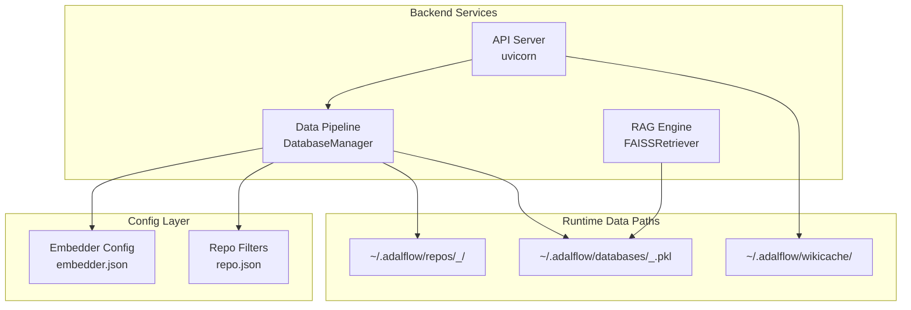
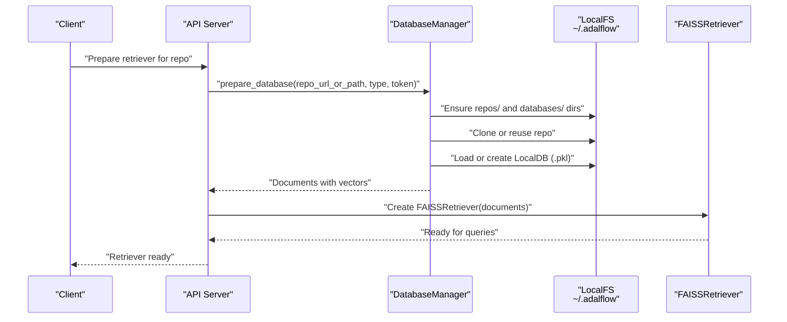
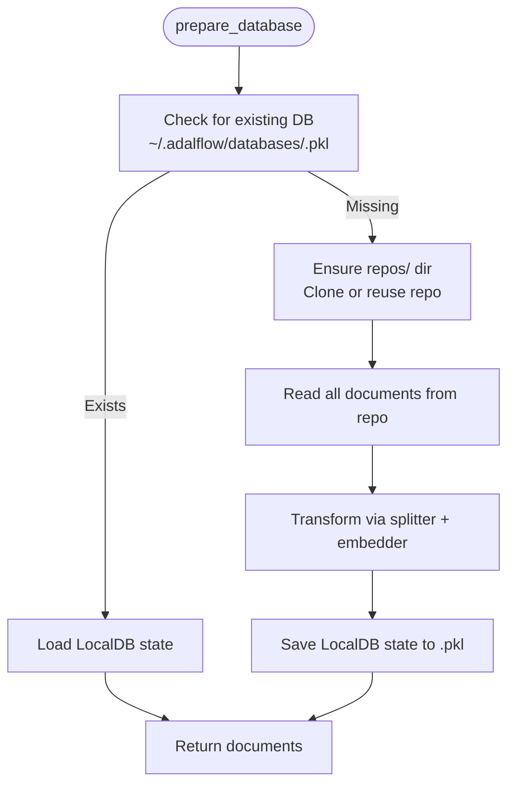
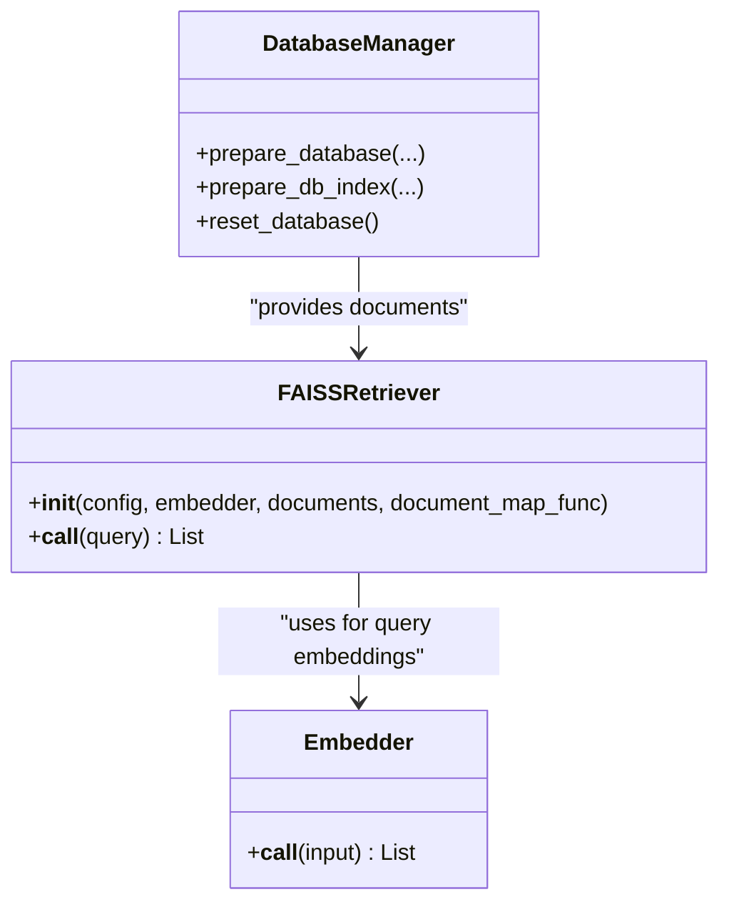
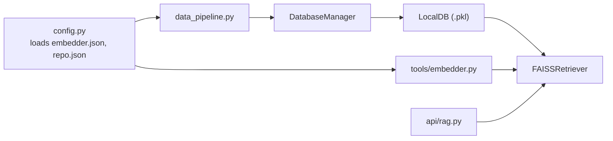

# Cache and Storage Management

<cite>
**Referenced Files in This Document**
- [README.md](file://README.md)
- [docker-compose.yml](file://docker-compose.yml)
- [api/main.py](file://api/main.py)
- [api/config.py](file://api/config.py)
- [api/data_pipeline.py](file://api/data_pipeline.py)
- [api/rag.py](file://api/rag.py)
- [api/repo_wiki_gen.py](file://api/repo_wiki_gen.py)
- [api/tools/embedder.py](file://api/tools/embedder.py)
- [api/config/embedder.json](file://api/config/embedder.json)
- [api/config/repo.json](file://api/config/repo.json)
</cite>

## Table of Contents
1. [Introduction](#introduction)
2. [Project Structure](#project-structure)
3. [Core Components](#core-components)
4. [Architecture Overview](#architecture-overview)
5. [Detailed Component Analysis](#detailed-component-analysis)
6. [Dependency Analysis](#dependency-analysis)
7. [Performance Considerations](#performance-considerations)
8. [Troubleshooting Guide](#troubleshooting-guide)
9. [Conclusion](#conclusion)
10. [Appendices](#appendices)

## Introduction
This document explains DeepWiki-Open’s cache and storage management system. It covers local file system persistence, cache lifecycle management, cache invalidation strategies, integration with FAISS vector databases, repository cloning, and wiki content storage. It also provides guidance on performance optimization, memory management, disk space considerations, configuration examples, monitoring, troubleshooting, persistence across deployments, cleanup procedures, authorization-protected cache deletion, scaling, distributed caching, and optimizing cache hit rates for large repositories.

## Project Structure
DeepWiki-Open separates concerns between:
- Backend API server and data pipeline (Python)
- Configuration-driven embedder and retriever settings
- Vector database and FAISS retriever integration
- Persistent storage under a shared user directory for repositories, databases, and caches

Key runtime paths:
- Repositories: ~/.adalflow/repos/{owner}_{repo}
- Databases: ~/.adalflow/databases/{owner}_{repo}.pkl
- Wiki cache: ~/.adalflow/wikicache/ (used by the frontend/UI)

**Diagram sources**
- [api/data_pipeline.py](file://api/data_pipeline.py#L800-L917)
- [api/rag.py](file://api/rag.py#L345-L415)
- [api/config/embedder.json](file://api/config/embedder.json#L1-L35)
- [api/config/repo.json](file://api/config/repo.json#L1-L129)
- [docker-compose.yml](file://docker-compose.yml#L32-L35)

**Section sources**
- [README.md](file://README.md#L539-L581)
- [docker-compose.yml](file://docker-compose.yml#L32-L35)
- [api/data_pipeline.py](file://api/data_pipeline.py#L800-L917)

## Core Components
- DatabaseManager: Orchestrates repository preparation, document ingestion, transformation, and persistent storage of LocalDB (FAISS-backed).
- FAISSRetriever: Loads persisted LocalDB and performs vector similarity search.
- Embedder configuration: Selects embedder type and batching behavior from JSON configs.
- RAG engine: Coordinates memory, generator, and retriever for query processing.
- WikiGenerator: Generates wiki structure and content; uses a cache key for UI cache identification.

**Section sources**
- [api/data_pipeline.py](file://api/data_pipeline.py#L737-L917)
- [api/rag.py](file://api/rag.py#L153-L446)
- [api/tools/embedder.py](file://api/tools/embedder.py#L6-L59)
- [api/config/embedder.json](file://api/config/embedder.json#L1-L35)
- [api/repo_wiki_gen.py](file://api/repo_wiki_gen.py#L98-L123)

## Architecture Overview
The cache and storage architecture centers on:
- Local file system persistence for repositories and FAISS databases
- Config-driven embedder selection and batch sizing
- FAISSRetriever leveraging persisted LocalDB for fast similarity search
- Optional UI cache key for wiki content caching

**Diagram sources**
- [api/data_pipeline.py](file://api/data_pipeline.py#L737-L917)
- [api/rag.py](file://api/rag.py#L345-L415)

## Detailed Component Analysis

### DatabaseManager: Cache Lifecycle and Persistence
Responsibilities:
- Create repository storage paths under ~/.adalflow
- Clone repositories (with token support) or reuse existing local paths
- Transform documents and persist LocalDB state to ~/.adalflow/databases
- Load existing databases when available
- Provide documents for FAISSRetriever

Key behaviors:
- Paths are derived from the repository URL or local path
- Existing databases are loaded if present; otherwise transformed and saved
- Documents are transformed via a configurable pipeline (splitter + embedder)

**Diagram sources**
- [api/data_pipeline.py](file://api/data_pipeline.py#L737-L917)

**Section sources**
- [api/data_pipeline.py](file://api/data_pipeline.py#L737-L917)

### FAISSRetriever and Vector Indexing
- FAISSRetriever is constructed with documents and an embedder
- Embedding validation ensures consistent vector sizes
- Retrieval uses top-k similarity search

**Diagram sources**
- [api/rag.py](file://api/rag.py#L384-L415)
- [api/data_pipeline.py](file://api/data_pipeline.py#L737-L917)
- [api/tools/embedder.py](file://api/tools/embedder.py#L6-L59)

**Section sources**
- [api/rag.py](file://api/rag.py#L246-L415)

### Embedder Configuration and Batch Behavior
- Embedder selection is driven by environment and JSON configs
- Batch sizes differ by provider (e.g., OpenAI/Google vs Ollama)
- Embedder is injected into the data pipeline and FAISSRetriever

**Section sources**
- [api/config.py](file://api/config.py#L183-L275)
- [api/config/embedder.json](file://api/config/embedder.json#L1-L35)
- [api/tools/embedder.py](file://api/tools/embedder.py#L6-L59)

### Wiki Content Cache Key
- WikiGenerator constructs a cache key for UI/localStorage-based wiki content caching
- This enables cache invalidation and regeneration when parameters change

**Section sources**
- [api/repo_wiki_gen.py](file://api/repo_wiki_gen.py#L98-L123)

## Dependency Analysis
High-level dependencies:
- API server depends on DatabaseManager for repository and FAISS index lifecycle
- DatabaseManager depends on LocalDB and adalflow components
- FAISSRetriever depends on persisted LocalDB and embedder
- Embedder configuration is centralized in config JSON files

**Diagram sources**
- [api/config.py](file://api/config.py#L104-L182)
- [api/tools/embedder.py](file://api/tools/embedder.py#L6-L59)
- [api/data_pipeline.py](file://api/data_pipeline.py#L737-L917)
- [api/rag.py](file://api/rag.py#L384-L415)

**Section sources**
- [api/config.py](file://api/config.py#L104-L182)
- [api/data_pipeline.py](file://api/data_pipeline.py#L737-L917)
- [api/rag.py](file://api/rag.py#L384-L415)

## Performance Considerations
- Embedding token limits and splitting:
  - Token limits vary by provider; oversized files are skipped to avoid exceeding limits
  - Chunk size and overlap are configurable to balance recall and performance
- Batch processing:
  - Embedder batch sizes differ by provider; larger batches reduce API calls but increase memory usage
- FAISS index size and retrieval cost:
  - Larger top-k increases recall but also increases latency; tune based on workload
- Disk and memory:
  - LocalDB persistence avoids recomputation; ensure adequate disk space for databases
  - Limit concurrent retrievers and consider eviction policies for long-running deployments

[No sources needed since this section provides general guidance]

## Troubleshooting Guide
Common issues and resolutions:
- Missing or invalid API keys:
  - Ensure required keys are set; the server logs warnings for missing keys
- Repository cloning failures:
  - Verify token formatting and scopes; sanitized error messages avoid leaking tokens
- FAISS embedding size mismatches:
  - The system validates and filters inconsistent embeddings; check logs for mismatched sizes
- Large repository processing:
  - Use file filters and size limits; adjust chunk size and batch sizes
- Cache not updating:
  - Delete the persisted LocalDB file to force regeneration; or invalidate UI cache key

**Section sources**
- [api/main.py](file://api/main.py#L60-L86)
- [api/data_pipeline.py](file://api/data_pipeline.py#L103-L173)
- [api/rag.py](file://api/rag.py#L251-L415)
- [api/config/repo.json](file://api/config/repo.json#L125-L128)

## Conclusion
DeepWiki-Open’s cache and storage system leverages local file system persistence for repositories and FAISS-backed databases, with configuration-driven embedder selection and batch behavior. The system supports efficient retrieval via FAISSRetriever, robust lifecycle management through DatabaseManager, and UI cache keying for wiki content. Proper configuration, monitoring, and cleanup practices ensure reliable operation across deployments and large repositories.

[No sources needed since this section summarizes without analyzing specific files]

## Appendices

### Practical Cache Configuration Examples
- Set embedder type and batch sizes via embedder.json
- Adjust text splitting parameters for chunk size and overlap
- Configure file filters to exclude large or irrelevant directories/files

**Section sources**
- [api/config/embedder.json](file://api/config/embedder.json#L27-L34)
- [api/config/repo.json](file://api/config/repo.json#L2-L124)

### Monitoring Cache Usage
- Monitor logs for repository cloning, database loading, and transformation stages
- Track disk usage under ~/.adalflow for repos and databases
- Observe FAISS index creation and retrieval metrics

**Section sources**
- [api/data_pipeline.py](file://api/data_pipeline.py#L874-L902)
- [docker-compose.yml](file://docker-compose.yml#L32-L35)

### Cache Persistence Across Deployments
- Mount ~/.adalflow to persist repositories, databases, and caches across container restarts
- Bind logs directory for persistent logs

**Section sources**
- [README.md](file://README.md#L539-L581)
- [docker-compose.yml](file://docker-compose.yml#L32-L35)

### Cache Cleanup Procedures
- Remove the LocalDB pickle file (~/.adalflow/databases/<owner>_<repo>.pkl) to rebuild the index
- Clear repository clone directory if stale or corrupted
- Invalidate UI cache by changing the cache key parameters in WikiGenerator

**Section sources**
- [api/data_pipeline.py](file://api/data_pipeline.py#L874-L902)
- [api/repo_wiki_gen.py](file://api/repo_wiki_gen.py#L98-L123)

### Authorization-Protected Cache Deletion
- Authorization mode restricts frontend initiation and protects cache deletion; backend endpoints may still be invoked directly
- Enforce authorization checks at the API layer for sensitive cache operations

**Section sources**
- [README.md](file://README.md#L503-L514)

### Scaling Cache Storage
- Increase batch sizes for providers that support batching
- Tune chunk size and overlap to balance recall and latency
- Use file filters to reduce total processed content
- Consider pruning old or unused repositories and databases

**Section sources**
- [api/config/embedder.json](file://api/config/embedder.json#L4-L8)
- [api/config/repo.json](file://api/config/repo.json#L125-L128)

### Distributed Caching and FAISS Indexing
- For distributed retrieval, export and distribute the FAISS index and LocalDB state across nodes
- Ensure consistent embedder configuration across nodes
- Implement index synchronization and versioning to avoid inconsistencies

[No sources needed since this section provides general guidance]

### Optimizing Cache Hit Rates for Large Repositories
- Use targeted inclusion/exclusion filters to focus on relevant files
- Adjust chunk size and overlap to capture more context
- Periodically reindex after major repository changes
- Monitor and prune stale indices to maintain relevance

**Section sources**
- [api/data_pipeline.py](file://api/data_pipeline.py#L209-L327)
- [api/config/embedder.json](file://api/config/embedder.json#L30-L34)