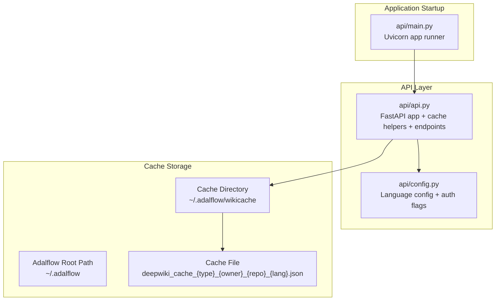
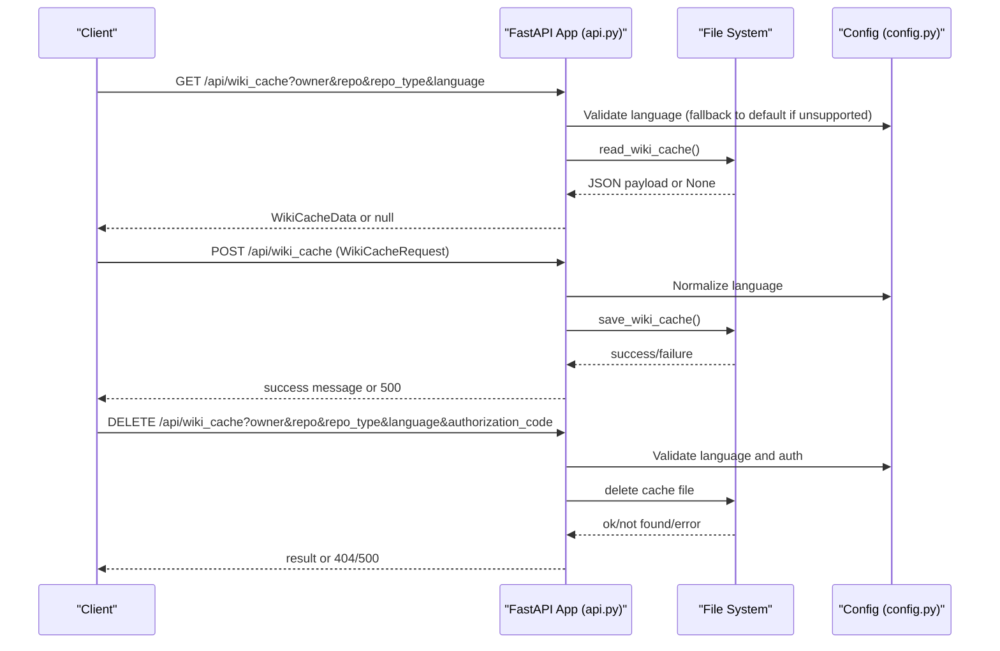
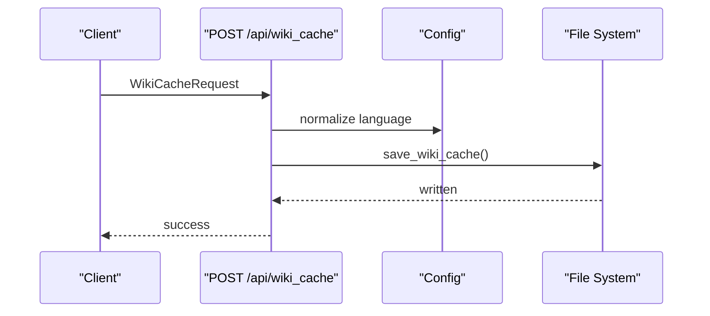
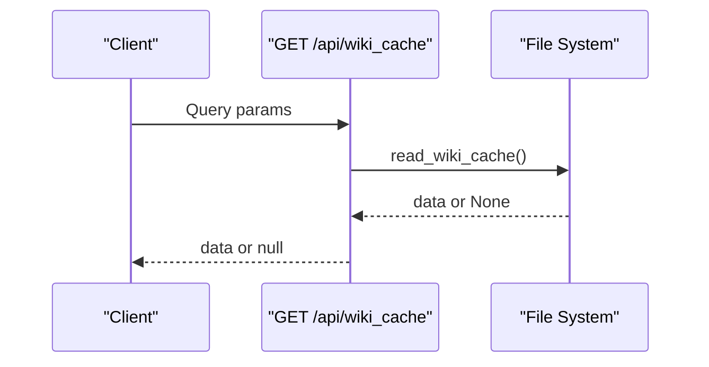
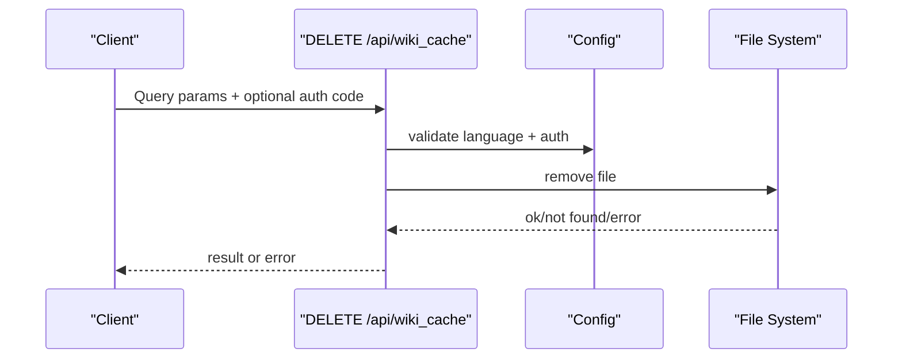
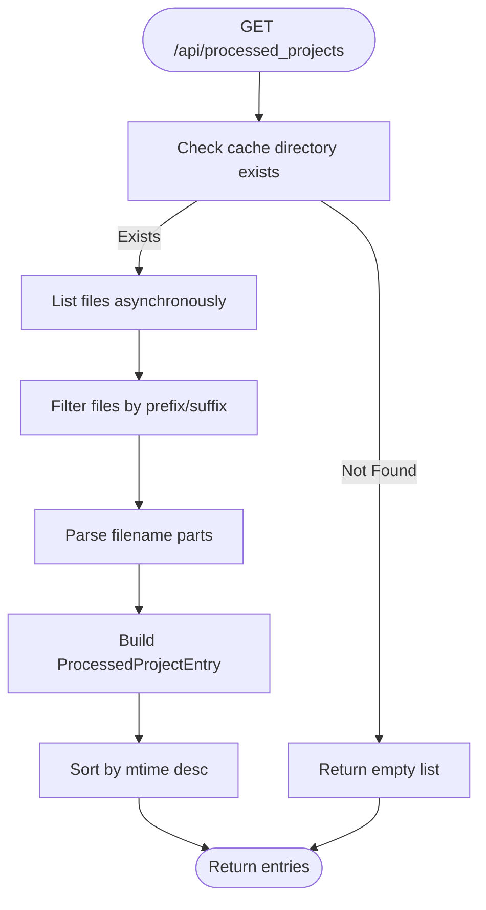
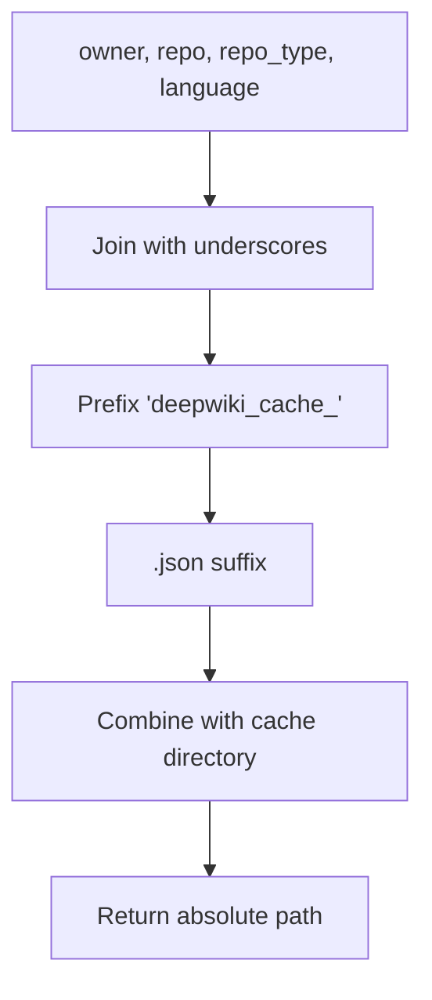
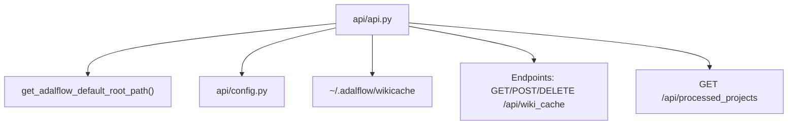

# File System Caching

<cite>
**Referenced Files in This Document**
- [api.py](file://api/api.py)
- [config.py](file://api/config.py)
- [main.py](file://api/main.py)
- [data_pipeline.py](file://api/data_pipeline.py)
- [repo_wiki_gen.py](file://api/repo_wiki_gen.py)
</cite>

## Table of Contents
1. [Introduction](#introduction)
2. [Project Structure](#project-structure)
3. [Core Components](#core-components)
4. [Architecture Overview](#architecture-overview)
5. [Detailed Component Analysis](#detailed-component-analysis)
6. [Dependency Analysis](#dependency-analysis)
7. [Performance Considerations](#performance-considerations)
8. [Troubleshooting Guide](#troubleshooting-guide)
9. [Conclusion](#conclusion)
10. [Appendices](#appendices)

## Introduction
This document explains the file system caching implementation used by DeepWiki-Open to persist and reuse generated wiki structures and pages. It covers the cache directory structure, file naming conventions, persistence mechanisms, and the lifecycle of cache operations (creation, reading, updating, deletion). It also documents the cache path generation logic via the get_wiki_cache_path() function, the cache file format and JSON serialization, validation and error handling strategies, and practical guidance for maintenance and troubleshooting.

## Project Structure
The caching system is implemented within the API module and integrates with configuration and application startup logic:
- Cache directory location is derived from the adalflow default root path and placed under a dedicated subdirectory.
- Cache files are named using a deterministic convention that encodes owner, repository, repository type, and language.
- The API exposes endpoints to read, write, and delete cached wiki data, and to list processed projects.

**Diagram sources**
- [main.py](file://api/main.py#L87-L104)
- [api.py](file://api/api.py#L36-L37)
- [api.py](file://api/api.py#L405-L411)

**Section sources**
- [api.py](file://api/api.py#L405-L411)
- [main.py](file://api/main.py#L87-L104)

## Core Components
- Cache directory and path generation:
  - The cache directory is created under the adalflow default root path with a fixed subdirectory name.
  - The get_wiki_cache_path() function constructs a unique filename from repo_type, owner, repo, and language.
- Cache data models:
  - WikiCacheData defines the serialized structure persisted to disk.
  - WikiCacheRequest defines the incoming payload for saving cache.
- Cache operations:
  - read_wiki_cache(): loads and deserializes cache data.
  - save_wiki_cache(): serializes and writes cache data.
  - API endpoints: GET /api/wiki_cache, POST /api/wiki_cache, DELETE /api/wiki_cache.
  - Listing processed projects via GET /api/processed_projects.

Key behaviors:
- Language normalization: unsupported languages are coerced to the configured default.
- Authentication guard: deletion requires optional authorization depending on configuration.
- Asynchronous scanning of cache directory for listing projects.

**Section sources**
- [api.py](file://api/api.py#L90-L111)
- [api.py](file://api/api.py#L408-L411)
- [api.py](file://api/api.py#L413-L424)
- [api.py](file://api/api.py#L426-L457)
- [api.py](file://api/api.py#L461-L503)
- [api.py](file://api/api.py#L504-L539)
- [api.py](file://api/api.py#L577-L634)
- [config.py](file://api/config.py#L281-L307)

## Architecture Overview
The cache lifecycle is orchestrated by the API layer. The application starts, initializes logging and configuration, and exposes endpoints that interact with the file system cache.

**Diagram sources**
- [api.py](file://api/api.py#L461-L503)
- [api.py](file://api/api.py#L504-L539)
- [config.py](file://api/config.py#L281-L307)

## Detailed Component Analysis

### Cache Directory and Path Generation
- Directory: ~/.adalflow/wikicache
- Naming convention: deepwiki_cache_{repo_type}_{owner}_{repo}_{language}.json
- The function get_wiki_cache_path() composes the filename and returns the absolute path within the cache directory.

Practical examples of cache file locations:
- ~/.adalflow/wikicache/deepwiki_cache_github_AlphaOmega_myproject_en.json
- ~/.adalflow/wikicache/deepwiki_cache_gitlab_myteam_my-repo_ja.json

Validation and parsing:
- The listing endpoint scans the cache directory and parses filenames to reconstruct owner, repo, repo_type, and language, sorting by modification time.

**Section sources**
- [api.py](file://api/api.py#L405-L411)
- [api.py](file://api/api.py#L583-L630)

### Cache File Format and Serialization
- Data model: WikiCacheData encapsulates wiki_structure, generated_pages, and optional metadata (repo, provider, model).
- Serialization: save_wiki_cache() converts the payload to a dictionary and writes JSON with indentation.
- Deserialization: read_wiki_cache() loads JSON and reconstructs the typed model.

Notes:
- The model supports optional fields for backward compatibility.
- Payload size is logged for debugging without exposing content.

**Section sources**
- [api.py](file://api/api.py#L90-L111)
- [api.py](file://api/api.py#L426-L457)
- [api.py](file://api/api.py#L413-L424)

### Cache Lifecycle Operations

#### Creation (Saving)
- Endpoint: POST /api/wiki_cache
- Behavior:
  - Normalizes language using supported_languages and default from config.
  - Constructs WikiCacheData and serializes to JSON.
  - Writes to the computed cache path.
  - Returns success or raises HTTP 500 on failure.

**Diagram sources**
- [api.py](file://api/api.py#L486-L503)
- [api.py](file://api/api.py#L426-L457)
- [config.py](file://api/config.py#L281-L307)

**Section sources**
- [api.py](file://api/api.py#L486-L503)
- [api.py](file://api/api.py#L426-L457)

#### Reading
- Endpoint: GET /api/wiki_cache
- Behavior:
  - Validates and normalizes language.
  - Attempts to read and deserialize the cache file.
  - Returns null if not found; the frontend expects a 200 with null body.

**Diagram sources**
- [api.py](file://api/api.py#L461-L484)
- [api.py](file://api/api.py#L413-L424)

**Section sources**
- [api.py](file://api/api.py#L461-L484)
- [api.py](file://api/api.py#L413-L424)

#### Deletion
- Endpoint: DELETE /api/wiki_cache
- Behavior:
  - Validates language and optional authorization code based on configuration flags.
  - Computes cache path and removes the file if it exists.
  - Returns success or raises HTTP 404/500 as appropriate.

**Diagram sources**
- [api.py](file://api/api.py#L504-L539)
- [config.py](file://api/config.py#L49-L52)

**Section sources**
- [api.py](file://api/api.py#L504-L539)
- [config.py](file://api/config.py#L49-L52)

#### Listing Processed Projects
- Endpoint: GET /api/processed_projects
- Behavior:
  - Scans the cache directory asynchronously.
  - Filters files matching the naming convention and parses owner, repo, repo_type, language, and mtime.
  - Returns a sorted list by recency.

**Diagram sources**
- [api.py](file://api/api.py#L577-L634)

**Section sources**
- [api.py](file://api/api.py#L577-L634)

### Cache Path Generation Logic
The get_wiki_cache_path() function combines four parameters to form a unique cache identifier:
- repo_type: repository type (e.g., github, gitlab)
- owner: repository owner
- repo: repository name
- language: language code

It produces a filename with the pattern deepwiki_cache_{repo_type}_{owner}_{repo}_{language}.json and returns the absolute path inside the cache directory.

**Diagram sources**
- [api.py](file://api/api.py#L408-L411)

**Section sources**
- [api.py](file://api/api.py#L408-L411)

### Cache Data Model and JSON Serialization
The cache payload is defined by WikiCacheData, which includes:
- wiki_structure: the generated wiki structure
- generated_pages: a dictionary of page identifiers to page data
- Optional fields: repo, provider, model

Serialization:
- save_wiki_cache() builds a WikiCacheData instance and writes JSON with indentation.
- read_wiki_cache() reads JSON and reconstructs the typed model.

Backward compatibility:
- Optional fields are tolerated during deserialization.

**Section sources**
- [api.py](file://api/api.py#L90-L111)
- [api.py](file://api/api.py#L426-L457)
- [api.py](file://api/api.py#L413-L424)

### Cache Validation and Error Handling
- Language validation:
  - Unsupported languages are replaced with the configured default.
- File system errors:
  - read_wiki_cache() catches exceptions and logs errors, returning None on failure.
  - save_wiki_cache() handles IO and general exceptions, logging details and returning False.
  - delete_wiki_cache() validates existence and handles removal errors, raising HTTP exceptions.
- Listing robustness:
  - The listing endpoint continues despite individual file parsing errors and sorts by mtime.

**Section sources**
- [api.py](file://api/api.py#L471-L474)
- [api.py](file://api/api.py#L491-L495)
- [api.py](file://api/api.py#L515-L518)
- [api.py](file://api/api.py#L421-L423)
- [api.py](file://api/api.py#L452-L457)
- [api.py](file://api/api.py#L533-L538)
- [api.py](file://api/api.py#L623-L625)

## Dependency Analysis
- api.py depends on:
  - adalflow default root path for cache directory location.
  - config.py for language configuration and authentication flags.
- The cache directory is created at import time.
- The listing endpoint relies on asynchronous directory operations to avoid blocking.

**Diagram sources**
- [api.py](file://api/api.py#L36-L37)
- [api.py](file://api/api.py#L405-L411)
- [api.py](file://api/api.py#L461-L539)
- [api.py](file://api/api.py#L577-L634)
- [config.py](file://api/config.py#L281-L307)

**Section sources**
- [api.py](file://api/api.py#L36-L37)
- [api.py](file://api/api.py#L405-L411)
- [api.py](file://api/api.py#L461-L539)
- [api.py](file://api/api.py#L577-L634)
- [config.py](file://api/config.py#L281-L307)

## Performance Considerations
- Disk I/O:
  - Cache operations are synchronous file I/O. For high concurrency, consider batching or rate limiting.
- File size:
  - Large wiki structures and many pages increase JSON size. Monitor payload sizes and consider compression if needed.
- Directory scanning:
  - Listing processed projects uses async directory operations to minimize blocking.
- Tokenization and embeddings:
  - While not part of the cache itself, the surrounding data pipeline demonstrates awareness of token limits and large file handling, which can inform cache size planning.

[No sources needed since this section provides general guidance]

## Troubleshooting Guide
Common issues and resolutions:
- Cache file not found:
  - Verify the computed path matches the naming convention and that the cache directory exists.
  - Use GET /api/processed_projects to enumerate existing cache files.
- Language mismatch:
  - Ensure the language parameter is supported; unsupported languages are normalized to the default.
- Permission errors:
  - Confirm the process has read/write permissions to the cache directory.
- Corrupted cache:
  - Delete the problematic cache file via DELETE /api/wiki_cache and regenerate via POST /api/wiki_cache.
- Authentication requirement:
  - If authorization is enabled, include the required code when deleting caches.

**Section sources**
- [api.py](file://api/api.py#L577-L634)
- [api.py](file://api/api.py#L471-L474)
- [api.py](file://api/api.py#L491-L495)
- [api.py](file://api/api.py#L515-L518)
- [api.py](file://api/api.py#L504-L539)

## Conclusion
DeepWiki-Open’s file system cache provides a straightforward, deterministic mechanism for persisting generated wiki data. The cache directory and naming scheme ensure uniqueness across owners, repositories, types, and languages. Robust validation, error handling, and listing capabilities support reliable operation. Following the guidelines in this document will help maintain healthy cache usage, manage disk space, and troubleshoot issues effectively.

[No sources needed since this section summarizes without analyzing specific files]

## Appendices

### Practical Examples
- Cache file locations:
  - ~/.adalflow/wikicache/deepwiki_cache_github_AlphaOmega_myproject_en.json
  - ~/.adalflow/wikicache/deepwiki_cache_gitlab_myteam_my-repo_ja.json
- Listing projects:
  - GET /api/processed_projects returns entries sorted by most recent modification time.

**Section sources**
- [api.py](file://api/api.py#L583-L630)
- [api.py](file://api/api.py#L577-L634)

### Cache Maintenance Guidelines
- Periodically review cache directory size and prune stale or unused cache files.
- Use DELETE /api/wiki_cache to remove specific entries when needed.
- Monitor payload sizes and consider splitting large caches if necessary.

[No sources needed since this section provides general guidance]