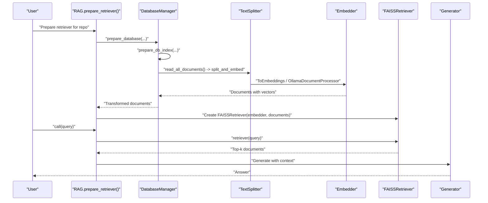
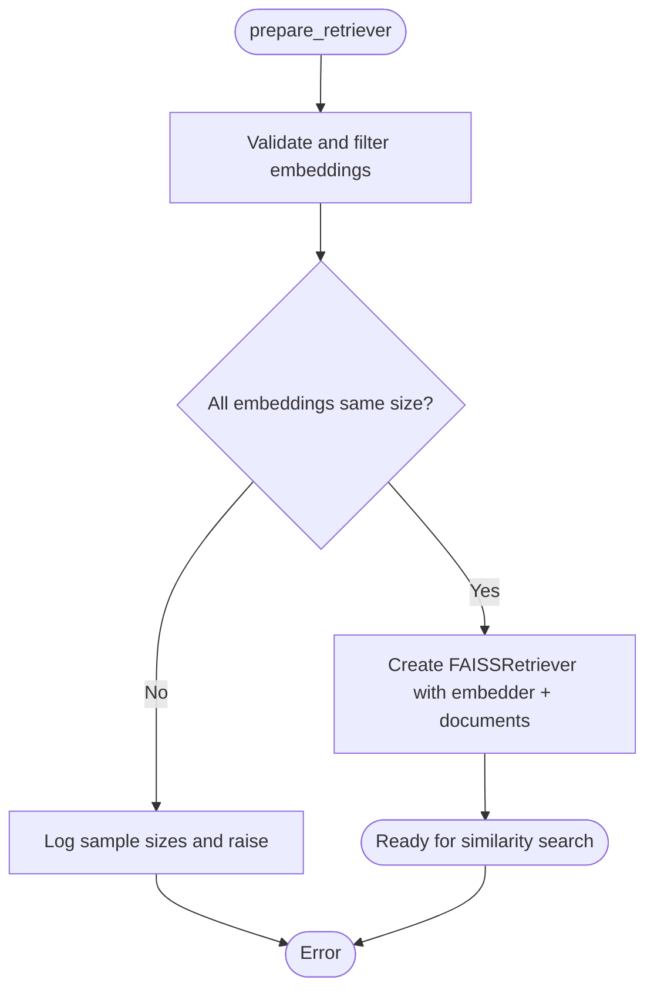
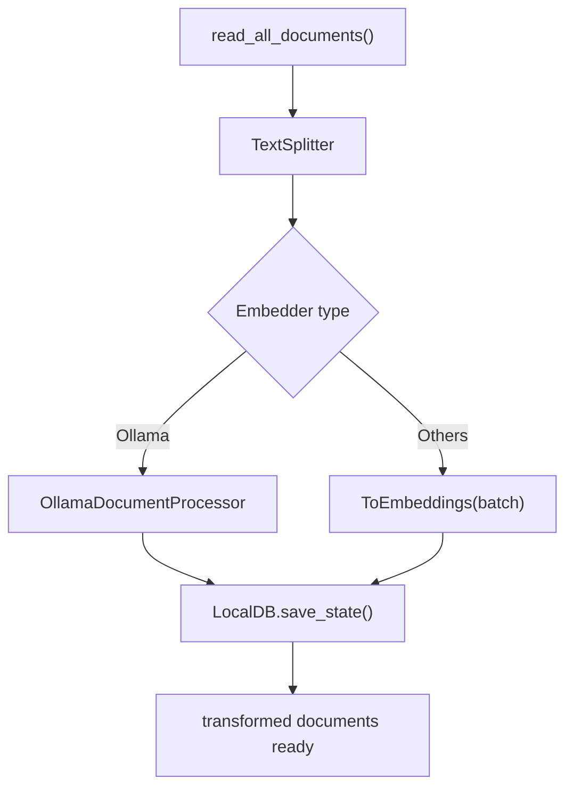
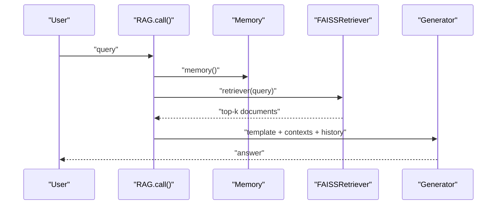
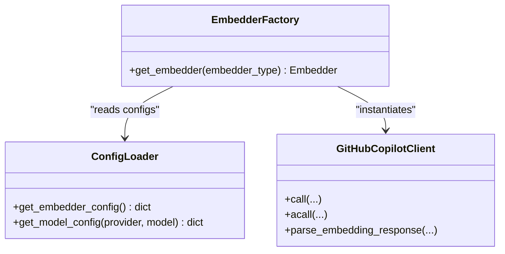
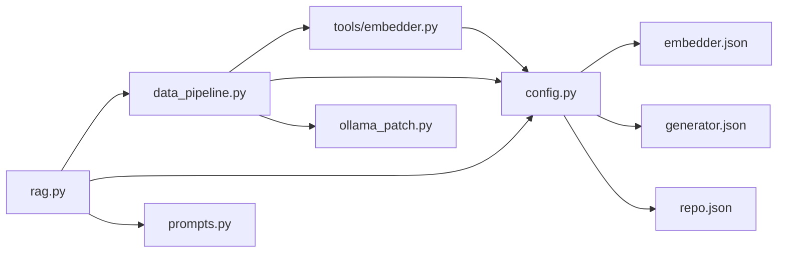

# Vector Database Integration

<cite>
**Referenced Files in This Document**
- [data_pipeline.py](file://api/data_pipeline.py)
- [rag.py](file://api/rag.py)
- [embedder.py](file://api/tools/embedder.py)
- [config.py](file://api/config.py)
- [embedder.json](file://api/config/embedder.json)
- [generator.json](file://api/config/generator.json)
- [repo.json](file://api/config/repo.json)
- [prompts.py](file://api/prompts.py)
- [ollama_patch.py](file://api/ollama_patch.py)
- [github_copilot_client.py](file://api/github_copilot_client.py)
- [test_faiss_fix.py](file://tests/unit/test_faiss_fix.py)
</cite>

## Table of Contents
1. [Introduction](#introduction)
2. [Project Structure](#project-structure)
3. [Core Components](#core-components)
4. [Architecture Overview](#architecture-overview)
5. [Detailed Component Analysis](#detailed-component-analysis)
6. [Dependency Analysis](#dependency-analysis)
7. [Performance Considerations](#performance-considerations)
8. [Troubleshooting Guide](#troubleshooting-guide)
9. [Conclusion](#conclusion)
10. [Appendices](#appendices)

## Introduction
This document explains the vector database integration with FAISS in DeepWiki-Open. It covers how the system sets up FAISS-backed similarity search, stores embeddings, and integrates them into a Retrieval-Augmented Generation (RAG) workflow. It also documents the data pipeline from document ingestion and preprocessing to embedding generation and vector indexing, along with configuration options, performance optimization, memory management, maintenance procedures, and troubleshooting strategies.

## Project Structure
The vector database integration spans several modules:
- Data ingestion and preprocessing: reading repository files, splitting text, and generating embeddings
- Vector storage and retrieval: persisting transformed documents and using FAISS for similarity search
- RAG orchestration: preparing retrievers, performing similarity search, and composing contextual answers
- Configuration: embedding clients, FAISS retriever parameters, and text splitting settings
- Provider integrations: GitHub Copilot, Ollama, and others

```mermaid
graph TB
subgraph "Data Pipeline"
DP["api/data_pipeline.py"]
CFG["api/config.py"]
EMB["api/tools/embedder.py"]
OC["api/ollama_patch.py"]
end
subgraph "RAG"
RAG["api/rag.py"]
PROMPTS["api/prompts.py"]
end
subgraph "Configs"
EJ["api/config/embedder.json"]
GJ["api/config/generator.json"]
RJ["api/config/repo.json"]
end
subgraph "Providers"
GC["api/github_copilot_client.py"]
end
DP --> EMB
DP --> CFG
DP --> OC
RAG --> DP
RAG --> CFG
RAG --> PROMPTS
EMB --> CFG
CFG --> EJ
CFG --> GJ
CFG --> RJ
EMB --> GC
```

**Diagram sources**
- [data_pipeline.py](file://api/data_pipeline.py#L1-L917)
- [rag.py](file://api/rag.py#L1-L446)
- [embedder.py](file://api/tools/embedder.py#L1-L59)
- [config.py](file://api/config.py#L1-L464)
- [embedder.json](file://api/config/embedder.json#L1-L35)
- [generator.json](file://api/config/generator.json#L1-L101)
- [repo.json](file://api/config/repo.json#L1-L129)
- [prompts.py](file://api/prompts.py#L1-L192)
- [ollama_patch.py](file://api/ollama_patch.py#L1-L105)
- [github_copilot_client.py](file://api/github_copilot_client.py#L1-L898)

**Section sources**
- [data_pipeline.py](file://api/data_pipeline.py#L1-L917)
- [rag.py](file://api/rag.py#L1-L446)
- [embedder.py](file://api/tools/embedder.py#L1-L59)
- [config.py](file://api/config.py#L1-L464)
- [embedder.json](file://api/config/embedder.json#L1-L35)
- [generator.json](file://api/config/generator.json#L1-L101)
- [repo.json](file://api/config/repo.json#L1-L129)
- [prompts.py](file://api/prompts.py#L1-L192)
- [ollama_patch.py](file://api/ollama_patch.py#L1-L105)
- [github_copilot_client.py](file://api/github_copilot_client.py#L1-L898)

## Core Components
- DataPipeline: Reads repository files, splits text, generates embeddings, and persists transformed documents to disk for reuse.
- FAISSRetriever: Wraps FAISS for similarity search over stored vectors.
- RAG: Orchestrates retrieval, context assembly, and generation using a templated prompt.
- Embedder factory: Selects and configures the embedding client based on environment and configuration.
- Ollama patch: Provides a document-by-document embedding processor for Ollama due to lack of native batch support.
- Config loader: Loads and merges configuration files for embedders, retrievers, and text splitters.

Key responsibilities:
- Embedding generation: Uses configured embedder client to produce vectors for document chunks.
- Vector indexing: Stores vectors alongside documents and exposes them to FAISSRetriever.
- Retrieval: Performs similarity search and returns ranked documents for RAG.
- RAG composition: Injects retrieved context and conversation history into a generator prompt.

**Section sources**
- [data_pipeline.py](file://api/data_pipeline.py#L177-L476)
- [rag.py](file://api/rag.py#L153-L446)
- [embedder.py](file://api/tools/embedder.py#L6-L59)
- [ollama_patch.py](file://api/ollama_patch.py#L62-L105)
- [config.py](file://api/config.py#L170-L275)

## Architecture Overview
The vector database integration follows a pipeline-driven architecture:
- Documents are read from a repository (local path or remote URL) and split into chunks.
- Embeddings are generated using the selected embedder client.
- Documents with vectors are persisted to a local database file for fast reload.
- A FAISSRetriever is constructed from the persisted documents and used to answer queries.
- The RAG component composes a context-aware prompt using retrieved documents and conversation history, then invokes a generator.



**Diagram sources**
- [rag.py](file://api/rag.py#L345-L435)
- [data_pipeline.py](file://api/data_pipeline.py#L851-L902)
- [embedder.py](file://api/tools/embedder.py#L6-L59)
- [ollama_patch.py](file://api/ollama_patch.py#L62-L105)

## Detailed Component Analysis

### FAISSRetriever Setup and Usage
- The retriever is created with embedder, documents, and a mapping function that extracts vectors from documents.
- Embedding size validation ensures consistent dimensions before building the index.
- On failure, the code logs sample embedding sizes to aid diagnosis.



**Diagram sources**
- [rag.py](file://api/rag.py#L374-L414)

**Section sources**
- [rag.py](file://api/rag.py#L345-L414)

### Data Pipeline: Preprocessing, Embedding, and Persistence
- Document ingestion:
  - Reads code and documentation files from a repository path.
  - Applies inclusion/exclusion filters and token limits per provider.
- Text splitting:
  - Uses a configurable TextSplitter with chunk size and overlap.
- Embedding:
  - Selects embedder based on configuration and provider.
  - Batch processing for non-Ollama providers; per-document processing for Ollama.
- Persistence:
  - Saves transformed documents to a local database file for reuse.



**Diagram sources**
- [data_pipeline.py](file://api/data_pipeline.py#L177-L476)
- [data_pipeline.py](file://api/data_pipeline.py#L851-L902)
- [embedder.py](file://api/tools/embedder.py#L6-L59)
- [ollama_patch.py](file://api/ollama_patch.py#L62-L105)

**Section sources**
- [data_pipeline.py](file://api/data_pipeline.py#L177-L476)
- [data_pipeline.py](file://api/data_pipeline.py#L851-L902)
- [embedder.py](file://api/tools/embedder.py#L6-L59)
- [ollama_patch.py](file://api/ollama_patch.py#L62-L105)

### RAG Workflow: Query Processing, Similarity Search, and Context Retrieval
- Memory: Maintains conversation history as dialog turns.
- Embedder selection: Chooses provider-specific embedder; patches Ollama to accept single-string queries.
- Retrieval: Calls FAISSRetriever with the query to obtain top-k documents.
- Generation: Composes a prompt with conversation history and retrieved context, then generates a response.



**Diagram sources**
- [rag.py](file://api/rag.py#L416-L445)
- [prompts.py](file://api/prompts.py#L30-L57)

**Section sources**
- [rag.py](file://api/rag.py#L153-L445)
- [prompts.py](file://api/prompts.py#L30-L57)

### Embedding Providers and Configuration
- Embedder factory selects the appropriate client and model parameters based on configuration.
- Supported providers include GitHub Copilot, Dashscope, and others.
- FAISS retriever and text splitter parameters are loaded from configuration.



**Diagram sources**
- [embedder.py](file://api/tools/embedder.py#L6-L59)
- [config.py](file://api/config.py#L170-L275)
- [github_copilot_client.py](file://api/github_copilot_client.py#L30-L898)

**Section sources**
- [embedder.py](file://api/tools/embedder.py#L6-L59)
- [config.py](file://api/config.py#L170-L275)
- [embedder.json](file://api/config/embedder.json#L1-L35)
- [generator.json](file://api/config/generator.json#L1-L101)
- [github_copilot_client.py](file://api/github_copilot_client.py#L30-L898)

### Ollama Integration Notes
- Ollama lacks native batch embedding support, so a dedicated processor applies embeddings one document at a time.
- The processor validates consistent embedding sizes and skips inconsistent entries.

**Section sources**
- [ollama_patch.py](file://api/ollama_patch.py#L62-L105)

### FAISS Retrieval Validation and Tests
- Unit tests demonstrate FAISSRetriever usage with GitHub Copilot embeddings and verify retrieval results.

**Section sources**
- [test_faiss_fix.py](file://tests/unit/test_faiss_fix.py#L17-L98)

## Dependency Analysis
- Cohesion:
  - DataPipeline encapsulates ingestion, splitting, embedding, and persistence.
  - RAG orchestrates retrieval and generation with clear separation of concerns.
- Coupling:
  - RAG depends on FAISSRetriever and the embedder factory.
  - DataPipeline depends on configuration and embedder selection.
- External dependencies:
  - FAISSRetriever from adalflow components.
  - Provider clients (e.g., GitHubCopilotClient) for embeddings.



**Diagram sources**
- [data_pipeline.py](file://api/data_pipeline.py#L1-L917)
- [rag.py](file://api/rag.py#L1-L446)
- [embedder.py](file://api/tools/embedder.py#L1-L59)
- [config.py](file://api/config.py#L1-L464)
- [embedder.json](file://api/config/embedder.json#L1-L35)
- [generator.json](file://api/config/generator.json#L1-L101)
- [repo.json](file://api/config/repo.json#L1-L129)
- [prompts.py](file://api/prompts.py#L1-L192)
- [ollama_patch.py](file://api/ollama_patch.py#L1-L105)

**Section sources**
- [data_pipeline.py](file://api/data_pipeline.py#L1-L917)
- [rag.py](file://api/rag.py#L1-L446)
- [embedder.py](file://api/tools/embedder.py#L1-L59)
- [config.py](file://api/config.py#L1-L464)
- [embedder.json](file://api/config/embedder.json#L1-L35)
- [generator.json](file://api/config/generator.json#L1-L101)
- [repo.json](file://api/config/repo.json#L1-L129)
- [prompts.py](file://api/prompts.py#L1-L192)
- [ollama_patch.py](file://api/ollama_patch.py#L1-L105)

## Performance Considerations
- Embedding batch size:
  - Adjust batch_size in embedder configuration to balance throughput and memory usage.
- Chunk size and overlap:
  - Tune chunk_size and chunk_overlap to optimize recall vs. cost.
- Top-k selection:
  - Increase or decrease top_k depending on desired precision/recall trade-offs.
- Provider-specific token limits:
  - Respect provider token limits to avoid truncation and embedding errors.
- Ollama processing:
  - Single-document processing avoids batching limitations but increases latency; consider caching and parallelism at higher levels.
- Persistence and reuse:
  - Persist transformed documents to avoid recomputation across runs.

[No sources needed since this section provides general guidance]

## Troubleshooting Guide
Common issues and resolutions:
- Inconsistent embedding sizes:
  - The system validates and filters documents to ensure uniform vector dimensions. If errors persist, inspect sample embedding sizes logged during retriever creation.
- Ollama model not found:
  - Verify the model exists on the Ollama host before running; the patch checks model tags and logs availability.
- Empty or missing database:
  - On load failure, the system rebuilds the database from source; ensure repository paths and permissions are correct.
- Provider configuration problems:
  - Confirm embedder and generator configurations are loaded and client classes are resolvable.
- FAISS retrieval failures:
  - Review logs for embedding dimension mismatches and ensure documents were transformed with the same embedder used for retrieval.

**Section sources**
- [rag.py](file://api/rag.py#L374-L414)
- [ollama_patch.py](file://api/ollama_patch.py#L21-L60)
- [data_pipeline.py](file://api/data_pipeline.py#L873-L884)

## Conclusion
DeepWiki-Open integrates FAISS for efficient similarity search over repository embeddings. The system provides a robust data pipeline for ingestion, splitting, embedding, and persistence, and a flexible RAG workflow that leverages FAISS-retrieved context. Configuration-driven embedder selection and provider support enable multi-cloud and on-premises deployment scenarios. With careful tuning of chunking, batching, and top-k parameters, and adherence to provider token limits, the system scales effectively for large repositories.

[No sources needed since this section summarizes without analyzing specific files]

## Appendices

### Practical Examples

- Vector database initialization and persistence
  - Use the database manager to prepare and persist transformed documents for a repository.
  - See [DatabaseManager.prepare_database](file://api/data_pipeline.py#L750-L776) and [DatabaseManager.prepare_db_index](file://api/data_pipeline.py#L851-L902).

- Embedding operations
  - Select embedder via [get_embedder](file://api/tools/embedder.py#L6-L59) and apply batch or per-document processing depending on provider.
  - For Ollama, see [OllamaDocumentProcessor](file://api/ollama_patch.py#L62-L105).

- Search queries with FAISS
  - Create a retriever with [FAISSRetriever](file://api/rag.py#L385-L390) and call it with a query to retrieve top-k documents.
  - Validate results and handle errors as shown in [RAG.call](file://api/rag.py#L416-L445).

- Configuration options
  - Embedder and retriever parameters are defined in [embedder.json](file://api/config/embedder.json#L1-L35).
  - Provider and model configurations are defined in [generator.json](file://api/config/generator.json#L1-L101).
  - Repository filters and limits are defined in [repo.json](file://api/config/repo.json#L1-L129).

- Maintenance and rebuilding
  - On load failure, the system rebuilds the database from source; ensure repository paths and permissions are correct.
  - See [DatabaseManager.prepare_db_index](file://api/data_pipeline.py#L873-L884).

- Provider integration patterns
  - GitHub Copilot client handles OAuth2 automatically and parses embeddings consistently.
  - See [GitHubCopilotClient](file://api/github_copilot_client.py#L30-L898).

**Section sources**
- [data_pipeline.py](file://api/data_pipeline.py#L750-L902)
- [embedder.py](file://api/tools/embedder.py#L6-L59)
- [ollama_patch.py](file://api/ollama_patch.py#L62-L105)
- [rag.py](file://api/rag.py#L385-L445)
- [embedder.json](file://api/config/embedder.json#L1-L35)
- [generator.json](file://api/config/generator.json#L1-L101)
- [repo.json](file://api/config/repo.json#L1-L129)
- [github_copilot_client.py](file://api/github_copilot_client.py#L30-L898)