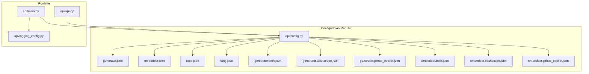
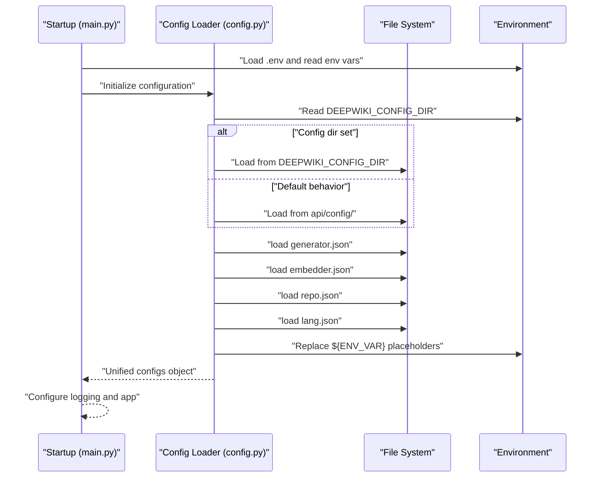
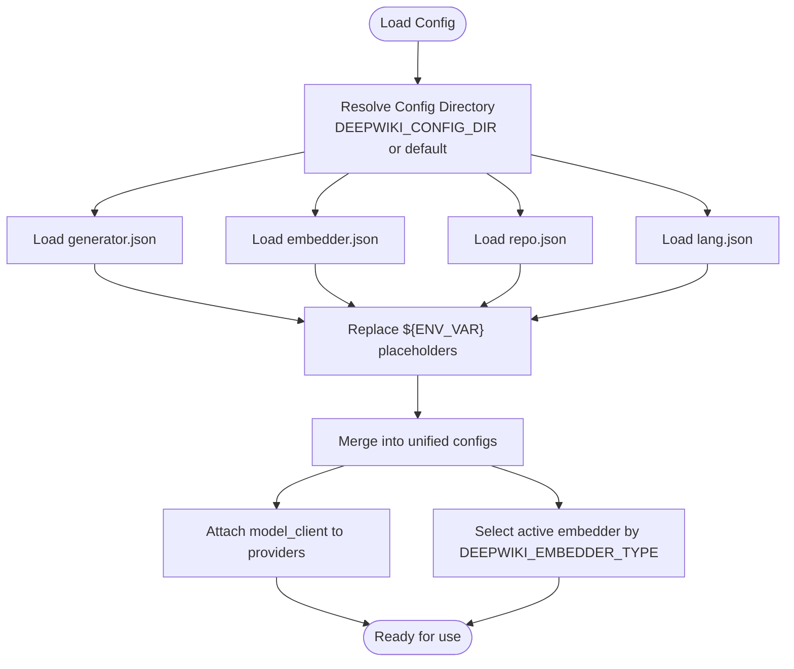
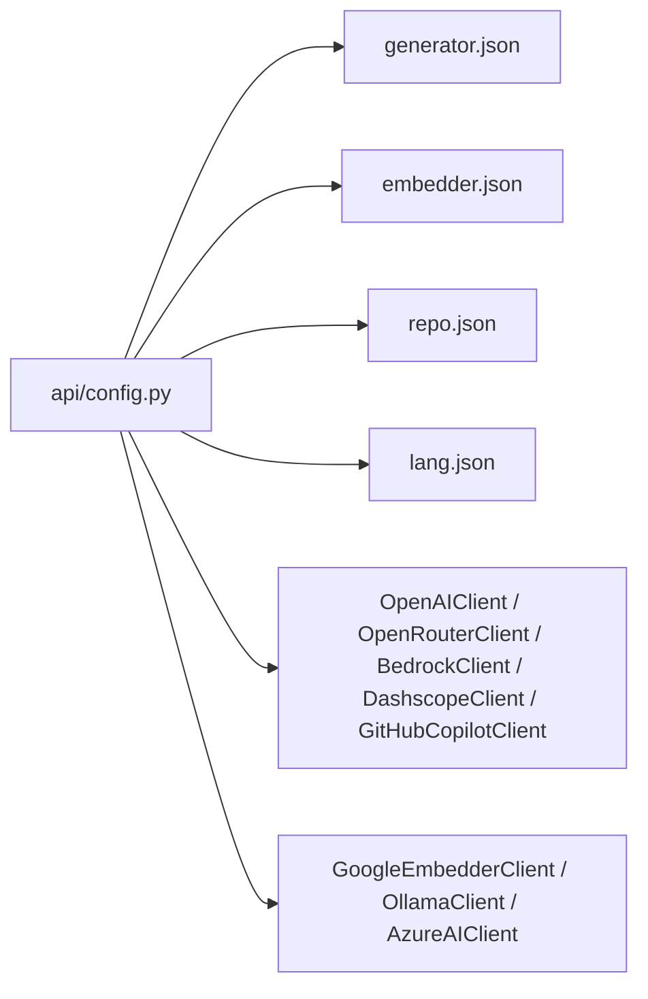

# Configuration Management

<cite>
**Referenced Files in This Document**
- [api/config.py](file://api/config.py)
- [api/config/generator.json](file://api/config/generator.json)
- [api/config/generator.both.json](file://api/config/generator.both.json)
- [api/config/generator.dashscope.json](file://api/config/generator.dashscope.json)
- [api/config/generator.github_copilot.json](file://api/config/generator.github_copilot.json)
- [api/config/embedder.json](file://api/config/embedder.json)
- [api/config/embedder.both.json](file://api/config/embedder.both.json)
- [api/config/embedder.dashscope.json](file://api/config/embedder.dashscope.json)
- [api/config/embedder.github_copilot.json](file://api/config/embedder.github_copilot.json)
- [api/config/repo.json](file://api/config/repo.json)
- [api/config/lang.json](file://api/config/lang.json)
- [api/main.py](file://api/main.py)
- [api/api.py](file://api/api.py)
- [api/logging_config.py](file://api/logging_config.py)
</cite>

## Table of Contents
1. [Introduction](#introduction)
2. [Project Structure](#project-structure)
3. [Core Components](#core-components)
4. [Architecture Overview](#architecture-overview)
5. [Detailed Component Analysis](#detailed-component-analysis)
6. [Dependency Analysis](#dependency-analysis)
7. [Performance Considerations](#performance-considerations)
8. [Troubleshooting Guide](#troubleshooting-guide)
9. [Conclusion](#conclusion)
10. [Appendices](#appendices)

## Introduction
This document explains the centralized configuration management system of DeepWiki-Open. It covers how provider settings, model selection, and processing parameters are defined via JSON configuration files, how environment variables override values, and how the runtime loads and validates configurations. It also documents the available configuration profiles (for example, provider-specific variants) and provides practical guidance for customization, inheritance, defaults, and enterprise deployment.

## Project Structure
DeepWiki-Open organizes configuration under a dedicated configuration module with:
- Central loader and environment integration in a single module
- Provider and model configuration in separate JSON files
- Repository filtering and internationalization settings in dedicated JSON files
- Environment variable overrides and dynamic loading integrated at startup

**Diagram sources**
- [api/config.py](file://api/config.py#L1-L464)
- [api/config/generator.json](file://api/config/generator.json#L1-L101)
- [api/config/generator.both.json](file://api/config/generator.both.json#L1-L67)
- [api/config/generator.dashscope.json](file://api/config/generator.dashscope.json#L1-L239)
- [api/config/generator.github_copilot.json](file://api/config/generator.github_copilot.json#L1-L35)
- [api/config/embedder.json](file://api/config/embedder.json#L1-L35)
- [api/config/embedder.both.json](file://api/config/embedder.both.json#L1-L35)
- [api/config/embedder.dashscope.json](file://api/config/embedder.dashscope.json#L1-L19)
- [api/config/embedder.github_copilot.json](file://api/config/embedder.github_copilot.json#L1-L26)
- [api/config/repo.json](file://api/config/repo.json#L1-L129)
- [api/config/lang.json](file://api/config/lang.json#L1-L16)
- [api/main.py](file://api/main.py#L1-L104)
- [api/api.py](file://api/api.py#L1-L635)
- [api/logging_config.py](file://api/logging_config.py#L1-L86)

**Section sources**
- [api/config.py](file://api/config.py#L1-L464)
- [api/main.py](file://api/main.py#L1-L104)
- [api/api.py](file://api/api.py#L1-L635)

## Core Components
- Centralized configuration loader: Loads and merges JSON configuration files, resolves environment variable placeholders, and exposes unified configuration to the rest of the system.
- Provider configuration: Defines model providers, default models, per-model parameters, and client class bindings.
- Embedding configuration: Defines embedder client classes, batch sizes, model parameters, retriever top-k, and text splitter settings.
- Repository configuration: Defines default exclusions for directories and files, and repository size limits.
- Internationalization configuration: Defines supported languages and default language.
- Environment integration: Reads environment variables for credentials, authentication, embedder type, and configuration directory; applies overrides and logging configuration.

Key responsibilities:
- Dynamic loading of configuration files from a configurable directory
- Environment variable placeholder replacement in JSON values
- Provider/client resolution and model parameter selection
- Validation and defaults for language configuration
- Exposing configuration to API endpoints and internal services

**Section sources**
- [api/config.py](file://api/config.py#L1-L464)
- [api/config/generator.json](file://api/config/generator.json#L1-L101)
- [api/config/embedder.json](file://api/config/embedder.json#L1-L35)
- [api/config/repo.json](file://api/config/repo.json#L1-L129)
- [api/config/lang.json](file://api/config/lang.json#L1-L16)

## Architecture Overview
The configuration system is initialized early in the application lifecycle. The loader:
- Resolves the configuration directory from an environment variable or falls back to a default location
- Loads JSON files and replaces placeholders with environment variable values
- Builds a unified configuration object and attaches provider/client mappings
- Exposes configuration to API endpoints and internal services

**Diagram sources**
- [api/main.py](file://api/main.py#L1-L104)
- [api/config.py](file://api/config.py#L104-L126)

**Section sources**
- [api/main.py](file://api/main.py#L1-L104)
- [api/config.py](file://api/config.py#L57-L126)

## Detailed Component Analysis

### Centralized Configuration Loader
Responsibilities:
- Resolve configuration directory from environment variable
- Load JSON files and recursively replace placeholders like ${ENV_VAR}
- Merge provider and embedder configurations into a single object
- Map provider IDs to client classes and resolve model parameters
- Provide helpers to detect embedder type and select active embedder configuration

Key behaviors:
- Placeholder replacement: Strings containing ${ENV_VAR} are replaced by environment values; missing variables produce warnings and leave placeholders intact
- Provider resolution: Providers can specify a client class; if absent, a default mapping is applied based on provider ID
- Model selection: If no model is specified, the provider’s default model is used; per-model parameters are merged into the final configuration
- Embedder selection: Based on DEEPWIKI_EMBEDDER_TYPE, the loader selects the appropriate embedder configuration block

**Diagram sources**
- [api/config.py](file://api/config.py#L104-L181)

**Section sources**
- [api/config.py](file://api/config.py#L57-L181)

### Provider Configuration (generator.json and variants)
Purpose:
- Define available providers, default models, and per-model parameters
- Bind providers to client classes
- Support provider-specific overrides (for example, base URLs and API key environment variables)

Files:
- Primary: generator.json
- Variants: generator.both.json, generator.dashscope.json, generator.github_copilot.json

Key fields:
- default_provider: default provider ID to use when none is specified
- providers: map of provider IDs to configuration blocks
  - client_class: name of the client class to instantiate
  - default_model: default model for the provider
  - supportsCustomModel: indicates whether custom model names are accepted
  - models: map of model IDs to parameter objects
  - provider-specific fields (for example, base_url and api_key_env for iFlow)

Behavior:
- Provider resolution: If a provider block specifies client_class, it is mapped to a concrete client class; otherwise, a default mapping is applied
- Model parameter merging: If a model is not explicitly specified, the provider’s default model parameters are used
- Special handling for iFlow: The loader logs provider details and prepares a factory that injects base_url and API key environment name

Practical examples (paths only):
- Add a new provider: [Add provider block](file://api/config/generator.json#L1-L101)
- Override default provider: [Set default_provider](file://api/config/generator.json#L2-L2)
- Define per-model parameters: [Add model params](file://api/config/generator.json#L8-L32)
- Use provider variant: [Use generator.dashscope.json](file://api/config/generator.dashscope.json#L1-L239)

**Section sources**
- [api/config.py](file://api/config.py#L127-L168)
- [api/config/generator.json](file://api/config/generator.json#L1-L101)
- [api/config/generator.both.json](file://api/config/generator.both.json#L1-L67)
- [api/config/generator.dashscope.json](file://api/config/generator.dashscope.json#L1-L239)
- [api/config/generator.github_copilot.json](file://api/config/generator.github_copilot.json#L1-L35)

### Embedding Configuration (embedder.json and variants)
Purpose:
- Define embedder client classes and parameters
- Configure batch size, model kwargs, retriever top-k, and text splitter settings
- Support multiple embedder configurations for different providers

Files:
- Primary: embedder.json
- Variants: embedder.both.json, embedder.dashscope.json, embedder.github_copilot.json

Key fields:
- embedder: base embedder configuration
- embedder_<provider>: provider-specific embedder configuration
- retriever: top_k for retrieval
- text_splitter: chunking strategy and sizes

Behavior:
- Embedder selection: The loader chooses the active embedder based on DEEPWIKI_EMBEDDER_TYPE
- Batch size and model kwargs: Used by embedding pipelines
- Text splitter and retriever: Used during RAG processing

Practical examples (paths only):
- Change default embedder client class: [Set client_class](file://api/config/embedder.json#L3-L3)
- Adjust batch size: [Set batch_size](file://api/config/embedder.json#L4-L4)
- Tune retriever top_k: [Set top_k](file://api/config/embedder.json#L28-L28)
- Switch to DashScope embedder: [Use embedder.dashscope.json](file://api/config/embedder.dashscope.json#L1-L19)

**Section sources**
- [api/config.py](file://api/config.py#L170-L181)
- [api/config/embedder.json](file://api/config/embedder.json#L1-L35)
- [api/config/embedder.both.json](file://api/config/embedder.both.json#L1-L35)
- [api/config/embedder.dashscope.json](file://api/config/embedder.dashscope.json#L1-L19)
- [api/config/embedder.github_copilot.json](file://api/config/embedder.github_copilot.json#L1-L26)

### Repository Configuration (repo.json)
Purpose:
- Define default exclusions for directories and files
- Limit repository size for processing

Key fields:
- file_filters.excluded_dirs: list of directory patterns to exclude
- file_filters.excluded_files: list of file patterns to exclude
- repository.max_size_mb: maximum repository size in megabytes

Behavior:
- Defaults: If the file is missing or malformed, sensible defaults are applied
- Integration: Used by repository processing logic to filter content

Practical examples (paths only):
- Extend excluded directories: [Add to excluded_dirs](file://api/config/repo.json#L3-L15)
- Extend excluded files: [Add to excluded_files](file://api/config/repo.json#L16-L123)
- Increase repository size limit: [Set max_size_mb](file://api/config/repo.json#L126-L126)

**Section sources**
- [api/config.py](file://api/config.py#L276-L278)
- [api/config/repo.json](file://api/config/repo.json#L1-L129)

### Internationalization Configuration (lang.json)
Purpose:
- Define supported languages and default language
- Provide language configuration to the API

Behavior:
- Defaults: If the file is missing or malformed, a default configuration is returned
- Validation: The API validates incoming language requests against supported languages and falls back to default

Practical examples (paths only):
- Add a new language: [Add to supported_languages](file://api/config/lang.json#L2-L13)
- Change default language: [Set default](file://api/config/lang.json#L14-L14)

**Section sources**
- [api/config.py](file://api/config.py#L280-L307)
- [api/config/lang.json](file://api/config/lang.json#L1-L16)
- [api/api.py](file://api/api.py#L471-L484)

### Environment Variable Overrides and Dynamic Loading
How environment variables influence configuration:
- DEEPWIKI_CONFIG_DIR: Overrides the default configuration directory
- DEEPWIKI_EMBEDDER_TYPE: Selects the active embedder configuration block
- DEEPWIKI_AUTH_MODE, DEEPWIKI_AUTH_CODE: Controls wiki authentication
- Provider credentials: OPENAI_API_KEY, GOOGLE_API_KEY, OPENROUTER_API_KEY, IFLOW_API_KEY, AWS_ACCESS_KEY_ID, AWS_SECRET_ACCESS_KEY, AWS_REGION, AWS_ROLE_ARN
- Logging: LOG_LEVEL, LOG_FILE_PATH, LOG_MAX_SIZE, LOG_BACKUP_COUNT
- Port: PORT (used by the server)

Placeholder replacement:
- Strings containing ${ENV_VAR} are replaced by environment values during JSON load
- Missing environment variables produce warnings and leave placeholders unchanged

Practical examples (paths only):
- Override configuration directory: [Set DEEPWIKI_CONFIG_DIR](file://api/config.py#L58-L58)
- Select embedder type: [Set DEEPWIKI_EMBEDDER_TYPE](file://api/config.py#L55-L55)
- Provide credentials: [Set OPENAI_API_KEY, GOOGLE_API_KEY, etc.](file://api/config.py#L20-L47)
- Configure logging: [Set LOG_* variables](file://api/logging_config.py#L16-L20)
- Set server port: [Set PORT](file://api/main.py#L89-L89)

**Section sources**
- [api/config.py](file://api/config.py#L55-L58)
- [api/config.py](file://api/config.py#L73-L101)
- [api/config.py](file://api/config.py#L20-L47)
- [api/logging_config.py](file://api/logging_config.py#L16-L20)
- [api/main.py](file://api/main.py#L89-L89)

## Dependency Analysis
The configuration module depends on:
- Client classes for providers and embedders
- JSON configuration files
- Environment variables for credentials and behavior
- Logging configuration

**Diagram sources**
- [api/config.py](file://api/config.py#L10-L17)
- [api/config/generator.json](file://api/config/generator.json#L1-L101)
- [api/config/embedder.json](file://api/config/embedder.json#L1-L35)

**Section sources**
- [api/config.py](file://api/config.py#L60-L71)
- [api/config.py](file://api/config.py#L104-L181)

## Performance Considerations
- Configuration loading cost: JSON parsing and placeholder replacement are lightweight; performed once at startup
- Embedder batch size: Larger batches can improve throughput but increase memory usage; tune per hardware constraints
- Retriever top_k: Higher values increase recall but may reduce speed; balance based on latency targets
- Text splitting: Chunk size and overlap affect embedding and retrieval quality; adjust for content characteristics
- Logging: Rotating file handler ensures manageable log sizes; configure max size and backups appropriately

[No sources needed since this section provides general guidance]

## Troubleshooting Guide
Common issues and resolutions:
- Missing configuration file: The loader logs a warning and continues with defaults; ensure the file exists or set DEEPWIKI_CONFIG_DIR correctly
- Malformed language configuration: The loader falls back to a default configuration; verify supported_languages and default fields
- Unknown provider or client class: The loader logs a warning; ensure client_class matches a known class or use a supported provider ID
- Placeholder not found: A warning is logged and the placeholder remains; set the environment variable or remove the placeholder
- Authentication failures: Verify required environment variables for providers; optional variables are noted in startup logs
- Embedder type mismatch: Ensure DEEPWIKI_EMBEDDER_TYPE corresponds to an available embedder configuration block

Operational checks:
- Startup logs indicate which configuration files were loaded and which provider/client mappings were applied
- Health endpoint confirms service availability

**Section sources**
- [api/config.py](file://api/config.py#L115-L125)
- [api/config.py](file://api/config.py#L303-L305)
- [api/config.py](file://api/config.py#L165-L166)
- [api/config.py](file://api/config.py#L85-L91)
- [api/main.py](file://api/main.py#L66-L76)
- [api/api.py](file://api/api.py#L540-L547)

## Conclusion
DeepWiki-Open’s configuration system centralizes provider, model, and processing parameters in JSON files while enabling environment-driven overrides and dynamic loading. The loader resolves placeholders, maps providers to clients, and exposes validated configuration to the API and internal services. By leveraging configuration variants and environment variables, teams can tailor behavior per environment and provider, with clear defaults and robust validation.

[No sources needed since this section summarizes without analyzing specific files]

## Appendices

### Practical Customization Examples (Paths Only)
- Customize a provider:
  - [Set default_provider](file://api/config/generator.json#L2-L2)
  - [Define models and parameters](file://api/config/generator.json#L8-L32)
- Switch embedder:
  - [Set DEEPWIKI_EMBEDDER_TYPE](file://api/config.py#L55-L55)
  - [Adjust batch size and model kwargs](file://api/config/embedder.json#L4-L8)
- Filter repository content:
  - [Extend excluded directories](file://api/config/repo.json#L3-L15)
  - [Extend excluded files](file://api/config/repo.json#L16-L123)
- Add internationalization support:
  - [Add supported language](file://api/config/lang.json#L2-L13)
  - [Set default language](file://api/config/lang.json#L14-L14)

### Enterprise Deployment Guidelines
- Multi-environment configuration:
  - Use DEEPWIKI_CONFIG_DIR to point to environment-specific directories
  - Keep secrets out of JSON files; rely on environment variable placeholders and external secret stores
- Provider selection:
  - Use provider-specific configuration files (for example, generator.dashscope.json) to isolate provider settings
  - Validate credentials via startup logs and health checks
- Logging and observability:
  - Configure LOG_LEVEL, LOG_FILE_PATH, LOG_MAX_SIZE, LOG_BACKUP_COUNT for compliance and retention needs
  - Monitor health endpoint for service status
- Authentication:
  - Enable and enforce wiki authentication via DEEPWIKI_AUTH_MODE and DEEPWIKI_AUTH_CODE

**Section sources**
- [api/config.py](file://api/config.py#L55-L58)
- [api/config/generator.dashscope.json](file://api/config/generator.dashscope.json#L1-L239)
- [api/logging_config.py](file://api/logging_config.py#L16-L20)
- [api/main.py](file://api/main.py#L66-L76)
- [api/api.py](file://api/api.py#L540-L547)