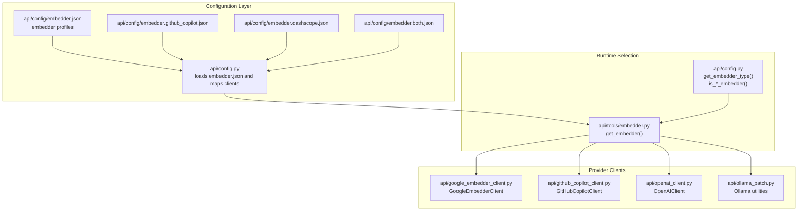
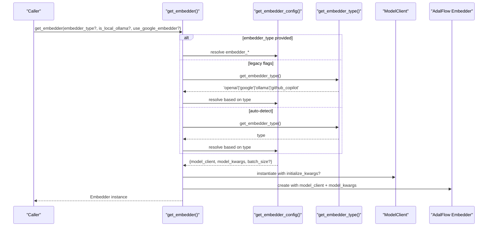
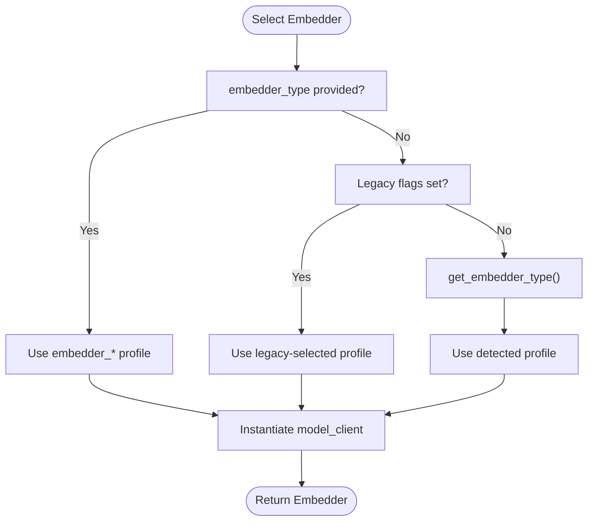
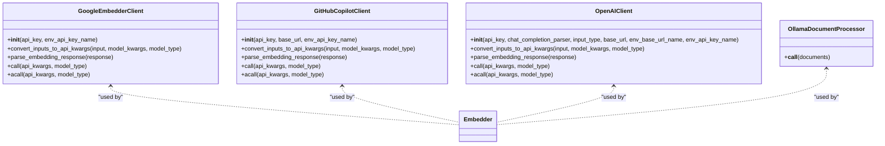
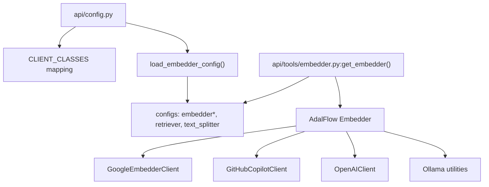

# Embedder Configuration

<cite>
**Referenced Files in This Document**
- [embedder.py](file://api/tools/embedder.py)
- [config.py](file://api/config.py)
- [google_embedder_client.py](file://api/google_embedder_client.py)
- [github_copilot_client.py](file://api/github_copilot_client.py)
- [openai_client.py](file://api/openai_client.py)
- [ollama_patch.py](file://api/ollama_patch.py)
- [embedder.json](file://api/config/embedder.json)
- [embedder.github_copilot.json](file://api/config/embedder.github_copilot.json)
- [embedder.dashscope.json](file://api/config/embedder.dashscope.json)
- [embedder.both.json](file://api/config/embedder.both.json)
- [main.py](file://api/main.py)
- [api.py](file://api/api.py)
- [test_all_embedders.py](file://tests/unit/test_all_embedders.py)
- [test_google_embedder.py](file://tests/unit/test_google_embedder.py)
- [test_github_copilot_embedder.py](file://tests/unit/test_github_copilot_embedder.py)
</cite>

## Table of Contents
1. [Introduction](#introduction)
2. [Project Structure](#project-structure)
3. [Core Components](#core-components)
4. [Architecture Overview](#architecture-overview)
5. [Detailed Component Analysis](#detailed-component-analysis)
6. [Dependency Analysis](#dependency-analysis)
7. [Performance Considerations](#performance-considerations)
8. [Troubleshooting Guide](#troubleshooting-guide)
9. [Conclusion](#conclusion)
10. [Appendices](#appendices)

## Introduction
This document explains the embedder configuration system used by DeepWiki-Open. It covers how embedder types are selected (OpenAI, Google, Ollama, GitHub Copilot), how configurations are loaded and validated, and how to switch embedders at runtime. It also provides practical examples for local and cloud-based embeddings, guidance on validation and type checking, and performance considerations for different use cases.

## Project Structure
The embedder system spans configuration files, a configuration loader, a factory function, and provider-specific client implementations:

- Configuration files define embedder profiles and defaults.
- The configuration loader resolves environment variables, maps client classes, and exposes typed embedder configurations.
- The embedder factory selects the appropriate embedder based on explicit parameters, legacy flags, or auto-detection.
- Provider clients encapsulate API specifics for each embedder type.

**Diagram sources**
- [config.py](file://api/config.py#L170-L181)
- [embedder.py](file://api/tools/embedder.py#L6-L58)
- [google_embedder_client.py](file://api/google_embedder_client.py#L20-L231)
- [github_copilot_client.py](file://api/github_copilot_client.py#L30-L800)
- [openai_client.py](file://api/openai_client.py#L120-L653)
- [ollama_patch.py](file://api/ollama_patch.py#L62-L105)

**Section sources**
- [config.py](file://api/config.py#L170-L181)
- [embedder.py](file://api/tools/embedder.py#L6-L58)

## Core Components
- Embedder configuration loader: Loads JSON configurations, replaces environment placeholders, maps client classes, and exposes typed configurations.
- Embedder factory: Selects the embedder profile based on explicit type, legacy flags, or auto-detection, constructs the model client, and returns an AdalFlow Embedder.
- Provider clients: Implementations for Google, GitHub Copilot, OpenAI, and Ollama with standardized input conversion and response parsing.
- Runtime detection helpers: Functions to detect the current embedder type and validate provider classes.

Key responsibilities:
- Configuration loading and environment substitution
- Client class resolution and mapping
- Embedder instantiation with model kwargs and optional batch size
- Type detection and runtime switching

**Section sources**
- [config.py](file://api/config.py#L73-L101)
- [config.py](file://api/config.py#L170-L181)
- [config.py](file://api/config.py#L183-L274)
- [embedder.py](file://api/tools/embedder.py#L6-L58)

## Architecture Overview
The embedder system follows a layered design:
- Configuration layer: JSON files define embedder profiles and defaults.
- Loader layer: Reads and normalizes configurations, resolves client classes, and exposes typed configs.
- Factory layer: Chooses the correct embedder profile and instantiates the model client.
- Provider layer: Implements provider-specific API calls and response parsing.
- Runtime layer: Provides detection and switching utilities.

**Diagram sources**
- [embedder.py](file://api/tools/embedder.py#L6-L58)
- [config.py](file://api/config.py#L183-L198)
- [config.py](file://api/config.py#L260-L274)

## Detailed Component Analysis

### Embedder Configuration Loading and Resolution
- Configuration files:
  - Primary: embedder.json defines default embedder and related profiles.
  - Provider-specific: embedder.github_copilot.json and embedder.dashscope.json provide additional profiles.
  - Combined: embedder.both.json includes multiple profiles for hybrid setups.
- Loader behavior:
  - Loads JSON from a configurable directory or defaults to api/config.
  - Replaces ${ENV_VAR} placeholders with environment values.
  - Maps client_class strings to actual client classes via CLIENT_CLASSES.
  - Exposes configs with keys like embedder, embedder_ollama, embedder_google, embedder_github_copilot, retriever, text_splitter.

Validation and environment handling:
- Environment variables are read and set for providers.
- Missing placeholders produce warnings; values remain literal if undefined.

**Section sources**
- [config.py](file://api/config.py#L104-L125)
- [config.py](file://api/config.py#L73-L101)
- [config.py](file://api/config.py#L170-L181)
- [embedder.json](file://api/config/embedder.json#L1-L35)
- [embedder.github_copilot.json](file://api/config/embedder.github_copilot.json#L1-L26)
- [embedder.dashscope.json](file://api/config/embedder.dashscope.json#L1-L19)
- [embedder.both.json](file://api/config/embedder.both.json#L1-L35)

### Embedder Type Detection and Switching
- Type detection:
  - get_embedder_type() inspects the current embedder configuration and returns 'ollama', 'google', 'github_copilot', or 'openai'.
  - is_ollama_embedder(), is_google_embedder(), is_github_copilot_embedder() provide boolean checks.
- Runtime switching:
  - get_embedder() accepts embedder_type, is_local_ollama, and use_google_embedder to select a profile explicitly.
  - If none provided, it auto-detects the current type and selects the corresponding profile.

**Diagram sources**
- [embedder.py](file://api/tools/embedder.py#L18-L41)
- [config.py](file://api/config.py#L260-L274)

**Section sources**
- [config.py](file://api/config.py#L260-L274)
- [config.py](file://api/config.py#L200-L258)
- [embedder.py](file://api/tools/embedder.py#L18-L41)

### Embedder Factory: Construction and Initialization
- get_embedder():
  - Resolves the embedder profile based on parameters or auto-detection.
  - Instantiates model_client with optional initialize_kwargs.
  - Creates an AdalFlow Embedder with model_client and model_kwargs.
  - Sets batch_size as an attribute if provided.

Initialization considerations:
- Some clients require environment variables (e.g., API keys).
- For GitHub Copilot, OAuth2 is automatic; no tokens are required.

**Section sources**
- [embedder.py](file://api/tools/embedder.py#L6-L58)

### Provider Clients: Implementation Patterns
- GoogleEmbedderClient:
  - Validates model_type and input format.
  - Converts inputs to Google AI API kwargs with content/content list handling.
  - Parses responses into EmbedderOutput with Embedding objects.
  - Supports exponential backoff for retries.
- GitHubCopilotClient:
  - Uses LiteLLM with automatic OAuth2; ignores explicit API keys/base URLs.
  - Formats model names with provider prefix.
  - Handles malformed JSON responses via flattening utilities.
  - Parses embeddings into raw float lists.
- OpenAIClient:
  - Supports both embedding and chat completion.
  - Converts inputs to messages or embedding input arrays.
  - Parses responses into EmbedderOutput.
- Ollama utilities:
  - Model existence check and document processor for non-batch-capable Ollama client.

**Diagram sources**
- [google_embedder_client.py](file://api/google_embedder_client.py#L20-L231)
- [github_copilot_client.py](file://api/github_copilot_client.py#L30-L800)
- [openai_client.py](file://api/openai_client.py#L120-L653)
- [ollama_patch.py](file://api/ollama_patch.py#L62-L105)

**Section sources**
- [google_embedder_client.py](file://api/google_embedder_client.py#L78-L140)
- [github_copilot_client.py](file://api/github_copilot_client.py#L114-L210)
- [openai_client.py](file://api/openai_client.py#L268-L280)
- [ollama_patch.py](file://api/ollama_patch.py#L62-L105)

### Configuration Options and Profiles
- embedder.json:
  - embedder: default provider profile (e.g., GitHub Copilot).
  - embedder_github_copilot: dedicated GitHub Copilot profile.
  - embedder_dashscope: DashScope profile with dimensions and encoding format.
  - retriever: top_k for retrieval.
  - text_splitter: split_by, chunk_size, chunk_overlap.
- Provider-specific overrides:
  - embedder.github_copilot.json and embedder.dashscope.json provide focused profiles.
  - embedder.both.json includes multiple profiles for hybrid setups.

Client class mapping:
- CLIENT_CLASSES maps client_class strings to actual classes (e.g., GoogleEmbedderClient, GitHubCopilotClient, OpenAIClient, OllamaClient).

**Section sources**
- [embedder.json](file://api/config/embedder.json#L1-L35)
- [embedder.github_copilot.json](file://api/config/embedder.github_copilot.json#L1-L26)
- [embedder.dashscope.json](file://api/config/embedder.dashscope.json#L1-L19)
- [embedder.both.json](file://api/config/embedder.both.json#L1-L35)
- [config.py](file://api/config.py#L61-L71)

### Practical Examples

- Configure default embedder via environment:
  - Set DEEPWIKI_EMBEDDER_TYPE to 'google', 'ollama', 'github_copilot', or 'openai'.
  - The loader reads this and exposes the corresponding profile.

- Select embedder explicitly:
  - Use get_embedder(embedder_type='google') to force Google embeddings.
  - Use get_embedder(embedder_type='github_copilot') for GitHub Copilot embeddings.

- Local embeddings with Ollama:
  - Ensure Ollama is running and the model exists.
  - Use get_embedder(embedder_type='ollama') or set DEEPWIKI_EMBEDDER_TYPE='ollama'.
  - For non-batch-capable Ollama, process documents individually using OllamaDocumentProcessor.

- Cloud-based embeddings:
  - Google: Set GOOGLE_API_KEY and use embedder_google profile.
  - GitHub Copilot: No tokens required; automatic OAuth2 via LiteLLM.
  - OpenAI/DashScope: Set respective API keys and use provider-specific profiles.

- Retrieval and chunking:
  - Adjust retriever.top_k and text_splitter settings in embedder.json for optimal recall and chunk sizes.

**Section sources**
- [config.py](file://api/config.py#L55-L55)
- [config.py](file://api/config.py#L183-L198)
- [embedder.py](file://api/tools/embedder.py#L18-L41)
- [ollama_patch.py](file://api/ollama_patch.py#L21-L60)
- [embedder.json](file://api/config/embedder.json#L27-L34)

## Dependency Analysis
The embedder system depends on:
- Configuration loader for environment resolution and client mapping.
- AdalFlow Embedder for unified embedding interface.
- Provider clients for API-specific behavior.
- Optional utilities for Ollama model validation and document processing.

**Diagram sources**
- [config.py](file://api/config.py#L61-L71)
- [config.py](file://api/config.py#L170-L181)
- [embedder.py](file://api/tools/embedder.py#L6-L58)

**Section sources**
- [config.py](file://api/config.py#L61-L71)
- [config.py](file://api/config.py#L170-L181)
- [embedder.py](file://api/tools/embedder.py#L6-L58)

## Performance Considerations
- Batch size:
  - Some providers support batch embeddings; configure batch_size in embedder.json for throughput.
  - For Ollama, which lacks native batch support, process documents individually and validate consistent embedding sizes.
- Model dimensions and encoding:
  - Ensure model dimensions match downstream components (e.g., DashScope dimensions).
  - Use float encoding for compatibility with common consumers.
- Chunking and retrieval:
  - Tune text_splitter.chunk_size and chunk_overlap for recall vs. cost trade-offs.
  - Adjust retriever.top_k to balance precision and latency.
- Network and timeouts:
  - Corporate proxies may require increased timeouts; the API initializes HTTPX timeouts for compatible providers.

**Section sources**
- [embedder.json](file://api/config/embedder.json#L4-L25)
- [embedder.dashscope.json](file://api/config/embedder.dashscope.json#L4-L9)
- [ollama_patch.py](file://api/ollama_patch.py#L62-L105)
- [main.py](file://api/main.py#L9-L20)

## Troubleshooting Guide
Common issues and resolutions:
- Missing environment variables:
  - GOOGLE_API_KEY for Google, OPENAI_API_KEY for OpenAI/DashScope, etc.
  - GitHub Copilot uses automatic OAuth2; no tokens required.
- Placeholder warnings:
  - ${ENV_VAR} placeholders not found produce warnings; ensure environment variables are set.
- Ollama model not found:
  - Use check_ollama_model_exists() to validate model availability before embedding.
- Inconsistent embedding sizes:
  - OllamaDocumentProcessor validates and filters documents with mismatched embedding dimensions.
- Response parsing errors:
  - GitHubCopilotClient includes JSON flattening utilities to handle malformed responses.
- Type detection mismatches:
  - Verify DEEPWIKI_EMBEDDER_TYPE and ensure the corresponding profile exists in embedder.json.

Validation utilities:
- is_ollama_embedder(), is_google_embedder(), is_github_copilot_embedder() for runtime checks.
- get_embedder_type() to confirm current embedder type.

**Section sources**
- [config.py](file://api/config.py#L73-L101)
- [config.py](file://api/config.py#L200-L258)
- [config.py](file://api/config.py#L260-L274)
- [ollama_patch.py](file://api/ollama_patch.py#L17-L60)
- [github_copilot_client.py](file://api/github_copilot_client.py#L211-L235)
- [test_all_embedders.py](file://tests/unit/test_all_embedders.py#L313-L354)
- [test_google_embedder.py](file://tests/unit/test_google_embedder.py#L23-L74)
- [test_github_copilot_embedder.py](file://tests/unit/test_github_copilot_embedder.py#L15-L27)

## Conclusion
DeepWiki-Open’s embedder system provides flexible configuration, robust provider integrations, and runtime switching capabilities. By leveraging environment-driven configuration, explicit selection parameters, and provider-specific clients, teams can deploy local or cloud-based embeddings tailored to their infrastructure and performance needs. Use the provided validation and troubleshooting guidance to maintain reliability across diverse deployment scenarios.

## Appendices

### Configuration Reference
- embedder.json
  - embedder: default provider profile with client_class and model_kwargs.
  - embedder_github_copilot: GitHub Copilot profile.
  - embedder_dashscope: DashScope profile with dimensions.
  - retriever: top_k for retrieval.
  - text_splitter: chunking parameters.

- Provider-specific files:
  - embedder.github_copilot.json: GitHub Copilot-focused profile.
  - embedder.dashscope.json: DashScope-focused profile.
  - embedder.both.json: Multi-provider profile.

**Section sources**
- [embedder.json](file://api/config/embedder.json#L1-L35)
- [embedder.github_copilot.json](file://api/config/embedder.github_copilot.json#L1-L26)
- [embedder.dashscope.json](file://api/config/embedder.dashscope.json#L1-L19)
- [embedder.both.json](file://api/config/embedder.both.json#L1-L35)

### API Endpoints and Logging
- Health and root endpoints for service verification.
- Logging configuration is applied early to capture initialization and runtime logs.

**Section sources**
- [api.py](file://api/api.py#L540-L547)
- [api.py](file://api/api.py#L549-L574)
- [main.py](file://api/main.py#L22-L26)