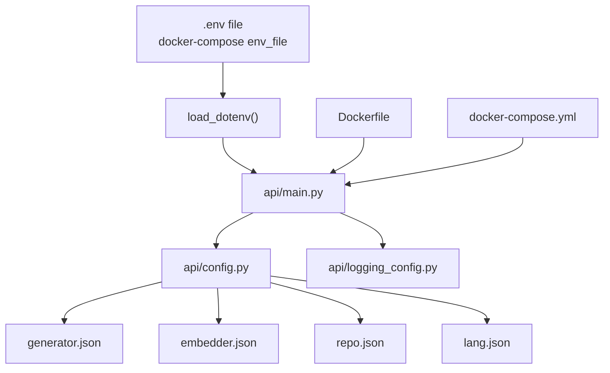
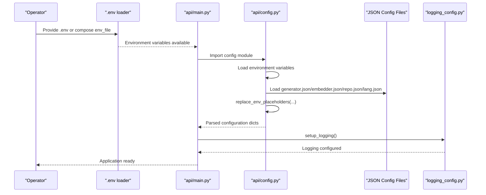
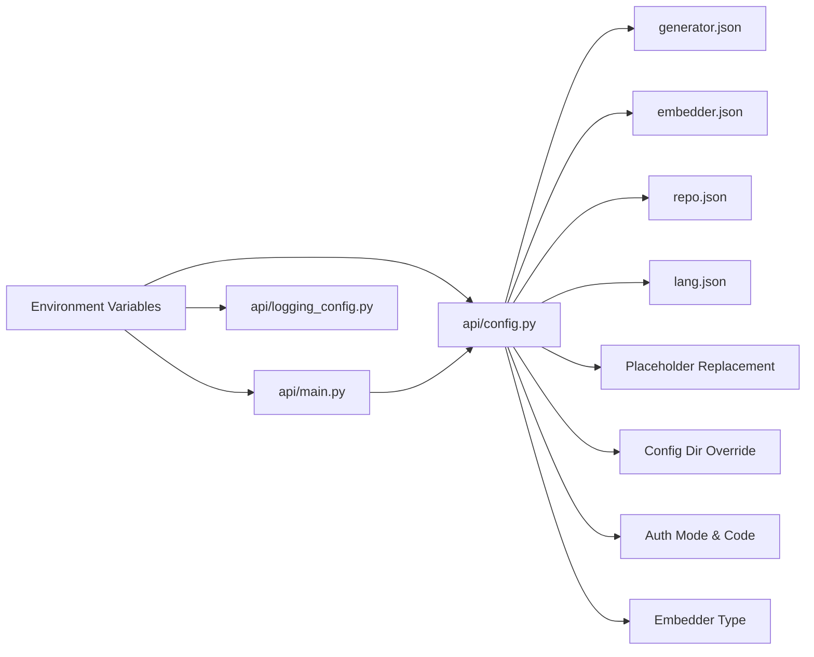

# Environment Variables and Runtime Configuration

<cite>
**Referenced Files in This Document**
- [api/config.py](file://api/config.py)
- [api/main.py](file://api/main.py)
- [Dockerfile](file://Dockerfile)
- [docker-compose.yml](file://docker-compose.yml)
- [api/logging_config.py](file://api/logging_config.py)
- [api/config/embedder.json](file://api/config/embedder.json)
- [api/config/generator.json](file://api/config/generator.json)
- [api/config/repo.json](file://api/config/repo.json)
- [api/config/lang.json](file://api/config/lang.json)
</cite>

## Table of Contents
1. [Introduction](#introduction)
2. [Project Structure](#project-structure)
3. [Core Components](#core-components)
4. [Architecture Overview](#architecture-overview)
5. [Detailed Component Analysis](#detailed-component-analysis)
6. [Dependency Analysis](#dependency-analysis)
7. [Performance Considerations](#performance-considerations)
8. [Troubleshooting Guide](#troubleshooting-guide)
9. [Conclusion](#conclusion)
10. [Appendices](#appendices)

## Introduction
This document explains how DeepWiki-Open loads and applies environment variables and runtime configuration. It covers supported environment variables (API keys, authentication, embedder type, configuration directory), the placeholder replacement mechanism, configuration precedence, authentication modes, and security considerations. It also provides practical setup examples, validation steps, Docker deployment guidance, secret management recommendations, and debugging tips.

## Project Structure
DeepWiki-Open’s runtime configuration spans:
- Python entrypoint and environment loading
- Centralized configuration loader and environment placeholder replacement
- Provider and embedder configuration JSON files
- Logging configuration with environment-driven behavior
- Docker and docker-compose integration for environment propagation and secrets mounting

**Diagram sources**
- [api/main.py](file://api/main.py#L1-L104)
- [api/config.py](file://api/config.py#L1-L464)
- [api/config/generator.json](file://api/config/generator.json#L1-L101)
- [api/config/embedder.json](file://api/config/embedder.json#L1-L35)
- [api/config/repo.json](file://api/config/repo.json#L1-L129)
- [api/config/lang.json](file://api/config/lang.json#L1-L16)
- [Dockerfile](file://Dockerfile#L1-L171)
- [docker-compose.yml](file://docker-compose.yml#L1-L46)

**Section sources**
- [api/main.py](file://api/main.py#L1-L104)
- [api/config.py](file://api/config.py#L1-L464)
- [Dockerfile](file://Dockerfile#L1-L171)
- [docker-compose.yml](file://docker-compose.yml#L1-L46)

## Core Components
- Environment variable loading and validation
  - Loads .env via dotenv at startup
  - Validates required variables and logs warnings for missing ones
- Central configuration loader
  - Reads JSON configuration files from a configurable directory
  - Applies environment placeholder replacement recursively
- Provider and embedder configuration
  - Generator and embedder configurations define client classes and model parameters
- Logging configuration
  - Controlled by environment variables for level, file path, rotation size, and backups

Key environment variables:
- API keys and cloud provider credentials
  - OPENAI_API_KEY, GOOGLE_API_KEY, OPENROUTER_API_KEY, IFLOW_API_KEY
  - AWS_ACCESS_KEY_ID, AWS_SECRET_ACCESS_KEY, AWS_REGION, AWS_ROLE_ARN
- Authentication
  - DEEPWIKI_AUTH_MODE, DEEPWIKI_AUTH_CODE
- Embedder selection
  - DEEPWIKI_EMBEDDER_TYPE
- Configuration directory override
  - DEEPWIKI_CONFIG_DIR
- Logging
  - LOG_LEVEL, LOG_FILE_PATH, LOG_MAX_SIZE, LOG_BACKUP_COUNT
- Application runtime
  - PORT, NODE_ENV, SERVER_BASE_URL, HTTP_PROXY, HTTPS_PROXY, NO_PROXY

**Section sources**
- [api/main.py](file://api/main.py#L60-L77)
- [api/config.py](file://api/config.py#L19-L58)
- [api/logging_config.py](file://api/logging_config.py#L12-L78)

## Architecture Overview
The runtime configuration pipeline:

**Diagram sources**
- [api/main.py](file://api/main.py#L1-L104)
- [api/config.py](file://api/config.py#L104-L125)
- [api/logging_config.py](file://api/logging_config.py#L12-L78)

## Detailed Component Analysis

### Environment Variable Loading and Validation
- .env loading
  - The Python entrypoint loads environment variables from a .env file if present.
- Required vs optional variables
  - Required: GOOGLE_API_KEY, OPENAI_API_KEY
  - Optional: GITHUB_TOKEN, OPENROUTER_API_KEY, IFLOW_API_KEY, AWS_ACCESS_KEY_ID, AWS_SECRET_ACCESS_KEY
- Logging behavior
  - Missing required variables produce warnings
  - Missing optional variables are logged with provider-specific guidance

Practical example:
- Set OPENAI_API_KEY and GOOGLE_API_KEY in .env or pass via docker-compose.
- Verify warnings appear if either is missing.

**Section sources**
- [api/main.py](file://api/main.py#L6-L7)
- [api/main.py](file://api/main.py#L60-L77)

### Placeholder Replacement System (${ENV_VAR})
- Mechanism
  - Recursively scans configuration dictionaries and lists for strings matching ${ENV_VAR}.
  - Replaces placeholders with environment variable values; logs a warning if a placeholder is not found.
- Behavior
  - Placeholders not found are preserved as literal strings.
  - Useful for injecting secrets or dynamic paths from environment variables into JSON configs.

Example:
- If a JSON value contains "${OPENAI_API_KEY}", it will be replaced by the environment value at load time.

**Section sources**
- [api/config.py](file://api/config.py#L73-L102)

### Configuration Directory Override (DEEPWIKI_CONFIG_DIR)
- Purpose
  - Overrides the default configuration directory path used by the loader.
- Resolution order
  - If DEEPWIKI_CONFIG_DIR is set, the loader resolves all JSON files under that directory.
  - Otherwise, defaults to the built-in config directory within the package.

Practical example:
- Mount a host directory into the container and set DEEPWIKI_CONFIG_DIR to point to it.

**Section sources**
- [api/config.py](file://api/config.py#L104-L112)

### Authentication Mode Configuration (DEEPWIKI_AUTH_MODE, DEEPWIKI_AUTH_CODE)
- DEEPWIKI_AUTH_MODE
  - Interpreted as a boolean-like string; values such as true, 1, t are treated as enabled.
- DEEPWIKI_AUTH_CODE
  - Stores the authentication code used when authentication mode is enabled.
- Security considerations
  - Treat DEEPWIKI_AUTH_CODE as a secret; avoid committing it to version control.
  - Prefer environment injection via .env or docker-compose secrets.

Note: The repository does not include explicit authentication enforcement logic in the analyzed files. Ensure your deployment enforces authentication checks at the application layer if DEEPWIKI_AUTH_MODE is enabled.

**Section sources**
- [api/config.py](file://api/config.py#L49-L52)

### Embedder Type Selection (DEEPWIKI_EMBEDDER_TYPE)
- Purpose
  - Selects which embedder configuration to use at runtime.
- Supported values
  - openai (default), google, ollama, github_copilot
- Resolution
  - The loader chooses the appropriate embedder block based on the selected type and sets the model client accordingly.

Practical example:
- Set DEEPWIKI_EMBEDDER_TYPE to google to use the Google embedder configuration.

**Section sources**
- [api/config.py](file://api/config.py#L54-L58)
- [api/config.py](file://api/config.py#L183-L198)

### Provider and Embedder Configuration Files
- generator.json
  - Defines default provider, provider-specific client classes, default models, and per-model parameters.
  - Includes provider blocks for github_copilot, dashscope, and iflow.
- embedder.json
  - Defines embedder client classes and parameters for multiple variants (e.g., github_copilot, dashscope).
- repo.json
  - Defines repository-level filters and constraints (e.g., excluded directories/files, max size).
- lang.json
  - Defines supported languages and default language.

Notes:
- These files are loaded after environment variables are available.
- Placeholder replacement can inject environment values into these files.

**Section sources**
- [api/config/generator.json](file://api/config/generator.json#L1-L101)
- [api/config/embedder.json](file://api/config/embedder.json#L1-L35)
- [api/config/repo.json](file://api/config/repo.json#L1-L129)
- [api/config/lang.json](file://api/config/lang.json#L1-L16)

### Logging Configuration (Environment-Driven)
- Controls
  - LOG_LEVEL, LOG_FILE_PATH, LOG_MAX_SIZE, LOG_BACKUP_COUNT
- Safety
  - Validates that LOG_FILE_PATH resides within the logs directory to prevent path traversal.
- Defaults
  - Default log file path is under api/logs
  - Default level is INFO
  - Default rotation size is 10MB with 5 backups

Practical example:
- Set LOG_FILE_PATH to persist logs to a mounted volume in Docker.

**Section sources**
- [api/logging_config.py](file://api/logging_config.py#L12-L78)

### Docker Deployment Considerations
- .env loading
  - The container entrypoint attempts to load .env if present.
- Required variables
  - OPENAI_API_KEY and GOOGLE_API_KEY are required; warnings are emitted if missing.
- Port exposure
  - API port defaults to 8001; can be overridden via PORT.
- Proxy support
  - HTTP_PROXY, HTTPS_PROXY, NO_PROXY are propagated to both Node and Python stages.
- Secrets and volumes
  - Mount a .env file or pass secrets via environment variables.
  - Persist logs and cache directories via volumes.

Practical example:
- docker-compose.yml mounts a local logs directory and persists .adalflow cache.

**Section sources**
- [Dockerfile](file://Dockerfile#L142-L159)
- [Dockerfile](file://Dockerfile#L138-L139)
- [docker-compose.yml](file://docker-compose.yml#L18-L35)

## Dependency Analysis
Runtime configuration dependencies and precedence:

**Diagram sources**
- [api/main.py](file://api/main.py#L1-L104)
- [api/config.py](file://api/config.py#L1-L464)
- [api/logging_config.py](file://api/logging_config.py#L12-L78)

Key observations:
- Environment variables take effect before configuration files are loaded.
- DEEPWIKI_CONFIG_DIR overrides the default config directory.
- Placeholder replacement occurs during JSON load, enabling dynamic substitution from environment variables.
- Authentication mode and embedder type influence which provider/client is selected.

**Section sources**
- [api/config.py](file://api/config.py#L104-L125)
- [api/config.py](file://api/config.py#L183-L198)

## Performance Considerations
- Avoid excessive logging in production by setting LOG_LEVEL appropriately.
- Keep LOG_MAX_SIZE and LOG_BACKUP_COUNT tuned for disk usage.
- Limit unnecessary file watching in development to reduce CPU overhead.

[No sources needed since this section provides general guidance]

## Troubleshooting Guide
Common issues and resolutions:
- Missing required API keys
  - Symptom: Warnings about missing GOOGLE_API_KEY or OPENAI_API_KEY.
  - Action: Provide both keys via .env or environment variables.
- Placeholder not replaced
  - Symptom: Literal "${VAR}" remains in configuration.
  - Action: Ensure VAR is set in the environment; the loader logs a warning when a placeholder is not found.
- Configuration file not found
  - Symptom: Warning about missing configuration file path.
  - Action: Verify DEEPWIKI_CONFIG_DIR if overriding; otherwise ensure files exist in the default config directory.
- Log file path outside logs directory
  - Symptom: Error indicating LOG_FILE_PATH is outside the trusted directory.
  - Action: Adjust LOG_FILE_PATH to a path under api/logs or fix permissions.
- Authentication mode not taking effect
  - Symptom: No enforced authentication despite DEEPWIKI_AUTH_MODE=true.
  - Action: Confirm application-layer enforcement and that DEEPWIKI_AUTH_CODE is set securely.

Validation checklist:
- Confirm .env is loaded (dotenv) and required variables are present.
- Verify DEEPWIKI_CONFIG_DIR points to a valid directory if overridden.
- Check that placeholder replacement is working by inspecting loaded configuration values.
- Review logs at the configured level and location.

**Section sources**
- [api/main.py](file://api/main.py#L60-L77)
- [api/config.py](file://api/config.py#L73-L102)
- [api/config.py](file://api/config.py#L104-L125)
- [api/logging_config.py](file://api/logging_config.py#L38-L42)

## Conclusion
DeepWiki-Open’s runtime configuration is driven by environment variables and JSON configuration files. The system supports secure placeholder replacement, flexible configuration directory overrides, and environment-controlled logging. Properly setting required API keys, authentication mode, and embedder type ensures reliable operation. Docker and docker-compose facilitate environment propagation and secret management, while logging configuration safeguards file paths and enables operational visibility.

[No sources needed since this section summarizes without analyzing specific files]

## Appendices

### Environment Variables Reference
- API keys and cloud credentials
  - OPENAI_API_KEY, GOOGLE_API_KEY, OPENROUTER_API_KEY, IFLOW_API_KEY
  - AWS_ACCESS_KEY_ID, AWS_SECRET_ACCESS_KEY, AWS_REGION, AWS_ROLE_ARN
- Authentication
  - DEEPWIKI_AUTH_MODE, DEEPWIKI_AUTH_CODE
- Embedder selection
  - DEEPWIKI_EMBEDDER_TYPE
- Configuration directory override
  - DEEPWIKI_CONFIG_DIR
- Logging
  - LOG_LEVEL, LOG_FILE_PATH, LOG_MAX_SIZE, LOG_BACKUP_COUNT
- Application runtime
  - PORT, NODE_ENV, SERVER_BASE_URL, HTTP_PROXY, HTTPS_PROXY, NO_PROXY

**Section sources**
- [api/config.py](file://api/config.py#L19-L58)
- [api/main.py](file://api/main.py#L60-L77)
- [api/logging_config.py](file://api/logging_config.py#L16-L20)

### Practical Setup Examples
- Local development
  - Create a .env file with OPENAI_API_KEY and GOOGLE_API_KEY.
  - Run the Python entrypoint; it loads .env and starts the API server.
- Docker deployment
  - Provide secrets via .env or docker-compose environment variables.
  - Mount logs and cache directories for persistence.
  - Optionally set DEEPWIKI_CONFIG_DIR to a mounted directory to override configs.

**Section sources**
- [api/main.py](file://api/main.py#L6-L7)
- [Dockerfile](file://Dockerfile#L142-L159)
- [docker-compose.yml](file://docker-compose.yml#L18-L35)

### Secret Management Best Practices
- Never commit secrets to version control.
- Use .env files locally and secrets management systems in production.
- Restrict filesystem permissions for .env and mounted secrets.
- Rotate API keys regularly and revoke unused credentials.

[No sources needed since this section provides general guidance]

### Configuration Precedence Rules
- Environment variables are read first.
- JSON configuration files are loaded afterward.
- Placeholder replacement substitutes ${ENV_VAR} with environment values.
- DEEPWIKI_CONFIG_DIR overrides the default config directory.
- Authentication mode and embedder type select provider/client at runtime.

**Section sources**
- [api/config.py](file://api/config.py#L104-L125)
- [api/config.py](file://api/config.py#L73-L102)
- [api/config.py](file://api/config.py#L183-L198)