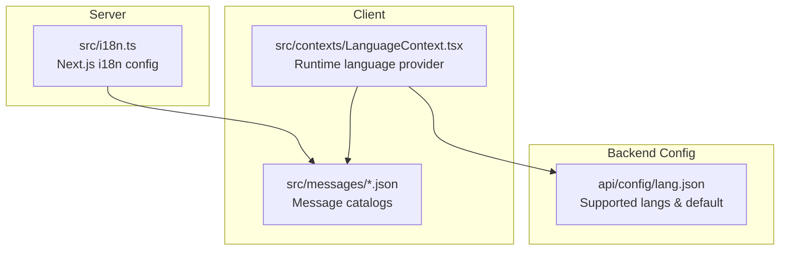
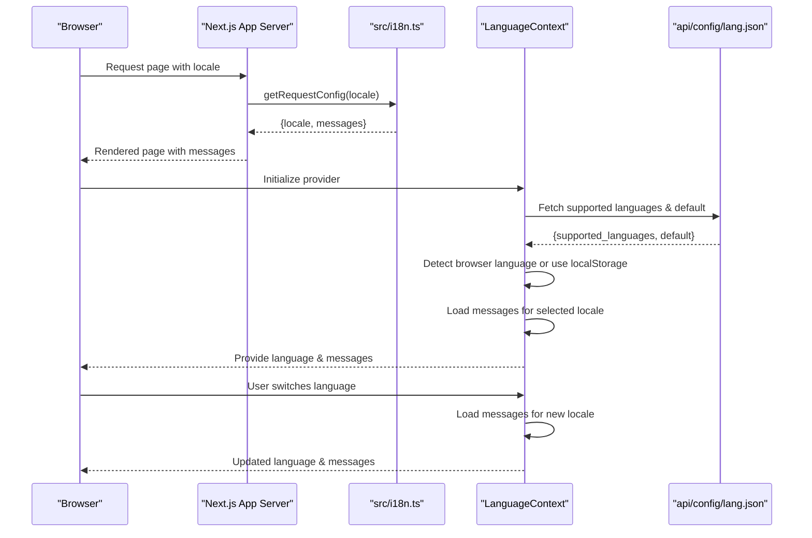
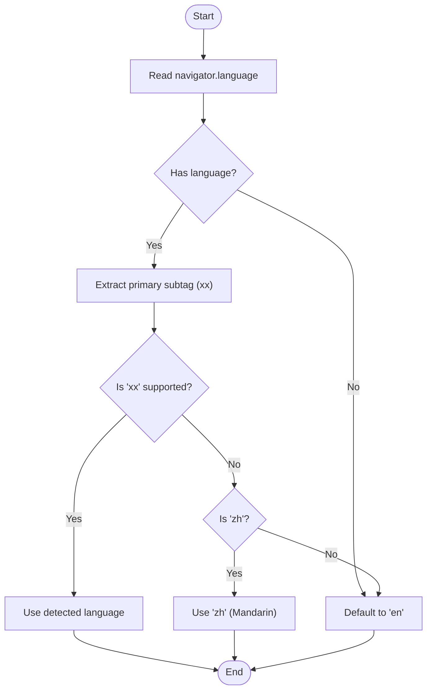
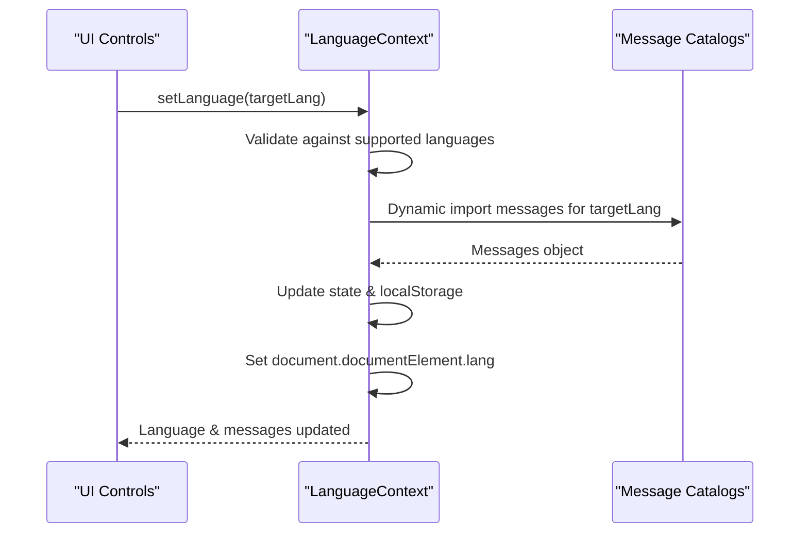
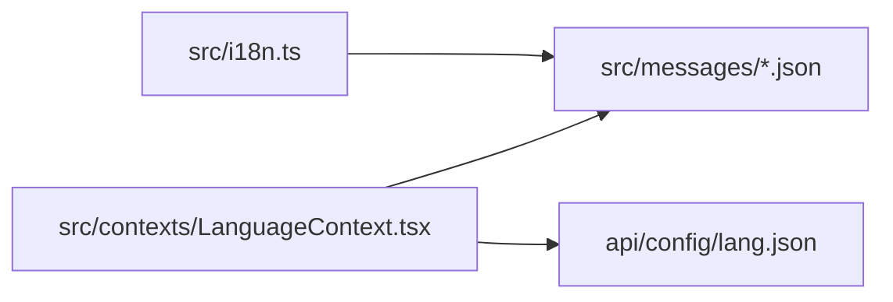

# Internationalization Configuration

<cite>
**Referenced Files in This Document**
- [src/i18n.ts](file://src/i18n.ts)
- [src/contexts/LanguageContext.tsx](file://src/contexts/LanguageContext.tsx)
- [api/config/lang.json](file://api/config/lang.json)
- [src/messages/en.json](file://src/messages/en.json)
- [src/messages/zh.json](file://src/messages/zh.json)
- [src/messages/es.json](file://src/messages/es.json)
- [src/messages/fr.json](file://src/messages/fr.json)
- [src/messages/ja.json](file://src/messages/ja.json)
- [src/messages/kr.json](file://src/messages/kr.json)
- [src/messages/vi.json](file://src/messages/vi.json)
- [src/messages/pt-br.json](file://src/messages/pt-br.json)
- [src/messages/ru.json](file://src/messages/ru.json)
- [src/messages/zh-tw.json](file://src/messages/zh-tw.json)
</cite>

## Table of Contents
1. [Introduction](#introduction)
2. [Project Structure](#project-structure)
3. [Core Components](#core-components)
4. [Architecture Overview](#architecture-overview)
5. [Detailed Component Analysis](#detailed-component-analysis)
6. [Dependency Analysis](#dependency-analysis)
7. [Performance Considerations](#performance-considerations)
8. [Troubleshooting Guide](#troubleshooting-guide)
9. [Conclusion](#conclusion)
10. [Appendices](#appendices)

## Introduction
This document explains the internationalization (i18n) configuration for DeepWiki-Open, covering supported languages, default language settings, language detection mechanisms, configuration file formats, translation file organization, language switching, message catalog management, and runtime language changes. It also provides practical guidance for adding new languages, customizing configurations, adapting the UI for different locales, and managing translation workflows.

## Project Structure
DeepWiki-Open implements i18n using Next.js i18n routing on the server and a client-side LanguageContext for runtime language selection and message loading. Translation resources are organized as JSON message catalogs grouped by locale under a dedicated directory. A backend configuration file defines supported languages and the default locale.

**Diagram sources**
- [src/i18n.ts](file://src/i18n.ts#L1-L15)
- [src/contexts/LanguageContext.tsx](file://src/contexts/LanguageContext.tsx#L1-L203)
- [api/config/lang.json](file://api/config/lang.json#L1-L16)

**Section sources**
- [src/i18n.ts](file://src/i18n.ts#L1-L15)
- [src/contexts/LanguageContext.tsx](file://src/contexts/LanguageContext.tsx#L1-L203)
- [api/config/lang.json](file://api/config/lang.json#L1-L16)

## Core Components
- Next.js i18n configuration: Defines supported locales and loads the appropriate message catalog per request.
- Client-side LanguageContext: Manages runtime language selection, browser language detection, persistence via localStorage, and dynamic message loading.
- Backend language configuration: Supplies supported languages and default language to the client.
- Message catalogs: Locale-specific JSON files containing translated strings grouped by categories.

Key responsibilities:
- Supported languages: Declared centrally and synchronized between server and client.
- Default language: Determined by server-side fallback and backend configuration.
- Detection: Browser language detection with special handling for Chinese variants.
- Switching: Runtime change triggers dynamic import of the target locale’s message catalog.
- Persistence: Selected language stored in localStorage and reflected in the HTML lang attribute.

**Section sources**
- [src/i18n.ts](file://src/i18n.ts#L1-L15)
- [src/contexts/LanguageContext.tsx](file://src/contexts/LanguageContext.tsx#L17-L194)
- [api/config/lang.json](file://api/config/lang.json#L1-L16)

## Architecture Overview
The i18n architecture combines server-driven routing with client-side runtime switching. The server ensures only supported locales are served, while the client handles user-driven language changes and persistence.

**Diagram sources**
- [src/i18n.ts](file://src/i18n.ts#L6-L14)
- [src/contexts/LanguageContext.tsx](file://src/contexts/LanguageContext.tsx#L69-L176)
- [api/config/lang.json](file://api/config/lang.json#L1-L16)

## Detailed Component Analysis

### Next.js i18n Configuration
- Supported locales: Defined as a list and validated against incoming requests.
- Fallback mechanism: Requests for unsupported locales fall back to a default locale.
- Message loading: Dynamically imports the locale-specific message catalog.

Implementation highlights:
- Locale list and fallback logic.
- Dynamic import of message catalog based on resolved locale.

**Section sources**
- [src/i18n.ts](file://src/i18n.ts#L4-L14)

### Client LanguageContext
Responsibilities:
- Fetch supported languages and default from backend configuration.
- Detect browser language and normalize it (special handling for Chinese variants).
- Persist language preference in localStorage.
- Load message catalogs dynamically upon selection or initial load.
- Update the HTML lang attribute for accessibility and SEO.
- Provide loading state and error fallback to English.

Detection logic:
- Extract primary language from navigator.language.
- Normalize to two-letter codes; handle Chinese variants consistently.
- Validate against backend-supported locales; otherwise default to configured default.

Switching logic:
- Validate target language against supported list.
- Dynamically import the corresponding message catalog.
- Update state, localStorage, and HTML lang attribute.

Fallback behavior:
- On errors during language loading, fall back to English messages.

**Section sources**
- [src/contexts/LanguageContext.tsx](file://src/contexts/LanguageContext.tsx#L17-L194)
- [api/config/lang.json](file://api/config/lang.json#L1-L16)

### Backend Language Configuration
- Structure: JSON object with supported languages mapping and default locale.
- Purpose: Provides the authoritative list of supported locales and default language to the client.

**Section sources**
- [api/config/lang.json](file://api/config/lang.json#L1-L16)

### Message Catalog Organization
- Location: Locale-specific JSON files under the messages directory.
- Structure: Hierarchical grouping of translated strings (e.g., common, loading, home, form, footer, ask, repoPage, nav, projects).
- Keys: Consistent across locales; values vary by language.
- Example files: English, Simplified Chinese, Spanish, French, Japanese, Korean, Vietnamese, Brazilian Portuguese, Russian, Traditional Chinese.

Best practices:
- Keep category names consistent across locales.
- Maintain identical key sets to avoid missing translations.
- Use placeholders and consistent formatting for dynamic content.

**Section sources**
- [src/messages/en.json](file://src/messages/en.json#L1-L144)
- [src/messages/zh.json](file://src/messages/zh.json#L1-L134)
- [src/messages/es.json](file://src/messages/es.json#L1-L134)
- [src/messages/fr.json](file://src/messages/fr.json#L1-L143)
- [src/messages/ja.json](file://src/messages/ja.json#L1-L134)
- [src/messages/kr.json](file://src/messages/kr.json#L1-L134)
- [src/messages/vi.json](file://src/messages/vi.json#L1-L133)
- [src/messages/pt-br.json](file://src/messages/pt-br.json#L1-L143)
- [src/messages/ru.json](file://src/messages/ru.json#L1-L143)
- [src/messages/zh-tw.json](file://src/messages/zh-tw.json#L1-L131)

### Language Detection and Fallback Mechanisms
- Browser detection: Reads navigator.language and extracts the primary language subtag.
- Special handling: Treats Chinese variants uniformly (e.g., zh-CN, zh-TW, zh-HK) as a single supported locale.
- Validation: Ensures detected language is present in the backend-supported list; otherwise falls back to the configured default.
- Error handling: On detection failure, defaults to English.

**Diagram sources**
- [src/contexts/LanguageContext.tsx](file://src/contexts/LanguageContext.tsx#L25-L67)

**Section sources**
- [src/contexts/LanguageContext.tsx](file://src/contexts/LanguageContext.tsx#L25-L67)

### Language Switching Workflow
- User action: Triggered via UI controls to change language.
- Validation: Confirms target language is supported.
- Dynamic import: Loads the corresponding message catalog.
- Persistence: Stores selection in localStorage.
- DOM update: Sets HTML lang attribute for accessibility.

**Diagram sources**
- [src/contexts/LanguageContext.tsx](file://src/contexts/LanguageContext.tsx#L152-L176)

**Section sources**
- [src/contexts/LanguageContext.tsx](file://src/contexts/LanguageContext.tsx#L152-L176)

## Dependency Analysis
The i18n system exhibits clear separation of concerns:
- Server-side: src/i18n.ts depends on locale lists and message catalogs.
- Client-side: LanguageContext depends on backend configuration and message catalogs.
- Backend configuration: api/config/lang.json supplies supported languages and default.

**Diagram sources**
- [src/i18n.ts](file://src/i18n.ts#L4-L14)
- [src/contexts/LanguageContext.tsx](file://src/contexts/LanguageContext.tsx#L17-L194)
- [api/config/lang.json](file://api/config/lang.json#L1-L16)

**Section sources**
- [src/i18n.ts](file://src/i18n.ts#L4-L14)
- [src/contexts/LanguageContext.tsx](file://src/contexts/LanguageContext.tsx#L17-L194)
- [api/config/lang.json](file://api/config/lang.json#L1-L16)

## Performance Considerations
- Dynamic imports: Message catalogs are imported on demand, reducing initial bundle size.
- Caching: Once a locale’s messages are loaded, subsequent access avoids network overhead.
- Minimizing re-renders: Use stable references for messages and avoid unnecessary provider re-wrapping.
- Bundle splitting: Keep message catalogs separate per locale to enable efficient loading.
- Avoid heavy computations in message keys: Prefer placeholders and deterministic formatting.

[No sources needed since this section provides general guidance]

## Troubleshooting Guide
Common issues and resolutions:
- Unsupported locale returned by server:
  - Verify the requested locale is included in the server’s supported locales list.
  - Confirm the corresponding message catalog exists.
  - Check for typos in locale codes.
  - Reference: [src/i18n.ts](file://src/i18n.ts#L4-L14)

- Incorrect browser language detection:
  - Ensure navigator.language is available and formatted as expected (e.g., xx or xx-YY).
  - Validate normalization logic for Chinese variants.
  - Reference: [src/contexts/LanguageContext.tsx](file://src/contexts/LanguageContext.tsx#L25-L67)

- Language not switching after user selection:
  - Confirm the target language is present in backend-supported languages.
  - Check dynamic import path for the target locale.
  - Verify localStorage persistence and HTML lang attribute updates.
  - Reference: [src/contexts/LanguageContext.tsx](file://src/contexts/LanguageContext.tsx#L152-L176), [api/config/lang.json](file://api/config/lang.json#L1-L16)

- Fallback to English unexpectedly:
  - Inspect error handling paths that trigger fallback to English.
  - Validate message catalog availability and correctness.
  - Reference: [src/contexts/LanguageContext.tsx](file://src/contexts/LanguageContext.tsx#L137-L146)

- HTML lang attribute not updating:
  - Ensure DOM manipulation occurs only in the browser environment.
  - Reference: [src/contexts/LanguageContext.tsx](file://src/contexts/LanguageContext.tsx#L133-L136)

**Section sources**
- [src/i18n.ts](file://src/i18n.ts#L4-L14)
- [src/contexts/LanguageContext.tsx](file://src/contexts/LanguageContext.tsx#L25-L67)
- [src/contexts/LanguageContext.tsx](file://src/contexts/LanguageContext.tsx#L137-L146)
- [src/contexts/LanguageContext.tsx](file://src/contexts/LanguageContext.tsx#L152-L176)
- [api/config/lang.json](file://api/config/lang.json#L1-L16)

## Conclusion
DeepWiki-Open’s i18n system combines server-side Next.js routing with a robust client-side LanguageContext to deliver a seamless multilingual experience. The architecture supports dynamic language switching, persistent preferences, and clear fallbacks. By maintaining consistent message catalogs and aligning backend configuration with frontend logic, teams can efficiently manage translations and scale to new locales.

[No sources needed since this section summarizes without analyzing specific files]

## Appendices

### Supported Languages and Codes
- Server-supported locales: Defined in the i18n configuration.
- Client-supported locales: Provided by the backend configuration.
- Examples of locales present in the repository:
  - English, Spanish, French, Japanese, Korean, Vietnamese, Brazilian Portuguese, Russian, Simplified Chinese, Traditional Chinese.

**Section sources**
- [src/i18n.ts](file://src/i18n.ts#L4-L4)
- [api/config/lang.json](file://api/config/lang.json#L2-L12)

### Adding a New Language
Steps:
- Create a new message catalog under the messages directory named after the locale code.
- Populate the catalog with translated strings, mirroring the structure of existing catalogs.
- Update backend configuration to include the new locale and set it as default if desired.
- Ensure the server-side supported locales list includes the new code.
- Test detection, switching, and fallback behavior.

Guidance:
- Maintain consistent key sets across catalogs.
- Use placeholders for dynamic content and keep formatting aligned.
- Validate browser language detection for any region-specific codes.

**Section sources**
- [src/messages/en.json](file://src/messages/en.json#L1-L144)
- [api/config/lang.json](file://api/config/lang.json#L1-L16)
- [src/i18n.ts](file://src/i18n.ts#L4-L4)

### Customizing Language Configuration
- Backend configuration:
  - Modify supported languages mapping and default locale.
  - Reference: [api/config/lang.json](file://api/config/lang.json#L1-L16)
- Frontend behavior:
  - Adjust detection logic if special handling is needed for additional locales.
  - Reference: [src/contexts/LanguageContext.tsx](file://src/contexts/LanguageContext.tsx#L25-L67)

**Section sources**
- [api/config/lang.json](file://api/config/lang.json#L1-L16)
- [src/contexts/LanguageContext.tsx](file://src/contexts/LanguageContext.tsx#L25-L67)

### Implementing Language-Specific UI Adaptations
- Layout adjustments: Use the HTML lang attribute to influence rendering (e.g., directionality, typography).
- Reference: [src/contexts/LanguageContext.tsx](file://src/contexts/LanguageContext.tsx#L133-L136)
- Conditional rendering: Switch UI elements based on the current language.
- Accessibility: Ensure screen readers and tools receive the correct lang attribute.

**Section sources**
- [src/contexts/LanguageContext.tsx](file://src/contexts/LanguageContext.tsx#L133-L136)

### Translation Workflows and Best Practices
- Key management:
  - Keep a canonical list of message keys across catalogs.
  - Use hierarchical grouping (e.g., common, form, repoPage) for clarity.
- Localization:
  - Avoid hard-coded strings; always reference message keys.
  - Use placeholders for dynamic values.
- Testing:
  - Validate detection for major locales and region variants.
  - Verify switching behavior and persistence.
  - Confirm fallback to English on errors.

**Section sources**
- [src/messages/en.json](file://src/messages/en.json#L1-L144)
- [src/messages/zh.json](file://src/messages/zh.json#L1-L134)
- [src/contexts/LanguageContext.tsx](file://src/contexts/LanguageContext.tsx#L137-L146)