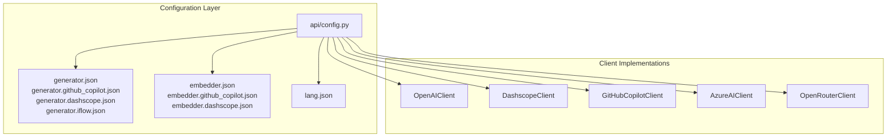
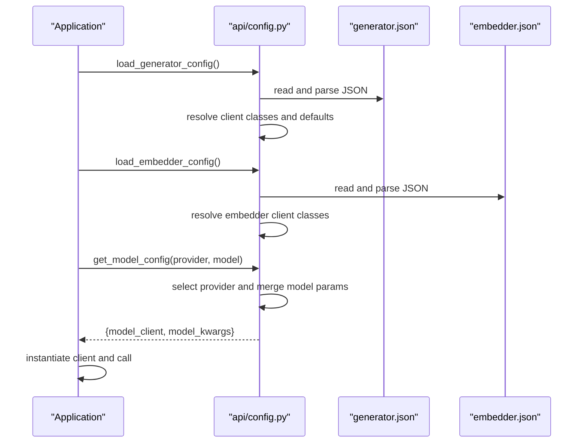
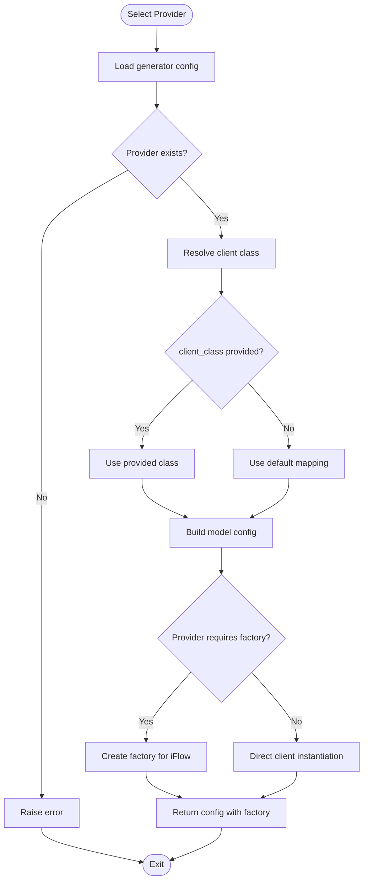
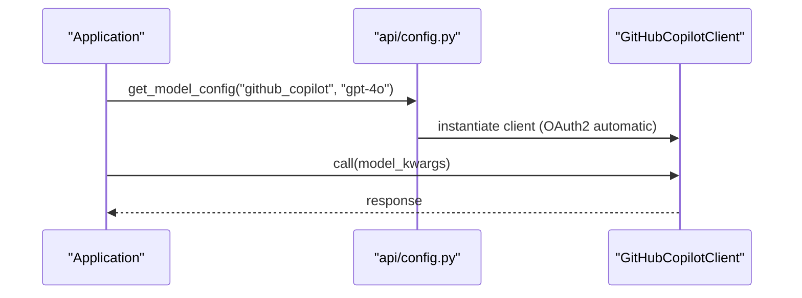
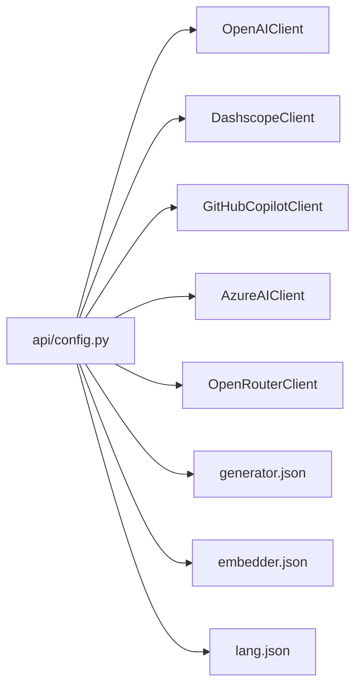

# Provider Configuration

<cite>
**Referenced Files in This Document**
- [api/config.py](file://api/config.py)
- [api/config/generator.json](file://api/config/generator.json)
- [api/config/generator.github_copilot.json](file://api/config/generator.github_copilot.json)
- [api/config/generator.dashscope.json](file://api/config/generator.dashscope.json)
- [api/config/generator.iflow.json](file://api/config/generator.iflow.json)
- [api/config/embedder.json](file://api/config/embedder.json)
- [api/config/embedder.github_copilot.json](file://api/config/embedder.github_copilot.json)
- [api/config/embedder.dashscope.json](file://api/config/embedder.dashscope.json)
- [api/config/lang.json](file://api/config/lang.json)
- [PROVIDER_SETUP_GUIDE.md](file://PROVIDER_SETUP_GUIDE.md)
- [api/openai_client.py](file://api/openai_client.py)
- [api/dashscope_client.py](file://api/dashscope_client.py)
- [api/github_copilot_client.py](file://api/github_copilot_client.py)
- [api/azureai_client.py](file://api/azureai_client.py)
- [api/openrouter_client.py](file://api/openrouter_client.py)
</cite>

## Table of Contents
1. [Introduction](#introduction)
2. [Project Structure](#project-structure)
3. [Core Components](#core-components)
4. [Architecture Overview](#architecture-overview)
5. [Detailed Component Analysis](#detailed-component-analysis)
6. [Dependency Analysis](#dependency-analysis)
7. [Performance Considerations](#performance-considerations)
8. [Troubleshooting Guide](#troubleshooting-guide)
9. [Conclusion](#conclusion)
10. [Appendices](#appendices)

## Introduction
This document explains the centralized provider configuration architecture used by DeepWiki-Open to manage multiple AI model providers. It covers how providers are selected, how client classes are mapped and resolved, and how model configurations are loaded and instantiated dynamically. It also documents the configuration structure for each provider, environment variable integration, and practical examples for setting up and customizing providers. Finally, it provides troubleshooting guidance and best practices for enterprise deployments.

## Project Structure
The provider configuration system centers around:
- Centralized configuration loader and resolver in the configuration module
- Provider-specific client implementations
- JSON configuration files that define providers, default models, and per-model parameters
- Environment variables for credentials and runtime overrides

**Diagram sources**
- [api/config.py](file://api/config.py#L1-L464)
- [api/config/generator.json](file://api/config/generator.json#L1-L101)
- [api/config/generator.github_copilot.json](file://api/config/generator.github_copilot.json#L1-L35)
- [api/config/generator.dashscope.json](file://api/config/generator.dashscope.json#L1-L239)
- [api/config/generator.iflow.json](file://api/config/generator.iflow.json#L1-L45)
- [api/config/embedder.json](file://api/config/embedder.json#L1-L35)
- [api/config/embedder.github_copilot.json](file://api/config/embedder.github_copilot.json#L1-L26)
- [api/config/embedder.dashscope.json](file://api/config/embedder.dashscope.json#L1-L19)
- [api/config/lang.json](file://api/config/lang.json#L1-L16)
- [api/openai_client.py](file://api/openai_client.py#L1-L653)
- [api/dashscope_client.py](file://api/dashscope_client.py#L1-L917)
- [api/github_copilot_client.py](file://api/github_copilot_client.py#L1-L898)
- [api/azureai_client.py](file://api/azureai_client.py#L1-L488)
- [api/openrouter_client.py](file://api/openrouter_client.py#L1-L526)

**Section sources**
- [api/config.py](file://api/config.py#L1-L464)

## Core Components
- Central configuration loader: Loads and merges provider and embedder configurations, resolves client classes, and exposes helpers to select providers and models.
- Provider client classes: Thin wrappers around external APIs (OpenAI-compatible, Dashscope, GitHub Copilot, Azure OpenAI, OpenRouter), exposing a unified call interface.
- Configuration files: Define providers, default models, per-model parameters, and provider-specific settings such as base URLs and environment variables.

Key responsibilities:
- Client class mapping: Maps human-readable client class names to actual classes.
- Dynamic provider instantiation: Resolves provider configuration and constructs appropriate client instances with model-specific parameters.
- Environment integration: Reads environment variables for credentials and base URLs, with support for placeholders in JSON.

**Section sources**
- [api/config.py](file://api/config.py#L60-L181)
- [api/config.py](file://api/config.py#L381-L464)

## Architecture Overview
The configuration architecture follows a layered approach:
- Configuration layer loads JSON files and environment variables, normalizes paths, and merges configurations.
- Provider selection logic chooses a provider by name and returns a configuration object containing the client class and model parameters.
- Client classes encapsulate provider-specific logic, including authentication, base URL handling, and input conversion.

**Diagram sources**
- [api/config.py](file://api/config.py#L104-L181)
- [api/config.py](file://api/config.py#L381-L464)
- [api/config/generator.json](file://api/config/generator.json#L1-L101)
- [api/config/embedder.json](file://api/config/embedder.json#L1-L35)

## Detailed Component Analysis

### Central Configuration Loader
Responsibilities:
- Load configuration files from a configurable directory or default location.
- Replace environment placeholders in configuration values.
- Merge generator and embedder configurations into a central registry.
- Resolve client classes from names to actual classes.
- Provide helpers to detect embedder type and check for specific providers.

Highlights:
- Client class mapping supports multiple providers.
- Environment variables are read and propagated to clients.
- Logging provides visibility into provider detection and configuration resolution.

**Section sources**
- [api/config.py](file://api/config.py#L1-L48)
- [api/config.py](file://api/config.py#L60-L71)
- [api/config.py](file://api/config.py#L73-L102)
- [api/config.py](file://api/config.py#L104-L181)
- [api/config.py](file://api/config.py#L183-L275)

### Provider Selection and Dynamic Instantiation
The provider selection mechanism:
- Loads provider configuration from generator JSON.
- Resolves client class either from explicit client_class or via default mapping.
- Builds a model configuration object with model_client and model_kwargs.
- Special-case handling for providers like iFlow that require factory-style instantiation.

**Diagram sources**
- [api/config.py](file://api/config.py#L127-L181)
- [api/config.py](file://api/config.py#L381-L464)

**Section sources**
- [api/config.py](file://api/config.py#L127-L181)
- [api/config.py](file://api/config.py#L381-L464)

### Provider Configuration Structure
Each provider configuration includes:
- client_class: Name of the client class to use.
- default_model: Default model to use if none is specified.
- supportsCustomModel: Whether custom models are supported.
- models: A map of model names to parameter overrides.
- Provider-specific fields (e.g., base_url, api_key_env for iFlow).

Examples of provider configurations:
- GitHub Copilot: chat and embedding models, zero configuration required.
- DashScope: Qwen models with embedding parameters.
- iFlow: OpenAI-compatible endpoint with base_url and api_key_env.

**Section sources**
- [api/config/generator.json](file://api/config/generator.json#L1-L101)
- [api/config/generator.github_copilot.json](file://api/config/generator.github_copilot.json#L1-L35)
- [api/config/generator.dashscope.json](file://api/config/generator.dashscope.json#L1-L239)
- [api/config/generator.iflow.json](file://api/config/generator.iflow.json#L1-L45)

### Embedder Configuration
Embedder configurations include:
- client_class: Which client to use for embeddings.
- batch_size: Batch size for embedding operations.
- model_kwargs: Model parameters for embeddings.
- retriever and text_splitter: Retrieval and chunking parameters.

**Section sources**
- [api/config/embedder.json](file://api/config/embedder.json#L1-L35)
- [api/config/embedder.github_copilot.json](file://api/config/embedder.github_copilot.json#L1-L26)
- [api/config/embedder.dashscope.json](file://api/config/embedder.dashscope.json#L1-L19)

### Client Class Resolution and Mapping
The configuration module maintains a mapping from client class names to actual classes. It then:
- Applies client_class overrides from provider configs.
- Falls back to default mappings based on provider IDs.

Supported providers and client classes:
- OpenAI, OpenRouter, Azure, DashScope, GitHub Copilot, Google (via OpenAI-compatible client), Ollama, Bedrock.

**Section sources**
- [api/config.py](file://api/config.py#L60-L71)
- [api/config.py](file://api/config.py#L147-L167)

### Environment Variable Integration
The configuration module reads environment variables for credentials and base URLs and propagates them to clients. Placeholders in JSON values are replaced with environment variable values at runtime.

Common environment variables:
- DEEPWIKI_EMBEDDER_TYPE: Selects the embedder type.
- DEEPWIKI_AUTH_MODE, DEEPWIKI_AUTH_CODE: Authentication settings.
- Provider-specific variables (e.g., OPENAI_API_KEY, GOOGLE_API_KEY, OPENROUTER_API_KEY, IFLOW_API_KEY, DASHSCOPE_API_KEY, DASHSCOPE_WORKSPACE_ID, AZURE_OPENAI_*).

**Section sources**
- [api/config.py](file://api/config.py#L19-L47)
- [api/config.py](file://api/config.py#L73-L102)

### Practical Examples

#### GitHub Copilot
- Zero configuration required; OAuth2 handled automatically.
- Chat models: gpt-4o, gpt-4o-mini, o1-preview, o1-mini, claude-3-5-sonnet.
- Embedding model: text-embedding-3-small.
- Embedder batch size: 100.

**Diagram sources**
- [api/config.py](file://api/config.py#L381-L464)
- [api/github_copilot_client.py](file://api/github_copilot_client.py#L1-L898)

**Section sources**
- [api/config/generator.github_copilot.json](file://api/config/generator.github_copilot.json#L1-L35)
- [api/config/embedder.github_copilot.json](file://api/config/embedder.github_copilot.json#L1-L26)
- [PROVIDER_SETUP_GUIDE.md](file://PROVIDER_SETUP_GUIDE.md#L15-L30)

#### DashScope (Alibaba Cloud)
- Requires DASHSCOPE_API_KEY.
- Chat model: qwen-plus; Embedding model: text-embedding-v2.
- Batch size: 25 (limitation).

**Section sources**
- [api/config/generator.dashscope.json](file://api/config/generator.dashscope.json#L1-L239)
- [api/config/embedder.dashscope.json](file://api/config/embedder.dashscope.json#L1-L19)
- [PROVIDER_SETUP_GUIDE.md](file://PROVIDER_SETUP_GUIDE.md#L31-L46)

#### iFlow
- Uses OpenAI-compatible endpoint with base_url and api_key_env.
- Models include Qwen3-Coder variants.

**Section sources**
- [api/config/generator.iflow.json](file://api/config/generator.iflow.json#L1-L45)
- [api/config/generator.json](file://api/config/generator.json#L66-L99)
- [api/openai_client.py](file://api/openai_client.py#L183-L192)

#### OpenAI, OpenRouter, Azure, Google, Ollama, Bedrock
- OpenAI/OpenRouter: Standard OpenAI-compatible clients with environment variables for keys and base URLs.
- Azure: Supports API key or Azure AD token authentication via environment variables.
- Google: Implemented via OpenAI-compatible client; uses environment variables for keys.
- Ollama/Bedrock: Provided in multi-provider configuration; model parameters may differ slightly.

**Section sources**
- [api/config/generator.dashscope.json](file://api/config/generator.dashscope.json#L57-L89)
- [api/config/generator.dashscope.json](file://api/config/generator.dashscope.json#L90-L129)
- [api/config/generator.dashscope.json](file://api/config/generator.dashscope.json#L130-L156)
- [api/config/generator.dashscope.json](file://api/config/generator.dashscope.json#L157-L210)
- [api/azureai_client.py](file://api/azureai_client.py#L141-L172)
- [api/openrouter_client.py](file://api/openrouter_client.py#L27-L37)

## Dependency Analysis
The configuration module depends on:
- Provider client implementations for actual API calls.
- JSON configuration files for provider and embedder definitions.
- Environment variables for credentials and base URLs.

**Diagram sources**
- [api/config.py](file://api/config.py#L10-L17)
- [api/config.py](file://api/config.py#L104-L181)
- [api/config/generator.json](file://api/config/generator.json#L1-L101)
- [api/config/embedder.json](file://api/config/embedder.json#L1-L35)
- [api/config/lang.json](file://api/config/lang.json#L1-L16)

**Section sources**
- [api/config.py](file://api/config.py#L10-L17)
- [api/config.py](file://api/config.py#L104-L181)

## Performance Considerations
- Batch sizing: DashScope limits batch size to 25 for embeddings; adjust accordingly.
- Streaming: Some clients support streaming; ensure appropriate buffering and parsing.
- Embedding caching: DashScope batch embedder supports caching to reduce repeated calls.
- Model parameter tuning: Adjust temperature, top_p, and max_tokens per provider to balance quality and cost.

[No sources needed since this section provides general guidance]

## Troubleshooting Guide
Common issues and resolutions:
- Missing environment variables: Ensure required variables (e.g., DASHSCOPE_API_KEY, AZURE_OPENAI_* for Azure) are set.
- Configuration file not found: Verify the configuration directory and filenames; use the setup script to switch providers.
- Provider not recognized: Confirm provider ID matches supported keys and client class is resolvable.
- iFlow base URL/API key mismatch: Ensure base_url and api_key_env align with provider configuration.
- GitHub Copilot OAuth2 issues: Authentication is automatic; ensure the environment provides required headers.

**Section sources**
- [PROVIDER_SETUP_GUIDE.md](file://PROVIDER_SETUP_GUIDE.md#L124-L140)
- [api/config.py](file://api/config.py#L19-L47)
- [api/openai_client.py](file://api/openai_client.py#L183-L192)

## Conclusion
DeepWiki-Open’s provider configuration system offers a flexible, centralized way to manage multiple AI providers. By separating configuration from implementation, it enables easy switching between providers, robust environment integration, and dynamic client instantiation. Following the examples and best practices outlined here will help you configure providers efficiently and operate reliably in enterprise environments.

[No sources needed since this section summarizes without analyzing specific files]

## Appendices

### Environment Variables Reference
- DEEPWIKI_EMBEDDER_TYPE: Select embedder type (openai, google, ollama, github_copilot).
- DEEPWIKI_AUTH_MODE, DEEPWIKI_AUTH_CODE: Authentication settings.
- OPENAI_API_KEY, OPENROUTER_API_KEY, GOOGLE_API_KEY, IFLOW_API_KEY: Provider API keys.
- DASHSCOPE_API_KEY, DASHSCOPE_WORKSPACE_ID: DashScope credentials.
- AZURE_OPENAI_API_KEY, AZURE_OPENAI_ENDPOINT, AZURE_OPENAI_VERSION: Azure OpenAI credentials.

**Section sources**
- [api/config.py](file://api/config.py#L19-L47)
- [PROVIDER_SETUP_GUIDE.md](file://PROVIDER_SETUP_GUIDE.md#L103-L123)