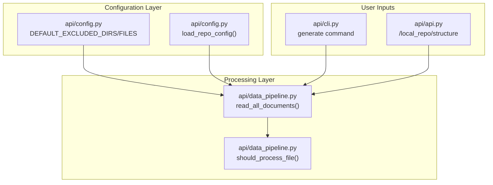
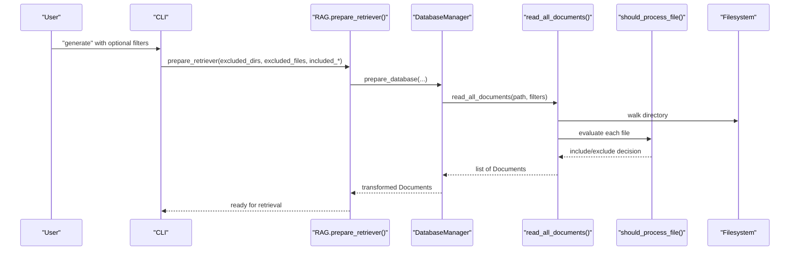
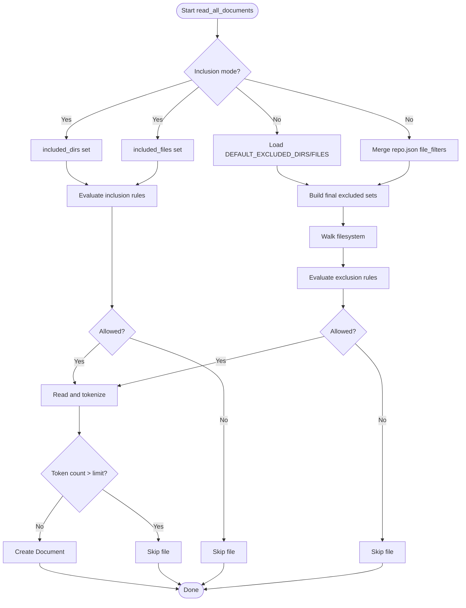
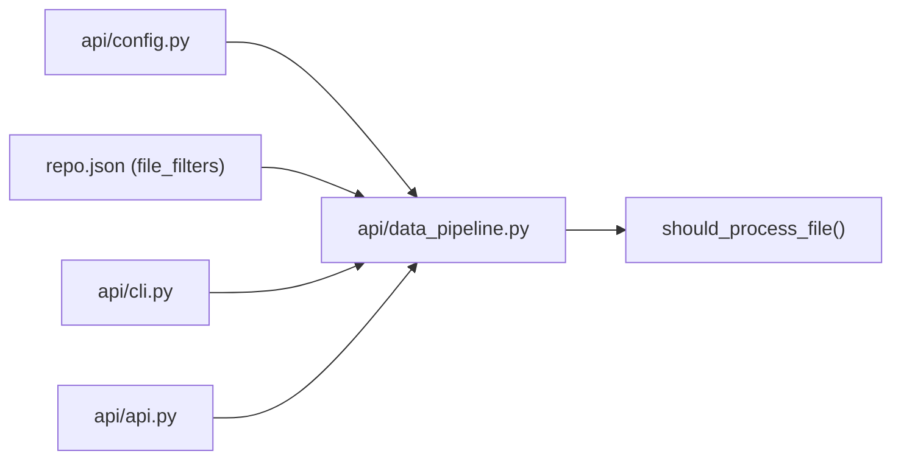

# Repository Filters and Processing Rules

<cite>
**Referenced Files in This Document**
- [api/config.py](file://api/config.py)
- [api/data_pipeline.py](file://api/data_pipeline.py)
- [api/cli.py](file://api/cli.py)
- [api/api.py](file://api/api.py)
- [api/rag.py](file://api/rag.py)
- [.gitignore](file://.gitignore)
- [.dockerignore](file://.dockerignore)
</cite>

## Table of Contents
1. [Introduction](#introduction)
2. [Project Structure](#project-structure)
3. [Core Components](#core-components)
4. [Architecture Overview](#architecture-overview)
5. [Detailed Component Analysis](#detailed-component-analysis)
6. [Dependency Analysis](#dependency-analysis)
7. [Performance Considerations](#performance-considerations)
8. [Troubleshooting Guide](#troubleshooting-guide)
9. [Conclusion](#conclusion)
10. [Appendices](#appendices)

## Introduction
This document explains the repository filter configuration and processing rules used by DeepWiki-Open’s repository processing system. It covers default exclusion rules for directories and files, the repository configuration structure, file filtering mechanisms, and how to implement custom filter rules. It also details filter precedence, rule matching algorithms, and performance optimization strategies for large repositories. Practical examples show how to customize filters via configuration and CLI options, and guidance is provided for troubleshooting and tuning filter configurations across different project types.

## Project Structure
DeepWiki-Open implements repository filtering in several layers:
- Global defaults are defined in the configuration module.
- The data pipeline applies inclusion or exclusion rules during document ingestion.
- CLI and API endpoints expose options to override defaults for specific runs.
- Additional platform-level ignores (.gitignore, .dockerignore) complement repository-level filters.

**Diagram sources**
- [api/config.py](file://api/config.py#L309-L348)
- [api/data_pipeline.py](file://api/data_pipeline.py#L177-L406)
- [api/cli.py](file://api/cli.py#L119-L182)
- [api/api.py](file://api/api.py#L275-L320)

**Section sources**
- [api/config.py](file://api/config.py#L309-L348)
- [api/data_pipeline.py](file://api/data_pipeline.py#L177-L406)
- [.gitignore](file://.gitignore#L1-L70)
- [.dockerignore](file://.dockerignore#L1-L61)

## Core Components
- Default exclusion lists:
  - Directories: virtual environments, package managers, version control, caches, builds, docs, IDE configs, logs, temp.
  - Files: lock files, environment files, VCS metadata, editor configs, minified/binary artifacts, compiled bytecode, and common build outputs.
- Repository configuration:
  - Repository-level filters are loaded from a JSON configuration and merged with defaults.
- Filtering modes:
  - Inclusion mode: only specified directories/files are processed.
  - Exclusion mode: default plus configured exclusions apply; explicit overrides are supported.

Key implementation references:
- Defaults and merging: [api/config.py](file://api/config.py#L309-L348), [api/data_pipeline.py](file://api/data_pipeline.py#L210-L256)
- Rule evaluation: [api/data_pipeline.py](file://api/data_pipeline.py#L259-L326)

**Section sources**
- [api/config.py](file://api/config.py#L309-L348)
- [api/data_pipeline.py](file://api/data_pipeline.py#L210-L256)
- [api/data_pipeline.py](file://api/data_pipeline.py#L259-L326)

## Architecture Overview
The filtering pipeline operates as follows:
- Defaults are loaded from configuration.
- Optional repository-level filters are merged into the default sets.
- CLI/API inputs can override defaults for a single run.
- During traversal, files are evaluated against inclusion or exclusion rules.
- Large files are skipped based on token limits per provider.

**Diagram sources**
- [api/cli.py](file://api/cli.py#L119-L182)
- [api/rag.py](file://api/rag.py#L345-L371)
- [api/data_pipeline.py](file://api/data_pipeline.py#L177-L406)

## Detailed Component Analysis

### Default Exclusions: Directories
Default excluded directories include:
- Virtual environments and package managers: .venv, venv, env, virtualenv, node_modules, bower_components, jspm_packages
- Version control: .git, .svn, .hg, .bzr
- Caches and compiled artifacts: __pycache__, .pytest_cache, .mypy_cache, .ruff_cache, .coverage
- Build and distribution: dist, build, out, target, bin, obj
- Documentation: docs, _docs, site-docs, _site
- IDE configurations: .idea, .vscode, .vs, .eclipse, .settings
- Logs and temporary files: logs, log, tmp, temp

These defaults are defined centrally and applied during document ingestion.

**Section sources**
- [api/config.py](file://api/config.py#L310-L326)

### Default Exclusions: Files
Default excluded files include:
- Lock files: yarn.lock, pnpm-lock.yaml, npm-shrinkwrap.json, poetry.lock, Pipfile.lock, requirements.txt.lock, Cargo.lock, composer.lock, .lock
- Environment and config files: .env, .env.*, *.env, *.cfg, *.ini, .flaskenv, .gitignore, .gitattributes, .gitmodules, .github, .gitlab-ci.yml
- Editor and tool configs: .prettierrc, .eslintrc, .eslintignore, .stylelintrc, .editorconfig, .jshintrc, .pylintrc, .flake8, mypy.ini, pyproject.toml, tsconfig.json, webpack.config.js, babel.config.js, rollup.config.js, jest.config.js, karma.conf.js, vite.config.js, next.config.js
- Minified and binary artifacts: *.min.js, *.min.css, *.bundle.js, *.bundle.css, *.map, *.gz, *.zip, *.tar, *.tgz, *.rar, *.7z, *.iso, *.dmg, *.img, *.msix, *.appx, *.appxbundle, *.xap, *.ipa, *.deb, *.rpm, *.msi, *.exe, *.dll, *.so, *.dylib, *.o, *.obj, *.jar, *.war, *.ear, *.jsm, *.class
- Bytecode and compiled artifacts: *.pyc, *.pyd, *.pyo, __pycache__, *.a, *.lib, *.lo, *.la, *.slo, *.dSYM, *.egg, *.egg-info, *.dist-info, *.eggs, node_modules, bower_components, jspm_packages, lib-cov, coverage, htmlcov, .nyc_output, .tox, dist, build, bld, out, bin, target, packages/*/dist, packages/*/build, .output

These patterns are applied during file selection.

**Section sources**
- [api/config.py](file://api/config.py#L328-L348)

### Repository Configuration Structure
Repository-level filters are loaded from a JSON configuration and merged with defaults:
- Keys: file_filters, repository
- file_filters.excluded_dirs and file_filters.excluded_files are merged into the default sets
- CLI/API can override these per-run via parameters

References:
- Loading: [api/config.py](file://api/config.py#L276-L278), [api/config.py](file://api/config.py#L370-L378)
- Merging defaults and config: [api/data_pipeline.py](file://api/data_pipeline.py#L229-L249)

**Section sources**
- [api/config.py](file://api/config.py#L276-L278)
- [api/config.py](file://api/config.py#L370-L378)
- [api/data_pipeline.py](file://api/data_pipeline.py#L229-L249)

### File Filtering Mechanisms and Rule Matching
Two modes are supported:
- Inclusion mode: only files in included directories or matching included file patterns are processed. If neither is specified for a category, all files in that category are allowed.
- Exclusion mode: default plus configured exclusions apply; explicit overrides can be passed via CLI/API.

Rule evaluation logic:
- For inclusion mode: file must belong to an included directory OR match an included file pattern.
- For exclusion mode: file must not belong to any excluded directory AND must not match any excluded file pattern.

Token-based skip thresholds:
- Code files: up to 10x provider limit
- Docs files: up to provider limit

References:
- Mode selection and merging: [api/data_pipeline.py](file://api/data_pipeline.py#L210-L256)
- Evaluation function: [api/data_pipeline.py](file://api/data_pipeline.py#L259-L326)
- Token limits: [api/data_pipeline.py](file://api/data_pipeline.py#L348-L353)

**Diagram sources**
- [api/data_pipeline.py](file://api/data_pipeline.py#L177-L406)
- [api/data_pipeline.py](file://api/data_pipeline.py#L259-L326)

**Section sources**
- [api/data_pipeline.py](file://api/data_pipeline.py#L177-L406)
- [api/data_pipeline.py](file://api/data_pipeline.py#L259-L326)

### Custom Filter Rule Implementation
There are three primary ways to customize filters:

1) Repository-level configuration (recommended for persistent changes)
- Add excluded_dirs and excluded_files under file_filters in the repository configuration.
- These are merged with defaults automatically.

2) CLI overrides (temporary per-run)
- The generate command accepts excluded_dirs, excluded_files, included_dirs, included_files parameters.
- These override defaults and repository config for that run.

3) Programmatic overrides (library usage)
- RAG.prepare_retriever and DatabaseManager.prepare_database accept the same parameters.
- Useful when integrating DeepWiki-Open programmatically.

References:
- CLI parameters: [api/cli.py](file://api/cli.py#L119-L182)
- RAG parameters: [api/rag.py](file://api/rag.py#L345-L371)
- Data pipeline parameters: [api/data_pipeline.py](file://api/data_pipeline.py#L177-L196)

**Section sources**
- [api/cli.py](file://api/cli.py#L119-L182)
- [api/rag.py](file://api/rag.py#L345-L371)
- [api/data_pipeline.py](file://api/data_pipeline.py#L177-L196)

### Practical Examples

- Add custom exclusions via repository configuration:
  - Extend file_filters.excluded_dirs with additional paths (e.g., test artifacts, legacy folders).
  - Extend file_filters.excluded_files with project-specific lock files or config patterns.

- Enable inclusion mode for focused processing:
  - Provide included_dirs with specific subfolders (e.g., src/, docs/) and/or included_files with targeted patterns (e.g., *.py, *.md).
  - This mode bypasses default exclusions for the specified categories.

- CLI customization:
  - Use --excluded-dirs and --excluded-files to quickly adjust filters for a single run.
  - Combine with --included-dirs/--included-files for fine-grained control.

- API endpoint behavior:
  - The local repository structure endpoint excludes hidden directories and common noise files (e.g., __pycache__, node_modules, .venv, dotfiles, init files, OS-specific files).

References:
- Inclusion/exclusion logic: [api/data_pipeline.py](file://api/data_pipeline.py#L210-L326)
- API endpoint filtering: [api/api.py](file://api/api.py#L295-L320)
- CLI filtering: [api/cli.py](file://api/cli.py#L59-L82)

**Section sources**
- [api/data_pipeline.py](file://api/data_pipeline.py#L210-L326)
- [api/api.py](file://api/api.py#L295-L320)
- [api/cli.py](file://api/cli.py#L59-L82)

## Dependency Analysis
The filtering system depends on:
- Centralized defaults in the configuration module.
- Repository configuration merge logic.
- Data pipeline traversal and evaluation.
- CLI/API parameter propagation.

**Diagram sources**
- [api/config.py](file://api/config.py#L309-L348)
- [api/data_pipeline.py](file://api/data_pipeline.py#L210-L256)
- [api/cli.py](file://api/cli.py#L119-L182)
- [api/api.py](file://api/api.py#L295-L320)

**Section sources**
- [api/config.py](file://api/config.py#L309-L348)
- [api/data_pipeline.py](file://api/data_pipeline.py#L210-L256)
- [api/cli.py](file://api/cli.py#L119-L182)
- [api/api.py](file://api/api.py#L295-L320)

## Performance Considerations
- Prefer exclusion mode with minimal overrides for large repositories to reduce overhead.
- Use inclusion mode when targeting specific subfolders or file types to cut traversal costs.
- Leverage token-aware skipping to avoid heavy files that exceed provider limits.
- Avoid overly broad patterns that cause excessive filesystem scanning.
- Consider pre-filtering via repository configuration to minimize downstream processing.

[No sources needed since this section provides general guidance]

## Troubleshooting Guide
Common issues and resolutions:
- Unexpected files included or excluded:
  - Verify repository configuration merges with defaults correctly.
  - Confirm CLI/API overrides are passed as intended.
  - Check whether inclusion mode is unintentionally enabled.

- Hidden directories and noise files appearing:
  - The local repository structure endpoint intentionally excludes hidden directories and common noise files. If you are using a different traversal path, ensure the same filtering logic is applied.

- Large files causing skips:
  - Review token limits and consider adjusting provider settings or splitting content.

- Platform-level ignores interfering:
  - Compare .gitignore and .dockerignore patterns with your repository configuration to avoid duplication or conflicts.

References:
- Local structure filtering: [api/api.py](file://api/api.py#L295-L320)
- Data pipeline filtering and limits: [api/data_pipeline.py](file://api/data_pipeline.py#L348-L353)

**Section sources**
- [api/api.py](file://api/api.py#L295-L320)
- [api/data_pipeline.py](file://api/data_pipeline.py#L348-L353)

## Conclusion
DeepWiki-Open’s repository filtering system combines centralized defaults, repository-level configuration, and runtime overrides to provide flexible and efficient control over which files are ingested and processed. By understanding inclusion/exclusion modes, rule precedence, and performance characteristics, users can tailor filters to their project types and scale effectively.

[No sources needed since this section summarizes without analyzing specific files]

## Appendices

### Appendix A: Default Excluded Directories Reference
- Virtual environments and package managers: .venv, venv, env, virtualenv, node_modules, bower_components, jspm_packages
- Version control: .git, .svn, .hg, .bzr
- Caches and compiled artifacts: __pycache__, .pytest_cache, .mypy_cache, .ruff_cache, .coverage
- Build and distribution: dist, build, out, target, bin, obj
- Documentation: docs, _docs, site-docs, _site
- IDE configurations: .idea, .vscode, .vs, .eclipse, .settings
- Logs and temporary files: logs, log, tmp, temp

**Section sources**
- [api/config.py](file://api/config.py#L310-L326)

### Appendix B: Default Excluded Files Reference
- Lock files: yarn.lock, pnpm-lock.yaml, npm-shrinkwrap.json, poetry.lock, Pipfile.lock, requirements.txt.lock, Cargo.lock, composer.lock, .lock
- Environment and config files: .env, .env.*, *.env, *.cfg, *.ini, .flaskenv, .gitignore, .gitattributes, .gitmodules, .github, .gitlab-ci.yml, .prettierrc, .eslintrc, .eslintignore, .stylelintrc, .editorconfig, .jshintrc, .pylintrc, .flake8, mypy.ini, pyproject.toml, tsconfig.json, webpack.config.js, babel.config.js, rollup.config.js, jest.config.js, karma.conf.js, vite.config.js, next.config.js
- Minified and binary artifacts: *.min.js, *.min.css, *.bundle.js, *.bundle.css, *.map, *.gz, *.zip, *.tar, *.tgz, *.rar, *.7z, *.iso, *.dmg, *.img, *.msix, *.appx, *.appxbundle, *.xap, *.ipa, *.deb, *.rpm, *.msi, *.exe, *.dll, *.so, *.dylib, *.o, *.obj, *.jar, *.war, *.ear, *.jsm, *.class
- Bytecode and compiled artifacts: *.pyc, *.pyd, *.pyo, __pycache__, *.a, *.lib, *.lo, *.la, *.slo, *.dSYM, *.egg, *.egg-info, *.dist-info, *.eggs, node_modules, bower_components, jspm_packages, lib-cov, coverage, htmlcov, .nyc_output, .tox, dist, build, bld, out, bin, target, packages/*/dist, packages/*/build, .output

**Section sources**
- [api/config.py](file://api/config.py#L328-L348)