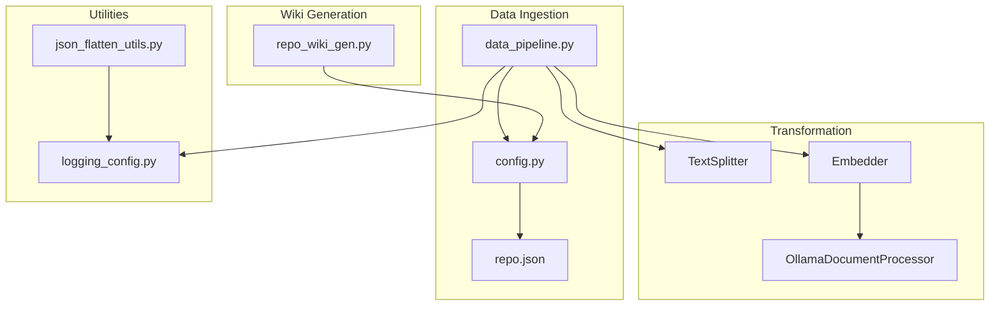
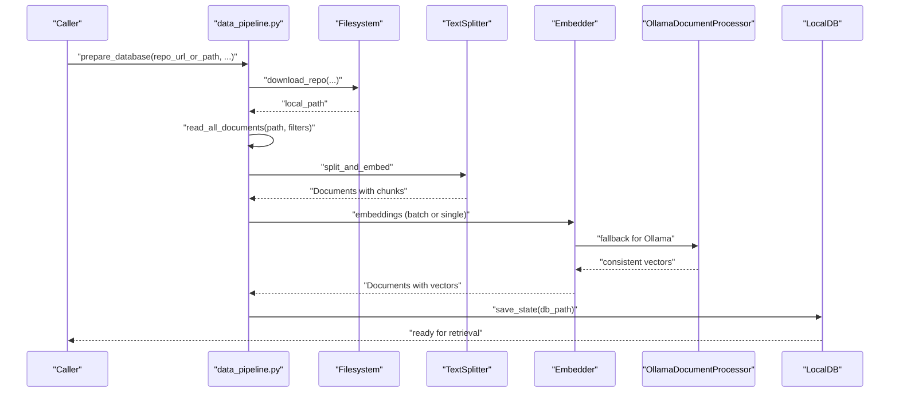
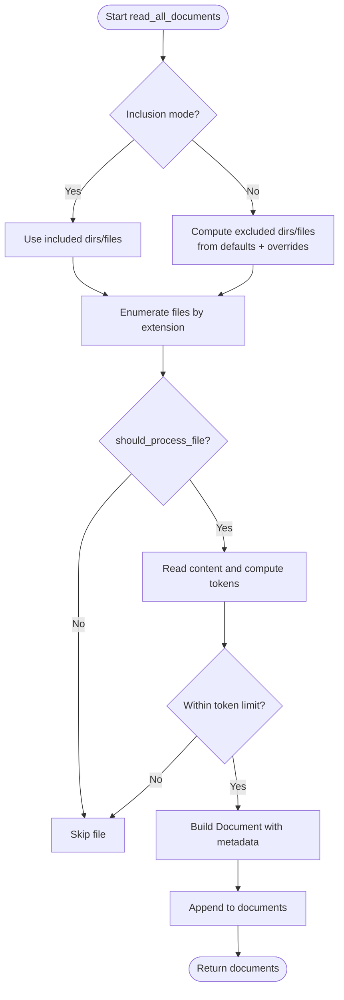
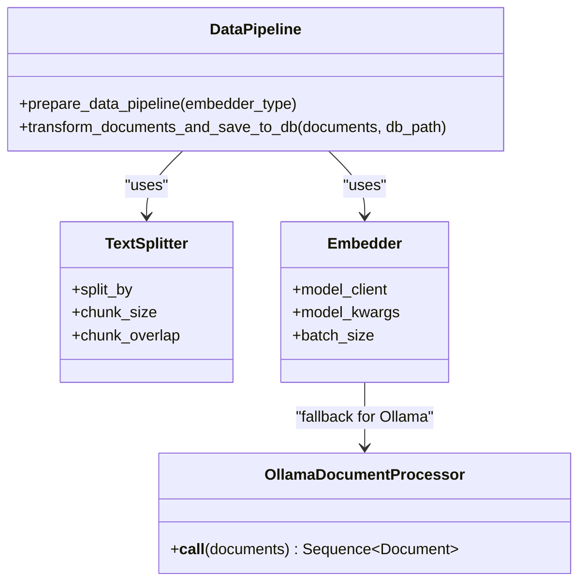
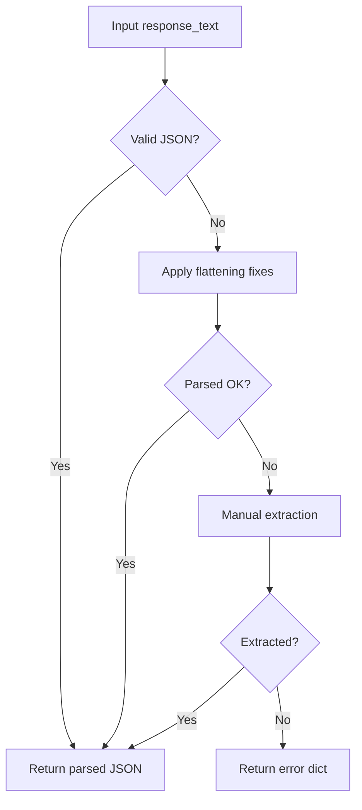
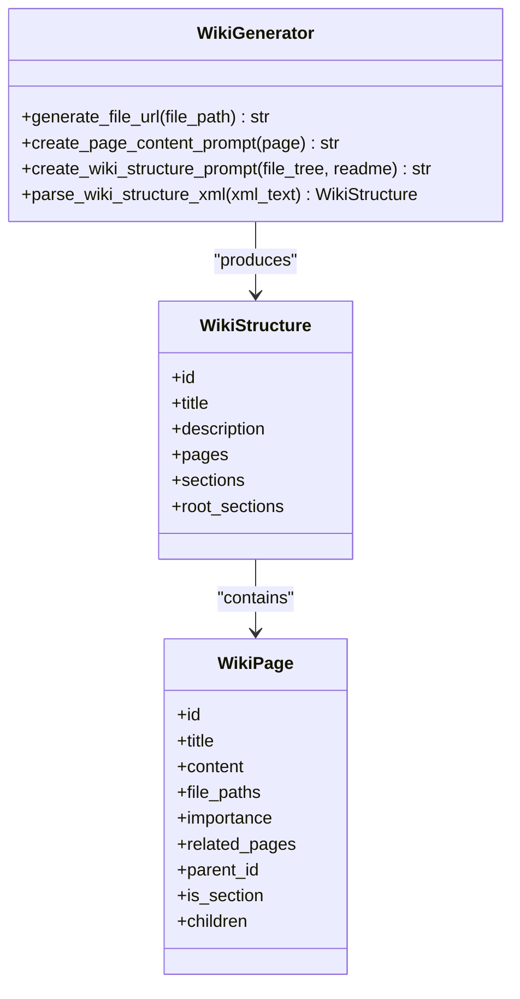
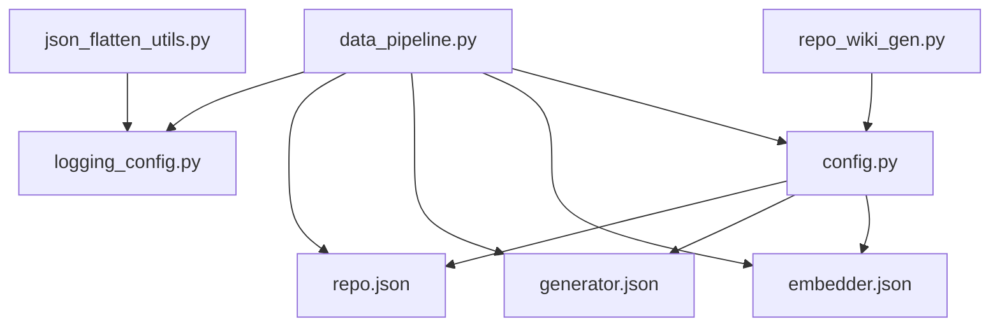

# Data Processing and Utilities

<cite>
**Referenced Files in This Document**
- [data_pipeline.py](file://api/data_pipeline.py)
- [json_flatten_utils.py](file://api/json_flatten_utils.py)
- [repo_wiki_gen.py](file://api/repo_wiki_gen.py)
- [config.py](file://api/config.py)
- [embedder.py](file://api/tools/embedder.py)
- [ollama_patch.py](file://api/ollama_patch.py)
- [logging_config.py](file://api/logging_config.py)
- [repo.json](file://api/config/repo.json)
- [embedder.json](file://api/config/embedder.json)
- [generator.json](file://api/config/generator.json)
- [json_flattening_demo.py](file://examples/json_flattening_demo.py)
- [JSON_FLATTENING_GUIDE.md](file://docs/JSON_FLATTENING_GUIDE.md)
- [test_json_flatten.py](file://tests/unit/test_json_flatten.py)
- [test_api.py](file://tests/api/test_api.py)
</cite>

## Table of Contents
1. [Introduction](#introduction)
2. [Project Structure](#project-structure)
3. [Core Components](#core-components)
4. [Architecture Overview](#architecture-overview)
5. [Detailed Component Analysis](#detailed-component-analysis)
6. [Dependency Analysis](#dependency-analysis)
7. [Performance Considerations](#performance-considerations)
8. [Troubleshooting Guide](#troubleshooting-guide)
9. [Conclusion](#conclusion)
10. [Appendices](#appendices)

## Introduction
This document explains DeepWiki-Open’s data processing and utility systems with a focus on repository data extraction, file filtering and exclusion rules, data transformation pipelines, JSON flattening utilities, and the end-to-end repository processing pipeline. It also covers performance optimization, memory management for large repositories, error handling, and guidelines for customizing processing rules and extending the pipeline for specialized use cases.

## Project Structure
The data processing system spans several modules:
- Repository extraction and ingestion: cloning, reading, and preparing documents
- Filtering and exclusion: inclusion/exclusion modes with configurable defaults
- Transformation pipeline: splitting and embedding
- JSON flattening: robust parsing and repair for GitHub Copilot responses
- Wiki generation: orchestration of repository structure and page content
- Configuration and logging: environment-driven settings and logging policies

**Diagram sources**
- [data_pipeline.py](file://api/data_pipeline.py#L103-L176)
- [config.py](file://api/config.py#L276-L379)
- [repo.json](file://api/config/repo.json#L1-L129)
- [json_flatten_utils.py](file://api/json_flatten_utils.py#L16-L64)
- [logging_config.py](file://api/logging_config.py#L12-L86)
- [repo_wiki_gen.py](file://api/repo_wiki_gen.py#L63-L123)

**Section sources**
- [data_pipeline.py](file://api/data_pipeline.py#L103-L176)
- [config.py](file://api/config.py#L276-L379)
- [repo.json](file://api/config/repo.json#L1-L129)
- [json_flatten_utils.py](file://api/json_flatten_utils.py#L16-L64)
- [logging_config.py](file://api/logging_config.py#L12-L86)
- [repo_wiki_gen.py](file://api/repo_wiki_gen.py#L63-L123)

## Core Components
- Repository downloader and reader: clones repositories, enumerates files, applies inclusion/exclusion rules, and builds Document objects with metadata.
- File filtering engine: supports inclusion mode (only specified dirs/files) and exclusion mode (default plus overrides).
- Token counting and provider-aware limits: estimates token counts and enforces provider-specific limits.
- Transformation pipeline: splits text and generates embeddings via a provider-specific embedder.
- Ollama-specific processor: single-document processing adapter for Ollama when batch is unsupported.
- JSON flattening utilities: robust parsing and repair for malformed GitHub Copilot responses, with streaming chunk repair and validation.
- Wiki generation orchestrator: creates structured wiki pages and sections from repository content and README.

**Section sources**
- [data_pipeline.py](file://api/data_pipeline.py#L177-L406)
- [data_pipeline.py](file://api/data_pipeline.py#L408-L476)
- [ollama_patch.py](file://api/ollama_patch.py#L62-L105)
- [json_flatten_utils.py](file://api/json_flatten_utils.py#L16-L64)
- [repo_wiki_gen.py](file://api/repo_wiki_gen.py#L63-L123)

## Architecture Overview
The repository processing pipeline transforms raw code and documentation into an embeddable, normalized dataset and optionally produces a structured wiki.

**Diagram sources**
- [data_pipeline.py](file://api/data_pipeline.py#L747-L777)
- [data_pipeline.py](file://api/data_pipeline.py#L103-L176)
- [data_pipeline.py](file://api/data_pipeline.py#L177-L406)
- [data_pipeline.py](file://api/data_pipeline.py#L408-L476)
- [embedder.py](file://api/tools/embedder.py#L6-L59)
- [ollama_patch.py](file://api/ollama_patch.py#L62-L105)

## Detailed Component Analysis

### Repository Extraction and File Filtering
- Download and clone: supports GitHub, GitLab, Bitbucket with token injection and shallow clone for speed.
- Read documents: enumerates code and documentation files, computes token counts, and applies inclusion/exclusion rules.
- Inclusion vs exclusion:
  - Inclusion mode: only files in specified directories or matching specified patterns are processed.
  - Exclusion mode: default excludes plus any configured overrides; supports additional explicit exclusions.
- Implementation highlights:
  - Token-aware skipping for large files.
  - Metadata includes file path, type, code vs documentation, implementation classification, and token count.

**Diagram sources**
- [data_pipeline.py](file://api/data_pipeline.py#L177-L406)

**Section sources**
- [data_pipeline.py](file://api/data_pipeline.py#L103-L176)
- [data_pipeline.py](file://api/data_pipeline.py#L177-L406)
- [config.py](file://api/config.py#L309-L348)
- [repo.json](file://api/config/repo.json#L2-L124)

### Data Transformation Pipeline
- Text splitting: configured via text_splitter settings.
- Embedding: provider-aware selection and batching; Ollama uses single-document processing with consistency checks.
- Persistence: documents transformed and saved to a local database for downstream retrieval.

**Diagram sources**
- [data_pipeline.py](file://api/data_pipeline.py#L408-L476)
- [embedder.py](file://api/tools/embedder.py#L6-L59)
- [ollama_patch.py](file://api/ollama_patch.py#L62-L105)
- [embedder.json](file://api/config/embedder.json#L30-L34)

**Section sources**
- [data_pipeline.py](file://api/data_pipeline.py#L408-L476)
- [embedder.py](file://api/tools/embedder.py#L6-L59)
- [embedder.json](file://api/config/embedder.json#L30-L34)
- [ollama_patch.py](file://api/ollama_patch.py#L62-L105)

### JSON Flattening Utilities
- Purpose: robustly parse malformed GitHub Copilot responses by removing markdown wrappers, trailing commas, streaming artifacts, normalizing quotes, and extracting key-value pairs when needed.
- Functions:
  - flatten_github_copilot_json: top-level parser with fallbacks.
  - _apply_flattening_fixes: regex-based cleaning.
  - _extract_json_manually: last-resort extraction.
  - validate_github_copilot_response: structural validation.
  - repair_github_copilot_streaming_chunk: repair streaming chunks.
- Practical examples and usage are demonstrated in the example script and documented in the guide.

**Diagram sources**
- [json_flatten_utils.py](file://api/json_flatten_utils.py#L16-L64)
- [json_flatten_utils.py](file://api/json_flatten_utils.py#L65-L131)
- [json_flatten_utils.py](file://api/json_flatten_utils.py#L133-L222)

**Section sources**
- [json_flatten_utils.py](file://api/json_flatten_utils.py#L16-L64)
- [json_flatten_utils.py](file://api/json_flatten_utils.py#L65-L131)
- [json_flatten_utils.py](file://api/json_flatten_utils.py#L133-L222)
- [json_flattening_demo.py](file://examples/json_flattening_demo.py#L29-L71)
- [JSON_FLATTENING_GUIDE.md](file://docs/JSON_FLATTENING_GUIDE.md#L1-L319)
- [test_json_flatten.py](file://tests/unit/test_json_flatten.py#L14-L19)

### Repository Wiki Generation Orchestration
- Generates structured wiki content from repository files and README.
- Supports comprehensive and concise modes, with XML-based structure definition and validation.
- Produces page content prompts with citations and Mermaid diagrams.

**Diagram sources**
- [repo_wiki_gen.py](file://api/repo_wiki_gen.py#L63-L123)
- [repo_wiki_gen.py](file://api/repo_wiki_gen.py#L42-L50)
- [repo_wiki_gen.py](file://api/repo_wiki_gen.py#L28-L38)

**Section sources**
- [repo_wiki_gen.py](file://api/repo_wiki_gen.py#L63-L123)
- [repo_wiki_gen.py](file://api/repo_wiki_gen.py#L189-L294)
- [repo_wiki_gen.py](file://api/repo_wiki_gen.py#L419-L536)

## Dependency Analysis
- Configuration-driven behavior:
  - Embedder selection and batching are driven by embedder.json and auto-detected via config.py.
  - File filters are loaded from repo.json and combined with defaults from config.py.
  - Generator/provider settings are loaded from generator.json.
- Logging policy:
  - Centralized logging configuration with rotation and environment controls.
- External integrations:
  - Git subprocess for cloning.
  - HTTP clients for GitHub/GitLab/Bitbucket APIs.
  - Adalflow components for splitting and embedding.

**Diagram sources**
- [config.py](file://api/config.py#L104-L181)
- [embedder.json](file://api/config/embedder.json#L1-L35)
- [generator.json](file://api/config/generator.json#L1-L101)
- [repo.json](file://api/config/repo.json#L1-L129)
- [data_pipeline.py](file://api/data_pipeline.py#L1-L25)
- [logging_config.py](file://api/logging_config.py#L12-L86)
- [json_flatten_utils.py](file://api/json_flatten_utils.py#L1-L15)
- [repo_wiki_gen.py](file://api/repo_wiki_gen.py#L1-L16)

**Section sources**
- [config.py](file://api/config.py#L104-L181)
- [embedder.json](file://api/config/embedder.json#L1-L35)
- [generator.json](file://api/config/generator.json#L1-L101)
- [repo.json](file://api/config/repo.json#L1-L129)
- [data_pipeline.py](file://api/data_pipeline.py#L1-L25)
- [logging_config.py](file://api/logging_config.py#L12-L86)
- [json_flatten_utils.py](file://api/json_flatten_utils.py#L1-L15)
- [repo_wiki_gen.py](file://api/repo_wiki_gen.py#L1-L16)

## Performance Considerations
- Shallow clone and single-branch clone reduce download size and time.
- Token-aware skipping prevents oversized files from entering the pipeline.
- Provider-specific token limits and batching optimize throughput while respecting provider quotas.
- Ollama fallback uses single-document processing with embedding size consistency checks to avoid vector mismatches.
- Logging rotation prevents disk bloat during large-scale processing.

Practical tips:
- Prefer inclusion mode for targeted processing to minimize IO.
- Tune chunk size and overlap in text_splitter for retrieval quality and cost.
- Monitor embedding batch sizes and adjust for provider constraints.

**Section sources**
- [data_pipeline.py](file://api/data_pipeline.py#L155-L163)
- [data_pipeline.py](file://api/data_pipeline.py#L348-L353)
- [embedder.json](file://api/config/embedder.json#L30-L34)
- [ollama_patch.py](file://api/ollama_patch.py#L71-L105)
- [logging_config.py](file://api/logging_config.py#L47-L59)

## Troubleshooting Guide
- Cloning failures:
  - Validate Git installation and network connectivity.
  - Sanitized error messages avoid leaking tokens.
- Large files:
  - Token count warnings indicate oversized content; adjust limits or exclude files.
- Provider errors:
  - Use provider-specific token limits and validate batch sizes.
- JSON parsing issues:
  - Utilize JSON flattening utilities; enable debug logging to inspect transformations.
- Wiki generation:
  - XML parsing cleans control characters and markdown wrappers; ensure valid XML output.

Common checks:
- Verify environment variables for API keys and logging.
- Confirm configuration files are present and readable.
- Use the example scripts and unit tests to validate behavior.

**Section sources**
- [data_pipeline.py](file://api/data_pipeline.py#L165-L172)
- [data_pipeline.py](file://api/data_pipeline.py#L348-L353)
- [json_flatten_utils.py](file://api/json_flatten_utils.py#L47-L63)
- [repo_wiki_gen.py](file://api/repo_wiki_gen.py#L420-L436)
- [test_json_flatten.py](file://tests/unit/test_json_flatten.py#L171-L191)

## Conclusion
DeepWiki-Open’s data processing stack combines robust repository ingestion, flexible file filtering, efficient transformation, and resilient JSON handling to prepare repositories for AI-powered analysis and wiki generation. With environment-driven configuration, provider-aware limits, and careful error handling, it scales to large repositories while maintaining reliability and performance.

## Appendices

### A. Repository Processing Pipeline Steps
- Prepare database:
  - Create or reuse repository directory.
  - Clone repository (or use existing local path).
  - Read documents with inclusion/exclusion filters.
  - Transform with text splitting and embeddings.
  - Persist to local database.

**Section sources**
- [data_pipeline.py](file://api/data_pipeline.py#L747-L777)
- [data_pipeline.py](file://api/data_pipeline.py#L103-L176)
- [data_pipeline.py](file://api/data_pipeline.py#L177-L406)
- [data_pipeline.py](file://api/data_pipeline.py#L408-L476)

### B. Customizing Data Processing Rules
- File filters:
  - Modify repo.json to add/remove excluded directories and files.
  - Override defaults via config.py’s default lists.
- Inclusion/exclusion:
  - Pass included_dirs/included_files or excluded_dirs/excluded_files to document reading functions.
- Provider configuration:
  - Adjust embedder.json and generator.json for models, batching, and parameters.

**Section sources**
- [repo.json](file://api/config/repo.json#L2-L124)
- [config.py](file://api/config.py#L309-L348)
- [embedder.json](file://api/config/embedder.json#L1-L35)
- [generator.json](file://api/config/generator.json#L1-L101)

### C. Implementing New File Type Handlers
- Extend file enumeration:
  - Add new extensions to the code or documentation extension lists in the document reader.
- Metadata enrichment:
  - Extend Document metadata fields to capture new attributes.
- Token limits:
  - Adjust provider-specific limits if new file types are unusually large.

**Section sources**
- [data_pipeline.py](file://api/data_pipeline.py#L206-L208)
- [data_pipeline.py](file://api/data_pipeline.py#L329-L370)
- [data_pipeline.py](file://api/data_pipeline.py#L371-L403)

### D. Extending the Pipeline for Specialized Use Cases
- Streaming endpoints:
  - Use the API test script to validate streaming behavior.
- Wiki customization:
  - Adjust wiki structure prompts and parsing logic for domain-specific needs.
- Logging:
  - Tune log levels and rotation settings for production deployments.

**Section sources**
- [test_api.py](file://tests/api/test_api.py#L5-L71)
- [repo_wiki_gen.py](file://api/repo_wiki_gen.py#L295-L417)
- [logging_config.py](file://api/logging_config.py#L31-L59)