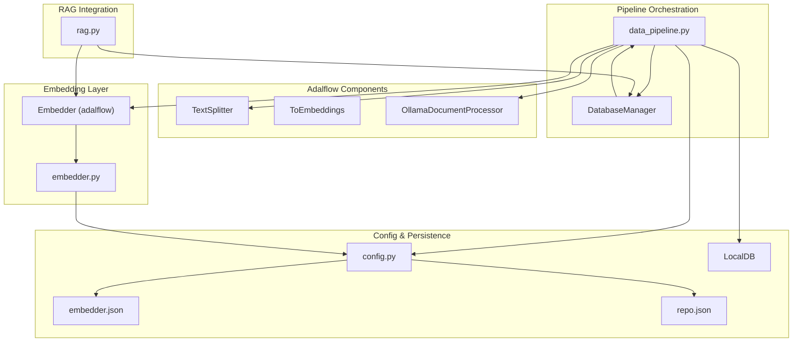
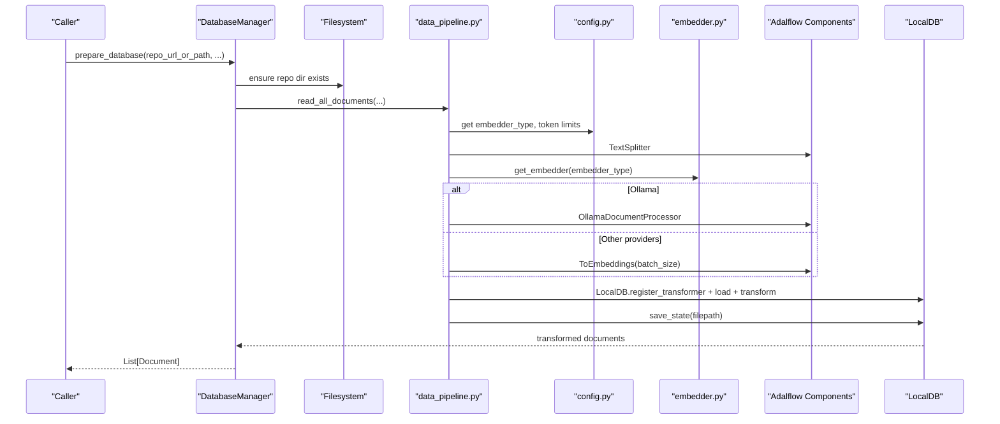
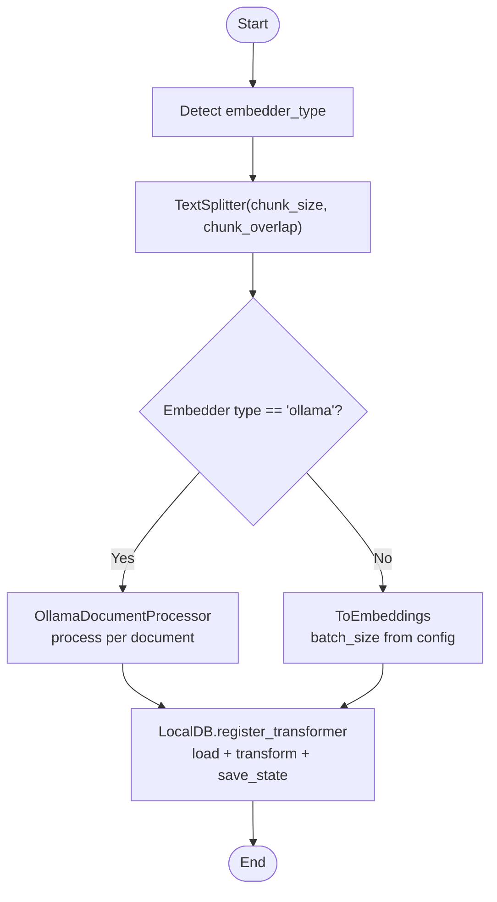
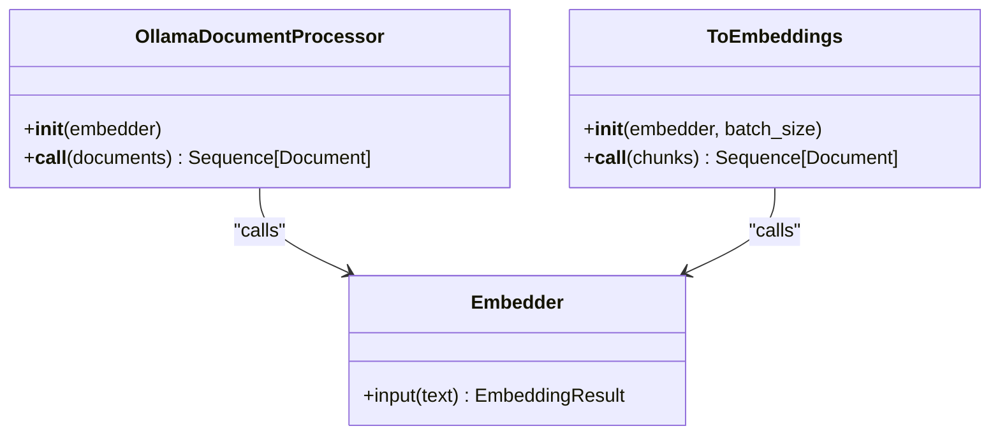
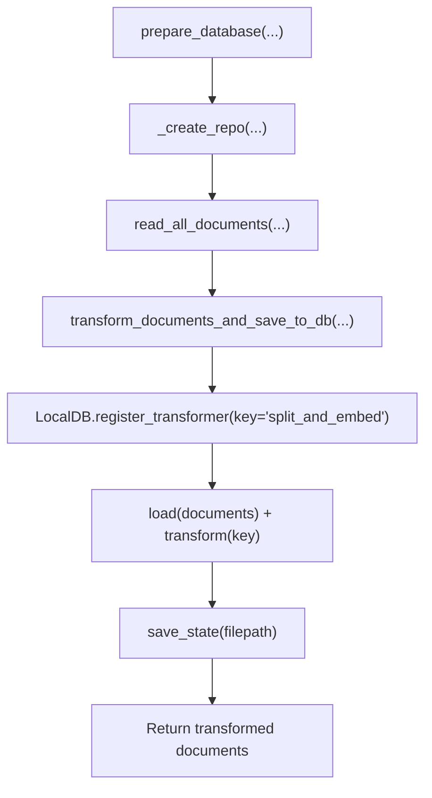
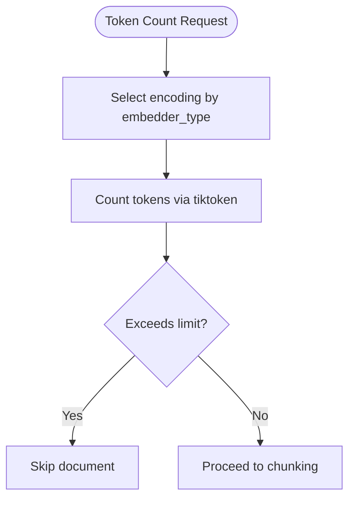
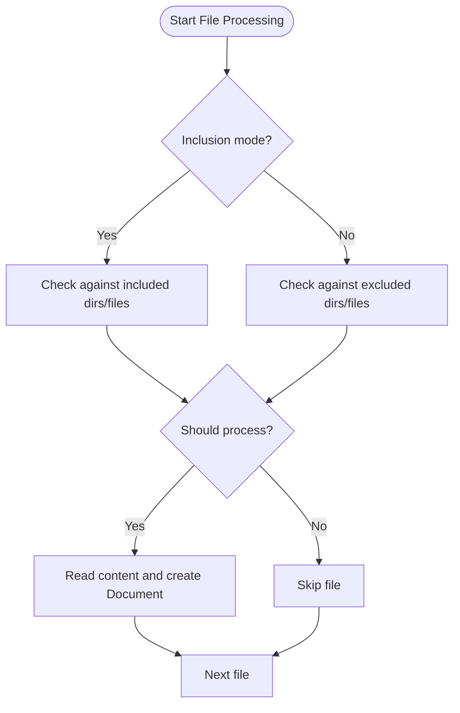
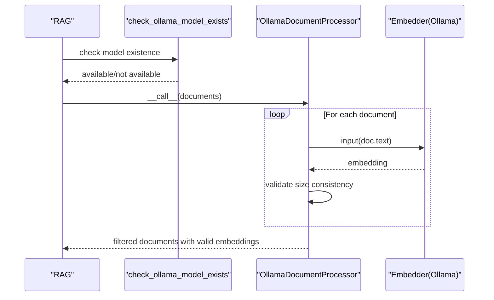
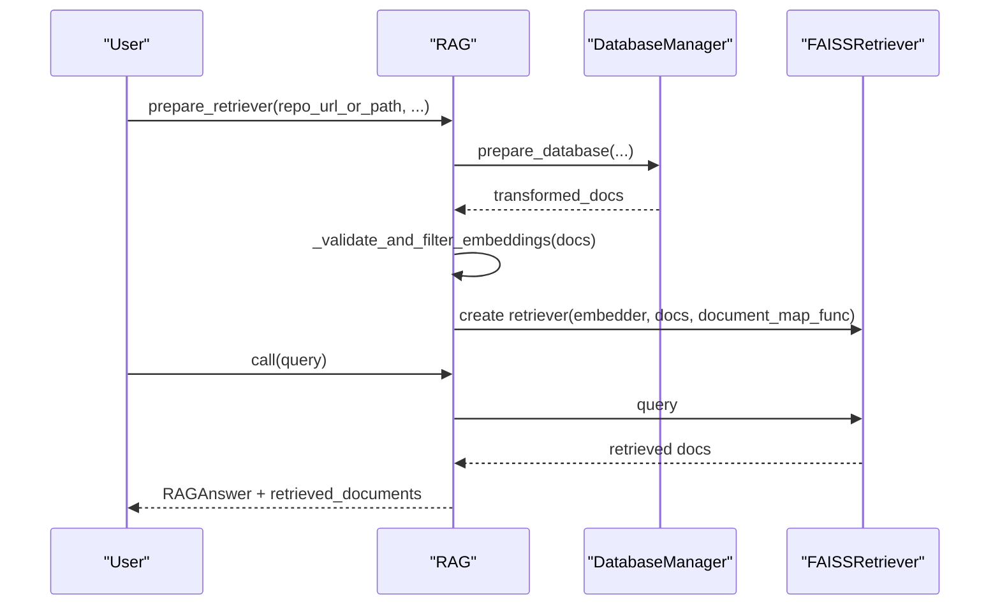
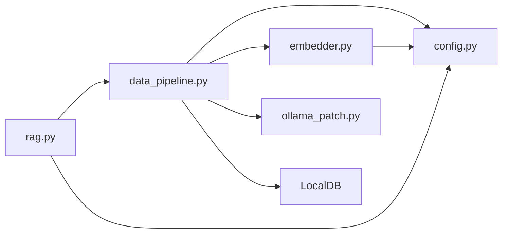

# Data Transformation Pipeline

<cite>
**Referenced Files in This Document**
- [data_pipeline.py](file://api/data_pipeline.py)
- [embedder.py](file://api/tools/embedder.py)
- [config.py](file://api/config.py)
- [ollama_patch.py](file://api/ollama_patch.py)
- [rag.py](file://api/rag.py)
- [embedder.json](file://api/config/embedder.json)
- [repo.json](file://api/config/repo.json)
</cite>

## Table of Contents
1. [Introduction](#introduction)
2. [Project Structure](#project-structure)
3. [Core Components](#core-components)
4. [Architecture Overview](#architecture-overview)
5. [Detailed Component Analysis](#detailed-component-analysis)
6. [Dependency Analysis](#dependency-analysis)
7. [Performance Considerations](#performance-considerations)
8. [Troubleshooting Guide](#troubleshooting-guide)
9. [Conclusion](#conclusion)
10. [Appendices](#appendices)

## Introduction
This document describes the data transformation pipeline used to convert repository documents into chunked text and embeddings, and persist them for downstream Retrieval-Augmented Generation (RAG) workflows. The pipeline leverages Adalflow components including TextSplitter and ToEmbeddings, with special handling for Ollama-based embeddings. It integrates with LocalDB for stateful persistence, supports provider-specific configurations, and provides utilities for repository cloning, file filtering, and token counting.

## Project Structure
The transformation pipeline spans several modules:
- Data ingestion and orchestration: [data_pipeline.py](file://api/data_pipeline.py)
- Embedder factory and provider selection: [embedder.py](file://api/tools/embedder.py)
- Configuration loading and provider detection: [config.py](file://api/config.py)
- Ollama-specific document processing: [ollama_patch.py](file://api/ollama_patch.py)
- RAG integration and retriever setup: [rag.py](file://api/rag.py)
- Configuration files for embedders, retrievers, and repository filters: [embedder.json](file://api/config/embedder.json), [repo.json](file://api/config/repo.json)

**Diagram sources**
- [data_pipeline.py](file://api/data_pipeline.py#L408-L476)
- [embedder.py](file://api/tools/embedder.py#L6-L59)
- [config.py](file://api/config.py#L170-L275)
- [ollama_patch.py](file://api/ollama_patch.py#L62-L105)
- [rag.py](file://api/rag.py#L345-L415)
- [embedder.json](file://api/config/embedder.json#L1-L35)
- [repo.json](file://api/config/repo.json#L1-L129)

**Section sources**
- [data_pipeline.py](file://api/data_pipeline.py#L1-L917)
- [embedder.py](file://api/tools/embedder.py#L1-L59)
- [config.py](file://api/config.py#L1-L464)
- [ollama_patch.py](file://api/ollama_patch.py#L1-L105)
- [rag.py](file://api/rag.py#L1-L446)
- [embedder.json](file://api/config/embedder.json#L1-L35)
- [repo.json](file://api/config/repo.json#L1-L129)

## Core Components
- TextSplitter: Splits documents into chunks according to configuration.
- ToEmbeddings: Applies batched embeddings for providers that support batching.
- OllamaDocumentProcessor: Processes documents individually for Ollama, which lacks native batch embedding support.
- DatabaseManager: Orchestrates repository preparation, document reading, transformation, and persistence.
- LocalDB: Stores transformed documents and persists pipeline state.
- Embedder factory: Selects and configures the embedder based on provider type and configuration.
- Provider configuration: Defines batch sizes, model parameters, and tokenizer/token limits.

Key responsibilities:
- Token counting and provider-aware token limits
- File inclusion/exclusion filtering
- Sequential chaining of TextSplitter followed by embedding transformer
- Provider-specific optimization (batch size, single-string queries for Ollama)
- Persistence via LocalDB with state save/load

**Section sources**
- [data_pipeline.py](file://api/data_pipeline.py#L25-L60)
- [data_pipeline.py](file://api/data_pipeline.py#L177-L406)
- [data_pipeline.py](file://api/data_pipeline.py#L408-L476)
- [embedder.py](file://api/tools/embedder.py#L6-L59)
- [config.py](file://api/config.py#L170-L275)
- [ollama_patch.py](file://api/ollama_patch.py#L62-L105)

## Architecture Overview
The pipeline follows a sequential processing architecture:
1. Repository preparation: clone/download and set up storage paths.
2. Document discovery: read code and documentation files with inclusion/exclusion rules.
3. Chunking: split documents into chunks using TextSplitter.
4. Embedding: apply ToEmbeddings (batched) or OllamaDocumentProcessor (per-document).
5. Persistence: register transformer in LocalDB, transform, and save state.

**Diagram sources**
- [data_pipeline.py](file://api/data_pipeline.py#L800-L902)
- [data_pipeline.py](file://api/data_pipeline.py#L177-L406)
- [data_pipeline.py](file://api/data_pipeline.py#L408-L476)
- [embedder.py](file://api/tools/embedder.py#L6-L59)
- [config.py](file://api/config.py#L170-L275)

## Detailed Component Analysis

### Sequential Processing Pipeline
The pipeline composes TextSplitter and an embedding transformer in sequence:
- TextSplitter is configured via the "text_splitter" section in embedder.json.
- ToEmbeddings uses batch_size from the selected embedder configuration.
- For Ollama, OllamaDocumentProcessor replaces ToEmbeddings to process documents individually.

**Diagram sources**
- [data_pipeline.py](file://api/data_pipeline.py#L408-L476)
- [embedder.json](file://api/config/embedder.json#L30-L34)

**Section sources**
- [data_pipeline.py](file://api/data_pipeline.py#L408-L476)
- [embedder.json](file://api/config/embedder.json#L30-L34)

### Provider-Specific Embedding Transformers
- OpenAI/GitHub Copilot/DashScope: Uses ToEmbeddings with batch_size from embedder.json.
- Google: Uses ToEmbeddings with batch_size from embedder.json.
- Ollama: Uses OllamaDocumentProcessor for per-document processing and validates embedding sizes.

**Diagram sources**
- [ollama_patch.py](file://api/ollama_patch.py#L62-L105)
- [embedder.py](file://api/tools/embedder.py#L6-L59)

**Section sources**
- [data_pipeline.py](file://api/data_pipeline.py#L436-L449)
- [embedder.py](file://api/tools/embedder.py#L6-L59)
- [ollama_patch.py](file://api/ollama_patch.py#L62-L105)

### Database Integration and State Management
- LocalDB stores transformed data under a registered key ("split_and_embed").
- DatabaseManager prepares repository paths, loads existing databases when available, and falls back to transforming and saving new state.
- Paths are rooted under Adalflow’s default root path for repos and databases.

**Diagram sources**
- [data_pipeline.py](file://api/data_pipeline.py#L800-L902)
- [data_pipeline.py](file://api/data_pipeline.py#L452-L476)

**Section sources**
- [data_pipeline.py](file://api/data_pipeline.py#L800-L902)
- [data_pipeline.py](file://api/data_pipeline.py#L452-L476)

### Token Counting and Provider Limits
- Token counting uses tiktoken encodings tailored to provider models.
- Provider-specific token limits guard against oversized inputs.
- Code files allow higher thresholds compared to documentation files.

**Diagram sources**
- [data_pipeline.py](file://api/data_pipeline.py#L61-L102)
- [data_pipeline.py](file://api/data_pipeline.py#L25-L60)
- [data_pipeline.py](file://api/data_pipeline.py#L348-L354)

**Section sources**
- [data_pipeline.py](file://api/data_pipeline.py#L61-L102)
- [data_pipeline.py](file://api/data_pipeline.py#L25-L60)
- [data_pipeline.py](file://api/data_pipeline.py#L348-L354)

### File Filtering and Repository Preparation
- Inclusion vs exclusion modes: inclusion mode restricts processing to specified directories/files; exclusion mode processes everything except excluded sets.
- Default exclusions include virtual environments, caches, build artifacts, logs, and IDE folders.
- Repository cloning respects access tokens and shallow clone options.

**Diagram sources**
- [data_pipeline.py](file://api/data_pipeline.py#L210-L327)
- [data_pipeline.py](file://api/data_pipeline.py#L103-L173)
- [repo.json](file://api/config/repo.json#L2-L124)

**Section sources**
- [data_pipeline.py](file://api/data_pipeline.py#L177-L406)
- [repo.json](file://api/config/repo.json#L2-L124)

### Ollama-Specific Document Processing
- Validates model availability before proceeding.
- Processes documents individually, validates consistent embedding sizes, and logs failures.
- Enforces single-string input for Ollama query embeddings in RAG.

**Diagram sources**
- [rag.py](file://api/rag.py#L178-L188)
- [rag.py](file://api/rag.py#L194-L206)
- [ollama_patch.py](file://api/ollama_patch.py#L21-L61)
- [ollama_patch.py](file://api/ollama_patch.py#L71-L105)

**Section sources**
- [rag.py](file://api/rag.py#L178-L188)
- [rag.py](file://api/rag.py#L194-L206)
- [ollama_patch.py](file://api/ollama_patch.py#L21-L61)
- [ollama_patch.py](file://api/ollama_patch.py#L71-L105)

### RAG Integration and Retrieval Setup
- RAG initializes Memory, Embedder, and creates a FAISSRetriever using validated embeddings.
- Embedding validation filters out inconsistent vectors and logs counts.
- Query embedding uses single-string mode for Ollama.

**Diagram sources**
- [rag.py](file://api/rag.py#L345-L415)
- [rag.py](file://api/rag.py#L251-L344)

**Section sources**
- [rag.py](file://api/rag.py#L345-L415)
- [rag.py](file://api/rag.py#L251-L344)

## Dependency Analysis
- data_pipeline.py depends on:
  - config.py for embedder type detection and configuration
  - embedder.py for constructing the Embedder
  - ollama_patch.py for Ollama-specific processing
  - LocalDB for stateful persistence
- embedder.py depends on config.py for provider selection and model kwargs
- rag.py depends on data_pipeline.py for DatabaseManager and on config.py for model configuration

**Diagram sources**
- [data_pipeline.py](file://api/data_pipeline.py#L1-L25)
- [embedder.py](file://api/tools/embedder.py#L3-L4)
- [config.py](file://api/config.py#L170-L275)
- [rag.py](file://api/rag.py#L42-L43)

**Section sources**
- [data_pipeline.py](file://api/data_pipeline.py#L1-L25)
- [embedder.py](file://api/tools/embedder.py#L3-L4)
- [config.py](file://api/config.py#L170-L275)
- [rag.py](file://api/rag.py#L42-L43)

## Performance Considerations
- Batch size configuration:
  - OpenAI/GitHub Copilot: batch_size from embedder.json
  - DashScope: batch_size from embedder.json
  - Google: batch_size from embedder.json
- Token limits:
  - Provider-specific limits prevent oversized inputs; code files allow higher thresholds.
- Chunking parameters:
  - chunk_size and chunk_overlap tuned in embedder.json text_splitter section.
- Ollama processing:
  - Single-document processing avoids batching limitations but increases latency; ensure model availability checks are in place.

Recommendations:
- Adjust batch_size per provider and hardware capacity.
- Tune chunk_size and chunk_overlap to balance recall and context length.
- Monitor embedding size consistency and filter invalid vectors before retrieval.

**Section sources**
- [embedder.json](file://api/config/embedder.json#L4-L25)
- [embedder.json](file://api/config/embedder.json#L30-L34)
- [data_pipeline.py](file://api/data_pipeline.py#L25-L60)
- [data_pipeline.py](file://api/data_pipeline.py#L442-L445)

## Troubleshooting Guide
Common issues and resolutions:
- Ollama model not found:
  - Ensure the model exists on the host and is pulled before running.
  - Use the model availability check before initialization.
- Inconsistent embedding sizes:
  - The pipeline validates and filters documents with mismatched embedding lengths.
  - Review logs for specific documents and fix content or tokenizer.
- Large files skipped due to token limits:
  - Reduce chunk size or exclude large assets.
  - Verify provider token limits and adjust accordingly.
- Repository cloning errors:
  - Check access tokens and URLs; ensure shallow clone succeeds.
- Retrieval failures:
  - Confirm all documents have valid embeddings and consistent sizes.
  - Rebuild the database state if corrupted.

**Section sources**
- [ollama_patch.py](file://api/ollama_patch.py#L17-L20)
- [rag.py](file://api/rag.py#L392-L414)
- [data_pipeline.py](file://api/data_pipeline.py#L348-L354)
- [data_pipeline.py](file://api/data_pipeline.py#L165-L173)

## Conclusion
The data transformation pipeline provides a robust, provider-aware mechanism to chunk and embed repository documents, persist state, and integrate with RAG. It adapts to different providers through configuration, handles Ollama constraints with a dedicated processor, and ensures data quality via validation and filtering. Tuning batch sizes, chunking parameters, and token limits enables performance optimization across diverse environments.

## Appendices

### Practical Examples

- Customizing batch size for a provider:
  - Modify batch_size in embedder.json under the appropriate embedder section.
  - Example reference: [embedder.json](file://api/config/embedder.json#L4-L25)

- Switching embedder type:
  - Set DEEPWIKI_EMBEDDER_TYPE environment variable to 'openai', 'google', 'ollama', or 'github_copilot'.
  - The pipeline auto-detects and selects the correct configuration.

- Running with inclusion filters:
  - Pass included_dirs and/or included_files to DatabaseManager.prepare_database to restrict processing to specific paths.

- Monitoring pipeline performance:
  - Inspect logs for token counting warnings, embedding size mismatches, and Ollama model checks.
  - Use LocalDB state files to avoid reprocessing and track progress.

**Section sources**
- [embedder.json](file://api/config/embedder.json#L1-L35)
- [config.py](file://api/config.py#L55-L56)
- [data_pipeline.py](file://api/data_pipeline.py#L851-L866)
- [data_pipeline.py](file://api/data_pipeline.py#L874-L884)