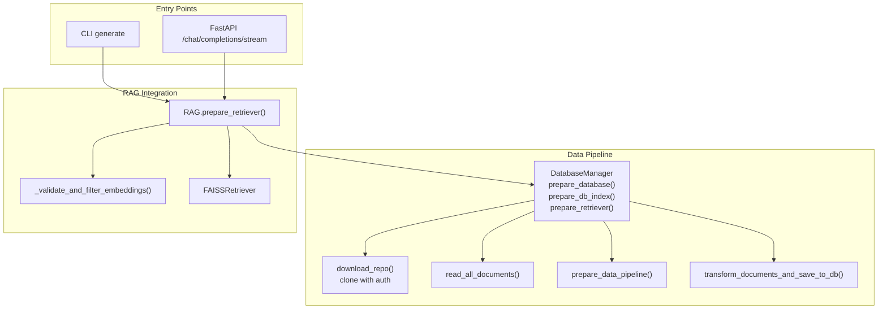
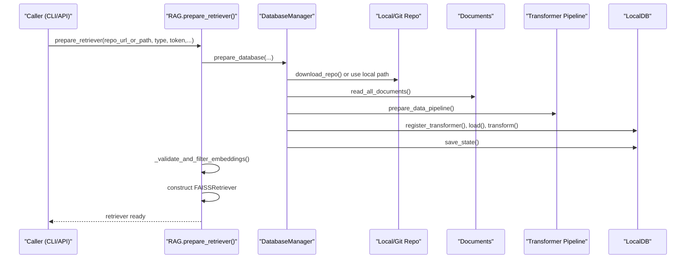
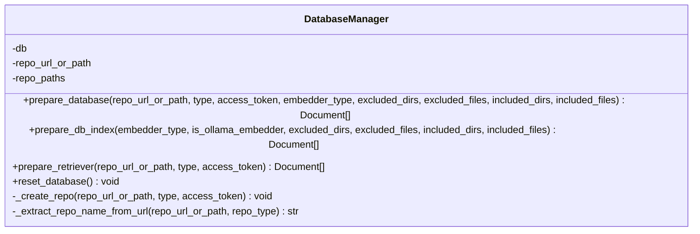
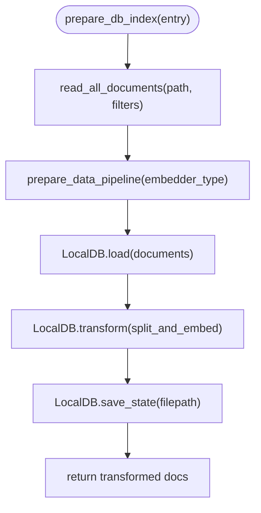
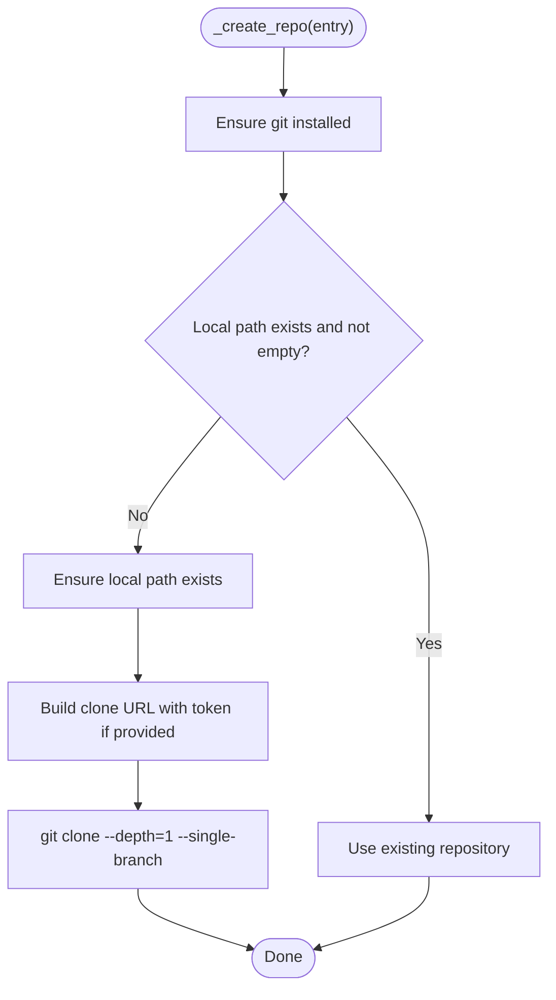
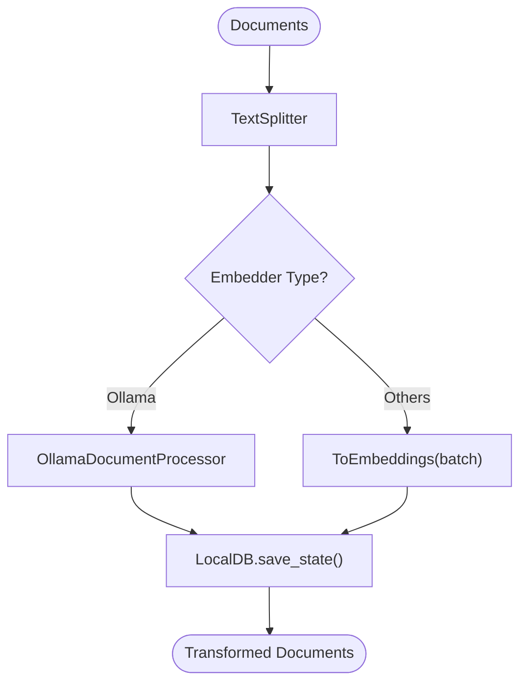
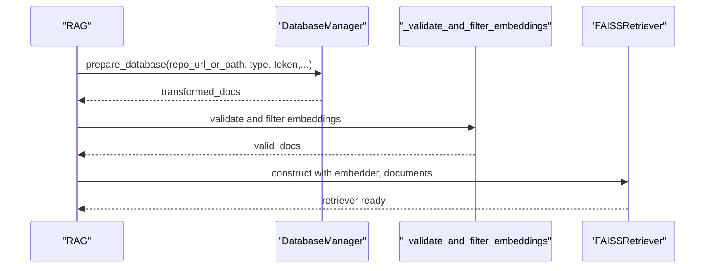
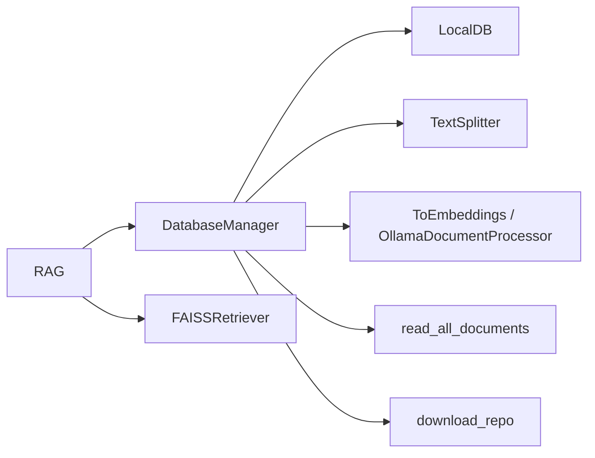

# Database Integration and Persistence

<cite>
**Referenced Files in This Document**
- [data_pipeline.py](file://api/data_pipeline.py)
- [rag.py](file://api/rag.py)
- [cli.py](file://api/cli.py)
- [simple_chat.py](file://api/simple_chat.py)
</cite>

## Table of Contents
1. [Introduction](#introduction)
2. [Project Structure](#project-structure)
3. [Core Components](#core-components)
4. [Architecture Overview](#architecture-overview)
5. [Detailed Component Analysis](#detailed-component-analysis)
6. [Dependency Analysis](#dependency-analysis)
7. [Performance Considerations](#performance-considerations)
8. [Troubleshooting Guide](#troubleshooting-guide)
9. [Conclusion](#conclusion)
10. [Appendices](#appendices)

## Introduction
This document explains the LocalDB integration and document persistence system used by the RAG pipeline. It focuses on the DatabaseManager class and its methods for preparing databases, building indices, and preparing retrievers. It also covers repository creation for both local paths and remote URLs (with authentication), document transformation and persistence, and the unique repository identifier generation. Finally, it describes integration with the broader RAG system, caching via persisted LocalDB states, and performance optimization strategies.

## Project Structure
The database integration spans several modules:
- api/data_pipeline.py: Defines DatabaseManager, repository cloning/download helpers, document reading and transformation, and LocalDB persistence.
- api/rag.py: Integrates DatabaseManager into the RAG component lifecycle, validates embeddings, and constructs the FAISS retriever.
- api/cli.py: Provides a CLI entry point to generate embeddings and wiki content using the RAG pipeline.
- api/simple_chat.py: Exposes a streaming chat API that prepares retrievers and streams answers augmented by retrieved context.

**Diagram sources**
- [data_pipeline.py](file://api/data_pipeline.py#L103-L175)
- [data_pipeline.py](file://api/data_pipeline.py#L177-L406)
- [data_pipeline.py](file://api/data_pipeline.py#L408-L476)
- [data_pipeline.py](file://api/data_pipeline.py#L737-L917)
- [rag.py](file://api/rag.py#L345-L415)
- [cli.py](file://api/cli.py#L119-L183)
- [simple_chat.py](file://api/simple_chat.py#L114-L129)

**Section sources**
- [data_pipeline.py](file://api/data_pipeline.py#L103-L175)
- [data_pipeline.py](file://api/data_pipeline.py#L177-L406)
- [data_pipeline.py](file://api/data_pipeline.py#L408-L476)
- [data_pipeline.py](file://api/data_pipeline.py#L737-L917)
- [rag.py](file://api/rag.py#L345-L415)
- [cli.py](file://api/cli.py#L119-L183)
- [simple_chat.py](file://api/simple_chat.py#L114-L129)

## Core Components
- DatabaseManager: Orchestrates repository preparation, document reading, transformation, and LocalDB persistence/loading.
- RAG: Uses DatabaseManager to prepare retrievers, validates embeddings, and builds a FAISSRetriever for retrieval-augmented generation.
- CLI and API: Drive the end-to-end workflow to generate embeddings and serve chat with retrieval.

Key responsibilities:
- Prepare database from a repository URL or local path.
- Clone or reuse repository locally with optional authentication.
- Read and filter documents with inclusion/exclusion rules.
- Transform documents with a text splitter and embedder pipeline.
- Persist and load LocalDB state for reuse.
- Prepare retriever with validated embeddings.

**Section sources**
- [data_pipeline.py](file://api/data_pipeline.py#L737-L917)
- [rag.py](file://api/rag.py#L345-L415)

## Architecture Overview
The system integrates repository ingestion, document transformation, and retrieval construction:

**Diagram sources**
- [rag.py](file://api/rag.py#L345-L381)
- [data_pipeline.py](file://api/data_pipeline.py#L747-L776)
- [data_pipeline.py](file://api/data_pipeline.py#L103-L175)
- [data_pipeline.py](file://api/data_pipeline.py#L177-L406)
- [data_pipeline.py](file://api/data_pipeline.py#L408-L476)

## Detailed Component Analysis

### DatabaseManager Class
DatabaseManager encapsulates the lifecycle of preparing a LocalDB-backed document store from a repository.

- Methods:
  - prepare_database: Orchestrates repository setup and index preparation.
  - prepare_db_index: Reads documents, applies filters, transforms, and persists LocalDB state.
  - prepare_retriever: Compatibility wrapper delegating to prepare_database.
  - reset_database: Clears internal state.
  - _create_repo: Internal helper to clone or reuse repository.
  - _extract_repo_name_from_url: Generates a unique identifier for the repository.

**Diagram sources**
- [data_pipeline.py](file://api/data_pipeline.py#L737-L917)

**Section sources**
- [data_pipeline.py](file://api/data_pipeline.py#L737-L917)

#### Method: prepare_database
- Resets state, ensures repository availability, and delegates to prepare_db_index.
- Supports embedder selection and inclusion/exclusion filters.

**Section sources**
- [data_pipeline.py](file://api/data_pipeline.py#L747-L776)

#### Method: prepare_db_index
- Reads documents from disk with inclusion/exclusion logic.
- Builds a transformation pipeline (TextSplitter + ToEmbeddings or OllamaDocumentProcessor).
- Loads documents into LocalDB, runs transformation, and saves state to disk.

**Diagram sources**
- [data_pipeline.py](file://api/data_pipeline.py#L177-L406)
- [data_pipeline.py](file://api/data_pipeline.py#L408-L476)

**Section sources**
- [data_pipeline.py](file://api/data_pipeline.py#L850-L902)

#### Method: prepare_retriever
- Compatibility alias that forwards to prepare_database.

**Section sources**
- [data_pipeline.py](file://api/data_pipeline.py#L904-L917)

#### Method: reset_database
- Clears internal state to allow fresh preparation.

**Section sources**
- [data_pipeline.py](file://api/data_pipeline.py#L778-L784)

#### Method: _create_repo
- Clones remote repositories with authentication support for GitHub, GitLab, and Bitbucket.
- Reuses existing local directories if already present.

**Diagram sources**
- [data_pipeline.py](file://api/data_pipeline.py#L103-L175)

**Section sources**
- [data_pipeline.py](file://api/data_pipeline.py#L103-L175)

#### Method: _extract_repo_name_from_url
- Derives a unique identifier from repository URL or path for persistence and indexing.

**Section sources**
- [data_pipeline.py](file://api/data_pipeline.py#L786-L799)

### Repository Creation and Authentication
- Remote URLs: Uses git clone with depth and single-branch for speed; injects credentials according to provider type.
- Private repositories: Supports GitHub (token@domain), GitLab (oauth2:token), and Bitbucket (x-token-auth:token).
- Local paths: Reuse existing directories; skip cloning.

**Section sources**
- [data_pipeline.py](file://api/data_pipeline.py#L103-L175)

### Document Transformation Workflow
- TextSplitter: Splits documents into chunks.
- ToEmbeddings or OllamaDocumentProcessor: Applies embeddings depending on provider.
- Token counting and limits: Enforces provider-specific token limits to avoid oversized inputs.

**Diagram sources**
- [data_pipeline.py](file://api/data_pipeline.py#L408-L476)
- [data_pipeline.py](file://api/data_pipeline.py#L431-L449)

**Section sources**
- [data_pipeline.py](file://api/data_pipeline.py#L408-L476)

### Database State Saving and Loading
- LocalDB.save_state(filepath): Persists the transformed dataset to disk.
- LocalDB.load_state(filepath): Loads a previously saved state for quick reuse.
- The pipeline saves after transformation and can be reused by subsequent retriever preparations.

**Section sources**
- [data_pipeline.py](file://api/data_pipeline.py#L452-L476)
- [data_pipeline.py](file://api/data_pipeline.py#L876-L880)

### Unique Repository Identifier Generation
- Derived from repository URL or path to form a stable identifier for persistence and indexing.

**Section sources**
- [data_pipeline.py](file://api/data_pipeline.py#L786-L799)

### Integration with the RAG System
- RAG.prepare_retriever calls DatabaseManager.prepare_database and validates embeddings.
- Constructs a FAISSRetriever using the validated documents and query embedder.
- Handles embedding size validation and error reporting for inconsistent vectors.

**Diagram sources**
- [rag.py](file://api/rag.py#L345-L415)

**Section sources**
- [rag.py](file://api/rag.py#L345-L415)

### Cache Management and Persistence
- LocalDB state caching: After transformation, the system writes a persistent state to disk for reuse.
- Subsequent retriever preparations can leverage existing states to avoid recomputation.

**Section sources**
- [data_pipeline.py](file://api/data_pipeline.py#L452-L476)
- [data_pipeline.py](file://api/data_pipeline.py#L876-L880)

## Dependency Analysis
- DatabaseManager depends on:
  - LocalDB for transformation and persistence.
  - TextSplitter and ToEmbeddings/OllamaDocumentProcessor for transformation.
  - read_all_documents for document ingestion.
  - download_repo for remote cloning.
- RAG depends on DatabaseManager and FAISSRetriever for retrieval.

**Diagram sources**
- [data_pipeline.py](file://api/data_pipeline.py#L408-L476)
- [data_pipeline.py](file://api/data_pipeline.py#L177-L406)
- [data_pipeline.py](file://api/data_pipeline.py#L103-L175)
- [rag.py](file://api/rag.py#L384-L390)

**Section sources**
- [data_pipeline.py](file://api/data_pipeline.py#L408-L476)
- [data_pipeline.py](file://api/data_pipeline.py#L177-L406)
- [data_pipeline.py](file://api/data_pipeline.py#L103-L175)
- [rag.py](file://api/rag.py#L384-L390)

## Performance Considerations
- Shallow clone: Uses single-branch and shallow depth to reduce clone time and disk usage.
- Inclusion/exclusion filters: Reduce processing scope to relevant files and directories.
- Batch embeddings: ToEmbeddings uses configurable batch size to optimize throughput.
- Token limits: Enforces provider-specific limits to prevent oversized inputs.
- LocalDB caching: Avoids repeated transformations and embeddings for the same repository.
- Ollama handling: Single-string embedding for Ollama to align with its constraints.

[No sources needed since this section provides general guidance]

## Troubleshooting Guide
Common issues and resolutions:
- Authentication failures for private repositories:
  - Verify token format and provider-specific injection (GitHub, GitLab, Bitbucket).
  - Ensure network access and correct domain for enterprise instances.
- Large files exceeding token limits:
  - Adjust inclusion/exclusion filters to exclude large binaries or docs.
  - Review token counting logic and limits per provider.
- Inconsistent embedding sizes:
  - Use the built-in validation to filter out mismatched vectors.
  - Retry after fixing or excluding problematic files.
- Retrieval errors:
  - Confirm that transformed_docs are not empty after validation.
  - Check FAISSRetriever construction and embedder compatibility.
- CLI/API errors:
  - Inspect HTTP exceptions raised for retriever preparation and embedding validation.

**Section sources**
- [data_pipeline.py](file://api/data_pipeline.py#L103-L175)
- [data_pipeline.py](file://api/data_pipeline.py#L177-L406)
- [rag.py](file://api/rag.py#L374-L414)
- [simple_chat.py](file://api/simple_chat.py#L114-L129)

## Conclusion
The LocalDB integration provides a robust, reusable pipeline for ingesting repositories, transforming documents, and persisting states for efficient retrieval. DatabaseManager centralizes repository handling, document ingestion, transformation, and persistence. RAG leverages this pipeline to validate embeddings and construct a FAISSRetriever for retrieval-augmented generation. With shallow cloning, batching, and caching, the system balances performance and usability across diverse repository sizes and providers.

[No sources needed since this section summarizes without analyzing specific files]

## Appendices

### Practical Examples

- Database initialization and persistence:
  - Use prepare_database to create or update a LocalDB-backed index for a repository.
  - The system persists the transformed state to disk for reuse.

- Repository URL processing:
  - For GitHub/GitLab/Bitbucket URLs, the system injects tokens appropriately and clones with depth and single-branch.
  - For local paths, it reuses existing directories.

- Troubleshooting common issues:
  - Authentication: Ensure correct token format and provider-specific URL injection.
  - Embedding mismatches: Use the validation step to filter invalid vectors.
  - Large inputs: Narrow down file filters to reduce token counts.

**Section sources**
- [data_pipeline.py](file://api/data_pipeline.py#L747-L776)
- [data_pipeline.py](file://api/data_pipeline.py#L103-L175)
- [data_pipeline.py](file://api/data_pipeline.py#L452-L476)
- [rag.py](file://api/rag.py#L374-L414)