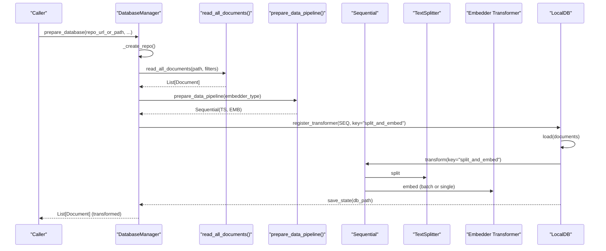
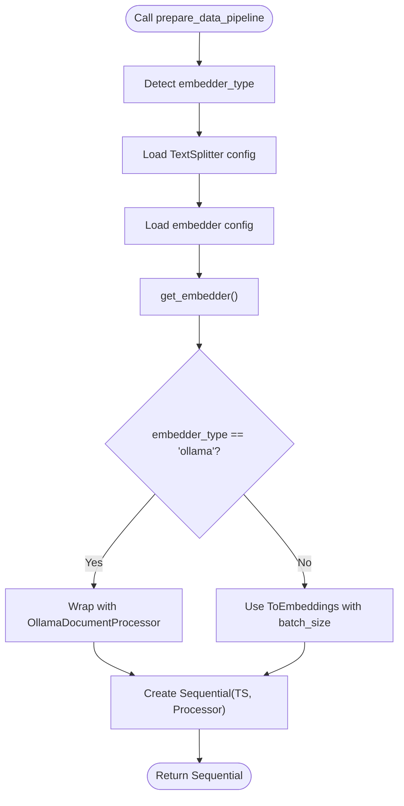
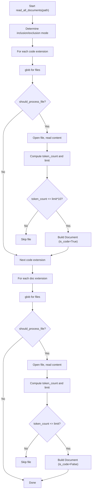
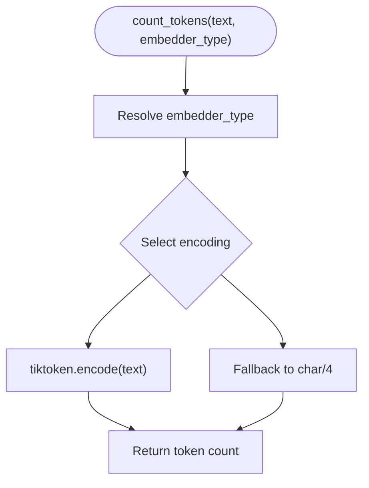
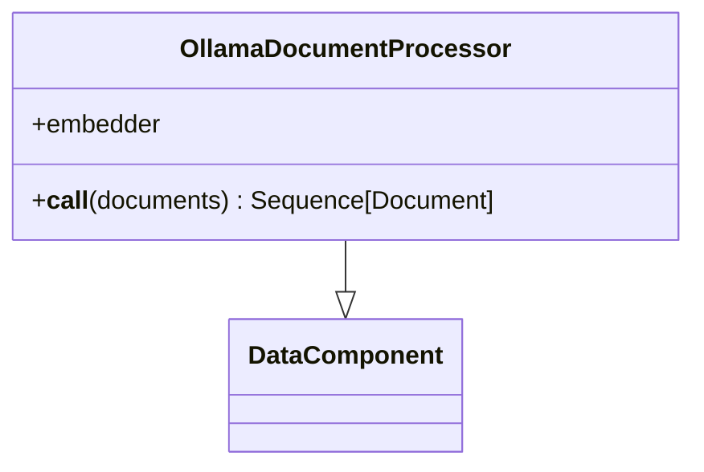
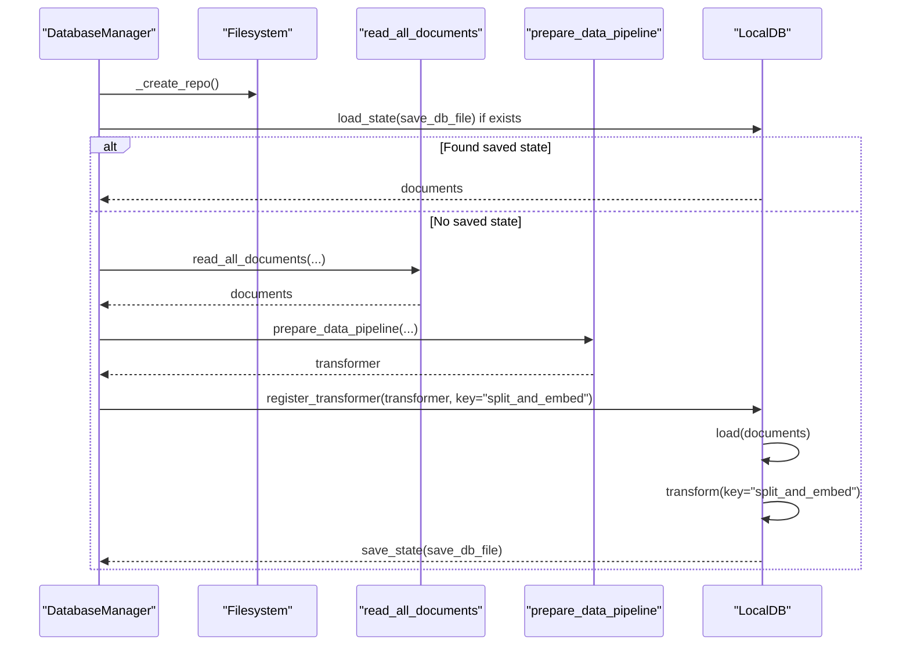
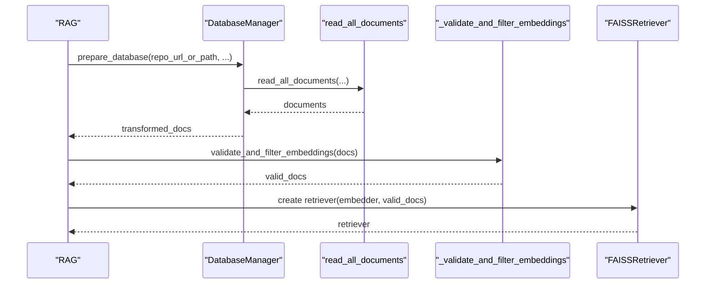
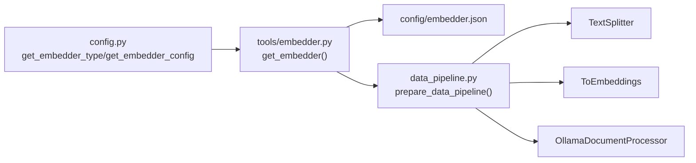

# Document Transformation Pipeline

<cite>
**Referenced Files in This Document**
- [data_pipeline.py](file://api/data_pipeline.py)
- [rag.py](file://api/rag.py)
- [embedder.py](file://api/tools/embedder.py)
- [ollama_patch.py](file://api/ollama_patch.py)
- [config.py](file://api/config.py)
- [embedder.json](file://api/config/embedder.json)
- [test_all_embedders.py](file://tests/unit/test_all_embedders.py)
</cite>

## Table of Contents
1. [Introduction](#introduction)
2. [Project Structure](#project-structure)
3. [Core Components](#core-components)
4. [Architecture Overview](#architecture-overview)
5. [Detailed Component Analysis](#detailed-component-analysis)
6. [Dependency Analysis](#dependency-analysis)
7. [Performance Considerations](#performance-considerations)
8. [Troubleshooting Guide](#troubleshooting-guide)
9. [Conclusion](#conclusion)
10. [Appendices](#appendices)

## Introduction
This document explains the document transformation pipeline system used to prepare, split, embed, and persist repository documents for retrieval-augmented generation (RAG). It focuses on:
- The prepare_data_pipeline function and the Sequential transformer architecture combining TextSplitter and ToEmbeddings components
- The document reading process using read_all_documents, including file filtering logic for code and documentation files
- The token counting mechanism using count_tokens and provider-specific token limits
- The OllamaDocumentProcessor integration for single-document processing versus batch processing for other providers
- Practical examples of pipeline configuration, document preprocessing workflows, and performance optimization strategies

## Project Structure
The pipeline spans several modules:
- Data ingestion and transformation: api/data_pipeline.py
- Retrieval and RAG orchestration: api/rag.py
- Embedder factory and provider configuration: api/tools/embedder.py and api/config.py
- Ollama-specific processing: api/ollama_patch.py
- Configuration files: api/config/embedder.json

```mermaid
graph TB
subgraph "Data Ingestion"
DP["data_pipeline.py"]
DBM["DatabaseManager<br/>prepare_db_index()"]
RAD["read_all_documents()"]
end
subgraph "Transformation"
SEQ["prepare_data_pipeline()<br/>Sequential(TextSplitter, ToEmbeddings/OllamaDocumentProcessor)"]
TS["TextSplitter"]
TE["ToEmbeddings"]
ODP["OllamaDocumentProcessor"]
end
subgraph "Embedding"
EMB["get_embedder()"]
CFG["config.py<br/>get_embedder_config()"]
EJ["embedder.json"]
end
subgraph "RAG"
RAG["RAG.prepare_retriever()"]
end
DP --> DBM
DBM --> RAD
RAD --> SEQ
SEQ --> TS
SEQ --> TE
SEQ --> ODP
EMB --> CFG
CFG --> EJ
RAG --> DBM
```

**Diagram sources**
- [data_pipeline.py](file://api/data_pipeline.py#L851-L902)
- [rag.py](file://api/rag.py#L345-L381)
- [embedder.py](file://api/tools/embedder.py#L6-L59)
- [config.py](file://api/config.py#L183-L198)
- [embedder.json](file://api/config/embedder.json#L1-L35)

**Section sources**
- [data_pipeline.py](file://api/data_pipeline.py#L1-L120)
- [rag.py](file://api/rag.py#L153-L243)
- [embedder.py](file://api/tools/embedder.py#L6-L59)
- [config.py](file://api/config.py#L183-L198)
- [embedder.json](file://api/config/embedder.json#L1-L35)

## Core Components
- prepare_data_pipeline: Builds a Sequential transformer chaining TextSplitter and an embedder transformer (ToEmbeddings for most providers, OllamaDocumentProcessor for Ollama).
- read_all_documents: Reads code and documentation files from a repository path, applies inclusion/exclusion filters, and computes token counts per file.
- count_tokens and get_embedding_token_limit: Token counting and provider-specific token limits.
- OllamaDocumentProcessor: Single-document embedding processor for Ollama due to lack of batch support in the underlying client.
- DatabaseManager: Orchestrates repository cloning, document reading, transformation, and persistence.

**Section sources**
- [data_pipeline.py](file://api/data_pipeline.py#L408-L450)
- [data_pipeline.py](file://api/data_pipeline.py#L177-L406)
- [data_pipeline.py](file://api/data_pipeline.py#L37-L59)
- [ollama_patch.py](file://api/ollama_patch.py#L62-L105)
- [data_pipeline.py](file://api/data_pipeline.py#L851-L902)

## Architecture Overview
The pipeline follows a staged flow:
1. Repository preparation: DatabaseManager downloads/clones repository and prepares paths.
2. Document reading: read_all_documents enumerates code and documentation files, applies filters, and constructs Document objects with metadata and token counts.
3. Pipeline construction: prepare_data_pipeline selects TextSplitter and embedder transformer based on provider type.
4. Transformation: Documents are split into chunks and embedded; Ollama uses single-document processing.
5. Persistence: LocalDB stores transformed documents for retrieval.



**Diagram sources**
- [data_pipeline.py](file://api/data_pipeline.py#L851-L902)
- [data_pipeline.py](file://api/data_pipeline.py#L177-L406)
- [data_pipeline.py](file://api/data_pipeline.py#L408-L450)

## Detailed Component Analysis

### prepare_data_pipeline: Sequential Transformer Architecture
- Purpose: Construct a Sequential pipeline that first splits text into chunks and then embeds them.
- Inputs: embedder_type (optional) to select provider configuration.
- Behavior:
  - Loads TextSplitter configuration from configs["text_splitter"].
  - Resolves embedder via get_embedder_config() and get_embedder().
  - For Ollama: wraps the embedder with OllamaDocumentProcessor for single-document processing.
  - For other providers: uses ToEmbeddings with a configurable batch_size from embedder configuration.
- Output: An adal.Sequential transformer ready to transform Document sequences.



**Diagram sources**
- [data_pipeline.py](file://api/data_pipeline.py#L408-L450)
- [embedder.py](file://api/tools/embedder.py#L6-L59)
- [config.py](file://api/config.py#L183-L198)
- [embedder.json](file://api/config/embedder.json#L30-L34)

**Section sources**
- [data_pipeline.py](file://api/data_pipeline.py#L408-L450)
- [embedder.py](file://api/tools/embedder.py#L6-L59)
- [config.py](file://api/config.py#L183-L198)
- [embedder.json](file://api/config/embedder.json#L30-L34)

### read_all_documents: Document Reading and Filtering
- Purpose: Recursively read code and documentation files from a path, apply inclusion/exclusion filters, compute token counts, and construct Document objects.
- File categories:
  - Code files: prioritized extensions (.py, .js, .ts, .java, .cpp, .c, .h, .hpp, .go, .rs, .jsx, .tsx, .html, .css, .php, .swift, .cs)
  - Documentation files: extensions (.md, .txt, .rst, .json, .yaml, .yml)
- Filtering modes:
  - Inclusion mode: only files in included_dirs or matching included_files are processed.
  - Exclusion mode: default exclusions plus any additional excluded_dirs/excluded_files; defaults come from configuration.
- Implementation highlights:
  - Uses glob patterns to discover files by extension.
  - Applies should_process_file to enforce inclusion/exclusion rules.
  - Computes token_count per file using count_tokens and compares against provider-specific limits.
  - Sets metadata: file_path, type, is_code, is_implementation, title, token_count.



**Diagram sources**
- [data_pipeline.py](file://api/data_pipeline.py#L177-L406)

**Section sources**
- [data_pipeline.py](file://api/data_pipeline.py#L177-L406)

### Token Counting and Provider-Specific Limits
- count_tokens:
  - Determines embedder_type if not provided.
  - Selects encoding based on provider: cl100k_base for Ollama/Google; text-embedding-3-small for OpenAI.
  - Falls back to a character-based approximation if tiktoken fails.
- get_embedding_token_limit:
  - Returns provider-specific token limits for embedding models.
  - Supported providers: openai, github_copilot, google, dashscope, ollama.
- Usage:
  - read_all_documents uses these functions to skip oversized files before embedding.



**Diagram sources**
- [data_pipeline.py](file://api/data_pipeline.py#L61-L101)
- [data_pipeline.py](file://api/data_pipeline.py#L37-L59)

**Section sources**
- [data_pipeline.py](file://api/data_pipeline.py#L61-L101)
- [data_pipeline.py](file://api/data_pipeline.py#L37-L59)

### OllamaDocumentProcessor: Single-Document vs Batch Processing
- Motivation: The underlying Ollama client does not support batch embeddings; each document must be embedded individually.
- Behavior:
  - Processes documents sequentially with progress indication.
  - Validates embedding size consistency across documents.
  - Skips documents with inconsistent or missing embeddings.
  - Returns only successfully processed documents.



**Diagram sources**
- [ollama_patch.py](file://api/ollama_patch.py#L62-L105)

**Section sources**
- [ollama_patch.py](file://api/ollama_patch.py#L62-L105)
- [data_pipeline.py](file://api/data_pipeline.py#L437-L445)

### DatabaseManager: Orchestration and Persistence
- Responsibilities:
  - Prepare repository storage (download or use local path).
  - Load or create a LocalDB state keyed by "split_and_embed".
  - Read documents, transform them, and persist to disk.
- Methods:
  - _create_repo: resolves repository paths and ensures directories exist.
  - prepare_db_index: orchestrates read_all_documents and transform_documents_and_save_to_db.
  - prepare_retriever: compatibility wrapper around prepare_database.



**Diagram sources**
- [data_pipeline.py](file://api/data_pipeline.py#L851-L902)

**Section sources**
- [data_pipeline.py](file://api/data_pipeline.py#L801-L902)

### RAG Integration and Retrieval
- RAG.prepare_retriever integrates with the pipeline by:
  - Initializing DatabaseManager.
  - Preparing documents via prepare_database.
  - Validating and filtering embeddings to ensure consistent sizes.
  - Creating a FAISSRetriever with the appropriate embedder (single-string for Ollama, batch for others).



**Diagram sources**
- [rag.py](file://api/rag.py#L345-L381)
- [rag.py](file://api/rag.py#L251-L343)

**Section sources**
- [rag.py](file://api/rag.py#L345-L381)
- [rag.py](file://api/rag.py#L251-L343)

## Dependency Analysis
- Embedder resolution:
  - get_embedder_type determines the provider type from configuration.
  - get_embedder_config selects the appropriate embedder configuration.
  - get_embedder constructs the embedder instance with model_client and model_kwargs.
- Configuration:
  - embedder.json defines provider-specific configurations, including batch_size and text_splitter parameters.
  - config.py loads and merges configuration files, exposes helpers for type detection and client mapping.



**Diagram sources**
- [config.py](file://api/config.py#L183-L198)
- [embedder.py](file://api/tools/embedder.py#L6-L59)
- [embedder.json](file://api/config/embedder.json#L1-L35)
- [data_pipeline.py](file://api/data_pipeline.py#L408-L450)

**Section sources**
- [config.py](file://api/config.py#L183-L198)
- [embedder.py](file://api/tools/embedder.py#L6-L59)
- [embedder.json](file://api/config/embedder.json#L1-L35)
- [data_pipeline.py](file://api/data_pipeline.py#L408-L450)

## Performance Considerations
- Chunking strategy:
  - Adjust chunk_size and chunk_overlap in embedder.json to balance recall and cost.
- Batch size:
  - Increase batch_size for providers that support batching (e.g., OpenAI/GitHub Copilot) to improve throughput.
- Token limits:
  - Respect provider-specific token limits to avoid truncation and errors.
- Filtering:
  - Use inclusion/exclusion filters to reduce unnecessary processing and embedding costs.
- Ollama processing:
  - Single-document processing is slower than batch; consider increasing hardware resources or reducing input volume.

[No sources needed since this section provides general guidance]

## Troubleshooting Guide
- Token counting failures:
  - count_tokens falls back to a character-based approximation if tiktoken fails; verify encoding selection and provider type.
- Oversized files:
  - read_all_documents skips files exceeding token limits; adjust limits or split files.
- Ollama model availability:
  - Ensure the model exists on the Ollama host; use check_ollama_model_exists to validate.
- Embedding size mismatches:
  - RAG validates and filters embeddings; inconsistent sizes indicate provider or model misconfiguration.

**Section sources**
- [data_pipeline.py](file://api/data_pipeline.py#L61-L101)
- [data_pipeline.py](file://api/data_pipeline.py#L348-L353)
- [data_pipeline.py](file://api/data_pipeline.py#L383-L388)
- [ollama_patch.py](file://api/ollama_patch.py#L21-L60)
- [rag.py](file://api/rag.py#L251-L343)

## Conclusion
The document transformation pipeline combines robust document ingestion, intelligent filtering, provider-aware token handling, and flexible embedding strategies. By leveraging Sequential transformers and provider-specific processors, it supports scalable preprocessing for RAG systems across multiple embedding providers, with special handling for Ollama’s single-document constraint.

[No sources needed since this section summarizes without analyzing specific files]

## Appendices

### Practical Configuration Examples
- Provider selection:
  - Set DEEPWIKI_EMBEDDER_TYPE to openai, google, github_copilot, or ollama to control pipeline behavior.
- Text splitting:
  - Modify chunk_size and chunk_overlap in embedder.json under text_splitter.
- Batch size:
  - Adjust batch_size in embedder.json for providers that support batching.
- Filters:
  - Use DatabaseManager.prepare_database with included_dirs/included_files or excluded_dirs/excluded_files to tailor coverage.

**Section sources**
- [config.py](file://api/config.py#L55)
- [embedder.json](file://api/config/embedder.json#L30-L34)
- [data_pipeline.py](file://api/data_pipeline.py#L851-L902)

### Validation and Testing
- Unit tests demonstrate:
  - Embedder configuration loading and type detection.
  - Token counting and pipeline preparation across providers.
  - Environment variable-driven embedder selection.

**Section sources**
- [test_all_embedders.py](file://tests/unit/test_all_embedders.py#L84-L138)
- [test_all_embedders.py](file://tests/unit/test_all_embedders.py#L240-L279)
- [test_all_embedders.py](file://tests/unit/test_all_embedders.py#L313-L354)