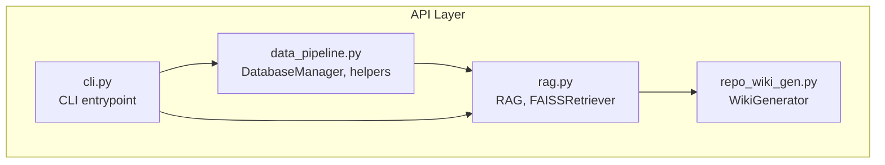
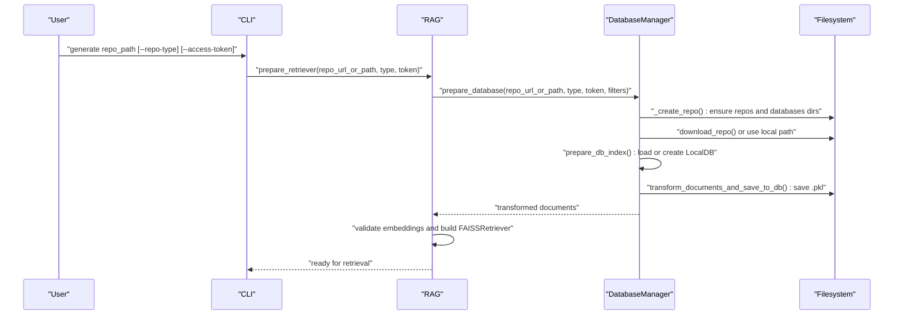
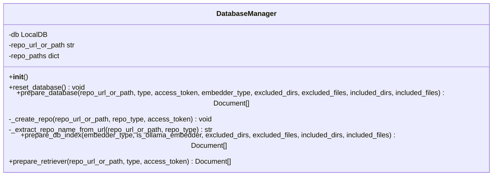
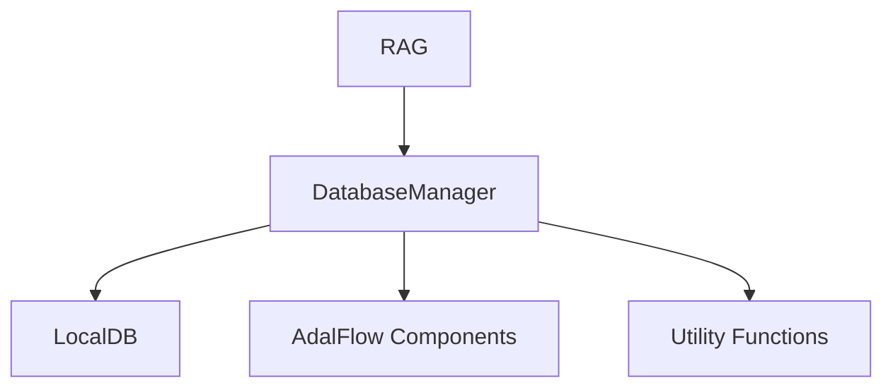

# LocalDB Management and State Persistence

<cite>
**Referenced Files in This Document**
- [data_pipeline.py](file://api/data_pipeline.py)
- [rag.py](file://api/rag.py)
- [cli.py](file://api/cli.py)
- [repo_wiki_gen.py](file://api/repo_wiki_gen.py)
</cite>

## Table of Contents
1. [Introduction](#introduction)
2. [Project Structure](#project-structure)
3. [Core Components](#core-components)
4. [Architecture Overview](#architecture-overview)
5. [Detailed Component Analysis](#detailed-component-analysis)
6. [Dependency Analysis](#dependency-analysis)
7. [Performance Considerations](#performance-considerations)
8. [Troubleshooting Guide](#troubleshooting-guide)
9. [Conclusion](#conclusion)
10. [Appendices](#appendices)

## Introduction
This document explains the LocalDB management system and state persistence used by the RAG pipeline. It focuses on the DatabaseManager class and its methods for preparing databases, indexing documents, and preparing retrievers. It also covers repository creation for both local paths and remote URLs, including Git repository cloning with authentication support, document transformation workflows, database state saving and loading, and the unique repository identifier generation. Finally, it describes integration with the broader RAG system, cache management via persistent database files, and performance optimization strategies.

## Project Structure
The LocalDB management and state persistence logic is primarily implemented in the data pipeline module and consumed by the RAG component. The CLI integrates these capabilities to provide a command-line interface for generating embeddings and wiki content.

**Diagram sources**
- [data_pipeline.py](file://api/data_pipeline.py#L737-L917)
- [rag.py](file://api/rag.py#L153-L446)
- [cli.py](file://api/cli.py#L1-L384)
- [repo_wiki_gen.py](file://api/repo_wiki_gen.py#L1-L550)

**Section sources**
- [data_pipeline.py](file://api/data_pipeline.py#L1-L917)
- [rag.py](file://api/rag.py#L1-L446)
- [cli.py](file://api/cli.py#L1-L384)
- [repo_wiki_gen.py](file://api/repo_wiki_gen.py#L1-L550)

## Core Components
- DatabaseManager: Orchestrates repository preparation, document reading, transformation, and LocalDB state persistence.
- RAG: Integrates DatabaseManager to build a retriever and perform retrieval-augmented generation.
- CLI: Provides a command-line entrypoint to trigger embedding generation and wiki creation.
- WikiGenerator: Generates wiki structure and content using repository information and RAG context.

Key responsibilities:
- Prepare database: clone or use local repo, compute unique repo name, persist to LocalDB.
- Prepare DB index: load existing database if available, otherwise read documents, transform, and save.
- Prepare retriever: ensure database readiness and construct FAISSRetriever for queries.

**Section sources**
- [data_pipeline.py](file://api/data_pipeline.py#L737-L917)
- [rag.py](file://api/rag.py#L153-L446)
- [cli.py](file://api/cli.py#L92-L182)
- [repo_wiki_gen.py](file://api/repo_wiki_gen.py#L63-L123)

## Architecture Overview
The system follows a layered architecture:
- CLI triggers RAG preparation.
- RAG delegates to DatabaseManager for database lifecycle.
- DatabaseManager manages repository storage and LocalDB state.
- RAG constructs a retriever from the persisted database and performs retrieval.

**Diagram sources**
- [cli.py](file://api/cli.py#L172-L182)
- [rag.py](file://api/rag.py#L345-L381)
- [data_pipeline.py](file://api/data_pipeline.py#L747-L902)

## Detailed Component Analysis

### DatabaseManager Class
DatabaseManager encapsulates the lifecycle of repository preparation, document transformation, and LocalDB persistence.

**Diagram sources**
- [data_pipeline.py](file://api/data_pipeline.py#L737-L917)

Key methods and responsibilities:
- prepare_database: Resets state, prepares repository, and returns prepared documents by delegating to prepare_db_index.
- _create_repo: Computes unique repository name, ensures repos and databases directories exist, clones remote repositories with authentication, or uses local paths.
- prepare_db_index: Loads existing LocalDB if present; otherwise reads documents, transforms, and persists to disk.
- prepare_retriever: Compatibility wrapper delegating to prepare_database.

Unique repository identifier generation:
- _extract_repo_name_from_url: Parses owner and repo from URLs for supported providers and falls back to basename for local paths.

Repository creation process:
- Remote URLs: Uses download_repo with provider-specific authentication schemes and shallow clone.
- Local paths: Uses the provided path directly.

Document transformation workflow:
- read_all_documents: Scans directories, applies inclusion/exclusion filters, counts tokens, and builds Document objects.
- prepare_data_pipeline: Builds a sequential pipeline combining text splitting and embedding transformation.
- transform_documents_and_save_to_db: Registers transformer, loads documents, runs transform, and saves LocalDB state.

Database state saving and loading:
- LocalDB.load_state(filepath) and LocalDB.save_state(filepath) manage persistence of transformed data.

Integration with RAG:
- RAG.prepare_retriever calls DatabaseManager.prepare_database and validates embeddings before constructing FAISSRetriever.

**Section sources**
- [data_pipeline.py](file://api/data_pipeline.py#L737-L917)

### Repository Creation and Authentication
- download_repo: Validates Git availability, checks existing directories, formats provider-specific clone URLs with access tokens, and performs a shallow clone.
- _create_repo: Determines repo name, ensures directories, and either clones or uses local path.

Supported providers and authentication:
- GitHub: Adds token to netloc as user.
- GitLab: Uses oauth2 scheme with token.
- Bitbucket: Uses x-token-auth scheme with token.

**Section sources**
- [data_pipeline.py](file://api/data_pipeline.py#L103-L175)
- [data_pipeline.py](file://api/data_pipeline.py#L801-L849)

### Document Transformation Workflow
- read_all_documents: Applies inclusion/exclusion filters, token counting, and builds Document objects with metadata.
- prepare_data_pipeline: Chooses OllamaDocumentProcessor for single-document processing or ToEmbeddings for batch processing.
- transform_documents_and_save_to_db: Registers transformer, loads, transforms, and persists LocalDB state.

Token limits and provider-specific thresholds:
- get_embedding_token_limit and count_tokens enforce provider-specific token limits and fallbacks.

**Section sources**
- [data_pipeline.py](file://api/data_pipeline.py#L177-L406)
- [data_pipeline.py](file://api/data_pipeline.py#L408-L450)
- [data_pipeline.py](file://api/data_pipeline.py#L452-L476)
- [data_pipeline.py](file://api/data_pipeline.py#L37-L59)
- [data_pipeline.py](file://api/data_pipeline.py#L61-L101)

### Database State Saving and Loading
- prepare_db_index: Attempts to load existing LocalDB; if unavailable or fails, reads documents, transforms, and saves to a .pkl file in the databases directory.
- LocalDB.load_state and LocalDB.save_state: Persist transformed data keyed by "split_and_embed".

Cache management:
- Persistent .pkl files act as cache for transformed documents, avoiding recomputation on subsequent runs.

**Section sources**
- [data_pipeline.py](file://api/data_pipeline.py#L851-L902)

### Integration with the RAG System
- RAG.prepare_retriever: Initializes DatabaseManager, prepares database, validates embeddings, and constructs FAISSRetriever with the configured embedder.
- Embedding validation: Ensures consistent embedding sizes across documents before building the retriever.

**Section sources**
- [rag.py](file://api/rag.py#L345-L415)

### CLI Integration
- CLI generate command: Parses repository info, creates RAG, prepares retriever, and optionally generates wiki content using WikiGenerator.

**Section sources**
- [cli.py](file://api/cli.py#L92-L182)
- [cli.py](file://api/cli.py#L186-L380)

## Dependency Analysis
DatabaseManager depends on:
- LocalDB for state persistence.
- AdalFlow components for text splitting and embeddings.
- Utility functions for repository cloning, document reading, and token counting.
- RAG for retriever construction and embedding validation.

**Diagram sources**
- [data_pipeline.py](file://api/data_pipeline.py#L13-L20)
- [data_pipeline.py](file://api/data_pipeline.py#L737-L917)
- [rag.py](file://api/rag.py#L41-L43)

**Section sources**
- [data_pipeline.py](file://api/data_pipeline.py#L1-L24)
- [rag.py](file://api/rag.py#L1-L47)

## Performance Considerations
- Shallow clone: Uses depth 1 and single branch to reduce clone time and disk usage.
- Token-aware filtering: Skips oversized files to prevent exceeding provider token limits.
- Batch vs single processing: Uses batched embeddings for OpenAI/Google and single-document processing for Ollama to optimize throughput.
- Persistent cache: Reuses saved .pkl files to avoid reprocessing.
- Inclusion/exclusion filters: Reduces processing scope by limiting directories and file patterns.

[No sources needed since this section provides general guidance]

## Troubleshooting Guide
Common issues and resolutions:
- Authentication failures:
  - Verify access token format and provider-specific scheme.
  - Ensure token permissions for private repositories.
- Git errors:
  - Confirm Git installation and network connectivity.
  - Check sanitized error messages for token exposure; tokens are redacted in logs.
- Large files:
  - Adjust inclusion/exclusion filters to skip overly large files.
- Embedding size mismatches:
  - RAG validates embeddings and filters inconsistent sizes; rebuild database if necessary.
- Repository already exists:
  - Existing directories are reused; delete or manage manually if conflicts arise.

**Section sources**
- [data_pipeline.py](file://api/data_pipeline.py#L165-L172)
- [data_pipeline.py](file://api/data_pipeline.py#L348-L353)
- [rag.py](file://api/rag.py#L251-L343)

## Conclusion
The LocalDB management system provides a robust, provider-aware pipeline for repository ingestion, document transformation, and persistent caching. DatabaseManager centralizes repository preparation, indexing, and state persistence, while RAG consumes these artifacts to deliver efficient retrieval. The CLI offers a practical entrypoint for end-to-end workflows, integrating with the broader wiki generation system.

[No sources needed since this section summarizes without analyzing specific files]

## Appendices

### Practical Examples

- Database initialization:
  - Use RAG.prepare_retriever to initialize and prepare the retriever for a repository.
  - Internally, DatabaseManager.prepare_database orchestrates repository setup and index preparation.

- Repository URL processing:
  - For GitHub/GitLab/Bitbucket URLs, authentication is applied automatically based on provider.
  - For local paths, the provided path is used directly.

- Troubleshooting common database integration issues:
  - Authentication failures: confirm token format and provider scheme.
  - Git errors: check Git availability and network; review sanitized error logs.
  - Large files: adjust filters to exclude oversized files.
  - Embedding mismatches: rebuild database after validating and filtering embeddings.

**Section sources**
- [cli.py](file://api/cli.py#L172-L182)
- [data_pipeline.py](file://api/data_pipeline.py#L103-L175)
- [data_pipeline.py](file://api/data_pipeline.py#L801-L849)
- [rag.py](file://api/rag.py#L345-L415)